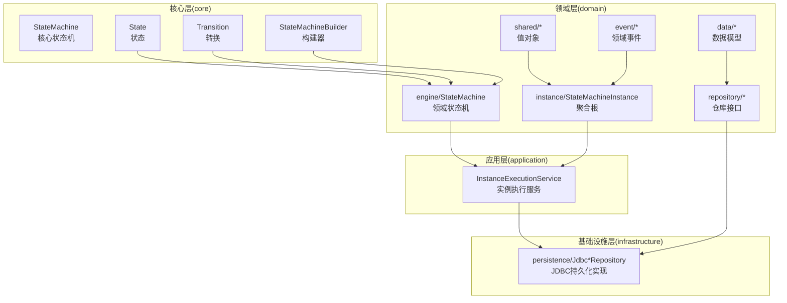
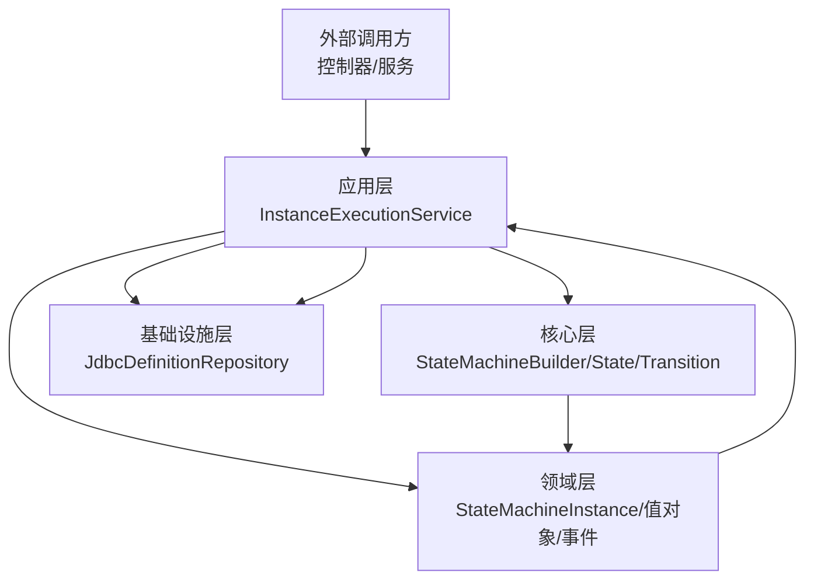
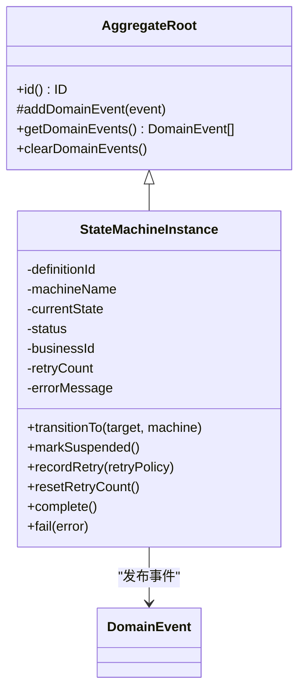
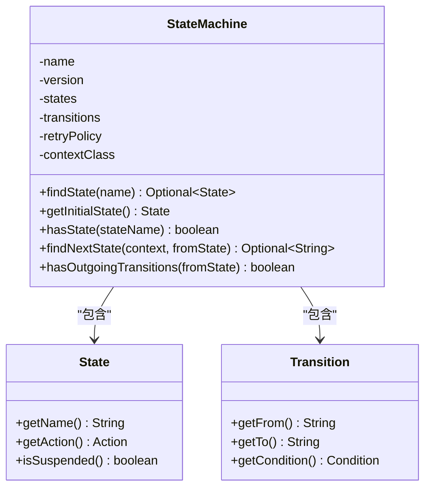
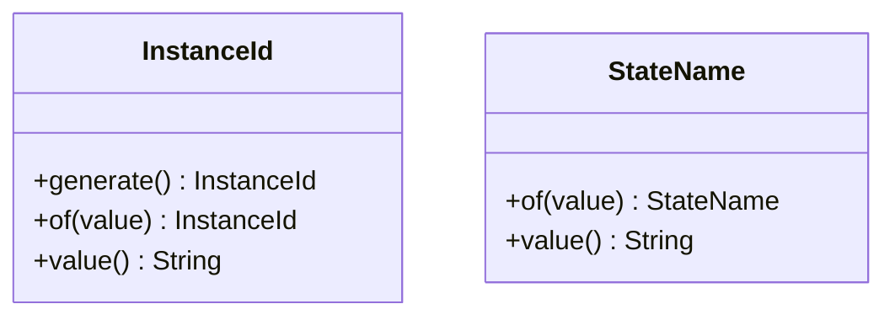
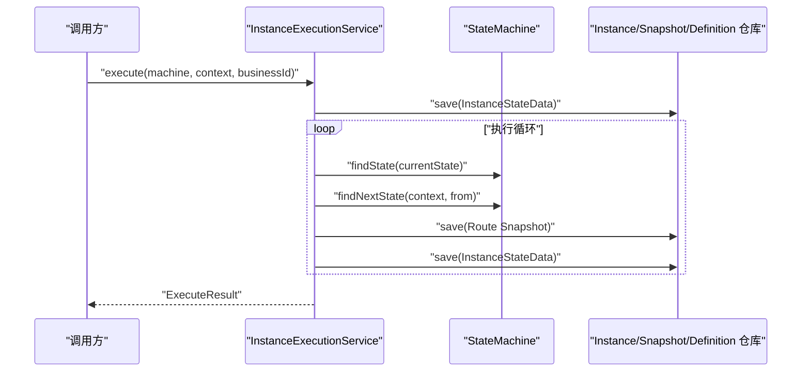
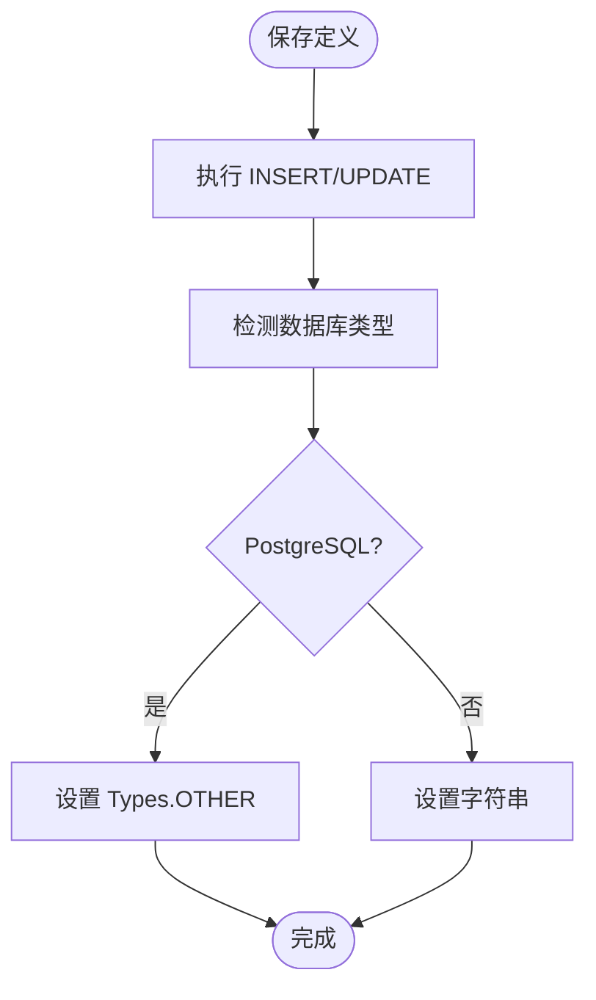
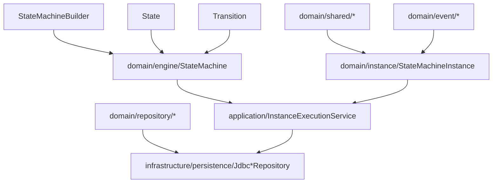

# 领域驱动设计架构

<cite>
**本文档引用的文件**
- [StateMachine.java](file://state-machine-boot-starter/src/main/java/cn/chedejun/statemachine/domain/engine/StateMachine.java)
- [AggregateRoot.java](file://state-machine-boot-starter/src/main/java/cn/chedejun/statemachine/domain/shared/AggregateRoot.java)
- [StateName.java](file://state-machine-boot-starter/src/main/java/cn/chedejun/statemachine/domain/shared/StateName.java)
- [InstanceId.java](file://state-machine-boot-starter/src/main/java/cn/chedejun/statemachine/domain/shared/InstanceId.java)
- [InstanceExecutionService.java](file://state-machine-boot-starter/src/main/java/cn/chedejun/statemachine/application/InstanceExecutionService.java)
- [StateMachineBuilder.java](file://state-machine-boot-starter/src/main/java/cn/chedejun/statemachine/core/StateMachineBuilder.java)
- [StateMachineInstance.java](file://state-machine-boot-starter/src/main/java/cn/chedejun/statemachine/domain/instance/StateMachineInstance.java)
- [DefinitionRepository.java](file://state-machine-boot-starter/src/main/java/cn/chedejun/statemachine/domain/repository/DefinitionRepository.java)
- [DefinitionData.java](file://state-machine-boot-starter/src/main/java/cn/chedejun/statemachine/domain/data/DefinitionData.java)
- [DomainEvent.java](file://state-machine-boot-starter/src/main/java/cn/chedejun/statemachine/domain/shared/DomainEvent.java)
- [State.java](file://state-machine-boot-starter/src/main/java/cn/chedejun/statemachine/core/State.java)
- [Transition.java](file://state-machine-boot-starter/src/main/java/cn/chedejun/statemachine/core/Transition.java)
- [InstanceStartedEvent.java](file://state-machine-boot-starter/src/main/java/cn/chedejun/statemachine/domain/event/InstanceStartedEvent.java)
- [JdbcDefinitionRepository.java](file://state-machine-boot-starter/src/main/java/cn/chedejun/statemachine/infrastructure/persistence/JdbcDefinitionRepository.java)
- [README.md](file://state-machine-boot-starter/README.md)
- [ValueObjectTest.java](file://state-machine-boot-starter/src/test/java/cn/chedejun/statemachine/domain/shared/ValueObjectTest.java)
- [AggregateRootTest.java](file://state-machine-boot-starter/src/test/java/cn/chedejun/statemachine/domain/shared/AggregateRootTest.java)
</cite>

## 目录
1. [引言](#引言)
2. [项目结构](#项目结构)
3. [核心组件](#核心组件)
4. [架构总览](#架构总览)
5. [详细组件分析](#详细组件分析)
6. [依赖分析](#依赖分析)
7. [性能考虑](#性能考虑)
8. [故障排除指南](#故障排除指南)
9. [结论](#结论)
10. [附录](#附录)

## 引言
本项目是一个基于领域驱动设计（DDD）的状态机工作流引擎，采用四层架构：core核心层、domain领域层、application应用层、infrastructure基础设施层。该架构通过清晰的职责边界与交互关系，确保状态机定义、实例执行、持久化与应用服务之间的松耦合与高内聚。

- 核心层（core）：提供状态机构建器、状态、转换、动作、条件、重试策略等基础能力。
- 领域层（domain）：包含聚合根、值对象、领域事件、数据模型以及状态机引擎与实例。
- 应用层（application）：封装执行服务，协调仓库与引擎，处理实例生命周期与重试恢复。
- 基础设施层（infrastructure）：提供数据库持久化实现，负责DDL初始化与数据存取。

DDD原则在本项目中的体现：
- 聚合根（Aggregate Root）：以StateMachineInstance为核心聚合，承载实例状态与领域事件。
- 值对象（Value Object）：InstanceId、StateName、DefinitionId、BusinessId等不可变标识与名称类型，保证语义明确与相等性判断。
- 不可变领域对象：StateMachine作为不可变定义载体，确保状态机定义在运行时稳定不变。
- 领域事件：实例启动、挂起、完成、失败等事件用于解耦与可观测性。

## 项目结构
项目采用按层次划分的目录组织方式，便于理解各层职责与交互路径。

图表来源
- [StateMachine.java:1-77](file://state-machine-boot-starter/src/main/java/cn/chedejun/statemachine/domain/engine/StateMachine.java#L1-L77)
- [StateMachineBuilder.java:1-52](file://state-machine-boot-starter/src/main/java/cn/chedejun/statemachine/core/StateMachineBuilder.java#L1-L52)
- [StateMachineInstance.java:1-81](file://state-machine-boot-starter/src/main/java/cn/chedejun/statemachine/domain/instance/StateMachineInstance.java#L1-L81)
- [InstanceExecutionService.java:1-296](file://state-machine-boot-starter/src/main/java/cn/chedejun/statemachine/application/InstanceExecutionService.java#L1-L296)
- [JdbcDefinitionRepository.java:1-119](file://state-machine-boot-starter/src/main/java/cn/chedejun/statemachine/infrastructure/persistence/JdbcDefinitionRepository.java#L1-L119)

章节来源
- [README.md:1-65](file://state-machine-boot-starter/README.md#L1-L65)

## 核心组件
本节深入解析四层架构中的关键组件及其职责与交互。

- 核心层（core）
  - StateMachineBuilder：用于构建不可变的状态机定义，支持状态、转换、重试策略与上下文类型配置。
  - State：表示状态节点，包含名称、动作与是否挂起标志。
  - Transition：表示状态间的转换，包含来源、目标与条件。
  - StateMachine：不可变的领域对象，持有状态集合、转换规则与重试策略，提供状态查询与路由决策。

- 领域层（domain）
  - AggregateRoot：抽象基类，维护领域事件列表与不可变事件视图，支持事件收集与清理。
  - StateMachineInstance：聚合根，封装实例的定义ID、机器名、当前状态、业务ID、重试计数与错误信息；提供状态迁移、挂起、重试与终止等操作，并发布领域事件。
  - 值对象：InstanceId、StateName、DefinitionId、BusinessId、MachineName等，均不可变且通过工厂方法或静态of生成，保证类型安全与相等性。
  - 领域事件：InstanceStartedEvent、InstanceSuspendedEvent、InstanceCompletedEvent、InstanceFailedEvent等，用于表达聚合根内部发生的业务事件。
  - 数据模型：DefinitionData等，用于持久化存储状态机定义的序列化数据。

- 应用层（application）
  - InstanceExecutionService：应用服务，负责实例创建、执行循环、重试与恢复、快照记录与状态更新；协调仓库与引擎，处理异常与边界条件。

- 基础设施层（infrastructure）
  - JdbcDefinitionRepository：基于JDBC的定义仓库实现，支持保存、更新、按名称版本查询与全量查询，适配不同数据库的JSON列类型。

章节来源
- [StateMachineBuilder.java:1-52](file://state-machine-boot-starter/src/main/java/cn/chedejun/statemachine/core/StateMachineBuilder.java#L1-L52)
- [State.java:1-23](file://state-machine-boot-starter/src/main/java/cn/chedejun/statemachine/core/State.java#L1-L23)
- [Transition.java:1-20](file://state-machine-boot-starter/src/main/java/cn/chedejun/statemachine/core/Transition.java#L1-L20)
- [StateMachine.java:1-77](file://state-machine-boot-starter/src/main/java/cn/chedejun/statemachine/domain/engine/StateMachine.java#L1-L77)
- [AggregateRoot.java:1-29](file://state-machine-boot-starter/src/main/java/cn/chedejun/statemachine/domain/shared/AggregateRoot.java#L1-L29)
- [StateMachineInstance.java:1-81](file://state-machine-boot-starter/src/main/java/cn/chedejun/statemachine/domain/instance/StateMachineInstance.java#L1-L81)
- [StateName.java:1-25](file://state-machine-boot-starter/src/main/java/cn/chedejun/statemachine/domain/shared/StateName.java#L1-L25)
- [InstanceId.java:1-27](file://state-machine-boot-starter/src/main/java/cn/chedejun/statemachine/domain/shared/InstanceId.java#L1-L27)
- [InstanceExecutionService.java:1-296](file://state-machine-boot-starter/src/main/java/cn/chedejun/statemachine/application/InstanceExecutionService.java#L1-L296)
- [JdbcDefinitionRepository.java:1-119](file://state-machine-boot-starter/src/main/java/cn/chedejun/statemachine/infrastructure/persistence/JdbcDefinitionRepository.java#L1-L119)

## 架构总览
下图展示了四层架构中各组件的交互关系与数据流向。

图表来源
- [InstanceExecutionService.java:1-296](file://state-machine-boot-starter/src/main/java/cn/chedejun/statemachine/application/InstanceExecutionService.java#L1-L296)
- [StateMachineBuilder.java:1-52](file://state-machine-boot-starter/src/main/java/cn/chedejun/statemachine/core/StateMachineBuilder.java#L1-L52)
- [StateMachineInstance.java:1-81](file://state-machine-boot-starter/src/main/java/cn/chedejun/statemachine/domain/instance/StateMachineInstance.java#L1-L81)
- [JdbcDefinitionRepository.java:1-119](file://state-machine-boot-starter/src/main/java/cn/chedejun/statemachine/infrastructure/persistence/JdbcDefinitionRepository.java#L1-L119)

## 详细组件分析

### 聚合根：StateMachineInstance
StateMachineInstance是状态机实例的聚合根，负责维护实例的生命周期状态与领域事件。其行为包括：
- 初始化：设置初始状态、机器名与业务ID，并发布实例启动事件。
- 状态迁移：验证非终止状态后进行目标状态切换。
- 挂起与恢复：标记挂起状态并发布挂起事件；恢复时校验期望状态并继续执行。
- 重试与终止：记录重试次数与错误信息，完成后发布完成或失败事件。

图表来源
- [AggregateRoot.java:1-29](file://state-machine-boot-starter/src/main/java/cn/chedejun/statemachine/domain/shared/AggregateRoot.java#L1-L29)
- [StateMachineInstance.java:1-81](file://state-machine-boot-starter/src/main/java/cn/chedejun/statemachine/domain/instance/StateMachineInstance.java#L1-L81)
- [DomainEvent.java:1-5](file://state-machine-boot-starter/src/main/java/cn/chedejun/statemachine/domain/shared/DomainEvent.java#L1-L5)

章节来源
- [StateMachineInstance.java:1-81](file://state-machine-boot-starter/src/main/java/cn/chedejun/statemachine/domain/instance/StateMachineInstance.java#L1-L81)
- [AggregateRoot.java:1-29](file://state-machine-boot-starter/src/main/java/cn/chedejun/statemachine/domain/shared/AggregateRoot.java#L1-L29)
- [DomainEvent.java:1-5](file://state-machine-boot-starter/src/main/java/cn/chedejun/statemachine/domain/shared/DomainEvent.java#L1-L5)

### 不可变领域对象：StateMachine
StateMachine是状态机定义的不可变领域对象，承载状态集合、转换规则与重试策略。其特点：
- 构造时进行参数校验，确保至少存在一个状态与一个转换。
- 提供查找状态、获取初始状态、根据上下文计算下一状态等方法。
- 通过不可变集合保护内部状态，避免外部修改。

图表来源
- [StateMachine.java:1-77](file://state-machine-boot-starter/src/main/java/cn/chedejun/statemachine/domain/engine/StateMachine.java#L1-L77)
- [State.java:1-23](file://state-machine-boot-starter/src/main/java/cn/chedejun/statemachine/core/State.java#L1-L23)
- [Transition.java:1-20](file://state-machine-boot-starter/src/main/java/cn/chedejun/statemachine/core/Transition.java#L1-L20)

章节来源
- [StateMachine.java:1-77](file://state-machine-boot-starter/src/main/java/cn/chedejun/statemachine/domain/engine/StateMachine.java#L1-L77)
- [State.java:1-23](file://state-machine-boot-starter/src/main/java/cn/chedejun/statemachine/core/State.java#L1-L23)
- [Transition.java:1-20](file://state-machine-boot-starter/src/main/java/cn/chedejun/statemachine/core/Transition.java#L1-L20)

### 值对象：InstanceId、StateName
值对象用于表达领域中的标识与名称，具有以下特征：
- 不可变：构造后无法修改内部值。
- 值相等性：基于值而非引用相等。
- 工厂方法：提供of与generate等静态方法，确保值的有效性与一致性。

图表来源
- [InstanceId.java:1-27](file://state-machine-boot-starter/src/main/java/cn/chedejun/statemachine/domain/shared/InstanceId.java#L1-L27)
- [StateName.java:1-25](file://state-machine-boot-starter/src/main/java/cn/chedejun/statemachine/domain/shared/StateName.java#L1-L25)

章节来源
- [InstanceId.java:1-27](file://state-machine-boot-starter/src/main/java/cn/chedejun/statemachine/domain/shared/InstanceId.java#L1-L27)
- [StateName.java:1-25](file://state-machine-boot-starter/src/main/java/cn/chedejun/statemachine/domain/shared/StateName.java#L1-L25)
- [ValueObjectTest.java:1-61](file://state-machine-boot-starter/src/test/java/cn/chedejun/statemachine/domain/shared/ValueObjectTest.java#L1-L61)

### 应用服务：InstanceExecutionService
InstanceExecutionService是应用层的核心，负责：
- 实例创建与初始化：生成InstanceId、解析定义ID、保存初始实例数据。
- 执行循环：根据当前状态执行动作、记录快照、决定下一状态并更新实例状态。
- 重试与恢复：从快照恢复上下文、校验期望状态、CAS式更新状态并继续执行。
- 错误处理：构建详细的错误消息、持久化失败快照、抛出统一异常。

图表来源
- [InstanceExecutionService.java:1-296](file://state-machine-boot-starter/src/main/java/cn/chedejun/statemachine/application/InstanceExecutionService.java#L1-L296)
- [StateMachine.java:1-77](file://state-machine-boot-starter/src/main/java/cn/chedejun/statemachine/domain/engine/StateMachine.java#L1-L77)

章节来源
- [InstanceExecutionService.java:1-296](file://state-machine-boot-starter/src/main/java/cn/chedejun/statemachine/application/InstanceExecutionService.java#L1-L296)

### 基础设施：JdbcDefinitionRepository
JdbcDefinitionRepository实现了DefinitionRepository接口，提供：
- 保存与更新：将状态机定义序列化后写入数据库。
- 查询：按名称版本查询、按名称查询所有版本、全量查询。
- 数据库适配：自动检测数据库类型，针对PostgreSQL与MySQL分别设置JSON列类型。

图表来源
- [JdbcDefinitionRepository.java:1-119](file://state-machine-boot-starter/src/main/java/cn/chedejun/statemachine/infrastructure/persistence/JdbcDefinitionRepository.java#L1-L119)

章节来源
- [JdbcDefinitionRepository.java:1-119](file://state-machine-boot-starter/src/main/java/cn/chedejun/statemachine/infrastructure/persistence/JdbcDefinitionRepository.java#L1-L119)

## 依赖分析
本节分析组件间的依赖关系与耦合度，识别潜在的循环依赖与外部依赖点。

图表来源
- [StateMachineBuilder.java:1-52](file://state-machine-boot-starter/src/main/java/cn/chedejun/statemachine/core/StateMachineBuilder.java#L1-L52)
- [StateMachine.java:1-77](file://state-machine-boot-starter/src/main/java/cn/chedejun/statemachine/domain/engine/StateMachine.java#L1-L77)
- [StateMachineInstance.java:1-81](file://state-machine-boot-starter/src/main/java/cn/chedejun/statemachine/domain/instance/StateMachineInstance.java#L1-L81)
- [InstanceExecutionService.java:1-296](file://state-machine-boot-starter/src/main/java/cn/chedejun/statemachine/application/InstanceExecutionService.java#L1-L296)
- [JdbcDefinitionRepository.java:1-119](file://state-machine-boot-starter/src/main/java/cn/chedejun/statemachine/infrastructure/persistence/JdbcDefinitionRepository.java#L1-L119)

章节来源
- [DefinitionRepository.java:1-16](file://state-machine-boot-starter/src/main/java/cn/chedejun/statemachine/domain/repository/DefinitionRepository.java#L1-L16)
- [DefinitionData.java:1-46](file://state-machine-boot-starter/src/main/java/cn/chedejun/statemachine/domain/data/DefinitionData.java#L1-L46)

## 性能考虑
- 不可变对象与不可变集合：StateMachine内部使用不可变列表，减少并发读取时的同步开销。
- 快照与重试：通过快照记录输入输出与重试次数，避免重复执行与N+1查询问题。
- 循环上限：执行循环设置最大迭代次数，防止无限循环导致资源耗尽。
- 数据库适配：JdbcDefinitionRepository自动检测数据库类型，优化JSON列写入性能与兼容性。

## 故障排除指南
常见问题与排查要点：
- 实例未找到：检查InstanceId或业务ID是否正确，确认仓库查询逻辑。
- 状态不匹配：恢复前需校验期望状态与实际状态一致，否则抛出异常。
- 无可用转换：当状态无出边转换时，系统会记录失败快照并终止实例。
- 重试耗尽：超过最大重试次数后，实例标记为失败并记录错误信息。
- 数据库JSON列：确保数据库类型与JSON列设置正确，避免序列化失败。

章节来源
- [InstanceExecutionService.java:1-296](file://state-machine-boot-starter/src/main/java/cn/chedejun/statemachine/application/InstanceExecutionService.java#L1-L296)
- [JdbcDefinitionRepository.java:1-119](file://state-machine-boot-starter/src/main/java/cn/chedejun/statemachine/infrastructure/persistence/JdbcDefinitionRepository.java#L1-L119)

## 结论
本项目通过清晰的四层架构与DDD原则，实现了状态机工作流引擎的高内聚、低耦合与可扩展性。核心层提供可组合的状态机构建能力，领域层以聚合根与值对象表达业务语义，应用层协调执行与持久化，基础设施层提供数据库适配与DDL初始化。该设计既适合初学者理解DDD概念，也为有经验的开发者提供了可演进的架构基础。

## 附录
- 快速开始与配置参考见项目README。
- 测试用例覆盖了值对象与聚合根的行为验证，可作为行为规范的参考。

章节来源
- [README.md:1-65](file://state-machine-boot-starter/README.md#L1-L65)
- [ValueObjectTest.java:1-61](file://state-machine-boot-starter/src/test/java/cn/chedejun/statemachine/domain/shared/ValueObjectTest.java#L1-L61)
- [AggregateRootTest.java:1-40](file://state-machine-boot-starter/src/test/java/cn/chedejun/statemachine/domain/shared/AggregateRootTest.java#L1-L40)