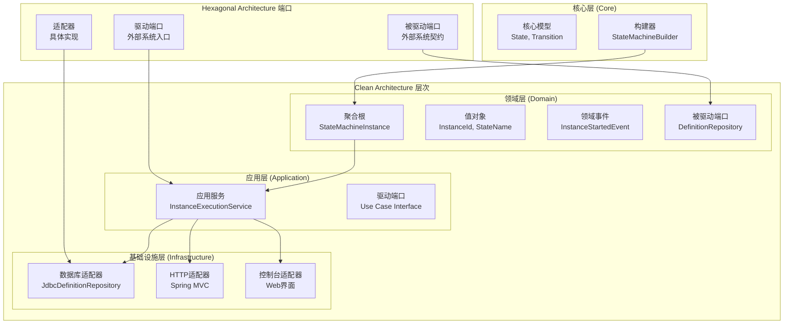
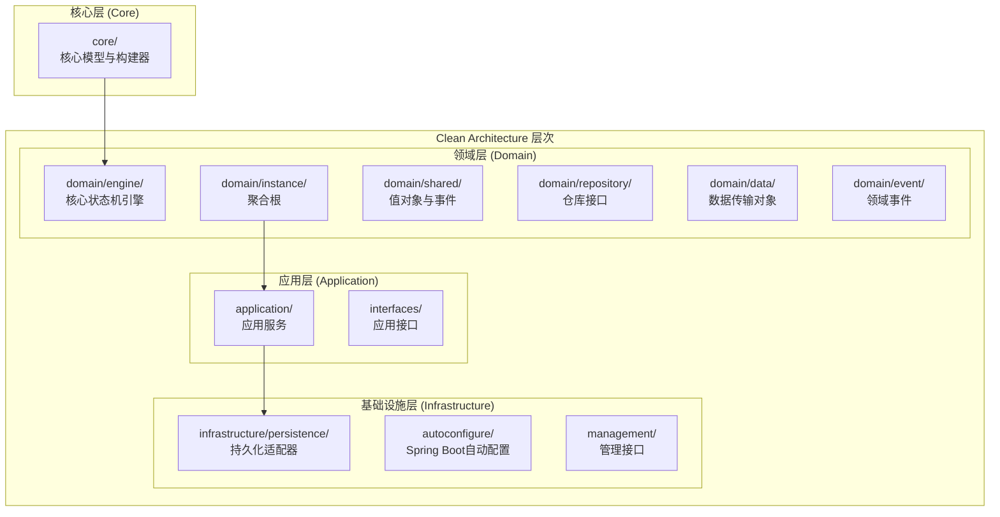
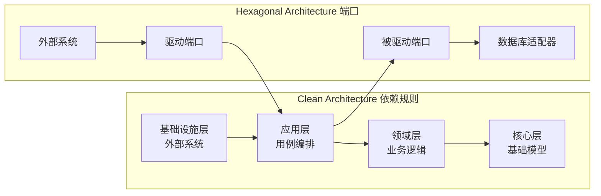
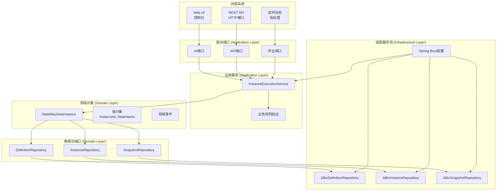
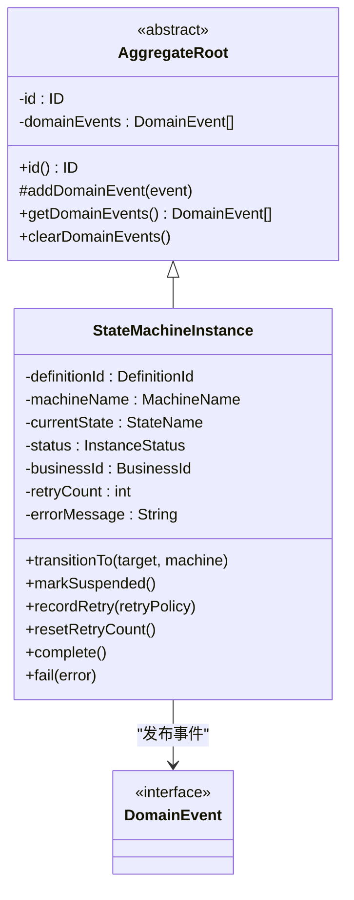
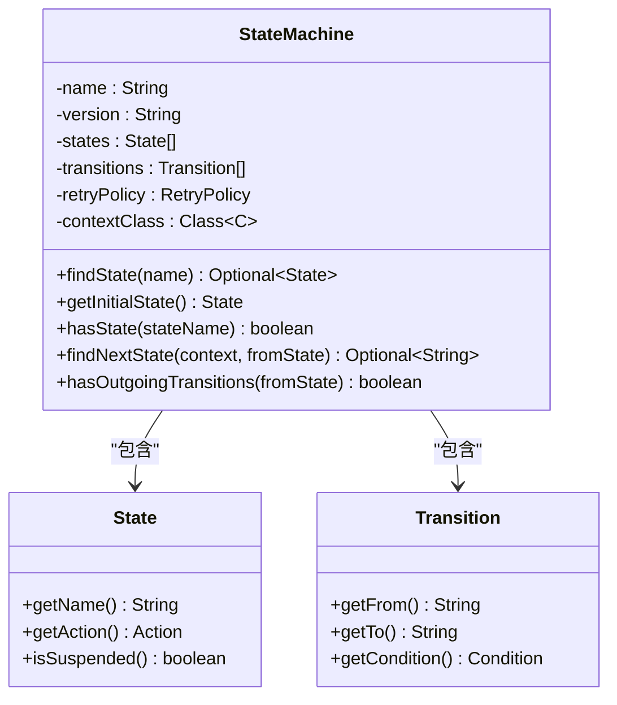
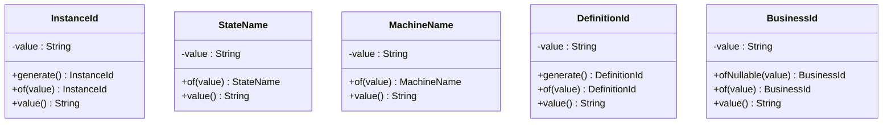
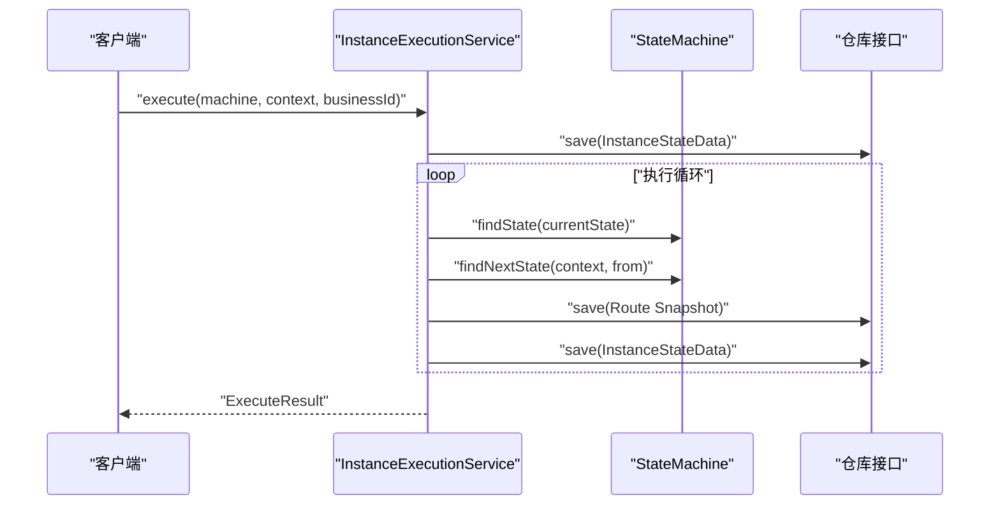
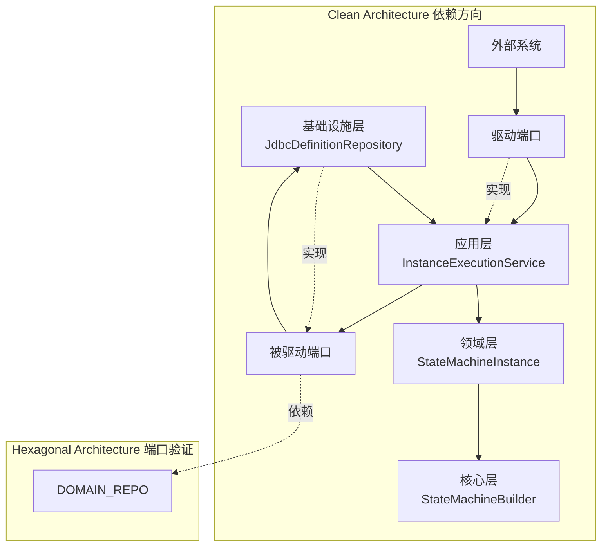
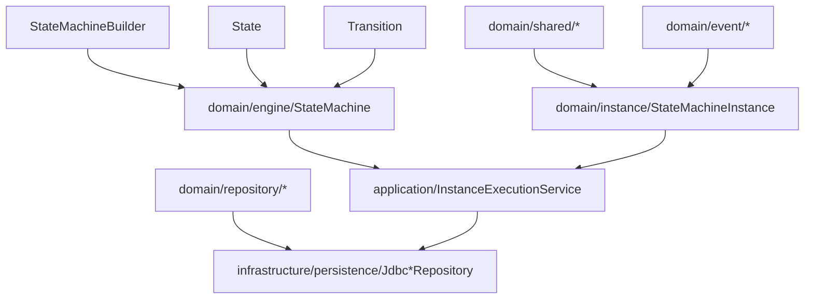

# 领域驱动设计架构

<cite>
**本文档引用的文件**
- [StateMachine.java](file://state-machine-boot-starter/src/main/java/cn/chedejun/statemachine/domain/engine/StateMachine.java)
- [AggregateRoot.java](file://state-machine-boot-starter/src/main/java/cn/chedejun/statemachine/domain/shared/AggregateRoot.java)
- [StateName.java](file://state-machine-boot-starter/src/main/java/cn/chedejun/statemachine/domain/shared/StateName.java)
- [InstanceId.java](file://state-machine-boot-starter/src/main/java/cn/chedejun/statemachine/domain/shared/InstanceId.java)
- [InstanceExecutionService.java](file://state-machine-boot-starter/src/main/java/cn/chedejun/statemachine/application/InstanceExecutionService.java)
- [StateMachineBuilder.java](file://state-machine-boot-starter/src/main/java/cn/chedejun/statemachine/core/StateMachineBuilder.java)
- [StateMachineInstance.java](file://state-machine-boot-starter/src/main/java/cn/chedejun/statemachine/domain/instance/StateMachineInstance.java)
- [DefinitionRepository.java](file://state-machine-boot-starter/src/main/java/cn/chedejun/statemachine/domain/repository/DefinitionRepository.java)
- [DefinitionData.java](file://state-machine-boot-starter/src/main/java/cn/chedejun/statemachine/domain/data/DefinitionData.java)
- [DomainEvent.java](file://state-machine-boot-starter/src/main/java/cn/chedejun/statemachine/domain/shared/DomainEvent.java)
- [State.java](file://state-machine-boot-starter/src/main/java/cn/chedejun/statemachine/core/State.java)
- [Transition.java](file://state-machine-boot-starter/src/main/java/cn/chedejun/statemachine/core/Transition.java)
- [InstanceStartedEvent.java](file://state-machine-boot-starter/src/main/java/cn/chedejun/statemachine/domain/event/InstanceStartedEvent.java)
- [JdbcDefinitionRepository.java](file://state-machine-boot-starter/src/main/java/cn/chedejun/statemachine/infrastructure/persistence/JdbcDefinitionRepository.java)
- [README.md](file://state-machine-boot-starter/README.md)
- [ValueObjectTest.java](file://state-machine-boot-starter/src/test/java/cn/chedejun/statemachine/domain/shared/ValueObjectTest.java)
- [AggregateRootTest.java](file://state-machine-boot-starter/src/test/java/cn/chedejun/statemachine/domain/shared/AggregateRootTest.java)
- [SKILL.md](file://.claude/skills/clean-ddd-hexagonal/SKILL.md)
- [LAYERS.md](file://.claude/skills/clean-ddd-hexagonal/references/LAYERS.md)
</cite>

## 更新摘要
**变更内容**
- 整合 Clean Architecture + DDD + Hexagonal Architecture 设计理念
- 更新架构图为三层架构与六边形架构的融合版本
- 新增端口与适配器模式的详细说明
- 补充依赖规则与分层职责的理论基础
- 增强领域驱动设计战术模式的实施指导

## 目录
1. [引言](#引言)
2. [Clean Architecture + DDD + Hexagonal Architecture 融合架构](#clean-architecture--ddd--hexagonal-architecture-融合架构)
3. [项目结构](#项目结构)
4. [核心组件](#核心组件)
5. [架构总览](#架构总览)
6. [详细组件分析](#详细组件分析)
7. [依赖分析](#依赖分析)
8. [性能考虑](#性能考虑)
9. [故障排除指南](#故障排除指南)
10. [结论](#结论)
11. [附录](#附录)

## 引言
本项目是一个基于 Clean Architecture + DDD + Hexagonal Architecture 的状态机工作流引擎，采用三层架构与六边形架构的融合设计。该架构通过清晰的职责边界与交互关系，确保状态机定义、实例执行、持久化与应用服务之间的松耦合与高内聚。

### Clean Architecture 核心原则
- **依赖规则**：依赖关系仅向内指向，外层不依赖内层
- **框架无关**：应用层和领域层不依赖外部框架
- **测试友好**：核心逻辑可独立于外部系统进行测试

### DDD 战术模式
- **聚合根（Aggregate Root）**：以StateMachineInstance为核心聚合，承载实例状态与领域事件
- **值对象（Value Object）**：InstanceId、StateName、DefinitionId、BusinessId等不可变标识与名称类型
- **领域事件（Domain Event）**：实例启动、挂起、完成、失败等事件用于解耦与可观测性

### Hexagonal Architecture 端口与适配器
- **驱动端口（Driver Ports）**：应用服务接口，处理外部请求
- **被驱动端口（Driven Ports）**：仓库接口，定义持久化契约
- **适配器（Adapters）**：具体实现，如JDBC仓库、HTTP控制器

**章节来源**
- [SKILL.md:36-43](file://.claude/skills/clean-ddd-hexagonal/SKILL.md#L36-L43)
- [LAYERS.md:12-21](file://.claude/skills/clean-ddd-hexagonal/references/LAYERS.md#L12-L21)

## Clean Architecture + DDD + Hexagonal Architecture 融合架构

### 三层架构与六边形架构的结合

**图表来源**
- [SKILL.md:87-115](file://.claude/skills/clean-ddd-hexagonal/SKILL.md#L87-L115)
- [LAYERS.md:12-21](file://.claude/skills/clean-ddd-hexagonal/references/LAYERS.md#L12-L21)

### 分层职责详解

#### 领域层 (Domain - Innermost)
- **纯业务逻辑**：不含任何外部依赖
- **核心实体**：StateMachineInstance、值对象
- **领域事件**：业务状态变更通知
- **仓库接口**：定义持久化契约

#### 应用层 (Application)
- **用例编排**：协调领域对象与基础设施
- **事务边界**：管理业务事务
- **驱动端口**：对外暴露的接口契约

#### 基础设施层 (Infrastructure)
- **外部系统集成**：数据库、消息队列、HTTP
- **具体适配器**：实现驱动端口和被驱动端口
- **框架绑定**：Spring Boot、JDBC等

**章节来源**
- [LAYERS.md:14-19](file://.claude/skills/clean-ddd-hexagonal/references/LAYERS.md#L14-L19)
- [SKILL.md:118-129](file://.claude/skills/clean-ddd-hexagonal/SKILL.md#L118-L129)

## 项目结构

### 融合架构下的目录组织

**图表来源**
- [SKILL.md:87-115](file://.claude/skills/clean-ddd-hexagonal/SKILL.md#L87-L115)

### 依赖方向规则

**章节来源**
- [SKILL.md:36-43](file://.claude/skills/clean-ddd-hexagonal/SKILL.md#L36-L43)
- [LAYERS.md:12-21](file://.claude/skills/clean-ddd-hexagonal/references/LAYERS.md#L12-L21)

## 核心组件

### 核心层（Core）
- **StateMachineBuilder**：用于构建不可变的状态机定义，支持状态、转换、重试策略与上下文类型配置
- **State**：表示状态节点，包含名称、动作与是否挂起标志
- **Transition**：表示状态间的转换，包含来源、目标与条件
- **StateMachine**：不可变的领域对象，持有状态集合、转换规则与重试策略

### 领域层（Domain）
- **AggregateRoot**：抽象基类，维护领域事件列表与不可变事件视图
- **StateMachineInstance**：聚合根，封装实例的定义ID、机器名、当前状态、业务ID等
- **值对象**：InstanceId、StateName、DefinitionId、BusinessId、MachineName等
- **领域事件**：InstanceStartedEvent、InstanceSuspendedEvent、InstanceCompletedEvent、InstanceFailedEvent等
- **仓库接口**：DefinitionRepository、InstanceRepository、SnapshotRepository

### 应用层（Application）
- **InstanceExecutionService**：应用服务，负责实例创建、执行循环、重试与恢复

### 基础设施层（Infrastructure）
- **JdbcDefinitionRepository**：基于JDBC的定义仓库实现
- **Spring Boot 自动配置**：提供依赖注入与配置管理

**章节来源**
- [StateMachineBuilder.java:1-52](file://state-machine-boot-starter/src/main/java/cn/chedejun/statemachine/core/StateMachineBuilder.java#L1-L52)
- [StateMachine.java:1-77](file://state-machine-boot-starter/src/main/java/cn/chedejun/statemachine/domain/engine/StateMachine.java#L1-L77)
- [StateMachineInstance.java:1-81](file://state-machine-boot-starter/src/main/java/cn/chedejun/statemachine/domain/instance/StateMachineInstance.java#L1-L81)
- [InstanceExecutionService.java:1-296](file://state-machine-boot-starter/src/main/java/cn/chedejun/statemachine/application/InstanceExecutionService.java#L1-L296)
- [JdbcDefinitionRepository.java:1-119](file://state-machine-boot-starter/src/main/java/cn/chedejun/statemachine/infrastructure/persistence/JdbcDefinitionRepository.java#L1-L119)

## 架构总览

### Clean Architecture + DDD + Hexagonal Architecture 融合图

**图表来源**
- [SKILL.md:118-129](file://.claude/skills/clean-ddd-hexagonal/SKILL.md#L118-L129)
- [LAYERS.md:12-21](file://.claude/skills/clean-ddd-hexagonal/references/LAYERS.md#L12-L21)

## 详细组件分析

### 聚合根：StateMachineInstance

StateMachineInstance是状态机实例的聚合根，负责维护实例的生命周期状态与领域事件。其行为包括：

- **初始化**：设置初始状态、机器名与业务ID，并发布实例启动事件
- **状态迁移**：验证非终止状态后进行目标状态切换
- **挂起与恢复**：标记挂起状态并发布挂起事件
- **重试与终止**：记录重试次数与错误信息，完成后发布完成或失败事件

**图表来源**
- [AggregateRoot.java:1-29](file://state-machine-boot-starter/src/main/java/cn/chedejun/statemachine/domain/shared/AggregateRoot.java#L1-L29)
- [StateMachineInstance.java:1-81](file://state-machine-boot-starter/src/main/java/cn/chedejun/statemachine/domain/instance/StateMachineInstance.java#L1-L81)

### 不可变领域对象：StateMachine

StateMachine是状态机定义的不可变领域对象，承载状态集合、转换规则与重试策略。其特点：

- **构造时进行参数校验**：确保至少存在一个状态与一个转换
- **提供查找状态**：获取初始状态、根据上下文计算下一状态等方法
- **通过不可变集合保护内部状态**：避免外部修改

**图表来源**
- [StateMachine.java:1-77](file://state-machine-boot-starter/src/main/java/cn/chedejun/statemachine/domain/engine/StateMachine.java#L1-L77)

### 值对象：InstanceId、StateName

值对象用于表达领域中的标识与名称，具有以下特征：

- **不可变**：构造后无法修改内部值
- **值相等性**：基于值而非引用相等
- **工厂方法**：提供of与generate等静态方法

**图表来源**
- [InstanceId.java:1-27](file://state-machine-boot-starter/src/main/java/cn/chedejun/statemachine/domain/shared/InstanceId.java#L1-L27)
- [StateName.java:1-25](file://state-machine-boot-starter/src/main/java/cn/chedejun/statemachine/domain/shared/StateName.java#L1-L25)
- [MachineName.java:1-25](file://state-machine-boot-starter/src/main/java/cn/chedejun/statemachine/domain/shared/MachineName.java#L1-L25)
- [DefinitionId.java:1-27](file://state-machine-boot-starter/src/main/java/cn/chedejun/statemachine/domain/shared/DefinitionId.java#L1-L27)
- [BusinessId.java:1-24](file://state-machine-boot-starter/src/main/java/cn/chedejun/statemachine/domain/shared/BusinessId.java#L1-L24)

### 应用服务：InstanceExecutionService

InstanceExecutionService是应用层的核心，负责：

- **实例创建与初始化**：生成InstanceId、解析定义ID、保存初始实例数据
- **执行循环**：根据当前状态执行动作、记录快照、决定下一状态
- **重试与恢复**：从快照恢复上下文、校验期望状态、CAS式更新状态
- **错误处理**：构建详细的错误消息、持久化失败快照、抛出统一异常

**图表来源**
- [InstanceExecutionService.java:1-296](file://state-machine-boot-starter/src/main/java/cn/chedejun/statemachine/application/InstanceExecutionService.java#L1-L296)

### 基础设施：JdbcDefinitionRepository

JdbcDefinitionRepository实现了DefinitionRepository接口，提供：

- **保存与更新**：将状态机定义序列化后写入数据库
- **查询**：按名称版本查询、按名称查询所有版本、全量查询
- **数据库适配**：自动检测数据库类型，针对PostgreSQL与MySQL优化JSON列处理

**图表来源**
- [JdbcDefinitionRepository.java:1-119](file://state-machine-boot-starter/src/main/java/cn/chedejun/statemachine/infrastructure/persistence/JdbcDefinitionRepository.java#L1-L119)

**章节来源**
- [InstanceExecutionService.java:1-296](file://state-machine-boot-starter/src/main/java/cn/chedejun/statemachine/application/InstanceExecutionService.java#L1-L296)
- [JdbcDefinitionRepository.java:1-119](file://state-machine-boot-starter/src/main/java/cn/chedejun/statemachine/infrastructure/persistence/JdbcDefinitionRepository.java#L1-L119)

## 依赖分析

### Clean Architecture 依赖规则验证

**图表来源**
- [SKILL.md:36-43](file://.claude/skills/clean-ddd-hexagonal/SKILL.md#L36-L43)

### 组件间依赖关系

**图表来源**
- [StateMachineBuilder.java:1-52](file://state-machine-boot-starter/src/main/java/cn/chedejun/statemachine/core/StateMachineBuilder.java#L1-L52)
- [StateMachine.java:1-77](file://state-machine-boot-starter/src/main/java/cn/chedejun/statemachine/domain/engine/StateMachine.java#L1-L77)
- [StateMachineInstance.java:1-81](file://state-machine-boot-starter/src/main/java/cn/chedejun/statemachine/domain/instance/StateMachineInstance.java#L1-L81)
- [InstanceExecutionService.java:1-296](file://state-machine-boot-starter/src/main/java/cn/chedejun/statemachine/application/InstanceExecutionService.java#L1-L296)
- [JdbcDefinitionRepository.java:1-119](file://state-machine-boot-starter/src/main/java/cn/chedejun/statemachine/infrastructure/persistence/JdbcDefinitionRepository.java#L1-L119)

**章节来源**
- [DefinitionRepository.java:1-16](file://state-machine-boot-starter/src/main/java/cn/chedejun/statemachine/domain/repository/DefinitionRepository.java#L1-L16)
- [DefinitionData.java:1-46](file://state-machine-boot-starter/src/main/java/cn/chedejun/statemachine/domain/data/DefinitionData.java#L1-L46)

## 性能考虑

### Clean Architecture 性能优化

- **不可变对象与不可变集合**：StateMachine内部使用不可变列表，减少并发读取时的同步开销
- **快照与重试**：通过快照记录输入输出与重试次数，避免重复执行与N+1查询问题
- **循环上限**：执行循环设置最大迭代次数，防止无限循环导致资源耗尽
- **数据库适配**：JdbcDefinitionRepository自动检测数据库类型，优化JSON列写入性能

### DDD 性能优化

- **值对象缓存**：InstanceId、StateName等值对象的相等性比较基于值，减少内存占用
- **领域事件批量处理**：AggregateRoot维护事件列表，支持批量发布与清理

### Hexagonal Architecture 性能优化

- **适配器复用**：基础设施适配器可被多个应用服务复用
- **端口抽象**：通过接口抽象，可在不改变应用逻辑的情况下替换实现

**章节来源**
- [InstanceExecutionService.java:1-296](file://state-machine-boot-starter/src/main/java/cn/chedejun/statemachine/application/InstanceExecutionService.java#L1-L296)
- [JdbcDefinitionRepository.java:1-119](file://state-machine-boot-starter/src/main/java/cn/chedejun/statemachine/infrastructure/persistence/JdbcDefinitionRepository.java#L1-L119)

## 故障排除指南

### Clean Architecture 故障排除

- **依赖倒置违规**：检查是否有外层组件依赖内层组件
- **框架泄漏**：确认领域层没有直接依赖外部框架
- **测试隔离**：验证核心逻辑可独立于外部系统进行测试

### DDD 故障排除

- **聚合边界不清**：检查聚合根是否正确封装了业务不变量
- **值对象相等性问题**：验证值对象的equals/hashCode实现
- **领域事件丢失**：确认事件收集与清理机制正常工作

### Hexagonal Architecture 故障排除

- **端口实现缺失**：检查驱动端口和被驱动端口的实现是否完整
- **适配器配置错误**：验证Spring Boot配置是否正确加载
- **依赖注入问题**：确认组件间的依赖关系配置正确

### 常见问题与排查要点

- **实例未找到**：检查InstanceId或业务ID是否正确，确认仓库查询逻辑
- **状态不匹配**：恢复前需校验期望状态与实际状态一致，否则抛出异常
- **无可用转换**：当状态无出边转换时，系统会记录失败快照并终止实例
- **重试耗尽**：超过最大重试次数后，实例标记为失败并记录错误信息
- **数据库JSON列**：确保数据库类型与JSON列设置正确，避免序列化失败

**章节来源**
- [InstanceExecutionService.java:1-296](file://state-machine-boot-starter/src/main/java/cn/chedejun/statemachine/application/InstanceExecutionService.java#L1-L296)
- [JdbcDefinitionRepository.java:1-119](file://state-machine-boot-starter/src/main/java/cn/chedejun/statemachine/infrastructure/persistence/JdbcDefinitionRepository.java#L1-L119)

## 结论

本项目通过Clean Architecture + DDD + Hexagonal Architecture的融合设计，实现了状态机工作流引擎的高内聚、低耦合与可扩展性。该架构不仅遵循了Clean Architecture的依赖规则，还充分利用了DDD的战术模式和Hexagonal Architecture的端口适配器模式。

### 架构优势

- **清晰的职责分离**：三层架构明确了各层的职责边界
- **领域驱动设计**：通过聚合根、值对象、领域事件表达业务语义
- **六边形架构**：通过端口与适配器实现系统与外部环境的解耦
- **测试友好**：核心逻辑可独立于外部系统进行测试
- **可扩展性强**：新增功能可通过适配器模式轻松集成

### 技术价值

- **企业级架构**：适用于长期维护的企业级应用
- **团队协作**：清晰的分层和接口定义便于团队协作
- **技术演进**：支持渐进式的技术升级和重构
- **最佳实践**：整合了多种架构模式的最佳实践

## 附录

### 快速开始与配置参考

- 快速开始与配置参考见项目README
- 测试用例覆盖了值对象与聚合根的行为验证，可作为行为规范的参考

### 参考资料

- **Clean Architecture**：Robert C. Martin的架构理念
- **DDD**：Eric Evans的领域驱动设计经典
- **Hexagonal Architecture**：Alistair Cockburn的六边形架构
- **Onion Architecture**：Jeffrey Palermo的洋葱架构

**章节来源**
- [README.md:1-65](file://state-machine-boot-starter/README.md#L1-L65)
- [ValueObjectTest.java:1-61](file://state-machine-boot-starter/src/test/java/cn/chedejun/statemachine/domain/shared/ValueObjectTest.java#L1-L61)
- [AggregateRootTest.java:1-40](file://state-machine-boot-starter/src/test/java/cn/chedejun/statemachine/domain/shared/AggregateRootTest.java#L1-L40)
- [SKILL.md:153-185](file://.claude/skills/clean-ddd-hexagonal/SKILL.md#L153-L185)