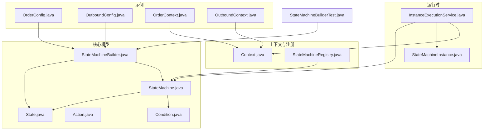
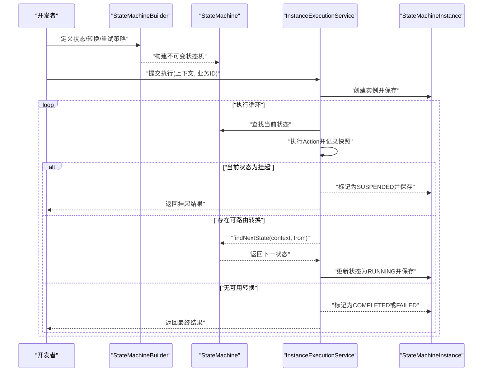
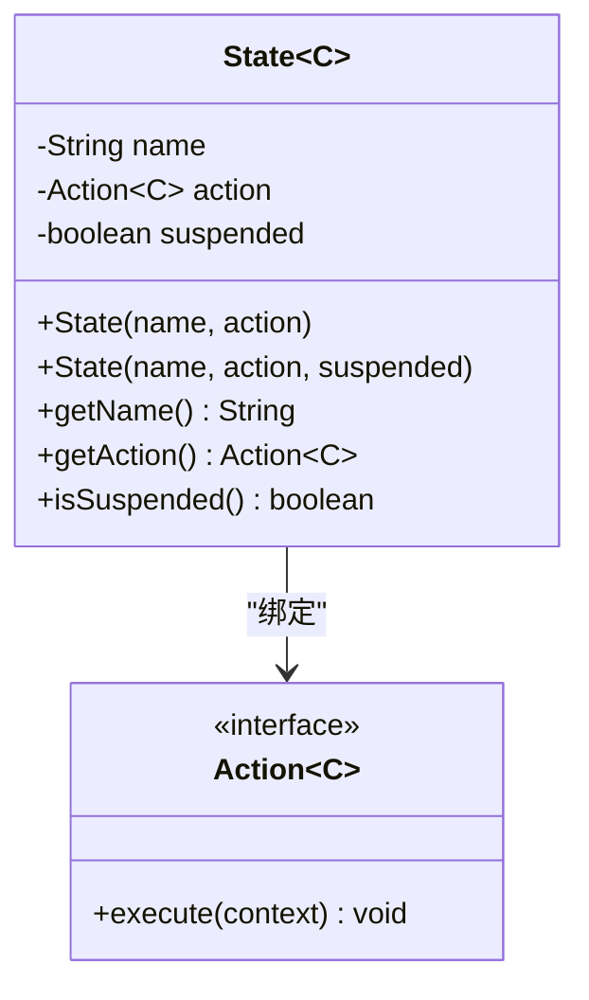
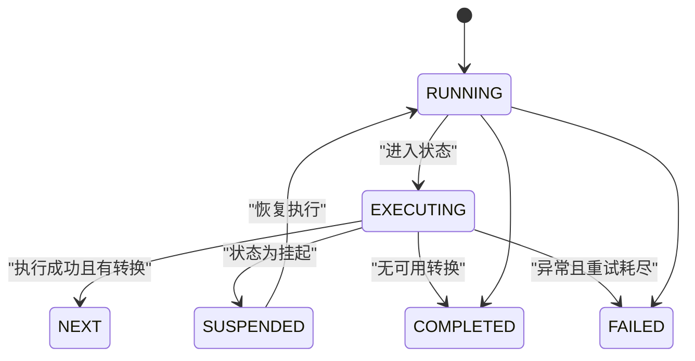
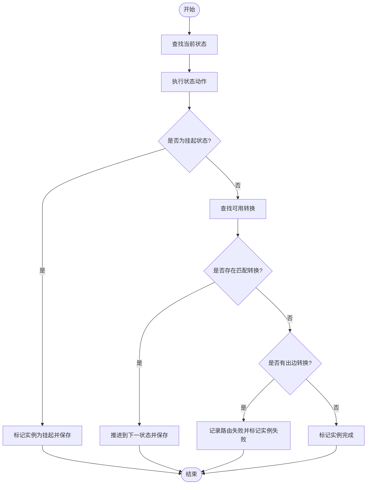
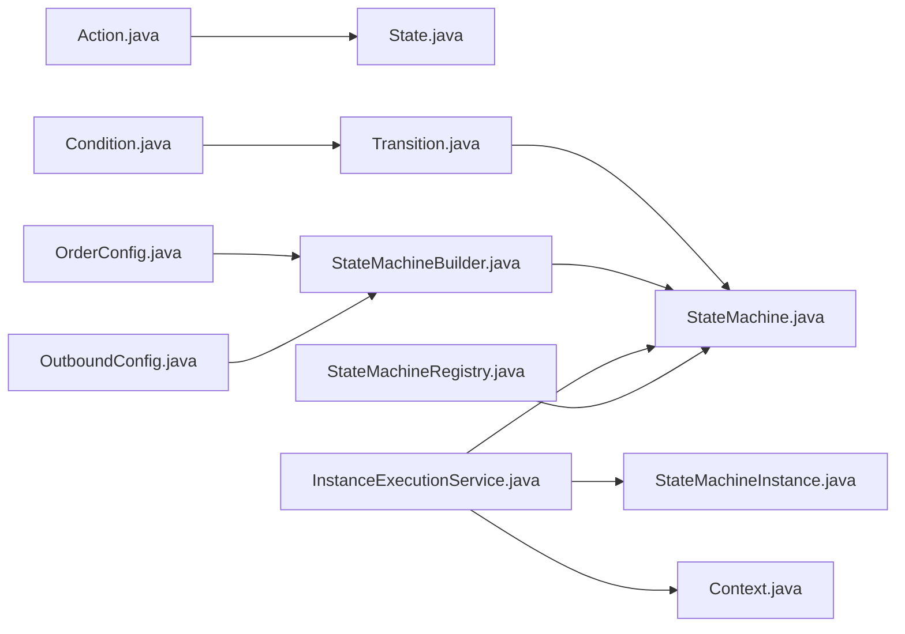

# 状态定义

<cite>
**本文引用的文件**
- [State.java](file://state-machine-boot-starter/src/main/java/cn/chedejun/statemachine/core/State.java)
- [Action.java](file://state-machine-boot-starter/src/main/java/cn/chedejun/statemachine/core/Action.java)
- [StateMachineBuilder.java](file://state-machine-boot-starter/src/main/java/cn/chedejun/statemachine/core/StateMachineBuilder.java)
- [StateMachine.java](file://state-machine-boot-starter/src/main/java/cn/chedejun/statemachine/domain/engine/StateMachine.java)
- [Context.java](file://state-machine-boot-starter/src/main/java/cn/chedejun/statemachine/core/Context.java)
- [Condition.java](file://state-machine-boot-starter/src/main/java/cn/chedejun/statemachine/core/Condition.java)
- [StateMachineInstance.java](file://state-machine-boot-starter/src/main/java/cn/chedejun/statemachine/domain/instance/StateMachineInstance.java)
- [InstanceExecutionService.java](file://state-machine-boot-starter/src/main/java/cn/chedejun/statemachine/application/InstanceExecutionService.java)
- [StateMachineRegistry.java](file://state-machine-boot-starter/src/main/java/cn/chedejun/statemachine/core/StateMachineRegistry.java)
- [OrderConfig.java](file://state-machine-demo/src/main/java/cn/chedejun/demo/config/OrderConfig.java)
- [OutboundConfig.java](file://state-machine-demo/src/main/java/cn/chedejun/demo/config/OutboundConfig.java)
- [OrderContext.java](file://state-machine-demo/src/main/java/cn/chedejun/demo/statemachine/OrderContext.java)
- [OutboundContext.java](file://state-machine-demo/src/main/java/cn/chedejun/demo/statemachine/OutboundContext.java)
- [StateMachineBuilderTest.java](file://state-machine-boot-starter/src/test/java/cn/chedejun/statemachine/core/StateMachineBuilderTest.java)
</cite>

## 目录
1. [引言](#引言)
2. [项目结构](#项目结构)
3. [核心组件](#核心组件)
4. [架构总览](#架构总览)
5. [详细组件分析](#详细组件分析)
6. [依赖分析](#依赖分析)
7. [性能考虑](#性能考虑)
8. [故障排查指南](#故障排查指南)
9. [结论](#结论)
10. [附录](#附录)

## 引言
本文件聚焦于状态机中“状态”的设计与实现，系统性阐述 State 类的字段与行为、状态命名规范、状态类型分类（普通状态与挂起状态）、状态生命周期、状态动作 Action 的实现要求与最佳实践，并结合示例展示简单状态、复杂业务状态与挂起恢复状态的定义方式。同时说明状态在状态机中的作用以及与构建器、执行服务、实例等组件的关系，给出状态验证规则与约束条件，最后提供设计指导与常见问题解决方案。

## 项目结构
围绕状态定义的关键代码主要位于以下模块与文件：
- 核心模型与构建：State、Action、Condition、StateMachineBuilder、StateMachine
- 运行时实例与执行：StateMachineInstance、InstanceExecutionService
- 上下文与注册中心：Context、StateMachineRegistry
- 示例与配置：OrderConfig、OutboundConfig、OrderContext、OutboundContext
- 行为验证：StateMachineBuilderTest

图表来源
- [State.java:1-23](file://state-machine-boot-starter/src/main/java/cn/chedejun/statemachine/core/State.java#L1-L23)
- [StateMachineBuilder.java:1-52](file://state-machine-boot-starter/src/main/java/cn/chedejun/statemachine/core/StateMachineBuilder.java#L1-L52)
- [StateMachine.java:1-77](file://state-machine-boot-starter/src/main/java/cn/chedejun/statemachine/domain/engine/StateMachine.java#L1-L77)
- [InstanceExecutionService.java:1-296](file://state-machine-boot-starter/src/main/java/cn/chedejun/statemachine/application/InstanceExecutionService.java#L1-L296)
- [OrderConfig.java:1-95](file://state-machine-demo/src/main/java/cn/chedejun/demo/config/OrderConfig.java#L1-L95)
- [OutboundConfig.java:1-130](file://state-machine-demo/src/main/java/cn/chedejun/demo/config/OutboundConfig.java#L1-L130)

章节来源
- [State.java:1-23](file://state-machine-boot-starter/src/main/java/cn/chedejun/statemachine/core/State.java#L1-L23)
- [StateMachineBuilder.java:1-52](file://state-machine-boot-starter/src/main/java/cn/chedejun/statemachine/core/StateMachineBuilder.java#L1-L52)
- [StateMachine.java:1-77](file://state-machine-boot-starter/src/main/java/cn/chedejun/statemachine/domain/engine/StateMachine.java#L1-L77)

## 核心组件
- State：封装状态名称、动作绑定与挂起标记，是状态机的最小执行单元。
- Action：函数式接口，定义状态执行的业务逻辑，结果通过上下文写入并自动记录到快照。
- Condition：函数式接口，用于判断是否满足从某状态出发的转换条件。
- StateMachineBuilder：构建状态机，支持添加普通状态与挂起状态、定义转换条件、设置重试策略与上下文类型。
- StateMachine：不可变领域对象，持有状态集合、转换集合、重试策略与上下文类型，提供状态查询与路由能力。
- Context：共享上下文容器，用于在状态间传递数据。
- StateMachineInstance：运行时实例，维护当前状态、实例状态（运行/挂起/完成/失败）、重试次数与错误信息。
- InstanceExecutionService：执行引擎，负责实例创建、状态执行循环、挂起与恢复、重试与错误处理。
- StateMachineRegistry：注册中心，持久化状态机定义并提供版本管理与查询。

章节来源
- [State.java:1-23](file://state-machine-boot-starter/src/main/java/cn/chedejun/statemachine/core/State.java#L1-L23)
- [Action.java:1-12](file://state-machine-boot-starter/src/main/java/cn/chedejun/statemachine/core/Action.java#L1-L12)
- [Condition.java:1-7](file://state-machine-boot-starter/src/main/java/cn/chedejun/statemachine/core/Condition.java#L1-L7)
- [StateMachineBuilder.java:1-52](file://state-machine-boot-starter/src/main/java/cn/chedejun/statemachine/core/StateMachineBuilder.java#L1-L52)
- [StateMachine.java:1-77](file://state-machine-boot-starter/src/main/java/cn/chedejun/statemachine/domain/engine/StateMachine.java#L1-L77)
- [Context.java:1-24](file://state-machine-boot-starter/src/main/java/cn/chedejun/statemachine/core/Context.java#L1-L24)
- [StateMachineInstance.java:1-81](file://state-machine-boot-starter/src/main/java/cn/chedejun/statemachine/domain/instance/StateMachineInstance.java#L1-L81)
- [InstanceExecutionService.java:1-296](file://state-machine-boot-starter/src/main/java/cn/chedejun/statemachine/application/InstanceExecutionService.java#L1-L296)
- [StateMachineRegistry.java:1-114](file://state-machine-boot-starter/src/main/java/cn/chedejun/statemachine/core/StateMachineRegistry.java#L1-L114)

## 架构总览
状态定义贯穿于构建期与运行期：
- 构建期：通过 StateMachineBuilder 定义状态与转换，生成不可变的 StateMachine。
- 运行期：InstanceExecutionService 基于 StateMachine 创建实例，按状态顺序执行 Action，依据 Condition 决定下一状态；遇到挂起状态则暂停并标记为挂起，等待恢复。

图表来源
- [StateMachineBuilder.java:28-47](file://state-machine-boot-starter/src/main/java/cn/chedejun/statemachine/core/StateMachineBuilder.java#L28-L47)
- [StateMachine.java:50-76](file://state-machine-boot-starter/src/main/java/cn/chedejun/statemachine/domain/engine/StateMachine.java#L50-L76)
- [InstanceExecutionService.java:158-193](file://state-machine-boot-starter/src/main/java/cn/chedejun/statemachine/application/InstanceExecutionService.java#L158-L193)
- [StateMachineInstance.java:39-79](file://state-machine-boot-starter/src/main/java/cn/chedejun/statemachine/domain/instance/StateMachineInstance.java#L39-L79)

## 详细组件分析

### State 类设计与实现
- 字段与职责
  - name：状态名称，唯一标识该状态，不能为空或空白字符串。
  - action：绑定到该状态的业务逻辑，执行后结果写入上下文并记录快照。
  - suspended：是否为挂起状态，决定执行时是否中断并标记挂起。
- 构造与校验
  - 提供两个构造函数：默认非挂起；显式传入 suspended 可创建挂起状态。
  - 对 name 进行非空与非空白校验，否则抛出非法参数异常。
- 访问器
  - getName/getAction/isSuspended 提供只读访问，确保不可变性与线程安全。

图表来源
- [State.java:3-22](file://state-machine-boot-starter/src/main/java/cn/chedejun/statemachine/core/State.java#L3-L22)
- [Action.java:9-11](file://state-machine-boot-starter/src/main/java/cn/chedejun/statemachine/core/Action.java#L9-L11)

章节来源
- [State.java:1-23](file://state-machine-boot-starter/src/main/java/cn/chedejun/statemachine/core/State.java#L1-L23)

### 状态命名规范
- 唯一性：同一状态机内状态名称必须唯一，用于状态查找与路由。
- 可读性：建议采用动词短语或名词短语，体现状态含义（如“check-inventory”、“await-ship-confirm”）。
- 空值与空白：名称不得为 null 或空白字符串，构建期与运行期均会进行校验。
- 建议风格：小写加连字符或下划线，便于日志与调试阅读。

章节来源
- [State.java:13](file://state-machine-boot-starter/src/main/java/cn/chedejun/statemachine/core/State.java#L13)
- [StateMachineBuilder.java:21-24](file://state-machine-boot-starter/src/main/java/cn/chedejun/statemachine/core/StateMachineBuilder.java#L21-L24)
- [StateMachine.java:30-33](file://state-machine-boot-starter/src/main/java/cn/chedejun/statemachine/domain/engine/StateMachine.java#L30-L33)

### 状态类型分类与生命周期
- 普通状态
  - 执行完成后按转换规则进入下一状态。
  - 生命周期：执行一次 Action 后进入下一状态或结束。
- 挂起状态
  - 执行时若 isSuspended 为真，则立即标记实例为挂起并停止后续执行，等待恢复。
  - 生命周期：执行 Action 后被挂起，需外部调用恢复接口继续执行。
- 实例状态
  - RUNNING：正常执行。
  - SUSPENDED：被挂起。
  - COMPLETED：无可用转换且执行完成。
  - FAILED：发生异常且超过最大重试次数。

图表来源
- [InstanceExecutionService.java:174-184](file://state-machine-boot-starter/src/main/java/cn/chedejun/statemachine/application/InstanceExecutionService.java#L174-L184)
- [StateMachineInstance.java:46-79](file://state-machine-boot-starter/src/main/java/cn/chedejun/statemachine/domain/instance/StateMachineInstance.java#L46-L79)

章节来源
- [StateMachineBuilderTest.java:85-106](file://state-machine-boot-starter/src/test/java/cn/chedejun/statemachine/core/StateMachineBuilderTest.java#L85-L106)
- [InstanceExecutionService.java:174-184](file://state-machine-boot-starter/src/main/java/cn/chedejun/statemachine/application/InstanceExecutionService.java#L174-L184)
- [StateMachineInstance.java:46-79](file://state-machine-boot-starter/src/main/java/cn/chedejun/statemachine/domain/instance/StateMachineInstance.java#L46-L79)

### 状态动作 Action 接口实现要求与最佳实践
- 实现要求
  - Action 为函数式接口，仅包含一个执行方法，签名固定。
  - 在执行过程中通过上下文写入结果，这些结果会被序列化并记录到快照，便于恢复与审计。
- 最佳实践
  - 动作幂等：尽量使 Action 幂等，避免重复执行造成副作用。
  - 异常处理：动作内部应捕获并包装业务异常，必要时抛出以触发重试。
  - 上下文健壮：读取上下文前先做空值检查，保证在恢复场景也能正确工作。
  - 事务边界：若动作涉及外部系统，应在动作层控制事务边界，避免长时间占用资源。
  - 日志可观测：在关键节点输出日志，便于定位问题与审计追踪。

章节来源
- [Action.java:3-11](file://state-machine-boot-starter/src/main/java/cn/chedejun/statemachine/core/Action.java#L3-L11)
- [Context.java:6-23](file://state-machine-boot-starter/src/main/java/cn/chedejun/statemachine/core/Context.java#L6-L23)
- [InstanceExecutionService.java:200-237](file://state-machine-boot-starter/src/main/java/cn/chedejun/statemachine/application/InstanceExecutionService.java#L200-L237)

### 状态在状态机中的作用与关系
- 作为执行单元：每个 State 代表一次业务步骤，绑定一个 Action。
- 作为路由节点：配合 Transition 与 Condition 决定从当前状态到下一状态的路径。
- 作为挂起锚点：挂起状态作为外部干预点，允许暂停与恢复。
- 与构建器的关系：通过 StateMachineBuilder.state()/suspendState() 添加，构建不可变 StateMachine。
- 与执行服务的关系：InstanceExecutionService 在执行循环中查找状态、执行动作、记录快照、推进状态。
- 与实例的关系：StateMachineInstance 维护当前状态与实例状态，受执行服务驱动变更。

章节来源
- [StateMachineBuilder.java:28-34](file://state-machine-boot-starter/src/main/java/cn/chedejun/statemachine/core/StateMachineBuilder.java#L28-L34)
- [StateMachine.java:50-76](file://state-machine-boot-starter/src/main/java/cn/chedejun/statemachine/domain/engine/StateMachine.java#L50-L76)
- [InstanceExecutionService.java:158-193](file://state-machine-boot-starter/src/main/java/cn/chedejun/statemachine/application/InstanceExecutionService.java#L158-L193)
- [StateMachineInstance.java:39-79](file://state-machine-boot-starter/src/main/java/cn/chedejun/statemachine/domain/instance/StateMachineInstance.java#L39-L79)

### 状态验证规则与约束条件
- 名称约束
  - State.name 不能为空或空白字符串。
  - StateMachine 至少包含一个状态与一个转换。
- 转换约束
  - Transition.from 与 to 均不能为空或空白字符串。
  - 若从某状态出发存在转换，但所有转换条件均为假，实例会标记为 FAILED，并包含可用目标提示。
- 构建约束
  - StateMachineBuilder.name 不能为空或空白字符串。
  - 版本自动生成，每次构建递增。
- 实例约束
  - 终止态（完成/失败）不可再次推进。
  - 恢复时期望状态必须与实例当前状态一致。
  - 重试仅适用于 FAILED 实例，且不超过最大重试次数。

章节来源
- [State.java:13](file://state-machine-boot-starter/src/main/java/cn/chedejun/statemachine/core/State.java#L13)
- [StateMachine.java:30-33](file://state-machine-boot-starter/src/main/java/cn/chedejun/statemachine/domain/engine/StateMachine.java#L30-L33)
- [Transition.java:9-14](file://state-machine-boot-starter/src/main/java/cn/chedejun/statemachine/core/Transition.java#L9-L14)
- [StateMachineBuilder.java:21-24](file://state-machine-boot-starter/src/main/java/cn/chedejun/statemachine/core/StateMachineBuilder.java#L21-L24)
- [StateMachineInstance.java:76-79](file://state-machine-boot-starter/src/main/java/cn/chedejun/statemachine/domain/instance/StateMachineInstance.java#L76-L79)
- [InstanceExecutionService.java:144-151](file://state-machine-boot-starter/src/main/java/cn/chedejun/statemachine/application/InstanceExecutionService.java#L144-L151)

### 状态定义示例与设计指导

#### 简单状态
- 示例：订单流程中的“检查库存”“处理支付”“发送通知”
- 设计要点
  - 使用普通状态，动作直接完成业务步骤。
  - 转换条件基于上下文字段（如库存数量、支付结果）。
- 参考路径
  - [OrderConfig.java:27-47](file://state-machine-demo/src/main/java/cn/chedejun/demo/config/OrderConfig.java#L27-L47)
  - [OrderConfig.java:52-89](file://state-machine-demo/src/main/java/cn/chedejun/demo/config/OrderConfig.java#L52-L89)

章节来源
- [OrderConfig.java:27-47](file://state-machine-demo/src/main/java/cn/chedejun/demo/config/OrderConfig.java#L27-L47)
- [OrderConfig.java:52-89](file://state-machine-demo/src/main/java/cn/chedejun/demo/config/OrderConfig.java#L52-L89)

#### 复杂业务状态
- 示例：出库流程中的“拣货”“复核”“打包”“发货”
- 设计要点
  - 动作内部包含概率性失败与分支逻辑，体现真实业务复杂度。
  - 通过上下文字段（如拣货/打包/发货标记）驱动转换。
- 参考路径
  - [OutboundConfig.java:29-62](file://state-machine-demo/src/main/java/cn/chedejun/demo/config/OutboundConfig.java#L29-L62)
  - [OutboundConfig.java:70-124](file://state-machine-demo/src/main/java/cn/chedejun/demo/config/OutboundConfig.java#L70-L124)

章节来源
- [OutboundConfig.java:29-62](file://state-machine-demo/src/main/java/cn/chedejun/demo/config/OutboundConfig.java#L29-L62)
- [OutboundConfig.java:70-124](file://state-machine-demo/src/main/java/cn/chedejun/demo/config/OutboundConfig.java#L70-L124)

#### 挂起恢复状态
- 示例：订单流程中的“等待发货确认”、出库流程中的“等待发货确认”
- 设计要点
  - 使用 suspendState 定义挂起点，动作执行后实例被标记为挂起。
  - 通过恢复接口（按业务ID或实例ID）加载上下文并继续执行。
- 参考路径
  - [OrderConfig.java:31](file://state-machine-demo/src/main/java/cn/chedejun/demo/config/OrderConfig.java#L31)
  - [OutboundConfig.java:35](file://state-machine-demo/src/main/java/cn/chedejun/demo/config/OutboundConfig.java#L35)
  - [InstanceExecutionService.java:60-77](file://state-machine-boot-starter/src/main/java/cn/chedejun/statemachine/application/InstanceExecutionService.java#L60-L77)

章节来源
- [OrderConfig.java:31](file://state-machine-demo/src/main/java/cn/chedejun/demo/config/OrderConfig.java#L31)
- [OutboundConfig.java:35](file://state-machine-demo/src/main/java/cn/chedejun/demo/config/OutboundConfig.java#L35)
- [InstanceExecutionService.java:60-77](file://state-machine-boot-starter/src/main/java/cn/chedejun/statemachine/application/InstanceExecutionService.java#L60-L77)

### 状态路由算法流程
当执行完一个状态的动作后，系统根据当前上下文与转换条件计算下一状态：

图表来源
- [StateMachine.java:63-71](file://state-machine-boot-starter/src/main/java/cn/chedejun/statemachine/domain/engine/StateMachine.java#L63-L71)
- [InstanceExecutionService.java:174-193](file://state-machine-boot-starter/src/main/java/cn/chedejun/statemachine/application/InstanceExecutionService.java#L174-L193)

## 依赖分析
- State 依赖 Action 与 Condition（通过 StateMachine 的转换条件间接关联）。
- StateMachineBuilder 聚合 State 与 Transition，并产出不可变的 StateMachine。
- InstanceExecutionService 依赖 StateMachine、StateMachineInstance、Context 与快照存储，驱动状态机执行。
- StateMachineRegistry 将状态机定义持久化，支持版本管理与查询。
- 示例配置通过 Bean 注册状态机并绑定具体业务动作。

图表来源
- [State.java:3-22](file://state-machine-boot-starter/src/main/java/cn/chedejun/statemachine/core/State.java#L3-L22)
- [Action.java:9-11](file://state-machine-boot-starter/src/main/java/cn/chedejun/statemachine/core/Action.java#L9-L11)
- [Transition.java:3-19](file://state-machine-boot-starter/src/main/java/cn/chedejun/statemachine/core/Transition.java#L3-L19)
- [StateMachine.java:19-48](file://state-machine-boot-starter/src/main/java/cn/chedejun/statemachine/domain/engine/StateMachine.java#L19-L48)
- [StateMachineBuilder.java:9-52](file://state-machine-boot-starter/src/main/java/cn/chedejun/statemachine/core/StateMachineBuilder.java#L9-L52)
- [InstanceExecutionService.java:25-42](file://state-machine-boot-starter/src/main/java/cn/chedejun/statemachine/application/InstanceExecutionService.java#L25-L42)
- [StateMachineRegistry.java:17-73](file://state-machine-boot-starter/src/main/java/cn/chedejun/statemachine/core/StateMachineRegistry.java#L17-L73)
- [OrderConfig.java:24-50](file://state-machine-demo/src/main/java/cn/chedejun/demo/config/OrderConfig.java#L24-L50)
- [OutboundConfig.java:26-63](file://state-machine-demo/src/main/java/cn/chedejun/demo/config/OutboundConfig.java#L26-L63)

章节来源
- [StateMachineBuilder.java:9-52](file://state-machine-boot-starter/src/main/java/cn/chedejun/statemachine/core/StateMachineBuilder.java#L9-L52)
- [StateMachine.java:19-48](file://state-machine-boot-starter/src/main/java/cn/chedejun/statemachine/domain/engine/StateMachine.java#L19-L48)
- [InstanceExecutionService.java:25-42](file://state-machine-boot-starter/src/main/java/cn/chedejun/statemachine/application/InstanceExecutionService.java#L25-L42)
- [StateMachineRegistry.java:17-73](file://state-machine-boot-starter/src/main/java/cn/chedejun/statemachine/core/StateMachineRegistry.java#L17-L73)

## 性能考虑
- 状态与转换数量：状态过多会导致路由遍历成本上升，建议合理拆分流程或复用状态。
- 重试策略：指数退避与最大重试次数直接影响执行时间与资源占用，应结合业务SLA调整。
- 快照序列化：上下文序列化与反序列化开销随数据体量增长，建议精简上下文字段。
- 并发与一致性：注册中心与实例更新采用并发容器与原子操作，避免竞争条件。

## 故障排查指南
- “状态未找到”：检查状态名称拼写与大小写，确认 StateMachine 中是否包含该状态。
- “无可用转换”：检查从当前状态出发的所有转换条件，确保至少有一个条件为真；系统会返回可用目标列表帮助定位。
- “实例已是终止态”：已完成或失败的实例无法继续推进，需重置或新建实例。
- “挂起后无法恢复”：确认恢复时期望状态与实例当前状态一致，且上下文已正确合并。
- “重试次数耗尽”：检查动作异常原因与重试策略配置，必要时放宽阈值或优化动作逻辑。

章节来源
- [InstanceExecutionService.java:167-170](file://state-machine-boot-starter/src/main/java/cn/chedejun/statemachine/application/InstanceExecutionService.java#L167-L170)
- [InstanceExecutionService.java:144-151](file://state-machine-boot-starter/src/main/java/cn/chedejun/statemachine/application/InstanceExecutionService.java#L144-L151)
- [InstanceExecutionService.java:268-275](file://state-machine-boot-starter/src/main/java/cn/chedejun/statemachine/application/InstanceExecutionService.java#L268-L275)

## 结论
State 类是状态机的基石，通过名称、动作与挂起标记三要素定义了状态的语义与行为。结合 StateMachineBuilder 的声明式构建、StateMachine 的不可变路由与 InstanceExecutionService 的执行循环，实现了从定义到运行的完整闭环。遵循命名规范、动作幂等与上下文健壮原则，可显著提升状态机的可维护性与可靠性。挂起恢复机制为复杂业务提供了灵活的人机协同能力，配合完善的错误处理与重试策略，能够有效应对生产环境的不确定性。

## 附录
- 开发者设计指导
  - 优先使用 suspendState 定义挂起点，明确挂起原因与恢复条件。
  - 动作应尽量短小、可测试，避免长事务与阻塞IO。
  - 使用上下文统一传递数据，避免跨状态硬编码。
  - 为每个状态编写清晰的日志与监控指标。
- 常见问题
  - 状态名称冲突：确保同一状态机内名称唯一。
  - 转换条件永远为假：至少保留一条可达路径，或在无路径时显式标记失败。
  - 恢复状态不一致：恢复前校验期望状态与实例状态一致。