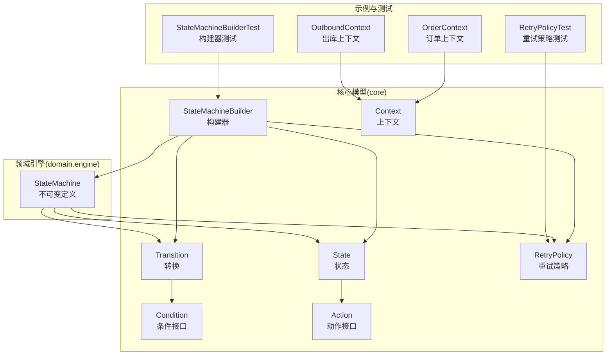
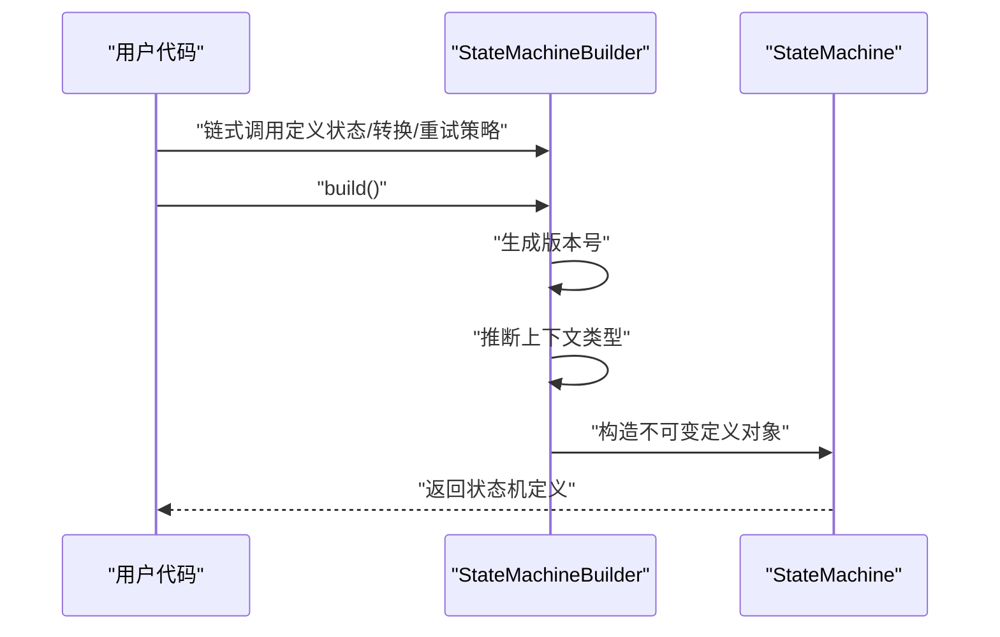
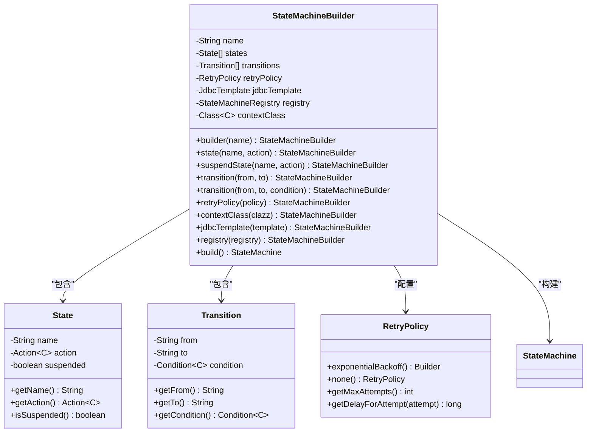
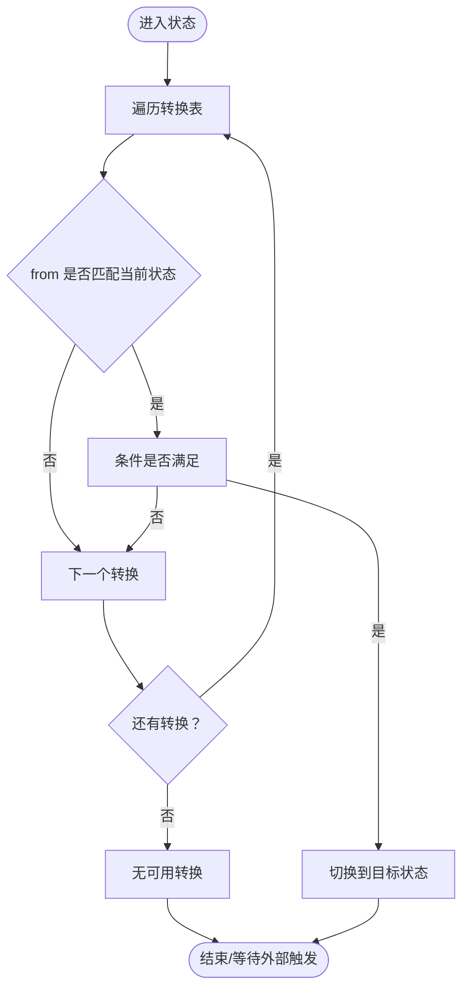
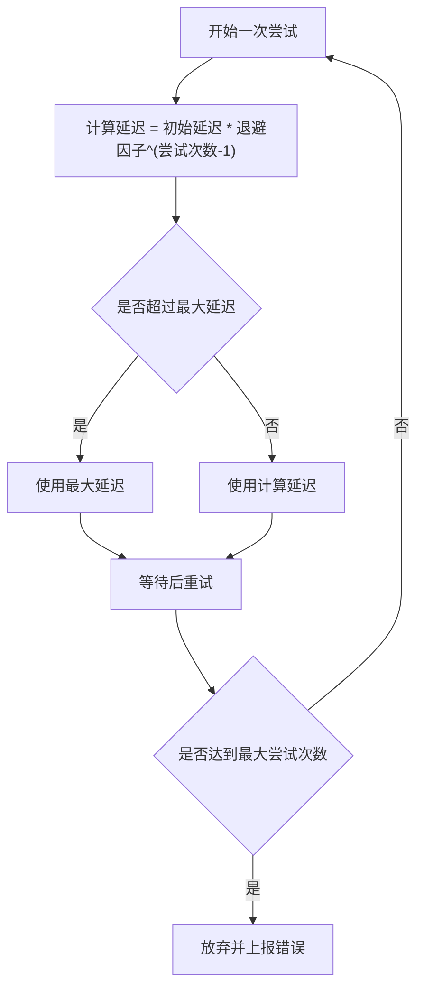
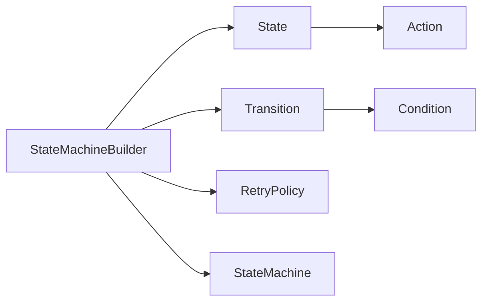

# 状态机定义

<cite>
**本文引用的文件**
- [StateMachineBuilder.java](file://state-machine-boot-starter/src/main/java/cn/chedejun/statemachine/core/StateMachineBuilder.java)
- [State.java](file://state-machine-boot-starter/src/main/java/cn/chedejun/statemachine/core/State.java)
- [Transition.java](file://state-machine-boot-starter/src/main/java/cn/chedejun/statemachine/core/Transition.java)
- [Condition.java](file://state-machine-boot-starter/src/main/java/cn/chedejun/statemachine/core/Condition.java)
- [Action.java](file://state-machine-boot-starter/src/main/java/cn/chedejun/statemachine/core/Action.java)
- [Context.java](file://state-machine-boot-starter/src/main/java/cn/chedejun/statemachine/core/Context.java)
- [RetryPolicy.java](file://state-machine-boot-starter/src/main/java/cn/chedejun/statemachine/core/RetryPolicy.java)
- [StateMachine.java](file://state-machine-boot-starter/src/main/java/cn/chedejun/statemachine/domain/engine/StateMachine.java)
- [StateMachineBuilderTest.java](file://state-machine-boot-starter/src/test/java/cn/chedejun/statemachine/core/StateMachineBuilderTest.java)
- [RetryPolicyTest.java](file://state-machine-boot-starter/src/test/java/cn/chedejun/statemachine/core/RetryPolicyTest.java)
- [OrderContext.java](file://state-machine-demo/src/main/java/cn/chedejun/demo/statemachine/OrderContext.java)
- [OutboundContext.java](file://state-machine-demo/src/main/java/cn/chedejun/demo/statemachine/OutboundContext.java)
- [MachineName.java](file://state-machine-boot-starter/src/main/java/cn/chedejun/statemachine/domain/shared/MachineName.java)
- [StateName.java](file://state-machine-boot-starter/src/main/java/cn/chedejun/statemachine/domain/shared/StateName.java)
</cite>

## 目录
1. [简介](#简介)
2. [项目结构](#项目结构)
3. [核心组件](#核心组件)
4. [架构总览](#架构总览)
5. [详细组件分析](#详细组件分析)
6. [依赖分析](#依赖分析)
7. [性能考虑](#性能考虑)
8. [故障排查指南](#故障排查指南)
9. [结论](#结论)
10. [附录](#附录)

## 简介
本文件面向“状态机定义”的使用者与维护者，系统性阐述如何使用 StateMachineBuilder 构建状态机定义。内容涵盖 Fluent API 设计与链式调用语法、状态与转换的定义方式、条件表达式编写、重试策略配置、版本管理与命名规范、最佳实践与常见陷阱，并提供从入门到进阶的完整学习路径。

## 项目结构
本项目采用分层+领域驱动设计：
- 核心模型位于 core 包：状态、转换、条件、动作、上下文、重试策略、构建器与最终不可变的状态机对象。
- 领域引擎位于 domain.engine：承载状态机定义的不可变对象，负责查询与路由决策。
- 测试覆盖了构建器、重试策略与集成行为验证。
- 示例模块演示了上下文扩展与真实业务场景。

图表来源
- [StateMachineBuilder.java:1-52](file://state-machine-boot-starter/src/main/java/cn/chedejun/statemachine/core/StateMachineBuilder.java#L1-L52)
- [State.java:1-23](file://state-machine-boot-starter/src/main/java/cn/chedejun/statemachine/core/State.java#L1-L23)
- [Transition.java:1-20](file://state-machine-boot-starter/src/main/java/cn/chedejun/statemachine/core/Transition.java#L1-L20)
- [Condition.java:1-7](file://state-machine-boot-starter/src/main/java/cn/chedejun/statemachine/core/Condition.java#L1-L7)
- [Action.java:1-12](file://state-machine-boot-starter/src/main/java/cn/chedejun/statemachine/core/Action.java#L1-L12)
- [Context.java:1-24](file://state-machine-boot-starter/src/main/java/cn/chedejun/statemachine/core/Context.java#L1-L24)
- [RetryPolicy.java:1-45](file://state-machine-boot-starter/src/main/java/cn/chedejun/statemachine/core/RetryPolicy.java#L1-L45)
- [StateMachine.java:1-77](file://state-machine-boot-starter/src/main/java/cn/chedejun/statemachine/domain/engine/StateMachine.java#L1-L77)
- [OrderContext.java:1-99](file://state-machine-demo/src/main/java/cn/chedejun/demo/statemachine/OrderContext.java#L1-L99)
- [OutboundContext.java:1-43](file://state-machine-demo/src/main/java/cn/chedejun/demo/statemachine/OutboundContext.java#L1-L43)
- [StateMachineBuilderTest.java:1-163](file://state-machine-boot-starter/src/test/java/cn/chedejun/statemachine/core/StateMachineBuilderTest.java#L1-L163)
- [RetryPolicyTest.java:1-35](file://state-machine-boot-starter/src/test/java/cn/chedejun/statemachine/core/RetryPolicyTest.java#L1-L35)

章节来源
- [StateMachineBuilder.java:1-52](file://state-machine-boot-starter/src/main/java/cn/chedejun/statemachine/core/StateMachineBuilder.java#L1-L52)
- [StateMachine.java:1-77](file://state-machine-boot-starter/src/main/java/cn/chedejun/statemachine/domain/engine/StateMachine.java#L1-L77)

## 核心组件
- 状态机构建器：提供 Fluent API，支持链式调用定义状态、转换、重试策略与上下文类型，并生成不可变的状态机定义对象。
- 状态：封装状态名、动作与挂起标记。
- 转换：封装“从某状态到某状态”的转换及条件。
- 条件：函数式接口，用于判断是否允许转换。
- 动作：函数式接口，执行具体业务逻辑，结果写入上下文。
- 上下文：键值存储，贯穿状态机执行全程。
- 重试策略：指数退避等策略，控制失败重试次数与延迟。
- 状态机定义：不可变对象，持有状态列表、转换列表、重试策略与上下文类型。

章节来源
- [State.java:1-23](file://state-machine-boot-starter/src/main/java/cn/chedejun/statemachine/core/State.java#L1-L23)
- [Transition.java:1-20](file://state-machine-boot-starter/src/main/java/cn/chedejun/statemachine/core/Transition.java#L1-L20)
- [Condition.java:1-7](file://state-machine-boot-starter/src/main/java/cn/chedejun/statemachine/core/Condition.java#L1-L7)
- [Action.java:1-12](file://state-machine-boot-starter/src/main/java/cn/chedejun/statemachine/core/Action.java#L1-L12)
- [Context.java:1-24](file://state-machine-boot-starter/src/main/java/cn/chedejun/statemachine/core/Context.java#L1-L24)
- [RetryPolicy.java:1-45](file://state-machine-boot-starter/src/main/java/cn/chedejun/statemachine/core/RetryPolicy.java#L1-L45)
- [StateMachine.java:1-77](file://state-machine-boot-starter/src/main/java/cn/chedejun/statemachine/domain/engine/StateMachine.java#L1-L77)

## 架构总览
StateMachineBuilder 将用户声明式的 DSL 转换为不可变的 StateMachine 定义对象。该对象在运行期仅承担“定义”职责，不参与实例执行；实例执行由上层引擎或应用服务负责。

图表来源
- [StateMachineBuilder.java:42-47](file://state-machine-boot-starter/src/main/java/cn/chedejun/statemachine/core/StateMachineBuilder.java#L42-L47)
- [StateMachine.java:28-41](file://state-machine-boot-starter/src/main/java/cn/chedejun/statemachine/domain/engine/StateMachine.java#L28-L41)

## 详细组件分析

### StateMachineBuilder：Fluent API 与链式调用
- 名称校验：构造时禁止空名称。
- 状态定义：
  - 普通状态：指定状态名与动作。
  - 挂起状态：用于中间检查点，便于暂停与恢复。
- 转换定义：
  - 无条件转换：直接从源状态到目标状态。
  - 条件转换：传入条件函数，根据上下文决定是否允许转换。
- 重试策略：可注入自定义重试策略，默认指数退避且最多尝试有限次。
- 上下文类型：可显式指定上下文类型，否则默认使用通用上下文。
- 构建：生成不可变定义对象，附带自增版本号。

图表来源
- [StateMachineBuilder.java:9-51](file://state-machine-boot-starter/src/main/java/cn/chedejun/statemachine/core/StateMachineBuilder.java#L9-L51)
- [State.java:3-22](file://state-machine-boot-starter/src/main/java/cn/chedejun/statemachine/core/State.java#L3-L22)
- [Transition.java:3-19](file://state-machine-boot-starter/src/main/java/cn/chedejun/statemachine/core/Transition.java#L3-L19)
- [RetryPolicy.java:5-44](file://state-machine-boot-starter/src/main/java/cn/chedejun/statemachine/core/RetryPolicy.java#L5-L44)
- [StateMachine.java:19-48](file://state-machine-boot-starter/src/main/java/cn/chedejun/statemachine/domain/engine/StateMachine.java#L19-L48)

章节来源
- [StateMachineBuilder.java:21-47](file://state-machine-boot-starter/src/main/java/cn/chedejun/statemachine/core/StateMachineBuilder.java#L21-L47)
- [StateMachineBuilderTest.java:35-83](file://state-machine-boot-starter/src/test/java/cn/chedejun/statemachine/core/StateMachineBuilderTest.java#L35-L83)

### 状态与转换：定义与路由
- 状态：
  - 必须提供非空状态名。
  - 可标记为挂起状态，用于暂停执行。
- 转换：
  - 必须提供非空“from”和“to”。
  - 条件为空表示总是允许转换；否则需满足条件。
- 路由：
  - 从当前状态出发，按声明顺序遍历转换，遇到第一个满足条件的转换即切换到目标状态。
  - 若无可用转换，则视为完成或失败（取决于上层语义）。

图表来源
- [StateMachine.java:63-71](file://state-machine-boot-starter/src/main/java/cn/chedejun/statemachine/domain/engine/StateMachine.java#L63-L71)
- [Transition.java:8-14](file://state-machine-boot-starter/src/main/java/cn/chedejun/statemachine/core/Transition.java#L8-L14)

章节来源
- [State.java:12-17](file://state-machine-boot-starter/src/main/java/cn/chedejun/statemachine/core/State.java#L12-L17)
- [Transition.java:8-14](file://state-machine-boot-starter/src/main/java/cn/chedejun/statemachine/core/Transition.java#L8-L14)
- [StateMachine.java:50-71](file://state-machine-boot-starter/src/main/java/cn/chedejun/statemachine/domain/engine/StateMachine.java#L50-L71)

### 条件表达式：编写与调试
- 条件接口为函数式接口，接收上下文并返回布尔值。
- 建议：
  - 条件尽量幂等、无副作用。
  - 使用上下文中的明确字段进行判断，避免复杂逻辑。
  - 在测试中对每条转换的条件进行覆盖，确保边界清晰。
- 常见陷阱：
  - 忘记设置条件导致“总是允许转换”，造成状态机无法正确分流。
  - 条件过于复杂难以维护，建议拆分为多个简单转换。

章节来源
- [Condition.java:4-6](file://state-machine-boot-starter/src/main/java/cn/chedejun/statemachine/core/Condition.java#L4-L6)
- [StateMachineBuilderTest.java:126-143](file://state-machine-boot-starter/src/test/java/cn/chedejun/statemachine/core/StateMachineBuilderTest.java#L126-L143)

### 重试策略：配置与计算
- 默认策略：指数退避，最大尝试次数有限。
- 关键参数：
  - 最大尝试次数
  - 初始延迟
  - 最大延迟
  - 退避因子
- 延迟计算：按指数增长，超过最大延迟则固定为最大延迟。
- 使用建议：
  - 对易失败的外部调用启用重试。
  - 对实时性要求高的流程谨慎使用重试，避免阻塞。

图表来源
- [RetryPolicy.java:26-30](file://state-machine-boot-starter/src/main/java/cn/chedejun/statemachine/core/RetryPolicy.java#L26-L30)
- [RetryPolicyTest.java:13-29](file://state-machine-boot-starter/src/test/java/cn/chedejun/statemachine/core/RetryPolicyTest.java#L13-L29)

章节来源
- [RetryPolicy.java:18-43](file://state-machine-boot-starter/src/main/java/cn/chedejun/statemachine/core/RetryPolicy.java#L18-L43)
- [RetryPolicyTest.java:9-33](file://state-machine-boot-starter/src/test/java/cn/chedejun/statemachine/core/RetryPolicyTest.java#L9-L33)

### 版本管理与命名规范
- 版本生成：构建器内部使用原子计数器生成自增版本号，格式为“vN”。
- 命名：
  - 状态机名称：应具备业务含义，避免重复。
  - 状态名称：建议使用动词短语或名词短语，保持一致性。
  - 状态机与状态名称均不能为空。
- 建议：
  - 同一业务流程的不同版本通过版本号区分，便于灰度与回滚。
  - 使用强类型的名称包装类（如 MachineName、StateName）以增强语义与安全性。

章节来源
- [StateMachineBuilder.java:19-24](file://state-machine-boot-starter/src/main/java/cn/chedejun/statemachine/core/StateMachineBuilder.java#L19-L24)
- [StateMachineBuilder.java:42-47](file://state-machine-boot-starter/src/main/java/cn/chedejun/statemachine/core/StateMachineBuilder.java#L42-L47)
- [MachineName.java:5-24](file://state-machine-boot-starter/src/main/java/cn/chedejun/statemachine/domain/shared/MachineName.java#L5-L24)
- [StateName.java:5-24](file://state-machine-boot-starter/src/main/java/cn/chedejun/statemachine/domain/shared/StateName.java#L5-L24)

### 上下文与动作：数据与副作用
- 上下文：
  - 提供键值存取能力，所有动作执行结果可通过上下文传递。
  - 支持从 Map 初始化与导出，便于持久化与序列化。
- 动作：
  - 执行业务逻辑，通过上下文写入结果。
  - 建议动作保持无副作用、可重入，便于重试与并发执行。

章节来源
- [Context.java:6-23](file://state-machine-boot-starter/src/main/java/cn/chedejun/statemachine/core/Context.java#L6-L23)
- [Action.java:3-11](file://state-machine-boot-starter/src/main/java/cn/chedejun/statemachine/core/Action.java#L3-L11)

### 实战示例与场景
以下示例以“路径引用”的形式给出，便于快速定位到源码位置进行对照学习：

- 简单转换（无条件）
  - 定义：参考 [StateMachineBuilderTest.java:35-41](file://state-machine-boot-starter/src/test/java/cn/chedejun/statemachine/core/StateMachineBuilderTest.java#L35-L41)
  - 行为验证：参考 [StateMachineBuilderTest.java:66-83](file://state-machine-boot-starter/src/test/java/cn/chedejun/statemachine/core/StateMachineBuilderTest.java#L66-L83)

- 条件分支（多路选择）
  - 定义：参考 [StateMachineBuilderTest.java:126-143](file://state-machine-boot-starter/src/test/java/cn/chedejun/statemachine/core/StateMachineBuilderTest.java#L126-L143)
  - 行为验证：参考 [StateMachineBuilderTest.java:145-161](file://state-machine-boot-starter/src/test/java/cn/chedejun/statemachine/core/StateMachineBuilderTest.java#L145-L161)

- 挂起点（暂停/恢复）
  - 定义：参考 [StateMachineBuilderTest.java:85-106](file://state-machine-boot-starter/src/test/java/cn/chedejun/statemachine/core/StateMachineBuilderTest.java#L85-L106)
  - 行为验证：参考 [StateMachineBuilderTest.java:108-124](file://state-machine-boot-starter/src/test/java/cn/chedejun/statemachine/core/StateMachineBuilderTest.java#L108-L124)

- 自定义上下文（订单/出库）
  - 订单上下文：参考 [OrderContext.java:10-98](file://state-machine-demo/src/main/java/cn/chedejun/demo/statemachine/OrderContext.java#L10-L98)
  - 出库上下文：参考 [OutboundContext.java:8-42](file://state-machine-demo/src/main/java/cn/chedejun/demo/statemachine/OutboundContext.java#L8-L42)

- 重试策略配置
  - 默认策略：参考 [StateMachineBuilder.java](file://state-machine-boot-starter/src/main/java/cn/chedejun/statemachine/core/StateMachineBuilder.java#L14)
  - 自定义策略：参考 [RetryPolicy.java:18-43](file://state-machine-boot-starter/src/main/java/cn/chedejun/statemachine/core/RetryPolicy.java#L18-L43)
  - 行为验证：参考 [RetryPolicyTest.java:13-29](file://state-machine-boot-starter/src/test/java/cn/chedejun/statemachine/core/RetryPolicyTest.java#L13-L29)

## 依赖分析
- 组件内聚与耦合：
  - StateMachineBuilder 低耦合地聚合 State、Transition、RetryPolicy，构建完成后交由不可变对象承载。
  - State 与 Transition 仅依赖 Action 与 Condition 接口，便于替换实现。
- 外部依赖：
  - Spring JDBC 模板用于持久化（在构建器中可选注入），与状态机定义本身解耦。
- 循环依赖：
  - 未发现循环依赖，构建器与定义对象均为单向依赖。

图表来源
- [StateMachineBuilder.java:11-16](file://state-machine-boot-starter/src/main/java/cn/chedejun/statemachine/core/StateMachineBuilder.java#L11-L16)
- [State.java:4-6](file://state-machine-boot-starter/src/main/java/cn/chedejun/statemachine/core/State.java#L4-L6)
- [Transition.java:4-6](file://state-machine-boot-starter/src/main/java/cn/chedejun/statemachine/core/Transition.java#L4-L6)
- [StateMachine.java:23-26](file://state-machine-boot-starter/src/main/java/cn/chedejun/statemachine/domain/engine/StateMachine.java#L23-L26)

章节来源
- [StateMachineBuilder.java:11-16](file://state-machine-boot-starter/src/main/java/cn/chedejun/statemachine/core/StateMachineBuilder.java#L11-L16)
- [StateMachine.java:23-26](file://state-machine-boot-starter/src/main/java/cn/chedejun/statemachine/domain/engine/StateMachine.java#L23-L26)

## 性能考虑
- 状态与转换数量：
  - 过多的转换会增加路由查找成本，建议合并相似分支或引入中间状态。
- 条件复杂度：
  - 条件应尽量轻量，避免在条件中执行耗时操作。
- 重试策略：
  - 合理设置最大尝试次数与最大延迟，防止资源占用过高。
- 上下文大小：
  - 控制上下文中的数据规模，避免序列化/持久化的开销。

## 故障排查指南
- 常见异常与定位：
  - 名称为空：构建器会在构造阶段抛出非法参数异常。参考 [StateMachineBuilder.java:21-24](file://state-machine-boot-starter/src/main/java/cn/chedejun/statemachine/core/StateMachineBuilder.java#L21-L24)
  - 状态/转换名称为空：状态与转换构造时会校验。参考 [State.java:12-14](file://state-machine-boot-starter/src/main/java/cn/chedejun/statemachine/core/State.java#L12-L14)、[Transition.java:8-11](file://state-machine-boot-starter/src/main/java/cn/chedejun/statemachine/core/Transition.java#L8-L11)
  - 无可用转换：当从某状态出发没有满足条件的转换时，路由将结束。参考 [StateMachine.java:63-71](file://state-machine-boot-starter/src/main/java/cn/chedejun/statemachine/domain/engine/StateMachine.java#L63-L71)
- 测试辅助：
  - 使用测试用例验证构建器行为与重试策略。参考 [StateMachineBuilderTest.java:35-161](file://state-machine-boot-starter/src/test/java/cn/chedejun/statemachine/core/StateMachineBuilderTest.java#L35-L161)、[RetryPolicyTest.java:9-33](file://state-machine-boot-starter/src/test/java/cn/chedejun/statemachine/core/RetryPolicyTest.java#L9-L33)

章节来源
- [StateMachineBuilder.java:21-24](file://state-machine-boot-starter/src/main/java/cn/chedejun/statemachine/core/StateMachineBuilder.java#L21-L24)
- [State.java:12-14](file://state-machine-boot-starter/src/main/java/cn/chedejun/statemachine/core/State.java#L12-L14)
- [Transition.java:8-11](file://state-machine-boot-starter/src/main/java/cn/chedejun/statemachine/core/Transition.java#L8-L11)
- [StateMachine.java:63-71](file://state-machine-boot-starter/src/main/java/cn/chedejun/statemachine/domain/engine/StateMachine.java#L63-L71)
- [StateMachineBuilderTest.java:62-64](file://state-machine-boot-starter/src/test/java/cn/chedejun/statemachine/core/StateMachineBuilderTest.java#L62-L64)
- [RetryPolicyTest.java:9-33](file://state-machine-boot-starter/src/test/java/cn/chedejun/statemachine/core/RetryPolicyTest.java#L9-L33)

## 结论
StateMachineBuilder 通过 Fluent API 将状态机定义过程编程化、可组合化。借助清晰的模型边界（定义对象不可变、动作与条件解耦、上下文统一承载）、完善的版本与命名规范以及可配置的重试策略，开发者可以高效构建从简单到复杂的业务流程。建议在实践中遵循“小步快跑、先有定义再有执行”的原则，并结合测试用例持续验证路由与重试行为。

## 附录

### 入门教程（逐步示例）
- 步骤1：创建一个最简状态机
  - 参考：[StateMachineBuilderTest.java:35-41](file://state-machine-boot-starter/src/test/java/cn/chedejun/statemachine/core/StateMachineBuilderTest.java#L35-L41)
- 步骤2：添加条件分支
  - 参考：[StateMachineBuilderTest.java:126-143](file://state-machine-boot-starter/src/test/java/cn/chedejun/statemachine/core/StateMachineBuilderTest.java#L126-L143)
- 步骤3：引入挂起点
  - 参考：[StateMachineBuilderTest.java:85-106](file://state-machine-boot-starter/src/test/java/cn/chedejun/statemachine/core/StateMachineBuilderTest.java#L85-L106)
- 步骤4：自定义上下文
  - 参考：[OrderContext.java:10-98](file://state-machine-demo/src/main/java/cn/chedejun/demo/statemachine/OrderContext.java#L10-L98)、[OutboundContext.java:8-42](file://state-machine-demo/src/main/java/cn/chedejun/demo/statemachine/OutboundContext.java#L8-L42)
- 步骤5：配置重试策略
  - 参考：[RetryPolicy.java:18-43](file://state-machine-boot-starter/src/main/java/cn/chedejun/statemachine/core/RetryPolicy.java#L18-L43)、[RetryPolicyTest.java:13-29](file://state-machine-boot-starter/src/test/java/cn/chedejun/statemachine/core/RetryPolicyTest.java#L13-L29)

### 进阶实践（深度定制）
- 并行状态与复合状态
  - 当前模型以线性状态机为主，若需并行/嵌套，请在上层服务中协调多个子状态机或引入复合状态机编排。
- 动作与条件的扩展
  - 通过实现 Action 与 Condition 接口，复用业务逻辑或引入外部依赖。
- 版本演进
  - 新增状态或转换时，使用新版本号发布；保留旧版本以支持回滚与灰度。