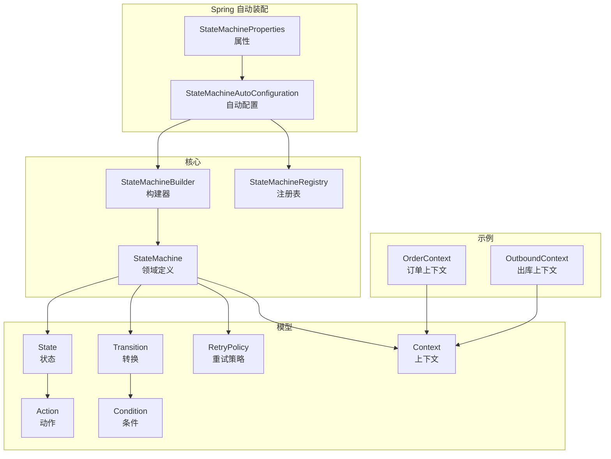
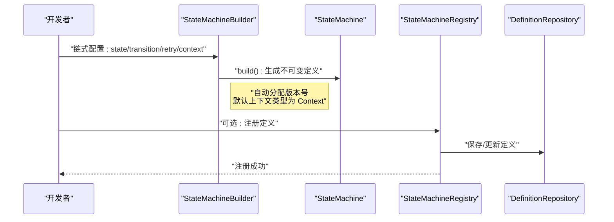
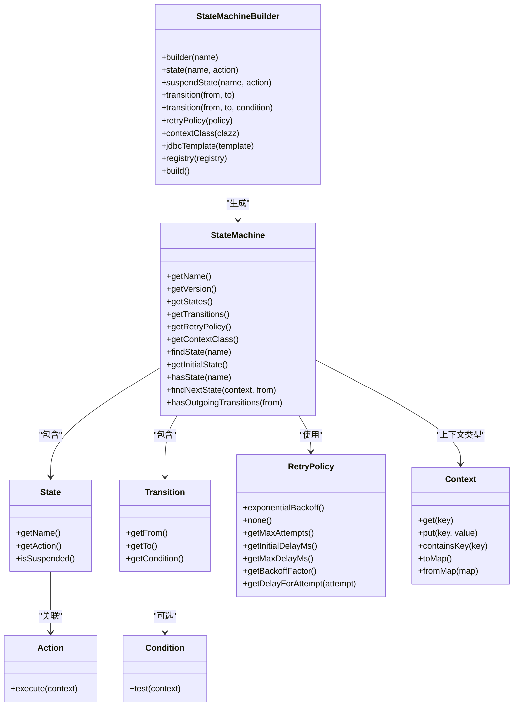
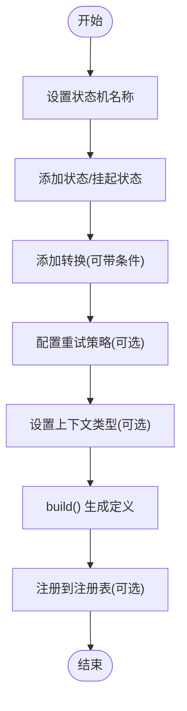

# 状态机构建器

<cite>
**本文引用的文件**
- [StateMachineBuilder.java](file://state-machine-boot-starter/src/main/java/cn/chedejun/statemachine/core/StateMachineBuilder.java)
- [StateMachineRegistry.java](file://state-machine-boot-starter/src/main/java/cn/chedejun/statemachine/core/StateMachineRegistry.java)
- [StateMachine.java](file://state-machine-boot-starter/src/main/java/cn/chedejun/statemachine/domain/engine/StateMachine.java)
- [State.java](file://state-machine-boot-starter/src/main/java/cn/chedejun/statemachine/core/State.java)
- [Transition.java](file://state-machine-boot-starter/src/main/java/cn/chedejun/statemachine/core/Transition.java)
- [Action.java](file://state-machine-boot-starter/src/main/java/cn/chedejun/statemachine/core/Action.java)
- [Condition.java](file://state-machine-boot-starter/src/main/java/cn/chedejun/statemachine/core/Condition.java)
- [RetryPolicy.java](file://state-machine-boot-starter/src/main/java/cn/chedejun/statemachine/core/RetryPolicy.java)
- [Context.java](file://state-machine-boot-starter/src/main/java/cn/chedejun/statemachine/core/Context.java)
- [StateMachineAutoConfiguration.java](file://state-machine-boot-starter/src/main/java/cn/chedejun/statemachine/autoconfigure/StateMachineAutoConfiguration.java)
- [StateMachineProperties.java](file://state-machine-boot-starter/src/main/java/cn/chedejun/statemachine/autoconfigure/StateMachineProperties.java)
- [StateMachineBuilderTest.java](file://state-machine-boot-starter/src/test/java/cn/chedejun/statemachine/core/StateMachineBuilderTest.java)
- [OrderContext.java](file://state-machine-demo/src/main/java/cn/chedejun/demo/statemachine/OrderContext.java)
- [OutboundContext.java](file://state-machine-demo/src/main/java/cn/chedejun/demo/statemachine/OutboundContext.java)
</cite>

## 目录
1. [引言](#引言)
2. [项目结构](#项目结构)
3. [核心组件](#核心组件)
4. [架构总览](#架构总览)
5. [详细组件分析](#详细组件分析)
6. [依赖分析](#依赖分析)
7. [性能考虑](#性能考虑)
8. [故障排查指南](#故障排查指南)
9. [结论](#结论)
10. [附录](#附录)

## 引言
本文件系统性阐述状态机构建器的设计与实现，重点围绕 StateMachineBuilder 的 Fluent API 模式、初始化流程、链式调用语法与参数配置展开；同时说明状态机名称规范、版本管理策略、上下文类型设置以及与状态机注册表的集成机制。文档提供从入门到进阶的使用教程与最佳实践，并给出错误处理与验证规则说明。

## 项目结构
本项目采用分层+特性混合的组织方式：
- 核心域模型与构建器位于 core 包，包含状态、转换、动作、条件、重试策略与构建器等。
- 领域引擎 StateMachine 作为不可变定义载体，位于 domain/engine。
- Spring Boot 自动装配在 autoconfigure 包中，负责注册表、仓储与 Bean 后置处理器等。
- 示例上下文位于 demo/statemachine，展示如何扩展 Context。

图表来源
- [StateMachineBuilder.java:1-52](file://state-machine-boot-starter/src/main/java/cn/chedejun/statemachine/core/StateMachineBuilder.java#L1-L52)
- [StateMachine.java:1-77](file://state-machine-boot-starter/src/main/java/cn/chedejun/statemachine/domain/engine/StateMachine.java#L1-L77)
- [StateMachineRegistry.java:1-114](file://state-machine-boot-starter/src/main/java/cn/chedejun/statemachine/core/StateMachineRegistry.java#L1-L114)
- [State.java:1-23](file://state-machine-boot-starter/src/main/java/cn/chedejun/statemachine/core/State.java#L1-L23)
- [Transition.java:1-20](file://state-machine-boot-starter/src/main/java/cn/chedejun/statemachine/core/Transition.java#L1-L20)
- [Action.java:1-12](file://state-machine-boot-starter/src/main/java/cn/chedejun/statemachine/core/Action.java#L1-L12)
- [Condition.java:1-7](file://state-machine-boot-starter/src/main/java/cn/chedejun/statemachine/core/Condition.java#L1-L7)
- [RetryPolicy.java:1-45](file://state-machine-boot-starter/src/main/java/cn/chedejun/statemachine/core/RetryPolicy.java#L1-L45)
- [Context.java:1-24](file://state-machine-boot-starter/src/main/java/cn/chedejun/statemachine/core/Context.java#L1-L24)
- [StateMachineAutoConfiguration.java:1-149](file://state-machine-boot-starter/src/main/java/cn/chedejun/statemachine/autoconfigure/StateMachineAutoConfiguration.java#L1-L149)
- [StateMachineProperties.java:1-42](file://state-machine-boot-starter/src/main/java/cn/chedejun/statemachine/autoconfigure/StateMachineProperties.java#L1-L42)
- [OrderContext.java:1-99](file://state-machine-demo/src/main/java/cn/chedejun/demo/statemachine/OrderContext.java#L1-L99)
- [OutboundContext.java:1-43](file://state-machine-demo/src/main/java/cn/chedejun/demo/statemachine/OutboundContext.java#L1-L43)

章节来源
- [StateMachineBuilder.java:1-52](file://state-machine-boot-starter/src/main/java/cn/chedejun/statemachine/core/StateMachineBuilder.java#L1-L52)
- [StateMachineAutoConfiguration.java:1-149](file://state-machine-boot-starter/src/main/java/cn/chedejun/statemachine/autoconfigure/StateMachineAutoConfiguration.java#L1-L149)

## 核心组件
- 构建器 StateMachineBuilder：提供 Fluent API，支持状态、挂起状态、转换、重试策略、上下文类型与数据源注入，并生成不可变的 StateMachine 定义。
- 领域定义 StateMachine：不可变定义对象，持有名称、版本、状态列表、转换列表、重试策略与上下文类型。
- 注册表 StateMachineRegistry：负责将状态机定义持久化与内存缓存，提供最新版本查询与版本列表查询。
- 模型元素：State、Transition、Action、Condition、RetryPolicy、Context。
- 自动装配 StateMachineAutoConfiguration：在 Spring 环境中注入注册表、仓储与后置处理器，完成构建器与注册表的绑定。

章节来源
- [StateMachineBuilder.java:1-52](file://state-machine-boot-starter/src/main/java/cn/chedejun/statemachine/core/StateMachineBuilder.java#L1-L52)
- [StateMachine.java:1-77](file://state-machine-boot-starter/src/main/java/cn/chedejun/statemachine/domain/engine/StateMachine.java#L1-L77)
- [StateMachineRegistry.java:1-114](file://state-machine-boot-starter/src/main/java/cn/chedejun/statemachine/core/StateMachineRegistry.java#L1-L114)
- [State.java:1-23](file://state-machine-boot-starter/src/main/java/cn/chedejun/statemachine/core/State.java#L1-L23)
- [Transition.java:1-20](file://state-machine-boot-starter/src/main/java/cn/chedejun/statemachine/core/Transition.java#L1-L20)
- [Action.java:1-12](file://state-machine-boot-starter/src/main/java/cn/chedejun/statemachine/core/Action.java#L1-L12)
- [Condition.java:1-7](file://state-machine-boot-starter/src/main/java/cn/chedejun/statemachine/core/Condition.java#L1-L7)
- [RetryPolicy.java:1-45](file://state-machine-boot-starter/src/main/java/cn/chedejun/statemachine/core/RetryPolicy.java#L1-L45)
- [Context.java:1-24](file://state-machine-boot-starter/src/main/java/cn/chedejun/statemachine/core/Context.java#L1-L24)
- [StateMachineAutoConfiguration.java:1-149](file://state-machine-boot-starter/src/main/java/cn/chedejun/statemachine/autoconfigure/StateMachineAutoConfiguration.java#L1-L149)

## 架构总览
下图展示了构建器、注册表与 Spring 自动装配之间的交互关系，以及构建器如何在构建完成后被注册表持久化与缓存。

图表来源
- [StateMachineBuilder.java:42-47](file://state-machine-boot-starter/src/main/java/cn/chedejun/statemachine/core/StateMachineBuilder.java#L42-L47)
- [StateMachineRegistry.java:29-73](file://state-machine-boot-starter/src/main/java/cn/chedejun/statemachine/core/StateMachineRegistry.java#L29-L73)

## 详细组件分析

### 设计理念与 Fluent API
- 命名与职责清晰：每个方法专注于单一职责，如添加状态、添加转换、设置重试策略、设置上下文类型等。
- 链式调用：所有配置方法返回当前构建器实例，便于连续调用。
- 不可变定义：build() 生成不可变的 StateMachine 对象，确保运行期一致性。
- 默认值与可选配置：重试策略、上下文类型、JDBC 模板、注册表均可按需注入或使用默认行为。

章节来源
- [StateMachineBuilder.java:21-47](file://state-machine-boot-starter/src/main/java/cn/chedejun/statemachine/core/StateMachineBuilder.java#L21-L47)

### 初始化过程与版本管理
- 名称校验：构造函数对名称进行非空校验，防止非法名称。
- 版本生成：使用原子计数器生成递增版本号，格式为“vN”，保证同一名称下的版本唯一性。
- 上下文类型：若未显式指定，使用默认 Context 类型；否则使用用户提供的泛型上下文类型。

章节来源
- [StateMachineBuilder.java:21-24](file://state-machine-boot-starter/src/main/java/cn/chedejun/statemachine/core/StateMachineBuilder.java#L21-L24)
- [StateMachineBuilder.java:42-47](file://state-machine-boot-starter/src/main/java/cn/chedejun/statemachine/core/StateMachineBuilder.java#L42-L47)

### 链式调用语法与参数配置
- 状态与挂起状态：state(...) 添加普通状态；suspendState(...) 添加挂起状态，用于中断执行。
- 转换：transition(from,to) 与 transition(from,to,condition) 支持无条件与有条件转换。
- 重试策略：retryPolicy(...) 可替换默认指数回退策略。
- 上下文类型：contextClass(...) 指定自定义上下文类型。
- 数据源与注册表：jdbcTemplate(...) 与 registry(...) 在 Spring 环境中由自动装配注入。

章节来源
- [StateMachineBuilder.java:28-41](file://state-machine-boot-starter/src/main/java/cn/chedejun/statemachine/core/StateMachineBuilder.java#L28-L41)

### 状态机名称规范与版本管理
- 名称规范：非空且非空白字符串，建议使用语义明确的标识符。
- 版本管理：版本号以“v”前缀加递增数字组成，注册表会根据名称+版本进行去重与更新。

章节来源
- [StateMachineBuilder.java:21-24](file://state-machine-boot-starter/src/main/java/cn/chedejun/statemachine/core/StateMachineBuilder.java#L21-L24)
- [StateMachineBuilder.java:42-47](file://state-machine-boot-starter/src/main/java/cn/chedejun/statemachine/core/StateMachineBuilder.java#L42-L47)
- [StateMachineRegistry.java:62-72](file://state-machine-boot-starter/src/main/java/cn/chedejun/statemachine/core/StateMachineRegistry.java#L62-L72)

### 上下文类型设置
- 默认上下文：Context 提供通用键值存储能力。
- 自定义上下文：通过 contextClass(...) 或直接在构建器上使用泛型上下文类型，示例中演示了订单与出库单上下文的扩展。

章节来源
- [Context.java:1-24](file://state-machine-boot-starter/src/main/java/cn/chedejun/statemachine/core/Context.java#L1-L24)
- [OrderContext.java:1-99](file://state-machine-demo/src/main/java/cn/chedejun/demo/statemachine/OrderContext.java#L1-L99)
- [OutboundContext.java:1-43](file://state-machine-demo/src/main/java/cn/chedejun/demo/statemachine/OutboundContext.java#L1-L43)

### 构建器与注册表的集成机制
- Spring 自动装配：自动配置在 Bean 初始化后，为 StateMachineBuilder 注入 JdbcTemplate 与 StateMachineRegistry。
- 定义注册：当构建器生成的 StateMachine Bean 存在时，自动配置将其注册到注册表；注册表负责序列化定义并持久化到数据库。

章节来源
- [StateMachineAutoConfiguration.java:72-109](file://state-machine-boot-starter/src/main/java/cn/chedejun/statemachine/autoconfigure/StateMachineAutoConfiguration.java#L72-L109)
- [StateMachineRegistry.java:29-73](file://state-machine-boot-starter/src/main/java/cn/chedejun/statemachine/core/StateMachineRegistry.java#L29-L73)

### 错误处理与验证规则
- 名称校验：名称为空或仅空白字符将抛出非法参数异常。
- 状态与转换校验：StateMachine 构造时要求至少有一个状态与一个转换，避免无效定义。
- 转换端点校验：Transition 构造时对 from 与 to 进行非空校验。
- 状态名称校验：State 构造时对名称进行非空校验。
- 注册失败容错：注册表在序列化重试策略失败时记录警告并使用空 JSON，保证注册流程不中断。

章节来源
- [StateMachineBuilder.java:21-24](file://state-machine-boot-starter/src/main/java/cn/chedejun/statemachine/core/StateMachineBuilder.java#L21-L24)
- [StateMachine.java:30-34](file://state-machine-boot-starter/src/main/java/cn/chedejun/statemachine/domain/engine/StateMachine.java#L30-L34)
- [Transition.java:8-14](file://state-machine-boot-starter/src/main/java/cn/chedejun/statemachine/core/Transition.java#L8-L14)
- [State.java:12-17](file://state-machine-boot-starter/src/main/java/cn/chedejun/statemachine/core/State.java#L12-L17)
- [StateMachineRegistry.java:57-60](file://state-machine-boot-starter/src/main/java/cn/chedejun/statemachine/core/StateMachineRegistry.java#L57-L60)

### 使用示例与最佳实践

#### 基础构建
- 步骤：使用 builder(...) 创建构建器，添加状态与转换，最后 build() 生成定义。
- 验证：测试覆盖了基础构建、版本分配与注册表集成。

章节来源
- [StateMachineBuilderTest.java:35-49](file://state-machine-boot-starter/src/test/java/cn/chedejun/statemachine/core/StateMachineBuilderTest.java#L35-L49)

#### 自定义配置
- 重试策略：通过 retryPolicy(...) 设置无重试或自定义指数回退策略。
- 上下文类型：通过 contextClass(...) 指定自定义上下文类型，示例中使用订单与出库上下文。

章节来源
- [StateMachineBuilderTest.java:66-83](file://state-machine-boot-starter/src/test/java/cn/chedejun/statemachine/core/StateMachineBuilderTest.java#L66-L83)
- [OrderContext.java:1-99](file://state-machine-demo/src/main/java/cn/chedejun/demo/statemachine/OrderContext.java#L1-L99)
- [OutboundContext.java:1-43](file://state-machine-demo/src/main/java/cn/chedejun/demo/statemachine/OutboundContext.java#L1-L43)

#### 高级选项
- 挂起状态：suspendState(...) 用于在特定状态中断执行，便于后续恢复。
- 条件转换：transition(from,to,condition) 支持基于上下文的条件路由。
- 注册表集成：在 Spring 环境中，自动装配会自动为构建器注入注册表并完成注册。

章节来源
- [StateMachineBuilderTest.java:85-124](file://state-machine-boot-starter/src/test/java/cn/chedejun/statemachine/core/StateMachineBuilderTest.java#L85-L124)
- [StateMachineAutoConfiguration.java:72-109](file://state-machine-boot-starter/src/main/java/cn/chedejun/statemachine/autoconfigure/StateMachineAutoConfiguration.java#L72-L109)

## 依赖分析
构建器与其依赖的关系如下：

图表来源
- [StateMachineBuilder.java:1-52](file://state-machine-boot-starter/src/main/java/cn/chedejun/statemachine/core/StateMachineBuilder.java#L1-L52)
- [StateMachine.java:1-77](file://state-machine-boot-starter/src/main/java/cn/chedejun/statemachine/domain/engine/StateMachine.java#L1-L77)
- [State.java:1-23](file://state-machine-boot-starter/src/main/java/cn/chedejun/statemachine/core/State.java#L1-L23)
- [Transition.java:1-20](file://state-machine-boot-starter/src/main/java/cn/chedejun/statemachine/core/Transition.java#L1-L20)
- [Action.java:1-12](file://state-machine-boot-starter/src/main/java/cn/chedejun/statemachine/core/Action.java#L1-L12)
- [Condition.java:1-7](file://state-machine-boot-starter/src/main/java/cn/chedejun/statemachine/core/Condition.java#L1-L7)
- [RetryPolicy.java:1-45](file://state-machine-boot-starter/src/main/java/cn/chedejun/statemachine/core/RetryPolicy.java#L1-L45)
- [Context.java:1-24](file://state-machine-boot-starter/src/main/java/cn/chedejun/statemachine/core/Context.java#L1-L24)

## 性能考虑
- 不可变定义：StateMachine 为不可变对象，避免并发读取时的同步开销。
- 原子版本计数：版本号生成使用原子计数器，线程安全且低开销。
- 转换查找：findNextState 逐条遍历转换，复杂度为 O(E)，其中 E 为从某状态出发的转换数量；建议控制每状态的转换数量以优化性能。
- 序列化成本：注册表在保存定义时进行 JSON 序列化，建议保持状态与转换数量合理，避免过大定义影响持久化性能。

## 故障排查指南
- 名称为空：检查构建器构造参数，确保名称非空且非空白。
- 缺少状态或转换：StateMachine 构造时会校验至少存在一个状态与一个转换，确保通过 transition(...) 添加了有效转换。
- 转换端点为空：Transition 构造时对 from 与 to 进行校验，确保状态名称正确。
- 注册失败：注册表在序列化重试策略失败时会记录警告并使用空 JSON，不影响注册流程，但可能影响策略持久化。
- Spring 环境未生效：确认已引入数据源与自动配置，Bean 后置处理器会自动为构建器注入 JdbcTemplate 与注册表。

章节来源
- [StateMachineBuilder.java:21-24](file://state-machine-boot-starter/src/main/java/cn/chedejun/statemachine/core/StateMachineBuilder.java#L21-L24)
- [StateMachine.java:30-34](file://state-machine-boot-starter/src/main/java/cn/chedejun/statemachine/domain/engine/StateMachine.java#L30-L34)
- [Transition.java:8-14](file://state-machine-boot-starter/src/main/java/cn/chedejun/statemachine/core/Transition.java#L8-L14)
- [StateMachineRegistry.java:57-60](file://state-machine-boot-starter/src/main/java/cn/chedejun/statemachine/core/StateMachineRegistry.java#L57-L60)
- [StateMachineAutoConfiguration.java:72-109](file://state-machine-boot-starter/src/main/java/cn/chedejun/statemachine/autoconfigure/StateMachineAutoConfiguration.java#L72-L109)

## 结论
StateMachineBuilder 通过 Fluent API 将状态机定义的构建过程抽象为直观的链式调用，结合不可变定义与版本管理，提供了清晰、可扩展的状态机建模能力。在 Spring 环境中，自动装配进一步简化了构建器与注册表的集成，使得状态机定义能够自动注册与持久化。配合自定义上下文类型与灵活的重试策略，开发者可以快速搭建从简单到复杂的业务流程编排。

## 附录

### 使用流程图（入门级）

图表来源
- [StateMachineBuilder.java:28-47](file://state-machine-boot-starter/src/main/java/cn/chedejun/statemachine/core/StateMachineBuilder.java#L28-L47)
- [StateMachineRegistry.java:29-73](file://state-machine-boot-starter/src/main/java/cn/chedejun/statemachine/core/StateMachineRegistry.java#L29-L73)