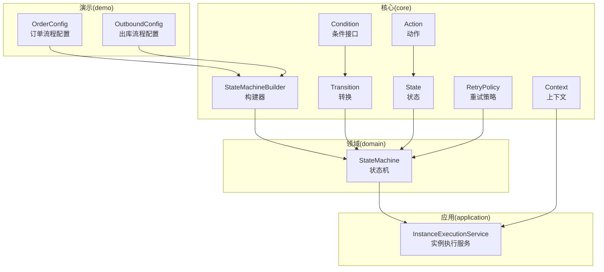
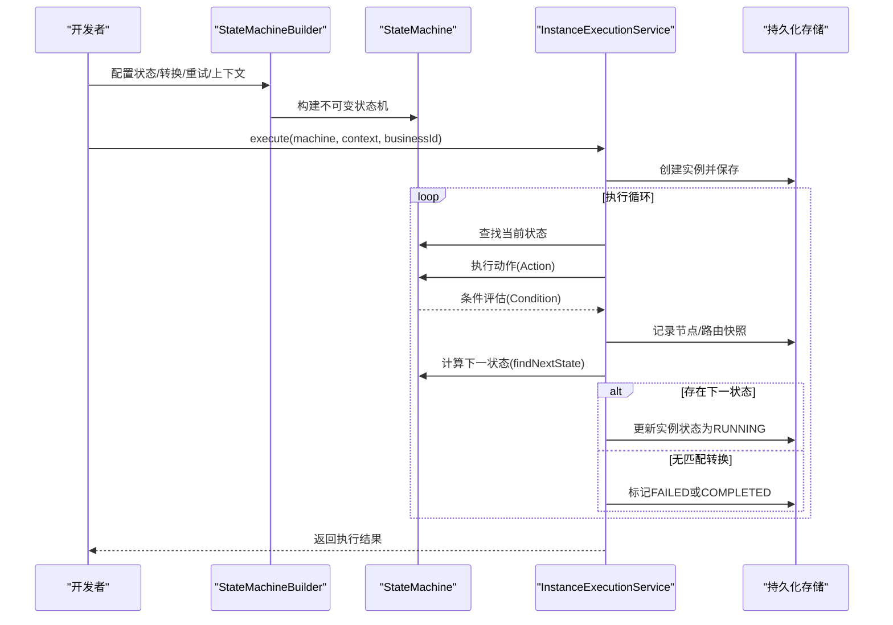
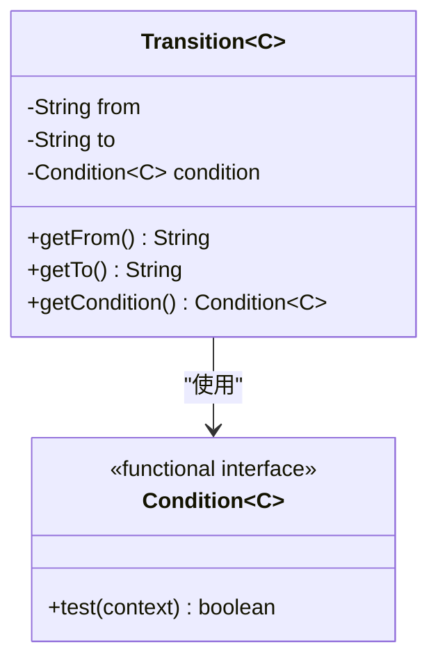
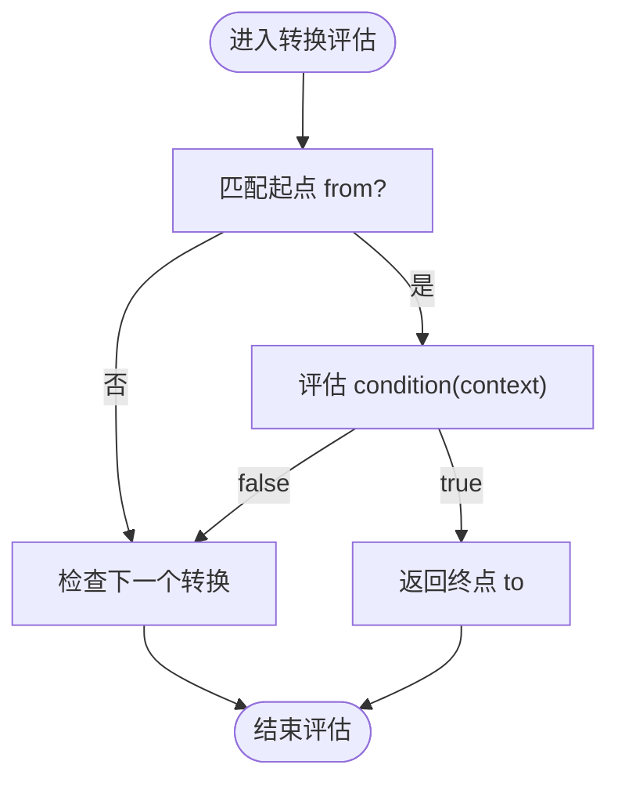
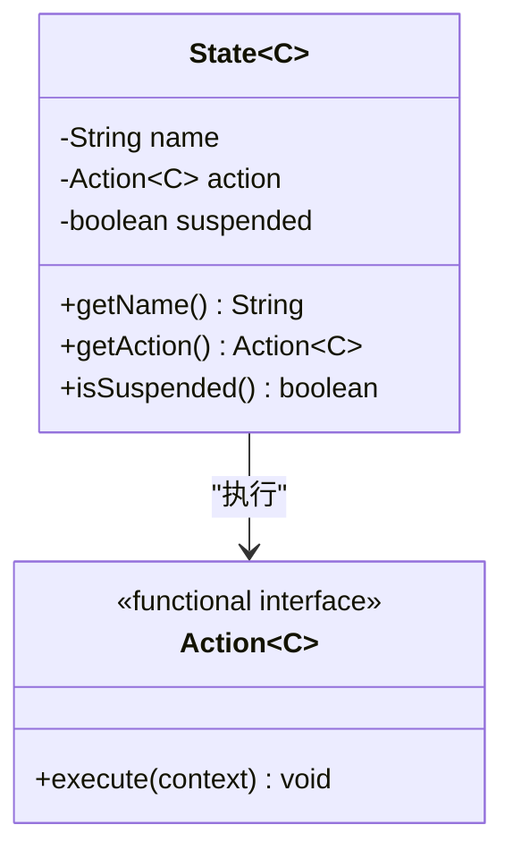
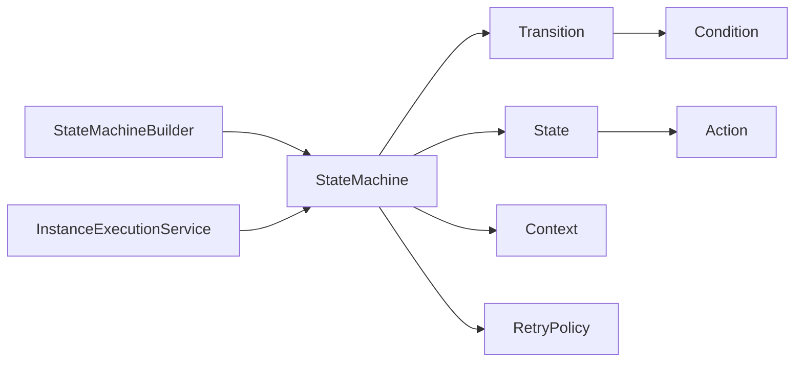

# 转换配置

<cite>
**本文引用的文件**
- [Transition.java](file://state-machine-boot-starter/src/main/java/cn/chedejun/statemachine/core/Transition.java)
- [Condition.java](file://state-machine-boot-starter/src/main/java/cn/chedejun/statemachine/core/Condition.java)
- [StateMachineBuilder.java](file://state-machine-boot-starter/src/main/java/cn/chedejun/statemachine/core/StateMachineBuilder.java)
- [State.java](file://state-machine-boot-starter/src/main/java/cn/chedejun/statemachine/core/State.java)
- [Action.java](file://state-machine-boot-starter/src/main/java/cn/chedejun/statemachine/core/Action.java)
- [Context.java](file://state-machine-boot-starter/src/main/java/cn/chedejun/statemachine/core/Context.java)
- [RetryPolicy.java](file://state-machine-boot-starter/src/main/java/cn/chedejun/statemachine/core/RetryPolicy.java)
- [StateMachine.java](file://state-machine-boot-starter/src/main/java/cn/chedejun/statemachine/domain/engine/StateMachine.java)
- [StateMachineRegistry.java](file://state-machine-boot-starter/src/main/java/cn/chedejun/statemachine/core/StateMachineRegistry.java)
- [InstanceExecutionService.java](file://state-machine-boot-starter/src/main/java/cn/chedejun/statemachine/application/InstanceExecutionService.java)
- [OrderConfig.java](file://state-machine-demo/src/main/java/cn/chedejun/demo/config/OrderConfig.java)
- [OutboundConfig.java](file://state-machine-demo/src/main/java/cn/chedejun/demo/config/OutboundConfig.java)
- [ConditionFailureDemoTest.java](file://state-machine-demo/src/test/java/cn/chedejun/demo/ConditionFailureDemoTest.java)
- [StateMachineBuilderTest.java](file://state-machine-boot-starter/src/test/java/cn/chedejun/statemachine/core/StateMachineBuilderTest.java)
</cite>

## 目录
1. [简介](#简介)
2. [项目结构](#项目结构)
3. [核心组件](#核心组件)
4. [架构总览](#架构总览)
5. [详细组件分析](#详细组件分析)
6. [依赖分析](#依赖分析)
7. [性能考量](#性能考量)
8. [故障排查指南](#故障排查指南)
9. [结论](#结论)
10. [附录](#附录)

## 简介
本文件聚焦“转换配置”的设计与实践，围绕 Transition 类、Condition 接口、状态与转换的构建方式，以及在执行引擎中的行为进行系统性说明。内容涵盖：
- 转换的起点/终点状态设置与条件表达式编写
- Condition 接口的实现要求与内置条件类型（以函数式接口形式存在）
- 转换图绘制与验证规则
- 在执行引擎中的作用、重试与挂起机制
- 转换冲突检测与解决策略
- 设计模式与最佳实践

## 项目结构
本项目采用分层与功能域结合的组织方式：
- core 层：定义状态机核心模型（状态、转换、条件、动作、上下文、重试策略）与构建器
- domain 层：定义领域对象（如 StateMachine、实例与快照等）
- application 层：应用服务（如实例执行服务），负责执行循环、重试、挂起与恢复
- demo 层：演示配置与测试，展示真实业务流程的转换配置

图表来源
- [StateMachineBuilder.java:1-52](file://state-machine-boot-starter/src/main/java/cn/chedejun/statemachine/core/StateMachineBuilder.java#L1-L52)
- [StateMachine.java:19-77](file://state-machine-boot-starter/src/main/java/cn/chedejun/statemachine/domain/engine/StateMachine.java#L19-L77)
- [InstanceExecutionService.java:24-296](file://state-machine-boot-starter/src/main/java/cn/chedejun/statemachine/application/InstanceExecutionService.java#L24-L296)
- [OrderConfig.java:24-50](file://state-machine-demo/src/main/java/cn/chedejun/demo/config/OrderConfig.java#L24-L50)
- [OutboundConfig.java:26-63](file://state-machine-demo/src/main/java/cn/chedejun/demo/config/OutboundConfig.java#L26-L63)

章节来源
- [StateMachineBuilder.java:1-52](file://state-machine-boot-starter/src/main/java/cn/chedejun/statemachine/core/StateMachineBuilder.java#L1-L52)
- [StateMachine.java:19-77](file://state-machine-boot-starter/src/main/java/cn/chedejun/statemachine/domain/engine/StateMachine.java#L19-L77)

## 核心组件
- Transition：封装“从某状态出发，基于条件表达式转移到另一状态”的规则
- Condition：函数式接口，用于判断是否允许转换发生
- State：封装状态名称、动作与是否挂起点
- Action：状态执行的业务逻辑入口
- Context：共享上下文，贯穿整个执行过程
- RetryPolicy：重试策略配置
- StateMachineBuilder：构建状态机定义（状态、转换、重试策略、上下文类型）
- StateMachine：不可变的领域对象，保存状态机定义与转换规则
- InstanceExecutionService：执行引擎，负责状态执行、重试、挂起、恢复与路由

章节来源
- [Transition.java:3-19](file://state-machine-boot-starter/src/main/java/cn/chedejun/statemachine/core/Transition.java#L3-L19)
- [Condition.java:3-6](file://state-machine-boot-starter/src/main/java/cn/chedejun/statemachine/core/Condition.java#L3-L6)
- [State.java:3-23](file://state-machine-boot-starter/src/main/java/cn/chedejun/statemachine/core/State.java#L3-L23)
- [Action.java:8-11](file://state-machine-boot-starter/src/main/java/cn/chedejun/statemachine/core/Action.java#L8-L11)
- [Context.java:6-24](file://state-machine-boot-starter/src/main/java/cn/chedejun/statemachine/core/Context.java#L6-L24)
- [RetryPolicy.java:5-45](file://state-machine-boot-starter/src/main/java/cn/chedejun/statemachine/core/RetryPolicy.java#L5-L45)
- [StateMachineBuilder.java:9-52](file://state-machine-boot-starter/src/main/java/cn/chedejun/statemachine/core/StateMachineBuilder.java#L9-L52)
- [StateMachine.java:19-77](file://state-machine-boot-starter/src/main/java/cn/chedejun/statemachine/domain/engine/StateMachine.java#L19-L77)
- [InstanceExecutionService.java:24-296](file://state-machine-boot-starter/src/main/java/cn/chedejun/statemachine/application/InstanceExecutionService.java#L24-L296)

## 架构总览
状态机的构建与执行分为“定义阶段”和“运行阶段”：
- 定义阶段：通过 StateMachineBuilder 配置状态、转换、重试策略与上下文类型，生成不可变的 StateMachine
- 运行阶段：InstanceExecutionService 基于 StateMachine 的状态与转换规则，驱动实例从初始状态开始执行，依据条件表达式进行路由，并处理重试、挂起与恢复

图表来源
- [StateMachineBuilder.java:42-47](file://state-machine-boot-starter/src/main/java/cn/chedejun/statemachine/core/StateMachineBuilder.java#L42-L47)
- [StateMachine.java:63-71](file://state-machine-boot-starter/src/main/java/cn/chedejun/statemachine/domain/engine/StateMachine.java#L63-L71)
- [InstanceExecutionService.java:43-58](file://state-machine-boot-starter/src/main/java/cn/chedejun/statemachine/application/InstanceExecutionService.java#L43-L58)
- [InstanceExecutionService.java:158-193](file://state-machine-boot-starter/src/main/java/cn/chedejun/statemachine/application/InstanceExecutionService.java#L158-L193)

## 详细组件分析

### Transition 类与转换规则
- 起点/终点：由构造参数指定，分别对应“from”和“to”，两者均不能为空
- 条件表达式：由 Condition<C> 提供，若为 null 则视为总是满足；否则通过 test(context) 判断
- 评估顺序：遍历所有转换，匹配 from 并满足 condition 后返回 to；未找到则表示无可用转换

图表来源
- [Transition.java:3-19](file://state-machine-boot-starter/src/main/java/cn/chedejun/statemachine/core/Transition.java#L3-L19)
- [Condition.java:3-6](file://state-machine-boot-starter/src/main/java/cn/chedejun/statemachine/core/Condition.java#L3-L6)

章节来源
- [Transition.java:8-14](file://state-machine-boot-starter/src/main/java/cn/chedejun/statemachine/core/Transition.java#L8-L14)
- [StateMachine.java:63-71](file://state-machine-boot-starter/src/main/java/cn/chedejun/statemachine/domain/engine/StateMachine.java#L63-L71)

### Condition 接口与内置条件类型
- 接口定义：函数式接口，仅一个 test 方法，输入为上下文，输出为布尔值
- 实现要求：无副作用、幂等、快速返回；读取 Context 中的数据进行判断
- 内置条件类型：以 Lambda 表达式形式直接传入，例如恒真、比较运算、组合逻辑等

图表来源
- [StateMachine.java:63-71](file://state-machine-boot-starter/src/main/java/cn/chedejun/statemachine/domain/engine/StateMachine.java#L63-L71)
- [Condition.java:3-6](file://state-machine-boot-starter/src/main/java/cn/chedejun/statemachine/core/Condition.java#L3-L6)

章节来源
- [Condition.java:3-6](file://state-machine-boot-starter/src/main/java/cn/chedejun/statemachine/core/Condition.java#L3-L6)

### State 与 Action：起点/终点状态设置
- 起点：初始状态为按顺序添加的第一个状态
- 终点：无出边转换的状态即为终态，执行引擎在无可用转换时标记为 COMPLETED
- 挂起点：suspendState 定义的“挂起点”，执行到该状态时标记为 SUSPENDED，等待恢复

图表来源
- [State.java:3-23](file://state-machine-boot-starter/src/main/java/cn/chedejun/statemachine/core/State.java#L3-L23)
- [Action.java:8-11](file://state-machine-boot-starter/src/main/java/cn/chedejun/statemachine/core/Action.java#L8-L11)
- [StateMachine.java:54-57](file://state-machine-boot-starter/src/main/java/cn/chedejun/statemachine/domain/engine/StateMachine.java#L54-L57)

章节来源
- [State.java:12-17](file://state-machine-boot-starter/src/main/java/cn/chedejun/statemachine/core/State.java#L12-L17)
- [StateMachine.java:54-57](file://state-machine-boot-starter/src/main/java/cn/chedejun/statemachine/domain/engine/StateMachine.java#L54-L57)

### Context：共享上下文
- 作用：在状态间传递数据，所有 Action 可通过 Context 读写键值
- 使用建议：命名清晰、避免大对象频繁序列化；必要时拆分字段

章节来源
- [Context.java:6-24](file://state-machine-boot-starter/src/main/java/cn/chedejun/statemachine/core/Context.java#L6-L24)

### RetryPolicy：重试策略
- 默认策略：指数回退，最大尝试次数、初始延迟、最大延迟与回退因子可配置
- 执行引擎：当 Action 抛出异常时，根据策略等待后重试，超过上限则标记 FAILED

章节来源
- [RetryPolicy.java:5-45](file://state-machine-boot-starter/src/main/java/cn/chedejun/statemachine/core/RetryPolicy.java#L5-L45)
- [InstanceExecutionService.java:200-237](file://state-machine-boot-starter/src/main/java/cn/chedejun/statemachine/application/InstanceExecutionService.java#L200-L237)

### StateMachineBuilder：构建与注册
- 提供 fluent API 添加状态、挂起点、转换与重试策略
- 支持自定义上下文类型，构建完成后生成不可变 StateMachine
- 可与 StateMachineRegistry 集成，持久化定义并支持版本管理

章节来源
- [StateMachineBuilder.java:28-47](file://state-machine-boot-starter/src/main/java/cn/chedejun/statemachine/core/StateMachineBuilder.java#L28-L47)
- [StateMachineRegistry.java:29-73](file://state-machine-boot-starter/src/main/java/cn/chedejun/statemachine/core/StateMachineRegistry.java#L29-L73)

### StateMachine：定义与查询
- 校验至少包含一个状态与一个转换
- 提供 findState、getInitialState、findNextState、hasOutgoingTransitions 等查询能力

章节来源
- [StateMachine.java:28-41](file://state-machine-boot-starter/src/main/java/cn/chedejun/statemachine/domain/engine/StateMachine.java#L28-L41)
- [StateMachine.java:50-71](file://state-machine-boot-starter/src/main/java/cn/chedejun/statemachine/domain/engine/StateMachine.java#L50-L71)

### 实例执行服务：路由与恢复
- 执行循环：查找状态 → 执行 Action → 路由到下一状态 → 记录快照 → 更新实例状态
- 挂起：到达挂起点时标记 SUSPENDED，等待 resumeByBusinessId 或 resumeByInstanceId
- 恢复：从最近一次成功的节点快照恢复上下文，校验期望状态后继续执行
- 路由失败：若无匹配转换且存在出边，则记录 FAILED 并抛出异常；否则标记 COMPLETED

章节来源
- [InstanceExecutionService.java:158-193](file://state-machine-boot-starter/src/main/java/cn/chedejun/statemachine/application/InstanceExecutionService.java#L158-L193)
- [InstanceExecutionService.java:119-152](file://state-machine-boot-starter/src/main/java/cn/chedejun/statemachine/application/InstanceExecutionService.java#L119-L152)
- [InstanceExecutionService.java:239-245](file://state-machine-boot-starter/src/main/java/cn/chedejun/statemachine/application/InstanceExecutionService.java#L239-L245)

## 依赖分析
- Transition 依赖 Condition
- StateMachineBuilder 组合 State、Transition、RetryPolicy 并产出 StateMachine
- StateMachine 仅持有不可变集合，依赖 Context 类型
- InstanceExecutionService 依赖 StateMachine 与持久化仓储，驱动执行循环

图表来源
- [StateMachineBuilder.java:12-16](file://state-machine-boot-starter/src/main/java/cn/chedejun/statemachine/core/StateMachineBuilder.java#L12-L16)
- [StateMachine.java:23-26](file://state-machine-boot-starter/src/main/java/cn/chedejun/statemachine/domain/engine/StateMachine.java#L23-L26)
- [InstanceExecutionService.java:35-41](file://state-machine-boot-starter/src/main/java/cn/chedejun/statemachine/application/InstanceExecutionService.java#L35-L41)

## 性能考量
- 转换评估复杂度：线性扫描所有转换，时间复杂度 O(T)，T 为某起点的出边数量
- 上下文序列化：Context 在节点/路由快照中序列化/反序列化，建议控制字段大小
- 重试开销：指数回退会增加等待时间，需合理设置最大尝试次数与延迟上限
- 执行上限：执行循环受状态数与重试次数限制，防止无限循环

章节来源
- [StateMachine.java:63-71](file://state-machine-boot-starter/src/main/java/cn/chedejun/statemachine/domain/engine/StateMachine.java#L63-L71)
- [InstanceExecutionService.java:161](file://state-machine-boot-starter/src/main/java/cn/chedejun/statemachine/application/InstanceExecutionService.java#L161-L161)
- [RetryPolicy.java:26-30](file://state-machine-boot-starter/src/main/java/cn/chedejun/statemachine/core/RetryPolicy.java#L26-L30)

## 故障排查指南
- 路由失败（FAILED）：当存在出边但无转换满足条件时，会记录错误信息并标记 FAILED。可通过日志与错误消息定位问题状态与可用目标
- 无出边（COMPLETED）：无出边转换的状态即为终态，执行引擎会标记实例为 COMPLETED
- 挂起（SUSPENDED）：到达挂起点时标记为 SUSPENDED，需使用恢复接口继续执行
- 重试中断：重试期间线程被中断会抛出异常，需检查外部中断源

章节来源
- [InstanceExecutionService.java:144-151](file://state-machine-boot-starter/src/main/java/cn/chedejun/statemachine/application/InstanceExecutionService.java#L144-L151)
- [InstanceExecutionService.java:178-184](file://state-machine-boot-starter/src/main/java/cn/chedejun/statemachine/application/InstanceExecutionService.java#L178-L184)
- [InstanceExecutionService.java:268-275](file://state-machine-boot-starter/src/main/java/cn/chedejun/statemachine/application/InstanceExecutionService.java#L268-L275)

## 结论
- 转换配置以 Transition 为核心，通过 Condition 描述条件表达式，结合 State 的起点/终点与挂起点，形成清晰的流程图
- 执行引擎严格遵循“执行动作 → 评估转换 → 记录快照 → 更新状态”的循环，具备完善的重试、挂起与恢复机制
- 建议在设计阶段充分验证转换图，避免歧义与冲突，确保无出边终态覆盖所有分支

## 附录

### 转换配置示例与最佳实践

- 简单转换
  - 示例路径：[OrderConfig.java:36-41](file://state-machine-demo/src/main/java/cn/chedejun/demo/config/OrderConfig.java#L36-L41)
  - 特点：恒真条件，直接路由到下一状态
  - 最佳实践：明确语义，避免隐式逻辑

- 条件分支
  - 示例路径：[OrderConfig.java:36-41](file://state-machine-demo/src/main/java/cn/chedejun/demo/config/OrderConfig.java#L36-L41)
  - 特点：基于库存与支付结果选择不同路径
  - 最佳实践：条件互斥且穷尽，避免“漏判”

- 多条件组合
  - 示例路径：[OrderConfig.java:38-39](file://state-machine-demo/src/main/java/cn/chedejun/demo/config/OrderConfig.java#L38-L39)
  - 特点：组合布尔表达式，体现复杂业务规则
  - 最佳实践：拆分复杂条件为多个小条件，便于测试与维护

- 动态转换
  - 示例路径：[OutboundConfig.java:42-53](file://state-machine-demo/src/main/java/cn/chedejun/demo/config/OutboundConfig.java#L42-L53)
  - 特点：根据上下文中标志位决定路由
  - 最佳实践：在 Action 中显式设置标志位，保持条件可追踪

- 转换图绘制与验证
  - 绘制建议：以状态为节点，以转换为有向边，标注条件表达式
  - 验证规则：
    - 每个状态至少有一个出边或为终态
    - 起点唯一（第一个状态）
    - 条件互斥且穷尽，避免歧义
    - 无环或有限环（结合挂起点与终态）

- 转换冲突检测与解决
  - 冲突表现：多个转换指向同一起点且条件重叠
  - 解决策略：
    - 明确优先级：将高优先级条件放在前面
    - 拆分条件：避免同时满足多个转换
    - 引入中间状态：将复杂分支拆解为多步

- 设计模式与最佳实践
  - 小步快跑：每个状态聚焦单一职责
  - 显式挂点：在需要人工干预或外部系统交互处设置挂起点
  - 可观测性：通过 Context 记录关键指标，便于调试与审计
  - 可测试性：将条件与动作解耦，便于单元测试

章节来源
- [OrderConfig.java:27-50](file://state-machine-demo/src/main/java/cn/chedejun/demo/config/OrderConfig.java#L27-L50)
- [OutboundConfig.java:29-63](file://state-machine-demo/src/main/java/cn/chedejun/demo/config/OutboundConfig.java#L29-L63)
- [ConditionFailureDemoTest.java:37-49](file://state-machine-demo/src/test/java/cn/chedejun/demo/ConditionFailureDemoTest.java#L37-L49)
- [ConditionFailureDemoTest.java:55-88](file://state-machine-demo/src/test/java/cn/chedejun/demo/ConditionFailureDemoTest.java#L55-L88)
- [StateMachineBuilderTest.java:66-83](file://state-machine-boot-starter/src/test/java/cn/chedejun/statemachine/core/StateMachineBuilderTest.java#L66-L83)
- [StateMachineBuilderTest.java:85-106](file://state-machine-boot-starter/src/test/java/cn/chedejun/statemachine/core/StateMachineBuilderTest.java#L85-L106)
- [StateMachineBuilderTest.java:126-143](file://state-machine-boot-starter/src/test/java/cn/chedejun/statemachine/core/StateMachineBuilderTest.java#L126-L143)
- [StateMachineBuilderTest.java:145-161](file://state-machine-boot-starter/src/test/java/cn/chedejun/statemachine/core/StateMachineBuilderTest.java#L145-L161)