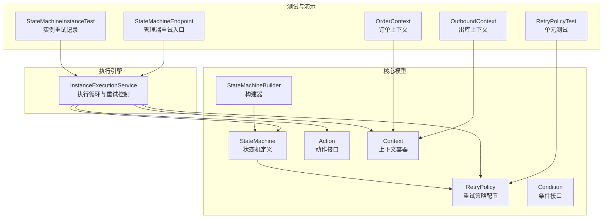
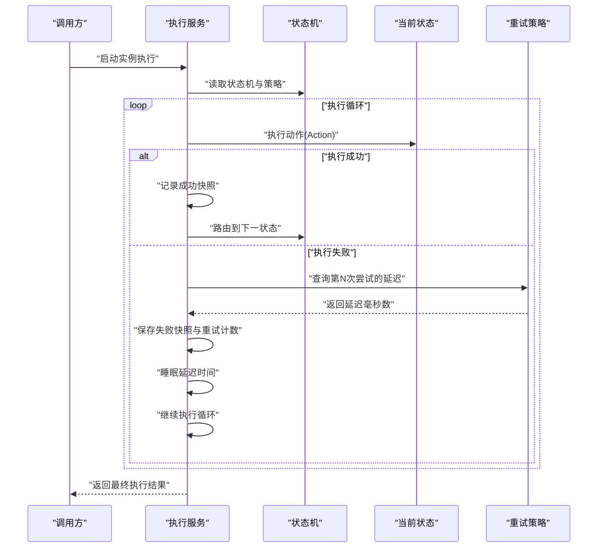
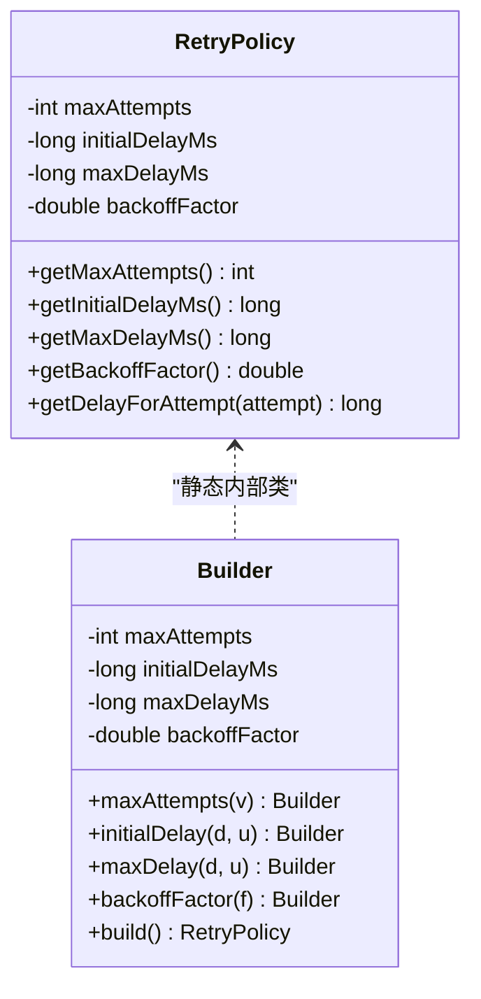
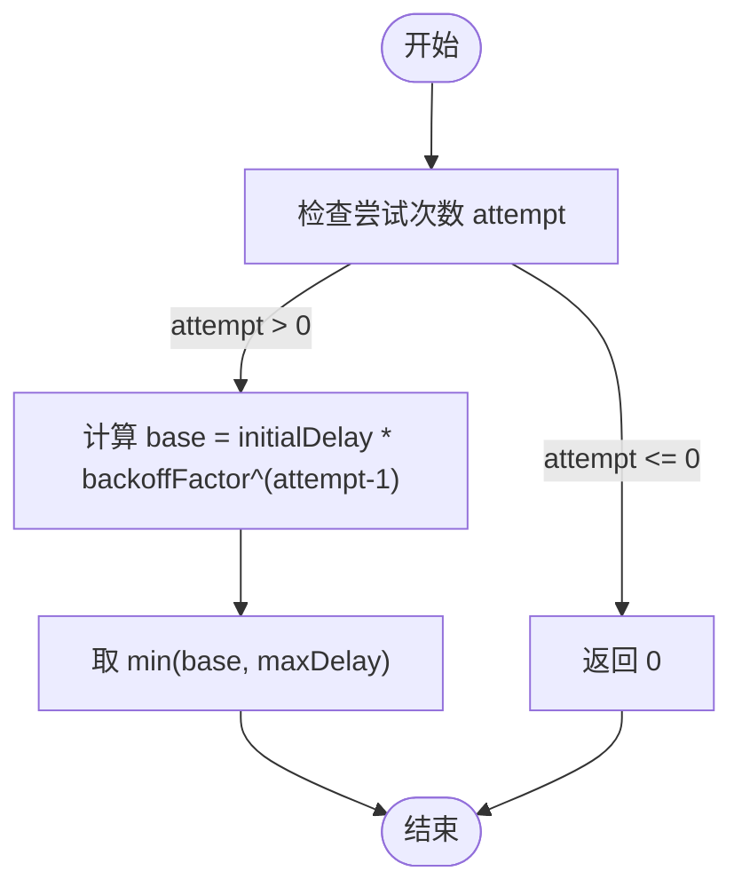
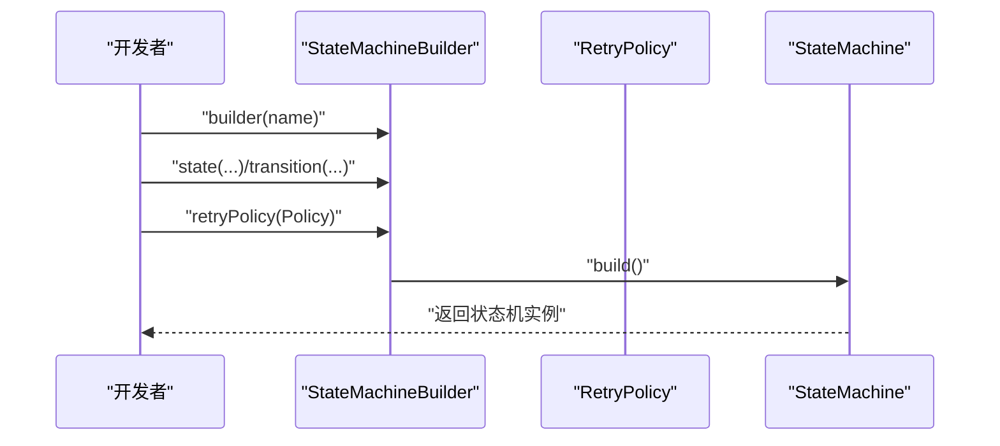
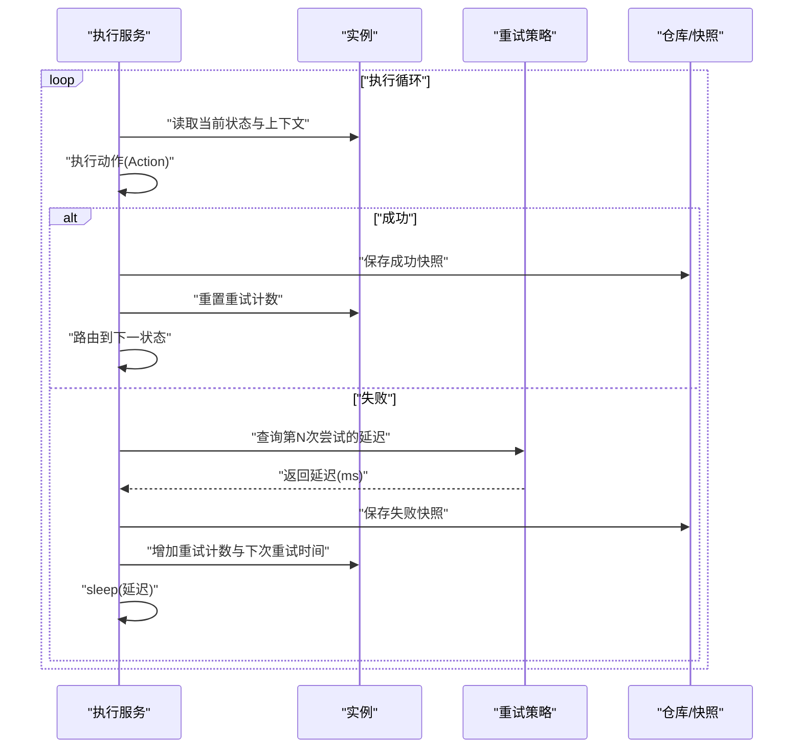
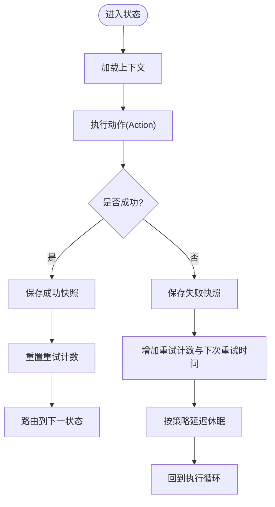
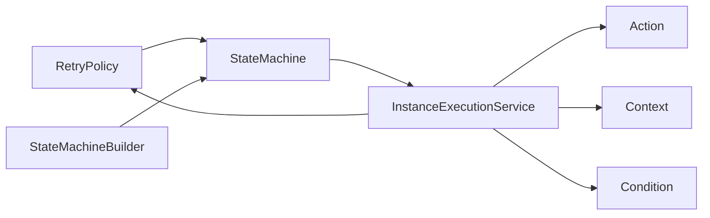

# 重试策略

<cite>
**本文引用的文件**
- [RetryPolicy.java](file://state-machine-boot-starter/src/main/java/cn/chedejun/statemachine/core/RetryPolicy.java)
- [RetryPolicyTest.java](file://state-machine-boot-starter/src/test/java/cn/chedejun/statemachine/core/RetryPolicyTest.java)
- [StateMachine.java](file://state-machine-boot-starter/src/main/java/cn/chedejun/statemachine/domain/engine/StateMachine.java)
- [StateMachineBuilder.java](file://state-machine-boot-starter/src/main/java/cn/chedejun/statemachine/core/StateMachineBuilder.java)
- [InstanceExecutionService.java](file://state-machine-boot-starter/src/main/java/cn/chedejun/statemachine/application/InstanceExecutionService.java)
- [Context.java](file://state-machine-boot-starter/src/main/java/cn/chedejun/statemachine/core/Context.java)
- [Action.java](file://state-machine-boot-starter/src/main/java/cn/chedejun/statemachine/core/Action.java)
- [Condition.java](file://state-machine-boot-starter/src/main/java/cn/chedejun/statemachine/core/Condition.java)
- [ExecuteResult.java](file://state-machine-boot-starter/src/main/java/cn/chedejun/statemachine/core/ExecuteResult.java)
- [StateMachineInstanceTest.java](file://state-machine-boot-starter/src/test/java/cn/chedejun/statemachine/domain/instance/StateMachineInstanceTest.java)
- [StateMachineEndpoint.java](file://state-machine-boot-starter/src/main/java/cn/chedejun/statemachine/management/StateMachineEndpoint.java)
- [OrderContext.java](file://state-machine-demo/src/main/java/cn/chedejun/demo/statemachine/OrderContext.java)
- [OutboundContext.java](file://state-machine-demo/src/main/java/cn/chedejun/demo/statemachine/OutboundContext.java)
</cite>

## 目录
1. [简介](#简介)
2. [项目结构](#项目结构)
3. [核心组件](#核心组件)
4. [架构总览](#架构总览)
5. [详细组件分析](#详细组件分析)
6. [依赖分析](#依赖分析)
7. [性能考虑](#性能考虑)
8. [故障排查指南](#故障排查指南)
9. [结论](#结论)
10. [附录](#附录)

## 简介
本文件系统性阐述状态机框架中的重试策略设计与实现，围绕 RetryPolicy 类展开，覆盖以下主题：
- 设计目标与职责边界：以不可变配置对象承载重试参数，提供延迟计算能力，并与状态机构建器集成。
- 配置选项详解：最大重试次数、初始延迟、最大延迟、退避因子；以及“无重试”策略。
- 退避算法实现：指数退避、固定延迟与自定义策略的组合方式。
- 与状态机执行的集成：在执行循环中根据策略进行延迟与重试，结合上下文与快照持久化。
- 上下文保持与状态恢复：通过上下文对象传递状态数据，结合实例状态与快照实现恢复。
- 性能影响与优化建议：迭代上限、延迟分布与资源占用。
- 实战示例与最佳实践：网络异常、数据库连接、外部服务调用等场景的策略选择。

## 项目结构
与重试策略直接相关的模块与文件如下：
- 核心模型与执行：RetryPolicy、StateMachine、StateMachineBuilder、Action、Condition、Context
- 执行引擎：InstanceExecutionService（核心执行循环与重试控制）
- 测试与演示：RetryPolicyTest、StateMachineInstanceTest、StateMachineEndpoint（管理端重试入口）、OrderContext、OutboundContext（业务上下文）

**图表来源**
- [RetryPolicy.java:1-45](file://state-machine-boot-starter/src/main/java/cn/chedejun/statemachine/core/RetryPolicy.java#L1-L45)
- [StateMachine.java:1-77](file://state-machine-boot-starter/src/main/java/cn/chedejun/statemachine/domain/engine/StateMachine.java#L1-L77)
- [StateMachineBuilder.java:1-52](file://state-machine-boot-starter/src/main/java/cn/chedejun/statemachine/core/StateMachineBuilder.java#L1-L52)
- [InstanceExecutionService.java:154-229](file://state-machine-boot-starter/src/main/java/cn/chedejun/statemachine/application/InstanceExecutionService.java#L154-L229)
- [RetryPolicyTest.java:1-35](file://state-machine-boot-starter/src/test/java/cn/chedejun/statemachine/core/RetryPolicyTest.java#L1-L35)
- [StateMachineInstanceTest.java:80-97](file://state-machine-boot-starter/src/test/java/cn/chedejun/statemachine/domain/instance/StateMachineInstanceTest.java#L80-L97)
- [StateMachineEndpoint.java:71-79](file://state-machine-boot-starter/src/main/java/cn/chedejun/statemachine/management/StateMachineEndpoint.java#L71-L79)
- [OrderContext.java:1-99](file://state-machine-demo/src/main/java/cn/chedejun/demo/statemachine/OrderContext.java#L1-L99)
- [OutboundContext.java:1-43](file://state-machine-demo/src/main/java/cn/chedejun/demo/statemachine/OutboundContext.java#L1-L43)

**章节来源**
- [RetryPolicy.java:1-45](file://state-machine-boot-starter/src/main/java/cn/chedejun/statemachine/core/RetryPolicy.java#L1-L45)
- [StateMachine.java:1-77](file://state-machine-boot-starter/src/main/java/cn/chedejun/statemachine/domain/engine/StateMachine.java#L1-L77)
- [StateMachineBuilder.java:1-52](file://state-machine-boot-starter/src/main/java/cn/chedejun/statemachine/core/StateMachineBuilder.java#L1-L52)
- [InstanceExecutionService.java:154-229](file://state-machine-boot-starter/src/main/java/cn/chedejun/statemachine/application/InstanceExecutionService.java#L154-L229)

## 核心组件
- RetryPolicy：不可变配置对象，提供指数退避延迟计算与“无重试”快捷方式。
- StateMachine：承载状态、转换与重试策略，作为执行引擎的输入。
- StateMachineBuilder：构建状态机，支持注入自定义重试策略，默认指数退避。
- InstanceExecutionService：执行循环与重试控制的核心，负责根据策略进行延迟、记录快照与更新实例状态。
- Context：上下文容器，用于在状态间传递业务数据与中间结果。
- Action/Condition：状态动作与路由条件，配合重试策略决定流转。

**章节来源**
- [RetryPolicy.java:1-45](file://state-machine-boot-starter/src/main/java/cn/chedejun/statemachine/core/RetryPolicy.java#L1-L45)
- [StateMachine.java:1-77](file://state-machine-boot-starter/src/main/java/cn/chedejun/statemachine/domain/engine/StateMachine.java#L1-L77)
- [StateMachineBuilder.java:1-52](file://state-machine-boot-starter/src/main/java/cn/chedejun/statemachine/core/StateMachineBuilder.java#L1-L52)
- [InstanceExecutionService.java:154-229](file://state-machine-boot-starter/src/main/java/cn/chedejun/statemachine/application/InstanceExecutionService.java#L154-L229)
- [Context.java:1-24](file://state-machine-boot-starter/src/main/java/cn/chedejun/statemachine/core/Context.java#L1-L24)
- [Action.java:1-12](file://state-machine-boot-starter/src/main/java/cn/chedejun/statemachine/core/Action.java#L1-L12)
- [Condition.java:1-7](file://state-machine-boot-starter/src/main/java/cn/chedejun/statemachine/core/Condition.java#L1-L7)

## 架构总览
重试策略在状态机执行中的位置如下：

**图表来源**
- [InstanceExecutionService.java:154-229](file://state-machine-boot-starter/src/main/java/cn/chedejun/statemachine/application/InstanceExecutionService.java#L154-L229)
- [RetryPolicy.java:26-30](file://state-machine-boot-starter/src/main/java/cn/chedejun/statemachine/core/RetryPolicy.java#L26-L30)
- [StateMachine.java:47-48](file://state-machine-boot-starter/src/main/java/cn/chedejun/statemachine/domain/engine/StateMachine.java#L47-L48)

## 详细组件分析

### RetryPolicy 类设计与实现
- 不可变配置对象，包含最大重试次数、初始延迟、最大延迟与退避因子。
- 提供 Builder 模式，支持链式配置与单位转换。
- 提供指数退避延迟计算方法，确保不超过最大延迟。
- 提供“无重试”快捷方式，便于禁用重试。

**图表来源**
- [RetryPolicy.java:5-44](file://state-machine-boot-starter/src/main/java/cn/chedejun/statemachine/core/RetryPolicy.java#L5-L44)

**章节来源**
- [RetryPolicy.java:1-45](file://state-machine-boot-starter/src/main/java/cn/chedejun/statemachine/core/RetryPolicy.java#L1-L45)
- [RetryPolicyTest.java:1-35](file://state-machine-boot-starter/src/test/java/cn/chedejun/statemachine/core/RetryPolicyTest.java#L1-L35)

### 指数退避算法与延迟计算
- 延迟公式：min(initialDelay × backoffFactor^(attempt-1), maxDelay)
- 当 attempt ≤ 0 时返回 0；当超过最大尝试次数时，按最大延迟收敛。
- 单元测试验证了正确延迟序列与最大延迟截断行为。

**图表来源**
- [RetryPolicy.java:26-30](file://state-machine-boot-starter/src/main/java/cn/chedejun/statemachine/core/RetryPolicy.java#L26-L30)
- [RetryPolicyTest.java:13-29](file://state-machine-boot-starter/src/test/java/cn/chedejun/statemachine/core/RetryPolicyTest.java#L13-L29)

**章节来源**
- [RetryPolicy.java:26-30](file://state-machine-boot-starter/src/main/java/cn/chedejun/statemachine/core/RetryPolicy.java#L26-L30)
- [RetryPolicyTest.java:13-29](file://state-machine-boot-starter/src/test/java/cn/chedejun/statemachine/core/RetryPolicyTest.java#L13-L29)

### 与状态机构建器的集成
- StateMachineBuilder 默认使用指数退避策略，允许通过 retryPolicy(...) 注入自定义策略。
- 构建完成后，StateMachine 持有 RetryPolicy 并在执行阶段使用。

**图表来源**
- [StateMachineBuilder.java:14-14](file://state-machine-boot-starter/src/main/java/cn/chedejun/statemachine/core/StateMachineBuilder.java#L14-L14)
- [StateMachineBuilder.java:36-36](file://state-machine-boot-starter/src/main/java/cn/chedejun/statemachine/core/StateMachineBuilder.java#L36-L36)
- [StateMachineBuilder.java:46-46](file://state-machine-boot-starter/src/main/java/cn/chedejun/statemachine/core/StateMachineBuilder.java#L46-L46)
- [StateMachine.java:25-25](file://state-machine-boot-starter/src/main/java/cn/chedejun/statemachine/domain/engine/StateMachine.java#L25-L25)

**章节来源**
- [StateMachineBuilder.java:1-52](file://state-machine-boot-starter/src/main/java/cn/chedejun/statemachine/core/StateMachineBuilder.java#L1-L52)
- [StateMachine.java:25-48](file://state-machine-boot-starter/src/main/java/cn/chedejun/statemachine/domain/engine/StateMachine.java#L25-L48)

### 与状态机执行的集成机制
- 执行循环根据状态机的最大尝试次数设置迭代上限，避免无限循环。
- 执行动作失败时，根据策略计算延迟，更新实例重试计数与下次重试时间，持久化失败快照后休眠对应时间再继续。
- 成功则清零重试计数并推进状态，最终生成成功快照。

**图表来源**
- [InstanceExecutionService.java:161-161](file://state-machine-boot-starter/src/main/java/cn/chedejun/statemachine/application/InstanceExecutionService.java#L161-L161)
- [InstanceExecutionService.java:205-229](file://state-machine-boot-starter/src/main/java/cn/chedejun/statemachine/application/InstanceExecutionService.java#L205-L229)
- [RetryPolicy.java:26-30](file://state-machine-boot-starter/src/main/java/cn/chedejun/statemachine/core/RetryPolicy.java#L26-L30)

**章节来源**
- [InstanceExecutionService.java:154-229](file://state-machine-boot-starter/src/main/java/cn/chedejun/statemachine/application/InstanceExecutionService.java#L154-L229)
- [ExecuteResult.java:11-15](file://state-machine-boot-starter/src/main/java/cn/chedejun/statemachine/core/ExecuteResult.java#L11-L15)

### 上下文保持与状态恢复
- 上下文通过 Context 容器传递，Action 执行过程中可写入/读取键值，作为状态间的数据载体。
- 失败时持久化失败快照，成功时持久化成功快照；实例状态与重试计数随执行过程更新。
- 管理端可通过重试接口将失败实例重置为运行态，随后调用重试方法重新执行。

**图表来源**
- [Context.java:6-22](file://state-machine-boot-starter/src/main/java/cn/chedejun/statemachine/core/Context.java#L6-L22)
- [Action.java:9-11](file://state-machine-boot-starter/src/main/java/cn/chedejun/statemachine/core/Action.java#L9-L11)
- [InstanceExecutionService.java:205-229](file://state-machine-boot-starter/src/main/java/cn/chedejun/statemachine/application/InstanceExecutionService.java#L205-L229)
- [StateMachineEndpoint.java:71-79](file://state-machine-boot-starter/src/main/java/cn/chedejun/statemachine/management/StateMachineEndpoint.java#L71-L79)

**章节来源**
- [Context.java:1-24](file://state-machine-boot-starter/src/main/java/cn/chedejun/statemachine/core/Context.java#L1-L24)
- [Action.java:1-12](file://state-machine-boot-starter/src/main/java/cn/chedejun/statemachine/core/Action.java#L1-L12)
- [StateMachineEndpoint.java:71-79](file://state-machine-boot-starter/src/main/java/cn/chedejun/statemachine/management/StateMachineEndpoint.java#L71-L79)

### 不同业务场景的策略配置示例
- 网络异常处理：高初始延迟、适中退避因子、适度最大延迟，避免对下游造成雪崩。
- 数据库连接重试：较小初始延迟、较低退避因子，快速恢复常见瞬时故障。
- 外部服务调用重试：较长初始延迟、较大退避因子，叠加最大延迟上限，防止级联阻塞。
- 无重试场景：对幂等性差或成本极高的操作，采用无重试策略并通过补偿机制兜底。

上述示例为概念性描述，具体数值需结合业务SLA与下游能力评估确定。

### 自定义重试策略的实现原理
- 使用 Builder 模式自定义 maxAttempts、initialDelay、maxDelay、backoffFactor。
- 可替换为固定延迟策略（backoffFactor=1.0）或线性退避策略（线性增长）。
- 若需更复杂策略，可在现有基础上扩展 Builder 或引入外部策略工厂。

**章节来源**
- [RetryPolicy.java:32-43](file://state-machine-boot-starter/src/main/java/cn/chedejun/statemachine/core/RetryPolicy.java#L32-L43)

## 依赖分析
- RetryPolicy 与 StateMachine 的耦合：通过不可变配置注入，低耦合高内聚。
- StateMachineBuilder 与 RetryPolicy：构建期注入，便于测试与定制。
- InstanceExecutionService 与 RetryPolicy：运行期依赖，形成策略驱动的执行控制。
- Context 与 Action/Condition：通过上下文传递数据，解耦业务逻辑与执行流程。

**图表来源**
- [RetryPolicy.java:1-45](file://state-machine-boot-starter/src/main/java/cn/chedejun/statemachine/core/RetryPolicy.java#L1-L45)
- [StateMachine.java:1-77](file://state-machine-boot-starter/src/main/java/cn/chedejun/statemachine/domain/engine/StateMachine.java#L1-L77)
- [StateMachineBuilder.java:1-52](file://state-machine-boot-starter/src/main/java/cn/chedejun/statemachine/core/StateMachineBuilder.java#L1-L52)
- [InstanceExecutionService.java:154-229](file://state-machine-boot-starter/src/main/java/cn/chedejun/statemachine/application/InstanceExecutionService.java#L154-L229)
- [Action.java:1-12](file://state-machine-boot-starter/src/main/java/cn/chedejun/statemachine/core/Action.java#L1-L12)
- [Condition.java:1-7](file://state-machine-boot-starter/src/main/java/cn/chedejun/statemachine/core/Condition.java#L1-L7)
- [Context.java:1-24](file://state-machine-boot-starter/src/main/java/cn/chedejun/statemachine/core/Context.java#L1-L24)

**章节来源**
- [RetryPolicy.java:1-45](file://state-machine-boot-starter/src/main/java/cn/chedejun/statemachine/core/RetryPolicy.java#L1-L45)
- [StateMachine.java:1-77](file://state-machine-boot-starter/src/main/java/cn/chedejun/statemachine/domain/engine/StateMachine.java#L1-L77)
- [StateMachineBuilder.java:1-52](file://state-machine-boot-starter/src/main/java/cn/chedejun/statemachine/core/StateMachineBuilder.java#L1-L52)
- [InstanceExecutionService.java:154-229](file://state-machine-boot-starter/src/main/java/cn/chedejun/statemachine/application/InstanceExecutionService.java#L154-L229)

## 性能考虑
- 迭代上限：执行循环基于状态数与最大尝试次数设定上限，防止无限循环与资源耗尽。
- 延迟分布：指数退避会放大延迟，应结合最大延迟与并发度评估CPU与线程占用。
- 快照与持久化：每次失败/成功均持久化快照，I/O开销与存储压力需纳入容量规划。
- 中断与优雅退出：重试休眠期间支持中断，避免线程泄漏与资源占用。

**章节来源**
- [InstanceExecutionService.java:161-161](file://state-machine-boot-starter/src/main/java/cn/chedejun/statemachine/application/InstanceExecutionService.java#L161-L161)
- [InstanceExecutionService.java:224-227](file://state-machine-boot-starter/src/main/java/cn/chedejun/statemachine/application/InstanceExecutionService.java#L224-L227)

## 故障排查指南
- 重试未生效：确认状态机构建时是否注入了期望的重试策略；检查实例状态是否为 FAILED。
- 重试计数异常：验证失败快照是否正确记录；检查实例重试计数更新逻辑。
- 管理端重试：通过管理端接口将实例重置为 RUNNING 后，调用重试方法重新执行。
- 上下文丢失：核对 Action 是否通过 Context 写入必要数据；检查上下文序列化/反序列化路径。

**章节来源**
- [StateMachineInstanceTest.java:80-90](file://state-machine-boot-starter/src/test/java/cn/chedejun/statemachine/domain/instance/StateMachineInstanceTest.java#L80-L90)
- [StateMachineEndpoint.java:71-79](file://state-machine-boot-starter/src/main/java/cn/chedejun/statemachine/management/StateMachineEndpoint.java#L71-L79)

## 结论
RetryPolicy 以简洁的不可变配置与指数退避算法为核心，提供了可测试、可定制、可集成的重试能力。通过与状态机构建器、执行引擎、上下文与快照系统的协同，实现了在复杂业务流程中的稳健容错与可观测性。建议在生产环境中结合业务特性与下游能力，审慎选择初始延迟、退避因子与最大延迟，并配套监控与告警体系，持续优化重试策略以平衡成功率与资源消耗。

## 附录
- 业务上下文示例：订单上下文与出库上下文展示了如何在状态机执行中携带业务数据。
- 关键实现路径参考：
  - [RetryPolicy.getDelayForAttempt:26-30](file://state-machine-boot-starter/src/main/java/cn/chedejun/statemachine/core/RetryPolicy.java#L26-L30)
  - [StateMachineBuilder.retryPolicy:36-36](file://state-machine-boot-starter/src/main/java/cn/chedejun/statemachine/core/StateMachineBuilder.java#L36-L36)
  - [InstanceExecutionService.executeLoop:158-229](file://state-machine-boot-starter/src/main/java/cn/chedejun/statemachine/application/InstanceExecutionService.java#L158-L229)
  - [OrderContext:10-99](file://state-machine-demo/src/main/java/cn/chedejun/demo/statemachine/OrderContext.java#L10-L99)
  - [OutboundContext:8-43](file://state-machine-demo/src/main/java/cn/chedejun/demo/statemachine/OutboundContext.java#L8-L43)