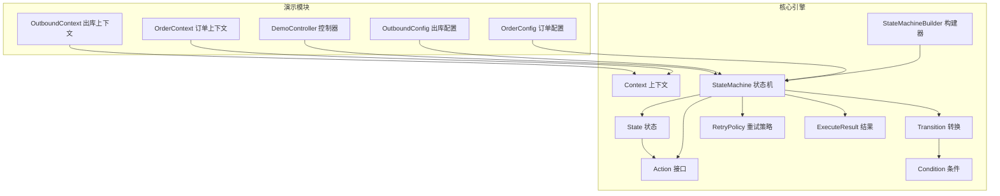
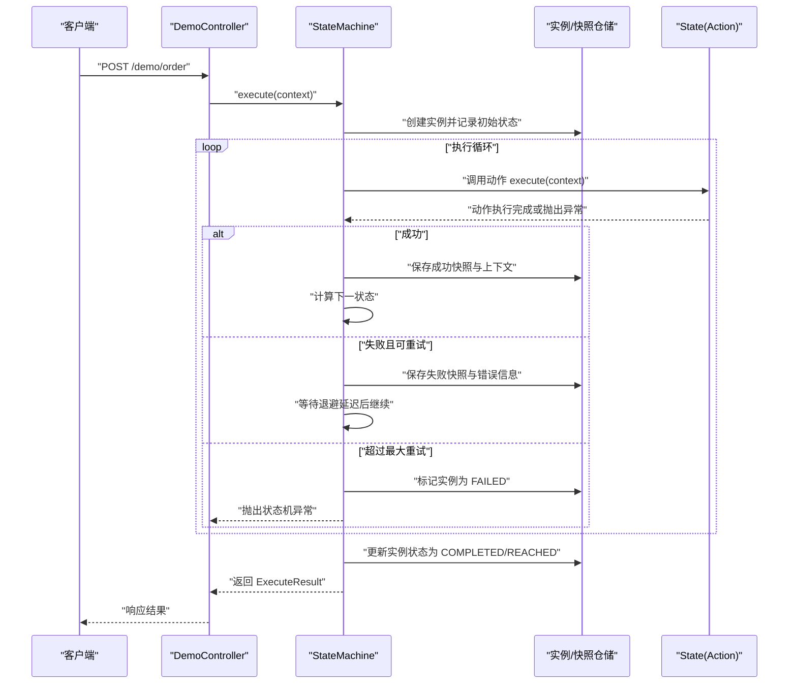
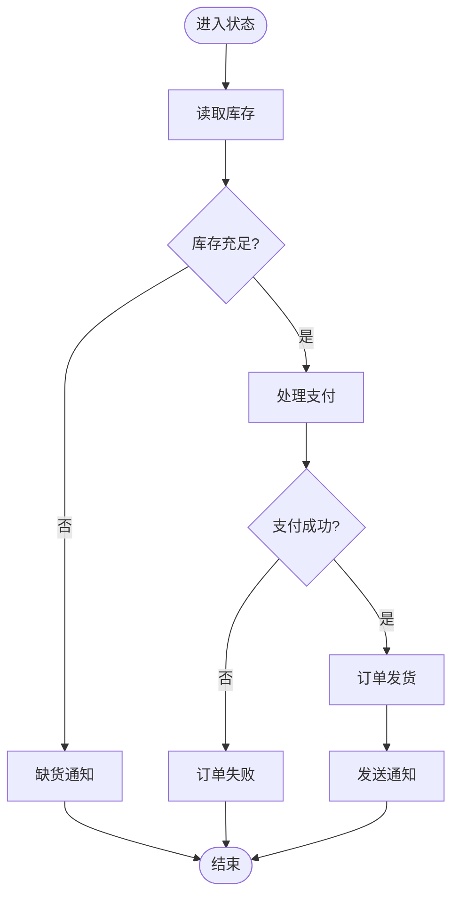
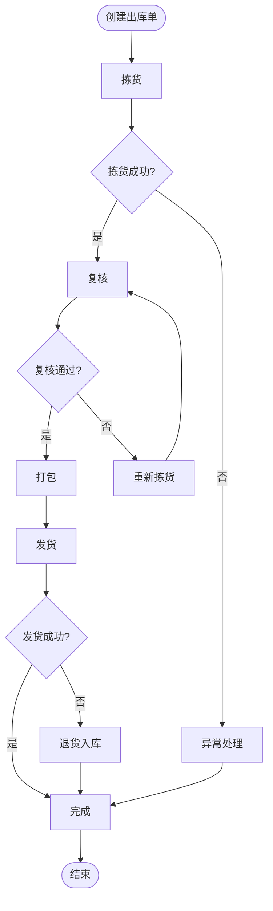
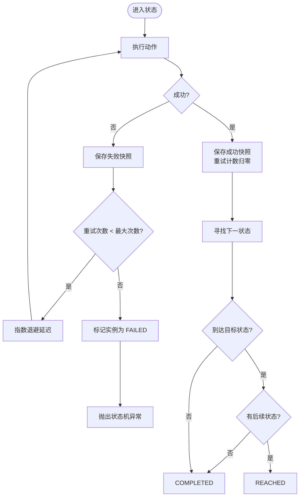
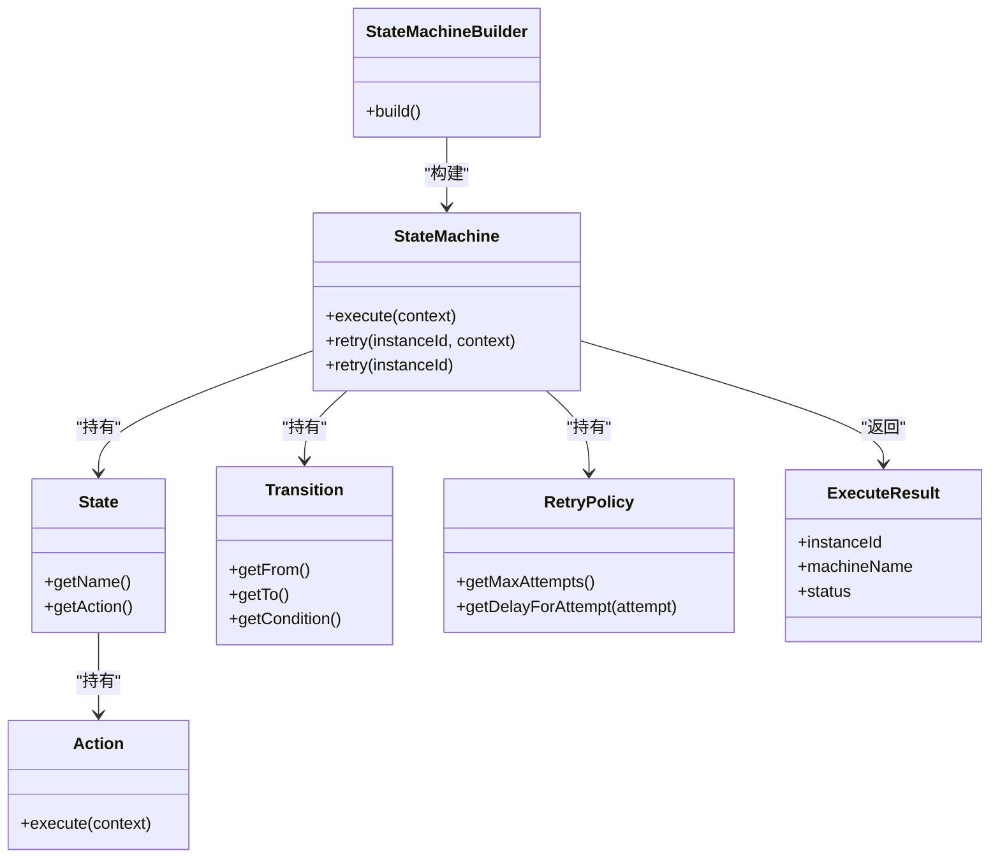

# Action动作实现

<cite>
**本文引用的文件**
- [Action.java](file://src/main/java/cn/chedejun/statemachine/core/Action.java)
- [ExecuteResult.java](file://src/main/java/cn/chedejun/statemachine/core/ExecuteResult.java)
- [Context.java](file://src/main/java/cn/chedejun/statemachine/core/Context.java)
- [StateMachine.java](file://src/main/java/cn/chedejun/statemachine/core/StateMachine.java)
- [StateMachineBuilder.java](file://src/main/java/cn/chedejun/statemachine/core/StateMachineBuilder.java)
- [State.java](file://src/main/java/cn/chedejun/statemachine/core/State.java)
- [Transition.java](file://src/main/java/cn/chedejun/statemachine/core/Transition.java)
- [RetryPolicy.java](file://src/main/java/cn/chedejun/statemachine/core/RetryPolicy.java)
- [Condition.java](file://src/main/java/cn/chedejun/statemachine/core/Condition.java)
- [OrderContext.java](file://demo/src/main/java/cn/chedejun/demo/statemachine/OrderContext.java)
- [OutboundContext.java](file://demo/src/main/java/cn/chedejun/demo/statemachine/OutboundContext.java)
- [OrderConfig.java](file://demo/src/main/java/cn/chedejun/demo/config/OrderConfig.java)
- [OutboundConfig.java](file://demo/src/main/java/cn/chedejun/demo/config/OutboundConfig.java)
- [DemoController.java](file://demo/src/main/java/cn/chedejun/demo/controller/DemoController.java)
- [README.md](file://README.md)
</cite>

## 目录
1. [简介](#简介)
2. [项目结构](#项目结构)
3. [核心组件](#核心组件)
4. [架构总览](#架构总览)
5. [详细组件分析](#详细组件分析)
6. [依赖分析](#依赖分析)
7. [性能考虑](#性能考虑)
8. [故障排查指南](#故障排查指南)
9. [结论](#结论)
10. [附录](#附录)

## 简介
本指南围绕 Action 接口展开，系统讲解其方法签名、执行逻辑与实现要点，并结合仓库中的订单处理与出库流程示例，演示如何在状态机中编写可重试、可观测、可扩展的业务动作。文档还涵盖上下文数据的读取与修改、ExecuteResult 返回值处理、状态推进控制、异常与重试策略、事务性与持久化、性能优化建议以及与外部系统的集成方式。

## 项目结构
该项目采用分层与功能模块化组织：
- 核心引擎位于 cn.chedejun.statemachine.core，包含状态机、动作、条件、重试策略、状态与转换等基础构件
- 示例与演示位于 demo 模块，包含上下文模型、配置类、控制器与演示入口
- README 提供快速开始与基本用法

图表来源
- [StateMachine.java:1-196](file://src/main/java/cn/chedejun/statemachine/core/StateMachine.java#L1-L196)
- [StateMachineBuilder.java:1-53](file://src/main/java/cn/chedejun/statemachine/core/StateMachineBuilder.java#L1-L53)
- [Action.java:1-12](file://src/main/java/cn/chedejun/statemachine/core/Action.java#L1-L12)
- [Context.java:1-24](file://src/main/java/cn/chedejun/statemachine/core/Context.java#L1-L24)
- [State.java:1-16](file://src/main/java/cn/chedejun/statemachine/core/State.java#L1-L16)
- [Transition.java:1-20](file://src/main/java/cn/chedejun/statemachine/core/Transition.java#L1-L20)
- [RetryPolicy.java:1-45](file://src/main/java/cn/chedejun/statemachine/core/RetryPolicy.java#L1-L45)
- [ExecuteResult.java:1-23](file://src/main/java/cn/chedejun/statemachine/core/ExecuteResult.java#L1-L23)
- [Condition.java:1-7](file://src/main/java/cn/chedejun/statemachine/core/Condition.java#L1-L7)
- [OrderContext.java:1-34](file://demo/src/main/java/cn/chedejun/demo/statemachine/OrderContext.java#L1-L34)
- [OutboundContext.java:1-43](file://demo/src/main/java/cn/chedejun/demo/statemachine/OutboundContext.java#L1-L43)
- [OrderConfig.java:1-85](file://demo/src/main/java/cn/chedejun/demo/config/OrderConfig.java#L1-L85)
- [OutboundConfig.java:1-121](file://demo/src/main/java/cn/chedejun/demo/config/OutboundConfig.java#L1-L121)
- [DemoController.java:1-288](file://demo/src/main/java/cn/chedejun/demo/controller/DemoController.java#L1-L288)

章节来源
- [README.md:1-65](file://README.md#L1-L65)

## 核心组件
- Action 接口：定义单个状态步骤的业务执行点，接收上下文并可能抛出异常；执行结果通过上下文写入，自动记录到快照
- Context 上下文：键值存储容器，提供类型安全的读取与写入能力，支持从 Map 初始化
- State 状态：封装状态名与 Action 动作
- Transition 转换：封装 from-to 与条件判断
- RetryPolicy 重试策略：指数退避等策略，控制最大重试次数与延迟
- StateMachine 状态机：负责实例创建、执行循环、状态推进、快照与重试
- ExecuteResult 结果：封装实例 ID、机器名、版本、当前状态、状态码、错误信息与创建时间
- StateMachineBuilder 构建器：链式配置状态、转换、重试策略与上下文类型

章节来源
- [Action.java:1-12](file://src/main/java/cn/chedejun/statemachine/core/Action.java#L1-L12)
- [Context.java:1-24](file://src/main/java/cn/chedejun/statemachine/core/Context.java#L1-L24)
- [State.java:1-16](file://src/main/java/cn/chedejun/statemachine/core/State.java#L1-L16)
- [Transition.java:1-20](file://src/main/java/cn/chedejun/statemachine/core/Transition.java#L1-L20)
- [RetryPolicy.java:1-45](file://src/main/java/cn/chedejun/statemachine/core/RetryPolicy.java#L1-L45)
- [StateMachine.java:1-196](file://src/main/java/cn/chedejun/statemachine/core/StateMachine.java#L1-L196)
- [ExecuteResult.java:1-23](file://src/main/java/cn/chedejun/statemachine/core/ExecuteResult.java#L1-L23)
- [StateMachineBuilder.java:1-53](file://src/main/java/cn/chedejun/statemachine/core/StateMachineBuilder.java#L1-L53)

## 架构总览
状态机执行流程由状态机驱动，按顺序调用每个状态的动作，根据条件推进到下一个状态，同时维护实例状态与快照。异常发生时依据重试策略进行延迟重试，超过最大次数则标记失败。

图表来源
- [DemoController.java:38-118](file://demo/src/main/java/cn/chedejun/demo/controller/DemoController.java#L38-L118)
- [StateMachine.java:40-136](file://src/main/java/cn/chedejun/statemachine/core/StateMachine.java#L40-L136)

## 详细组件分析

### Action 接口与实现模式
- 方法签名与职责
  - execute(C context): 在给定上下文中执行业务逻辑，可读取/写入上下文数据，必要时抛出异常以触发重试
  - 通过 context.put(key, value) 写入的数据会参与快照序列化，便于持久化与审计
- 实现要点
  - 动作应幂等或具备补偿能力，避免重复执行导致副作用
  - 对外系统交互建议采用异步或带超时的可靠调用，配合重试策略
  - 动作内部应尽量短小内聚，复杂逻辑拆分为多个状态动作，提升可观测性

章节来源
- [Action.java:1-12](file://src/main/java/cn/chedejun/statemachine/core/Action.java#L1-L12)
- [Context.java:1-24](file://src/main/java/cn/chedejun/statemachine/core/Context.java#L1-L24)

### 上下文数据读取与修改
- 读取：通过 context.get(key) 获取强类型值
- 写入：通过 context.put(key, value) 写入任意对象，随后被序列化到快照
- 示例上下文
  - 订单上下文：包含订单号、库存、金额、支付结果、收货地址等字段
  - 出库上下文：包含出库单号、仓库编码、总数量、拣货/复核/打包/发货状态、承运商与运单号等字段

章节来源
- [OrderContext.java:1-34](file://demo/src/main/java/cn/chedejun/demo/statemachine/OrderContext.java#L1-L34)
- [OutboundContext.java:1-43](file://demo/src/main/java/cn/chedejun/demo/statemachine/OutboundContext.java#L1-L43)
- [Context.java:1-24](file://src/main/java/cn/chedejun/statemachine/core/Context.java#L1-L24)

### 订单处理 Action 实现示例
- 关键状态与动作
  - 检查库存：读取库存，异常表示外部系统不可用
  - 处理支付：模拟支付成功率，成功则设置支付结果
  - 订单发货：校验收货地址，异常则终止
  - 发送通知/缺货通知/失败：分别在不同路径下输出日志
- 执行逻辑
  - 使用条件表达式定义状态间转移
  - 配置指数退避重试策略，限制最大重试次数

图表来源
- [OrderConfig.java:48-79](file://demo/src/main/java/cn/chedejun/demo/config/OrderConfig.java#L48-L79)
- [OrderConfig.java:30-38](file://demo/src/main/java/cn/chedejun/demo/config/OrderConfig.java#L30-L38)

章节来源
- [OrderConfig.java:1-85](file://demo/src/main/java/cn/chedejun/demo/config/OrderConfig.java#L1-L85)

### 出库 Action 实现示例
- 关键状态与动作
  - 创建出库单：初始化出库单基本信息
  - 拣货：模拟拣货异常概率，成功则标记拣货完成
  - 复核：模拟复核不通过概率，不通过则回退至重新拣货
  - 打包：准备发货
  - 发货：模拟物流异常概率，成功则生成运单号
  - 完成/异常处理/重新拣货/退货入库：终止或回退分支
- 执行逻辑
  - 多条条件边覆盖正常流程与异常分支
  - 配置指数退避重试策略，保障偶发失败的恢复

图表来源
- [OutboundConfig.java:60-115](file://demo/src/main/java/cn/chedejun/demo/config/OutboundConfig.java#L60-L115)
- [OutboundConfig.java:35-50](file://demo/src/main/java/cn/chedejun/demo/config/OutboundConfig.java#L35-L50)

章节来源
- [OutboundConfig.java:1-121](file://demo/src/main/java/cn/chedejun/demo/config/OutboundConfig.java#L1-L121)

### ExecuteResult 返回值处理与状态推进控制
- 返回值字段
  - instanceId：实例唯一标识
  - machineName：状态机名称
  - definitionVersion：定义版本
  - currentState：当前状态
  - status：执行状态（COMPLETED/REACHED/FAILED）
  - errorMessage：错误信息
  - createdAt：创建时间
- 状态推进规则
  - 动作成功：保存成功快照，清零重试计数
  - 动作失败：保存失败快照，根据重试策略决定是否延迟重试
  - 达到目标状态：若无后续状态则 COMPLETED，否则 REACHED
  - 无后续状态：COMPLETED
- 控制台与 API 使用
  - 控制器对成功与失败分别构造响应，失败时记录实例 ID、状态与堆栈信息
  - 支持“执行到指定状态”模式，区分 REACHED 与 COMPLETED

章节来源
- [ExecuteResult.java:1-23](file://src/main/java/cn/chedejun/statemachine/core/ExecuteResult.java#L1-L23)
- [StateMachine.java:83-136](file://src/main/java/cn/chedejun/statemachine/core/StateMachine.java#L83-L136)
- [DemoController.java:38-118](file://demo/src/main/java/cn/chedejun/demo/controller/DemoController.java#L38-L118)

### 异常处理策略与重试机制
- 异常传播
  - 动作抛出异常即视为失败，记录失败快照与错误消息
- 重试策略
  - 指数退避：初始延迟、最大延迟与退避因子可配置
  - 最大重试次数：超过阈值后标记实例为 FAILED 并抛出状态机异常
- 重试触发时机
  - 失败后根据尝试次数计算延迟，睡眠后继续执行当前状态
- 失败重试 API
  - 支持按实例 ID 重试，自动从首张快照反序列化上下文

图表来源
- [StateMachine.java:83-136](file://src/main/java/cn/chedejun/statemachine/core/StateMachine.java#L83-L136)
- [RetryPolicy.java:26-30](file://src/main/java/cn/chedejun/statemachine/core/RetryPolicy.java#L26-L30)

章节来源
- [StateMachine.java:50-79](file://src/main/java/cn/chedejun/statemachine/core/StateMachine.java#L50-L79)
- [RetryPolicy.java:1-45](file://src/main/java/cn/chedejun/statemachine/core/RetryPolicy.java#L1-L45)

### 事务管理与持久化
- 事务性建议
  - 将动作内的数据库操作与状态推进置于同一事务中，确保一致性
  - 对外系统调用采用“先本地事务、后外部调用”的顺序，失败时回滚
- 持久化与快照
  - 每次动作执行前后都会序列化上下文并写入快照表
  - 实例表记录当前状态、重试次数与错误信息
- 数据恢复
  - 失败重试时从首张快照读取原始输入上下文，保证可恢复性

章节来源
- [StateMachine.java:94-106](file://src/main/java/cn/chedejun/statemachine/core/StateMachine.java#L94-L106)
- [StateMachine.java:71-78](file://src/main/java/cn/chedejun/statemachine/core/StateMachine.java#L71-L78)

### 与外部系统集成
- 集成原则
  - 动作内调用外部服务需设置超时与重试，避免阻塞状态机线程
  - 外部调用结果写入上下文，作为后续状态的决策依据
- 示例场景
  - 支付网关：动作中发起支付请求，成功则标记支付结果
  - 物流接口：动作中生成面单，成功则写入运单号
- 可观测性
  - 通过上下文记录关键参数与返回值，便于问题定位与审计

章节来源
- [OrderConfig.java:53-67](file://demo/src/main/java/cn/chedejun/demo/config/OrderConfig.java#L53-L67)
- [OutboundConfig.java:89-97](file://demo/src/main/java/cn/chedejun/demo/config/OutboundConfig.java#L89-L97)

## 依赖分析
- 组件耦合
  - StateMachine 依赖 State、Transition、RetryPolicy、ExecuteResult 与仓储
  - State 持有 Action，Transition 持有条件
  - Builder 负责装配并注册状态机
- 外部依赖
  - JdbcTemplate 与 ObjectMapper 由构建器注入，用于持久化与序列化
- 循环依赖
  - 无显式循环依赖，各组件职责清晰

图表来源
- [StateMachine.java:1-196](file://src/main/java/cn/chedejun/statemachine/core/StateMachine.java#L1-L196)
- [State.java:1-16](file://src/main/java/cn/chedejun/statemachine/core/State.java#L1-L16)
- [Transition.java:1-20](file://src/main/java/cn/chedejun/statemachine/core/Transition.java#L1-L20)
- [Action.java:1-12](file://src/main/java/cn/chedejun/statemachine/core/Action.java#L1-L12)
- [RetryPolicy.java:1-45](file://src/main/java/cn/chedejun/statemachine/core/RetryPolicy.java#L1-L45)
- [ExecuteResult.java:1-23](file://src/main/java/cn/chedejun/statemachine/core/ExecuteResult.java#L1-L23)
- [StateMachineBuilder.java:1-53](file://src/main/java/cn/chedejun/statemachine/core/StateMachineBuilder.java#L1-L53)

章节来源
- [StateMachine.java:1-196](file://src/main/java/cn/chedejun/statemachine/core/StateMachine.java#L1-L196)
- [StateMachineBuilder.java:1-53](file://src/main/java/cn/chedejun/statemachine/core/StateMachineBuilder.java#L1-L53)

## 性能考虑
- 动作粒度
  - 将长耗时操作拆分为多个状态动作，减少单次执行时间
- 重试策略
  - 合理设置最大重试次数与退避因子，避免抖动放大
- 序列化成本
  - 上下文序列化/反序列化开销较大时，避免频繁写入大对象
- 并发与阻塞
  - 避免在动作中进行阻塞式 IO，必要时使用异步回调
- 数据库与锁
  - 对共享资源加锁时尽量缩短持锁时间，减少死锁风险

## 故障排查指南
- 常见问题
  - 状态机未初始化：检查是否注入了 JdbcTemplate 与 ObjectMapper
  - 状态未找到：确认状态名拼写与注册一致
  - 执行超限：检查状态机配置与边界条件，避免无限循环
  - 重试无效：确认重试策略与最大尝试次数设置
- 定位手段
  - 通过控制台查看实例与快照，核对状态推进与错误信息
  - 使用“执行到指定状态”模式验证中间状态行为
- 处理建议
  - 对于偶发异常，适当提高最大重试次数
  - 对于确定性失败，修正动作逻辑或外部依赖

章节来源
- [StateMachine.java:178-180](file://src/main/java/cn/chedejun/statemachine/core/StateMachine.java#L178-L180)
- [DemoController.java:123-157](file://demo/src/main/java/cn/chedejun/demo/controller/DemoController.java#L123-L157)

## 结论
Action 是状态机中承载业务逻辑的关键单元。通过规范的上下文读写、明确的状态推进与完善的重试机制，可以构建高可靠、可观测、易扩展的工作流。结合示例中的订单与出库流程，读者可据此快速实现自定义业务动作，并在生产环境中落地事务性与性能优化策略。

## 附录
- 快速开始参考
  - 定义状态机、配置动作与转换、设置重试策略、执行与重试
- API 一览
  - 执行：execute(context)/execute(context, targetState)
  - 重试：retry(instanceId)/retry(instanceId, context)
  - 查询：实例与快照查询接口

章节来源
- [README.md:17-49](file://README.md#L17-L49)
- [DemoController.java:38-286](file://demo/src/main/java/cn/chedejun/demo/controller/DemoController.java#L38-L286)