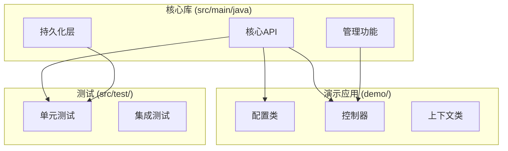
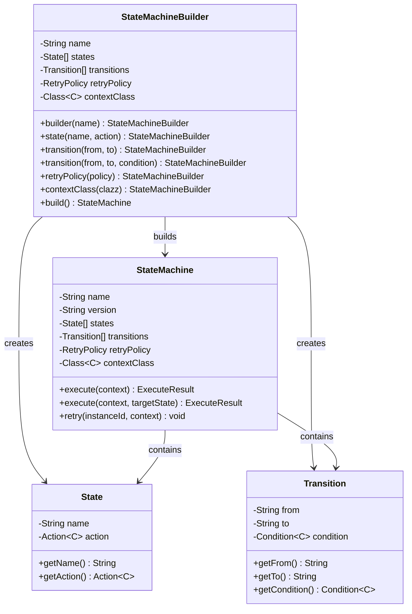
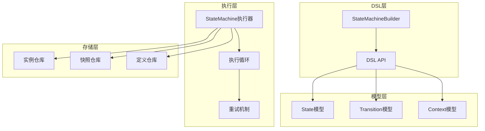
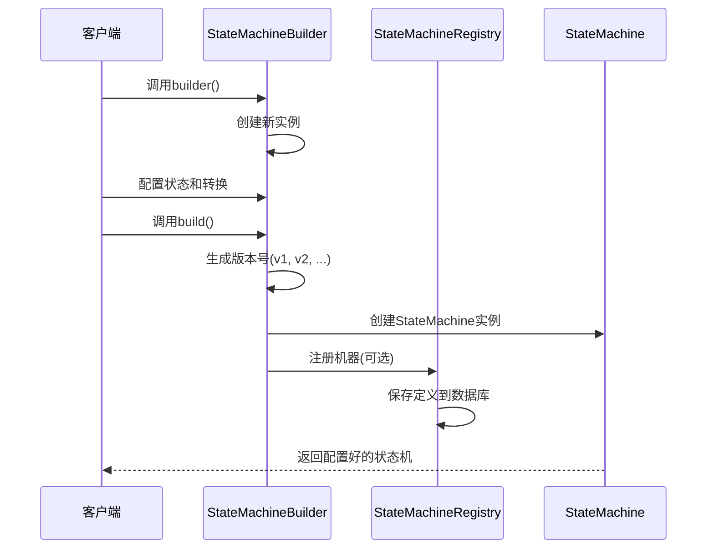
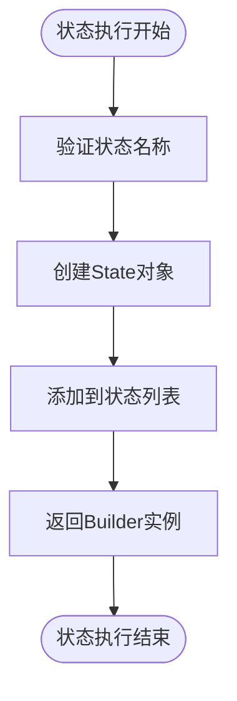
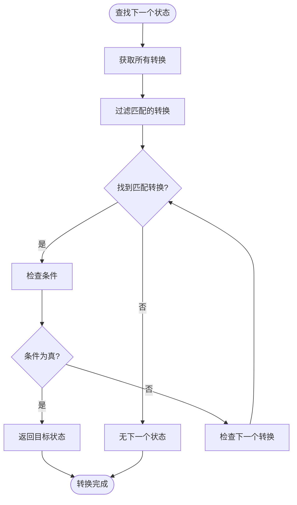
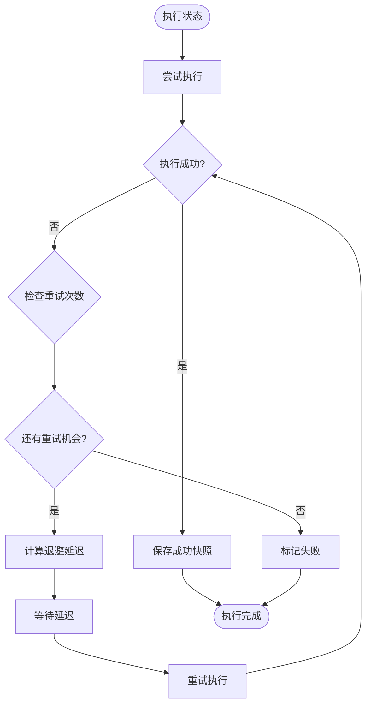
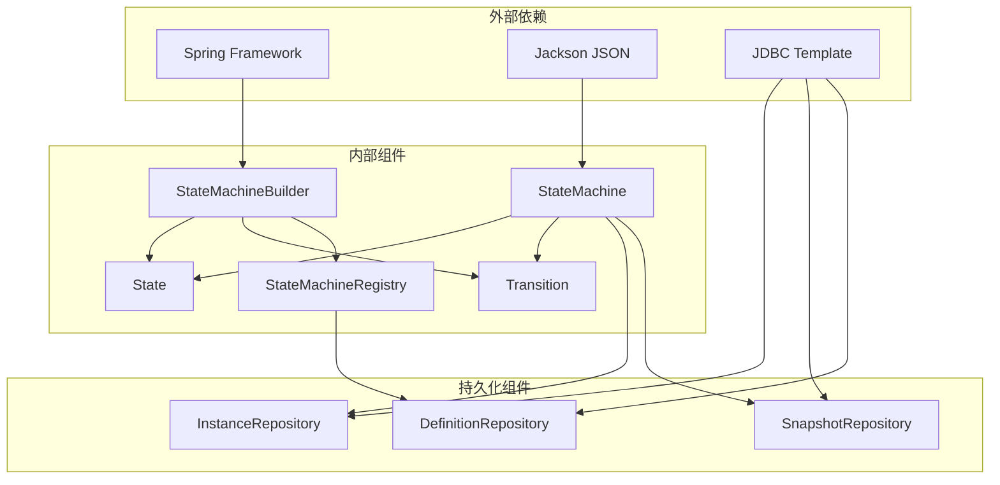
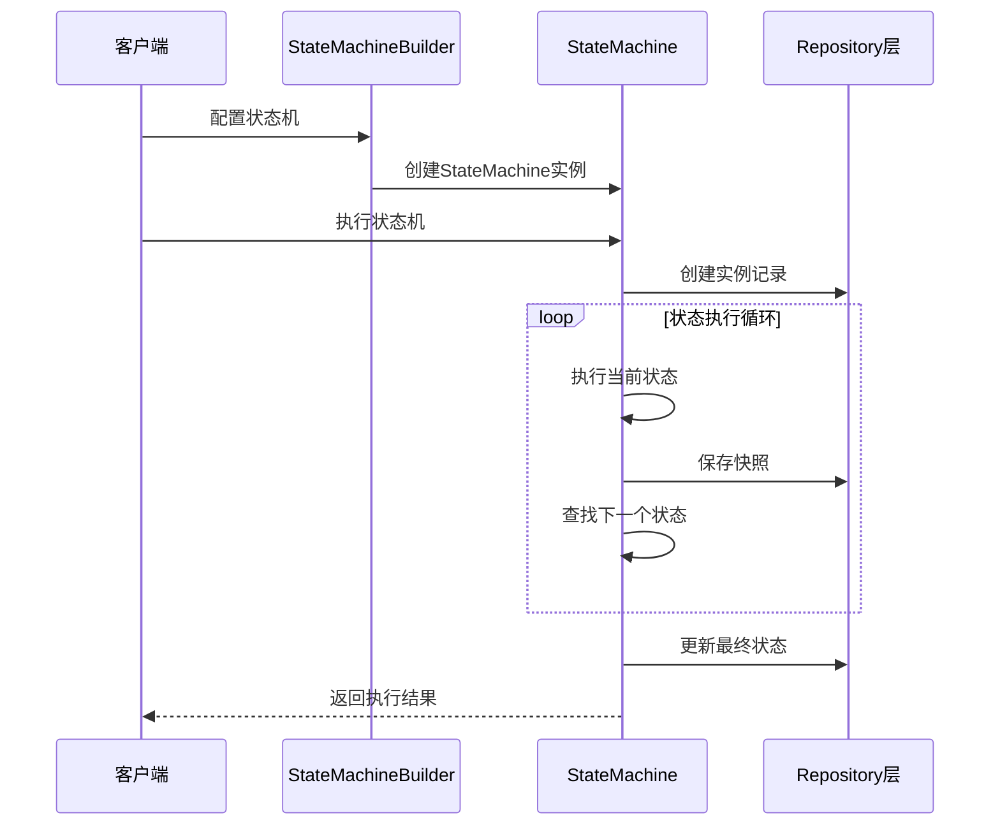

# DSL API使用指南

<cite>
**本文档引用的文件**
- [StateMachineBuilder.java](file://src/main/java/cn/chedejun/statemachine/core/StateMachineBuilder.java)
- [StateMachine.java](file://src/main/java/cn/chedejun/statemachine/core/StateMachine.java)
- [State.java](file://src/main/java/cn/chedejun/statemachine/core/State.java)
- [Transition.java](file://src/main/java/cn/chedejun/statemachine/core/Transition.java)
- [Action.java](file://src/main/java/cn/chedejun/statemachine/core/Action.java)
- [Condition.java](file://src/main/java/cn/chedejun/statemachine/core/Condition.java)
- [RetryPolicy.java](file://src/main/java/cn/chedejun/statemachine/core/RetryPolicy.java)
- [Context.java](file://src/main/java/cn/chedejun/statemachine/core/Context.java)
- [ExecuteResult.java](file://src/main/java/cn/chedejun/statemachine/core/ExecuteResult.java)
- [StateMachineRegistry.java](file://src/main/java/cn/chedejun/statemachine/core/StateMachineRegistry.java)
- [OrderConfig.java](file://demo/src/main/java/cn/chedejun/demo/config/OrderConfig.java)
- [OutboundConfig.java](file://demo/src/main/java/cn/chedejun/demo/config/OutboundConfig.java)
- [OrderContext.java](file://demo/src/main/java/cn/chedejun/demo/statemachine/OrderContext.java)
- [OutboundContext.java](file://demo/src/main/java/cn/chedejun/demo/statemachine/OutboundContext.java)
- [DemoController.java](file://demo/src/main/java/cn/chedejun/demo/controller/DemoController.java)
- [StateMachineBuilderTest.java](file://src/test/java/cn/chedejun/statemachine/core/StateMachineBuilderTest.java)
- [README.md](file://README.md)
</cite>

## 目录
1. [简介](#简介)
2. [项目结构](#项目结构)
3. [核心组件](#核心组件)
4. [架构概览](#架构概览)
5. [详细组件分析](#详细组件分析)
6. [依赖关系分析](#依赖关系分析)
7. [性能考虑](#性能考虑)
8. [故障排除指南](#故障排除指南)
9. [结论](#结论)
10. [附录](#附录)

## 简介

StateMachineBuilder DSL API是一个基于Spring Boot的状态机工作流工具，提供了直观的声明式API来构建复杂的状态机流程。该API支持条件分支、步骤快照、失败重试（指数退避）和管理控制台功能。

本指南将深入解释builder()工厂方法的使用、state()方法定义状态节点、transition()方法配置状态转换和条件判断，详细说明链式调用的语法糖和参数配置选项，并提供从简单到复杂的完整示例。

## 项目结构

该项目采用模块化设计，主要分为核心库和演示应用两部分：



**图表来源**
- [StateMachineBuilder.java:1-53](file://src/main/java/cn/chedejun/statemachine/core/StateMachineBuilder.java#L1-L53)
- [OrderConfig.java:1-85](file://demo/src/main/java/cn/chedejun/demo/config/OrderConfig.java#L1-L85)

**章节来源**
- [StateMachineBuilder.java:1-53](file://src/main/java/cn/chedejun/statemachine/core/StateMachineBuilder.java#L1-L53)
- [OrderConfig.java:1-85](file://demo/src/main/java/cn/chedejun/demo/config/OrderConfig.java#L1-L85)

## 核心组件

StateMachineBuilder DSL API由以下核心组件构成：

### 主要接口和类



**图表来源**
- [StateMachineBuilder.java:8-53](file://src/main/java/cn/chedejun/statemachine/core/StateMachineBuilder.java#L8-L53)
- [State.java:3-16](file://src/main/java/cn/chedejun/statemachine/core/State.java#L3-L16)
- [Transition.java:3-20](file://src/main/java/cn/chedejun/statemachine/core/Transition.java#L3-L20)
- [StateMachine.java:11-35](file://src/main/java/cn/chedejun/statemachine/core/StateMachine.java#L11-L35)

### 关键接口定义

**Action接口** - 定义状态执行逻辑
- 函数式接口，接收上下文参数并执行业务逻辑
- 结果通过context.put()写入，自动记录到快照

**Condition接口** - 定义状态转换条件
- 函数式接口，根据上下文判断是否允许转换
- 返回true表示允许转换，false表示阻止转换

**RetryPolicy类** - 定义重试策略
- 支持指数退避算法
- 可配置最大重试次数、初始延迟、最大延迟和退避因子

**章节来源**
- [Action.java:1-12](file://src/main/java/cn/chedejun/statemachine/core/Action.java#L1-L12)
- [Condition.java:1-7](file://src/main/java/cn/chedejun/statemachine/core/Condition.java#L1-L7)
- [RetryPolicy.java:1-45](file://src/main/java/cn/chedejun/statemachine/core/RetryPolicy.java#L1-L45)

## 架构概览

StateMachineBuilder DSL API采用分层架构设计，确保了良好的可扩展性和可维护性：



**图表来源**
- [StateMachineBuilder.java:40-51](file://src/main/java/cn/chedejun/statemachine/core/StateMachineBuilder.java#L40-L51)
- [StateMachine.java:40-136](file://src/main/java/cn/chedejun/statemachine/core/StateMachine.java#L40-L136)

### 版本管理机制

系统实现了自动版本管理功能，每个构建的状态机会获得唯一的版本号：



**图表来源**
- [StateMachineBuilder.java:40-51](file://src/main/java/cn/chedejun/statemachine/core/StateMachineBuilder.java#L40-L51)
- [StateMachineRegistry.java:21-49](file://src/main/java/cn/chedejun/statemachine/core/StateMachineRegistry.java#L21-L49)

**章节来源**
- [StateMachineBuilder.java:18-23](file://src/main/java/cn/chedejun/statemachine/core/StateMachineBuilder.java#L18-L23)
- [StateMachineRegistry.java:21-49](file://src/main/java/cn/chedejun/statemachine/core/StateMachineRegistry.java#L21-L49)

## 详细组件分析

### StateMachineBuilder DSL API详解

#### builder()工厂方法

builder()是StateMachineBuilder DSL API的入口点，提供了类型安全的状态机构建能力：

**基本语法**
```java
StateMachineBuilder.<ContextType>builder("machine-name")
```

**关键特性**
- 泛型支持，确保编译时类型安全
- 名称验证，防止空名称
- 链式调用支持所有配置方法

**章节来源**
- [StateMachineBuilder.java:25-25](file://src/main/java/cn/chedejun/statemachine/core/StateMachineBuilder.java#L25-L25)

#### state()方法定义状态节点

state()方法用于定义状态机中的状态节点，每个状态包含名称和执行动作：

**方法签名**
```java
StateMachineBuilder<C> state(String name, Action<C> action)
```

**参数说明**
- `name`: 状态名称，必须唯一且非空
- `action`: 状态执行逻辑，实现Action接口

**执行流程**


**图表来源**
- [State.java:7-11](file://src/main/java/cn/chedejun/statemachine/core/State.java#L7-L11)
- [StateMachineBuilder.java:27-27](file://src/main/java/cn/chedejun/statemachine/core/StateMachineBuilder.java#L27-L27)

**章节来源**
- [State.java:7-11](file://src/main/java/cn/chedejun/statemachine/core/State.java#L7-L11)
- [StateMachineBuilder.java:27-27](file://src/main/java/cn/chedejun/statemachine/core/StateMachineBuilder.java#L27-L27)

#### transition()方法配置状态转换

transition()方法用于配置状态之间的转换规则，支持简单和条件转换：

**方法重载**
```java
// 简单转换
StateMachineBuilder<C> transition(String from, String to)

// 条件转换
StateMachineBuilder<C> transition(String from, String to, Condition<C> condition)
```

**转换规则**
- `from`: 源状态名称
- `to`: 目标状态名称  
- `condition`: 转换条件，返回true时允许转换

**转换查找算法**


**图表来源**
- [StateMachine.java:142-149](file://src/main/java/cn/chedejun/statemachine/core/StateMachine.java#L142-L149)

**章节来源**
- [Transition.java:8-14](file://src/main/java/cn/chedejun/statemachine/core/Transition.java#L8-L14)
- [StateMachine.java:142-149](file://src/main/java/cn/chedejun/statemachine/core/StateMachine.java#L142-L149)

#### 链式调用语法糖

StateMachineBuilder实现了完整的链式调用模式，提供了流畅的API体验：

**支持的方法链**
- `builder(name)` → `state()` → `transition()` → `retryPolicy()` → `build()`
- 每个配置方法都返回相同的Builder实例
- 支持任意顺序的配置组合

**链式调用优势**
- 提高代码可读性
- 减少中间变量
- 支持IDE智能提示
- 编译时错误检测

**章节来源**
- [StateMachineBuilder.java:27-35](file://src/main/java/cn/chedejun/statemachine/core/StateMachineBuilder.java#L27-L35)

### 上下文类配置

#### Context基类

Context类提供了通用的键值对存储机制，作为所有自定义上下文的基础：

**核心功能**
- 键值对存储：`put(key, value)`和`get(key)`
- 映射转换：`toMap()`和`fromMap()`
- 空值安全：`containsKey()`

**使用模式**
```java
Context ctx = new Context();
ctx.put("orderId", "ORD001");
ctx.put("amount", 99.99);
String orderId = ctx.get("orderId");
```

**章节来源**
- [Context.java:6-23](file://src/main/java/cn/chedejun/statemachine/core/Context.java#L6-L23)

#### 自定义上下文类

系统支持自定义上下文类，通过继承Context或直接使用Context：

**OrderContext示例**
```java
public class OrderContext extends Context {
    private String orderId;
    private int stock;
    private double amount;
    private boolean paymentSuccess;
    private String shippingAddress;
    
    // getter和setter方法...
}
```

**OutboundContext示例**
```java
public class OutboundContext extends Context {
    private String outboundNo;
    private String warehouseCode;
    private int totalQty;
    private boolean picked;
    private boolean packed;
    private boolean shipped;
    private String carrierCode;
    private String trackingNo;
    
    // getter和setter方法...
}
```

**章节来源**
- [OrderContext.java:8-33](file://demo/src/main/java/cn/chedejun/demo/statemachine/OrderContext.java#L8-L33)
- [OutboundContext.java:8-42](file://demo/src/main/java/cn/chedejun/demo/statemachine/OutboundContext.java#L8-L42)

### RetryPolicy重试策略

#### 指数退避算法

RetryPolicy实现了标准的指数退避重试策略：

**算法公式**
```
delay = initialDelay * backoffFactor^(attempt-1)
```

**配置参数**
- `maxAttempts`: 最大重试次数
- `initialDelay`: 初始延迟时间
- `maxDelay`: 最大延迟时间
- `backoffFactor`: 退避因子

**执行流程**


**图表来源**
- [StateMachine.java:97-116](file://src/main/java/cn/chedejun/statemachine/core/StateMachine.java#L97-L116)

**章节来源**
- [RetryPolicy.java:26-30](file://src/main/java/cn/chedejun/statemachine/core/RetryPolicy.java#L26-L30)
- [StateMachine.java:97-116](file://src/main/java/cn/chedejun/statemachine/core/StateMachine.java#L97-L116)

## 依赖关系分析

### 组件耦合度分析



**图表来源**
- [StateMachineBuilder.java:3-15](file://src/main/java/cn/chedejun/statemachine/core/StateMachineBuilder.java#L3-L15)
- [StateMachine.java:3-25](file://src/main/java/cn/chedejun/statemachine/core/StateMachine.java#L3-L25)

### 数据流分析



**图表来源**
- [StateMachine.java:40-48](file://src/main/java/cn/chedejun/statemachine/core/StateMachine.java#L40-L48)

**章节来源**
- [StateMachineBuilder.java:37-51](file://src/main/java/cn/chedejun/statemachine/core/StateMachineBuilder.java#L37-L51)
- [StateMachine.java:40-136](file://src/main/java/cn/chedejun/statemachine/core/StateMachine.java#L40-L136)

## 性能考虑

### 执行效率优化

1. **状态查找优化**
   - 使用Stream API进行状态查找
   - 时间复杂度O(n)，其中n为状态数量
   - 建议状态数量控制在合理范围内

2. **内存使用优化**
   - 状态和转换列表使用不可变集合
   - 上下文数据使用HashMap存储
   - 快照数据按需序列化

3. **并发安全性**
   - Registry使用ConcurrentHashMap
   - 状态执行过程中的线程安全
   - 数据库操作的事务管理

### 扩展性建议

1. **状态机规模**
   - 单个状态机建议不超过50个状态
   - 复杂流程可拆分为多个子状态机
   - 使用组合模式管理大型状态机

2. **性能监控**
   - 监控执行时间和内存使用
   - 分析快照数据大小
   - 定期清理历史数据

## 故障排除指南

### 常见错误及解决方案

#### 状态机初始化错误

**错误现象**
```
StateMachineException: StateMachine not initialized. DataSource not set.
```

**原因分析**
- 未配置JdbcTemplate
- 数据源未正确初始化

**解决方案**
```java
@Bean
public StateMachine<Context> myMachine() {
    return StateMachineBuilder.<Context>builder("my-machine")
        .state("start", ctx -> {})
        .transition("start", "end", ctx -> true)
        .jdbcTemplate(jdbcTemplate) // 确保配置此行
        .build();
}
```

**章节来源**
- [StateMachine.java:178-180](file://src/main/java/cn/chedejun/statemachine/core/StateMachine.java#L178-L180)

#### 状态名称错误

**错误现象**
```
StateMachineException: State 'invalid-state' not found
```

**原因分析**
- 状态名称拼写错误
- 状态未正确定义
- 转换目标状态不存在

**解决方案**
```java
// 确保状态名称一致
.state("check-inventory", this::checkInventory)
.transition("check-inventory", "process-payment", ctx -> ctx.getStock() > 0)
```

#### 条件表达式问题

**常见陷阱**
- 条件表达式返回null
- 上下文字段未初始化
- 条件逻辑过于复杂

**调试技巧**
```java
// 使用日志记录条件评估
logger.info("Stock check: {} > 0 = {}", ctx.getStock(), ctx.getStock() > 0);
```

### 最佳实践

#### DSL API使用规范

1. **命名约定**
   - 状态名称使用动词短语
   - 转换条件描述明确的业务规则
   - 上下文字段使用清晰的业务含义

2. **错误处理**
   - 在Action中抛出业务异常
   - 使用有意义的异常消息
   - 避免吞掉重要错误

3. **性能优化**
   - 合理设置重试策略
   - 避免在Action中执行阻塞操作
   - 使用异步处理长耗时任务

#### 版本管理最佳实践

1. **版本控制**
   - 每次修改状态机后生成新版本
   - 保留历史版本用于审计
   - 使用语义化版本命名

2. **向后兼容**
   - 避免删除现有状态
   - 添加新状态时保持向后兼容
   - 测试新旧版本的兼容性

**章节来源**
- [StateMachineBuilderTest.java:30-53](file://src/test/java/cn/chedejun/statemachine/core/StateMachineBuilderTest.java#L30-L53)

## 结论

StateMachineBuilder DSL API提供了一个强大而灵活的状态机建模工具，通过简洁的API设计实现了复杂业务流程的优雅表达。其核心优势包括：

1. **类型安全** - 泛型支持确保编译时类型安全
2. **声明式API** - DSL语法使状态机定义更加直观
3. **完整功能** - 支持条件分支、快照、重试等高级特性
4. **易于扩展** - 清晰的架构设计便于功能扩展

通过遵循本文档的最佳实践和设计原则，开发者可以构建出既高效又易维护的状态机应用。

## 附录

### 完整示例参考

#### 订单处理状态机配置

```java
@Bean
public StateMachine<OrderContext> orderMachine() {
    return StateMachineBuilder.<OrderContext>builder("order-process")
        .contextClass(OrderContext.class)
        .state("check-inventory", this::checkInventory)
        .state("process-payment", this::processPayment)
        .state("ship-order", this::shipOrder)
        .state("send-notification", this::sendNotification)
        .state("notify-shortage", this::notifyShortage)
        .state("order-failed", this::orderFailed)
        
        .transition("check-inventory", "process-payment", ctx -> ctx.getStock() > 0)
        .transition("check-inventory", "notify-shortage", ctx -> ctx.getStock() <= 0)
        .transition("process-payment", "ship-order", ctx -> ctx.isPaymentSuccess())
        .transition("process-payment", "order-failed", ctx -> !ctx.isPaymentSuccess())
        .transition("ship-order", "send-notification", ctx -> true)
        
        .retryPolicy(RetryPolicy.exponentialBackoff()
            .maxAttempts(3)
            .initialDelay(1, TimeUnit.SECONDS)
            .maxDelay(10, TimeUnit.SECONDS)
            .build())
        .build();
}
```

#### 出库流程状态机配置

```java
@Bean
public StateMachine<OutboundContext> outboundMachine() {
    return StateMachineBuilder.<OutboundContext>builder("outbound-process")
        .contextClass(OutboundContext.class)
        .state("create", this::createOutbound)
        .state("pick", this::pickGoods)
        .state("check", this::checkGoods)
        .state("pack", this::packGoods)
        .state("ship", this::shipGoods)
        .state("complete", this::completeOutbound)
        .state("handle-exception", this::handleException)
        .state("re-pick", this::rePickGoods)
        .state("return-inbound", this::returnInbound)
        
        .transition("create", "pick", ctx -> true)
        .transition("pick", "check", ctx -> ctx.isPicked())
        .transition("pick", "handle-exception", ctx -> !ctx.isPicked())
        .transition("check", "pack", ctx -> ctx.isPacked())
        .transition("check", "re-pick", ctx -> !ctx.isPacked())
        .transition("pack", "ship", ctx -> true)
        .transition("ship", "complete", ctx -> ctx.isShipped())
        .transition("ship", "return-inbound", ctx -> !ctx.isShipped())
        .transition("handle-exception", "complete", ctx -> true)
        .transition("re-pick", "complete", ctx -> true)
        .transition("return-inbound", "complete", ctx -> true)
        
        .retryPolicy(RetryPolicy.exponentialBackoff()
            .maxAttempts(3)
            .initialDelay(1, TimeUnit.SECONDS)
            .maxDelay(10, TimeUnit.SECONDS)
            .build())
        .build();
}
```

### API参考表

| 方法 | 参数 | 返回值 | 描述 |
|------|------|--------|------|
| `builder(name)` | `String` | `StateMachineBuilder` | 创建新的Builder实例 |
| `state(name, action)` | `String, Action` | `StateMachineBuilder` | 定义状态节点 |
| `transition(from, to)` | `String, String` | `StateMachineBuilder` | 定义简单转换 |
| `transition(from, to, condition)` | `String, String, Condition` | `StateMachineBuilder` | 定义条件转换 |
| `retryPolicy(policy)` | `RetryPolicy` | `StateMachineBuilder` | 设置重试策略 |
| `contextClass(clazz)` | `Class` | `StateMachineBuilder` | 设置上下文类型 |
| `build()` | 无 | `StateMachine` | 构建最终的状态机 |

**章节来源**
- [StateMachineBuilder.java:25-51](file://src/main/java/cn/chedejun/statemachine/core/StateMachineBuilder.java#L25-L51)
- [OrderConfig.java:20-46](file://demo/src/main/java/cn/chedejun/demo/config/OrderConfig.java#L20-L46)
- [OutboundConfig.java:22-57](file://demo/src/main/java/cn/chedejun/demo/config/OutboundConfig.java#L22-L57)