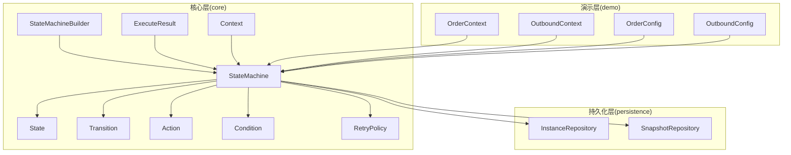
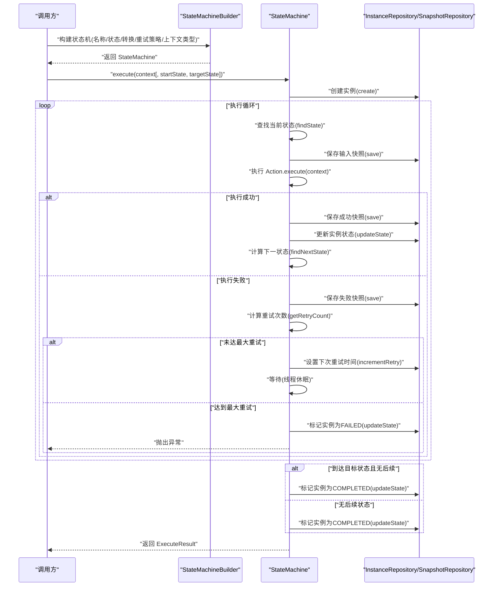
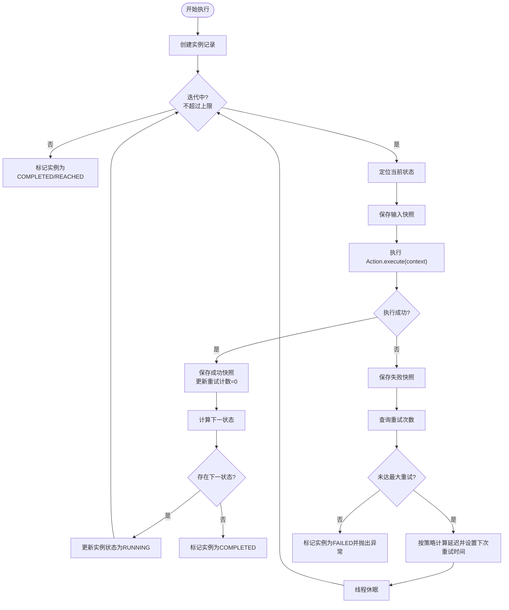
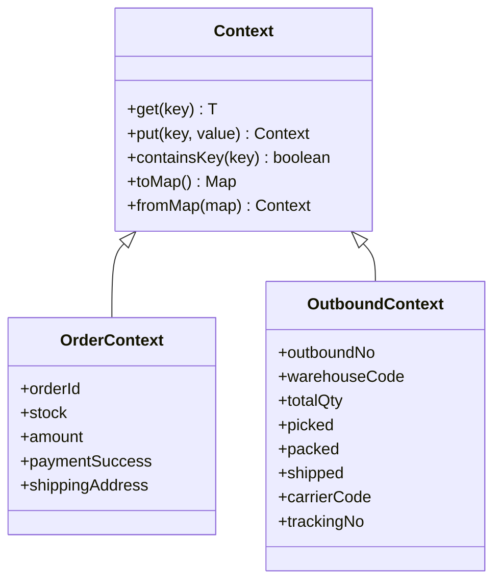
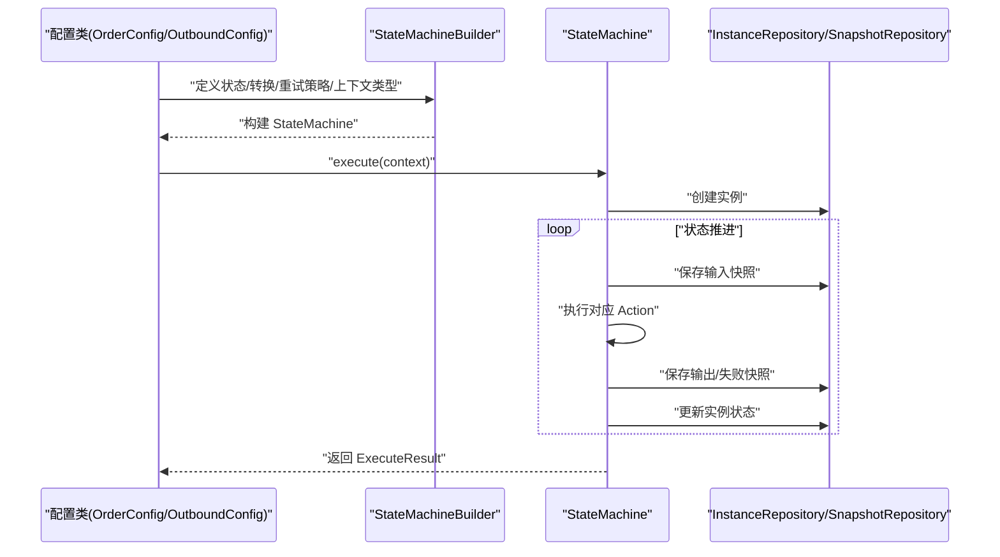
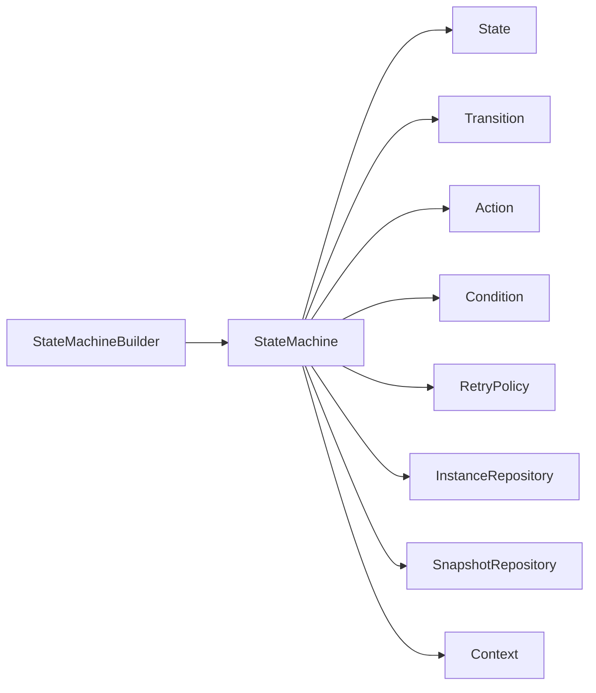

# 执行流程与上下文

<cite>
**本文引用的文件**
- [StateMachine.java](file://src/main/java/cn/chedejun/statemachine/core/StateMachine.java)
- [Context.java](file://src/main/java/cn/chedejun/statemachine/core/Context.java)
- [StateMachineBuilder.java](file://src/main/java/cn/chedejun/statemachine/core/StateMachineBuilder.java)
- [State.java](file://src/main/java/cn/chedejun/statemachine/core/State.java)
- [Transition.java](file://src/main/java/cn/chedejun/statemachine/core/Transition.java)
- [Action.java](file://src/main/java/cn/chedejun/statemachine/core/Action.java)
- [Condition.java](file://src/main/java/cn/chedejun/statemachine/core/Condition.java)
- [RetryPolicy.java](file://src/main/java/cn/chedejun/statemachine/core/RetryPolicy.java)
- [ExecuteResult.java](file://src/main/java/cn/chedejun/statemachine/core/ExecuteResult.java)
- [InstanceRepository.java](file://src/main/java/cn/chedejun/statemachine/persistence/InstanceRepository.java)
- [SnapshotRepository.java](file://src/main/java/cn/chedejun/statemachine/persistence/SnapshotRepository.java)
- [OrderContext.java](file://demo/src/main/java/cn/chedejun/demo/statemachine/OrderContext.java)
- [OutboundContext.java](file://demo/src/main/java/cn/chedejun/demo/statemachine/OutboundContext.java)
- [OrderConfig.java](file://demo/src/main/java/cn/chedejun/demo/config/OrderConfig.java)
- [OutboundConfig.java](file://demo/src/main/java/cn/chedejun/demo/config/OutboundConfig.java)
</cite>

## 目录
1. [引言](#引言)
2. [项目结构](#项目结构)
3. [核心组件](#核心组件)
4. [架构总览](#架构总览)
5. [详细组件分析](#详细组件分析)
6. [依赖分析](#依赖分析)
7. [性能考虑](#性能考虑)
8. [故障排查指南](#故障排查指南)
9. [结论](#结论)
10. [附录](#附录)

## 引言
本文件围绕状态机执行流程与上下文管理进行系统化说明，重点覆盖以下主题：
- StateMachine 的执行机制：状态推进、循环检测、执行终止条件
- Context 接口设计与实现：如何在不同状态间传递与共享数据
- OrderContext 与 OutboundContext 的具体实现示例
- 执行上下文的生命周期管理与内存优化策略
- 并发执行、异步处理与错误恢复机制

## 项目结构
该项目采用分层与功能模块结合的方式组织代码：
- core 层：状态机核心模型与执行引擎（状态、转换、动作、条件、重试策略、构建器、执行结果等）
- persistence 层：实例与快照的持久化存储（JDBC 实现）
- demo 层：演示配置与上下文扩展（订单与出库流程）

图表来源
- [StateMachine.java:11-196](file://src/main/java/cn/chedejun/statemachine/core/StateMachine.java#L11-L196)
- [State.java:3-16](file://src/main/java/cn/chedejun/statemachine/core/State.java#L3-L16)
- [Transition.java:3-20](file://src/main/java/cn/chedejun/statemachine/core/Transition.java#L3-L20)
- [Action.java:8-12](file://src/main/java/cn/chedejun/statemachine/core/Action.java#L8-L12)
- [Condition.java:3-7](file://src/main/java/cn/chedejun/statemachine/core/Condition.java#L3-L7)
- [RetryPolicy.java:5-45](file://src/main/java/cn/chedejun/statemachine/core/RetryPolicy.java#L5-L45)
- [StateMachineBuilder.java:8-53](file://src/main/java/cn/chedejun/statemachine/core/StateMachineBuilder.java#L8-L53)
- [ExecuteResult.java:14-23](file://src/main/java/cn/chedejun/statemachine/core/ExecuteResult.java#L14-L23)
- [Context.java:6-24](file://src/main/java/cn/chedejun/statemachine/core/Context.java#L6-L24)
- [InstanceRepository.java:11-66](file://src/main/java/cn/chedejun/statemachine/persistence/InstanceRepository.java#L11-L66)
- [SnapshotRepository.java:11-55](file://src/main/java/cn/chedejun/statemachine/persistence/SnapshotRepository.java#L11-L55)
- [OrderContext.java:8-34](file://demo/src/main/java/cn/chedejun/demo/statemachine/OrderContext.java#L8-L34)
- [OutboundContext.java:8-43](file://demo/src/main/java/cn/chedejun/demo/statemachine/OutboundContext.java#L8-L43)
- [OrderConfig.java:18-46](file://demo/src/main/java/cn/chedejun/demo/config/OrderConfig.java#L18-L46)
- [OutboundConfig.java:21-58](file://demo/src/main/java/cn/chedejun/demo/config/OutboundConfig.java#L21-L58)

章节来源
- [StateMachine.java:11-196](file://src/main/java/cn/chedejun/statemachine/core/StateMachine.java#L11-L196)
- [StateMachineBuilder.java:8-53](file://src/main/java/cn/chedejun/statemachine/core/StateMachineBuilder.java#L8-L53)
- [InstanceRepository.java:11-66](file://src/main/java/cn/chedejun/statemachine/persistence/InstanceRepository.java#L11-L66)
- [SnapshotRepository.java:11-55](file://src/main/java/cn/chedejun/statemachine/persistence/SnapshotRepository.java#L11-L55)
- [OrderContext.java:8-34](file://demo/src/main/java/cn/chedejun/demo/statemachine/OrderContext.java#L8-L34)
- [OutboundContext.java:8-43](file://demo/src/main/java/cn/chedejun/demo/statemachine/OutboundContext.java#L8-L43)
- [OrderConfig.java:18-46](file://demo/src/main/java/cn/chedejun/demo/config/OrderConfig.java#L18-L46)
- [OutboundConfig.java:21-58](file://demo/src/main/java/cn/chedejun/demo/config/OutboundConfig.java#L21-L58)

## 核心组件
- StateMachine：状态机执行引擎，负责状态推进、循环检测、重试与终止控制，并维护实例与快照的持久化。
- State：状态节点，封装状态名与对应 Action。
- Transition：状态转换，定义 from、to 与可选 Condition。
- Action：状态动作接口，通过上下文写入结果并被自动记录到快照。
- Condition：转换条件接口，基于上下文决定是否允许转换。
- RetryPolicy：重试策略，支持指数回退、最大尝试次数与延迟上限。
- Context：通用上下文容器，提供键值存取与序列化/反序列化支持。
- ExecuteResult：执行结果封装，包含实例 ID、机器名称、版本、当前状态、状态码与错误信息。
- InstanceRepository/SnapshotRepository：实例与快照的持久化访问。

章节来源
- [StateMachine.java:11-196](file://src/main/java/cn/chedejun/statemachine/core/StateMachine.java#L11-L196)
- [State.java:3-16](file://src/main/java/cn/chedejun/statemachine/core/State.java#L3-L16)
- [Transition.java:3-20](file://src/main/java/cn/chedejun/statemachine/core/Transition.java#L3-L20)
- [Action.java:8-12](file://src/main/java/cn/chedejun/statemachine/core/Action.java#L8-L12)
- [Condition.java:3-7](file://src/main/java/cn/chedejun/statemachine/core/Condition.java#L3-L7)
- [RetryPolicy.java:5-45](file://src/main/java/cn/chedejun/statemachine/core/RetryPolicy.java#L5-L45)
- [Context.java:6-24](file://src/main/java/cn/chedejun/statemachine/core/Context.java#L6-L24)
- [ExecuteResult.java:14-23](file://src/main/java/cn/chedejun/statemachine/core/ExecuteResult.java#L14-L23)
- [InstanceRepository.java:11-66](file://src/main/java/cn/chedejun/statemachine/persistence/InstanceRepository.java#L11-L66)
- [SnapshotRepository.java:11-55](file://src/main/java/cn/chedejun/statemachine/persistence/SnapshotRepository.java#L11-L55)

## 架构总览
下图展示了状态机执行的核心流程：从构建状态机、创建实例、进入执行循环、持久化快照，到根据目标状态或无后续状态终止。

图表来源
- [StateMachine.java:40-136](file://src/main/java/cn/chedejun/statemachine/core/StateMachine.java#L40-L136)
- [InstanceRepository.java:15-38](file://src/main/java/cn/chedejun/statemachine/persistence/InstanceRepository.java#L15-L38)
- [SnapshotRepository.java:15-31](file://src/main/java/cn/chedejun/statemachine/persistence/SnapshotRepository.java#L15-L31)

## 详细组件分析

### StateMachine 执行机制
- 启动与初始化
  - 通过构造函数接收名称、版本、状态列表、转换列表、重试策略与上下文类型。
  - 通过 Builder 注入 JdbcTemplate 与注册表，初始化 ObjectMapper、InstanceRepository、SnapshotRepository。
- 执行入口
  - execute(context[, startState, targetState])：创建实例记录，进入执行循环。
  - retry(instanceId[, context])：仅对 FAILED 实例重试，重置重试计数并从当前状态继续执行。
- 执行循环与终止条件
  - 迭代上限：states.size() × (maxAttempts + 1) + 1，避免无限循环。
  - 终止条件：
    - 显式指定 targetState 且已到达且无后续状态：标记 COMPLETED。
    - 显式指定 targetState 且已到达但有后续状态：标记 REACHED。
    - 无后续状态：标记 COMPLETED。
    - 超过最大迭代：抛出异常。
- 错误与重试
  - 每次状态执行前序列化上下文作为输入快照；成功后序列化输出快照；失败则记录错误消息。
  - 重试策略由 RetryPolicy 提供延迟计算；达到最大次数后标记 FAILED 并抛出异常。
- 状态推进
  - 依据 Transition 列表与 Condition 决定下一状态；若无满足条件的转换，则视为终止。

图表来源
- [StateMachine.java:83-136](file://src/main/java/cn/chedejun/statemachine/core/StateMachine.java#L83-L136)
- [RetryPolicy.java:26-30](file://src/main/java/cn/chedejun/statemachine/core/RetryPolicy.java#L26-L30)
- [SnapshotRepository.java:15-31](file://src/main/java/cn/chedejun/statemachine/persistence/SnapshotRepository.java#L15-L31)
- [InstanceRepository.java:28-38](file://src/main/java/cn/chedejun/statemachine/persistence/InstanceRepository.java#L28-L38)

章节来源
- [StateMachine.java:27-196](file://src/main/java/cn/chedejun/statemachine/core/StateMachine.java#L27-L196)
- [RetryPolicy.java:5-45](file://src/main/java/cn/chedejun/statemachine/core/RetryPolicy.java#L5-L45)
- [InstanceRepository.java:15-66](file://src/main/java/cn/chedejun/statemachine/persistence/InstanceRepository.java#L15-L66)
- [SnapshotRepository.java:15-55](file://src/main/java/cn/chedejun/statemachine/persistence/SnapshotRepository.java#L15-L55)

### 上下文设计与实现
- Context 接口
  - 提供键值存取、判断键是否存在、转为 Map 以及从 Map 构造的能力。
  - 作为默认上下文类型，所有 Action 可通过 put(key, value) 在状态间共享数据。
- OrderContext 与 OutboundContext
  - 分别扩展 Context，增加业务字段（如订单号、金额、仓库编码、总数量等），并在配置类中作为上下文类型使用。
  - 通过 Action 中对上下文字段的读写，驱动状态转换与流程走向。

图表来源
- [Context.java:6-24](file://src/main/java/cn/chedejun/statemachine/core/Context.java#L6-L24)
- [OrderContext.java:8-34](file://demo/src/main/java/cn/chedejun/demo/statemachine/OrderContext.java#L8-L34)
- [OutboundContext.java:8-43](file://demo/src/main/java/cn/chedejun/demo/statemachine/OutboundContext.java#L8-L43)

章节来源
- [Context.java:6-24](file://src/main/java/cn/chedejun/statemachine/core/Context.java#L6-L24)
- [OrderContext.java:8-34](file://demo/src/main/java/cn/chedejun/demo/statemachine/OrderContext.java#L8-L34)
- [OutboundContext.java:8-43](file://demo/src/main/java/cn/chedejun/demo/statemachine/OutboundContext.java#L8-L43)

### 执行上下文生命周期与内存优化
- 生命周期
  - 创建：执行入口时创建实例记录，初始状态为 RUNNING。
  - 运行：每次状态执行前序列化输入上下文，执行后序列化输出上下文，保存快照。
  - 终止：到达目标状态且无后续或无后续状态时标记 COMPLETED；显式指定目标状态但仍有后续时标记 REACHED；失败时标记 FAILED。
- 内存优化建议
  - 控制上下文大小：仅放入必要字段，避免大对象频繁序列化。
  - 使用轻量级字段：优先使用基本类型与短字符串，减少 JSON 序列化开销。
  - 合理设置重试策略：降低最大尝试次数与初始延迟，缩短失败恢复时间。
  - 快照粒度：仅在关键状态保存快照，避免过多 IO。

章节来源
- [StateMachine.java:44-48](file://src/main/java/cn/chedejun/statemachine/core/StateMachine.java#L44-L48)
- [StateMachine.java:94-116](file://src/main/java/cn/chedejun/statemachine/core/StateMachine.java#L94-L116)
- [SnapshotRepository.java:15-31](file://src/main/java/cn/chedejun/statemachine/persistence/SnapshotRepository.java#L15-L31)
- [InstanceRepository.java:28-38](file://src/main/java/cn/chedejun/statemachine/persistence/InstanceRepository.java#L28-L38)

### 并发执行、异步处理与错误恢复
- 并发执行
  - StateMachine 本身未内置并发池；可通过外部线程池调度多个实例的执行，确保每个实例独立运行。
  - 注意：同一实例的重试与状态推进由内部循环控制，不建议对同一实例并发调用。
- 异步处理
  - 可将 execute() 包装为异步任务提交至线程池；执行完成后通过实例 ID 查询最终状态与结果。
- 错误恢复
  - 失败状态会记录错误消息与快照；可通过 retry(instanceId[, context]) 重试。
  - 若未传入上下文，系统会从首次快照读取原始输入上下文进行恢复。

章节来源
- [StateMachine.java:50-79](file://src/main/java/cn/chedejun/statemachine/core/StateMachine.java#L50-L79)
- [SnapshotRepository.java:37-43](file://src/main/java/cn/chedejun/statemachine/persistence/SnapshotRepository.java#L37-L43)

### 示例：订单流程与出库流程
- 订单流程（OrderConfig）
  - 状态：检查库存 → 处理支付 → 发货 → 发送通知 → 缺货通知 → 订单失败
  - 转换：库存充足/不足、支付成功/失败、发货成功/失败
  - 使用 OrderContext 作为上下文类型，Action 中读取/写入订单相关字段。
- 出库流程（OutboundConfig）
  - 状态：创建出库单 → 拣货 → 复核 → 打包 → 发货 → 完成 → 异常处理 → 重新拣货 → 退货入库
  - 转换：拣货失败/复核不通过/发货失败均有分支处理
  - 使用 OutboundContext 作为上下文类型，Action 中读取/写入出库相关字段。

图表来源
- [OrderConfig.java:18-46](file://demo/src/main/java/cn/chedejun/demo/config/OrderConfig.java#L18-L46)
- [OutboundConfig.java:21-58](file://demo/src/main/java/cn/chedejun/demo/config/OutboundConfig.java#L21-L58)
- [StateMachine.java:40-136](file://src/main/java/cn/chedejun/statemachine/core/StateMachine.java#L40-L136)
- [InstanceRepository.java:15-38](file://src/main/java/cn/chedejun/statemachine/persistence/InstanceRepository.java#L15-L38)
- [SnapshotRepository.java:15-31](file://src/main/java/cn/chedejun/statemachine/persistence/SnapshotRepository.java#L15-L31)

章节来源
- [OrderConfig.java:18-85](file://demo/src/main/java/cn/chedejun/demo/config/OrderConfig.java#L18-L85)
- [OutboundConfig.java:21-121](file://demo/src/main/java/cn/chedejun/demo/config/OutboundConfig.java#L21-L121)
- [OrderContext.java:8-34](file://demo/src/main/java/cn/chedejun/demo/statemachine/OrderContext.java#L8-L34)
- [OutboundContext.java:8-43](file://demo/src/main/java/cn/chedejun/demo/statemachine/OutboundContext.java#L8-L43)

## 依赖分析
- 组件耦合
  - StateMachine 依赖 State、Transition、Action、Condition、RetryPolicy、JdbcTemplate、InstanceRepository、SnapshotRepository。
  - Builder 负责装配 StateMachine 并注册到注册表。
  - Context 作为通用数据载体，被 Action 读写。
- 外部依赖
  - JDBC：用于实例与快照的持久化。
  - Jackson：用于上下文的序列化与反序列化。

图表来源
- [StateMachineBuilder.java:40-51](file://src/main/java/cn/chedejun/statemachine/core/StateMachineBuilder.java#L40-L51)
- [StateMachine.java:11-35](file://src/main/java/cn/chedejun/statemachine/core/StateMachine.java#L11-L35)
- [State.java:3-16](file://src/main/java/cn/chedejun/statemachine/core/State.java#L3-L16)
- [Transition.java:3-20](file://src/main/java/cn/chedejun/statemachine/core/Transition.java#L3-L20)
- [Action.java:8-12](file://src/main/java/cn/chedejun/statemachine/core/Action.java#L8-L12)
- [Condition.java:3-7](file://src/main/java/cn/chedejun/statemachine/core/Condition.java#L3-L7)
- [RetryPolicy.java:5-45](file://src/main/java/cn/chedejun/statemachine/core/RetryPolicy.java#L5-L45)
- [InstanceRepository.java:11-66](file://src/main/java/cn/chedejun/statemachine/persistence/InstanceRepository.java#L11-L66)
- [SnapshotRepository.java:11-55](file://src/main/java/cn/chedejun/statemachine/persistence/SnapshotRepository.java#L11-L55)
- [Context.java:6-24](file://src/main/java/cn/chedejun/statemachine/core/Context.java#L6-L24)

章节来源
- [StateMachineBuilder.java:8-53](file://src/main/java/cn/chedejun/statemachine/core/StateMachineBuilder.java#L8-L53)
- [StateMachine.java:11-196](file://src/main/java/cn/chedejun/statemachine/core/StateMachine.java#L11-L196)

## 性能考虑
- 序列化成本
  - 每个状态执行前后均进行上下文序列化/反序列化；应尽量保持上下文精简。
- 数据库写入
  - 每次状态执行都会写入快照与更新实例状态；可通过合理设置重试策略与状态数量降低写入频率。
- 迭代上限
  - 执行循环设置了严格的迭代上限，防止长时间阻塞；在复杂流程中需谨慎设计转换条件，避免不必要的多次重试。

## 故障排查指南
- 常见问题
  - 未初始化：执行前必须注入 JdbcTemplate，否则抛出未初始化异常。
  - 状态不存在：当前状态无法匹配任何已定义状态，抛出状态未找到异常。
  - 超过最大迭代：执行循环超过预设上限，通常表示流程设计存在环路或条件不当。
  - 重试中断：线程休眠期间被中断，抛出异常并终止重试。
- 排查步骤
  - 查看实例状态与错误消息：通过实例 ID 查询 InstanceRepository 的记录。
  - 检查快照：通过 SnapshotRepository 查看每一步的输入/输出与错误信息。
  - 校验转换条件：确认 Transition 的 Condition 是否符合预期。
  - 调整重试策略：适当降低最大尝试次数或调整回退因子。

章节来源
- [StateMachine.java:178-180](file://src/main/java/cn/chedejun/statemachine/core/StateMachine.java#L178-L180)
- [StateMachine.java:91-93](file://src/main/java/cn/chedejun/statemachine/core/StateMachine.java#L91-L93)
- [StateMachine.java:135](file://src/main/java/cn/chedejun/statemachine/core/StateMachine.java#L135)
- [StateMachine.java:107-110](file://src/main/java/cn/chedejun/statemachine/core/StateMachine.java#L107-L110)
- [InstanceRepository.java:23-26](file://src/main/java/cn/chedejun/statemachine/persistence/InstanceRepository.java#L23-L26)
- [SnapshotRepository.java:37-43](file://src/main/java/cn/chedejun/statemachine/persistence/SnapshotRepository.java#L37-L43)

## 结论
本状态机通过清晰的模型与稳健的执行循环实现了可靠的流程编排。上下文在各状态间无缝传递，配合持久化的实例与快照，提供了良好的可观测性与可恢复能力。通过合理的重试策略与流程设计，可在保证可靠性的同时兼顾性能与资源消耗。

## 附录
- 关键 API 速览
  - StateMachine.execute(context[, startState, targetState])：执行状态机
  - StateMachine.retry(instanceId[, context])：重试失败实例
  - StateMachineBuilder.builder(name).state(...).transition(...).retryPolicy(...).build()：构建状态机
  - Context.put/get/containsKey/toMap/fromMap：上下文操作
  - ExecuteResult：执行结果封装