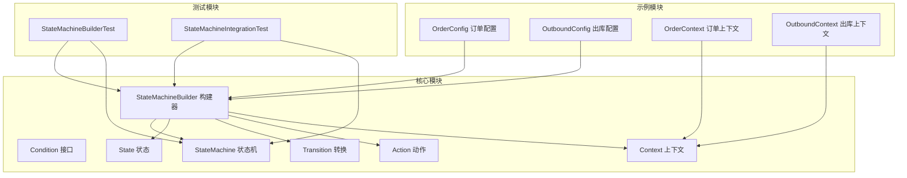
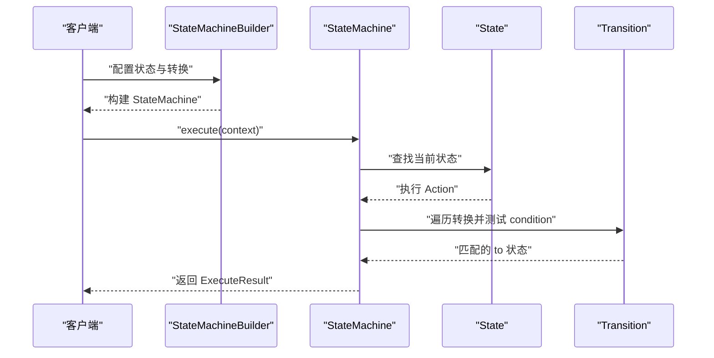
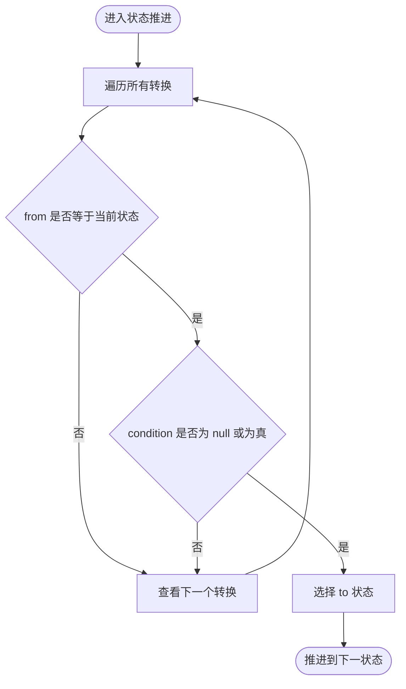
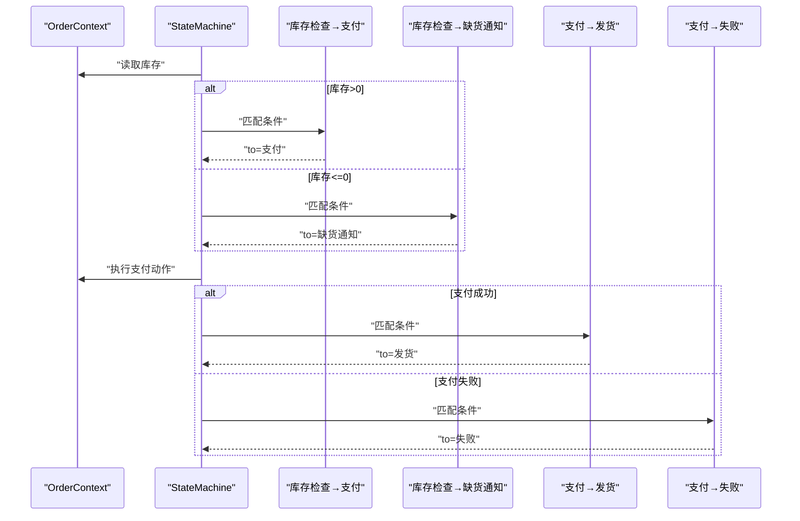
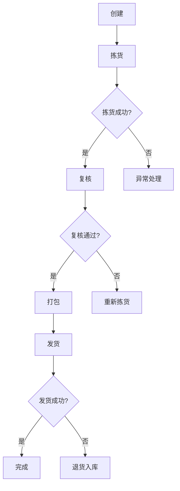
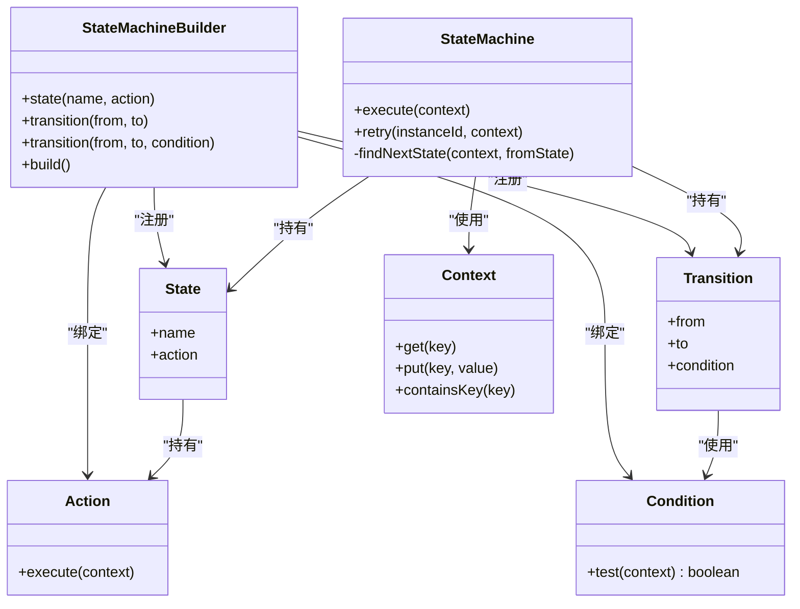

# 条件逻辑与转换

<cite>
**本文档引用的文件**
- [Condition.java](file://src/main/java/cn/chedejun/statemachine/core/Condition.java)
- [Transition.java](file://src/main/java/cn/chedejun/statemachine/core/Transition.java)
- [StateMachineBuilder.java](file://src/main/java/cn/chedejun/statemachine/core/StateMachineBuilder.java)
- [StateMachine.java](file://src/main/java/cn/chedejun/statemachine/core/StateMachine.java)
- [Action.java](file://src/main/java/cn/chedejun/statemachine/core/Action.java)
- [Context.java](file://src/main/java/cn/chedejun/statemachine/core/Context.java)
- [OrderConfig.java](file://demo/src/main/java/cn/chedejun/demo/config/OrderConfig.java)
- [OutboundConfig.java](file://demo/src/main/java/cn/chedejun/demo/config/OutboundConfig.java)
- [OrderContext.java](file://demo/src/main/java/cn/chedejun/demo/statemachine/OrderContext.java)
- [OutboundContext.java](file://demo/src/main/java/cn/chedejun/demo/statemachine/OutboundContext.java)
- [StateMachineBuilderTest.java](file://src/test/java/cn/chedejun/statemachine/core/StateMachineBuilderTest.java)
- [StateMachineIntegrationTest.java](file://src/test/java/cn/chedejun/statemachine/integration/StateMachineIntegrationTest.java)
- [README.md](file://README.md)
</cite>

## 目录
1. [简介](#简介)
2. [项目结构](#项目结构)
3. [核心组件](#核心组件)
4. [架构总览](#架构总览)
5. [详细组件分析](#详细组件分析)
6. [依赖分析](#依赖分析)
7. [性能考虑](#性能考虑)
8. [故障排除指南](#故障排除指南)
9. [结论](#结论)

## 简介
本文件聚焦于状态机中的条件逻辑与状态转换机制，系统性阐述以下内容：
- Condition 接口的函数式设计与 lambda 表达式在条件判断中的应用
- transition() 方法的重载形式：无条件转换与条件转换的配置方式
- 复杂业务场景下的条件组合、嵌套与动态条件实现思路
- 基于订单与出库流程的实际示例，展示库存检查、支付状态判断等常见条件
- 条件表达式的编写规范与性能考量

## 项目结构
该项目采用分层与按功能模块组织的结构：
- 核心模块：定义状态机核心类型（状态、转换、条件、执行器等）
- 示例模块：演示订单与出库流程的配置与执行
- 测试模块：覆盖构建、执行、重试与集成场景

图表来源
- [StateMachineBuilder.java:1-53](file://src/main/java/cn/chedejun/statemachine/core/StateMachineBuilder.java#L1-L53)
- [StateMachine.java:1-196](file://src/main/java/cn/chedejun/statemachine/core/StateMachine.java#L1-L196)
- [OrderConfig.java:1-85](file://demo/src/main/java/cn/chedejun/demo/config/OrderConfig.java#L1-L85)
- [OutboundConfig.java:1-121](file://demo/src/main/java/cn/chedejun/demo/config/OutboundConfig.java#L1-L121)

章节来源
- [README.md:1-65](file://README.md#L1-L65)

## 核心组件
本节从代码层面解析条件与转换的关键构件及其职责。

- Condition 接口
  - 角色：定义条件判断的函数式接口，接收上下文并返回布尔值
  - 设计要点：函数式接口确保可直接用 lambda 表达式编写条件逻辑
  - 使用位置：Transition 中保存条件，并在状态推进时调用

- Transition 转换
  - 角色：描述从状态到状态的迁移，携带 from、to 与 condition
  - 关键点：构造时对 from/to 进行非空校验；condition 可为 null（表示无条件）

- State 状态
  - 角色：封装状态名与对应 Action
  - 关键点：状态名非空校验；Action 在执行循环中被调用

- Action 动作
  - 角色：状态执行体，通过上下文写入数据并触发持久化快照
  - 关键点：异常会被捕获并记录快照与实例状态

- StateMachine 状态机
  - 角色：执行引擎，负责状态推进、重试策略、持久化与结果返回
  - 关键点：findNextState 会遍历所有转换，匹配 from 并测试 condition

- StateMachineBuilder 构建器
  - 角色：链式 API，用于注册状态、转换、重试策略与上下文类型
  - 关键点：transition 的两个重载分别对应无条件与条件转换

- Context 上下文
  - 角色：通用键值存储，作为 Action 与 Condition 的共享数据载体
  - 关键点：提供 get/put/containsKey 等便捷方法

章节来源
- [Condition.java:1-7](file://src/main/java/cn/chedejun/statemachine/core/Condition.java#L1-L7)
- [Transition.java:1-20](file://src/main/java/cn/chedejun/statemachine/core/Transition.java#L1-L20)
- [State.java:1-16](file://src/main/java/cn/chedejun/statemachine/core/State.java#L1-L16)
- [Action.java:1-12](file://src/main/java/cn/chedejun/statemachine/core/Action.java#L1-L12)
- [StateMachine.java:142-149](file://src/main/java/cn/chedejun/statemachine/core/StateMachine.java#L142-L149)
- [StateMachineBuilder.java:29-32](file://src/main/java/cn/chedejun/statemachine/core/StateMachineBuilder.java#L29-L32)
- [Context.java:1-24](file://src/main/java/cn/chedejun/statemachine/core/Context.java#L1-L24)

## 架构总览
状态机的执行路径如下：构建器装配状态与转换，运行时由状态机驱动执行循环，在每个状态结束后根据转换条件选择下一个状态。

图表来源
- [StateMachineBuilder.java:40-51](file://src/main/java/cn/chedejun/statemachine/core/StateMachineBuilder.java#L40-L51)
- [StateMachine.java:83-136](file://src/main/java/cn/chedejun/statemachine/core/StateMachine.java#L83-L136)
- [StateMachine.java:142-149](file://src/main/java/cn/chedejun/statemachine/core/StateMachine.java#L142-L149)

## 详细组件分析

### Condition 接口与 Lambda 表达式
- 函数式接口设计
  - 仅包含一个抽象方法 test(C)，便于以 lambda 形式传入
  - 与 Java 8+ 的函数式编程风格一致，提升可读性与简洁性
- 在转换中的使用
  - Transition 保存 Condition 实例
  - 状态推进时通过 condition.test(context) 判断是否允许转换
- 编写规范
  - 条件应尽量幂等且无副作用，避免影响上下文或外部状态
  - 优先使用上下文提供的只读数据进行判断
  - 对可能为空的字段进行防御性检查

章节来源
- [Condition.java:1-7](file://src/main/java/cn/chedejun/statemachine/core/Condition.java#L1-L7)
- [Transition.java:6](file://src/main/java/cn/chedejun/statemachine/core/Transition.java#L6)
- [StateMachine.java:145](file://src/main/java/cn/chedejun/statemachine/core/StateMachine.java#L145)

### transition() 方法重载与配置
- 无条件转换
  - 语法：transition(from, to)
  - 实现：内部委托到带 Condition 的重载，传入始终返回 true 的条件
  - 适用：总是成立的转换，如“创建 → 拣货”
- 条件转换
  - 语法：transition(from, to, condition)
  - 实现：直接保存传入的 Condition
  - 适用：基于上下文数据的分支判断，如库存充足/支付成功/地址有效
- 构建器链式调用
  - 支持多次调用 transition(...) 组合多条分支
  - 顺序重要：先定义的转换先被匹配，建议将更具体的条件放在前面

章节来源
- [StateMachineBuilder.java:29](file://src/main/java/cn/chedejun/statemachine/core/StateMachineBuilder.java#L29)
- [StateMachineBuilder.java:30-32](file://src/main/java/cn/chedejun/statemachine/core/StateMachineBuilder.java#L30-L32)

### 状态推进与条件匹配算法
状态机在每个状态结束后，会遍历所有转换，按以下规则选择下一个状态：
- from 必须与当前状态一致
- condition 为 null 或 condition.test(context) 为 true
- 返回第一个匹配的 to 状态；若无匹配则流程结束

图表来源
- [StateMachine.java:142-149](file://src/main/java/cn/chedejun/statemachine/core/StateMachine.java#L142-L149)

### 订单状态转换的复杂条件示例
- 库存检查
  - 条件：库存大于 0 → 支付；库存小于等于 0 → 缺货通知
  - 实现：在 transition 中使用 lambda 读取上下文库存字段
- 支付状态判断
  - 条件：支付成功 → 发货；支付失败 → 失败
  - 实现：在 Action 中设置支付结果标志，条件中读取该标志
- 发货与通知
  - 条件：发货成功 → 通知；发货失败 → 退货入库
  - 实现：结合上下文中的物流信息与异常处理

图表来源
- [OrderConfig.java:29-38](file://demo/src/main/java/cn/chedejun/demo/config/OrderConfig.java#L29-L38)
- [OrderContext.java:8-33](file://demo/src/main/java/cn/chedejun/demo/statemachine/OrderContext.java#L8-L33)

章节来源
- [OrderConfig.java:18-46](file://demo/src/main/java/cn/chedejun/demo/config/OrderConfig.java#L18-L46)
- [OrderContext.java:1-34](file://demo/src/main/java/cn/chedejun/demo/statemachine/OrderContext.java#L1-L34)

### 出库流程的条件组合与嵌套
- 正常流程：创建 → 拣货 → 复核 → 打包 → 发货 → 完成
- 异常分支：
  - 拣货失败 → 异常处理
  - 复核不通过 → 重新拣货
  - 发货失败 → 退货入库
- 条件组合技巧
  - 使用上下文布尔标志位（如 picked/packed/shipped）表达阶段性结果
  - 将“否定条件”与“肯定条件”并列，清晰表达分支
  - 通过“到达目标状态后停止”的语义，避免无限循环

图表来源
- [OutboundConfig.java:35-50](file://demo/src/main/java/cn/chedejun/demo/config/OutboundConfig.java#L35-L50)

章节来源
- [OutboundConfig.java:18-58](file://demo/src/main/java/cn/chedejun/demo/config/OutboundConfig.java#L18-L58)
- [OutboundContext.java:8-43](file://demo/src/main/java/cn/chedejun/demo/statemachine/OutboundContext.java#L8-L43)

### 动态条件与上下文扩展
- 动态条件
  - 可在 Action 中根据外部系统结果更新上下文，使后续条件依赖这些数据
  - 例如：支付完成后设置支付成功标志，复核完成后设置复核通过标志
- 上下文扩展
  - 通过继承 Context 或使用自定义上下文类（如 OrderContext/OutboundContext）承载业务属性
  - 使用 Context 的 put/get 方法在 Action 间传递数据

章节来源
- [Context.java:6-23](file://src/main/java/cn/chedejun/statemachine/core/Context.java#L6-L23)
- [OrderContext.java:8-33](file://demo/src/main/java/cn/chedejun/demo/statemachine/OrderContext.java#L8-L33)
- [OutboundContext.java:8-43](file://demo/src/main/java/cn/chedejun/demo/statemachine/OutboundContext.java#L8-L43)

### 条件表达式编写规范与性能考虑
- 编写规范
  - 条件表达式应保持短小、明确、可读性强
  - 避免在条件中执行耗时操作或产生副作用
  - 对可能为空的对象进行防御性检查
- 性能考虑
  - 条件判断通常为 O(n)（n 为转换数量），在状态较多时注意优化
  - 将高概率命中、简单判断的条件置于前面，减少匹配成本
  - 避免在条件中频繁访问外部资源或进行复杂计算

章节来源
- [StateMachine.java:142-149](file://src/main/java/cn/chedejun/statemachine/core/StateMachine.java#L142-L149)

## 依赖分析
核心组件之间的依赖关系如下：

图表来源
- [StateMachineBuilder.java:8-51](file://src/main/java/cn/chedejun/statemachine/core/StateMachineBuilder.java#L8-L51)
- [StateMachine.java:11-35](file://src/main/java/cn/chedejun/statemachine/core/StateMachine.java#L11-L35)
- [Transition.java:3-19](file://src/main/java/cn/chedejun/statemachine/core/Transition.java#L3-L19)
- [State.java:3-15](file://src/main/java/cn/chedejun/statemachine/core/State.java#L3-L15)
- [Action.java:9-11](file://src/main/java/cn/chedejun/statemachine/core/Action.java#L9-L11)
- [Condition.java:4-6](file://src/main/java/cn/chedejun/statemachine/core/Condition.java#L4-L6)
- [Context.java:6-23](file://src/main/java/cn/chedejun/statemachine/core/Context.java#L6-L23)

## 性能考虑
- 条件匹配复杂度
  - findNextState 遍历所有转换，时间复杂度为 O(T)，T 为转换总数
  - 建议在状态机规模较大时，合理组织转换顺序与数量
- 执行循环与重试
  - executeLoop 会根据重试策略延迟重试，避免频繁轮询
  - 最大迭代次数受状态数与重试次数限制，防止无限循环
- 上下文序列化
  - 每次状态前后都会序列化上下文，注意避免在上下文中存放过大的对象

章节来源
- [StateMachine.java:83-136](file://src/main/java/cn/chedejun/statemachine/core/StateMachine.java#L83-L136)
- [StateMachine.java:151-160](file://src/main/java/cn/chedejun/statemachine/core/StateMachine.java#L151-L160)

## 故障排除指南
- 状态机未初始化
  - 现象：执行时报未初始化错误
  - 原因：未注入 JdbcTemplate
  - 解决：在构建器中设置 jdbcTemplate 或通过自动配置加载
- 无后续转换导致流程提前结束
  - 现象：到达某状态后流程结束
  - 原因：该状态无匹配的转换
  - 解决：检查该状态的转换配置，确保存在合适的条件
- 指定目标状态后返回“已到达”
  - 现象：指定了 targetState，但流程返回 REACHED
  - 原因：targetState 后仍有未执行的转换
  - 解决：确认 targetState 是否为最后一个状态，或调整转换顺序
- 失败重试
  - 现象：状态执行失败并记录快照
  - 处理：使用 retry 接口重试，或通过管理控制台进行重试

章节来源
- [StateMachineBuilderTest.java:30-45](file://src/test/java/cn/chedejun/statemachine/core/StateMachineBuilderTest.java#L30-L45)
- [StateMachineBuilderTest.java:85-102](file://src/test/java/cn/chedejun/statemachine/core/StateMachineBuilderTest.java#L85-L102)
- [StateMachineIntegrationTest.java:204-234](file://src/test/java/cn/chedejun/statemachine/integration/StateMachineIntegrationTest.java#L204-L234)

## 结论
本文件系统梳理了状态机中条件逻辑与状态转换的设计与实现，重点包括：
- Condition 接口与 lambda 表达式的简洁表达能力
- transition() 的两种重载形式及在构建器中的配置方式
- 基于订单与出库流程的复杂条件示例，涵盖库存检查、支付状态与异常分支
- 条件表达式的编写规范与性能优化建议
- 动态条件与上下文扩展的实践方法

通过上述内容，读者可以安全、高效地在状态机中实现复杂的业务分支与条件判断。