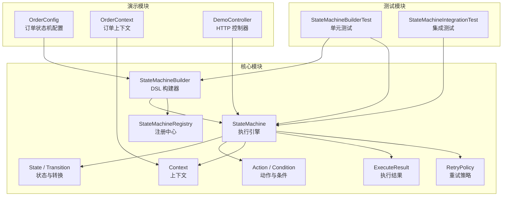
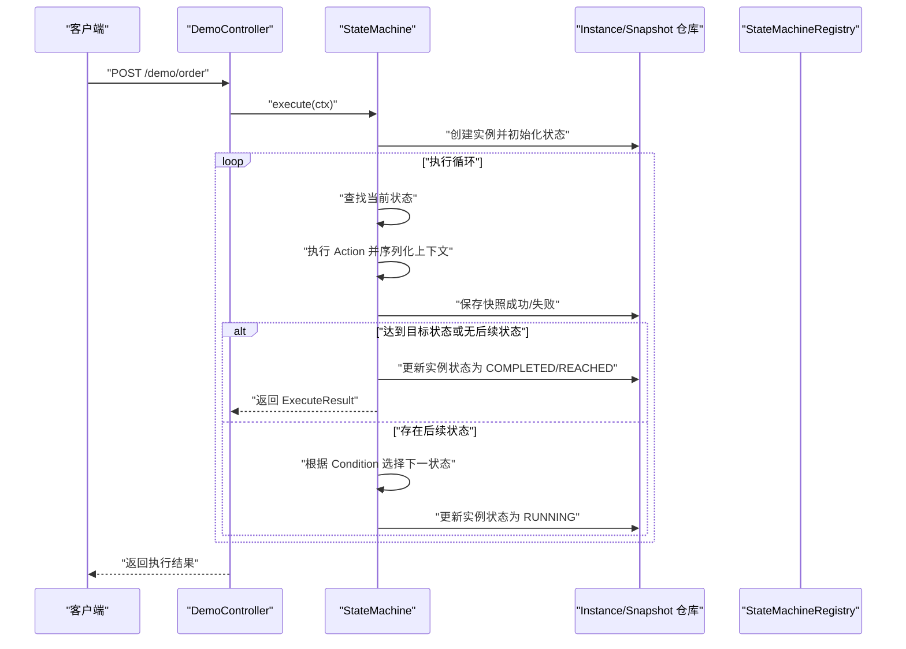
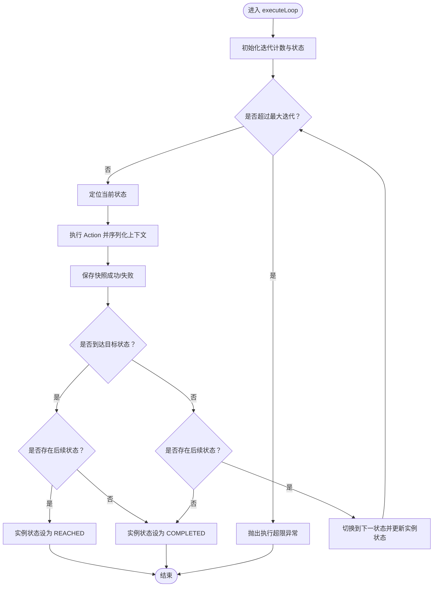
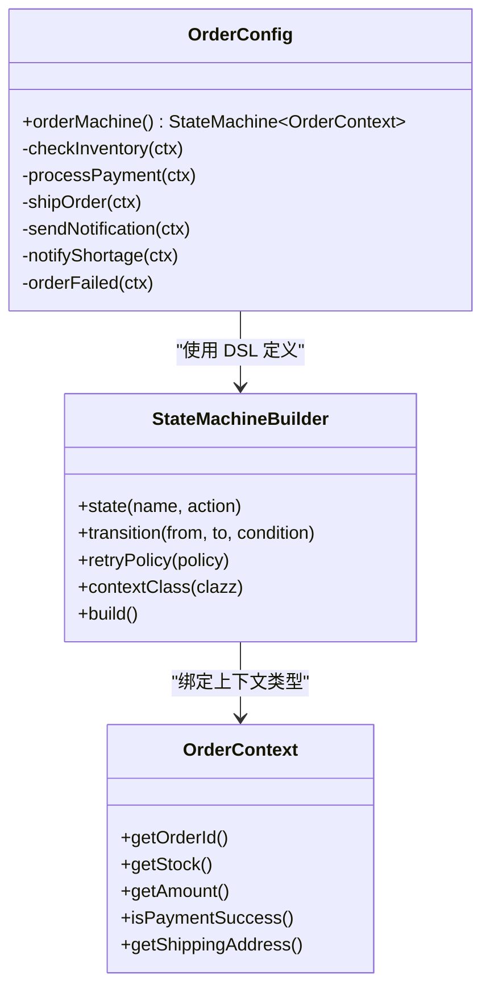
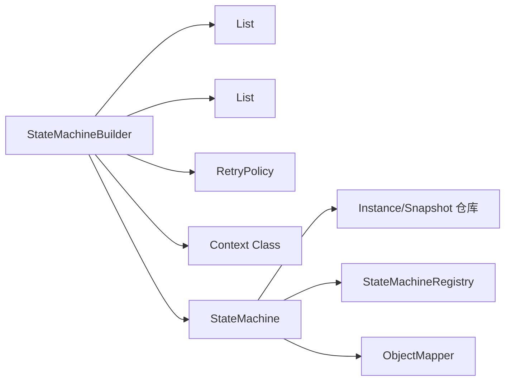

# 状态机定义与执行

<cite>
**本文引用的文件**
- [StateMachineBuilder.java](file://src/main/java/cn/chedejun/statemachine/core/StateMachineBuilder.java)
- [Action.java](file://src/main/java/cn/chedejun/statemachine/core/Action.java)
- [Condition.java](file://src/main/java/cn/chedejun/statemachine/core/Condition.java)
- [Context.java](file://src/main/java/cn/chedejun/statemachine/core/Context.java)
- [ExecuteResult.java](file://src/main/java/cn/chedejun/statemachine/core/ExecuteResult.java)
- [StateMachine.java](file://src/main/java/cn/chedejun/statemachine/core/StateMachine.java)
- [State.java](file://src/main/java/cn/chedejun/statemachine/core/State.java)
- [Transition.java](file://src/main/java/cn/chedejun/statemachine/core/Transition.java)
- [RetryPolicy.java](file://src/main/java/cn/chedejun/statemachine/core/RetryPolicy.java)
- [StateMachineRegistry.java](file://src/main/java/cn/chedejun/statemachine/core/StateMachineRegistry.java)
- [OrderConfig.java](file://demo/src/main/java/cn/chedejun/demo/config/OrderConfig.java)
- [OrderContext.java](file://demo/src/main/java/cn/chedejun/demo/statemachine/OrderContext.java)
- [DemoController.java](file://demo/src/main/java/cn/chedejun/demo/controller/DemoController.java)
- [StateMachineBuilderTest.java](file://src/test/java/cn/chedejun/statemachine/core/StateMachineBuilderTest.java)
- [StateMachineIntegrationTest.java](file://src/test/java/cn/chedejun/statemachine/integration/StateMachineIntegrationTest.java)
- [README.md](file://README.md)
</cite>

## 目录
1. [简介](#简介)
2. [项目结构](#项目结构)
3. [核心组件](#核心组件)
4. [架构总览](#架构总览)
5. [详细组件分析](#详细组件分析)
6. [依赖分析](#依赖分析)
7. [性能考虑](#性能考虑)
8. [故障排查指南](#故障排查指南)
9. [结论](#结论)
10. [附录](#附录)

## 简介
本文件面向希望在 Spring Boot 生态中使用状态机工作流的开发者，系统性讲解状态机 DSL API 的使用方法与执行机制。内容覆盖：
- StateMachineBuilder 的 DSL：状态定义、转换配置、动作绑定、条件设置
- Action 接口与 Condition 接口的实现方式
- ExecuteResult 返回值的处理与业务集成
- 从简单到复杂的订单处理示例：逐步构建状态机定义
- 执行机制、上下文传递、状态推进逻辑
- 性能优化建议与错误处理策略

## 项目结构
该项目采用模块化组织，核心状态机能力位于 core 包，演示应用位于 demo 模块，测试位于 test 目录。核心类围绕“定义-执行-持久化-注册”闭环展开。

图表来源
- [StateMachineBuilder.java:1-53](file://src/main/java/cn/chedejun/statemachine/core/StateMachineBuilder.java#L1-L53)
- [StateMachine.java:1-196](file://src/main/java/cn/chedejun/statemachine/core/StateMachine.java#L1-L196)
- [State.java:1-16](file://src/main/java/cn/chedejun/statemachine/core/State.java#L1-L16)
- [Transition.java:1-20](file://src/main/java/cn/chedejun/statemachine/core/Transition.java#L1-L20)
- [Action.java:1-12](file://src/main/java/cn/chedejun/statemachine/core/Action.java#L1-L12)
- [Condition.java:1-7](file://src/main/java/cn/chedejun/statemachine/core/Condition.java#L1-L7)
- [Context.java:1-24](file://src/main/java/cn/chedejun/statemachine/core/Context.java#L1-L24)
- [ExecuteResult.java:1-23](file://src/main/java/cn/chedejun/statemachine/core/ExecuteResult.java#L1-L23)
- [RetryPolicy.java:1-45](file://src/main/java/cn/chedejun/statemachine/core/RetryPolicy.java#L1-L45)
- [StateMachineRegistry.java:1-73](file://src/main/java/cn/chedejun/statemachine/core/StateMachineRegistry.java#L1-L73)
- [OrderConfig.java:1-85](file://demo/src/main/java/cn/chedejun/demo/config/OrderConfig.java#L1-L85)
- [OrderContext.java:1-34](file://demo/src/main/java/cn/chedejun/demo/statemachine/OrderContext.java#L1-L34)
- [DemoController.java:1-288](file://demo/src/main/java/cn/chedejun/demo/controller/DemoController.java#L1-L288)
- [StateMachineBuilderTest.java:1-122](file://src/test/java/cn/chedejun/statemachine/core/StateMachineBuilderTest.java#L1-L122)
- [StateMachineIntegrationTest.java:1-347](file://src/test/java/cn/chedejun/statemachine/integration/StateMachineIntegrationTest.java#L1-L347)

章节来源
- [README.md:1-65](file://README.md#L1-L65)

## 核心组件
- StateMachineBuilder：DSL 构建器，负责收集状态、转换、重试策略、上下文类型等，最终生成 StateMachine 实例。
- State：封装状态名与 Action。
- Transition：封装 from、to 与 Condition。
- Action：无返回值的函数式接口，通过 Context 写入执行结果。
- Condition：无返回值的函数式接口，用于判断是否允许转换。
- Context：键值存储的共享上下文，贯穿整个执行生命周期。
- ExecuteResult：封装执行结果，包含实例 ID、机器名、版本、当前状态、状态码、错误信息与创建时间。
- RetryPolicy：指数退避重试策略，可配置最大尝试次数、初始延迟、最大延迟与退避因子。
- StateMachineRegistry：注册中心，负责将状态机定义持久化到数据库并维护版本映射。

章节来源
- [StateMachineBuilder.java:1-53](file://src/main/java/cn/chedejun/statemachine/core/StateMachineBuilder.java#L1-L53)
- [State.java:1-16](file://src/main/java/cn/chedejun/statemachine/core/State.java#L1-L16)
- [Transition.java:1-20](file://src/main/java/cn/chedejun/statemachine/core/Transition.java#L1-L20)
- [Action.java:1-12](file://src/main/java/cn/chedejun/statemachine/core/Action.java#L1-L12)
- [Condition.java:1-7](file://src/main/java/cn/chedejun/statemachine/core/Condition.java#L1-L7)
- [Context.java:1-24](file://src/main/java/cn/chedejun/statemachine/core/Context.java#L1-L24)
- [ExecuteResult.java:1-23](file://src/main/java/cn/chedejun/statemachine/core/ExecuteResult.java#L1-L23)
- [RetryPolicy.java:1-45](file://src/main/java/cn/chedejun/statemachine/core/RetryPolicy.java#L1-L45)
- [StateMachineRegistry.java:1-73](file://src/main/java/cn/chedejun/statemachine/core/StateMachineRegistry.java#L1-L73)

## 架构总览
状态机执行链路由“构建-注册-执行-持久化-重试”构成。构建阶段通过 DSL 定义状态与转换；注册阶段将定义写入数据库；执行阶段驱动状态推进并记录快照；失败时按策略重试；最终通过 ExecuteResult 返回结果。

图表来源
- [DemoController.java:38-72](file://demo/src/main/java/cn/chedejun/demo/controller/DemoController.java#L38-L72)
- [StateMachine.java:40-136](file://src/main/java/cn/chedejun/statemachine/core/StateMachine.java#L40-L136)
- [StateMachineRegistry.java:21-49](file://src/main/java/cn/chedejun/statemachine/core/StateMachineRegistry.java#L21-L49)

## 详细组件分析

### DSL API 使用指南：StateMachineBuilder
- 状态定义
  - 使用 state 方法添加状态与对应 Action。Action 接收上下文对象，通过上下文写入结果。
- 转换配置
  - transition(from, to) 表示无条件转换；
  - transition(from, to, condition) 表示基于 Condition 的条件转换。
- 动作绑定
  - Action 为函数式接口，执行期间可读写 Context，结果会自动记录到快照。
- 条件设置
  - Condition 为布尔表达式，决定是否允许转换。
- 上下文类型
  - contextClass 可选，默认使用通用 Context；也可自定义上下文类型（如 OrderContext）。
- 重试策略
  - retryPolicy 可配置指数退避策略，控制最大尝试次数与延迟。
- 注册与持久化
  - registry 与 jdbcTemplate 可选注入，用于注册定义与持久化实例/快照。

章节来源
- [StateMachineBuilder.java:27-51](file://src/main/java/cn/chedejun/statemachine/core/StateMachineBuilder.java#L27-L51)
- [Action.java:1-12](file://src/main/java/cn/chedejun/statemachine/core/Action.java#L1-L12)
- [Condition.java:1-7](file://src/main/java/cn/chedejun/statemachine/core/Condition.java#L1-L7)
- [Context.java:1-24](file://src/main/java/cn/chedejun/statemachine/core/Context.java#L1-L24)
- [RetryPolicy.java:1-45](file://src/main/java/cn/chedejun/statemachine/core/RetryPolicy.java#L1-L45)
- [StateMachineRegistry.java:21-49](file://src/main/java/cn/chedejun/statemachine/core/StateMachineRegistry.java#L21-L49)

### 执行机制与状态推进逻辑
- 执行入口
  - execute(context)、execute(context, targetState)、execute(context, startState, targetState) 三种重载。
- 初始化与实例化
  - 确保已注入 JdbcTemplate；创建实例记录并确定起始状态。
- 执行循环
  - 对每个状态执行 Action，序列化输入/输出上下文，记录快照；
  - 若抛出异常则按重试策略延迟后重试，超过最大次数则标记为 FAILED；
  - 达到目标状态时根据是否存在后续状态返回 REACHED 或 COMPLETED；
  - 无后续状态则标记为 COMPLETED。
- 上下文序列化
  - 使用 ObjectMapper 将上下文序列化为 JSON 存储，便于重试与审计。

图表来源
- [StateMachine.java:83-136](file://src/main/java/cn/chedejun/statemachine/core/StateMachine.java#L83-L136)

章节来源
- [StateMachine.java:40-136](file://src/main/java/cn/chedejun/statemachine/core/StateMachine.java#L40-L136)

### Action 接口与 ExecuteResult 返回处理
- Action 接口
  - 无返回值，通过上下文写入结果；异常即视为执行失败。
- ExecuteResult
  - 字段包含实例 ID、机器名、版本、当前状态、状态码（COMPLETED/REACHED/FAILED）、错误信息与创建时间；
  - 业务侧可直接使用该结果进行前端展示或后续处理。

章节来源
- [Action.java:1-12](file://src/main/java/cn/chedejun/statemachine/core/Action.java#L1-L12)
- [ExecuteResult.java:1-23](file://src/main/java/cn/chedejun/statemachine/core/ExecuteResult.java#L1-L23)

### 订单处理示例：从简单到复杂
- 示例一：基础订单流程（来自演示配置）
  - 状态：检查库存、处理支付、发货、发送通知、缺货通知、订单失败；
  - 转换：库存充足→支付；库存不足→缺货通知；支付成功→发货；支付失败→失败；发货→通知。
  - 条件：基于上下文字段（库存、支付结果、收货地址）进行判断。
  - 重试：指数退避，最多 3 次。
- 示例二：HTTP 控制器集成
  - 提供 /demo/order 与 /demo/order/step 接口，分别执行完整流程与指定目标状态；
  - 返回 ExecuteResult 中的关键字段，便于前端区分 COMPLETED 与 REACHED。

图表来源
- [OrderConfig.java:18-46](file://demo/src/main/java/cn/chedejun/demo/config/OrderConfig.java#L18-L46)
- [OrderContext.java:1-34](file://demo/src/main/java/cn/chedejun/demo/statemachine/OrderContext.java#L1-L34)
- [StateMachineBuilder.java:27-51](file://src/main/java/cn/chedejun/statemachine/core/StateMachineBuilder.java#L27-L51)

章节来源
- [OrderConfig.java:1-85](file://demo/src/main/java/cn/chedejun/demo/config/OrderConfig.java#L1-L85)
- [OrderContext.java:1-34](file://demo/src/main/java/cn/chedejun/demo/statemachine/OrderContext.java#L1-L34)
- [DemoController.java:38-118](file://demo/src/main/java/cn/chedejun/demo/controller/DemoController.java#L38-L118)

### 上下文传递与持久化
- 上下文传递
  - 每个状态执行前将当前上下文序列化为 JSON 输入，执行后序列化为 JSON 输出，分别记录到快照。
- 持久化
  - 实例表记录实例 ID、机器名、版本、当前状态、重试次数与错误信息；
  - 快照表记录状态名、输入/输出 JSON、状态（SUCCESS/FAILED）、尝试次数与时间戳；
  - 注册中心将定义写入数据库，支持版本管理与查询。

章节来源
- [StateMachine.java:94-116](file://src/main/java/cn/chedejun/statemachine/core/StateMachine.java#L94-L116)
- [StateMachineRegistry.java:29-48](file://src/main/java/cn/chedejun/statemachine/core/StateMachineRegistry.java#L29-L48)

### 重试与失败处理
- 重试策略
  - 基于指数退避，可配置最大尝试次数、初始延迟、最大延迟与退避因子；
  - 失败后记录快照与错误信息，更新实例重试次数与下次重试时间。
- 失败终止
  - 超过最大尝试次数后，实例状态标记为 FAILED，并抛出异常。
- 重试接口
  - 支持手动重试（需传入新上下文）与自动重试（从首条快照反序列化原始上下文）。

章节来源
- [RetryPolicy.java:1-45](file://src/main/java/cn/chedejun/statemachine/core/RetryPolicy.java#L1-L45)
- [StateMachine.java:50-79](file://src/main/java/cn/chedejun/statemachine/core/StateMachine.java#L50-L79)

## 依赖分析
- 组件内聚与耦合
  - StateMachineBuilder 与 State/Transition 解耦，通过不可变集合传递给 StateMachine；
  - StateMachine 与持久化层通过 JdbcTemplate 注入，避免硬编码依赖；
  - Registry 负责定义注册与版本解析，与执行解耦。
- 外部依赖
  - Spring JDBC、Jackson、Spring Boot 自动装配（在演示与测试中体现）。

图表来源
- [StateMachineBuilder.java:40-51](file://src/main/java/cn/chedejun/statemachine/core/StateMachineBuilder.java#L40-L51)
- [StateMachine.java:27-35](file://src/main/java/cn/chedejun/statemachine/core/StateMachine.java#L27-L35)

章节来源
- [StateMachineBuilder.java:1-53](file://src/main/java/cn/chedejun/statemachine/core/StateMachineBuilder.java#L1-L53)
- [StateMachine.java:1-196](file://src/main/java/cn/chedejun/statemachine/core/StateMachine.java#L1-L196)

## 性能考虑
- 序列化成本
  - 上下文序列化/反序列化为 JSON，建议控制上下文体量，避免大对象频繁传输。
- 迭代上限
  - 执行循环受 states 数量与重试次数限制，防止无限循环。
- 数据库写入
  - 快照与实例写入频率较高，建议合理配置数据库连接池与索引。
- 重试策略
  - 适当降低初始延迟与最大延迟，减少等待时间；控制最大尝试次数避免资源浪费。
- 并发与线程安全
  - 状态机执行为单实例串行推进，无需额外并发控制；注意 Action 内部的外部资源访问需线程安全。

## 故障排查指南
- 常见问题
  - 未注入数据源：执行时报未初始化异常；
  - 目标状态不存在或无后续状态：返回 COMPLETED；存在后续状态：返回 REACHED；
  - 超过最大迭代：抛出执行超限异常；
  - 重试中断：线程被中断时抛出异常。
- 定位手段
  - 通过控制台或管理端查看实例与快照详情；
  - 在控制器中捕获 StateMachineException，记录实例 ID 与堆栈以便回溯。
- 建议
  - 在 Action 中对关键外部调用增加超时与熔断保护；
  - 对异常进行分类与告警，结合快照中的错误信息快速定位。

章节来源
- [StateMachineBuilderTest.java:30-53](file://src/test/java/cn/chedejun/statemachine/core/StateMachineBuilderTest.java#L30-L53)
- [StateMachineIntegrationTest.java:204-234](file://src/test/java/cn/chedejun/statemachine/integration/StateMachineIntegrationTest.java#L204-L234)
- [DemoController.java:58-71](file://demo/src/main/java/cn/chedejun/demo/controller/DemoController.java#L58-L71)

## 结论
本状态机以简洁的 DSL API 实现了从定义到执行再到持久化的完整闭环。通过 Action/Condition 的函数式抽象与 Context 的上下文传递，能够灵活适配各类业务流程；配合指数退避重试与快照持久化，具备良好的容错与可观测性。结合演示与测试用例，可快速落地到实际项目中。

## 附录
- 快速开始参考
  - 依赖引入、状态机定义、执行与重试、管理控制台访问。
- 关键 API 路径
  - DSL 构建：[StateMachineBuilder.java:27-51](file://src/main/java/cn/chedejun/statemachine/core/StateMachineBuilder.java#L27-L51)
  - 执行入口：[StateMachine.java:37-48](file://src/main/java/cn/chedejun/statemachine/core/StateMachine.java#L37-L48)
  - 结果封装：[ExecuteResult.java:1-23](file://src/main/java/cn/chedejun/statemachine/core/ExecuteResult.java#L1-L23)
  - 订单示例：[OrderConfig.java:18-46](file://demo/src/main/java/cn/chedejun/demo/config/OrderConfig.java#L18-L46)、[OrderContext.java:1-34](file://demo/src/main/java/cn/chedejun/demo/statemachine/OrderContext.java#L1-L34)
  - 控制器集成：[DemoController.java:38-118](file://demo/src/main/java/cn/chedejun/demo/controller/DemoController.java#L38-L118)