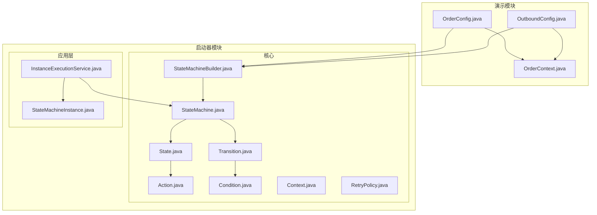
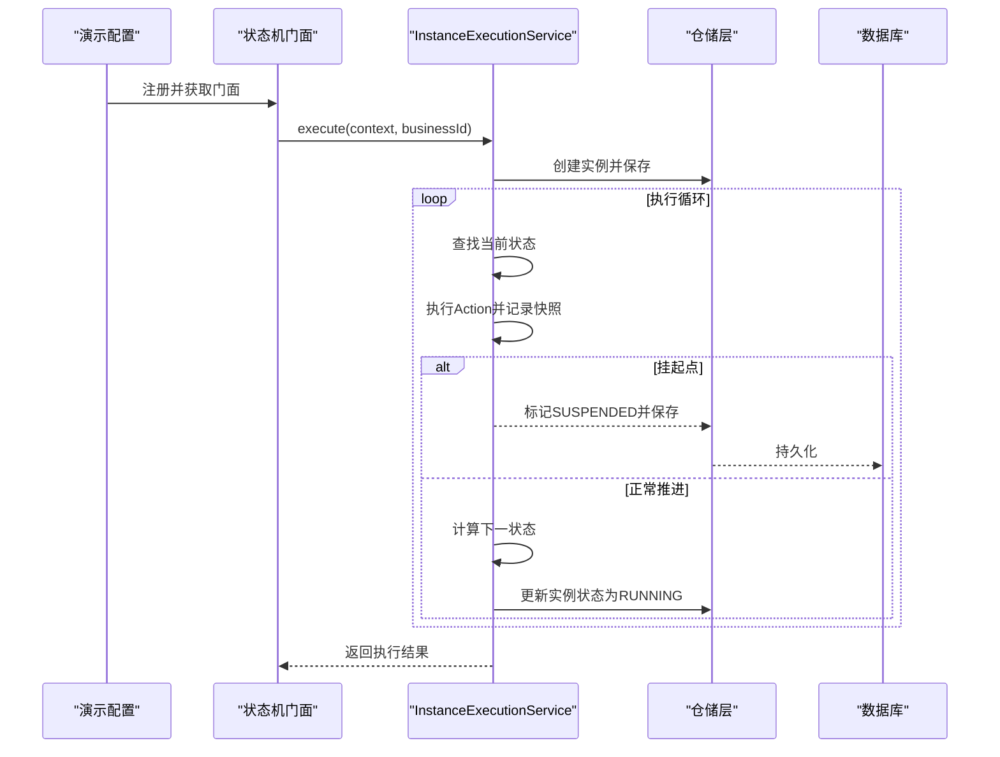
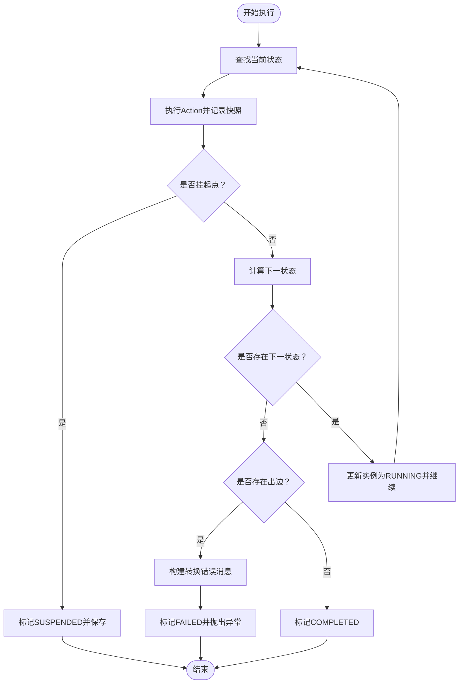
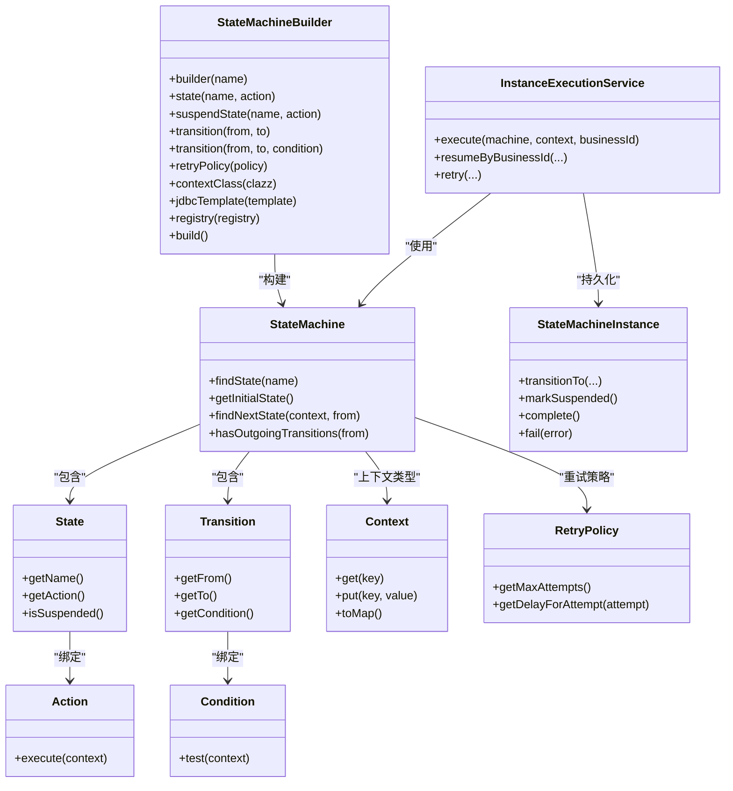

# 使用模式与设计模式

<cite>
**本文引用的文件**
- [StateMachineBuilder.java](file://state-machine-boot-starter/src/main/java/cn/chedejun/statemachine/core/StateMachineBuilder.java)
- [Action.java](file://state-machine-boot-starter/src/main/java/cn/chedejun/statemachine/core/Action.java)
- [Condition.java](file://state-machine-boot-starter/src/main/java/cn/chedejun/statemachine/core/Condition.java)
- [State.java](file://state-machine-boot-starter/src/main/java/cn/chedejun/statemachine/core/State.java)
- [Transition.java](file://state-machine-boot-starter/src/main/java/cn/chedejun/statemachine/core/Transition.java)
- [StateMachine.java](file://state-machine-boot-starter/src/main/java/cn/chedejun/statemachine/domain/engine/StateMachine.java)
- [Context.java](file://state-machine-boot-starter/src/main/java/cn/chedejun/statemachine/core/Context.java)
- [RetryPolicy.java](file://state-machine-boot-starter/src/main/java/cn/chedejun/statemachine/core/RetryPolicy.java)
- [InstanceExecutionService.java](file://state-machine-boot-starter/src/main/java/cn/chedejun/statemachine/application/InstanceExecutionService.java)
- [StateMachineInstance.java](file://state-machine-boot-starter/src/main/java/cn/chedejun/statemachine/domain/instance/StateMachineInstance.java)
- [OrderConfig.java](file://state-machine-demo/src/main/java/cn/chedejun/demo/config/OrderConfig.java)
- [OutboundConfig.java](file://state-machine-demo/src/main/java/cn/chedejun/demo/config/OutboundConfig.java)
- [OrderContext.java](file://state-machine-demo/src/main/java/cn/chedejun/demo/statemachine/OrderContext.java)
- [StateMachineBuilderTest.java](file://state-machine-boot-starter/src/test/java/cn/chedejun/statemachine/core/StateMachineBuilderTest.java)
- [StateMachineIntegrationTest.java](file://state-machine-boot-starter/src/test/java/cn/chedejun/statemachine/integration/StateMachineIntegrationTest.java)
</cite>

## 目录
1. [引言](#引言)
2. [项目结构](#项目结构)
3. [核心组件](#核心组件)
4. [架构总览](#架构总览)
5. [详细组件分析](#详细组件分析)
6. [依赖分析](#依赖分析)
7. [性能考虑](#性能考虑)
8. [故障排查指南](#故障排查指南)
9. [结论](#结论)
10. [附录](#附录)

## 引言
本指南聚焦于状态机在订单处理与出库流程中的使用模式与设计模式，系统阐述状态定义、转换规则与条件判断的最佳实践；详解StateMachineBuilder的Fluent API链式调用技巧；总结Action与Condition的实现模式与可复用封装方法；给出状态机组合与继承策略以应对复杂业务；提供错误处理与异常恢复（含幂等性与事务一致性）的设计要点；并结合性能优化（状态缓存、批量处理）与多场景模板，帮助读者快速构建稳定、可观测、可演进的状态机系统。

## 项目结构
该项目采用模块化组织，核心能力位于boot starter模块，演示示例位于demo模块，测试覆盖builder与集成场景。整体结构清晰地分离了“领域模型”“应用服务”“基础设施”“演示配置”“测试”。

图表来源
- [OrderConfig.java:1-95](file://state-machine-demo/src/main/java/cn/chedejun/demo/config/OrderConfig.java#L1-L95)
- [OutboundConfig.java:1-130](file://state-machine-demo/src/main/java/cn/chedejun/demo/config/OutboundConfig.java#L1-L130)
- [StateMachineBuilder.java:1-52](file://state-machine-boot-starter/src/main/java/cn/chedejun/statemachine/core/StateMachineBuilder.java#L1-L52)
- [StateMachine.java:1-77](file://state-machine-boot-starter/src/main/java/cn/chedejun/statemachine/domain/engine/StateMachine.java#L1-L77)
- [State.java:1-23](file://state-machine-boot-starter/src/main/java/cn/chedejun/statemachine/core/State.java#L1-L23)
- [Transition.java:1-20](file://state-machine-boot-starter/src/main/java/cn/chedejun/statemachine/core/Transition.java#L1-L20)
- [Action.java:1-12](file://state-machine-boot-starter/src/main/java/cn/chedejun/statemachine/core/Action.java#L1-L12)
- [Condition.java:1-7](file://state-machine-boot-starter/src/main/java/cn/chedejun/statemachine/core/Condition.java#L1-L7)
- [Context.java:1-24](file://state-machine-boot-starter/src/main/java/cn/chedejun/statemachine/core/Context.java#L1-L24)
- [RetryPolicy.java:1-45](file://state-machine-boot-starter/src/main/java/cn/chedejun/statemachine/core/RetryPolicy.java#L1-L45)
- [InstanceExecutionService.java:1-296](file://state-machine-boot-starter/src/main/java/cn/chedejun/statemachine/application/InstanceExecutionService.java#L1-L296)
- [StateMachineInstance.java:1-81](file://state-machine-boot-starter/src/main/java/cn/chedejun/statemachine/domain/instance/StateMachineInstance.java#L1-L81)

章节来源
- [OrderConfig.java:1-95](file://state-machine-demo/src/main/java/cn/chedejun/demo/config/OrderConfig.java#L1-L95)
- [OutboundConfig.java:1-130](file://state-machine-demo/src/main/java/cn/chedejun/demo/config/OutboundConfig.java#L1-L130)
- [StateMachineBuilder.java:1-52](file://state-machine-boot-starter/src/main/java/cn/chedejun/statemachine/core/StateMachineBuilder.java#L1-L52)

## 核心组件
- 状态机定义与构建
  - StateMachineBuilder：提供Fluent API，支持状态、挂起点、转换、重试策略、上下文类型与注册器注入。
  - StateMachine：不可变领域对象，持有状态集合、转换集合、重试策略与上下文类。
  - State：封装状态名、动作与是否挂起点。
  - Transition：封装from、to与Condition。
  - Action/Condition：函数式接口，分别承载状态动作与转换条件。
  - Context：通用上下文容器，支持键值读写与序列化。
  - RetryPolicy：指数退避重试策略，支持最大次数、初始延迟、最大延迟与退避因子。
- 运行时与持久化
  - InstanceExecutionService：核心执行引擎，负责实例创建、状态推进、路由决策、重试与恢复。
  - StateMachineInstance：聚合根，维护实例状态、重试计数、错误信息与领域事件。

章节来源
- [StateMachineBuilder.java:1-52](file://state-machine-boot-starter/src/main/java/cn/chedejun/statemachine/core/StateMachineBuilder.java#L1-L52)
- [StateMachine.java:1-77](file://state-machine-boot-starter/src/main/java/cn/chedejun/statemachine/domain/engine/StateMachine.java#L1-L77)
- [State.java:1-23](file://state-machine-boot-starter/src/main/java/cn/chedejun/statemachine/core/State.java#L1-L23)
- [Transition.java:1-20](file://state-machine-boot-starter/src/main/java/cn/chedejun/statemachine/core/Transition.java#L1-L20)
- [Action.java:1-12](file://state-machine-boot-starter/src/main/java/cn/chedejun/statemachine/core/Action.java#L1-L12)
- [Condition.java:1-7](file://state-machine-boot-starter/src/main/java/cn/chedejun/statemachine/core/Condition.java#L1-L7)
- [Context.java:1-24](file://state-machine-boot-starter/src/main/java/cn/chedejun/statemachine/core/Context.java#L1-L24)
- [RetryPolicy.java:1-45](file://state-machine-boot-starter/src/main/java/cn/chedejun/statemachine/core/RetryPolicy.java#L1-L45)
- [InstanceExecutionService.java:1-296](file://state-machine-boot-starter/src/main/java/cn/chedejun/statemachine/application/InstanceExecutionService.java#L1-L296)
- [StateMachineInstance.java:1-81](file://state-machine-boot-starter/src/main/java/cn/chedejun/statemachine/domain/instance/StateMachineInstance.java#L1-L81)

## 架构总览
下图展示了从配置到执行再到持久化的完整链路，体现“声明式定义 + 命令式执行”的分层设计。

图表来源
- [OrderConfig.java:24-50](file://state-machine-demo/src/main/java/cn/chedejun/demo/config/OrderConfig.java#L24-L50)
- [OutboundConfig.java:26-63](file://state-machine-demo/src/main/java/cn/chedejun/demo/config/OutboundConfig.java#L26-L63)
- [InstanceExecutionService.java:43-193](file://state-machine-boot-starter/src/main/java/cn/chedejun/statemachine/application/InstanceExecutionService.java#L43-L193)

## 详细组件分析

### StateMachineBuilder 的 Fluent API 与链式调用
- 设计要点
  - 构造器校验名称非空；提供静态工厂方法与链式setter。
  - state/suspendState：注册普通状态与挂起点；挂起点用于“暂停等待外部恢复”。
  - transition：支持无条件与带Condition的转换；Condition为函数式接口，便于表达业务条件。
  - retryPolicy/contextClass/jdbcTemplate/registry：集中注入运行期依赖。
  - build：生成不可变StateMachine，并推断上下文类型与版本号。
- 最佳实践
  - 将状态与转换集中在builder中一次性声明，保持DSL清晰可读。
  - 使用suspendState标识人工干预点，配合门面的resume能力。
  - 将重试策略与上下文类型显式注入，确保可测试与可替换。

章节来源
- [StateMachineBuilder.java:21-51](file://state-machine-boot-starter/src/main/java/cn/chedejun/statemachine/core/StateMachineBuilder.java#L21-L51)
- [StateMachineBuilderTest.java:35-106](file://state-machine-boot-starter/src/test/java/cn/chedejun/statemachine/core/StateMachineBuilderTest.java#L35-L106)

### Action 与 Condition 的实现模式
- Action 模式
  - 以函数式接口承载“状态步骤的业务逻辑”，通过Context读写共享数据，自动落盘到快照。
  - 建议：每个Action职责单一，异常即重试；必要时在Action内部进行幂等判断。
- Condition 模式
  - 以布尔表达式描述“从某状态到某状态的可选路径”，建议将复杂条件抽取为可复用工具方法。
  - 在演示配置中，直接使用lambda表达式读取上下文字段，简洁直观。
- 可复用封装
  - 将常见条件封装为静态方法，统一命名约定，提升可读性与可维护性。
  - 将Action封装为可注入组件，便于单元测试与替换。

章节来源
- [Action.java:1-12](file://state-machine-boot-starter/src/main/java/cn/chedejun/statemachine/core/Action.java#L1-L12)
- [Condition.java:1-7](file://state-machine-boot-starter/src/main/java/cn/chedejun/statemachine/core/Condition.java#L1-L7)
- [OrderConfig.java:52-89](file://state-machine-demo/src/main/java/cn/chedejun/demo/config/OrderConfig.java#L52-L89)
- [OutboundConfig.java:65-124](file://state-machine-demo/src/main/java/cn/chedejun/demo/config/OutboundConfig.java#L65-L124)

### 状态定义与转换规则
- 状态定义
  - 普通状态：执行业务动作后推进到下一状态。
  - 挂起点：执行完成后标记SUSPENDED，等待resumeByBusinessId或resumeByInstanceId恢复。
- 转换规则
  - 优先匹配满足Condition的转换；若无可用转换且存在出边，则报错提示可用目标。
  - 若无出边则结束，标记COMPLETED。
- 示例映射
  - 订单流程：检查库存 → 支付 → 等待发货确认（挂起）→ 发货 → 发送通知/缺货通知 → 失败处理。
  - 出库流程：创建 → 拣货 → 复核 → 打包（挂起）→ 发货 → 完成/退货入库/异常处理/重新拣货。

章节来源
- [StateMachine.java:50-76](file://state-machine-boot-starter/src/main/java/cn/chedejun/statemachine/domain/engine/StateMachine.java#L50-L76)
- [OrderConfig.java:27-50](file://state-machine-demo/src/main/java/cn/chedejun/demo/config/OrderConfig.java#L27-L50)
- [OutboundConfig.java:29-63](file://state-machine-demo/src/main/java/cn/chedejun/demo/config/OutboundConfig.java#L29-L63)

### 执行引擎与恢复机制
- 执行循环
  - 查找状态 → 执行Action → 记录成功/失败快照 → 计算下一状态 → 更新实例状态。
  - 对挂起点特殊处理：记录SUSPENDED并停止推进。
- 恢复与重试
  - resumeByBusinessId/resumeByInstanceId：校验期望状态，合并上下文，CAS原子恢复并继续执行。
  - retry：基于最后一次失败快照重建上下文，定位目标状态并重放。
- 错误与可观测性
  - 未匹配转换时构建详细错误消息，包含可用目标列表。
  - 快照区分“节点快照”和“路由快照”，便于审计与回溯。

图表来源
- [InstanceExecutionService.java:158-193](file://state-machine-boot-starter/src/main/java/cn/chedejun/statemachine/application/InstanceExecutionService.java#L158-L193)
- [InstanceExecutionService.java:195-237](file://state-machine-boot-starter/src/main/java/cn/chedejun/statemachine/application/InstanceExecutionService.java#L195-L237)

章节来源
- [InstanceExecutionService.java:43-296](file://state-machine-boot-starter/src/main/java/cn/chedejun/statemachine/application/InstanceExecutionService.java#L43-L296)
- [StateMachineIntegrationTest.java:396-446](file://state-machine-boot-starter/src/test/java/cn/chedejun/statemachine/integration/StateMachineIntegrationTest.java#L396-L446)

### 上下文与数据模型
- Context
  - 提供键值存储与序列化能力，作为Action间共享载体。
- OrderContext/OutboundContext
  - 在演示中扩展Context，承载业务字段（如订单号、金额、地址、出库单号、仓库编码、物流信息等），便于Action读写。
- 实例与快照
  - StateMachineInstance：聚合根，维护状态、重试计数、错误信息与领域事件。
  - 快照：记录输入/输出上下文、执行结果、重试次数与时间戳，支撑可观测与审计。

章节来源
- [Context.java:1-24](file://state-machine-boot-starter/src/main/java/cn/chedejun/statemachine/core/Context.java#L1-L24)
- [OrderContext.java:1-99](file://state-machine-demo/src/main/java/cn/chedejun/demo/statemachine/OrderContext.java#L1-L99)
- [StateMachineInstance.java:9-81](file://state-machine-boot-starter/src/main/java/cn/chedejun/statemachine/domain/instance/StateMachineInstance.java#L9-L81)

### 状态机组合与继承策略
- 组合策略
  - 将通用流程抽象为独立的StateMachine，通过builder组合多个子流程（例如“校验”“处理”“通知”），在上层编排中按需装配。
  - 通过不同的Context类型隔离业务域，降低耦合。
- 继承策略
  - 通过扩展Context（如OrderContext/OutboundContext）承载不同业务属性，实现“行为复用 + 数据隔离”的继承式复用。
- 演示映射
  - 订单与出库各自定义独立的StateMachine与Context，互不干扰，便于独立演进与测试。

章节来源
- [OrderConfig.java:27-50](file://state-machine-demo/src/main/java/cn/chedejun/demo/config/OrderConfig.java#L27-L50)
- [OutboundConfig.java:29-63](file://state-machine-demo/src/main/java/cn/chedejun/demo/config/OutboundConfig.java#L29-L63)
- [OrderContext.java:10-99](file://state-machine-demo/src/main/java/cn/chedejun/demo/statemachine/OrderContext.java#L10-L99)

### 错误处理与异常恢复（幂等性与一致性）
- 幂等性
  - Action内部应具备幂等保护（如检查前置条件、去重标识），避免重复执行造成副作用。
  - 重试策略仅对可重试异常生效，失败后记录失败快照，避免重复尝试。
- 事务一致性
  - 恢复与重试通过“读取最后失败快照 → 反序列化上下文 → CAS原子恢复 → 继续执行”的方式，减少并发冲突。
  - 快照区分节点与路由，确保路由失败时能准确定位目标状态。
- 可观测性
  - 未匹配转换时输出可用目标列表，辅助定位配置问题。
  - 失败与完成均产生领域事件，便于监控与告警。

章节来源
- [InstanceExecutionService.java:119-152](file://state-machine-boot-starter/src/main/java/cn/chedejun/statemachine/application/InstanceExecutionService.java#L119-L152)
- [InstanceExecutionService.java:268-275](file://state-machine-boot-starter/src/main/java/cn/chedejun/statemachine/application/InstanceExecutionService.java#L268-L275)
- [StateMachineIntegrationTest.java:416-468](file://state-machine-boot-starter/src/test/java/cn/chedejun/statemachine/integration/StateMachineIntegrationTest.java#L416-L468)

## 依赖分析
- 组件内聚与耦合
  - StateMachineBuilder高内聚于状态机定义，低耦合于执行引擎；通过StateMachine暴露只读接口，保障不可变性。
  - Action/Condition解耦于具体业务，通过Context传递数据，便于替换与测试。
- 外部依赖
  - Spring JDBC与JdbcTemplate用于仓储层初始化与SQL执行。
  - ObjectMapper用于上下文序列化与反序列化。
- 循环依赖
  - 未发现循环依赖；执行服务依赖仓储接口，仓储实现依赖JDBC。

图表来源
- [StateMachineBuilder.java:9-51](file://state-machine-boot-starter/src/main/java/cn/chedejun/statemachine/core/StateMachineBuilder.java#L9-L51)
- [StateMachine.java:19-77](file://state-machine-boot-starter/src/main/java/cn/chedejun/statemachine/domain/engine/StateMachine.java#L19-L77)
- [State.java:3-23](file://state-machine-boot-starter/src/main/java/cn/chedejun/statemachine/core/State.java#L3-L23)
- [Transition.java:3-20](file://state-machine-boot-starter/src/main/java/cn/chedejun/statemachine/core/Transition.java#L3-L20)
- [Action.java:9-11](file://state-machine-boot-starter/src/main/java/cn/chedejun/statemachine/core/Action.java#L9-L11)
- [Condition.java:4-6](file://state-machine-boot-starter/src/main/java/cn/chedejun/statemachine/core/Condition.java#L4-L6)
- [Context.java:6-24](file://state-machine-boot-starter/src/main/java/cn/chedejun/statemachine/core/Context.java#L6-L24)
- [RetryPolicy.java:5-45](file://state-machine-boot-starter/src/main/java/cn/chedejun/statemachine/core/RetryPolicy.java#L5-L45)
- [InstanceExecutionService.java:24-41](file://state-machine-boot-starter/src/main/java/cn/chedejun/statemachine/application/InstanceExecutionService.java#L24-L41)
- [StateMachineInstance.java:9-81](file://state-machine-boot-starter/src/main/java/cn/chedejun/statemachine/domain/instance/StateMachineInstance.java#L9-L81)

章节来源
- [StateMachineBuilder.java:1-52](file://state-machine-boot-starter/src/main/java/cn/chedejun/statemachine/core/StateMachineBuilder.java#L1-L52)
- [StateMachine.java:1-77](file://state-machine-boot-starter/src/main/java/cn/chedejun/statemachine/domain/engine/StateMachine.java#L1-L77)

## 性能考虑
- 状态缓存
  - 在高频场景可缓存StateMachine实例与状态查找结果，减少重复构建与遍历开销。
- 批量处理
  - 对多个实例的重试与恢复操作，采用批处理策略减少数据库往返与事务开销。
- 序列化成本
  - 控制上下文大小，避免频繁大对象序列化；必要时对热点字段做压缩或分片。
- 重试退避
  - 使用指数退避降低峰值压力，避免雪崩效应；合理设置最大延迟与最大尝试次数。

## 故障排查指南
- 常见问题
  - 未匹配转换：检查from状态是否存在出边，以及Condition是否全部为false；根据错误消息中的可用目标调整条件。
  - 恢复失败：确认期望状态与实例当前状态一致；检查上下文合并逻辑；确保CAS原子恢复成功。
  - 重试耗尽：查看失败快照与错误信息，定位具体Action与异常原因。
- 可用工具
  - 控制台与Actuator端点：列出机器与版本、查询实例与快照详情，辅助诊断。
  - 单元测试与集成测试：覆盖builder构建、挂起/恢复、重试与路由失败等场景。

章节来源
- [StateMachineIntegrationTest.java:304-371](file://state-machine-boot-starter/src/test/java/cn/chedejun/statemachine/integration/StateMachineIntegrationTest.java#L304-L371)
- [StateMachineBuilderTest.java:126-162](file://state-machine-boot-starter/src/test/java/cn/chedejun/statemachine/core/StateMachineBuilderTest.java#L126-L162)

## 结论
该状态机框架以不可变领域对象为核心，通过声明式的builder DSL与命令式的执行引擎，实现了高内聚、低耦合、可观测、可恢复的状态机系统。借助Action/Condition的函数式抽象与Context的数据承载，能够灵活适配订单与出库等复杂业务；通过挂起点与恢复机制，满足人工干预与异步处理需求；结合重试策略与快照体系，保障幂等性与一致性。推荐在生产环境中遵循本文的使用模式与最佳实践，持续演进状态机定义与执行策略。

## 附录
- 订单处理模板（参考路径）
  - 状态定义与转换：[OrderConfig.java:27-50](file://state-machine-demo/src/main/java/cn/chedejun/demo/config/OrderConfig.java#L27-L50)
  - 上下文扩展：[OrderContext.java:10-99](file://state-machine-demo/src/main/java/cn/chedejun/demo/statemachine/OrderContext.java#L10-L99)
- 出库流程模板（参考路径）
  - 状态定义与转换：[OutboundConfig.java:29-63](file://state-machine-demo/src/main/java/cn/chedejun/demo/config/OutboundConfig.java#L29-L63)
  - 关键Action与条件：[OutboundConfig.java:65-124](file://state-machine-demo/src/main/java/cn/chedejun/demo/config/OutboundConfig.java#L65-L124)
- 执行与恢复（参考路径）
  - 执行循环与恢复逻辑：[InstanceExecutionService.java:158-237](file://state-machine-boot-starter/src/main/java/cn/chedejun/statemachine/application/InstanceExecutionService.java#L158-L237)
  - 挂起/恢复测试用例：[StateMachineIntegrationTest.java:396-446](file://state-machine-boot-starter/src/test/java/cn/chedejun/statemachine/integration/StateMachineIntegrationTest.java#L396-L446)