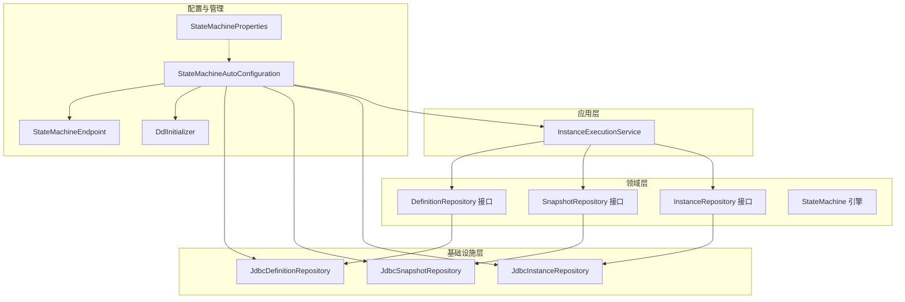
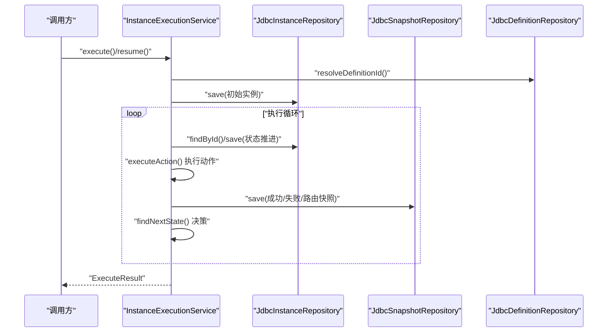
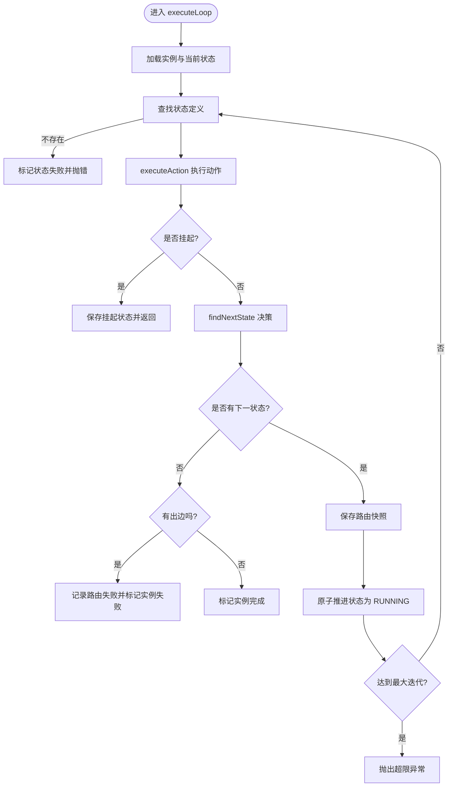
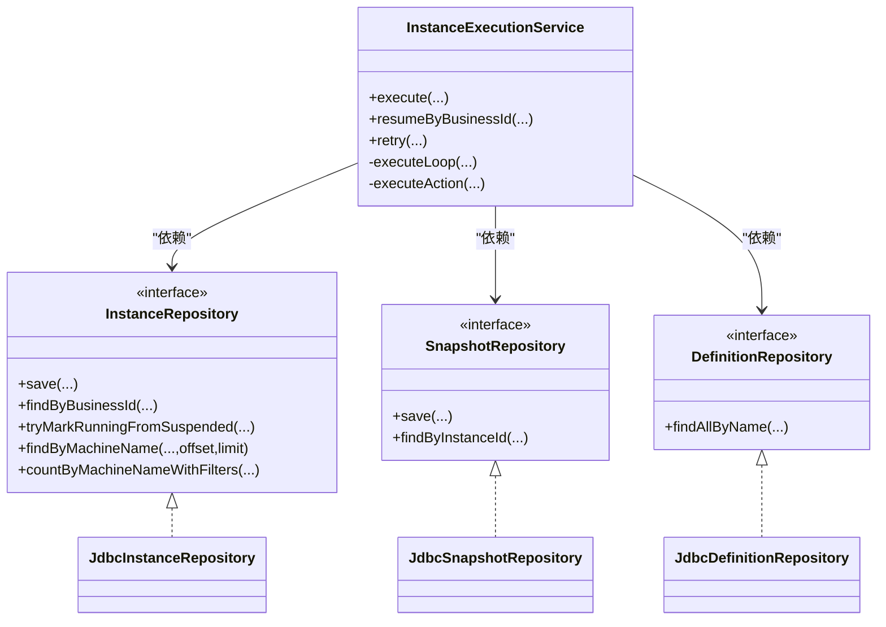

# 性能优化与资源管理

<cite>
**本文引用的文件**
- [InstanceExecutionService.java](file://state-machine-boot-starter/src/main/java/cn/chedejun/statemachine/application/InstanceExecutionService.java)
- [JdbcInstanceRepository.java](file://state-machine-boot-starter/src/main/java/cn/chedejun/statemachine/infrastructure/persistence/JdbcInstanceRepository.java)
- [JdbcDefinitionRepository.java](file://state-machine-boot-starter/src/main/java/cn/chedejun/statemachine/infrastructure/persistence/JdbcDefinitionRepository.java)
- [JdbcSnapshotRepository.java](file://state-machine-boot-starter/src/main/java/cn/chedejun/statemachine/infrastructure/persistence/JdbcSnapshotRepository.java)
- [InstanceRepository.java](file://state-machine-boot-starter/src/main/java/cn/chedejun/statemachine/domain/repository/InstanceRepository.java)
- [SnapshotRepository.java](file://state-machine-boot-starter/src/main/java/cn/chedejun/statemachine/domain/repository/SnapshotRepository.java)
- [DefinitionRepository.java](file://state-machine-boot-starter/src/main/java/cn/chedejun/statemachine/domain/repository/DefinitionRepository.java)
- [StateMachineAutoConfiguration.java](file://state-machine-boot-starter/src/main/java/cn/chedejun/statemachine/autoconfigure/StateMachineAutoConfiguration.java)
- [StateMachineProperties.java](file://state-machine-boot-starter/src/main/java/cn/chedejun/statemachine/autoconfigure/StateMachineProperties.java)
- [DdlInitializer.java](file://state-machine-boot-starter/src/main/java/cn/chedejun/statemachine/persistence/DdlInitializer.java)
- [mysql.sql](file://state-machine-boot-starter/src/main/resources/ddl/mysql.sql)
- [StateMachineIntegrationTest.java](file://state-machine-boot-starter/src/test/java/cn/chedejun/statemachine/integration/StateMachineIntegrationTest.java)
- [application.yml](file://state-machine-boot-starter/src/test/resources/application.yml)
- [StateMachineEndpoint.java](file://state-machine-boot-starter/src/main/java/cn/chedejun/statemachine/management/StateMachineEndpoint.java)
</cite>

## 目录
1. [引言](#引言)
2. [项目结构](#项目结构)
3. [核心组件](#核心组件)
4. [架构总览](#架构总览)
5. [详细组件分析](#详细组件分析)
6. [依赖分析](#依赖分析)
7. [性能考量](#性能考量)
8. [故障排查指南](#故障排查指南)
9. [结论](#结论)
10. [附录](#附录)

## 引言
本指南聚焦于状态机执行引擎在高并发、大数据量场景下的性能优化与资源管理。围绕执行服务的执行循环效率、内存管理、JDBC 仓储层的连接池与 SQL 优化、状态机实例生命周期与资源回收、并发执行的线程池与锁优化、分页与批量处理策略、内存使用优化、监控指标与性能测试方法，以及扩展性与负载均衡设计，提供系统化的专业建议。

## 项目结构
该项目采用 Spring Boot 自动装配与 JDBC 仓储模式，核心模块如下：
- 应用层：执行服务负责状态机实例的启动、执行循环、重试与恢复。
- 领域层：状态机定义、实例、快照的数据模型与状态机引擎。
- 基础设施层：基于 JdbcTemplate 的 JDBC 仓储实现。
- 自动装配与配置：自动注入仓储、注册状态机、暴露管理端点与控制台。
- 测试与资源：集成测试、DDL 初始化脚本与示例配置。

**图表来源**
- [StateMachineAutoConfiguration.java:32-149](file://state-machine-boot-starter/src/main/java/cn/chedejun/statemachine/autoconfigure/StateMachineAutoConfiguration.java#L32-L149)
- [InstanceExecutionService.java:25-41](file://state-machine-boot-starter/src/main/java/cn/chedejun/statemachine/application/InstanceExecutionService.java#L25-L41)
- [JdbcInstanceRepository.java:16-20](file://state-machine-boot-starter/src/main/java/cn/chedejun/statemachine/infrastructure/persistence/JdbcInstanceRepository.java#L16-L20)
- [JdbcSnapshotRepository.java:18-23](file://state-machine-boot-starter/src/main/java/cn/chedejun/statemachine/infrastructure/persistence/JdbcSnapshotRepository.java#L18-L23)
- [JdbcDefinitionRepository.java:18-27](file://state-machine-boot-starter/src/main/java/cn/chedejun/statemachine/infrastructure/persistence/JdbcDefinitionRepository.java#L18-L27)
- [DdlInitializer.java:11-45](file://state-machine-boot-starter/src/main/java/cn/chedejun/statemachine/persistence/DdlInitializer.java#L11-L45)
- [StateMachineEndpoint.java:22-38](file://state-machine-boot-starter/src/main/java/cn/chedejun/statemachine/management/StateMachineEndpoint.java#L22-L38)

**章节来源**
- [StateMachineAutoConfiguration.java:32-149](file://state-machine-boot-starter/src/main/java/cn/chedejun/statemachine/autoconfigure/StateMachineAutoConfiguration.java#L32-L149)
- [mysql.sql:1-19](file://state-machine-boot-starter/src/main/resources/ddl/mysql.sql#L1-L19)

## 核心组件
- 执行服务：负责实例创建、执行循环、动作执行与重试、路由决策、挂起/恢复、序列化/反序列化上下文。
- JDBC 仓储：封装实例、快照、定义的持久化与查询，支持分页、过滤、计数与 UPSERT。
- 自动装配：按数据源条件加载仓储、注册状态机、暴露管理端点与控制台。
- 配置属性：重试策略默认参数、管理端点与控制台开关。
- DDL 初始化：根据数据源类型选择对应 SQL 脚本进行表初始化。

**章节来源**
- [InstanceExecutionService.java:25-41](file://state-machine-boot-starter/src/main/java/cn/chedejun/statemachine/application/InstanceExecutionService.java#L25-L41)
- [JdbcInstanceRepository.java:16-20](file://state-machine-boot-starter/src/main/java/cn/chedejun/statemachine/infrastructure/persistence/JdbcInstanceRepository.java#L16-L20)
- [JdbcSnapshotRepository.java:18-23](file://state-machine-boot-starter/src/main/java/cn/chedejun/statemachine/infrastructure/persistence/JdbcSnapshotRepository.java#L18-L23)
- [JdbcDefinitionRepository.java:18-27](file://state-machine-boot-starter/src/main/java/cn/chedejun/statemachine/infrastructure/persistence/JdbcDefinitionRepository.java#L18-L27)
- [StateMachineAutoConfiguration.java:32-149](file://state-machine-boot-starter/src/main/java/cn/chedejun/statemachine/autoconfigure/StateMachineAutoConfiguration.java#L32-L149)
- [StateMachineProperties.java:6-42](file://state-machine-boot-starter/src/main/java/cn/chedejun/statemachine/autoconfigure/StateMachineProperties.java#L6-L42)
- [DdlInitializer.java:11-66](file://state-machine-boot-starter/src/main/java/cn/chedejun/statemachine/persistence/DdlInitializer.java#L11-L66)

## 架构总览
下图展示执行服务与仓储层的交互流程，以及管理端点对实例与定义的读取。

**图表来源**
- [InstanceExecutionService.java:43-193](file://state-machine-boot-starter/src/main/java/cn/chedejun/statemachine/application/InstanceExecutionService.java#L43-L193)
- [JdbcInstanceRepository.java:47-87](file://state-machine-boot-starter/src/main/java/cn/chedejun/statemachine/infrastructure/persistence/JdbcInstanceRepository.java#L47-L87)
- [JdbcSnapshotRepository.java:33-51](file://state-machine-boot-starter/src/main/java/cn/chedejun/statemachine/infrastructure/persistence/JdbcSnapshotRepository.java#L33-L51)
- [JdbcDefinitionRepository.java:29-74](file://state-machine-boot-starter/src/main/java/cn/chedejun/statemachine/infrastructure/persistence/JdbcDefinitionRepository.java#L29-L74)

## 详细组件分析

### 执行服务：执行循环与重试优化
- 循环上限：基于状态数与最大重试次数计算最大迭代次数，防止无限循环。
- 动作执行：捕获异常并记录失败快照；根据重试策略延迟后重试；超过阈值则标记失败。
- 路由与状态推进：保存路由快照，原子更新实例状态为 RUNNING 并推进到下一状态。
- 挂起与恢复：CAS 原子更新状态为 RUNNING 并切换当前状态，避免并发竞争。
- 上下文序列化：统一使用 ObjectMapper 进行 JSON 序列化/反序列化，失败时降级为空对象。

优化要点
- 减少 N+1 查询：重试次数直接从当前实例推导，避免重复查询快照统计。
- 原子更新：实例状态推进与 CAS 更新结合，减少锁竞争。
- 及时退出：无可用路由且无出边时直接完成，避免无效迭代。

**章节来源**
- [InstanceExecutionService.java:158-193](file://state-machine-boot-starter/src/main/java/cn/chedejun/statemachine/application/InstanceExecutionService.java#L158-L193)
- [InstanceExecutionService.java:200-237](file://state-machine-boot-starter/src/main/java/cn/chedejun/statemachine/application/InstanceExecutionService.java#L200-L237)
- [InstanceExecutionService.java:119-152](file://state-machine-boot-starter/src/main/java/cn/chedejun/statemachine/application/InstanceExecutionService.java#L119-L152)
- [InstanceExecutionService.java:247-260](file://state-machine-boot-starter/src/main/java/cn/chedejun/statemachine/application/InstanceExecutionService.java#L247-L260)

#### 执行循环流程图

**图表来源**
- [InstanceExecutionService.java:158-193](file://state-machine-boot-starter/src/main/java/cn/chedejun/statemachine/application/InstanceExecutionService.java#L158-L193)

### JDBC 仓储层：连接池与 SQL 优化
- 实例仓储
  - UPSERT：使用 INSERT ... ON DUPLICATE KEY UPDATE 或等效策略，避免“先查后写”的竞态。
  - 分页与过滤：动态拼接 WHERE 条件，支持按机器名、状态、业务 ID、实例 ID 过滤。
  - 计数：提供按机器名与状态计数接口，用于分页与监控。
- 快照仓储
  - JSON 字段适配：根据数据库类型设置 JSON/JSONB 列，避免 MySQL binary charset 问题。
  - 查询排序：按执行时间与尝试次数排序，便于重试与审计。
- 定义仓储
  - JSON 字段适配：同上。
  - 版本管理：按注册时间倒序列出版本，支持多版本定义。

SQL 优化建议
- 为实例表添加复合索引：(machine_name, status, created_at) 以加速分页与过滤。
- 为快照表添加索引：(instance_id, executed_at, attempt) 以加速查询与重试定位。
- 使用 LIMIT/OFFSET 时配合 ORDER BY 主键或时间戳，确保稳定性。
- 避免 SELECT *，仅查询必要字段，降低网络与解析开销。

**章节来源**
- [JdbcInstanceRepository.java:47-87](file://state-machine-boot-starter/src/main/java/cn/chedejun/statemachine/infrastructure/persistence/JdbcInstanceRepository.java#L47-L87)
- [JdbcInstanceRepository.java:97-134](file://state-machine-boot-starter/src/main/java/cn/chedejun/statemachine/infrastructure/persistence/JdbcInstanceRepository.java#L97-L134)
- [JdbcSnapshotRepository.java:33-51](file://state-machine-boot-starter/src/main/java/cn/chedejun/statemachine/infrastructure/persistence/JdbcSnapshotRepository.java#L33-L51)
- [JdbcDefinitionRepository.java:29-74](file://state-machine-boot-starter/src/main/java/cn/chedejun/statemachine/infrastructure/persistence/JdbcDefinitionRepository.java#L29-L74)
- [mysql.sql:1-19](file://state-machine-boot-starter/src/main/resources/ddl/mysql.sql#L1-L19)

### 状态机实例生命周期与资源回收
- 生命周期阶段：创建 -> RUNNING -> 执行中 -> COMPLETED/FAILED/SUSPENDED。
- 资源回收
  - 上下文对象：执行完成后可交由 GC 回收；避免在上下文中持有大对象引用。
  - 快照数据：定期归档/清理历史快照，控制快照表增长。
  - 实例元数据：已完成或失败的实例可按策略归档或删除，释放存储空间。
- 并发安全
  - 使用 CAS 原子更新状态，避免多个执行器同时推进同一实例。
  - 在执行循环中尽量减少跨线程共享状态，降低锁粒度。

**章节来源**
- [InstanceExecutionService.java:119-152](file://state-machine-boot-starter/src/main/java/cn/chedejun/statemachine/application/InstanceExecutionService.java#L119-L152)
- [JdbcInstanceRepository.java:89-94](file://state-machine-boot-starter/src/main/java/cn/chedejun/statemachine/infrastructure/persistence/JdbcInstanceRepository.java#L89-L94)

### 并发执行：线程池与锁优化
- 线程池配置
  - 核心线程数：与 CPU 核心数匹配，兼顾 I/O 与计算任务。
  - 队列长度：使用有界队列，避免内存压力；结合拒绝策略（如记录日志并快速失败）。
  - 拒绝策略：记录告警并返回错误码，便于前端重试与限流。
- 锁优化
  - 尽量使用无锁数据结构或细粒度锁。
  - 在执行循环中避免长时间持锁，尽快提交事务并释放锁。
  - 对热点实例采用分区策略，降低单点竞争。

[本节为通用性能建议，不直接分析具体文件]

### 大数据量：分页与批量处理
- 分页查询
  - 使用 OFFSET/LIMIT 时，配合索引与稳定排序键，避免深分页导致的性能下降。
  - 提供游标式分页（基于最后一条记录的主键/时间戳）以提升性能。
- 批量处理
  - 批量插入/更新：使用 JDBC 批处理或数据库方言的批量语法。
  - 批量清理：按时间窗口或阈值定期清理历史数据，避免表膨胀。

**章节来源**
- [JdbcInstanceRepository.java:97-134](file://state-machine-boot-starter/src/main/java/cn/chedejun/statemachine/infrastructure/persistence/JdbcInstanceRepository.java#L97-L134)

### 内存使用优化：对象池化与缓存
- 对象池化
  - ObjectMapper 可复用，避免重复创建。
  - 上下文对象在状态间传递时避免深拷贝，必要时使用不可变对象。
- 缓存策略
  - 热点状态机定义可缓存于 JVM，结合 LRU 策略限制内存占用。
  - 快照查询结果短期缓存，但需考虑一致性与过期策略。
- 序列化优化
  - 控制上下文大小，避免在 JSON 中携带大数组或冗余字段。

**章节来源**
- [InstanceExecutionService.java:247-260](file://state-machine-boot-starter/src/main/java/cn/chedejun/statemachine/application/InstanceExecutionService.java#L247-L260)
- [JdbcDefinitionRepository.java:83-93](file://state-machine-boot-starter/src/main/java/cn/chedejun/statemachine/infrastructure/persistence/JdbcDefinitionRepository.java#L83-L93)
- [JdbcSnapshotRepository.java:63-71](file://state-machine-boot-starter/src/main/java/cn/chedejun/statemachine/infrastructure/persistence/JdbcSnapshotRepository.java#L63-L71)

### 监控指标与性能测试
- 指标建议
  - 执行吞吐：每秒实例数、每状态动作执行次数。
  - 延迟分布：99 分位执行时间、重试延迟分布。
  - 失败率：动作失败率、路由失败率、实例失败率。
  - 资源使用：CPU、内存、数据库连接池使用率、慢查询数。
- 性能测试
  - 基准测试：固定并发与数据规模，测量吞吐与延迟。
  - 压力测试：逐步增加并发，观察系统拐点与稳定性。
  - 场景回归：模拟失败重试、挂起恢复、多版本定义切换等场景。

[本节为通用性能建议，不直接分析具体文件]

### 扩展性与负载均衡
- 扩展性设计
  - 无状态执行器：执行器仅依赖数据库与缓存，支持水平扩展。
  - 实例分区：按业务 ID 或哈希分区，降低热点竞争。
- 负载均衡
  - 前置负载均衡器：轮询或基于健康检查的调度。
  - 限流与熔断：在网关层实施限流与熔断，保护后端。

[本节为通用性能建议，不直接分析具体文件]

## 依赖分析
执行服务与仓储层的依赖关系如下：

**图表来源**
- [InstanceExecutionService.java:25-41](file://state-machine-boot-starter/src/main/java/cn/chedejun/statemachine/application/InstanceExecutionService.java#L25-L41)
- [InstanceRepository.java:9-25](file://state-machine-boot-starter/src/main/java/cn/chedejun/statemachine/domain/repository/InstanceRepository.java#L9-L25)
- [SnapshotRepository.java:11-15](file://state-machine-boot-starter/src/main/java/cn/chedejun/statemachine/domain/repository/SnapshotRepository.java#L11-L15)
- [DefinitionRepository.java:9-15](file://state-machine-boot-starter/src/main/java/cn/chedejun/statemachine/domain/repository/DefinitionRepository.java#L9-L15)
- [JdbcInstanceRepository.java:16-20](file://state-machine-boot-starter/src/main/java/cn/chedejun/statemachine/infrastructure/persistence/JdbcInstanceRepository.java#L16-L20)
- [JdbcSnapshotRepository.java:18-23](file://state-machine-boot-starter/src/main/java/cn/chedejun/statemachine/infrastructure/persistence/JdbcSnapshotRepository.java#L18-L23)
- [JdbcDefinitionRepository.java:18-27](file://state-machine-boot-starter/src/main/java/cn/chedejun/statemachine/infrastructure/persistence/JdbcDefinitionRepository.java#L18-L27)

## 性能考量
- 执行循环效率
  - 通过最大迭代上限与早期退出避免无效循环。
  - 使用 CAS 原子推进状态，减少锁等待。
- 内存管理
  - 控制上下文大小，避免大对象驻留。
  - 快照与实例表定期清理，防止内存与磁盘压力。
- 数据库访问
  - UPSERT 与索引优化，减少锁冲突与扫描范围。
  - JSON 字段适配不同数据库类型，避免编码与类型问题。
- 并发与扩展
  - 无状态扩展与实例分区，结合限流与熔断保障稳定性。

**章节来源**
- [InstanceExecutionService.java:158-193](file://state-machine-boot-starter/src/main/java/cn/chedejun/statemachine/application/InstanceExecutionService.java#L158-L193)
- [JdbcInstanceRepository.java:47-87](file://state-machine-boot-starter/src/main/java/cn/chedejun/statemachine/infrastructure/persistence/JdbcInstanceRepository.java#L47-L87)
- [JdbcSnapshotRepository.java:33-51](file://state-machine-boot-starter/src/main/java/cn/chedejun/statemachine/infrastructure/persistence/JdbcSnapshotRepository.java#L33-L51)
- [JdbcDefinitionRepository.java:83-93](file://state-machine-boot-starter/src/main/java/cn/chedejun/statemachine/infrastructure/persistence/JdbcDefinitionRepository.java#L83-L93)

## 故障排查指南
- 常见问题
  - 实例状态异常：检查 CAS 更新是否成功，确认状态转换逻辑。
  - 快照缺失：核对路由快照与节点快照的区分，确保查询条件正确。
  - 数据库连接问题：检查连接池配置与慢查询日志。
- 排查步骤
  - 通过管理端点与控制台查看实例状态与快照详情。
  - 结合测试用例中的断言与日志输出定位问题。
  - 使用 DDL 初始化工具验证表结构与索引。

**章节来源**
- [StateMachineEndpoint.java:40-79](file://state-machine-boot-starter/src/main/java/cn/chedejun/statemachine/management/StateMachineEndpoint.java#L40-L79)
- [StateMachineIntegrationTest.java:195-222](file://state-machine-boot-starter/src/test/java/cn/chedejun/statemachine/integration/StateMachineIntegrationTest.java#L195-L222)
- [application.yml:1-14](file://state-machine-boot-starter/src/test/resources/application.yml#L1-L14)

## 结论
通过对执行服务执行循环的优化、仓储层的 SQL 与索引优化、生命周期与资源回收策略、并发与扩展设计的系统化改进，可在高并发与大数据量场景下显著提升状态机执行系统的性能与稳定性。建议结合监控指标与基准测试持续迭代优化，并在生产环境谨慎引入变更。

## 附录
- 自动装配与配置
  - 自动装配按数据源条件加载仓储与管理端点。
  - 配置属性提供重试策略默认值与功能开关。
- DDL 初始化
  - 根据数据源类型自动选择 SQL 脚本并初始化表结构。

**章节来源**
- [StateMachineAutoConfiguration.java:32-149](file://state-machine-boot-starter/src/main/java/cn/chedejun/statemachine/autoconfigure/StateMachineAutoConfiguration.java#L32-L149)
- [StateMachineProperties.java:6-42](file://state-machine-boot-starter/src/main/java/cn/chedejun/statemachine/autoconfigure/StateMachineProperties.java#L6-L42)
- [DdlInitializer.java:11-66](file://state-machine-boot-starter/src/main/java/cn/chedejun/statemachine/persistence/DdlInitializer.java#L11-L66)