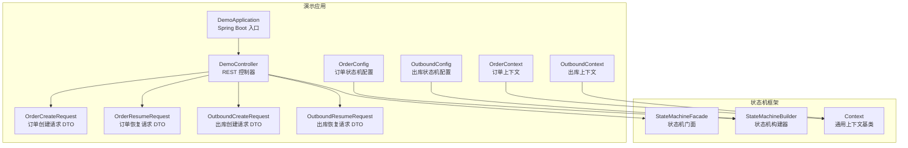
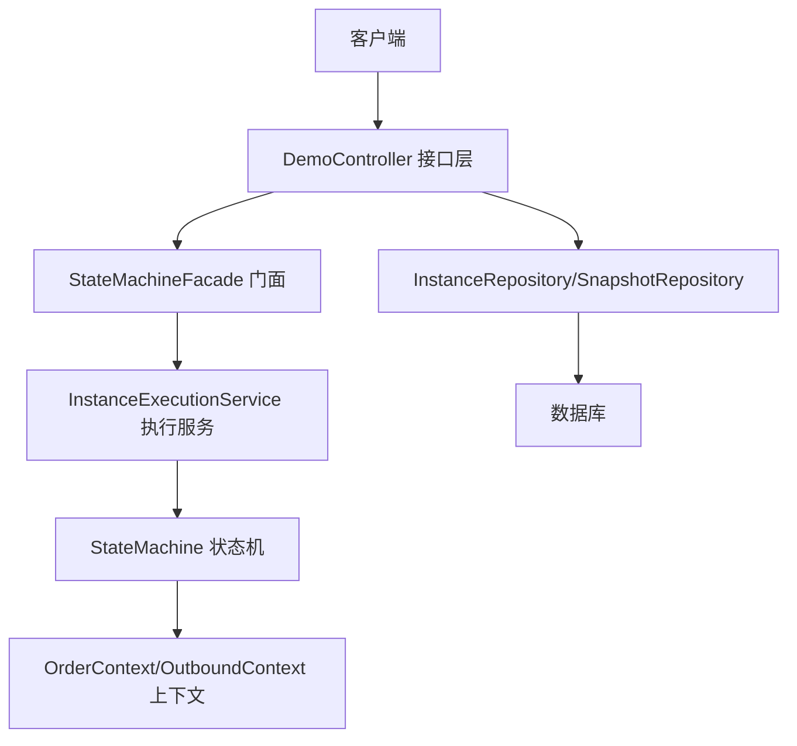
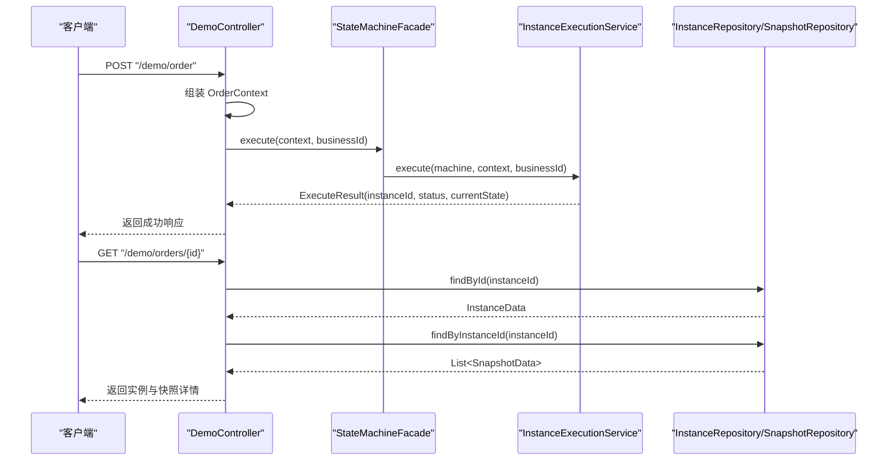
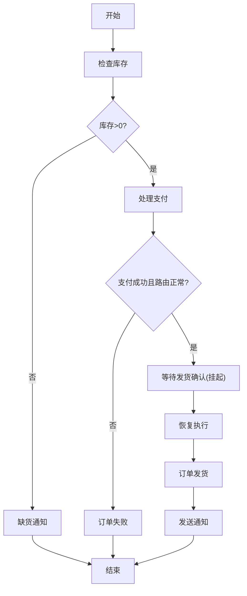
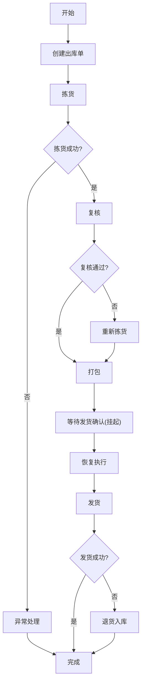
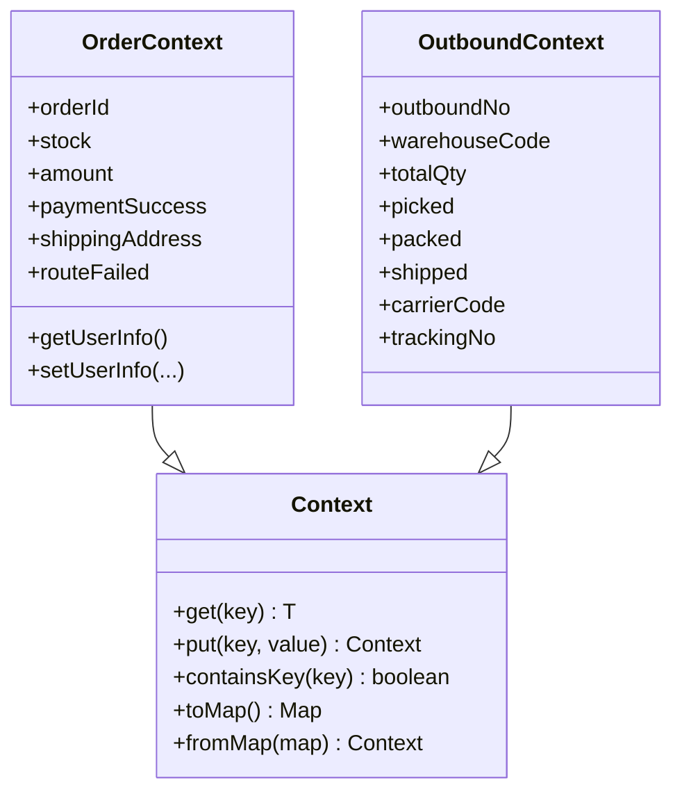
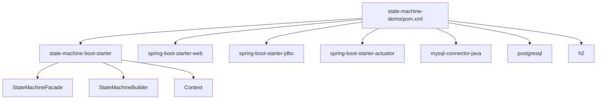

# 演示应用详解

<cite>
**本文引用的文件**
- [DemoApplication.java](file://state-machine-demo/src/main/java/cn/chedejun/demo/DemoApplication.java)
- [DemoController.java](file://state-machine-demo/src/main/java/cn/chedejun/demo/controller/DemoController.java)
- [OrderConfig.java](file://state-machine-demo/src/main/java/cn/chedejun/demo/config/OrderConfig.java)
- [OutboundConfig.java](file://state-machine-demo/src/main/java/cn/chedejun/demo/config/OutboundConfig.java)
- [OrderContext.java](file://state-machine-demo/src/main/java/cn/chedejun/demo/statemachine/OrderContext.java)
- [OutboundContext.java](file://state-machine-demo/src/main/java/cn/chedejun/demo/statemachine/OutboundContext.java)
- [OrderCreateRequest.java](file://state-machine-demo/src/main/java/cn/chedejun/demo/dto/OrderCreateRequest.java)
- [OrderResumeRequest.java](file://state-machine-demo/src/main/java/cn/chedejun/demo/dto/OrderResumeRequest.java)
- [OutboundCreateRequest.java](file://state-machine-demo/src/main/java/cn/chedejun/demo/dto/OutboundCreateRequest.java)
- [OutboundResumeRequest.java](file://state-machine-demo/src/main/java/cn/chedejun/demo/dto/OutboundResumeRequest.java)
- [application.yml](file://state-machine-demo/src/main/resources/application.yml)
- [pom.xml](file://state-machine-demo/pom.xml)
- [StateMachineFacade.java](file://state-machine-boot-starter/src/main/java/cn/chedejun/statemachine/interfaces/StateMachineFacade.java)
- [StateMachineBuilder.java](file://state-machine-boot-starter/src/main/java/cn/chedejun/statemachine/core/StateMachineBuilder.java)
- [Context.java](file://state-machine-boot-starter/src/main/java/cn/chedejun/statemachine/core/Context.java)
</cite>

## 目录
1. [简介](#简介)
2. [项目结构](#项目结构)
3. [核心组件](#核心组件)
4. [架构总览](#架构总览)
5. [详细组件分析](#详细组件分析)
6. [依赖分析](#依赖分析)
7. [性能考虑](#性能考虑)
8. [故障排查指南](#故障排查指南)
9. [结论](#结论)
10. [附录](#附录)

## 简介
本演示应用基于状态机框架与 Spring Boot 集成，展示了两个典型业务流程的状态机实现：订单处理与出库管理。应用通过 REST 接口提供订单创建、出库处理、状态查询、恢复执行与重试等能力，并内置控制台与监控端点，便于调试与运维。

## 项目结构
演示应用位于 state-machine-demo 模块，采用分层组织：
- config：状态机配置 Bean，定义状态、转换与重试策略
- controller：REST 控制器，暴露 HTTP 接口
- dto：请求 DTO，封装入参
- statemachine：上下文类，承载业务状态与数据
- resources：应用配置与静态页面

图表来源
- [DemoApplication.java:1-12](file://state-machine-demo/src/main/java/cn/chedejun/demo/DemoApplication.java#L1-L12)
- [DemoController.java:1-345](file://state-machine-demo/src/main/java/cn/chedejun/demo/controller/DemoController.java#L1-L345)
- [OrderConfig.java:1-95](file://state-machine-demo/src/main/java/cn/chedejun/demo/config/OrderConfig.java#L1-L95)
- [OutboundConfig.java:1-130](file://state-machine-demo/src/main/java/cn/chedejun/demo/config/OutboundConfig.java#L1-L130)
- [OrderContext.java:1-99](file://state-machine-demo/src/main/java/cn/chedejun/demo/statemachine/OrderContext.java#L1-L99)
- [OutboundContext.java:1-43](file://state-machine-demo/src/main/java/cn/chedejun/demo/statemachine/OutboundContext.java#L1-L43)
- [OrderCreateRequest.java:1-26](file://state-machine-demo/src/main/java/cn/chedejun/demo/dto/OrderCreateRequest.java#L1-L26)
- [OrderResumeRequest.java:1-26](file://state-machine-demo/src/main/java/cn/chedejun/demo/dto/OrderResumeRequest.java#L1-L26)
- [OutboundCreateRequest.java:1-26](file://state-machine-demo/src/main/java/cn/chedejun/demo/dto/OutboundCreateRequest.java#L1-L26)
- [OutboundResumeRequest.java:1-26](file://state-machine-demo/src/main/java/cn/chedejun/demo/dto/OutboundResumeRequest.java#L1-L26)
- [StateMachineFacade.java:1-52](file://state-machine-boot-starter/src/main/java/cn/chedejun/statemachine/interfaces/StateMachineFacade.java#L1-L52)
- [StateMachineBuilder.java:1-52](file://state-machine-boot-starter/src/main/java/cn/chedejun/statemachine/core/StateMachineBuilder.java#L1-L52)
- [Context.java:1-24](file://state-machine-boot-starter/src/main/java/cn/chedejun/statemachine/core/Context.java#L1-L24)

章节来源
- [pom.xml:1-86](file://state-machine-demo/pom.xml#L1-L86)
- [application.yml:1-27](file://state-machine-demo/src/main/resources/application.yml#L1-L27)

## 核心组件
- DemoApplication：Spring Boot 启动入口，启用自动装配
- DemoController：提供订单与出库两类 REST 接口，封装状态机执行、查询、恢复与重试
- OrderConfig/OutboundConfig：定义状态机名称、状态、条件转换、挂起点与重试策略
- OrderContext/OutboundContext：承载业务上下文数据，扩展通用 Context
- DTO：封装请求参数，保证接口入参清晰
- StateMachineFacade：状态机门面，委托执行服务进行执行、重试与恢复

章节来源
- [DemoApplication.java:1-12](file://state-machine-demo/src/main/java/cn/chedejun/demo/DemoApplication.java#L1-L12)
- [DemoController.java:1-345](file://state-machine-demo/src/main/java/cn/chedejun/demo/controller/DemoController.java#L1-L345)
- [OrderConfig.java:1-95](file://state-machine-demo/src/main/java/cn/chedejun/demo/config/OrderConfig.java#L1-L95)
- [OutboundConfig.java:1-130](file://state-machine-demo/src/main/java/cn/chedejun/demo/config/OutboundConfig.java#L1-L130)
- [OrderContext.java:1-99](file://state-machine-demo/src/main/java/cn/chedejun/demo/statemachine/OrderContext.java#L1-L99)
- [OutboundContext.java:1-43](file://state-machine-demo/src/main/java/cn/chedejun/demo/statemachine/OutboundContext.java#L1-L43)
- [OrderCreateRequest.java:1-26](file://state-machine-demo/src/main/java/cn/chedejun/demo/dto/OrderCreateRequest.java#L1-L26)
- [OrderResumeRequest.java:1-26](file://state-machine-demo/src/main/java/cn/chedejun/demo/dto/OrderResumeRequest.java#L1-L26)
- [OutboundCreateRequest.java:1-26](file://state-machine-demo/src/main/java/cn/chedejun/demo/dto/OutboundCreateRequest.java#L1-L26)
- [OutboundResumeRequest.java:1-26](file://state-machine-demo/src/main/java/cn/chedejun/demo/dto/OutboundResumeRequest.java#L1-L26)
- [StateMachineFacade.java:1-52](file://state-machine-boot-starter/src/main/java/cn/chedejun/statemachine/interfaces/StateMachineFacade.java#L1-L52)

## 架构总览
演示应用以 Spring Boot 为运行容器，通过状态机框架提供的自动配置与门面接口，将业务状态机与控制器解耦。控制器仅负责请求解析、调用状态机并返回结果；状态机配置在配置类中声明，构建器负责组装状态与转换；上下文类承载业务数据，支持扩展字段与嵌套对象。

图表来源
- [DemoController.java:1-345](file://state-machine-demo/src/main/java/cn/chedejun/demo/controller/DemoController.java#L1-L345)
- [StateMachineFacade.java:1-52](file://state-machine-boot-starter/src/main/java/cn/chedejun/statemachine/interfaces/StateMachineFacade.java#L1-L52)
- [OrderConfig.java:1-95](file://state-machine-demo/src/main/java/cn/chedejun/demo/config/OrderConfig.java#L1-L95)
- [OutboundConfig.java:1-130](file://state-machine-demo/src/main/java/cn/chedejun/demo/config/OutboundConfig.java#L1-L130)
- [OrderContext.java:1-99](file://state-machine-demo/src/main/java/cn/chedejun/demo/statemachine/OrderContext.java#L1-L99)
- [OutboundContext.java:1-43](file://state-machine-demo/src/main/java/cn/chedejun/demo/statemachine/OutboundContext.java#L1-L43)

## 详细组件分析

### DemoApplication 启动配置与 Spring Boot 集成
- 使用注解启用 Spring Boot 自动装配，作为应用入口
- 通过 Maven 依赖引入状态机 Starter 与 Web、JDBC、Actuator 等起步依赖
- application.yml 提供端口、上下文路径、数据源与状态机管理控制台配置

章节来源
- [DemoApplication.java:1-12](file://state-machine-demo/src/main/java/cn/chedejun/demo/DemoApplication.java#L1-L12)
- [pom.xml:1-86](file://state-machine-demo/pom.xml#L1-L86)
- [application.yml:1-27](file://state-machine-demo/src/main/resources/application.yml#L1-L27)

### DemoController HTTP 接口设计
- 订单相关接口
  - POST /demo/order：创建订单实例，生成业务 ID，填充上下文并执行状态机
  - POST /demo/order/resume：按业务 ID 与期望状态恢复挂起实例
  - GET /demo/orders：分页查询最近订单实例
  - GET /demo/orders/{id}：查看订单实例详情与快照
  - POST /demo/orders/{id}/retry：对失败实例发起重试
- 出库相关接口
  - POST /demo/outbound：创建出库实例，生成出库单号，填充上下文并执行状态机
  - POST /demo/outbound/resume：按业务 ID 与期望状态恢复挂起实例
  - GET /demo/outbounds：分页查询最近出库实例
  - GET /demo/outbounds/{id}：查看出库实例详情与快照
  - POST /demo/outbounds/{id}/retry：对失败实例发起重试
- 错误处理：捕获状态机异常，返回结构化错误信息与堆栈

图表来源
- [DemoController.java:1-345](file://state-machine-demo/src/main/java/cn/chedejun/demo/controller/DemoController.java#L1-L345)
- [StateMachineFacade.java:1-52](file://state-machine-boot-starter/src/main/java/cn/chedejun/statemachine/interfaces/StateMachineFacade.java#L1-L52)

章节来源
- [DemoController.java:1-345](file://state-machine-demo/src/main/java/cn/chedejun/demo/controller/DemoController.java#L1-L345)

### 订单状态机 OrderConfig 设计与实现
- 状态定义
  - check-inventory：校验库存
  - process-payment：处理支付（带失败概率）
  - await-ship-confirm：挂起点，等待恢复
  - ship-order：发货
  - send-notification：发送通知
  - notify-shortage：缺货通知
  - order-failed：失败处理
- 转换规则
  - 库存充足进入支付，否则进入缺货通知
  - 支付成功且路由未失败进入等待发货确认，否则进入失败
  - 确认后进入发货，再进入通知
- 重试策略：指数回退，最大重试次数与延迟上限
- 挂起点：await-ship-confirm，可通过业务 ID 与期望状态恢复

图表来源
- [OrderConfig.java:1-95](file://state-machine-demo/src/main/java/cn/chedejun/demo/config/OrderConfig.java#L1-L95)

章节来源
- [OrderConfig.java:1-95](file://state-machine-demo/src/main/java/cn/chedejun/demo/config/OrderConfig.java#L1-L95)

### 出库状态机 OutboundConfig 设计与实现
- 状态定义
  - create：创建出库单
  - pick：拣货（带失败概率）
  - check：复核（可能退回重新拣货）
  - pack：打包
  - wait-ship-confirm：挂起点，等待恢复
  - ship：发货（带失败概率）
  - complete：完成
  - handle-exception：异常处理
  - re-pick：重新拣货
  - return-inbound：退货入库
- 转换规则
  - 拣货成功进入复核，失败进入异常处理
  - 复核通过进入打包，不通过退回重新拣货
  - 打包后进入等待发货确认，恢复后进入发货
  - 发货成功完成，失败进入退货入库
- 重试策略：指数回退，最大重试次数与延迟上限
- 挂起点：wait-ship-confirm，可通过业务 ID 与期望状态恢复

图表来源
- [OutboundConfig.java:1-130](file://state-machine-demo/src/main/java/cn/chedejun/demo/config/OutboundConfig.java#L1-L130)

章节来源
- [OutboundConfig.java:1-130](file://state-machine-demo/src/main/java/cn/chedejun/demo/config/OutboundConfig.java#L1-L130)

### DTO 数据传输对象设计
- 订单创建请求 OrderCreateRequest：stock、amount、address
- 订单恢复请求 OrderResumeRequest：businessId、expectedCurrentState、shippingAddress
- 出库创建请求 OutboundCreateRequest：warehouseCode、totalQty、carrierCode
- 出库恢复请求 OutboundResumeRequest：businessId、expectedCurrentState、carrierCode
- 设计要点：使用不可变字段构造，提供访问器，简化控制器参数绑定

章节来源
- [OrderCreateRequest.java:1-26](file://state-machine-demo/src/main/java/cn/chedejun/demo/dto/OrderCreateRequest.java#L1-L26)
- [OrderResumeRequest.java:1-26](file://state-machine-demo/src/main/java/cn/chedejun/demo/dto/OrderResumeRequest.java#L1-L26)
- [OutboundCreateRequest.java:1-26](file://state-machine-demo/src/main/java/cn/chedejun/demo/dto/OutboundCreateRequest.java#L1-L26)
- [OutboundResumeRequest.java:1-26](file://state-machine-demo/src/main/java/cn/chedejun/demo/dto/OutboundResumeRequest.java#L1-L26)

### 上下文类 OrderContext 与 OutboundContext
- OrderContext
  - 字段：orderId、stock、amount、paymentSuccess、shippingAddress、routeFailed
  - 扩展：UserInfo 嵌套对象、额外字符串与列表字段
  - 用途：承载订单生命周期中的关键数据与扩展属性
- OutboundContext
  - 字段：outboundNo、warehouseCode、totalQty、picked、packed、shipped、carrierCode、trackingNo
  - 用途：承载出库单生命周期中的关键数据与状态标记
- 通用基类：Context 提供键值存储与 Map 转换能力，便于序列化与扩展

图表来源
- [OrderContext.java:1-99](file://state-machine-demo/src/main/java/cn/chedejun/demo/statemachine/OrderContext.java#L1-L99)
- [OutboundContext.java:1-43](file://state-machine-demo/src/main/java/cn/chedejun/demo/statemachine/OutboundContext.java#L1-L43)
- [Context.java:1-24](file://state-machine-boot-starter/src/main/java/cn/chedejun/statemachine/core/Context.java#L1-L24)

章节来源
- [OrderContext.java:1-99](file://state-machine-demo/src/main/java/cn/chedejun/demo/statemachine/OrderContext.java#L1-L99)
- [OutboundContext.java:1-43](file://state-machine-demo/src/main/java/cn/chedejun/demo/statemachine/OutboundContext.java#L1-L43)
- [Context.java:1-24](file://state-machine-boot-starter/src/main/java/cn/chedejun/statemachine/core/Context.java#L1-L24)

### 请求与响应示例（路径指引）
- 创建订单
  - 请求：POST /state-machine-demo3/demo/order
  - 示例入参：{"stock": 10, "amount": 99.99, "address": "北京市朝阳区"}
  - 成功响应字段：success、orderId、instanceId、status、currentState、message
  - 失败响应字段：success=false、status、message、stackTrace
- 恢复订单
  - 请求：POST /state-machine-demo3/demo/order/resume
  - 示例入参：{"businessId": "...", "expectedCurrentState": "await-ship-confirm", "shippingAddress": "北京市朝阳区"}
  - 成功响应字段：success、businessId、message
- 查询订单列表
  - 请求：GET /state-machine-demo3/demo/orders?limit=10
  - 响应字段：id、businessId、status、currentState、retryCount、errorMessage、createdAt
- 订单详情
  - 请求：GET /state-machine-demo3/demo/orders/{id}
  - 响应字段：instance（id、status、businessId）、snapshots（stateName、status、attempt、executedAt、errorMessage）
- 重试订单
  - 请求：POST /state-machine-demo3/demo/orders/{id}/retry
  - 响应字段：message（含当前状态）
- 创建出库单
  - 请求：POST /state-machine-demo3/demo/outbound
  - 示例入参：{"warehouseCode": "WH01", "totalQty": 100, "carrierCode": "SF"}
  - 成功响应字段：success、outboundNo、instanceId、status、currentState、message
- 恢复出库单
  - 请求：POST /state-machine-demo3/demo/outbound/resume
  - 示例入参：{"businessId": "...", "expectedCurrentState": "wait-ship-confirm", "carrierCode": "SF"}
- 查询出库列表
  - 请求：GET /state-machine-demo3/demo/outbounds?limit=10
  - 响应字段：id、businessId、status、currentState、retryCount、errorMessage、createdAt
- 出库详情
  - 请求：GET /state-machine-demo3/demo/outbounds/{id}
  - 响应字段：instance、snapshots
- 重试出库
  - 请求：POST /state-machine-demo3/demo/outbounds/{id}/retry
  - 响应字段：message（含当前状态）

章节来源
- [DemoController.java:1-345](file://state-machine-demo/src/main/java/cn/chedejun/demo/controller/DemoController.java#L1-L345)
- [application.yml:1-27](file://state-machine-demo/src/main/resources/application.yml#L1-L27)

## 依赖分析
- 模块依赖
  - state-machine-demo 依赖 state-machine-boot-starter、Spring Web、JDBC、Actuator
  - Starter 提供状态机自动配置、门面、构建器与持久化初始化
- 运行时依赖
  - MySQL/PostgreSQL/H2 驱动，用于不同环境下的数据库选择
- 关键接口契约
  - StateMachineFacade.execute/retry/resumeByBusinessId 签名稳定，便于升级与替换实现

图表来源
- [pom.xml:1-86](file://state-machine-demo/pom.xml#L1-L86)
- [StateMachineFacade.java:1-52](file://state-machine-boot-starter/src/main/java/cn/chedejun/statemachine/interfaces/StateMachineFacade.java#L1-L52)
- [StateMachineBuilder.java:1-52](file://state-machine-boot-starter/src/main/java/cn/chedejun/statemachine/core/StateMachineBuilder.java#L1-L52)
- [Context.java:1-24](file://state-machine-boot-starter/src/main/java/cn/chedejun/statemachine/core/Context.java#L1-L24)

章节来源
- [pom.xml:1-86](file://state-machine-demo/pom.xml#L1-L86)

## 性能考虑
- 重试策略：指数回退可降低瞬时压力，建议结合业务峰值与下游限流策略调整最大尝试次数与延迟上限
- 并发执行：状态机实例独立执行，注意数据库连接池与事务隔离级别配置
- 监控与日志：开启 Actuator 端点与 JDBC 日志，有助于定位慢查询与异常
- 数据库 DDL：根据环境设置 ddl-auto，开发环境可 update，生产环境建议手动迁移

## 故障排查指南
- 状态机异常
  - 控制器捕获 StateMachineException，返回错误码与堆栈信息，便于前端与运维定位
- 常见问题
  - 缺少必填参数：如 businessId 或 expectedCurrentState，接口会返回明确提示
  - 恢复状态不匹配：expectedCurrentState 必须与实例当前状态一致
  - 数据库连接：检查 application.yml 中的数据库连接配置与驱动版本
- 调试工具
  - Actuator 端点：health、state-machines
  - 控制台：状态机管理控制台页面，查看实例与快照

章节来源
- [DemoController.java:1-345](file://state-machine-demo/src/main/java/cn/chedejun/demo/controller/DemoController.java#L1-L345)
- [application.yml:1-27](file://state-machine-demo/src/main/resources/application.yml#L1-L27)

## 结论
该演示应用通过清晰的分层与状态机配置，实现了订单与出库两条核心业务流程的自动化编排。控制器以最小职责封装状态机调用，配置类集中表达业务规则，上下文类承载数据与扩展能力。配合控制台与监控端点，具备良好的可观测性与可维护性。

## 附录

### 部署与运行指导
- 环境准备
  - JDK 8（项目编译目标为 1.8）
  - 数据库：MySQL/PostgreSQL/H2（测试可用 H2）
- 启动步骤
  - 配置 application.yml 中的数据库连接与端口
  - 打包：mvn clean package
  - 运行：java -jar target/*.jar
- 访问路径
  - 控制台：/console（若启用）
  - 接口：/state-machine-demo3/demo/*
  - 监控：/actuator/health、/actuator/state-machines

章节来源
- [application.yml:1-27](file://state-machine-demo/src/main/resources/application.yml#L1-L27)
- [pom.xml:1-86](file://state-machine-demo/pom.xml#L1-L86)