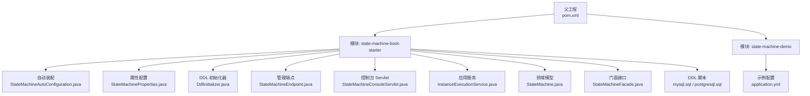
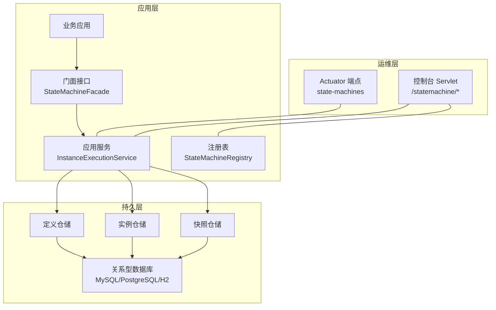
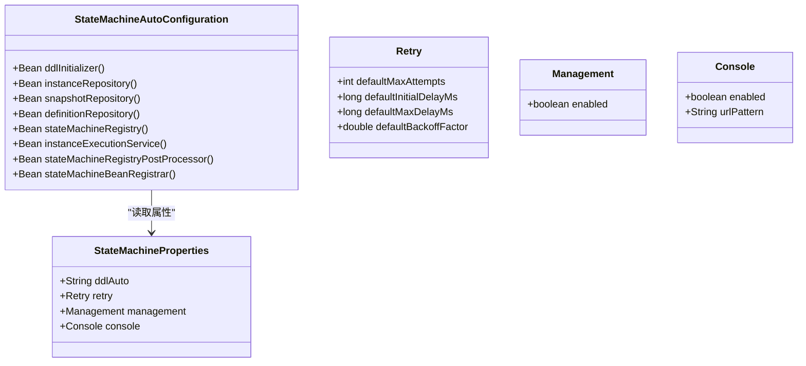
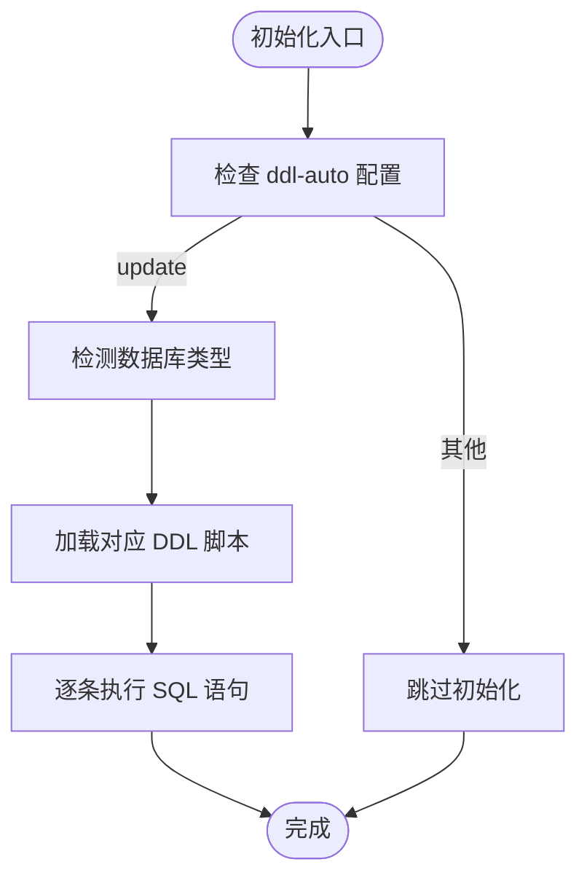
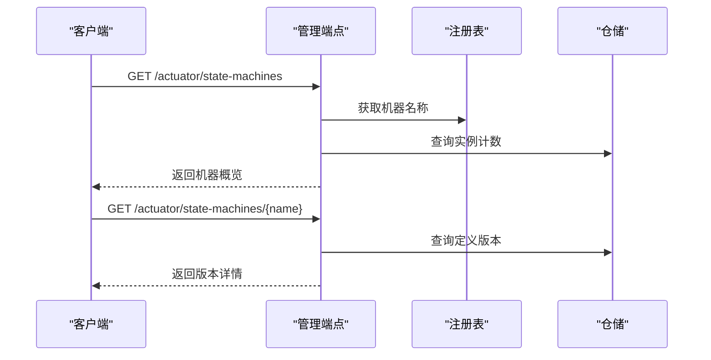
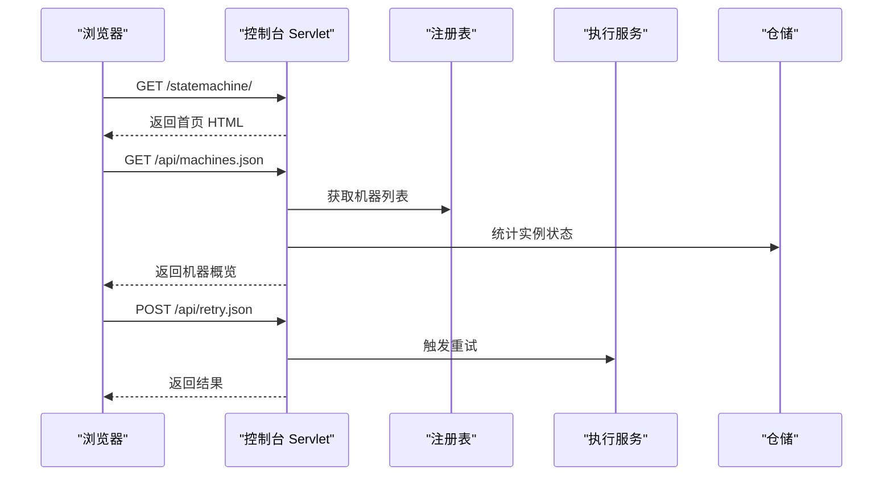
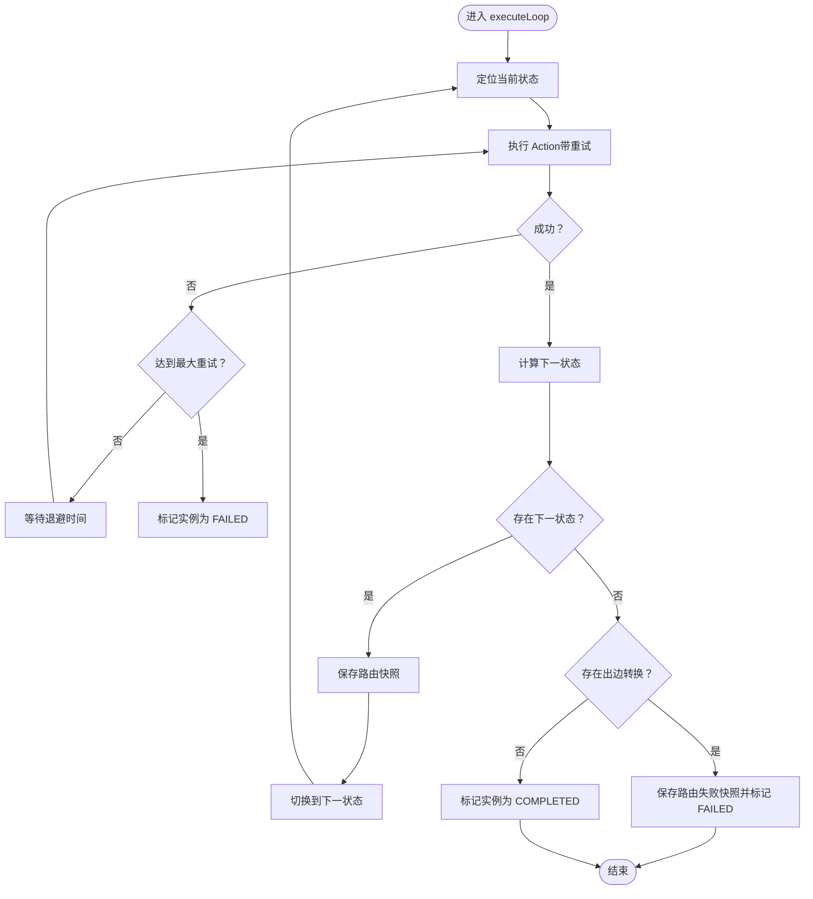
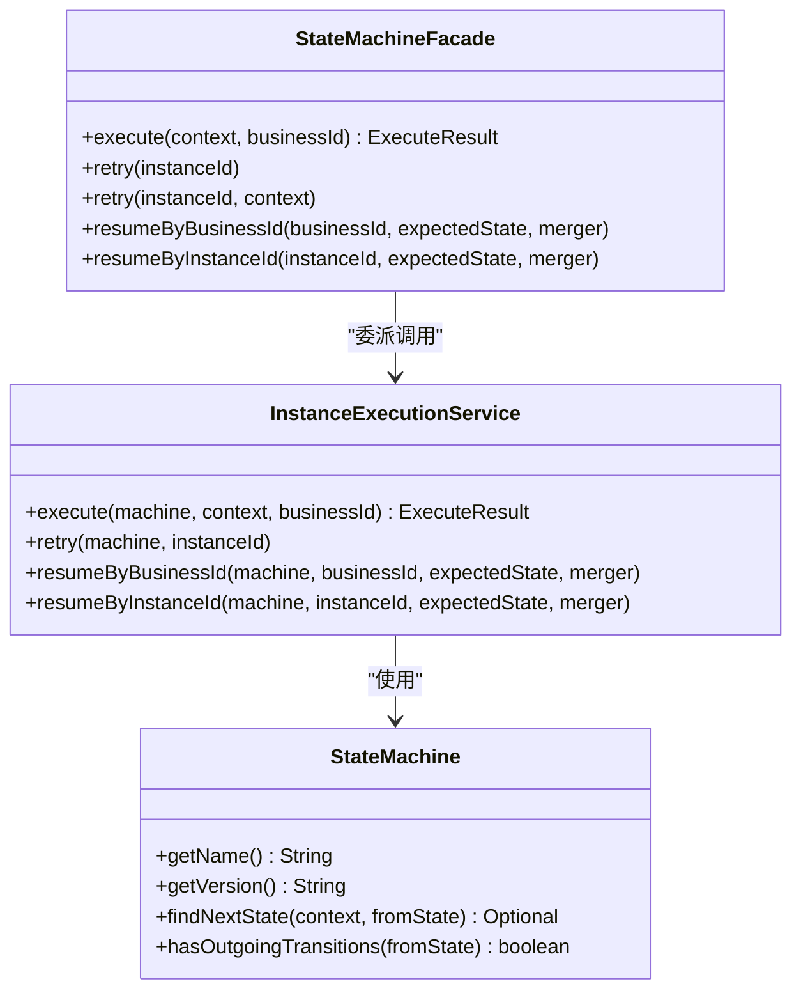
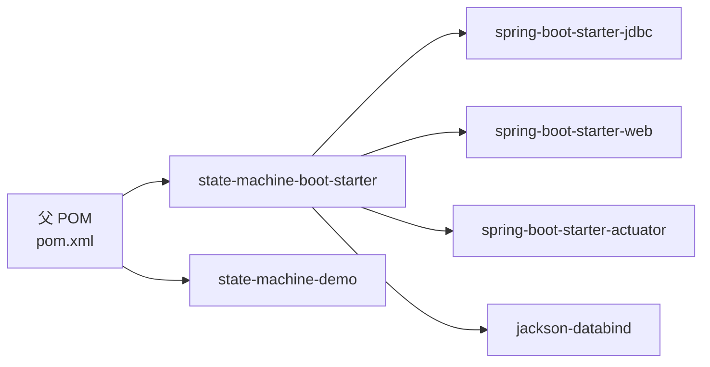

# 生产环境部署与运维

<cite>
**本文引用的文件**
- [pom.xml](file://pom.xml)
- [state-machine-boot-starter/src/main/java/cn/chedejun/statemachine/autoconfigure/StateMachineAutoConfiguration.java](file://state-machine-boot-starter/src/main/java/cn/chedejun/statemachine/autoconfigure/StateMachineAutoConfiguration.java)
- [state-machine-boot-starter/src/main/java/cn/chedejun/statemachine/autoconfigure/StateMachineProperties.java](file://state-machine-boot-starter/src/main/java/cn/chedejun/statemachine/autoconfigure/StateMachineProperties.java)
- [state-machine-boot-starter/src/main/java/cn/chedejun/statemachine/persistence/DdlInitializer.java](file://state-machine-boot-starter/src/main/java/cn/chedejun/statemachine/persistence/DdlInitializer.java)
- [state-machine-boot-starter/src/main/java/cn/chedejun/statemachine/management/StateMachineEndpoint.java](file://state-machine-boot-starter/src/main/java/cn/chedejun/statemachine/management/StateMachineEndpoint.java)
- [state-machine-boot-starter/src/main/java/cn/chedejun/statemachine/management/StateMachineConsoleServlet.java](file://state-machine-boot-starter/src/main/java/cn/chedejun/statemachine/management/StateMachineConsoleServlet.java)
- [state-machine-boot-starter/src/main/java/cn/chedejun/statemachine/application/InstanceExecutionService.java](file://state-machine-boot-starter/src/main/java/cn/chedejun/statemachine/application/InstanceExecutionService.java)
- [state-machine-boot-starter/src/main/java/cn/chedejun/statemachine/domain/engine/StateMachine.java](file://state-machine-boot-starter/src/main/java/cn/chedejun/statemachine/domain/engine/StateMachine.java)
- [state-machine-boot-starter/src/main/java/cn/chedejun/statemachine/interfaces/StateMachineFacade.java](file://state-machine-boot-starter/src/main/java/cn/chedejun/statemachine/interfaces/StateMachineFacade.java)
- [state-machine-boot-starter/src/main/resources/ddl/mysql.sql](file://state-machine-boot-starter/src/main/resources/ddl/mysql.sql)
- [state-machine-boot-starter/src/main/resources/ddl/postgresql.sql](file://state-machine-boot-starter/src/main/resources/ddl/postgresql.sql)
- [state-machine-boot-starter/src/test/resources/application.yml](file://state-machine-boot-starter/src/test/resources/application.yml)
- [state-machine-demo/src/main/resources/application.yml](file://state-machine-demo/src/main/resources/application.yml)
</cite>

## 目录
1. [简介](#简介)
2. [项目结构](#项目结构)
3. [核心组件](#核心组件)
4. [架构总览](#架构总览)
5. [详细组件分析](#详细组件分析)
6. [依赖关系分析](#依赖关系分析)
7. [性能考量](#性能考量)
8. [故障排查指南](#故障排查指南)
9. [结论](#结论)
10. [附录](#附录)

## 简介
本指南面向生产环境，围绕状态机引擎的部署与运维展开，覆盖以下主题：
- 部署架构与配置要求
- 数据库初始化脚本使用与版本管理策略
- 多环境配置管理（开发/测试/生产）
- 监控与日志集成（关键指标与故障排查）
- 容器化部署（Docker 与 Kubernetes）
- 高可用与容灾备份
- 安全加固（数据库连接与 API 访问控制）
- 运维自动化与流水线
- 不同规模企业部署建议与成本优化

## 项目结构
该项目采用 Maven 多模块结构，核心模块为状态机启动器与示例演示模块。Spring Boot 自动装配负责将状态机能力注入应用，同时提供管理端点与控制台。

图表来源
- [pom.xml:1-101](file://pom.xml#L1-L101)
- [state-machine-boot-starter/src/main/java/cn/chedejun/statemachine/autoconfigure/StateMachineAutoConfiguration.java:1-149](file://state-machine-boot-starter/src/main/java/cn/chedejun/statemachine/autoconfigure/StateMachineAutoConfiguration.java#L1-L149)
- [state-machine-boot-starter/src/main/java/cn/chedejun/statemachine/autoconfigure/StateMachineProperties.java:1-42](file://state-machine-boot-starter/src/main/java/cn/chedejun/statemachine/autoconfigure/StateMachineProperties.java#L1-L42)
- [state-machine-boot-starter/src/main/java/cn/chedejun/statemachine/persistence/DdlInitializer.java:1-66](file://state-machine-boot-starter/src/main/java/cn/chedejun/statemachine/persistence/DdlInitializer.java#L1-L66)
- [state-machine-boot-starter/src/main/java/cn/chedejun/statemachine/management/StateMachineEndpoint.java:1-80](file://state-machine-boot-starter/src/main/java/cn/chedejun/statemachine/management/StateMachineEndpoint.java#L1-L80)
- [state-machine-boot-starter/src/main/java/cn/chedejun/statemachine/management/StateMachineConsoleServlet.java:1-420](file://state-machine-boot-starter/src/main/java/cn/chedejun/statemachine/management/StateMachineConsoleServlet.java#L1-L420)
- [state-machine-boot-starter/src/main/java/cn/chedejun/statemachine/application/InstanceExecutionService.java:1-296](file://state-machine-boot-starter/src/main/java/cn/chedejun/statemachine/application/InstanceExecutionService.java#L1-L296)
- [state-machine-boot-starter/src/main/java/cn/chedejun/statemachine/domain/engine/StateMachine.java:1-77](file://state-machine-boot-starter/src/main/java/cn/chedejun/statemachine/domain/engine/StateMachine.java#L1-L77)
- [state-machine-boot-starter/src/main/java/cn/chedejun/statemachine/interfaces/StateMachineFacade.java:1-52](file://state-machine-boot-starter/src/main/java/cn/chedejun/statemachine/interfaces/StateMachineFacade.java#L1-L52)
- [state-machine-boot-starter/src/main/resources/ddl/mysql.sql:1-19](file://state-machine-boot-starter/src/main/resources/ddl/mysql.sql#L1-L19)
- [state-machine-boot-starter/src/main/resources/ddl/postgresql.sql:1-19](file://state-machine-boot-starter/src/main/resources/ddl/postgresql.sql#L1-L19)
- [state-machine-demo/src/main/resources/application.yml:1-27](file://state-machine-demo/src/main/resources/application.yml#L1-L27)

章节来源
- [pom.xml:1-101](file://pom.xml#L1-L101)
- [state-machine-demo/src/main/resources/application.yml:1-27](file://state-machine-demo/src/main/resources/application.yml#L1-L27)

## 核心组件
- 自动装配与属性
  - 自动装配类负责在存在数据源时创建仓储、注册表、执行服务与管理端点/控制台。
  - 属性类提供 DDL 自动化、重试策略默认值、管理端点开关与控制台开关及 URL 映射。
- DDL 初始化器
  - 根据数据源 URL 自动检测数据库类型，加载对应 DDL 并执行；支持回退至 H2。
- 管理端点与控制台
  - Actuator 端点暴露状态机清单、定义版本与实例统计；控制台提供 Web UI 与 REST API。
- 应用服务与领域模型
  - 应用服务封装执行、重试、恢复流程；领域模型承载状态机定义、路由与重试策略。
- 门面接口
  - 对外兼容门面，委托应用服务执行。

章节来源
- [state-machine-boot-starter/src/main/java/cn/chedejun/statemachine/autoconfigure/StateMachineAutoConfiguration.java:1-149](file://state-machine-boot-starter/src/main/java/cn/chedejun/statemachine/autoconfigure/StateMachineAutoConfiguration.java#L1-L149)
- [state-machine-boot-starter/src/main/java/cn/chedejun/statemachine/autoconfigure/StateMachineProperties.java:1-42](file://state-machine-boot-starter/src/main/java/cn/chedejun/statemachine/autoconfigure/StateMachineProperties.java#L1-L42)
- [state-machine-boot-starter/src/main/java/cn/chedejun/statemachine/persistence/DdlInitializer.java:1-66](file://state-machine-boot-starter/src/main/java/cn/chedejun/statemachine/persistence/DdlInitializer.java#L1-L66)
- [state-machine-boot-starter/src/main/java/cn/chedejun/statemachine/management/StateMachineEndpoint.java:1-80](file://state-machine-boot-starter/src/main/java/cn/chedejun/statemachine/management/StateMachineEndpoint.java#L1-L80)
- [state-machine-boot-starter/src/main/java/cn/chedejun/statemachine/management/StateMachineConsoleServlet.java:1-420](file://state-machine-boot-starter/src/main/java/cn/chedejun/statemachine/management/StateMachineConsoleServlet.java#L1-L420)
- [state-machine-boot-starter/src/main/java/cn/chedejun/statemachine/application/InstanceExecutionService.java:1-296](file://state-machine-boot-starter/src/main/java/cn/chedejun/statemachine/application/InstanceExecutionService.java#L1-L296)
- [state-machine-boot-starter/src/main/java/cn/chedejun/statemachine/domain/engine/StateMachine.java:1-77](file://state-machine-boot-starter/src/main/java/cn/chedejun/statemachine/domain/engine/StateMachine.java#L1-L77)
- [state-machine-boot-starter/src/main/java/cn/chedejun/statemachine/interfaces/StateMachineFacade.java:1-52](file://state-machine-boot-starter/src/main/java/cn/chedejun/statemachine/interfaces/StateMachineFacade.java#L1-L52)

## 架构总览
下图展示生产环境部署的关键交互：应用服务通过 JDBC 访问数据库，管理端点与控制台用于运维观测与干预，Actuator 提供健康与指标暴露。

图表来源
- [state-machine-boot-starter/src/main/java/cn/chedejun/statemachine/interfaces/StateMachineFacade.java:1-52](file://state-machine-boot-starter/src/main/java/cn/chedejun/statemachine/interfaces/StateMachineFacade.java#L1-L52)
- [state-machine-boot-starter/src/main/java/cn/chedejun/statemachine/application/InstanceExecutionService.java:1-296](file://state-machine-boot-starter/src/main/java/cn/chedejun/statemachine/application/InstanceExecutionService.java#L1-L296)
- [state-machine-boot-starter/src/main/java/cn/chedejun/statemachine/management/StateMachineEndpoint.java:1-80](file://state-machine-boot-starter/src/main/java/cn/chedejun/statemachine/management/StateMachineEndpoint.java#L1-L80)
- [state-machine-boot-starter/src/main/java/cn/chedejun/statemachine/management/StateMachineConsoleServlet.java:1-420](file://state-machine-boot-starter/src/main/java/cn/chedejun/statemachine/management/StateMachineConsoleServlet.java#L1-L420)

## 详细组件分析

### 自动装配与属性配置
- 条件装配：仅当存在数据源与相关类时创建仓储、注册表与执行服务。
- 管理端点与控制台：根据属性开关启用，控制台 URL 可自定义。
- 属性默认值：重试次数、初始延迟、最大延迟与退避因子；DDL 自动化默认开启。

图表来源
- [state-machine-boot-starter/src/main/java/cn/chedejun/statemachine/autoconfigure/StateMachineAutoConfiguration.java:1-149](file://state-machine-boot-starter/src/main/java/cn/chedejun/statemachine/autoconfigure/StateMachineAutoConfiguration.java#L1-L149)
- [state-machine-boot-starter/src/main/java/cn/chedejun/statemachine/autoconfigure/StateMachineProperties.java:1-42](file://state-machine-boot-starter/src/main/java/cn/chedejun/statemachine/autoconfigure/StateMachineProperties.java#L1-L42)

章节来源
- [state-machine-boot-starter/src/main/java/cn/chedejun/statemachine/autoconfigure/StateMachineAutoConfiguration.java:1-149](file://state-machine-boot-starter/src/main/java/cn/chedejun/statemachine/autoconfigure/StateMachineAutoConfiguration.java#L1-L149)
- [state-machine-boot-starter/src/main/java/cn/chedejun/statemachine/autoconfigure/StateMachineProperties.java:1-42](file://state-machine-boot-starter/src/main/java/cn/chedejun/statemachine/autoconfigure/StateMachineProperties.java#L1-L42)

### DDL 初始化与数据库脚本
- 初始化流程：检测数据库类型，加载对应 DDL 并执行；失败时抛出异常。
- 支持数据库：MySQL、PostgreSQL、H2；未匹配时回退至 H2。
- 版本管理：DDL 脚本按数据库类型分离，便于版本演进与迁移。

图表来源
- [state-machine-boot-starter/src/main/java/cn/chedejun/statemachine/persistence/DdlInitializer.java:1-66](file://state-machine-boot-starter/src/main/java/cn/chedejun/statemachine/persistence/DdlInitializer.java#L1-L66)
- [state-machine-boot-starter/src/main/resources/ddl/mysql.sql:1-19](file://state-machine-boot-starter/src/main/resources/ddl/mysql.sql#L1-L19)
- [state-machine-boot-starter/src/main/resources/ddl/postgresql.sql:1-19](file://state-machine-boot-starter/src/main/resources/ddl/postgresql.sql#L1-L19)

章节来源
- [state-machine-boot-starter/src/main/java/cn/chedejun/statemachine/persistence/DdlInitializer.java:1-66](file://state-machine-boot-starter/src/main/java/cn/chedejun/statemachine/persistence/DdlInitializer.java#L1-L66)
- [state-machine-boot-starter/src/main/resources/ddl/mysql.sql:1-19](file://state-machine-boot-starter/src/main/resources/ddl/mysql.sql#L1-L19)
- [state-machine-boot-starter/src/main/resources/ddl/postgresql.sql:1-19](file://state-machine-boot-starter/src/main/resources/ddl/postgresql.sql#L1-L19)

### 管理端点与控制台
- 管理端点：列出机器与版本、统计运行/失败实例数、支持按名称查询版本详情与重试实例。
- 控制台 Servlet：提供 Web UI 与 REST API，支持实例列表、详情、恢复与重试。

图表来源
- [state-machine-boot-starter/src/main/java/cn/chedejun/statemachine/management/StateMachineEndpoint.java:1-80](file://state-machine-boot-starter/src/main/java/cn/chedejun/statemachine/management/StateMachineEndpoint.java#L1-L80)

图表来源
- [state-machine-boot-starter/src/main/java/cn/chedejun/statemachine/management/StateMachineConsoleServlet.java:1-420](file://state-machine-boot-starter/src/main/java/cn/chedejun/statemachine/management/StateMachineConsoleServlet.java#L1-L420)

章节来源
- [state-machine-boot-starter/src/main/java/cn/chedejun/statemachine/management/StateMachineEndpoint.java:1-80](file://state-machine-boot-starter/src/main/java/cn/chedejun/statemachine/management/StateMachineEndpoint.java#L1-L80)
- [state-machine-boot-starter/src/main/java/cn/chedejun/statemachine/management/StateMachineConsoleServlet.java:1-420](file://state-machine-boot-starter/src/main/java/cn/chedejun/statemachine/management/StateMachineConsoleServlet.java#L1-L420)

### 应用服务与执行流程
- 执行主循环：从当前状态执行 Action，记录快照，依据条件路由到下一状态或结束。
- 重试策略：基于指数退避与最大尝试次数；失败后更新实例状态并抛出异常。
- 恢复与重试：支持按业务 ID 或实例 ID 恢复；重试时从最后一次失败快照恢复上下文。

图表来源
- [state-machine-boot-starter/src/main/java/cn/chedejun/statemachine/application/InstanceExecutionService.java:158-193](file://state-machine-boot-starter/src/main/java/cn/chedejun/statemachine/application/InstanceExecutionService.java#L158-L193)
- [state-machine-boot-starter/src/main/java/cn/chedejun/statemachine/application/InstanceExecutionService.java:200-237](file://state-machine-boot-starter/src/main/java/cn/chedejun/statemachine/application/InstanceExecutionService.java#L200-L237)

章节来源
- [state-machine-boot-starter/src/main/java/cn/chedejun/statemachine/application/InstanceExecutionService.java:1-296](file://state-machine-boot-starter/src/main/java/cn/chedejun/statemachine/application/InstanceExecutionService.java#L1-L296)

### 领域模型与门面
- 领域模型 StateMachine：不可变定义，包含状态、转换与重试策略。
- 门面接口：对外提供 execute/retry/resume 签名，内部委派应用服务。

图表来源
- [state-machine-boot-starter/src/main/java/cn/chedejun/statemachine/interfaces/StateMachineFacade.java:1-52](file://state-machine-boot-starter/src/main/java/cn/chedejun/statemachine/interfaces/StateMachineFacade.java#L1-L52)
- [state-machine-boot-starter/src/main/java/cn/chedejun/statemachine/application/InstanceExecutionService.java:1-296](file://state-machine-boot-starter/src/main/java/cn/chedejun/statemachine/application/InstanceExecutionService.java#L1-L296)
- [state-machine-boot-starter/src/main/java/cn/chedejun/statemachine/domain/engine/StateMachine.java:1-77](file://state-machine-boot-starter/src/main/java/cn/chedejun/statemachine/domain/engine/StateMachine.java#L1-L77)

章节来源
- [state-machine-boot-starter/src/main/java/cn/chedejun/statemachine/interfaces/StateMachineFacade.java:1-52](file://state-machine-boot-starter/src/main/java/cn/chedejun/statemachine/interfaces/StateMachineFacade.java#L1-L52)
- [state-machine-boot-starter/src/main/java/cn/chedejun/statemachine/domain/engine/StateMachine.java:1-77](file://state-machine-boot-starter/src/main/java/cn/chedejun/statemachine/domain/engine/StateMachine.java#L1-L77)

## 依赖关系分析
- 模块依赖：父 POM 管理 Spring Boot 版本与模块聚合。
- 运行时依赖：JDBC、Web、Actuator、Jackson 等可选依赖按需引入。
- 自动装配依赖：仅在存在数据源与相关类时生效，避免对纯 HTTP 服务造成侵入。

图表来源
- [pom.xml:22-74](file://pom.xml#L22-L74)

章节来源
- [pom.xml:1-101](file://pom.xml#L1-L101)

## 性能考量
- 数据库性能
  - 使用索引与唯一键（如定义表的唯一组合键）减少查询开销。
  - 控制分页大小与查询过滤，避免一次性拉取大量实例。
- 执行性能
  - 重试退避策略降低瞬时抖动对下游影响。
  - 单次状态执行尽量幂等，避免重复副作用。
- 监控指标
  - 利用 Actuator 暴露运行时指标，结合外部监控系统进行告警与容量规划。

## 故障排查指南
- 数据库初始化失败
  - 现象：启动时报错提示初始化失败。
  - 排查：确认数据源 URL、驱动与权限；检查 DDL 脚本是否存在；查看日志中错误堆栈。
- 管理端点不可用
  - 现象：/actuator/state-machines 无法访问。
  - 排查：确认 management 端点暴露配置与开关；检查 Actuator 依赖是否引入。
- 控制台无法访问
  - 现象：/statemachine/* 404 或空白页面。
  - 排查：确认控制台开关与 URL 映射；检查静态资源路径与缓存头设置。
- 执行异常
  - 现象：状态机执行失败或卡死。
  - 排查：查看实例与快照表状态；核对状态机定义与转换条件；检查重试策略与上下文序列化。

章节来源
- [state-machine-boot-starter/src/main/java/cn/chedejun/statemachine/persistence/DdlInitializer.java:41-44](file://state-machine-boot-starter/src/main/java/cn/chedejun/statemachine/persistence/DdlInitializer.java#L41-L44)
- [state-machine-boot-starter/src/main/java/cn/chedejun/statemachine/management/StateMachineEndpoint.java:22-38](file://state-machine-boot-starter/src/main/java/cn/chedejun/statemachine/management/StateMachineEndpoint.java#L22-L38)
- [state-machine-boot-starter/src/main/java/cn/chedejun/statemachine/management/StateMachineConsoleServlet.java:66-108](file://state-machine-boot-starter/src/main/java/cn/chedejun/statemachine/management/StateMachineConsoleServlet.java#L66-L108)
- [state-machine-boot-starter/src/main/java/cn/chedejun/statemachine/application/InstanceExecutionService.java:214-236](file://state-machine-boot-starter/src/main/java/cn/chedejun/statemachine/application/InstanceExecutionService.java#L214-L236)

## 结论
本指南提供了状态机引擎在生产环境的部署与运维全景：从自动装配、DDL 初始化、管理端点与控制台，到执行流程与领域模型的剖析。结合数据库脚本与多环境配置，可实现稳定、可观测、可恢复的生产级状态机平台。

## 附录

### 生产环境部署架构与配置要求
- 基础设施
  - 应用服务器：JDK 8+，推荐使用容器化运行。
  - 数据库：MySQL/PostgreSQL，建议主从复制与高可用。
  - 中间件：消息队列（可选，用于异步触发）、缓存（可选，用于上下文预热）。
- 配置要点
  - 数据源：使用强密码与最小权限账户；启用 SSL/TLS。
  - DDL 自动化：生产建议关闭自动创建，改为显式迁移脚本。
  - 管理端点与控制台：生产环境建议限制访问范围与鉴权。
  - 日志级别：生产环境默认 INFO，必要时临时提升。

章节来源
- [state-machine-boot-starter/src/main/java/cn/chedejun/statemachine/autoconfigure/StateMachineProperties.java:7-40](file://state-machine-boot-starter/src/main/java/cn/chedejun/statemachine/autoconfigure/StateMachineProperties.java#L7-L40)
- [state-machine-boot-starter/src/test/resources/application.yml:1-14](file://state-machine-boot-starter/src/test/resources/application.yml#L1-L14)
- [state-machine-demo/src/main/resources/application.yml:1-27](file://state-machine-demo/src/main/resources/application.yml#L1-L27)

### 数据库初始化脚本使用与版本管理
- 使用方法
  - 将对应数据库的 DDL 脚本导入到目标数据库。
  - 若使用自动初始化，请确保 ddl-auto 设置为 update，并验证数据库类型识别。
- 版本管理策略
  - 为每个数据库类型维护独立脚本文件，按版本号命名。
  - 引入变更前先在测试环境验证，再灰度到生产。
  - 记录每次变更的变更集与回滚方案。

章节来源
- [state-machine-boot-starter/src/main/resources/ddl/mysql.sql:1-19](file://state-machine-boot-starter/src/main/resources/ddl/mysql.sql#L1-L19)
- [state-machine-boot-starter/src/main/resources/ddl/postgresql.sql:1-19](file://state-machine-boot-starter/src/main/resources/ddl/postgresql.sql#L1-L19)
- [state-machine-boot-starter/src/main/java/cn/chedejun/statemachine/persistence/DdlInitializer.java:22-44](file://state-machine-boot-starter/src/main/java/cn/chedejun/statemachine/persistence/DdlInitializer.java#L22-L44)

### 多环境配置管理
- 开发环境：启用控制台与管理端点，日志级别较低以便调试。
- 测试环境：与生产相近的配置，但数据库可使用独立实例。
- 生产环境：关闭控制台，严格限制管理端点访问，启用审计与告警。

章节来源
- [state-machine-boot-starter/src/test/resources/application.yml:8-14](file://state-machine-boot-starter/src/test/resources/application.yml#L8-L14)
- [state-machine-demo/src/main/resources/application.yml:18-27](file://state-machine-demo/src/main/resources/application.yml#L18-L27)

### 监控与日志集成
- 关键指标
  - 实例总数、运行中/失败/挂起实例数、平均执行耗时、重试次数分布。
- 集成方案
  - 使用 Actuator 暴露指标，接入 Prometheus/Grafana。
  - 结合应用日志与数据库慢查询日志进行综合分析。

章节来源
- [state-machine-boot-starter/src/main/java/cn/chedejun/statemachine/management/StateMachineEndpoint.java:40-51](file://state-machine-boot-starter/src/main/java/cn/chedejun/statemachine/management/StateMachineEndpoint.java#L40-L51)
- [state-machine-demo/src/main/resources/application.yml:18-27](file://state-machine-demo/src/main/resources/application.yml#L18-L27)

### 容器化部署（Docker 与 Kubernetes）
- Docker 镜像
  - 基于官方 JDK 8 镜像，打包应用 JAR，设置 JAVA_OPTS 与数据源环境变量。
- Kubernetes
  - 使用 Deployment 管理副本，Service 暴露端口。
  - 使用 ConfigMap 管理配置，Secret 管理数据库凭据。
  - 设置健康检查与就绪探针，启用水平/垂直自动伸缩。

[本节为通用实践建议，不直接分析具体文件]

### 高可用与容灾备份
- 高可用
  - 多副本部署，配合负载均衡与会话粘性（若需要）。
  - 数据库主从复制与读写分离。
- 容灾备份
  - 定期备份数据库与关键日志。
  - 制定演练计划，验证恢复流程。

[本节为通用实践建议，不直接分析具体文件]

### 安全加固
- 数据库连接
  - 使用 SSL/TLS 连接数据库；最小权限账户；定期轮换密码。
- API 访问控制
  - 限制管理端点与控制台访问 IP 白名单；启用认证与授权。
  - 对外暴露的 API 加签/鉴权中间件。

章节来源
- [state-machine-boot-starter/src/main/java/cn/chedejun/statemachine/autoconfigure/StateMachineAutoConfiguration.java:112-147](file://state-machine-boot-starter/src/main/java/cn/chedejun/statemachine/autoconfigure/StateMachineAutoConfiguration.java#L112-L147)

### 运维自动化与流水线
- CI/CD
  - Maven 构建与测试；制品上传仓库；自动化部署。
- 基础设施即代码
  - 使用 Terraform/Kubernetes YAML 管理基础设施与部署清单。

[本节为通用实践建议，不直接分析具体文件]

### 不同规模企业部署建议与成本优化
- 小型企业
  - 单机或小集群部署，共享数据库；简化监控与告警。
- 中型企业
  - 多副本与读写分离；引入消息队列异步化；完善监控与日志。
- 大型企业
  - 多活或多区域部署；精细化资源调度与成本核算；强化安全与合规。

[本节为通用实践建议，不直接分析具体文件]