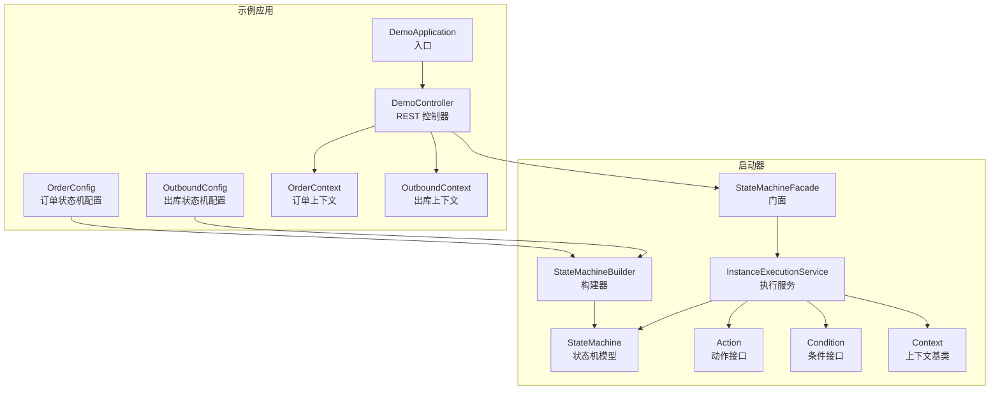
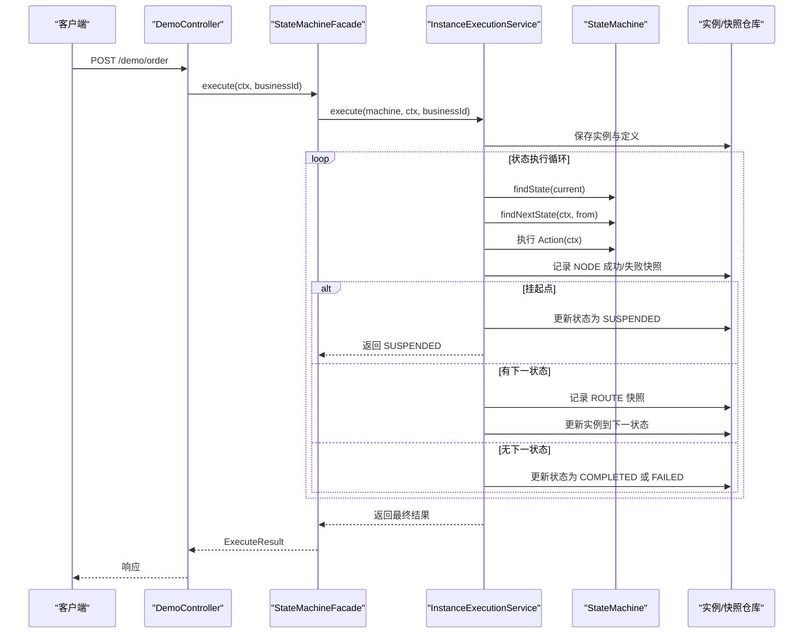
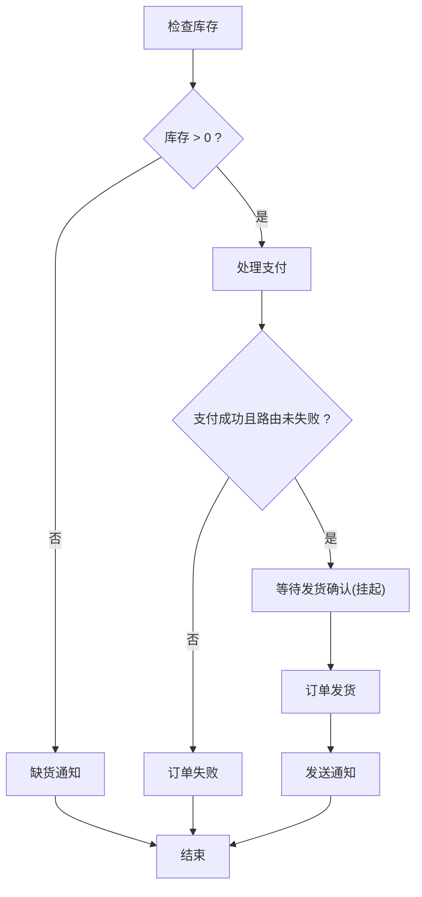
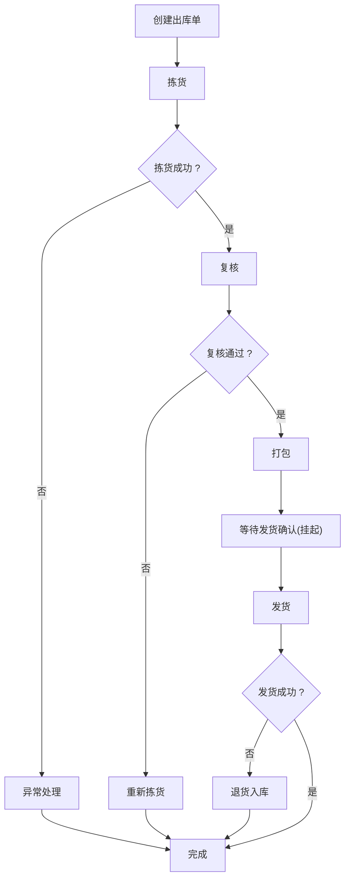
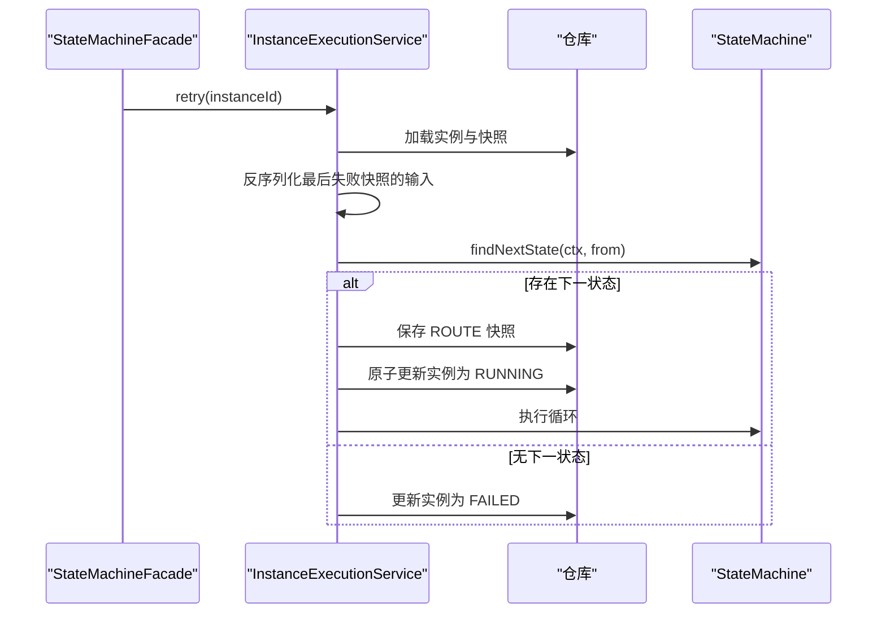
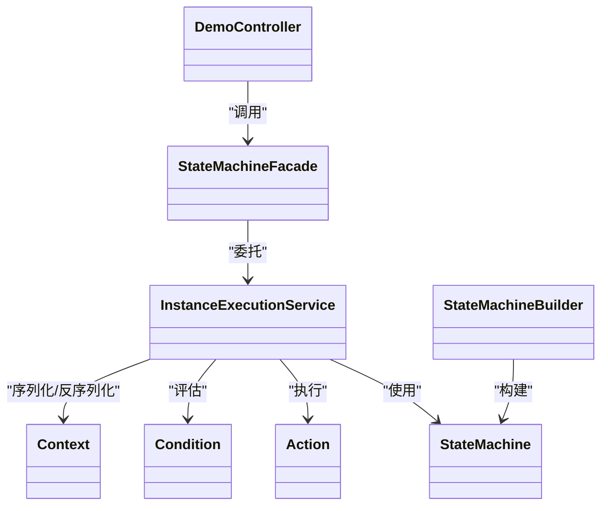

# 示例与最佳实践

<cite>
**本文引用的文件**
- [README.md](file://state-machine-boot-starter/README.md)
- [DemoApplication.java](file://state-machine-demo/src/main/java/cn/chedejun/demo/DemoApplication.java)
- [OrderConfig.java](file://state-machine-demo/src/main/java/cn/chedejun/demo/config/OrderConfig.java)
- [OutboundConfig.java](file://state-machine-demo/src/main/java/cn/chedejun/demo/config/OutboundConfig.java)
- [OrderContext.java](file://state-machine-demo/src/main/java/cn/chedejun/demo/statemachine/OrderContext.java)
- [OutboundContext.java](file://state-machine-demo/src/main/java/cn/chedejun/demo/statemachine/OutboundContext.java)
- [DemoController.java](file://state-machine-demo/src/main/java/cn/chedejun/demo/controller/DemoController.java)
- [StateMachineBuilder.java](file://state-machine-boot-starter/src/main/java/cn/chedejun/statemachine/core/StateMachineBuilder.java)
- [StateMachine.java](file://state-machine-boot-starter/src/main/java/cn/chedejun/statemachine/domain/engine/StateMachine.java)
- [Action.java](file://state-machine-boot-starter/src/main/java/cn/chedejun/statemachine/core/Action.java)
- [Condition.java](file://state-machine-boot-starter/src/main/java/cn/chedejun/statemachine/core/Condition.java)
- [Context.java](file://state-machine-boot-starter/src/main/java/cn/chedejun/statemachine/core/Context.java)
- [InstanceExecutionService.java](file://state-machine-boot-starter/src/main/java/cn/chedejun/statemachine/application/InstanceExecutionService.java)
- [StateMachineFacade.java](file://state-machine-boot-starter/src/main/java/cn/chedejun/statemachine/interfaces/StateMachineFacade.java)
- [index.html](file://state-machine-boot-starter/src/main/resources/console/index.html)
- [application.yml](file://state-machine-demo/src/main/resources/application.yml)
- [StateMachineIntegrationTest.java](file://state-machine-boot-starter/src/test/java/cn/chedejun/statemachine/integration/StateMachineIntegrationTest.java)
- [ConditionFailureDemoTest.java](file://state-machine-demo/src/test/java/cn/chedejun/demo/ConditionFailureDemoTest.java)
</cite>

## 目录
1. [简介](#简介)
2. [项目结构](#项目结构)
3. [核心组件](#核心组件)
4. [架构总览](#架构总览)
5. [详细组件分析](#详细组件分析)
6. [依赖关系分析](#依赖关系分析)
7. [性能考量](#性能考量)
8. [故障排查指南](#故障排查指南)
9. [结论](#结论)
10. [附录](#附录)

## 简介
本指南围绕演示应用中的订单处理与出库流程，系统梳理状态机的设计与实现，覆盖从状态定义、条件路由、挂起恢复、重试策略到控制台可视化与测试验证的全流程。文档提供多复杂度状态机示例路径、常见使用模式与设计模式、性能优化建议、资源管理最佳实践、安全与生产部署要点，并给出可直接复用的模板与参考实现。

## 项目结构
演示应用采用“启动器 + 示例”的分层组织方式：
- 启动器模块提供状态机核心能力（状态定义、条件、动作、重试、持久化、控制台等）
- 示例模块提供订单与出库两个典型业务场景，包含配置类、上下文、控制器与测试

图表来源
- [DemoApplication.java:1-12](file://state-machine-demo/src/main/java/cn/chedejun/demo/DemoApplication.java#L1-L12)
- [DemoController.java:1-345](file://state-machine-demo/src/main/java/cn/chedejun/demo/controller/DemoController.java#L1-L345)
- [OrderConfig.java:1-95](file://state-machine-demo/src/main/java/cn/chedejun/demo/config/OrderConfig.java#L1-L95)
- [OutboundConfig.java:1-130](file://state-machine-demo/src/main/java/cn/chedejun/demo/config/OutboundConfig.java#L1-L130)
- [StateMachineFacade.java:1-52](file://state-machine-boot-starter/src/main/java/cn/chedejun/statemachine/interfaces/StateMachineFacade.java#L1-L52)
- [InstanceExecutionService.java:1-296](file://state-machine-boot-starter/src/main/java/cn/chedejun/statemachine/application/InstanceExecutionService.java#L1-L296)
- [StateMachineBuilder.java:1-52](file://state-machine-boot-starter/src/main/java/cn/chedejun/statemachine/core/StateMachineBuilder.java#L1-L52)
- [StateMachine.java:1-77](file://state-machine-boot-starter/src/main/java/cn/chedejun/statemachine/domain/engine/StateMachine.java#L1-L77)
- [Action.java:1-12](file://state-machine-boot-starter/src/main/java/cn/chedejun/statemachine/core/Action.java#L1-L12)
- [Condition.java:1-7](file://state-machine-boot-starter/src/main/java/cn/chedejun/statemachine/core/Condition.java#L1-L7)
- [Context.java:1-24](file://state-machine-boot-starter/src/main/java/cn/chedejun/statemachine/core/Context.java#L1-L24)

章节来源
- [DemoApplication.java:1-12](file://state-machine-demo/src/main/java/cn/chedejun/demo/DemoApplication.java#L1-L12)
- [application.yml:1-27](file://state-machine-demo/src/main/resources/application.yml#L1-L27)

## 核心组件
- 状态机构建器与模型
  - 构建器负责状态、转换、重试策略与上下文类型的装配，生成不可变的状态机模型
  - 模型提供状态查询、初始状态、下一状态查找与转换校验
- 执行服务
  - 将状态机执行封装为可重试、可挂起/恢复、可持久化的流程
  - 提供实例创建、路由推进、快照记录、重试与恢复的统一入口
- 门面
  - 对外暴露简洁的 execute/retry/resume 接口，隐藏内部执行细节
- 上下文与动作/条件
  - Context 提供键值存储；Action/Codition 描述步骤逻辑与路由条件
- 控制台与管理
  - 提供流程图、实例列表、快照明细与恢复/重试操作

章节来源
- [StateMachineBuilder.java:1-52](file://state-machine-boot-starter/src/main/java/cn/chedejun/statemachine/core/StateMachineBuilder.java#L1-L52)
- [StateMachine.java:1-77](file://state-machine-boot-starter/src/main/java/cn/chedejun/statemachine/domain/engine/StateMachine.java#L1-L77)
- [InstanceExecutionService.java:1-296](file://state-machine-boot-starter/src/main/java/cn/chedejun/statemachine/application/InstanceExecutionService.java#L1-L296)
- [StateMachineFacade.java:1-52](file://state-machine-boot-starter/src/main/java/cn/chedejun/statemachine/interfaces/StateMachineFacade.java#L1-L52)
- [Context.java:1-24](file://state-machine-boot-starter/src/main/java/cn/chedejun/statemachine/core/Context.java#L1-L24)
- [Action.java:1-12](file://state-machine-boot-starter/src/main/java/cn/chedejun/statemachine/core/Action.java#L1-L12)
- [Condition.java:1-7](file://state-machine-boot-starter/src/main/java/cn/chedejun/statemachine/core/Condition.java#L1-L7)
- [index.html:1-665](file://state-machine-boot-starter/src/main/resources/console/index.html#L1-L665)

## 架构总览
演示应用通过 Spring Boot 启动，控制器接收请求，门面对外提供状态机操作，执行服务驱动状态机流转并持久化执行轨迹，控制台用于运维与调试。

图表来源
- [DemoController.java:47-87](file://state-machine-demo/src/main/java/cn/chedejun/demo/controller/DemoController.java#L47-L87)
- [StateMachineFacade.java:26-28](file://state-machine-boot-starter/src/main/java/cn/chedejun/statemachine/interfaces/StateMachineFacade.java#L26-L28)
- [InstanceExecutionService.java:43-58](file://state-machine-boot-starter/src/main/java/cn/chedejun/statemachine/application/InstanceExecutionService.java#L43-L58)
- [StateMachine.java:50-71](file://state-machine-boot-starter/src/main/java/cn/chedejun/statemachine/domain/engine/StateMachine.java#L50-L71)

## 详细组件分析

### 订单处理状态机（复杂度：中等）
- 状态定义
  - 检查库存、处理支付、等待发货确认（挂起点）、订单发货、发送通知、缺货通知、订单失败
- 转换条件
  - 库存充足 → 支付；库存不足 → 缺货通知
  - 支付成功且路由未失败 → 等待发货确认；否则 → 订单失败
  - 等待发货确认 → 发货；发货 → 发送通知
- 动作与异常
  - 支付阶段引入随机失败（30%），配合指数退避重试
  - 地址为空触发异常，终止当前状态并进入失败
- 挂起与恢复
  - 等待发货确认为挂起点，可通过业务 ID 与期望状态恢复执行

图表来源
- [OrderConfig.java:27-49](file://state-machine-demo/src/main/java/cn/chedejun/demo/config/OrderConfig.java#L27-L49)
- [OrderConfig.java:52-89](file://state-machine-demo/src/main/java/cn/chedejun/demo/config/OrderConfig.java#L52-L89)

章节来源
- [OrderConfig.java:1-95](file://state-machine-demo/src/main/java/cn/chedejun/demo/config/OrderConfig.java#L1-L95)
- [OrderContext.java:1-99](file://state-machine-demo/src/main/java/cn/chedejun/demo/statemachine/OrderContext.java#L1-L99)
- [DemoController.java:47-128](file://state-machine-demo/src/main/java/cn/chedejun/demo/controller/DemoController.java#L47-L128)

### 出库流程状态机（复杂度：高）
- 状态定义
  - 创建出库单、拣货、复核、打包、等待发货确认（挂起点）、发货、完成、异常处理、重新拣货、退货入库
- 转换与分支
  - 拣货失败 → 异常处理；复核不通过 → 重新拣货；发货失败 → 退货入库
  - 无异常时按顺序推进至完成
- 动作与异常
  - 拣货（20% 失败）、复核（10% 不通过）、发货（15% 失败）
  - 发货成功写入物流单号，作为后续状态的输入
- 挂起与恢复
  - 等待发货确认为挂起点，支持业务 ID 恢复

图表来源
- [OutboundConfig.java:26-62](file://state-machine-demo/src/main/java/cn/chedejun/demo/config/OutboundConfig.java#L26-L62)
- [OutboundConfig.java:65-124](file://state-machine-demo/src/main/java/cn/chedejun/demo/config/OutboundConfig.java#L65-L124)

章节来源
- [OutboundConfig.java:1-130](file://state-machine-demo/src/main/java/cn/chedejun/demo/config/OutboundConfig.java#L1-L130)
- [OutboundContext.java:1-43](file://state-machine-demo/src/main/java/cn/chedejun/demo/statemachine/OutboundContext.java#L1-L43)
- [DemoController.java:196-271](file://state-machine-demo/src/main/java/cn/chedejun/demo/controller/DemoController.java#L196-L271)

### 执行与恢复流程（核心引擎）
- 执行循环
  - 查找当前状态 → 执行动作 → 记录快照 → 计算下一状态 → 更新实例状态
  - 若为挂起点，保存实例为 SUSPENDED 并停止
- 重试策略
  - 指数退避，最大尝试次数受策略限制
  - 失败后记录失败快照，实例状态更新为 FAILED
- 恢复流程
  - 校验期望状态与实例状态一致
  - 从快照中提取上下文 JSON，反序列化为当前上下文类型
  - 计算下一状态并原子性更新实例状态为 RUNNING，继续执行

图表来源
- [InstanceExecutionService.java:74-114](file://state-machine-boot-starter/src/main/java/cn/chedejun/statemachine/application/InstanceExecutionService.java#L74-L114)
- [InstanceExecutionService.java:158-193](file://state-machine-boot-starter/src/main/java/cn/chedejun/statemachine/application/InstanceExecutionService.java#L158-L193)
- [InstanceExecutionService.java:262-266](file://state-machine-boot-starter/src/main/java/cn/chedejun/statemachine/application/InstanceExecutionService.java#L262-L266)

章节来源
- [InstanceExecutionService.java:1-296](file://state-machine-boot-starter/src/main/java/cn/chedejun/statemachine/application/InstanceExecutionService.java#L1-L296)
- [StateMachine.java:1-77](file://state-machine-boot-starter/src/main/java/cn/chedejun/statemachine/domain/engine/StateMachine.java#L1-L77)

### 控制台与可视化
- 控制台页面提供状态机列表、流程图、实例列表、实例详情与恢复/重试操作
- 支持按状态、业务 ID、实例 ID 过滤，支持分页与刷新
- 实例详情展示快照时间线，区分 NODE 与 ROUTE 快照

章节来源
- [index.html:1-665](file://state-machine-boot-starter/src/main/resources/console/index.html#L1-L665)

### 使用场景与示例路径
- 触发订单流程
  - 路径：[DemoController.java:50-87](file://state-machine-demo/src/main/java/cn/chedejun/demo/controller/DemoController.java#L50-L87)
- 恢复挂起订单
  - 路径：[DemoController.java:92-128](file://state-machine-demo/src/main/java/cn/chedejun/demo/controller/DemoController.java#L92-L128)
- 查询订单列表与详情
  - 路径：[DemoController.java:133-182](file://state-machine-demo/src/main/java/cn/chedejun/demo/controller/DemoController.java#L133-L182)
- 重试失败订单
  - 路径：[DemoController.java:187-194](file://state-machine-demo/src/main/java/cn/chedejun/demo/controller/DemoController.java#L187-L194)
- 触发出库流程
  - 路径：[DemoController.java:201-229](file://state-machine-demo/src/main/java/cn/chedejun/demo/controller/DemoController.java#L201-L229)
- 恢复挂起出库
  - 路径：[DemoController.java:235-271](file://state-machine-demo/src/main/java/cn/chedejun/demo/controller/DemoController.java#L235-L271)
- 查询出库列表与详情
  - 路径：[DemoController.java:276-325](file://state-machine-demo/src/main/java/cn/chedejun/demo/controller/DemoController.java#L276-L325)
- 重试失败出库
  - 路径：[DemoController.java:330-337](file://state-machine-demo/src/main/java/cn/chedejun/demo/controller/DemoController.java#L330-L337)

章节来源
- [DemoController.java:1-345](file://state-machine-demo/src/main/java/cn/chedejun/demo/controller/DemoController.java#L1-L345)

### 常见使用模式与设计模式
- 状态机组合
  - 通过多个配置类分别定义不同业务域的状态机，统一注册到注册表，便于隔离与扩展
  - 示例：订单与出库各自独立配置，互不影响
- 条件复用
  - 将通用条件抽取为静态方法或共享函数式接口，减少重复
  - 示例：支付成功、路由失败、拣货/复核/发货成功率等
- 错误处理策略
  - 动作内抛出异常触发重试；无匹配转换时记录路由失败并标记实例 FAILED
  - 挂起点通过恢复接口注入上下文并继续执行
- 上下文传递
  - 通过 Context 的键值对传递数据；动作执行结果自动序列化到快照
- 版本与定义持久化
  - 状态机定义随版本保存，支持控制台查看历史版本与流程图

章节来源
- [OrderConfig.java:27-49](file://state-machine-demo/src/main/java/cn/chedejun/demo/config/OrderConfig.java#L27-L49)
- [OutboundConfig.java:26-62](file://state-machine-demo/src/main/java/cn/chedejun/demo/config/OutboundConfig.java#L26-L62)
- [InstanceExecutionService.java:186-190](file://state-machine-boot-starter/src/main/java/cn/chedejun/statemachine/application/InstanceExecutionService.java#L186-L190)
- [StateMachineIntegrationTest.java:88-99](file://state-machine-boot-starter/src/test/java/cn/chedejun/statemachine/integration/StateMachineIntegrationTest.java#L88-L99)

### 性能优化建议与资源管理最佳实践
- 重试策略
  - 指数退避 + 最大尝试次数限制，避免雪崩
  - 在动作中尽量幂等，减少重试成本
- 快照与持久化
  - NODE/ROUTE 快照分离，仅对 NODE 快照进行上下文反序列化，降低解析开销
  - 控制台与管理端按需加载，分页与过滤减少一次性渲染压力
- 上下文大小
  - 避免在 Context 中存放过大对象；必要时拆分为多个字段或外部引用
- 并发与原子性
  - 恢复时使用原子更新，避免并发竞争导致的状态错乱
- 资源池
  - 数据源连接池参数根据实例吞吐量调优；慢查询日志开启定位瓶颈

章节来源
- [InstanceExecutionService.java:200-237](file://state-machine-boot-starter/src/main/java/cn/chedejun/statemachine/application/InstanceExecutionService.java#L200-L237)
- [index.html:280-285](file://state-machine-boot-starter/src/main/resources/console/index.html#L280-L285)

### 安全考虑与生产部署指导
- 访问控制
  - 控制台与 Actuator 端点仅在受信网络开放，生产环境建议关闭或鉴权
- 敏感数据
  - 快照中避免记录敏感信息；如需审计，脱敏后再落库
- 配置管理
  - 通过环境变量与配置中心管理数据库连接、DDL 策略与管理开关
- 日志与监控
  - 开启状态机执行日志与慢查询告警；结合控制台观察实例状态分布
- 数据库
  - 生产库使用主从分离与只读副本；DDL 自动化与迁移脚本版本化

章节来源
- [application.yml:11-26](file://state-machine-demo/src/main/resources/application.yml#L11-L26)
- [index.html:1-665](file://state-machine-boot-starter/src/main/resources/console/index.html#L1-L665)

## 依赖关系分析
- 组件耦合
  - 控制器依赖门面；门面委托执行服务；执行服务依赖状态机模型与仓库
  - 状态机构建器与模型解耦于具体业务，便于复用
- 外部依赖
  - JDBC 与数据库驱动；Spring MVC 与 Actuator；前端 Vue 与 Mermaid
- 循环依赖
  - 无直接循环依赖；通过门面与服务层解耦

图表来源
- [DemoController.java:32-45](file://state-machine-demo/src/main/java/cn/chedejun/demo/controller/DemoController.java#L32-L45)
- [StateMachineFacade.java:16-24](file://state-machine-boot-starter/src/main/java/cn/chedejun/statemachine/interfaces/StateMachineFacade.java#L16-L24)
- [InstanceExecutionService.java:24-41](file://state-machine-boot-starter/src/main/java/cn/chedejun/statemachine/application/InstanceExecutionService.java#L24-L41)
- [StateMachineBuilder.java:9-26](file://state-machine-boot-starter/src/main/java/cn/chedejun/statemachine/core/StateMachineBuilder.java#L9-L26)
- [StateMachine.java:19-48](file://state-machine-boot-starter/src/main/java/cn/chedejun/statemachine/domain/engine/StateMachine.java#L19-L48)
- [Action.java:8-11](file://state-machine-boot-starter/src/main/java/cn/chedejun/statemachine/core/Action.java#L8-L11)
- [Condition.java:3-6](file://state-machine-boot-starter/src/main/java/cn/chedejun/statemachine/core/Condition.java#L3-L6)
- [Context.java:6-23](file://state-machine-boot-starter/src/main/java/cn/chedejun/statemachine/core/Context.java#L6-L23)

章节来源
- [StateMachineBuilder.java:1-52](file://state-machine-boot-starter/src/main/java/cn/chedejun/statemachine/core/StateMachineBuilder.java#L1-L52)
- [StateMachine.java:1-77](file://state-machine-boot-starter/src/main/java/cn/chedejun/statemachine/domain/engine/StateMachine.java#L1-L77)
- [InstanceExecutionService.java:1-296](file://state-machine-boot-starter/src/main/java/cn/chedejun/statemachine/application/InstanceExecutionService.java#L1-L296)

## 性能考量
- 执行循环上限
  - 通过状态数与最大重试次数估算最大迭代次数，防止无限循环
- 快照数量
  - NODE/ROUTE 快照数量与状态数、重试次数相关，建议定期归档与清理
- 序列化成本
  - 上下文序列化/反序列化为 JSON，避免在 Context 中存放超大数据
- 控制台渲染
  - 大量实例与快照时启用分页与过滤，避免前端卡顿

章节来源
- [InstanceExecutionService.java:158-193](file://state-machine-boot-starter/src/main/java/cn/chedejun/statemachine/application/InstanceExecutionService.java#L158-L193)
- [index.html:279-285](file://state-machine-boot-starter/src/main/resources/console/index.html#L279-L285)

## 故障排查指南
- 常见问题
  - 无匹配转换：检查条件表达式与上下文状态，查看路由失败快照
  - 挂起无法恢复：确认期望状态与实例当前状态一致，确保业务 ID 正确
  - 恢复上下文缺失：检查快照中是否存在 NODE 类型的输出 JSON
  - 重试无效：确认实例状态为 FAILED，且最后一次快照为失败
- 调试手段
  - 控制台查看实例状态与快照时间线
  - Actuator 端点与管理 API 获取机器与实例信息
  - 单元测试覆盖条件失败、挂起/恢复、重试等场景

章节来源
- [ConditionFailureDemoTest.java:1-108](file://state-machine-demo/src/test/java/cn/chedejun/demo/ConditionFailureDemoTest.java#L1-L108)
- [StateMachineIntegrationTest.java:396-446](file://state-machine-boot-starter/src/test/java/cn/chedejun/statemachine/integration/StateMachineIntegrationTest.java#L396-L446)

## 结论
该演示应用以清晰的分层与可复用的状态机构建器为基础，提供了订单与出库两条完整业务链路。通过挂起/恢复、重试策略与可视化控制台，实现了可观测、可维护、可扩展的状态机执行体系。建议在生产环境中强化访问控制、敏感数据保护与资源池调优，并结合测试用例保障复杂条件与异常分支的正确性。

## 附录
- 快速开始与配置参考
  - 启动器说明与示例：[README.md:1-65](file://state-machine-boot-starter/README.md#L1-L65)
  - 示例应用配置：[application.yml:1-27](file://state-machine-demo/src/main/resources/application.yml#L1-L27)
- 关键实现路径索引
  - 订单状态机配置与动作：[OrderConfig.java:1-95](file://state-machine-demo/src/main/java/cn/chedejun/demo/config/OrderConfig.java#L1-L95)
  - 出库状态机配置与动作：[OutboundConfig.java:1-130](file://state-machine-demo/src/main/java/cn/chedejun/demo/config/OutboundConfig.java#L1-L130)
  - 控制器与 REST API：[DemoController.java:1-345](file://state-machine-demo/src/main/java/cn/chedejun/demo/controller/DemoController.java#L1-L345)
  - 状态机构建与模型：[StateMachineBuilder.java:1-52](file://state-machine-boot-starter/src/main/java/cn/chedejun/statemachine/core/StateMachineBuilder.java#L1-L52)、[StateMachine.java:1-77](file://state-machine-boot-starter/src/main/java/cn/chedejun/statemachine/domain/engine/StateMachine.java#L1-L77)
  - 执行服务与恢复逻辑：[InstanceExecutionService.java:1-296](file://state-machine-boot-starter/src/main/java/cn/chedejun/statemachine/application/InstanceExecutionService.java#L1-L296)
  - 门面与上下文：[StateMachineFacade.java:1-52](file://state-machine-boot-starter/src/main/java/cn/chedejun/statemachine/interfaces/StateMachineFacade.java#L1-L52)、[Context.java:1-24](file://state-machine-boot-starter/src/main/java/cn/chedejun/statemachine/core/Context.java#L1-L24)
  - 控制台页面：[index.html:1-665](file://state-machine-boot-starter/src/main/resources/console/index.html#L1-L665)
- 测试参考
  - 端到端集成测试：[StateMachineIntegrationTest.java:1-483](file://state-machine-boot-starter/src/test/java/cn/chedejun/statemachine/integration/StateMachineIntegrationTest.java#L1-L483)
  - 条件失败演示测试：[ConditionFailureDemoTest.java:1-108](file://state-machine-demo/src/test/java/cn/chedejun/demo/ConditionFailureDemoTest.java#L1-L108)