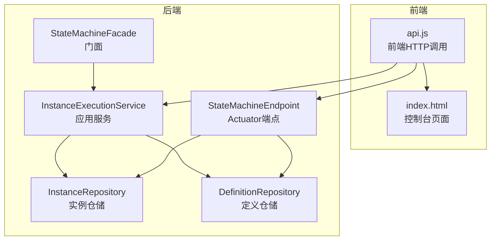
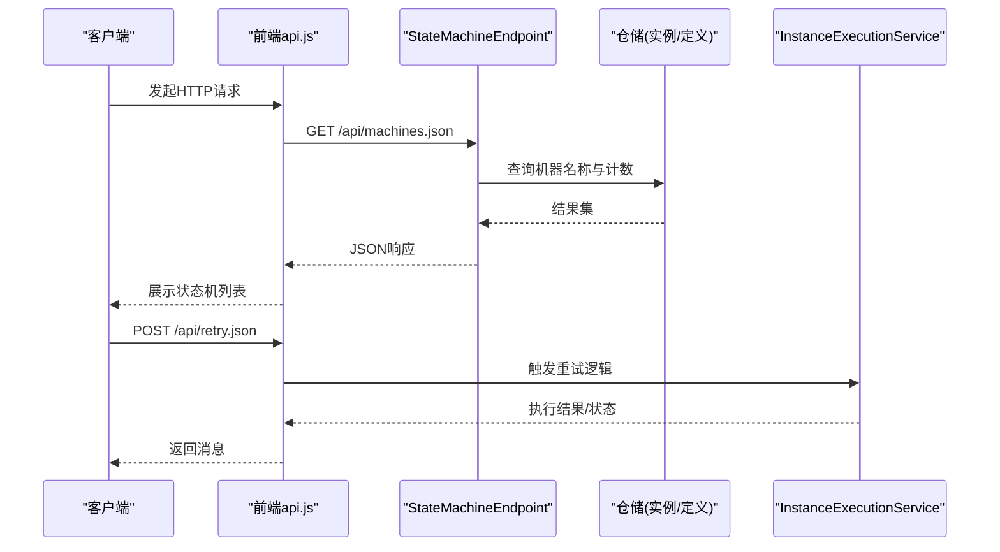
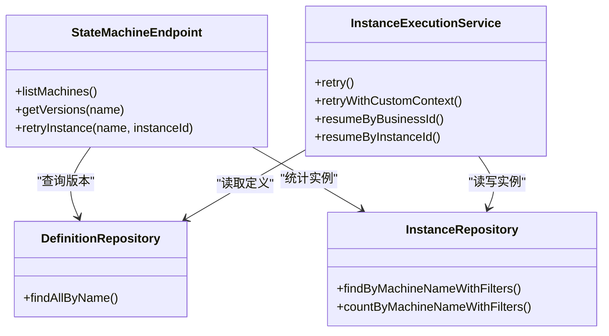

# API接口

<cite>
**本文引用的文件**
- [StateMachineEndpoint.java](file://state-machine-boot-starter/src/main/java/cn/chedejun/statemachine/management/StateMachineEndpoint.java)
- [InstanceExecutionService.java](file://state-machine-boot-starter/src/main/java/cn/chedejun/statemachine/application/InstanceExecutionService.java)
- [StateMachineFacade.java](file://state-machine-boot-starter/src/main/java/cn/chedejun/statemachine/interfaces/StateMachineFacade.java)
- [InstanceRepository.java](file://state-machine-boot-starter/src/main/java/cn/chedejun/statemachine/domain/repository/InstanceRepository.java)
- [DefinitionRepository.java](file://state-machine-boot-starter/src/main/java/cn/chedejun/statemachine/domain/repository/DefinitionRepository.java)
- [InstanceDTO.java](file://state-machine-boot-starter/src/main/java/cn/chedejun/statemachine/management/dto/InstanceDTO.java)
- [MachineDTO.java](file://state-machine-boot-starter/src/main/java/cn/chedejun/statemachine/management/dto/MachineDTO.java)
- [MachineDefinitionDTO.java](file://state-machine-boot-starter/src/main/java/cn/chedejun/statemachine/management/dto/MachineDefinitionDTO.java)
- [SnapshotDTO.java](file://state-machine-boot-starter/src/main/java/cn/chedejun/statemachine/management/dto/SnapshotDTO.java)
- [api.js](file://state-machine-boot-starter/src/main/resources/console/js/api.js)
- [index.html](file://state-machine-boot-starter/src/main/resources/console/index.html)
- [InstanceStatus.java](file://state-machine-boot-starter/src/main/java/cn/chedejun/statemachine/domain/shared/InstanceStatus.java)
- [ExecutionStatus.java](file://state-machine-boot-starter/src/main/java/cn/chedejun/statemachine/domain/shared/ExecutionStatus.java)
- [StateMachineIntegrationTest.java](file://state-machine-boot-starter/src/test/java/cn/chedejun/statemachine/integration/StateMachineIntegrationTest.java)
</cite>

## 目录
1. [简介](#简介)
2. [项目结构](#项目结构)
3. [核心组件](#核心组件)
4. [架构总览](#架构总览)
5. [详细组件分析](#详细组件分析)
6. [依赖分析](#依赖分析)
7. [性能考虑](#性能考虑)
8. [故障排查指南](#故障排查指南)
9. [结论](#结论)
10. [附录](#附录)

## 简介
本文件面向使用者与集成开发者，系统性梳理状态机管理控制台的REST API接口，覆盖以下端点：
- GET接口：/api/machines.json（状态机列表）、/api/versions.json（版本信息）、/api/instances.json（实例查询）、/api/instance.json（实例详情）
- POST接口：/api/resume.json（恢复执行）、/api/retry.json（重试执行）

文档内容包括：端点功能、请求参数、响应格式、错误处理与状态码、分页与过滤、排序、最佳实践与性能优化建议。

## 项目结构
围绕API实现的关键模块如下：
- 管理端点与数据传输对象：management包下的Endpoint与DTO
- 应用服务与领域模型：application与domain包
- 前端调用示例：console目录中的JavaScript与HTML页面

图表来源
- [api.js:1-35](file://state-machine-boot-starter/src/main/resources/console/js/api.js#L1-L35)
- [index.html:1-665](file://state-machine-boot-starter/src/main/resources/console/index.html#L1-L665)
- [StateMachineEndpoint.java:22-79](file://state-machine-boot-starter/src/main/java/cn/chedejun/statemachine/management/StateMachineEndpoint.java#L22-L79)
- [InstanceExecutionService.java:24-295](file://state-machine-boot-starter/src/main/java/cn/chedejun/statemachine/application/InstanceExecutionService.java#L24-L295)
- [StateMachineFacade.java:16-51](file://state-machine-boot-starter/src/main/java/cn/chedejun/statemachine/interfaces/StateMachineFacade.java#L16-L51)
- [InstanceRepository.java:9-25](file://state-machine-boot-starter/src/main/java/cn/chedejun/statemachine/domain/repository/InstanceRepository.java#L9-L25)
- [DefinitionRepository.java:9-15](file://state-machine-boot-starter/src/main/java/cn/chedejun/statemachine/domain/repository/DefinitionRepository.java#L9-L15)

章节来源
- [api.js:1-35](file://state-machine-boot-starter/src/main/resources/console/js/api.js#L1-L35)
- [index.html:1-665](file://state-machine-boot-starter/src/main/resources/console/index.html#L1-L665)
- [StateMachineEndpoint.java:22-79](file://state-machine-boot-starter/src/main/java/cn/chedejun/statemachine/management/StateMachineEndpoint.java#L22-L79)
- [InstanceExecutionService.java:24-295](file://state-machine-boot-starter/src/main/java/cn/chedejun/statemachine/application/InstanceExecutionService.java#L24-L295)
- [StateMachineFacade.java:16-51](file://state-machine-boot-starter/src/main/java/cn/chedejun/statemachine/interfaces/StateMachineFacade.java#L16-L51)
- [InstanceRepository.java:9-25](file://state-machine-boot-starter/src/main/java/cn/chedejun/statemachine/domain/repository/InstanceRepository.java#L9-L25)
- [DefinitionRepository.java:9-15](file://state-machine-boot-starter/src/main/java/cn/chedejun/statemachine/domain/repository/DefinitionRepository.java#L9-L15)

## 核心组件
- 管理端点：提供状态机列表、版本信息、实例查询与重试等能力
- 应用服务：封装实例执行、恢复、重试的核心逻辑
- DTO模型：用于序列化/反序列化API响应的数据结构
- 仓储接口：抽象实例与定义的持久化访问

章节来源
- [StateMachineEndpoint.java:22-79](file://state-machine-boot-starter/src/main/java/cn/chedejun/statemachine/management/StateMachineEndpoint.java#L22-L79)
- [InstanceExecutionService.java:24-295](file://state-machine-boot-starter/src/main/java/cn/chedejun/statemachine/application/InstanceExecutionService.java#L24-L295)
- [InstanceDTO.java:7-54](file://state-machine-boot-starter/src/main/java/cn/chedejun/statemachine/management/dto/InstanceDTO.java#L7-L54)
- [MachineDTO.java:6-33](file://state-machine-boot-starter/src/main/java/cn/chedejun/statemachine/management/dto/MachineDTO.java#L6-L33)
- [MachineDefinitionDTO.java:9-48](file://state-machine-boot-starter/src/main/java/cn/chedejun/statemachine/management/dto/MachineDefinitionDTO.java#L9-L48)
- [SnapshotDTO.java:7-51](file://state-machine-boot-starter/src/main/java/cn/chedejun/statemachine/management/dto/SnapshotDTO.java#L7-L51)

## 架构总览
API调用链路与职责划分如下：

图表来源
- [api.js:1-35](file://state-machine-boot-starter/src/main/resources/console/js/api.js#L1-L35)
- [StateMachineEndpoint.java:40-79](file://state-machine-boot-starter/src/main/java/cn/chedejun/statemachine/management/StateMachineEndpoint.java#L40-L79)
- [InstanceExecutionService.java:74-114](file://state-machine-boot-starter/src/main/java/cn/chedejun/statemachine/application/InstanceExecutionService.java#L74-L114)
- [InstanceRepository.java:9-25](file://state-machine-boot-starter/src/main/java/cn/chedejun/statemachine/domain/repository/InstanceRepository.java#L9-L25)

## 详细组件分析

### GET /api/machines.json（状态机列表）
- 功能：返回已注册状态机的基本统计信息（版本数量、运行中/失败实例计数）
- 访问方式：GET
- 请求参数：无
- 响应体字段（数组元素为MachineDTO）：
  - name：状态机名称
  - versionCount：版本总数
  - runningInstances：运行中实例数
  - failedInstances：失败实例数
- 示例响应（示意）：
  [
    {
      "name": "order-workflow",
      "versionCount": 3,
      "runningInstances": 10,
      "failedInstances": 2
    }
  ]
- 错误处理：无显式HTTP错误；若无状态机则返回空数组
- 状态码：200 OK

章节来源
- [StateMachineEndpoint.java:40-51](file://state-machine-boot-starter/src/main/java/cn/chedejun/statemachine/management/StateMachineEndpoint.java#L40-L51)
- [MachineDTO.java:6-33](file://state-machine-boot-starter/src/main/java/cn/chedejun/statemachine/management/dto/MachineDTO.java#L6-L33)

### GET /api/versions.json（版本信息）
- 功能：按状态机名称返回其所有版本的定义详情（状态、转换、重试策略、注册时间）
- 访问方式：GET
- 请求参数：
  - name（路径选择器）：状态机名称
- 响应体字段（数组元素为MachineDefinitionDTO）：
  - id：版本标识
  - name：状态机名称
  - version：版本号
  - states：状态列表（数组，元素为键值映射）
  - transitions：转换列表（数组，元素为键值映射）
  - retryPolicy：重试策略（键值映射）
  - registeredAt：注册时间
- 示例响应（示意）：
  [
    {
      "id": "v1",
      "name": "order-workflow",
      "version": "1.0",
      "states": [...],
      "transitions": [...],
      "retryPolicy": {...},
      "registeredAt": "2026-01-01T00:00:00Z"
    }
  ]
- 错误处理：解析失败时返回空列表或空字段
- 状态码：200 OK

章节来源
- [StateMachineEndpoint.java:53-69](file://state-machine-boot-starter/src/main/java/cn/chedejun/statemachine/management/StateMachineEndpoint.java#L53-L69)
- [MachineDefinitionDTO.java:9-48](file://state-machine-boot-starter/src/main/java/cn/chedejun/statemachine/management/dto/MachineDefinitionDTO.java#L9-L48)

### GET /api/instances.json（实例查询）
- 功能：分页查询指定状态机的实例列表，支持多维过滤
- 访问方式：GET
- 请求参数（查询字符串）：
  - name：状态机名称（必填）
  - status：实例状态（可选，如 RUNNING/FAILED 等）
  - businessId：业务ID（可选）
  - instanceId：实例ID（可选）
  - page：页码（从0开始，默认0）
  - size：每页大小（默认20）
- 响应体字段（数组元素为InstanceDTO）：
  - id：实例ID
  - machineName：状态机名称
  - definitionVersion：定义版本
  - currentState：当前状态
  - status：实例状态（枚举：RUNNING/SUSPENDED/COMPLETED/FAILED）
  - businessId：业务ID
  - retryCount：重试次数
  - errorMessage：错误信息
  - createdAt：创建时间
  - updatedAt：更新时间
- 分页与排序：
  - 分页：通过page与size控制
  - 排序：未在接口层暴露显式排序参数；实际排序行为取决于仓储实现
- 过滤条件：
  - 支持按状态、业务ID、实例ID进行组合过滤
- 示例响应（示意）：
  [
    {
      "id": "inst_001",
      "machineName": "order-workflow",
      "definitionVersion": "1.0",
      "currentState": "validate",
      "status": "RUNNING",
      "businessId": "biz_123",
      "retryCount": 0,
      "errorMessage": "",
      "createdAt": "2026-01-01T10:00:00Z",
      "updatedAt": "2026-01-01T10:05:00Z"
    }
  ]
- 错误处理：参数缺失或非法时，由前端构造URL；后端仓储方法支持过滤查询
- 状态码：200 OK

章节来源
- [api.js:8-14](file://state-machine-boot-starter/src/main/resources/console/js/api.js#L8-L14)
- [InstanceRepository.java:21-24](file://state-machine-boot-starter/src/main/java/cn/chedejun/statemachine/domain/repository/InstanceRepository.java#L21-L24)
- [InstanceDTO.java:7-54](file://state-machine-boot-starter/src/main/java/cn/chedejun/statemachine/management/dto/InstanceDTO.java#L7-L54)
- [InstanceStatus.java:1-3](file://state-machine-boot-starter/src/main/java/cn/chedejun/statemachine/domain/shared/InstanceStatus.java#L1-L3)

### GET /api/instance.json（实例详情）
- 功能：获取指定实例的完整信息与执行快照
- 访问方式：GET
- 请求参数：
  - id：实例ID（查询参数）
- 响应体字段：
  - instance：InstanceDTO（实例基本信息）
  - snapshots：SnapshotDTO数组（执行快照）
- SnapshotDTO字段：
  - id：快照ID
  - stateName：状态名
  - input：输入上下文（JSON字符串）
  - output：输出上下文（JSON字符串）
  - status：执行状态（SUCCESS/FAILED）
  - errorMessage：错误信息
  - attempt：尝试次数
  - snapshotType：快照类型（如 ROUTE/NODE）
  - executedAt：执行时间
- 示例响应（示意）：
  {
    "instance": {
      "id": "inst_001",
      "machineName": "order-workflow",
      "definitionVersion": "1.0",
      "currentState": "validate",
      "status": "RUNNING",
      "businessId": "biz_123",
      "retryCount": 0,
      "errorMessage": "",
      "createdAt": "2026-01-01T10:00:00Z",
      "updatedAt": "2026-01-01T10:05:00Z"
    },
    "snapshots": [
      {
        "id": "snap_001",
        "stateName": "validate",
        "input": "{...}",
        "output": "{...}",
        "status": "SUCCESS",
        "errorMessage": "",
        "attempt": 1,
        "snapshotType": "NODE",
        "executedAt": "2026-01-01T10:00:01Z"
      }
    ]
  }
- 错误处理：未找到实例时，前端页面会提示无数据
- 状态码：200 OK

章节来源
- [api.js:15-16](file://state-machine-boot-starter/src/main/resources/console/js/api.js#L15-L16)
- [SnapshotDTO.java:7-51](file://state-machine-boot-starter/src/main/java/cn/chedejun/statemachine/management/dto/SnapshotDTO.java#L7-L51)
- [StateMachineIntegrationTest.java:349-354](file://state-machine-boot-starter/src/test/java/cn/chedejun/statemachine/integration/StateMachineIntegrationTest.java#L349-L354)

### POST /api/resume.json（恢复执行）
- 功能：恢复挂起实例的执行，需提供预期当前状态与可选上下文
- 访问方式：POST
- 请求体字段：
  - id：实例ID
  - expectedCurrentState：预期当前状态（挂起点）
  - contextJson：可选，上下文JSON字符串
- 响应体字段：
  - message：操作结果描述
- 错误处理：
  - 若实例不存在或状态不匹配，会抛出异常并返回错误信息
  - 若实例非挂起状态，无法恢复
- 状态码：200 OK（成功），400/500（异常情况）

章节来源
- [api.js:25-33](file://state-machine-boot-starter/src/main/resources/console/js/api.js#L25-L33)
- [InstanceExecutionService.java:119-152](file://state-machine-boot-starter/src/main/java/cn/chedejun/statemachine/application/InstanceExecutionService.java#L119-L152)
- [InstanceExecutionService.java:60-72](file://state-machine-boot-starter/src/main/java/cn/chedejun/statemachine/application/InstanceExecutionService.java#L60-L72)

### POST /api/retry.json（重试执行）
- 功能：对失败实例进行重试，内部会将实例状态重置为运行并重新执行
- 访问方式：POST
- 请求体字段：
  - id：实例ID
- 响应体字段：
  - message：操作结果描述（提示需要调用具体重试API以重新执行）
- 错误处理：
  - 若实例不存在或状态不是FAILED，会返回相应错误提示
- 状态码：200 OK（成功），400（参数/状态错误）

章节来源
- [api.js:18-24](file://state-machine-boot-starter/src/main/resources/console/js/api.js#L18-L24)
- [StateMachineEndpoint.java:71-78](file://state-machine-boot-starter/src/main/java/cn/chedejun/statemachine/management/StateMachineEndpoint.java#L71-L78)
- [InstanceExecutionService.java:79-114](file://state-machine-boot-starter/src/main/java/cn/chedejun/statemachine/application/InstanceExecutionService.java#L79-L114)

## 依赖分析
- 端点依赖：
  - StateMachineEndpoint依赖状态机注册表、实例与定义仓储，用于查询状态机列表、版本与实例统计
- 应用服务依赖：
  - InstanceExecutionService依赖实例/快照/定义仓储，负责执行循环、重试与恢复逻辑
- 前端依赖：
  - api.js封装了所有API调用，index.html使用这些接口渲染控制台

图表来源
- [StateMachineEndpoint.java:25-38](file://state-machine-boot-starter/src/main/java/cn/chedejun/statemachine/management/StateMachineEndpoint.java#L25-L38)
- [InstanceExecutionService.java:35-41](file://state-machine-boot-starter/src/main/java/cn/chedejun/statemachine/application/InstanceExecutionService.java#L35-L41)
- [InstanceRepository.java:21-24](file://state-machine-boot-starter/src/main/java/cn/chedejun/statemachine/domain/repository/InstanceRepository.java#L21-L24)
- [DefinitionRepository.java](file://state-machine-boot-starter/src/main/java/cn/chedejun/statemachine/domain/repository/DefinitionRepository.java#L13)

章节来源
- [StateMachineEndpoint.java:25-38](file://state-machine-boot-starter/src/main/java/cn/chedejun/statemachine/management/StateMachineEndpoint.java#L25-L38)
- [InstanceExecutionService.java:35-41](file://state-machine-boot-starter/src/main/java/cn/chedejun/statemachine/application/InstanceExecutionService.java#L35-L41)
- [InstanceRepository.java:21-24](file://state-machine-boot-starter/src/main/java/cn/chedejun/statemachine/domain/repository/InstanceRepository.java#L21-L24)
- [DefinitionRepository.java](file://state-machine-boot-starter/src/main/java/cn/chedejun/statemachine/domain/repository/DefinitionRepository.java#L13)

## 性能考虑
- 分页与过滤：
  - 使用page与size控制查询规模，避免一次性拉取大量数据
  - 利用仓储提供的过滤接口，减少无效数据传输
- 缓存与统计：
  - 状态机列表接口会统计运行/失败实例数，避免重复计算
- 序列化开销：
  - 版本信息接口解析JSON定义，建议在前端缓存常用版本，降低后端压力
- 并发与一致性：
  - 恢复执行采用CAS式原子更新，避免并发恢复导致的状态竞争
- 重试策略：
  - 应用服务内置指数退避重试，避免频繁轮询造成抖动

## 故障排查指南
- 常见错误与定位：
  - 实例不存在：检查实例ID是否正确，确认状态机名称与业务ID
  - 状态不匹配：恢复时expectedCurrentState必须与实例当前状态一致
  - 非失败实例重试：仅FAILED状态可重试
- 日志与监控：
  - 后端日志包含状态执行失败与重试信息，便于定位问题
- 前端调试：
  - 使用浏览器网络面板查看请求与响应，核对参数与状态码

章节来源
- [InstanceExecutionService.java:119-152](file://state-machine-boot-starter/src/main/java/cn/chedejun/statemachine/application/InstanceExecutionService.java#L119-L152)
- [InstanceExecutionService.java:79-114](file://state-machine-boot-starter/src/main/java/cn/chedejun/statemachine/application/InstanceExecutionService.java#L79-L114)
- [StateMachineEndpoint.java:71-78](file://state-machine-boot-starter/src/main/java/cn/chedejun/statemachine/management/StateMachineEndpoint.java#L71-L78)

## 结论
本文档系统梳理了状态机控制台的REST API，明确了各端点的功能、参数、响应与错误处理，并结合前端调用示例与后端实现细节，提供了分页、过滤、排序与性能优化建议。建议在生产环境中配合缓存、限流与监控，确保API稳定高效运行。

## 附录

### 状态码定义
- 200 OK：请求成功
- 400 Bad Request：参数错误或状态不满足要求
- 500 Internal Server Error：服务器异常

### 过滤与排序选项
- 过滤：
  - 实例查询支持按状态、业务ID、实例ID过滤
- 排序：
  - 当前接口未暴露显式排序参数；如需排序，请在客户端或服务端二次处理

### 最佳实践
- 前端：
  - 对高频接口进行结果缓存
  - 合理设置分页大小，避免超大数据量传输
- 后端：
  - 使用仓储提供的过滤与计数接口，减少不必要的扫描
  - 在恢复与重试场景下，确保幂等性与事务一致性