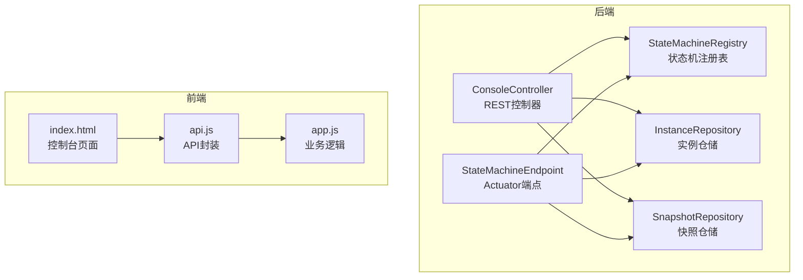
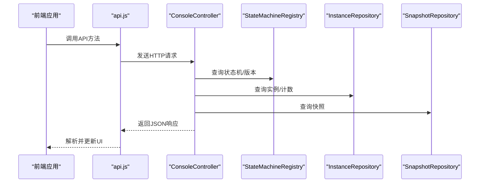
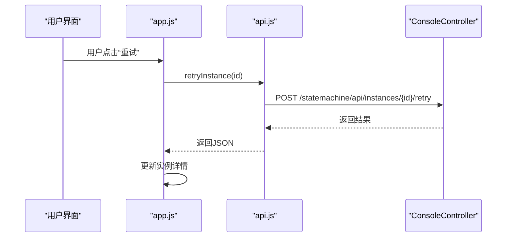
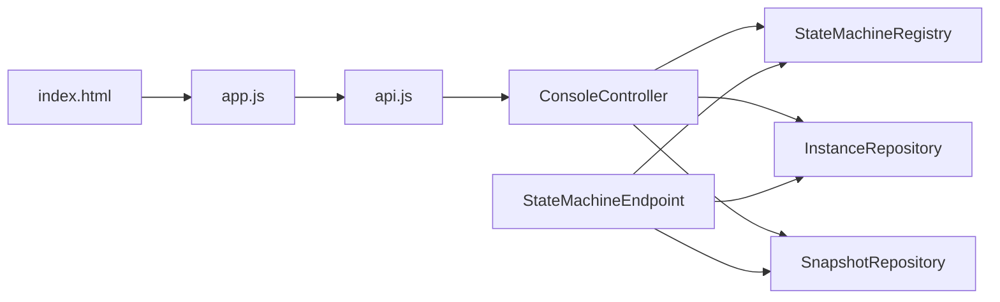

# API集成

<cite>
**本文引用的文件**
- [ConsoleController.java](file://src/main/java/cn/chedejun/statemachine/management/ConsoleController.java)
- [StateMachineEndpoint.java](file://src/main/java/cn/chedejun/statemachine/management/StateMachineEndpoint.java)
- [InstanceDTO.java](file://src/main/java/cn/chedejun/statemachine/management/dto/InstanceDTO.java)
- [MachineDTO.java](file://src/main/java/cn/chedejun/statemachine/management/dto/MachineDTO.java)
- [MachineDefinitionDTO.java](file://src/main/java/cn/chedejun/statemachine/management/dto/MachineDefinitionDTO.java)
- [SnapshotDTO.java](file://src/main/java/cn/chedejun/statemachine/management/dto/SnapshotDTO.java)
- [InstanceRepository.java](file://src/main/java/cn/chedejun/statemachine/persistence/InstanceRepository.java)
- [SnapshotRepository.java](file://src/main/java/cn/chedejun/statemachine/persistence/SnapshotRepository.java)
- [StateMachineRegistry.java](file://src/main/java/cn/chedejun/statemachine/core/StateMachineRegistry.java)
- [api.js](file://src/main/resources/static/statemachine/js/api.js)
- [app.js](file://src/main/resources/static/statemachine/js/app.js)
- [index.html](file://src/main/resources/static/statemachine/index.html)
- [application.yml](file://demo/src/main/resources/application.yml)
- [README.md](file://README.md)
</cite>

## 目录
1. [简介](#简介)
2. [项目结构](#项目结构)
3. [核心组件](#核心组件)
4. [架构总览](#架构总览)
5. [详细组件分析](#详细组件分析)
6. [依赖分析](#依赖分析)
7. [性能考虑](#性能考虑)
8. [故障排查指南](#故障排查指南)
9. [结论](#结论)
10. [附录](#附录)

## 简介
本文件面向“管理控制台API集成”的需求，系统化说明后端REST API与前端调用的接口设计、数据格式、错误处理、鉴权与安全配置、性能优化与缓存策略，以及API版本管理与向后兼容性。读者可据此在前端应用中稳定集成状态机控制台能力。

## 项目结构
- 后端控制器与端点
  - 控制器：提供HTTP REST API，路径前缀为 /statemachine
  - Actuator端点：提供 /actuator/state-machines 以供监控与运维
- 前端静态资源
  - 控制台页面：index.html
  - 前端API封装：api.js
  - 前端业务逻辑：app.js
- 数据模型与持久化
  - DTO：MachineDTO、MachineDefinitionDTO、InstanceDTO、SnapshotDTO
  - 仓储：InstanceRepository、SnapshotRepository
  - 注册表：StateMachineRegistry

图表来源
- [ConsoleController.java:15-106](file://src/main/java/cn/chedejun/statemachine/management/ConsoleController.java#L15-L106)
- [StateMachineEndpoint.java:16-73](file://src/main/java/cn/chedejun/statemachine/management/StateMachineEndpoint.java#L16-L73)
- [StateMachineRegistry.java:9-73](file://src/main/java/cn/chedejun/statemachine/core/StateMachineRegistry.java#L9-L73)
- [InstanceRepository.java:11-66](file://src/main/java/cn/chedejun/statemachine/persistence/InstanceRepository.java#L11-L66)
- [SnapshotRepository.java:11-55](file://src/main/java/cn/chedejun/statemachine/persistence/SnapshotRepository.java#L11-L55)
- [api.js:1-12](file://src/main/resources/static/statemachine/js/api.js#L1-L12)
- [app.js:1-250](file://src/main/resources/static/statemachine/js/app.js#L1-L250)
- [index.html:1-380](file://src/main/resources/static/statemachine/index.html#L1-L380)

章节来源
- [ConsoleController.java:15-106](file://src/main/java/cn/chedejun/statemachine/management/ConsoleController.java#L15-L106)
- [StateMachineEndpoint.java:16-73](file://src/main/java/cn/chedejun/statemachine/management/StateMachineEndpoint.java#L16-L73)
- [api.js:1-12](file://src/main/resources/static/statemachine/js/api.js#L1-L12)
- [app.js:1-250](file://src/main/resources/static/statemachine/js/app.js#L1-L250)
- [index.html:1-380](file://src/main/resources/static/statemachine/index.html#L1-L380)

## 核心组件
- ConsoleController：提供REST API，负责状态机列表、版本查询、实例分页查询、实例详情、重试操作等。
- StateMachineEndpoint：提供Actuator端点，用于运维查询与重试。
- DTO：定义前后端交互的数据结构。
- 仓储层：InstanceRepository、SnapshotRepository，负责实例与快照的数据库访问。
- 注册表：StateMachineRegistry，维护状态机定义与版本元数据。

章节来源
- [ConsoleController.java:34-104](file://src/main/java/cn/chedejun/statemachine/management/ConsoleController.java#L34-L104)
- [StateMachineEndpoint.java:32-71](file://src/main/java/cn/chedejun/statemachine/management/StateMachineEndpoint.java#L32-L71)
- [InstanceDTO.java:1-6](file://src/main/java/cn/chedejun/statemachine/management/dto/InstanceDTO.java#L1-L6)
- [MachineDTO.java:1-3](file://src/main/java/cn/chedejun/statemachine/management/dto/MachineDTO.java#L1-L3)
- [MachineDefinitionDTO.java:1-8](file://src/main/java/cn/chedejun/statemachine/management/dto/MachineDefinitionDTO.java#L1-L8)
- [SnapshotDTO.java:1-5](file://src/main/java/cn/chedejun/statemachine/management/dto/SnapshotDTO.java#L1-L5)
- [InstanceRepository.java:11-66](file://src/main/java/cn/chedejun/statemachine/persistence/InstanceRepository.java#L11-L66)
- [SnapshotRepository.java:11-55](file://src/main/java/cn/chedejun/statemachine/persistence/SnapshotRepository.java#L11-L55)
- [StateMachineRegistry.java:51-69](file://src/main/java/cn/chedejun/statemachine/core/StateMachineRegistry.java#L51-L69)

## 架构总览
后端通过ConsoleController暴露REST API，前端通过api.js封装请求，app.js驱动UI与路由，index.html承载视图。Actuator端点作为补充运维入口。

图表来源
- [api.js:1-12](file://src/main/resources/static/statemachine/js/api.js#L1-L12)
- [ConsoleController.java:34-104](file://src/main/java/cn/chedejun/statemachine/management/ConsoleController.java#L34-L104)
- [StateMachineRegistry.java:51-69](file://src/main/java/cn/chedejun/statemachine/core/StateMachineRegistry.java#L51-L69)
- [InstanceRepository.java:40-51](file://src/main/java/cn/chedejun/statemachine/persistence/InstanceRepository.java#L40-L51)
- [SnapshotRepository.java:37-39](file://src/main/java/cn/chedejun/statemachine/persistence/SnapshotRepository.java#L37-L39)

## 详细组件分析

### REST API 设计规范与URL结构
- 基础路径：/statemachine
- 控制台首页：GET /statemachine 或 /statemachine/
- 管理端点（Actuator）：/actuator/state-machines（由配置暴露）

章节来源
- [ConsoleController.java:19-22](file://src/main/java/cn/chedejun/statemachine/management/ConsoleController.java#L19-L22)
- [application.yml:18-22](file://demo/src/main/resources/application.yml#L18-L22)

### API端点清单与功能说明

#### 1) 获取状态机列表
- 方法与路径：GET /statemachine/api/machines
- 功能：返回所有已注册状态机的基本统计信息（名称、版本数量、运行中/失败实例数）
- 响应：数组，元素为 MachineDTO
- 示例字段：name、versionCount、runningInstances、failedInstances

章节来源
- [ConsoleController.java:34-43](file://src/main/java/cn/chedejun/statemachine/management/ConsoleController.java#L34-L43)
- [MachineDTO.java:1-3](file://src/main/java/cn/chedejun/statemachine/management/dto/MachineDTO.java#L1-L3)

#### 2) 查询状态机版本
- 方法与路径：GET /statemachine/api/machines/{name}/versions
- 参数：name（路径变量）
- 功能：返回指定状态机的所有版本定义，包含状态、转换、重试策略等
- 响应：数组，元素为 MachineDefinitionDTO
- 示例字段：id、name、version、states、transitions、retryPolicy、registeredAt

章节来源
- [ConsoleController.java:45-60](file://src/main/java/cn/chedejun/statemachine/management/ConsoleController.java#L45-L60)
- [MachineDefinitionDTO.java:1-8](file://src/main/java/cn/chedejun/statemachine/management/dto/MachineDefinitionDTO.java#L1-L8)

#### 3) 查询状态机实例列表
- 方法与路径：GET /statemachine/api/machines/{name}/instances
- 参数：
  - name（路径变量）
  - status（查询参数，可选）
  - page（查询参数，默认0）
  - size（查询参数，默认20）
- 功能：按状态机名称分页查询实例，支持按状态过滤
- 响应：对象，包含 instances（数组，元素为InstanceDTO）、total、page、size

章节来源
- [ConsoleController.java:62-76](file://src/main/java/cn/chedejun/statemachine/management/ConsoleController.java#L62-L76)
- [InstanceRepository.java:40-51](file://src/main/java/cn/chedejun/statemachine/persistence/InstanceRepository.java#L40-L51)
- [InstanceDTO.java:1-6](file://src/main/java/cn/chedejun/statemachine/management/dto/InstanceDTO.java#L1-L6)

#### 4) 获取实例详情
- 方法与路径：GET /statemachine/api/instances/{id}
- 参数：id（路径变量）
- 功能：返回实例基本信息与该实例的执行快照列表
- 响应：对象，包含 instance（InstanceDTO）、snapshots（数组，元素为SnapshotDTO）

章节来源
- [ConsoleController.java:78-89](file://src/main/java/cn/chedejun/statemachine/management/ConsoleController.java#L78-L89)
- [SnapshotRepository.java:37-39](file://src/main/java/cn/chedejun/statemachine/persistence/SnapshotRepository.java#L37-L39)
- [SnapshotDTO.java:1-5](file://src/main/java/cn/chedejun/statemachine/management/dto/SnapshotDTO.java#L1-L5)

#### 5) 触发实例重试
- 方法与路径：POST /statemachine/api/instances/{id}/retry
- 参数：id（路径变量）
- 功能：对失败实例发起重试（内部会调用状态机重试逻辑）
- 响应：对象，包含 message 或 error 字段

章节来源
- [ConsoleController.java:91-104](file://src/main/java/cn/chedejun/statemachine/management/ConsoleController.java#L91-L104)

### Actuator 端点（运维）
- 端点ID：state-machines
- 访问方式：/actuator/state-machines
- 暴露配置：management.endpoints.web.exposure.include=health,state-machines
- 读操作：列出状态机与统计
- 读操作：查询版本
- 写操作：重试实例（仅对FAILED实例进行状态重置）

章节来源
- [StateMachineEndpoint.java:16-73](file://src/main/java/cn/chedejun/statemachine/management/StateMachineEndpoint.java#L16-L73)
- [application.yml:18-22](file://demo/src/main/resources/application.yml#L18-L22)

### 数据模型与JSON Schema
- MachineDTO
  - 字段：name、versionCount、runningInstances、failedInstances
- MachineDefinitionDTO
  - 字段：id、name、version、states、transitions、retryPolicy、registeredAt
  - states/transitions：数组，元素为对象；retryPolicy：对象
- InstanceDTO
  - 字段：id、machineName、definitionVersion、currentState、status、retryCount、errorMessage、createdAt、updatedAt
- SnapshotDTO
  - 字段：id、stateName、input、output、status、errorMessage、attempt、executedAt

章节来源
- [MachineDTO.java:1-3](file://src/main/java/cn/chedejun/statemachine/management/dto/MachineDTO.java#L1-L3)
- [MachineDefinitionDTO.java:1-8](file://src/main/java/cn/chedejun/statemachine/management/dto/MachineDefinitionDTO.java#L1-L8)
- [InstanceDTO.java:1-6](file://src/main/java/cn/chedejun/statemachine/management/dto/InstanceDTO.java#L1-L6)
- [SnapshotDTO.java:1-5](file://src/main/java/cn/chedejun/statemachine/management/dto/SnapshotDTO.java#L1-L5)

### 前端API调用封装与错误处理
- API封装（api.js）
  - getMachines：获取状态机列表
  - getVersions：获取版本列表
  - getInstances：分页获取实例列表，支持status过滤
  - getInstanceDetail：获取实例详情
  - retryInstance：触发重试
- 前端业务逻辑（app.js）
  - 统一使用 fetch 发起请求
  - 对错误场景进行提示与回退（如实例不存在、重试失败）
  - 加载完成后渲染视图与流程图

图表来源
- [api.js:1-12](file://src/main/resources/static/statemachine/js/api.js#L1-L12)
- [app.js:129-132](file://src/main/resources/static/statemachine/js/app.js#L129-L132)
- [ConsoleController.java:91-104](file://src/main/java/cn/chedejun/statemachine/management/ConsoleController.java#L91-L104)

章节来源
- [api.js:1-12](file://src/main/resources/static/statemachine/js/api.js#L1-L12)
- [app.js:129-132](file://src/main/resources/static/statemachine/js/app.js#L129-L132)
- [ConsoleController.java:91-104](file://src/main/java/cn/chedejun/statemachine/management/ConsoleController.java#L91-L104)

### 鉴权与安全配置
- 当前仓库未包含鉴权相关实现或配置示例
- 若需启用鉴权，请结合Spring Security或网关层进行统一鉴权
- Actuator端点建议限制访问范围，避免在生产环境暴露敏感信息

章节来源
- [application.yml:18-22](file://demo/src/main/resources/application.yml#L18-L22)

### 版本管理与向后兼容性
- 版本维度：以状态机名称+版本号进行区分
- 列表与详情均支持按名称查询版本列表
- 注册时将状态、转换、重试策略序列化存储，便于后续解析与展示
- 建议在新增字段时保持默认值与空值兼容，确保旧客户端可用

章节来源
- [StateMachineRegistry.java:21-49](file://src/main/java/cn/chedejun/statemachine/core/StateMachineRegistry.java#L21-L49)
- [ConsoleController.java:45-60](file://src/main/java/cn/chedejun/statemachine/management/ConsoleController.java#L45-L60)

## 依赖分析
- 控制器依赖
  - StateMachineRegistry：用于查询状态机与版本
  - InstanceRepository：用于查询实例与计数
  - SnapshotRepository：用于查询快照
- 端点依赖
  - 与控制器相同，但通过Actuator暴露
- 前端依赖
  - api.js依赖后端REST路径
  - app.js依赖api.js与index.html模板

图表来源
- [ConsoleController.java:23-32](file://src/main/java/cn/chedejun/statemachine/management/ConsoleController.java#L23-L32)
- [StateMachineEndpoint.java:18-30](file://src/main/java/cn/chedejun/statemachine/management/StateMachineEndpoint.java#L18-L30)
- [api.js:1-12](file://src/main/resources/static/statemachine/js/api.js#L1-L12)
- [app.js:1-250](file://src/main/resources/static/statemachine/js/app.js#L1-L250)
- [index.html:1-380](file://src/main/resources/static/statemachine/index.html#L1-L380)

章节来源
- [ConsoleController.java:23-32](file://src/main/java/cn/chedejun/statemachine/management/ConsoleController.java#L23-L32)
- [StateMachineEndpoint.java:18-30](file://src/main/java/cn/chedejun/statemachine/management/StateMachineEndpoint.java#L18-L30)
- [api.js:1-12](file://src/main/resources/static/statemachine/js/api.js#L1-L12)
- [app.js:1-250](file://src/main/resources/static/statemachine/js/app.js#L1-L250)
- [index.html:1-380](file://src/main/resources/static/statemachine/index.html#L1-L380)

## 性能考虑
- 分页查询
  - 实例列表支持 page/size 参数，避免一次性拉取大量数据
- 数据库索引
  - 建议在实例表的 machine_name、status、created_at 上建立索引，提升查询性能
- JSON解析
  - 控制器对states、transitions、retryPolicy进行JSON解析，建议在注册阶段保证数据格式正确，减少运行时异常
- 前端渲染
  - 流程图渲染采用异步初始化与节点样式注入，避免阻塞主线程

章节来源
- [ConsoleController.java:62-76](file://src/main/java/cn/chedejun/statemachine/management/ConsoleController.java#L62-L76)
- [InstanceRepository.java:40-51](file://src/main/java/cn/chedejun/statemachine/persistence/InstanceRepository.java#L40-L51)
- [app.js:134-222](file://src/main/resources/static/statemachine/js/app.js#L134-L222)

## 故障排查指南
- 实例不存在
  - 现象：返回包含 error 的JSON
  - 排查：确认实例ID是否正确，检查数据库是否存在
- 重试失败
  - 现象：返回包含 message 的JSON，提示失败原因
  - 排查：查看状态机最新版本是否可用，确认上下文是否正确
- Actuator端点不可用
  - 现象：无法访问 /actuator/state-machines
  - 排查：确认 management.endpoints.web.exposure 是否包含 state-machines

章节来源
- [ConsoleController.java:81-103](file://src/main/java/cn/chedejun/statemachine/management/ConsoleController.java#L81-L103)
- [application.yml:18-22](file://demo/src/main/resources/application.yml#L18-L22)

## 结论
本项目提供了完整的状态机管理控制台API：REST控制器与Actuator端点覆盖了状态机概览、版本查询、实例管理与重试等核心能力；前端通过api.js与app.js实现了稳定的调用与可视化展示。建议在生产环境中补充鉴权与访问控制，并结合数据库索引与分页策略进一步优化性能。

## 附录
- 快速开始与控制台访问
  - 参考：README中的快速开始与控制台访问说明
- 配置项参考
  - ddl-auto、management.enabled、console.enabled、Actuator端点暴露

章节来源
- [README.md:51-53](file://README.md#L51-L53)
- [application.yml:8-16](file://demo/src/main/resources/application.yml#L8-L16)