# Web界面

<cite>
**本文档引用的文件**
- [index.html](file://state-machine-boot-starter/src/main/resources/console/index.html)
- [app.js](file://state-machine-boot-starter/src/main/resources/console/js/app.js)
- [api.js](file://state-machine-boot-starter/src/main/resources/console/js/api.js)
- [style.css](file://state-machine-boot-starter/src/main/resources/console/css/style.css)
- [vue.global.prod.js](file://state-machine-boot-starter/src/main/resources/console/js/vue.global.prod.js)
- [mermaid.min.js](file://state-machine-boot-starter/src/main/resources/console/js/mermaid.min.js)
</cite>

## 目录
1. [简介](#简介)
2. [项目结构](#项目结构)
3. [核心组件](#核心组件)
4. [架构总览](#架构总览)
5. [详细组件分析](#详细组件分析)
6. [依赖关系分析](#依赖关系分析)
7. [性能考虑](#性能考虑)
8. [故障排除指南](#故障排除指南)
9. [结论](#结论)
10. [附录](#附录)

## 简介
本项目为状态机控制台的Web前端界面，基于Vue 3构建，采用单页应用（SPA）架构，通过哈希路由实现页面切换。系统提供状态机概览、状态机定义详情、实例列表与实例详情等核心功能，并集成Mermaid.js进行状态图可视化展示。界面采用现代化的响应式设计，支持深浅主题切换与丰富的交互体验。

## 项目结构
前端资源位于 `state-machine-boot-starter/src/main/resources/console/` 目录下，主要包含HTML模板、Vue应用逻辑、API封装、样式表和第三方库：

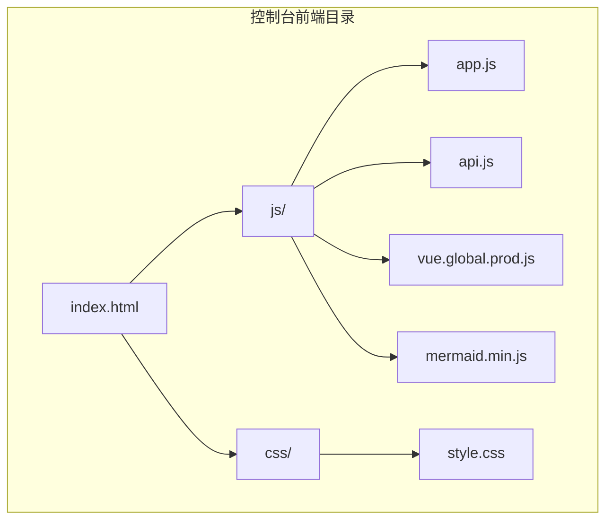

**图表来源**
- [index.html:1-665](file://state-machine-boot-starter/src/main/resources/console/index.html#L1-L665)
- [app.js:1-848](file://state-machine-boot-starter/src/main/resources/console/js/app.js#L1-L848)
- [style.css:1-1235](file://state-machine-boot-starter/src/main/resources/console/css/style.css#L1-L1235)

**章节来源**
- [index.html:1-665](file://state-machine-boot-starter/src/main/resources/console/index.html#L1-L665)
- [app.js:1-848](file://state-machine-boot-starter/src/main/resources/console/js/app.js#L1-L848)
- [style.css:1-1235](file://state-machine-boot-starter/src/main/resources/console/css/style.css#L1-L1235)

## 核心组件
Web界面由多个核心组件构成，每个组件负责特定的功能区域：

### 应用容器组件
- **根容器**：提供整体布局框架，包含侧边栏导航、主内容区和顶部工具栏
- **视图容器**：根据路由动态切换不同视图（概览、状态机详情、实例列表、实例详情）

### 导航组件
- **侧边栏导航**：左侧固定导航，显示状态机列表和健康状态指示
- **面包屑导航**：顶部路径导航，显示当前所在位置
- **刷新按钮**：实例列表专用的刷新功能

### 统计卡片组件
- **概览统计**：展示状态机总数、运行中、失败、挂起实例数量
- **状态机卡片**：显示每个状态机的版本信息、实例统计和快速链接

### 列表组件
- **实例列表**：以卡片形式展示实例信息，支持状态筛选和分页
- **流程表格**：显示状态机定义中的状态流转详情

### 图表组件
- **Mermaid流程图**：基于状态机定义生成可视化流程图
- **执行快照时间线**：展示实例执行过程中的关键节点和状态变化

### 抽屉组件
- **实例详情抽屉**：浮动面板展示实例的详细信息和流程图

**章节来源**
- [index.html:14-665](file://state-machine-boot-starter/src/main/resources/console/index.html#L14-L665)
- [app.js:30-848](file://state-machine-boot-starter/src/main/resources/console/js/app.js#L30-L848)

## 架构总览
Web界面采用MVVM架构模式，结合Vue 3的响应式系统和组合式API：

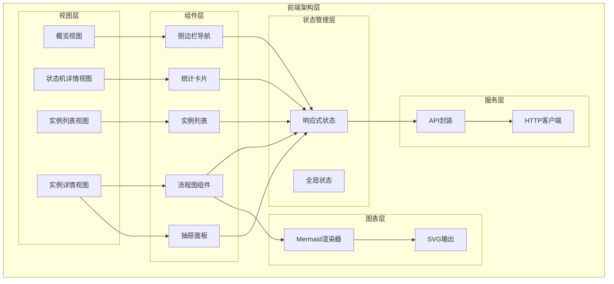

**图表来源**
- [app.js:30-848](file://state-machine-boot-starter/src/main/resources/console/js/app.js#L30-L848)
- [api.js:1-35](file://state-machine-boot-starter/src/main/resources/console/js/api.js#L1-L35)

**章节来源**
- [app.js:30-848](file://state-machine-boot-starter/src/main/resources/console/js/app.js#L30-L848)
- [api.js:1-35](file://state-machine-boot-starter/src/main/resources/console/js/api.js#L1-L35)

## 详细组件分析

### 应用初始化与生命周期
Vue应用通过createApp函数创建根实例，使用组合式API进行状态管理和逻辑组织：

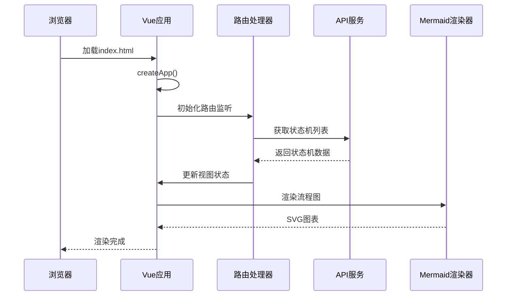

**图表来源**
- [index.html:10-11](file://state-machine-boot-starter/src/main/resources/console/index.html#L10-L11)
- [app.js:826-827](file://state-machine-boot-starter/src/main/resources/console/js/app.js#L826-L827)
- [api.js:1-35](file://state-machine-boot-starter/src/main/resources/console/js/api.js#L1-L35)

应用初始化的关键特性：
- **响应式状态**：使用ref和computed实现数据绑定
- **生命周期钩子**：onMounted处理DOM挂载后的初始化逻辑
- **事件监听**：监听hashchange实现SPA路由切换

**章节来源**
- [app.js:30-827](file://state-machine-boot-starter/src/main/resources/console/js/app.js#L30-L827)

### 路由配置与导航
系统采用哈希路由实现单页应用导航：

```mermaid
flowchart TD
START[页面加载] --> HASH[解析URL哈希]
HASH --> CHECK{检查路由类型}
CHECK --> |'/instances'| INSTANCES[实例列表视图]
CHECK --> |'/machine/{name}'| MACHINE[状态机详情视图]
CHECK --> |'/instance/{id}'| INSTANCE[实例详情视图]
CHECK --> |其他| DASHBOARD[概览视图]
INSTANCES --> LOAD_INSTANCES[加载实例数据]
MACHINE --> LOAD_MACHINE[加载状态机数据]
INSTANCE --> LOAD_DETAIL[加载实例详情]
DASHBOARD --> LOAD_DASHBOARD[加载概览数据]
LOAD_INSTANCES --> RENDER_INSTANCES[渲染实例列表]
LOAD_MACHINE --> RENDER_MACHINE[渲染状态机详情]
LOAD_DETAIL --> RENDER_DETAIL[渲染实例详情]
LOAD_DASHBOARD --> RENDER_DASHBOARD[渲染概览]
```

**图表来源**
- [app.js:813-824](file://state-machine-boot-starter/src/main/resources/console/js/app.js#L813-L824)

路由处理逻辑：
- **实例列表路由**：`#/instances` 显示所有实例
- **状态机详情路由**：`#/machine/{name}` 显示指定状态机的定义和实例
- **实例详情路由**：`#/instance/{id}` 显示具体实例的执行详情

**章节来源**
- [app.js:813-824](file://state-machine-boot-starter/src/main/resources/console/js/app.js#L813-L824)

### 状态管理与数据流
应用使用Vue 3的响应式系统管理状态：

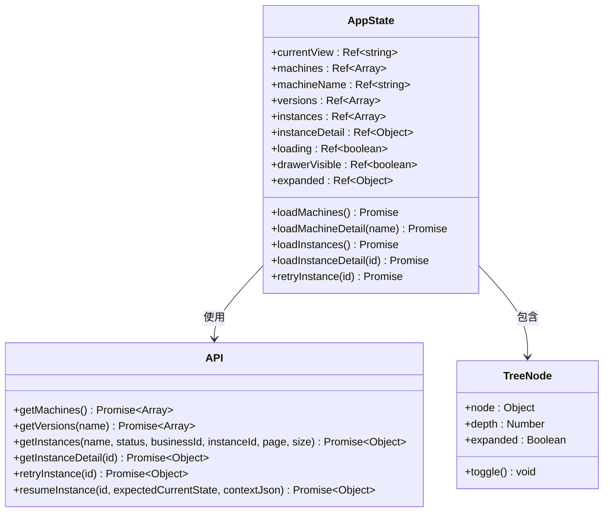

**图表来源**
- [app.js:30-848](file://state-machine-boot-starter/src/main/resources/console/js/app.js#L30-L848)
- [api.js:1-35](file://state-machine-boot-starter/src/main/resources/console/js/api.js#L1-L35)

状态管理特点：
- **单一数据源**：所有状态集中管理，避免重复数据
- **响应式更新**：自动追踪依赖，实现局部更新
- **异步数据处理**：使用Promise处理API调用

**章节来源**
- [app.js:30-848](file://state-machine-boot-starter/src/main/resources/console/js/app.js#L30-L848)
- [api.js:1-35](file://state-machine-boot-starter/src/main/resources/console/js/api.js#L1-L35)

### 页面布局与用户交互设计

#### 概览页面
概览页面提供系统级统计信息和快速导航：

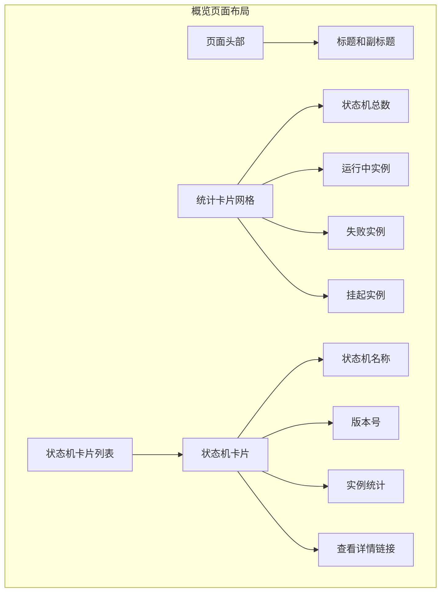

**图表来源**
- [index.html:61-143](file://state-machine-boot-starter/src/main/resources/console/index.html#L61-L143)

#### 状态机详情页面
状态机详情页面展示状态机定义和相关实例：

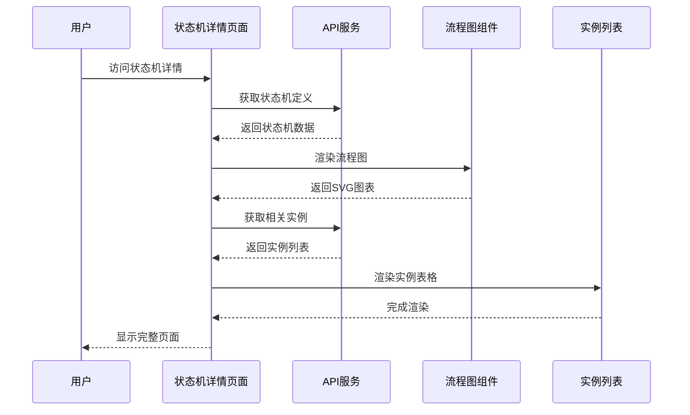

**图表来源**
- [index.html:146-286](file://state-machine-boot-starter/src/main/resources/console/index.html#L146-L286)
- [app.js:456-467](file://state-machine-boot-starter/src/main/resources/console/js/app.js#L456-L467)

**章节来源**
- [index.html:146-286](file://state-machine-boot-starter/src/main/resources/console/index.html#L146-L286)
- [app.js:456-467](file://state-machine-boot-starter/src/main/resources/console/js/app.js#L456-L467)

### 状态图显示功能与Mermaid集成

#### Mermaid图表渲染机制
系统使用Mermaid.js进行状态图可视化：

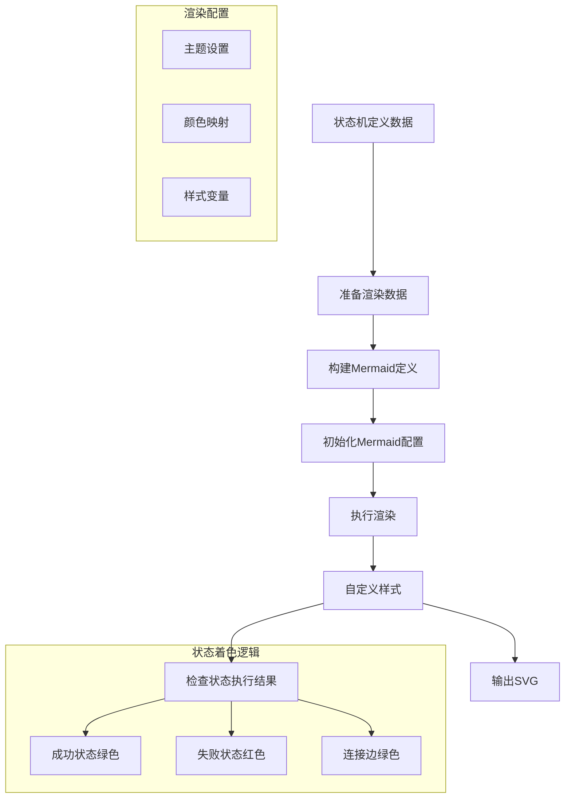

**图表来源**
- [app.js:563-811](file://state-machine-boot-starter/src/main/resources/console/js/app.js#L563-L811)

Mermaid渲染的关键特性：
- **动态配置**：根据状态机定义动态生成图表
- **状态着色**：根据实例执行状态为节点和边着色
- **主题定制**：支持自定义主题变量和样式

#### 节点样式定制
系统实现了智能的节点样式定制机制：

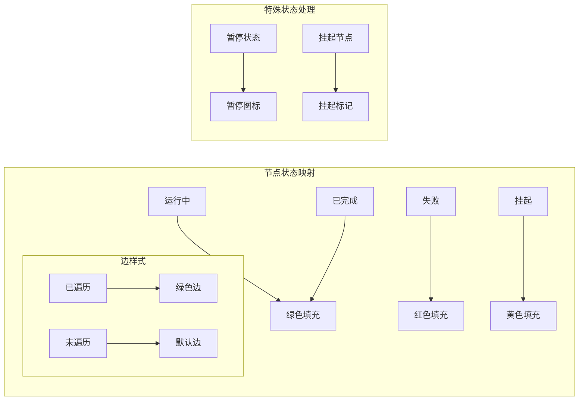

**图表来源**
- [app.js:522-644](file://state-machine-boot-starter/src/main/resources/console/js/app.js#L522-L644)

**章节来源**
- [app.js:563-811](file://state-machine-boot-starter/src/main/resources/console/js/app.js#L563-L811)

### CSS样式系统与响应式设计

#### 主题变量系统
系统采用CSS自定义属性实现主题定制：

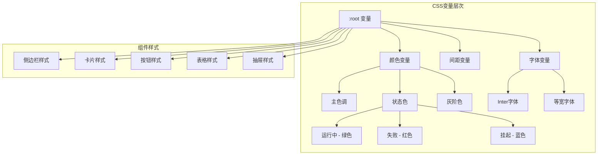

**图表来源**
- [style.css:2-40](file://state-machine-boot-starter/src/main/resources/console/css/style.css#L2-L40)

#### 响应式布局设计
系统支持多种屏幕尺寸的自适应布局：

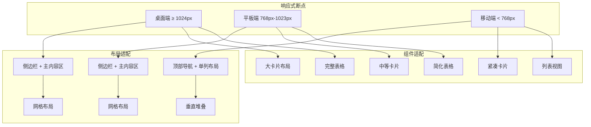

**图表来源**
- [style.css:293-398](file://state-machine-boot-starter/src/main/resources/console/css/style.css#L293-L398)

**章节来源**
- [style.css:1-1235](file://state-machine-boot-starter/src/main/resources/console/css/style.css#L1-L1235)

### 前端配置选项与自定义化支持

#### 配置选项
系统提供多种配置选项支持自定义：

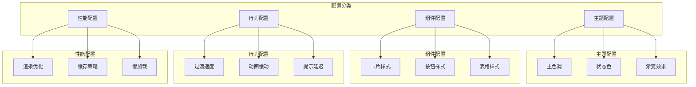

**图表来源**
- [app.js:563-744](file://state-machine-boot-starter/src/main/resources/console/js/app.js#L563-L744)

#### 自定义化支持
系统支持以下自定义化能力：
- **主题定制**：通过CSS变量修改颜色方案
- **布局调整**：响应式断点和布局适配
- **交互行为**：动画效果和过渡配置
- **组件样式**：卡片、按钮、表格等组件的样式定制

**章节来源**
- [app.js:563-744](file://state-machine-boot-starter/src/main/resources/console/js/app.js#L563-L744)

## 依赖关系分析

### 外部依赖
系统依赖以下关键外部库：

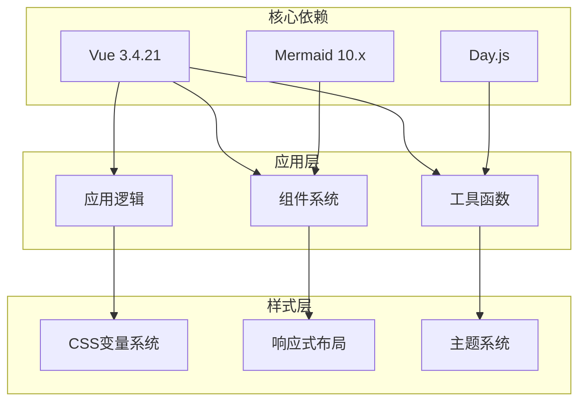

**图表来源**
- [vue.global.prod.js:1-12](file://state-machine-boot-starter/src/main/resources/console/js/vue.global.prod.js#L1-L12)
- [mermaid.min.js:1-6](file://state-machine-boot-starter/src/main/resources/console/js/mermaid.min.js#L1-L6)

### 内部模块依赖
应用内部模块之间的依赖关系：

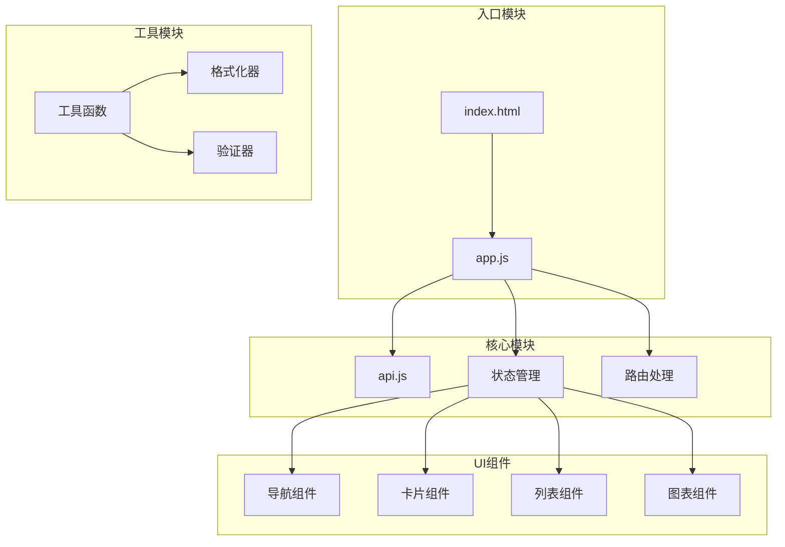

**图表来源**
- [index.html:1-665](file://state-machine-boot-starter/src/main/resources/console/index.html#L1-L665)
- [app.js:1-848](file://state-machine-boot-starter/src/main/resources/console/js/app.js#L1-L848)
- [api.js:1-35](file://state-machine-boot-starter/src/main/resources/console/js/api.js#L1-L35)

**章节来源**
- [index.html:1-665](file://state-machine-boot-starter/src/main/resources/console/index.html#L1-L665)
- [app.js:1-848](file://state-machine-boot-starter/src/main/resources/console/js/app.js#L1-L848)
- [api.js:1-35](file://state-machine-boot-starter/src/main/resources/console/js/api.js#L1-L35)

## 性能考虑
系统在性能方面采用了多项优化措施：

### 渲染优化
- **虚拟DOM**：Vue 3的响应式系统确保最小化DOM操作
- **懒加载**：图表组件按需渲染，避免不必要的计算
- **缓存策略**：API响应数据缓存，减少重复请求

### 内存管理
- **组件卸载**：路由切换时正确清理事件监听器
- **垃圾回收**：及时释放不再使用的对象引用
- **内存泄漏防护**：防止定时器和事件监听器的内存泄漏

### 网络优化
- **请求去重**：相同请求的并发处理
- **错误重试**：网络异常时的自动重试机制
- **超时控制**：合理的请求超时设置

## 故障排除指南

### 常见问题诊断
1. **页面空白问题**
   - 检查Vue脚本是否正确加载
   - 验证浏览器控制台是否有JavaScript错误
   - 确认API接口是否可访问

2. **图表不显示问题**
   - 检查Mermaid库是否正确加载
   - 验证状态机数据格式是否正确
   - 确认SVG渲染是否被阻止

3. **路由跳转问题**
   - 检查哈希路由配置
   - 验证路由处理器是否正常工作
   - 确认页面元素选择器是否正确

### 调试工具
- **浏览器开发者工具**：监控网络请求和JavaScript执行
- **Vue DevTools**：调试Vue组件状态和生命周期
- **Mermaid调试**：验证图表定义语法

**章节来源**
- [app.js:808-810](file://state-machine-boot-starter/src/main/resources/console/js/app.js#L808-L810)

## 结论
本Web界面采用现代前端技术栈，实现了功能完整、用户体验优秀的状态机控制台。系统具有以下优势：

- **架构清晰**：基于Vue 3的MVVM架构，组件化程度高
- **交互丰富**：支持实时数据更新和丰富的用户交互
- **可视化强**：集成Mermaid.js提供直观的状态图展示
- **响应式设计**：适配多种设备和屏幕尺寸
- **可扩展性**：模块化的架构便于功能扩展和维护

通过合理的状态管理、路由设计和性能优化，系统能够稳定高效地运行，为用户提供良好的状态机管理体验。

## 附录

### 开发者指南
1. **环境要求**
   - Node.js 14+
   - Vue 3.4.21+
   - 支持ES6的现代浏览器

2. **开发流程**
   - 修改CSS变量进行主题定制
   - 扩展Vue组件添加新功能
   - 新增API接口支持后端功能
   - 编写单元测试确保代码质量

3. **最佳实践**
   - 使用响应式数据管理状态
   - 合理使用计算属性和侦听器
   - 优化图表渲染性能
   - 实施错误边界处理

### API参考
系统提供完整的RESTful API接口，支持状态机的查询、实例管理等功能。API设计遵循REST规范，返回标准的JSON格式数据。