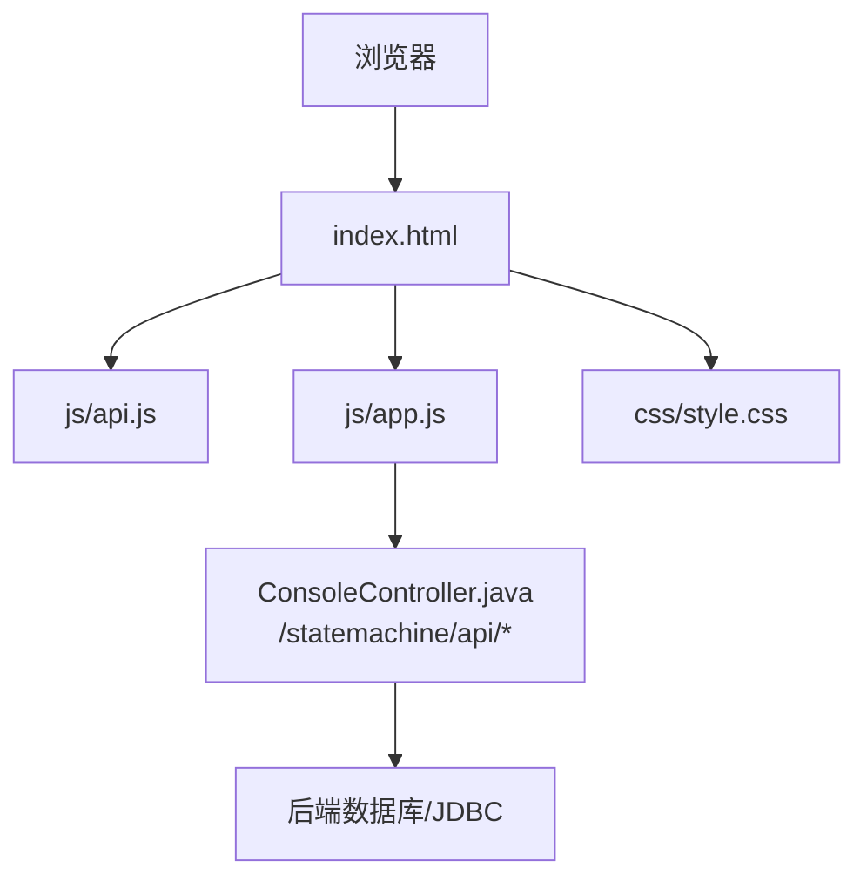
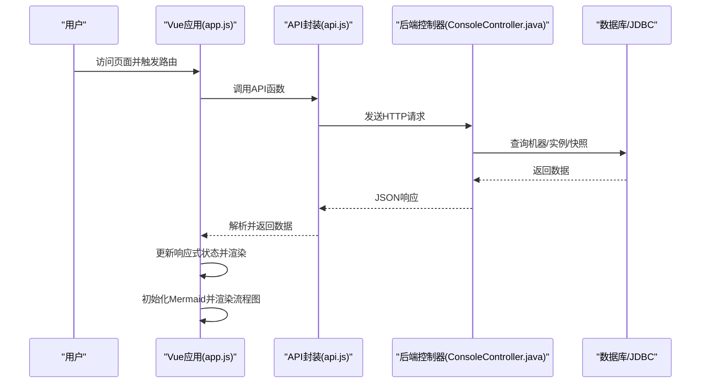
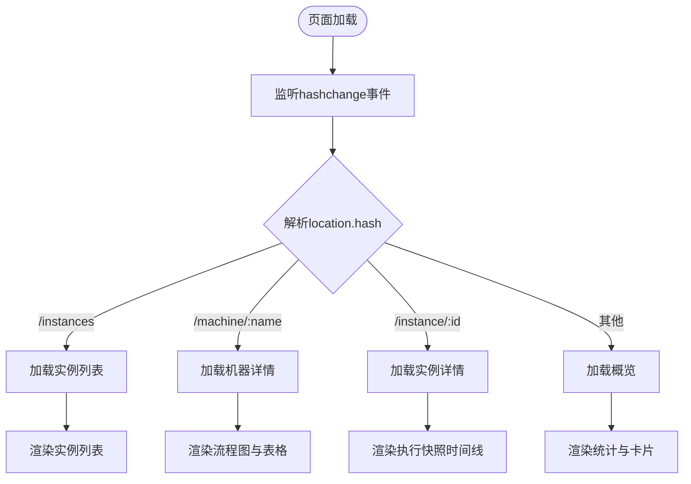
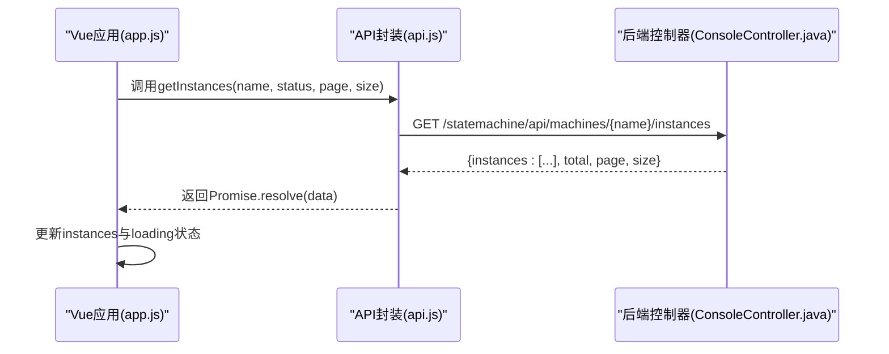
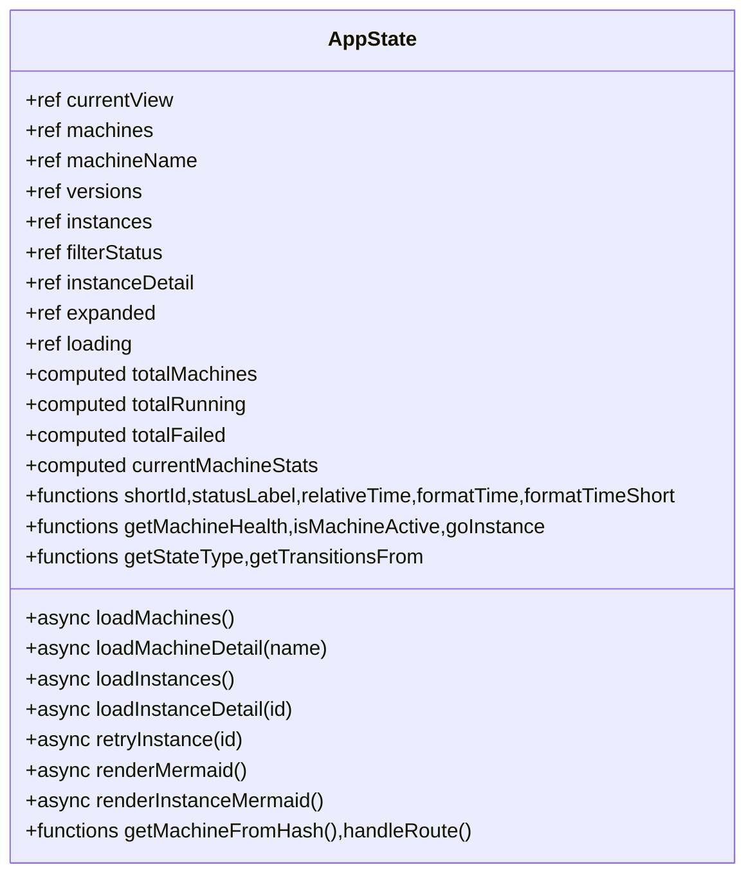
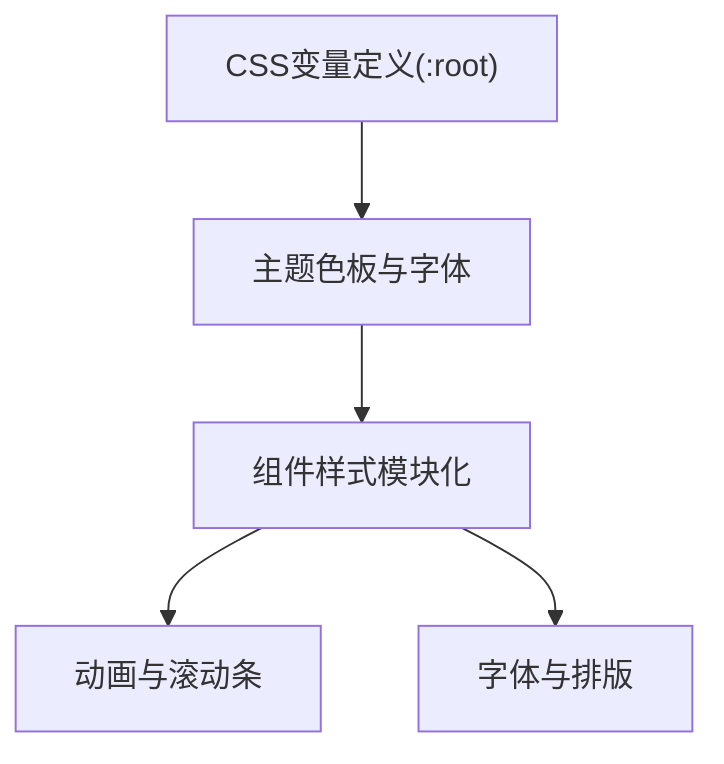
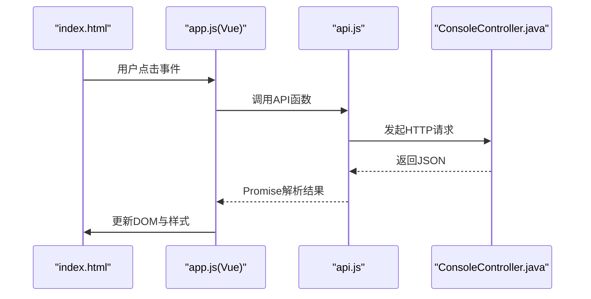
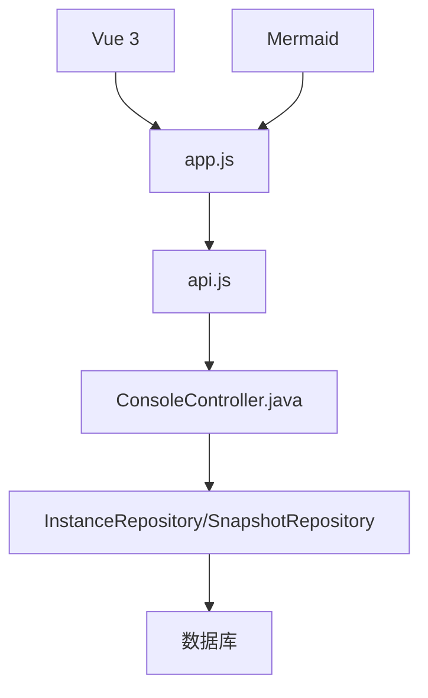

# 前端架构

<cite>
**本文引用的文件**
- [index.html](file://src/main/resources/static/statemachine/index.html)
- [api.js](file://src/main/resources/static/statemachine/js/api.js)
- [app.js](file://src/main/resources/static/statemachine/js/app.js)
- [style.css](file://src/main/resources/static/statemachine/css/style.css)
- [ConsoleController.java](file://src/main/java/cn/chedejun/statemachine/management/ConsoleController.java)
- [StateMachineEndpoint.java](file://src/main/java/cn/chedejun/statemachine/management/StateMachineEndpoint.java)
- [README.md](file://README.md)
</cite>

## 目录
1. [简介](#简介)
2. [项目结构](#项目结构)
3. [核心组件](#核心组件)
4. [架构总览](#架构总览)
5. [详细组件分析](#详细组件分析)
6. [依赖关系分析](#依赖关系分析)
7. [性能考量](#性能考量)
8. [故障排查指南](#故障排查指南)
9. [结论](#结论)
10. [附录](#附录)

## 简介
本项目为 Spring Boot 状态机扩展的管理控制台前端，采用 Vue.js 3 + Composition API 构建，结合 Mermaid 流程图渲染与自定义 CSS 主题系统，实现状态机概览、流程定义可视化、实例列表与执行快照的交互式浏览。后端通过 ConsoleController 暴露 REST API，前端通过 API.js 统一封装 HTTP 请求，app.js 负责路由与状态管理，index.html 提供页面骨架与视图模板，style.css 实现主题化样式体系。

## 项目结构
前端静态资源位于后端资源目录中，便于打包到 Spring Boot 应用内直接提供服务：
- HTML 页面：index.html
- 样式表：css/style.css
- 前端脚本：js/api.js、js/app.js
- 后端控制器：ConsoleController.java、StateMachineEndpoint.java

图表来源
- [index.html:1-347](file://src/main/resources/static/statemachine/index.html#L1-L347)
- [api.js:1-12](file://src/main/resources/static/statemachine/js/api.js#L1-L12)
- [app.js:1-242](file://src/main/resources/static/statemachine/js/app.js#L1-L242)
- [ConsoleController.java:1-106](file://src/main/java/cn/chedejun/statemachine/management/ConsoleController.java#L1-L106)

章节来源
- [index.html:1-347](file://src/main/resources/static/statemachine/index.html#L1-L347)
- [style.css:1-708](file://src/main/resources/static/statemachine/css/style.css#L1-L708)
- [api.js:1-12](file://src/main/resources/static/statemachine/js/api.js#L1-L12)
- [app.js:1-242](file://src/main/resources/static/statemachine/js/app.js#L1-L242)
- [ConsoleController.java:1-106](file://src/main/java/cn/chedejun/statemachine/management/ConsoleController.java#L1-L106)

## 核心组件
- 视图与布局：index.html 中的侧边栏、顶部面包屑、内容区与多视图容器，配合 Vue 的响应式数据驱动渲染。
- 数据层：api.js 封装对 /statemachine/api/* 的 HTTP 请求，统一返回 JSON。
- 控制器：app.js 使用 Vue 3 Composition API 管理应用状态、计算属性、生命周期钩子与路由处理。
- 样式系统：style.css 通过 CSS 变量与模块化类名构建主题与组件样式。
- 流程图：Mermaid 在 app.js 中初始化并渲染状态机流程图与实例执行快照图。

章节来源
- [index.html:14-347](file://src/main/resources/static/statemachine/index.html#L14-L347)
- [api.js:1-12](file://src/main/resources/static/statemachine/js/api.js#L1-L12)
- [app.js:1-242](file://src/main/resources/static/statemachine/js/app.js#L1-L242)
- [style.css:1-708](file://src/main/resources/static/statemachine/css/style.css#L1-L708)

## 架构总览
前端采用单页应用（SPA）风格，基于 hash 路由在客户端切换视图，避免整页刷新；后端提供 REST 接口，前端通过 fetch 获取数据并更新视图。Mermaid 在渲染时动态注入 SVG 样式以高亮节点状态。

图表来源
- [app.js:80-120](file://src/main/resources/static/statemachine/js/app.js#L80-L120)
- [api.js:1-12](file://src/main/resources/static/statemachine/js/api.js#L1-L12)
- [ConsoleController.java:34-99](file://src/main/java/cn/chedejun/statemachine/management/ConsoleController.java#L34-L99)

## 详细组件分析

### 视图与路由（index.html + app.js）
- 视图切换：通过 hashchange 事件监听与 currentView 响应式变量驱动，支持概览、机器详情、实例列表、实例详情四种视图。
- 侧边栏与面包屑：根据当前视图显示机器导航与路径提示。
- 列表与卡片：概览统计卡片、机器卡片网格、实例列表项等。
- 交互行为：刷新按钮、状态标签、JSON 展开/收起、重试按钮等。

图表来源
- [app.js:221-229](file://src/main/resources/static/statemachine/js/app.js#L221-L229)
- [index.html:44-57](file://src/main/resources/static/statemachine/index.html#L44-L57)

章节来源
- [index.html:14-347](file://src/main/resources/static/statemachine/index.html#L14-L347)
- [app.js:221-229](file://src/main/resources/static/statemachine/js/app.js#L221-L229)

### HTTP 请求封装（api.js）
- 功能：封装对后端 API 的 GET/POST 请求，包括机器列表、版本、实例列表、实例详情、重试。
- 参数：实例查询支持分页与状态过滤；重试通过 POST 触发。
- 返回：统一返回 JSON，供 app.js 解析与赋值。

图表来源
- [api.js:4-7](file://src/main/resources/static/statemachine/js/api.js#L4-L7)
- [ConsoleController.java:62-76](file://src/main/java/cn/chedejun/statemachine/management/ConsoleController.java#L62-L76)

章节来源
- [api.js:1-12](file://src/main/resources/static/statemachine/js/api.js#L1-L12)
- [ConsoleController.java:34-99](file://src/main/java/cn/chedejun/statemachine/management/ConsoleController.java#L34-L99)

### 状态管理与业务逻辑（app.js）
- 响应式状态：currentView、machines、machineName、versions、instances、filterStatus、instanceDetail、expanded、loading。
- 计算属性：totalMachines、totalRunning、totalFailed、currentMachineStats。
- 工具函数：shortId、statusLabel、relativeTime/formatTime、状态类型判断、转换查询。
- 生命周期：onMounted 注册 hashchange 监听；异步加载数据；等待 DOM 渲染后调用 Mermaid。
- Mermaid 渲染：两处渲染逻辑，分别用于机器流程图与实例流程图，动态注入节点颜色样式。

图表来源
- [app.js:3-241](file://src/main/resources/static/statemachine/js/app.js#L3-L241)

章节来源
- [app.js:1-242](file://src/main/resources/static/statemachine/js/app.js#L1-L242)

### 样式系统与主题定制（style.css）
- CSS 变量：集中定义主题色板、字体族、圆角、阴影、动画过渡等，便于全局主题定制。
- 组件化样式：侧边栏、顶部栏、卡片、统计卡、过滤芯片、实例列表、流程图容器、时间线等模块化类名。
- 动画与滚动条：统一的淡入动画与自定义滚动条样式。
- 字体与排版：使用 Inter 作为无衬线字体，JetBrains Mono 作为等宽字体，保证代码块可读性。

图表来源
- [style.css:1-708](file://src/main/resources/static/statemachine/css/style.css#L1-L708)

章节来源
- [style.css:1-708](file://src/main/resources/static/statemachine/css/style.css#L1-L708)

### 组件间通信与事件处理机制
- 单向数据流：app.js 通过响应式 ref/computed 管理状态，index.html 通过 v-if/v-for/v-bind/v-on 等指令绑定数据与事件。
- 事件处理：按钮点击、hashchange、JSON 展开/收起、刷新按钮等。
- 与后端通信：fetch 请求在 app.js 中触发，API.js 统一封装，ConsoleController 提供 REST 接口。

图表来源
- [index.html:52-56](file://src/main/resources/static/statemachine/index.html#L52-L56)
- [app.js:121-124](file://src/main/resources/static/statemachine/js/app.js#L121-L124)
- [api.js:9-10](file://src/main/resources/static/statemachine/js/api.js#L9-L10)
- [ConsoleController.java:78-89](file://src/main/java/cn/chedejun/statemachine/management/ConsoleController.java#L78-L89)

章节来源
- [index.html:52-56](file://src/main/resources/static/statemachine/index.html#L52-L56)
- [app.js:121-124](file://src/main/resources/static/statemachine/js/app.js#L121-L124)
- [api.js:1-12](file://src/main/resources/static/statemachine/js/api.js#L1-L12)
- [ConsoleController.java:34-99](file://src/main/java/cn/chedejun/statemachine/management/ConsoleController.java#L34-L99)

## 依赖关系分析
- 前端依赖：Vue 3（Composition API）、Mermaid（流程图渲染）、本地 CSS 变量与类名。
- 后端依赖：Spring MVC 控制器、JDBC 模板、Jackson 对象映射、状态机注册表与仓库。
- 资源加载：index.html 引入外部 CDN 的 Vue 与 Mermaid，本地引入 api.js、app.js、style.css。

图表来源
- [index.html:10-11](file://src/main/resources/static/statemachine/index.html#L10-L11)
- [app.js:1-242](file://src/main/resources/static/statemachine/js/app.js#L1-L242)
- [api.js:1-12](file://src/main/resources/static/statemachine/js/api.js#L1-L12)
- [ConsoleController.java:23-32](file://src/main/java/cn/chedejun/statemachine/management/ConsoleController.java#L23-L32)

章节来源
- [index.html:10-11](file://src/main/resources/static/statemachine/index.html#L10-L11)
- [ConsoleController.java:23-32](file://src/main/java/cn/chedejun/statemachine/management/ConsoleController.java#L23-L32)

## 性能考量
- 资源加载优化：CDN 加载 Vue 与 Mermaid，减少本地体积；CSS 与 JS 本地托管，利于缓存。
- 渲染优化：Mermaid 初始化与渲染分离，仅在目标元素存在时执行；使用 nextTick 与 requestAnimationFrame 确保 DOM 更新后再渲染。
- 数据加载：分页参数传递给后端，避免一次性拉取大量实例；加载状态 loading 控制 UI 呈现。
- 样式性能：CSS 变量集中管理，避免重复计算；动画时长短、数量少，降低重绘压力。

## 故障排查指南
- 网络请求失败
  - 检查后端是否正确映射 /statemachine/* 路径，确认 ConsoleController 是否启用。
  - 确认浏览器网络面板中 /statemachine/api/* 请求状态码与响应体。
- 流程图不显示
  - 确认 Mermaid 初始化参数与 DOM 元素存在；检查 renderMermaid/renderInstanceMermaid 是否被调用。
  - 查看控制台是否有渲染异常日志。
- 实例重试无效
  - 确认实例状态为 FAILED；检查 ConsoleController 的 POST /statemachine/api/instances/{id}/retry 是否成功。
- 样式异常
  - 检查 style.css 是否正确加载；确认 CSS 变量未被覆盖或冲突。

章节来源
- [ConsoleController.java:78-104](file://src/main/java/cn/chedejun/statemachine/management/ConsoleController.java#L78-L104)
- [app.js:126-214](file://src/main/resources/static/statemachine/js/app.js#L126-L214)
- [style.css:1-708](file://src/main/resources/static/statemachine/css/style.css#L1-L708)

## 结论
该前端架构以 Vue 3 + Composition API 为核心，结合 Mermaid 流程图与模块化 CSS，实现了状态机控制台的高效交互体验。通过 api.js 统一封装 HTTP 请求，app.js 负责路由与状态管理，index.html 提供清晰的视图结构，style.css 提供一致的主题风格。后端 ConsoleController 提供稳定的 REST 接口，支撑前端完整功能链路。

## 附录

### 开发环境搭建与调试
- 启动后端：确保 Spring Boot 应用启动并暴露 /statemachine/ 路由。
- 访问控制台：在浏览器打开 http://localhost:8080/statemachine/。
- 调试技巧：
  - 在 app.js 中设置断点观察状态变化与路由切换。
  - 在浏览器开发者工具 Network 面板检查 /statemachine/api/* 请求。
  - 在 ConsoleController 中添加日志定位数据问题。

章节来源
- [README.md:51-53](file://README.md#L51-L53)
- [ConsoleController.java:19-22](file://src/main/java/cn/chedejun/statemachine/management/ConsoleController.java#L19-L22)

### 静态资源加载与缓存策略
- 资源位置：index.html 位于 /static/statemachine/，所有静态资源通过相对路径引用。
- 缓存建议：
  - CSS/JS 文件名加入哈希后缀（如 style.css?v=...），以强制刷新新版本。
  - 设置合理的 Cache-Control 与 ETag，提升二次访问速度。
  - CDN 资源可利用浏览器缓存，但需注意版本号变更以避免陈旧缓存。

章节来源
- [index.html:7-11](file://src/main/resources/static/statemachine/index.html#L7-L11)
- [style.css:1-708](file://src/main/resources/static/statemachine/css/style.css#L1-L708)