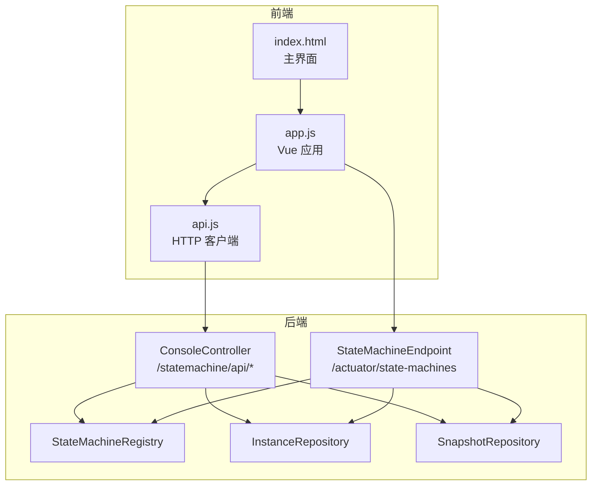
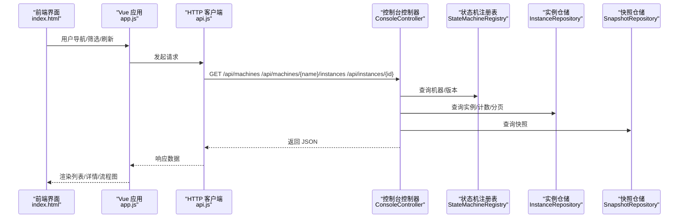
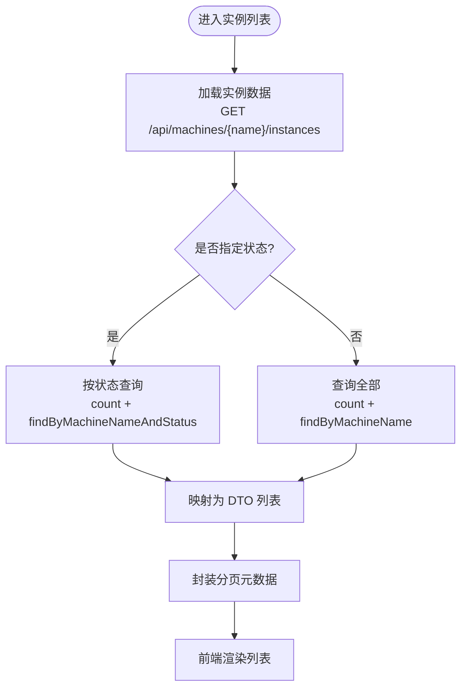
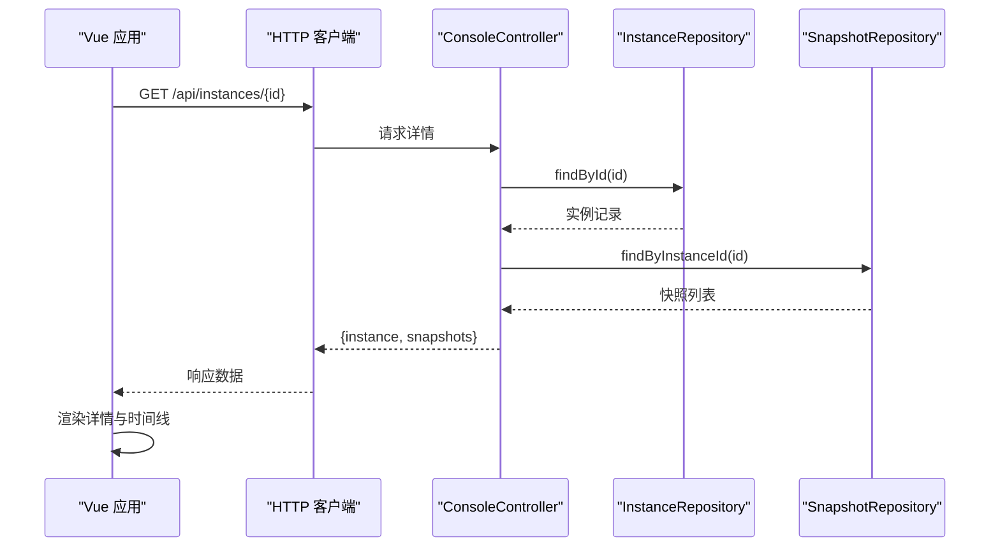
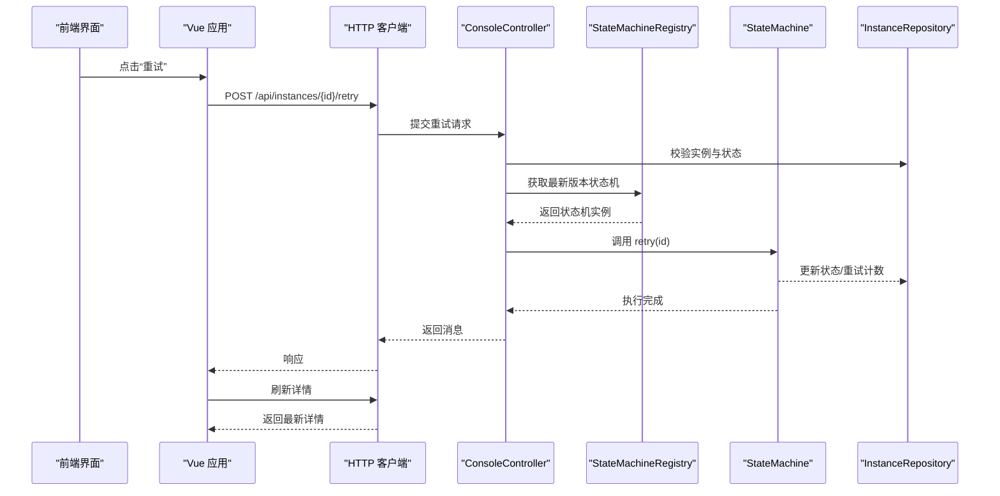
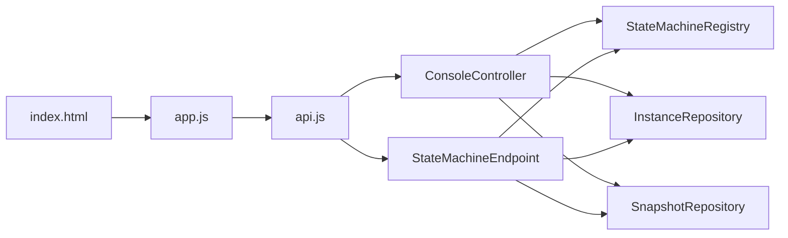
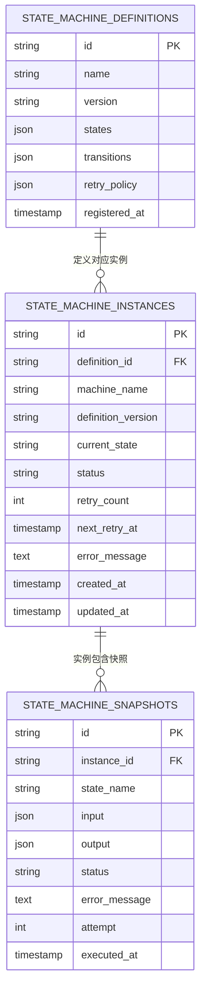

# 实例管理

<cite>
**本文引用的文件**
- [ConsoleController.java](file://src/main/java/cn/chedejun/statemachine/management/ConsoleController.java)
- [StateMachineEndpoint.java](file://src/main/java/cn/chedejun/statemachine/management/StateMachineEndpoint.java)
- [InstanceRepository.java](file://src/main/java/cn/chedejun/statemachine/persistence/InstanceRepository.java)
- [SnapshotRepository.java](file://src/main/java/cn/chedejun/statemachine/persistence/SnapshotRepository.java)
- [InstanceDTO.java](file://src/main/java/cn/chedejun/statemachine/management/dto/InstanceDTO.java)
- [SnapshotDTO.java](file://src/main/java/cn/chedejun/statemachine/management/dto/SnapshotDTO.java)
- [index.html](file://src/main/resources/static/statemachine/index.html)
- [app.js](file://src/main/resources/static/statemachine/js/app.js)
- [api.js](file://src/main/resources/static/statemachine/js/api.js)
- [StateMachine.java](file://src/main/java/cn/chedejun/statemachine/core/StateMachine.java)
- [RetryPolicy.java](file://src/main/java/cn/chedejun/statemachine/core/RetryPolicy.java)
- [h2.sql](file://src/main/resources/ddl/h2.sql)
- [mysql.sql](file://src/main/resources/ddl/mysql.sql)
- [postgresql.sql](file://src/main/resources/ddl/postgresql.sql)
</cite>

## 目录
1. [简介](#简介)
2. [项目结构](#项目结构)
3. [核心组件](#核心组件)
4. [架构总览](#架构总览)
5. [详细组件分析](#详细组件分析)
6. [依赖分析](#依赖分析)
7. [性能考虑](#性能考虑)
8. [故障排查指南](#故障排查指南)
9. [结论](#结论)
10. [附录](#附录)

## 简介
本文件面向“状态机实例管理”功能，围绕以下目标进行系统化说明：实例列表的展示与筛选（按状态过滤、分页）、实例详情查看（状态跟踪、错误信息、重试次数统计）、手动重试机制（触发与流程）、实例状态的实时更新与前端交互、安全控制与权限验证建议、批量操作与数据导出扩展点、以及实例历史记录的查询与统计能力。文档同时提供可视化图表帮助理解前后端协作与状态流转。

## 项目结构
该模块采用前后端分离的静态页面 + 后端控制器/端点的架构：
- 前端静态资源位于 static/statemachine，包含 HTML、CSS、JS 与 Vue 应用入口
- 后端提供两类接口：基于 Spring MVC 的 ConsoleController（用于 Web 控制台）与 Actuator Endpoint（用于运维访问）

**图表来源**
- [index.html](file://src/main/resources/static/statemachine/index.html)
- [app.js](file://src/main/resources/static/statemachine/js/app.js)
- [api.js](file://src/main/resources/static/statemachine/js/api.js)
- [ConsoleController.java](file://src/main/java/cn/chedejun/statemachine/management/ConsoleController.java)
- [StateMachineEndpoint.java](file://src/main/java/cn/chedejun/statemachine/management/StateMachineEndpoint.java)
- [StateMachineRegistry.java](file://src/main/java/cn/chedejun/statemachine/core/StateMachineRegistry.java)
- [InstanceRepository.java](file://src/main/java/cn/chedejun/statemachine/persistence/InstanceRepository.java)
- [SnapshotRepository.java](file://src/main/java/cn/chedejun/statemachine/persistence/SnapshotRepository.java)

**章节来源**
- [index.html](file://src/main/resources/static/statemachine/index.html)
- [app.js](file://src/main/resources/static/statemachine/js/app.js)
- [api.js](file://src/main/resources/static/statemachine/js/api.js)
- [ConsoleController.java](file://src/main/java/cn/chedejun/statemachine/management/ConsoleController.java)
- [StateMachineEndpoint.java](file://src/main/java/cn/chedejun/statemachine/management/StateMachineEndpoint.java)

## 核心组件
- 控制器层
  - ConsoleController：提供 Web 控制台所需的 REST 接口，支持机器与实例列表、详情、手动重试等
  - StateMachineEndpoint：通过 Actuator 暴露只读/写操作，便于运维或集成系统调用
- 数据访问层
  - InstanceRepository：实例表的 CRUD、分页、计数、状态更新、重试计数与下次重试时间维护
  - SnapshotRepository：实例执行快照的保存与查询，按状态与尝试次数排序
- DTO 层
  - InstanceDTO、SnapshotDTO：用于接口响应的数据传输对象
- 前端应用
  - index.html + app.js + api.js：Vue 应用负责路由、筛选、刷新、重试触发与流程图渲染

**章节来源**
- [ConsoleController.java](file://src/main/java/cn/chedejun/statemachine/management/ConsoleController.java)
- [StateMachineEndpoint.java](file://src/main/java/cn/chedejun/statemachine/management/StateMachineEndpoint.java)
- [InstanceRepository.java](file://src/main/java/cn/chedejun/statemachine/persistence/InstanceRepository.java)
- [SnapshotRepository.java](file://src/main/java/cn/chedejun/statemachine/persistence/SnapshotRepository.java)
- [InstanceDTO.java](file://src/main/java/cn/chedejun/statemachine/management/dto/InstanceDTO.java)
- [SnapshotDTO.java](file://src/main/java/cn/chedejun/statemachine/management/dto/SnapshotDTO.java)
- [index.html](file://src/main/resources/static/statemachine/index.html)
- [app.js](file://src/main/resources/static/statemachine/js/app.js)
- [api.js](file://src/main/resources/static/statemachine/js/api.js)

## 架构总览
下图展示了实例管理在系统中的位置与交互路径，从前端到后端再到持久层的完整链路。

**图表来源**
- [index.html](file://src/main/resources/static/statemachine/index.html)
- [app.js](file://src/main/resources/static/statemachine/js/app.js)
- [api.js](file://src/main/resources/static/statemachine/js/api.js)
- [ConsoleController.java](file://src/main/java/cn/chedejun/statemachine/management/ConsoleController.java)
- [StateMachineRegistry.java](file://src/main/java/cn/chedejun/statemachine/core/StateMachineRegistry.java)
- [InstanceRepository.java](file://src/main/java/cn/chedejun/statemachine/persistence/InstanceRepository.java)
- [SnapshotRepository.java](file://src/main/java/cn/chedejun/statemachine/persistence/SnapshotRepository.java)

## 详细组件分析

### 实例列表展示与筛选
- 支持按状态过滤：RUNNING、COMPLETED、FAILED；未指定则返回全部
- 分页参数：page（默认 0）、size（默认 20），服务端按偏移量与限制返回
- 返回结构：包含实例数组、总数、当前页码与大小，便于前端构建分页控件
- 前端筛选：支持全站与单机两种视图下的状态筛选按钮，点击后重新加载数据

**图表来源**
- [ConsoleController.java](file://src/main/java/cn/chedejun/statemachine/management/ConsoleController.java)
- [InstanceRepository.java](file://src/main/java/cn/chedejun/statemachine/persistence/InstanceRepository.java)
- [InstanceDTO.java](file://src/main/java/cn/chedejun/statemachine/management/dto/InstanceDTO.java)
- [api.js](file://src/main/resources/static/statemachine/js/api.js)
- [app.js](file://src/main/resources/static/statemachine/js/app.js)

**章节来源**
- [ConsoleController.java](file://src/main/java/cn/chedejun/statemachine/management/ConsoleController.java)
- [InstanceRepository.java](file://src/main/java/cn/chedejun/statemachine/persistence/InstanceRepository.java)
- [InstanceDTO.java](file://src/main/java/cn/chedejun/statemachine/management/dto/InstanceDTO.java)
- [api.js](file://src/main/resources/static/statemachine/js/api.js)
- [app.js](file://src/main/resources/static/statemachine/js/app.js)

### 实例详情查看
- 接口：GET /api/instances/{id}
- 返回内容：实例基本信息 + 执行快照集合（按执行时间与尝试次数排序）
- 前端展示：状态标签、实例 ID、状态机名、当前状态、重试次数、错误信息、创建时间；执行快照以时间线形式呈现，包含输入输出与错误信息
- 流程图：根据实例所属状态机的最新版本生成流程图，并按快照结果为节点着色（成功/失败）

**图表来源**
- [ConsoleController.java](file://src/main/java/cn/chedejun/statemachine/management/ConsoleController.java)
- [InstanceRepository.java](file://src/main/java/cn/chedejun/statemachine/persistence/InstanceRepository.java)
- [SnapshotRepository.java](file://src/main/java/cn/chedejun/statemachine/persistence/SnapshotRepository.java)
- [InstanceDTO.java](file://src/main/java/cn/chedejun/statemachine/management/dto/InstanceDTO.java)
- [SnapshotDTO.java](file://src/main/java/cn/chedejun/statemachine/management/dto/SnapshotDTO.java)
- [api.js](file://src/main/resources/static/statemachine/js/api.js)
- [app.js](file://src/main/resources/static/statemachine/js/app.js)

**章节来源**
- [ConsoleController.java](file://src/main/java/cn/chedejun/statemachine/management/ConsoleController.java)
- [InstanceRepository.java](file://src/main/java/cn/chedejun/statemachine/persistence/InstanceRepository.java)
- [SnapshotRepository.java](file://src/main/java/cn/chedejun/statemachine/persistence/SnapshotRepository.java)
- [InstanceDTO.java](file://src/main/java/cn/chedejun/statemachine/management/dto/InstanceDTO.java)
- [SnapshotDTO.java](file://src/main/java/cn/chedejun/statemachine/management/dto/SnapshotDTO.java)
- [api.js](file://src/main/resources/static/statemachine/js/api.js)
- [app.js](file://src/main/resources/static/statemachine/js/app.js)

### 手动重试机制
- 触发方式：前端点击“重试”按钮，调用 POST /api/instances/{id}/retry
- 后端逻辑：
  - ConsoleController：校验实例存在性与状态，获取最新版本状态机，调用其 retry 方法，返回重试后的当前状态
  - StateMachine.retry：仅允许 FAILED 状态实例重试；将状态置为 RUNNING、重试计数清零，并从当前状态继续执行
- 前端反馈：重试成功后刷新详情，展示新的状态与快照

**图表来源**
- [ConsoleController.java](file://src/main/java/cn/chedejun/statemachine/management/ConsoleController.java)
- [StateMachine.java](file://src/main/java/cn/chedejun/statemachine/core/StateMachine.java)
- [InstanceRepository.java](file://src/main/java/cn/chedejun/statemachine/persistence/InstanceRepository.java)
- [api.js](file://src/main/resources/static/statemachine/js/api.js)
- [app.js](file://src/main/resources/static/statemachine/js/app.js)

**章节来源**
- [ConsoleController.java](file://src/main/java/cn/chedejun/statemachine/management/ConsoleController.java)
- [StateMachine.java](file://src/main/java/cn/chedejun/statemachine/core/StateMachine.java)
- [InstanceRepository.java](file://src/main/java/cn/chedejun/statemachine/persistence/InstanceRepository.java)
- [api.js](file://src/main/resources/static/statemachine/js/api.js)
- [app.js](file://src/main/resources/static/statemachine/js/app.js)

### 实时更新与前端交互
- 列表刷新：实例列表页提供“刷新”按钮，点击后重新拉取数据并更新视图
- 路由驱动：通过 URL hash 变化驱动视图切换（概览、机器详情、实例列表、实例详情）
- 流程图渲染：使用 Mermaid 动态生成状态机与实例执行流程图，并根据快照结果为节点上色

**章节来源**
- [index.html](file://src/main/resources/static/statemachine/index.html)
- [app.js](file://src/main/resources/static/statemachine/js/app.js)

### 安全控制与权限验证
- 当前实现未内置认证/授权检查，建议在网关或应用层增加：
  - 基于角色的访问控制（RBAC），限制对 /statemachine/* 与 /actuator/state-machines 的访问
  - 对敏感操作（如重试）增加二次确认与审计日志
  - 使用 HTTPS 与 CSRF 防护
- Actuator 端点默认受 Spring Boot Actuator 安全策略保护，需谨慎开放

**章节来源**
- [StateMachineEndpoint.java](file://src/main/java/cn/chedejun/statemachine/management/StateMachineEndpoint.java)

### 批量操作与数据导出
- 批量操作：当前未提供批量重试/删除等操作，可在 ConsoleController 中扩展批量接口
- 数据导出：当前未提供导出功能，可新增导出接口（如 CSV/JSON），将实例与快照数据导出

**章节来源**
- [ConsoleController.java](file://src/main/java/cn/chedejun/statemachine/management/ConsoleController.java)

### 实例历史记录与统计
- 历史记录：通过 SnapshotRepository 查询实例的所有执行快照，按时间与尝试次数排序，支持查看每一步的输入、输出与错误
- 统计维度：前端可基于实例与快照数据计算运行中/失败数量、平均耗时、重试分布等指标

**章节来源**
- [SnapshotRepository.java](file://src/main/java/cn/chedejun/statemachine/persistence/SnapshotRepository.java)
- [SnapshotDTO.java](file://src/main/java/cn/chedejun/statemachine/management/dto/SnapshotDTO.java)
- [app.js](file://src/main/resources/static/statemachine/js/app.js)

## 依赖分析
- 控制器依赖状态机注册表与仓储层，确保能查询定义、实例与快照
- 前端通过 api.js 统一发起请求，app.js 负责路由与渲染，index.html 提供布局与样式

**图表来源**
- [api.js](file://src/main/resources/static/statemachine/js/api.js)
- [ConsoleController.java](file://src/main/java/cn/chedejun/statemachine/management/ConsoleController.java)
- [StateMachineEndpoint.java](file://src/main/java/cn/chedejun/statemachine/management/StateMachineEndpoint.java)
- [StateMachineRegistry.java](file://src/main/java/cn/chedejun/statemachine/core/StateMachineRegistry.java)
- [InstanceRepository.java](file://src/main/java/cn/chedejun/statemachine/persistence/InstanceRepository.java)
- [SnapshotRepository.java](file://src/main/java/cn/chedejun/statemachine/persistence/SnapshotRepository.java)
- [app.js](file://src/main/resources/static/statemachine/js/app.js)
- [index.html](file://src/main/resources/static/statemachine/index.html)

**章节来源**
- [api.js](file://src/main/resources/static/statemachine/js/api.js)
- [ConsoleController.java](file://src/main/java/cn/chedejun/statemachine/management/ConsoleController.java)
- [StateMachineEndpoint.java](file://src/main/java/cn/chedejun/statemachine/management/StateMachineEndpoint.java)
- [StateMachineRegistry.java](file://src/main/java/cn/chedejun/statemachine/core/StateMachineRegistry.java)
- [InstanceRepository.java](file://src/main/java/cn/chedejun/statemachine/persistence/InstanceRepository.java)
- [SnapshotRepository.java](file://src/main/java/cn/chedejun/statemachine/persistence/SnapshotRepository.java)
- [app.js](file://src/main/resources/static/statemachine/js/app.js)
- [index.html](file://src/main/resources/static/statemachine/index.html)

## 性能考虑
- 分页与索引：实例查询使用偏移量与限制，建议在 machine_name、status、created_at 上建立复合索引以提升分页与筛选性能
- 快照查询：按实例 ID 与执行时间排序，建议在 instance_id、executed_at 上建立索引
- JSON 字段：不同数据库对 JSON 字段的存储与查询性能差异较大，MySQL/PG 的 JSON/JSONB 更利于检索
- 前端渲染：大量快照时建议虚拟滚动与懒加载，避免一次性渲染过多 DOM

[本节为通用指导，无需特定文件引用]

## 故障排查指南
- 实例不存在：接口返回错误提示，前端应提示用户刷新或检查 ID
- 状态非 FAILED：手动重试仅允许 FAILED 状态，否则返回状态不符的提示
- 重试失败：后端捕获异常并返回失败原因，前端展示错误信息并允许再次重试
- 数据库连接：若仓储初始化失败，状态机执行会抛出未初始化异常，需检查数据源配置

**章节来源**
- [ConsoleController.java](file://src/main/java/cn/chedejun/statemachine/management/ConsoleController.java)
- [StateMachine.java](file://src/main/java/cn/chedejun/statemachine/core/StateMachine.java)

## 结论
本功能通过清晰的前后端职责划分，提供了完整的实例管理能力：列表筛选与分页、详情查看与历史追踪、手动重试与流程图可视化。建议后续增强安全控制、批量操作与数据导出能力，并结合数据库索引优化与前端性能优化进一步提升用户体验。

## 附录

### 数据模型与字段说明
- 实例表（state_machine_instances）
  - 关键字段：id、definition_id、machine_name、definition_version、current_state、status、retry_count、next_retry_at、error_message、created_at、updated_at
- 快照表（state_machine_snapshots）
  - 关键字段：id、instance_id、state_name、input、output、status、error_message、attempt、executed_at
- 定义表（state_machine_definitions）
  - 关键字段：id、name、version、states、transitions、retry_policy、registered_at

**图表来源**
- [h2.sql](file://src/main/resources/ddl/h2.sql)
- [mysql.sql](file://src/main/resources/ddl/mysql.sql)
- [postgresql.sql](file://src/main/resources/ddl/postgresql.sql)

### API 定义概览
- GET /statemachine/api/machines：获取所有机器与运行中/失败实例计数
- GET /statemachine/api/machines/{name}/versions：获取某机器版本列表
- GET /statemachine/api/machines/{name}/instances：按状态与分页获取实例列表
- GET /statemachine/api/instances/{id}：获取实例详情与快照
- POST /statemachine/api/instances/{id}/retry：手动重试失败实例
- GET /actuator/state-machines：Actuator 端点（只读/写操作）

**章节来源**
- [ConsoleController.java](file://src/main/java/cn/chedejun/statemachine/management/ConsoleController.java)
- [StateMachineEndpoint.java](file://src/main/java/cn/chedejun/statemachine/management/StateMachineEndpoint.java)