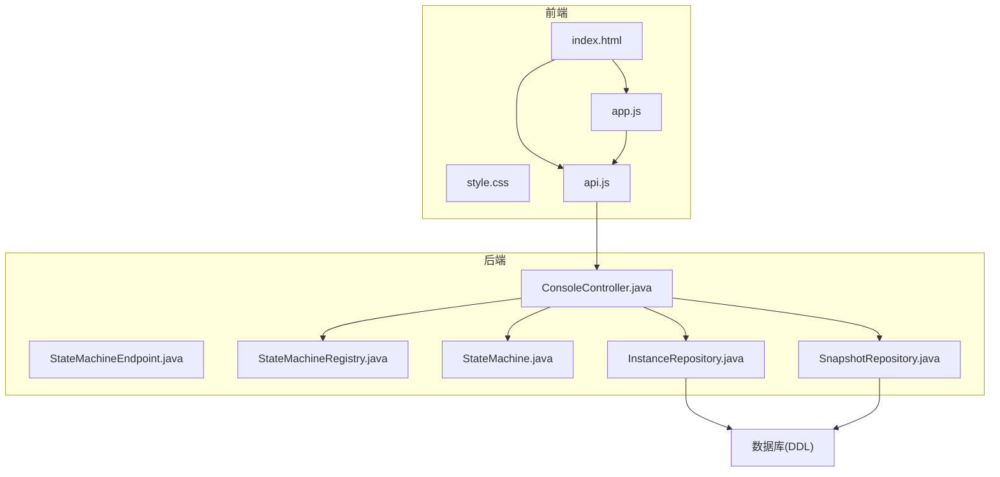
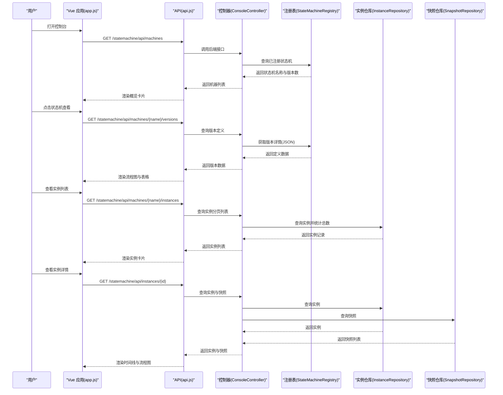
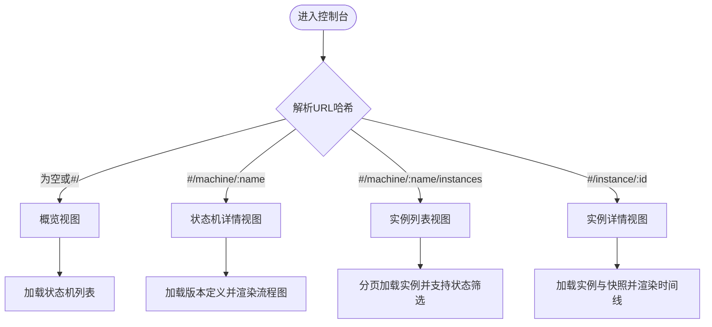
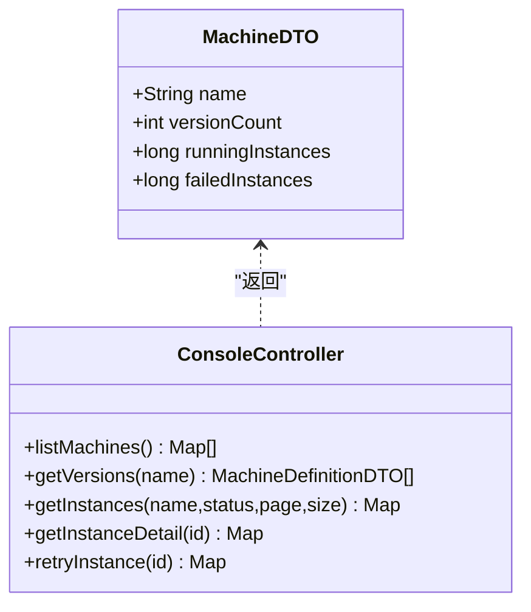
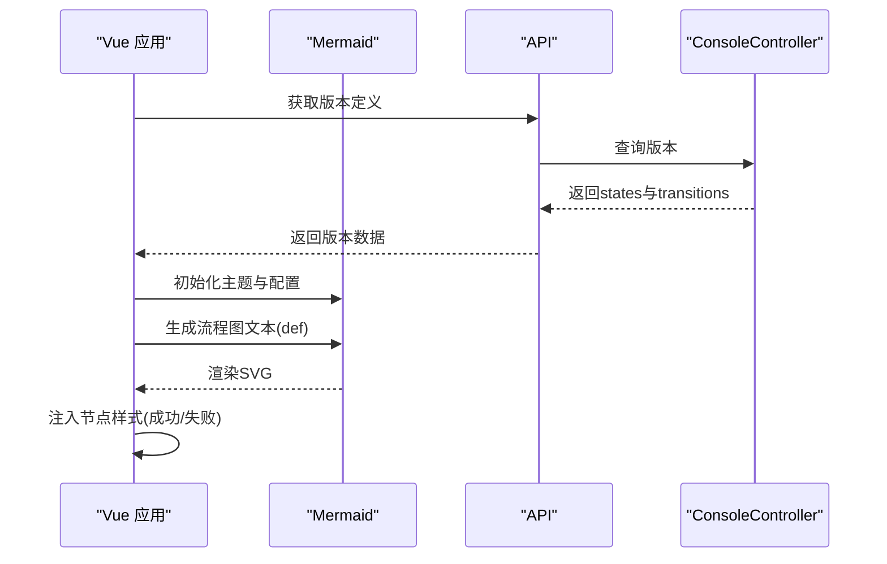
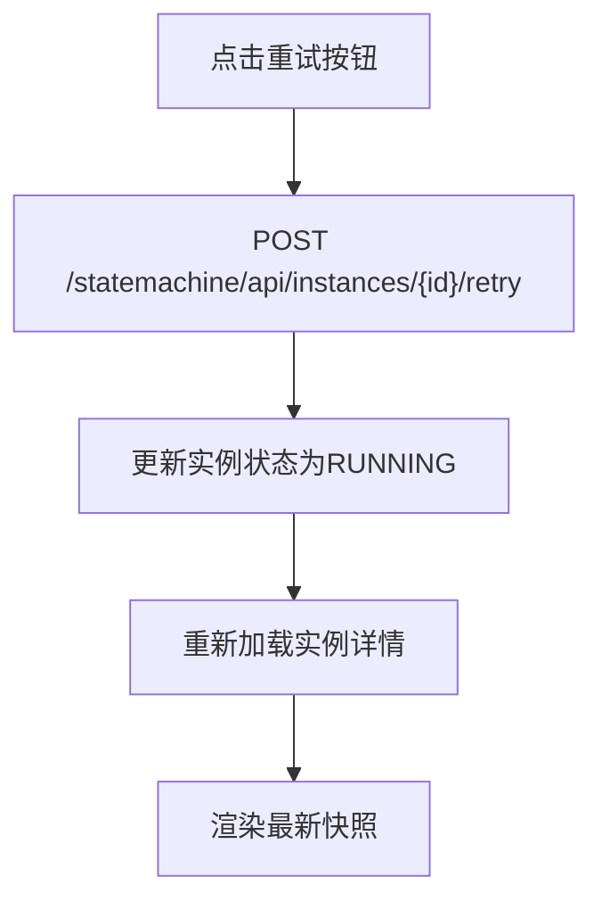
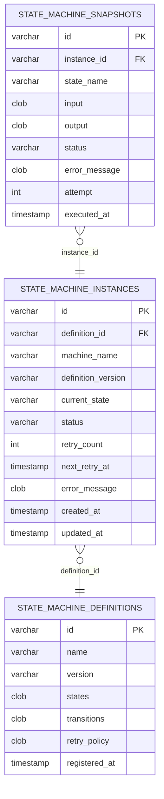
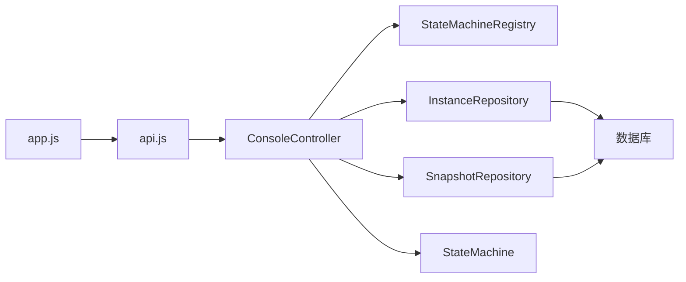

# 控制台概览

<cite>
**本文档引用的文件**
- [index.html](file://src/main/resources/static/statemachine/index.html)
- [app.js](file://src/main/resources/static/statemachine/js/app.js)
- [api.js](file://src/main/resources/static/statemachine/js/api.js)
- [style.css](file://src/main/resources/static/statemachine/css/style.css)
- [ConsoleController.java](file://src/main/java/cn/chedejun/statemachine/management/ConsoleController.java)
- [StateMachineEndpoint.java](file://src/main/java/cn/chedejun/statemachine/management/StateMachineEndpoint.java)
- [StateMachine.java](file://src/main/java/cn/chedejun/statemachine/core/StateMachine.java)
- [StateMachineRegistry.java](file://src/main/java/cn/chedejun/statemachine/core/StateMachineRegistry.java)
- [InstanceRepository.java](file://src/main/java/cn/chedejun/statemachine/persistence/InstanceRepository.java)
- [SnapshotRepository.java](file://src/main/java/cn/chedejun/statemachine/persistence/SnapshotRepository.java)
- [h2.sql](file://src/main/resources/ddl/h2.sql)
- [README.md](file://README.md)
</cite>

## 目录
1. [简介](#简介)
2. [项目结构](#项目结构)
3. [核心组件](#核心组件)
4. [架构总览](#架构总览)
5. [详细组件分析](#详细组件分析)
6. [依赖关系分析](#依赖关系分析)
7. [性能考虑](#性能考虑)
8. [故障排除指南](#故障排除指南)
9. [结论](#结论)
10. [附录](#附录)

## 简介
本控制台是状态机管理系统的前端可视化界面，提供状态机概览、流程图可视化、实例管理与故障排查能力。用户可通过直观的图形界面查看状态机定义、实例运行状态、执行快照与重试操作。控制台采用前后端分离架构：前端使用 Vue 3 + Mermaid 进行视图渲染与流程图绘制，后端通过 Spring MVC 暴露 REST API，数据持久化基于 JDBC 与关系型数据库。

## 项目结构
控制台前端资源位于静态目录下，包含 HTML、CSS、JavaScript 三部分；后端通过 Spring MVC 控制器提供 API；核心状态机逻辑与注册表在 Java 包中实现；DDL 脚本定义了状态机相关表结构。

**图表来源**
- [index.html:1-320](file://src/main/resources/static/statemachine/index.html#L1-L320)
- [app.js:1-240](file://src/main/resources/static/statemachine/js/app.js#L1-L240)
- [api.js:1-12](file://src/main/resources/static/statemachine/js/api.js#L1-L12)
- [ConsoleController.java:1-106](file://src/main/java/cn/chedejun/statemachine/management/ConsoleController.java#L1-L106)
- [StateMachineEndpoint.java:1-73](file://src/main/java/cn/chedejun/statemachine/management/StateMachineEndpoint.java#L1-L73)
- [StateMachineRegistry.java:1-73](file://src/main/java/cn/chedejun/statemachine/core/StateMachineRegistry.java#L1-L73)
- [StateMachine.java:1-196](file://src/main/java/cn/chedejun/statemachine/core/StateMachine.java#L1-L196)
- [InstanceRepository.java:1-66](file://src/main/java/cn/chedejun/statemachine/persistence/InstanceRepository.java#L1-L66)
- [SnapshotRepository.java:1-55](file://src/main/java/cn/chedejun/statemachine/persistence/SnapshotRepository.java#L1-L55)
- [h2.sql:1-18](file://src/main/resources/ddl/h2.sql#L1-L18)

**章节来源**
- [index.html:1-320](file://src/main/resources/static/statemachine/index.html#L1-L320)
- [style.css:1-708](file://src/main/resources/static/statemachine/css/style.css#L1-L708)
- [app.js:1-240](file://src/main/resources/static/statemachine/js/app.js#L1-L240)
- [api.js:1-12](file://src/main/resources/static/statemachine/js/api.js#L1-L12)
- [ConsoleController.java:1-106](file://src/main/java/cn/chedejun/statemachine/management/ConsoleController.java#L1-L106)
- [StateMachineEndpoint.java:1-73](file://src/main/java/cn/chedejun/statemachine/management/StateMachineEndpoint.java#L1-L73)
- [h2.sql:1-18](file://src/main/resources/ddl/h2.sql#L1-L18)

## 核心组件
- 视图与路由：Vue 3 单页应用，基于 URL hash 的前端路由，负责渲染概览、状态机详情、实例列表与实例详情页面。
- API 层：封装对后端 REST 接口的调用，统一处理请求参数与响应格式。
- 数据模型：MachineDTO、InstanceDTO、MachineDefinitionDTO 等用于前后端数据传输。
- 后端控制器：ConsoleController 提供状态机列表、版本定义、实例查询与重试等接口。
- 状态机引擎：StateMachine 负责执行、重试与状态推进；StateMachineRegistry 管理注册与版本存储。
- 持久化层：InstanceRepository 与 SnapshotRepository 负责实例与快照的 CRUD 与统计查询。

**章节来源**
- [app.js:1-240](file://src/main/resources/static/statemachine/js/app.js#L1-L240)
- [api.js:1-12](file://src/main/resources/static/statemachine/js/api.js#L1-L12)
- [ConsoleController.java:34-104](file://src/main/java/cn/chedejun/statemachine/management/ConsoleController.java#L34-L104)
- [StateMachine.java:11-196](file://src/main/java/cn/chedejun/statemachine/core/StateMachine.java#L11-L196)
- [StateMachineRegistry.java:9-73](file://src/main/java/cn/chedejun/statemachine/core/StateMachineRegistry.java#L9-L73)
- [InstanceRepository.java:11-66](file://src/main/java/cn/chedejun/statemachine/persistence/InstanceRepository.java#L11-L66)
- [SnapshotRepository.java:11-55](file://src/main/java/cn/chedejun/statemachine/persistence/SnapshotRepository.java#L11-L55)

## 架构总览
控制台采用前后端分离模式：前端负责 UI 渲染与用户交互，后端提供 REST API；数据通过 JDBC 存储到关系型数据库。状态机定义与实例运行状态由后端维护，前端通过 API 获取并展示。

**图表来源**
- [app.js:79-122](file://src/main/resources/static/statemachine/js/app.js#L79-L122)
- [api.js:2-11](file://src/main/resources/static/statemachine/js/api.js#L2-L11)
- [ConsoleController.java:34-89](file://src/main/java/cn/chedejun/statemachine/management/ConsoleController.java#L34-L89)
- [StateMachineRegistry.java:52-65](file://src/main/java/cn/chedejun/statemachine/core/StateMachineRegistry.java#L52-L65)
- [InstanceRepository.java:40-51](file://src/main/java/cn/chedejun/statemachine/persistence/InstanceRepository.java#L40-L51)
- [SnapshotRepository.java:37-39](file://src/main/java/cn/chedejun/statemachine/persistence/SnapshotRepository.java#L37-L39)

## 详细组件分析

### 导航与布局
- 侧边栏：显示品牌标识与状态机列表，根据健康状态（运行中/失败）以点状徽标标识。
- 顶部面包屑：在非概览视图中显示当前路径，便于返回上一级。
- 内容区域：按视图切换（概览/状态机/实例/实例详情），每个视图有专门的布局与交互。

**图表来源**
- [index.html:16-57](file://src/main/resources/static/statemachine/index.html#L16-L57)
- [app.js:219-227](file://src/main/resources/static/statemachine/js/app.js#L219-L227)

**章节来源**
- [index.html:16-57](file://src/main/resources/static/statemachine/index.html#L16-L57)
- [style.css:61-161](file://src/main/resources/static/statemachine/css/style.css#L61-L161)
- [app.js:219-227](file://src/main/resources/static/statemachine/js/app.js#L219-L227)

### 状态机列表与概览
- 统计卡片：展示状态机总数、运行中实例数与失败实例数。
- 机器卡片：列出每个状态机的版本数量、运行中与失败实例数，并提供“查看流程”和“查看实例”的入口。
- 健康指示：侧边栏机器项根据运行与失败实例数显示不同颜色的圆点。

**图表来源**
- [ConsoleController.java:34-43](file://src/main/java/cn/chedejun/statemachine/management/ConsoleController.java#L34-L43)
- [ConsoleController.java:45-76](file://src/main/java/cn/chedejun/statemachine/management/ConsoleController.java#L45-L76)
- [ConsoleController.java:78-89](file://src/main/java/cn/chedejun/statemachine/management/ConsoleController.java#L78-L89)
- [ConsoleController.java:91-104](file://src/main/java/cn/chedejun/statemachine/management/ConsoleController.java#L91-L104)
- [MachineDTO.java:1-3](file://src/main/java/cn/chedejun/statemachine/management/dto/MachineDTO.java#L1-L3)

**章节来源**
- [index.html:69-131](file://src/main/resources/static/statemachine/index.html#L69-L131)
- [style.css:233-270](file://src/main/resources/static/statemachine/css/style.css#L233-L270)
- [ConsoleController.java:34-43](file://src/main/java/cn/chedejun/statemachine/management/ConsoleController.java#L34-L43)

### 流程图可视化
- 概览视图：渲染状态机各版本的流程图，使用 Mermaid 图形语法生成节点与连线。
- 实例详情：根据实例执行快照动态着色流程节点，成功为绿色、失败为红色，直观反映执行结果。

**图表来源**
- [app.js:124-150](file://src/main/resources/static/statemachine/js/app.js#L124-L150)
- [app.js:152-212](file://src/main/resources/static/statemachine/js/app.js#L152-L212)
- [api.js:3-3](file://src/main/resources/static/statemachine/js/api.js#L3-L3)
- [ConsoleController.java:45-60](file://src/main/java/cn/chedejun/statemachine/management/ConsoleController.java#L45-L60)

**章节来源**
- [index.html:146-178](file://src/main/resources/static/statemachine/index.html#L146-L178)
- [app.js:124-212](file://src/main/resources/static/statemachine/js/app.js#L124-L212)
- [style.css:420-426](file://src/main/resources/static/statemachine/css/style.css#L420-L426)

### 实例管理与重试
- 实例列表：支持按状态筛选（全部/运行中/已完成/失败），展示实例基本信息与创建时间。
- 实例详情：展示实例头部信息、执行快照时间线，支持展开输入输出 JSON，点击重试按钮触发后端重试。

**图表来源**
- [index.html:232-235](file://src/main/resources/static/statemachine/index.html#L232-L235)
- [app.js:119-122](file://src/main/resources/static/statemachine/js/app.js#L119-L122)
- [api.js:10-10](file://src/main/resources/static/statemachine/js/api.js#L10-L10)
- [ConsoleController.java:91-104](file://src/main/java/cn/chedejun/statemachine/management/ConsoleController.java#L91-L104)

**章节来源**
- [index.html:180-221](file://src/main/resources/static/statemachine/index.html#L180-L221)
- [index.html:224-312](file://src/main/resources/static/statemachine/index.html#L224-L312)
- [style.css:368-406](file://src/main/resources/static/statemachine/css/style.css#L368-L406)
- [ConsoleController.java:62-89](file://src/main/java/cn/chedejun/statemachine/management/ConsoleController.java#L62-L89)

### 数据模型与持久化
- MachineDTO：状态机概览所需字段。
- InstanceDTO：实例详情所需字段。
- MachineDefinitionDTO：版本定义的数据载体。
- 数据库表：definitions、instances、snapshots，分别存储定义、实例与快照。

**图表来源**
- [h2.sql:1-18](file://src/main/resources/ddl/h2.sql#L1-L18)
- [InstanceRepository.java:62-64](file://src/main/java/cn/chedejun/statemachine/persistence/InstanceRepository.java#L62-L64)
- [SnapshotRepository.java:52-53](file://src/main/java/cn/chedejun/statemachine/persistence/SnapshotRepository.java#L52-L53)

**章节来源**
- [MachineDTO.java:1-3](file://src/main/java/cn/chedejun/statemachine/management/dto/MachineDTO.java#L1-L3)
- [InstanceDTO.java:1-6](file://src/main/java/cn/chedejun/statemachine/management/dto/InstanceDTO.java#L1-L6)
- [MachineDefinitionDTO.java:1-8](file://src/main/java/cn/chedejun/statemachine/management/dto/MachineDefinitionDTO.java#L1-L8)
- [h2.sql:1-18](file://src/main/resources/ddl/h2.sql#L1-L18)

## 依赖关系分析
- 前端依赖：Vue 3 用于响应式数据绑定与组件化；Mermaid 用于流程图渲染。
- 后端依赖：Spring MVC 提供 REST 接口；JdbcTemplate 访问数据库；Jackson 解析 JSON。
- 核心依赖：StateMachineRegistry 管理状态机注册与版本；StateMachine 负责执行与重试；InstanceRepository 与 SnapshotRepository 负责持久化。

**图表来源**
- [app.js:1-240](file://src/main/resources/static/statemachine/js/app.js#L1-L240)
- [api.js:1-12](file://src/main/resources/static/statemachine/js/api.js#L1-L12)
- [ConsoleController.java:23-32](file://src/main/java/cn/chedejun/statemachine/management/ConsoleController.java#L23-L32)
- [StateMachineRegistry.java:9-18](file://src/main/java/cn/chedejun/statemachine/core/StateMachineRegistry.java#L9-L18)
- [InstanceRepository.java:11-13](file://src/main/java/cn/chedejun/statemachine/persistence/InstanceRepository.java#L11-L13)
- [SnapshotRepository.java:11-13](file://src/main/java/cn/chedejun/statemachine/persistence/SnapshotRepository.java#L11-L13)

**章节来源**
- [ConsoleController.java:1-106](file://src/main/java/cn/chedejun/statemachine/management/ConsoleController.java#L1-L106)
- [StateMachineRegistry.java:1-73](file://src/main/java/cn/chedejun/statemachine/core/StateMachineRegistry.java#L1-L73)
- [StateMachine.java:1-196](file://src/main/java/cn/chedejun/statemachine/core/StateMachine.java#L1-L196)
- [InstanceRepository.java:1-66](file://src/main/java/cn/chedejun/statemachine/persistence/InstanceRepository.java#L1-L66)
- [SnapshotRepository.java:1-55](file://src/main/java/cn/chedejun/statemachine/persistence/SnapshotRepository.java#L1-L55)

## 性能考虑
- 前端渲染：Mermaid 在版本较多时可能影响首屏渲染，建议按需渲染或延迟初始化。
- 分页查询：实例列表支持分页与状态筛选，避免一次性加载大量数据。
- 缓存策略：可考虑在前端缓存状态机定义与版本数据，减少重复请求。
- 数据库索引：建议在实例表的 machine_name、status、created_at 上建立索引以提升查询性能。

[本节为通用指导，无需特定文件来源]

## 故障排除指南
- 控制台无法加载：确认后端服务正常运行且静态资源映射正确。
- API 请求失败：检查网络连通性与 CORS 设置；核对后端日志中的异常信息。
- 实例重试无效：确认实例状态为 FAILED，后端会拒绝非 FAILED 状态的重试请求。
- 流程图不显示：检查浏览器是否支持 Mermaid，或是否存在脚本加载失败。

**章节来源**
- [ConsoleController.java:91-104](file://src/main/java/cn/chedejun/statemachine/management/ConsoleController.java#L91-L104)
- [app.js:124-150](file://src/main/resources/static/statemachine/js/app.js#L124-L150)

## 结论
该控制台提供了完整的状态机生命周期管理能力：从定义可视化、实例监控到故障排查与重试。前端通过 Vue 与 Mermaid 实现直观的交互与可视化，后端通过清晰的 API 与持久化层支撑数据一致性与可追溯性。整体架构简洁、扩展性强，适合在生产环境中部署与使用。

[本节为总结性内容，无需特定文件来源]

## 附录

### 基本使用指南
- 访问控制台：启动后端服务，打开浏览器访问控制台首页。
- 查看状态机概览：默认进入概览视图，可快速了解各状态机的运行状况。
- 查看流程图：点击“查看流程”，在状态机详情页查看版本定义与流程图。
- 查看实例：点击“查看实例”，进入实例列表页，支持按状态筛选。
- 实例详情：点击任意实例，查看执行快照与输入输出，必要时进行重试。

**章节来源**
- [README.md:51-54](file://README.md#L51-L54)
- [index.html:104-124](file://src/main/resources/static/statemachine/index.html#L104-L124)
- [index.html:140-144](file://src/main/resources/static/statemachine/index.html#L140-L144)

### 响应式设计与浏览器兼容性
- 响应式布局：采用 CSS Grid 与 Flexbox，适配不同屏幕尺寸。
- 字体与排版：使用 Inter 作为正文字体，JetBrains Mono 作为等宽字体，确保代码与流程图的可读性。
- 浏览器兼容性：依赖 Vue 3 与 Mermaid，建议使用现代浏览器以获得最佳体验。

**章节来源**
- [style.css:1-708](file://src/main/resources/static/statemachine/css/style.css#L1-L708)
- [index.html:7-11](file://src/main/resources/static/statemachine/index.html#L7-L11)