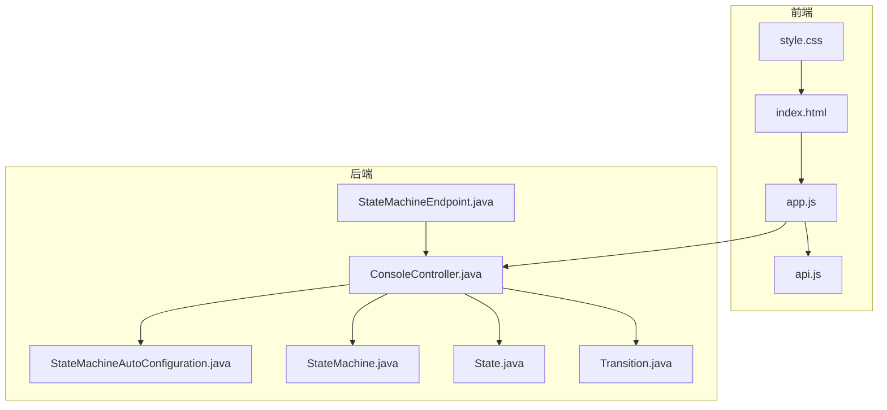
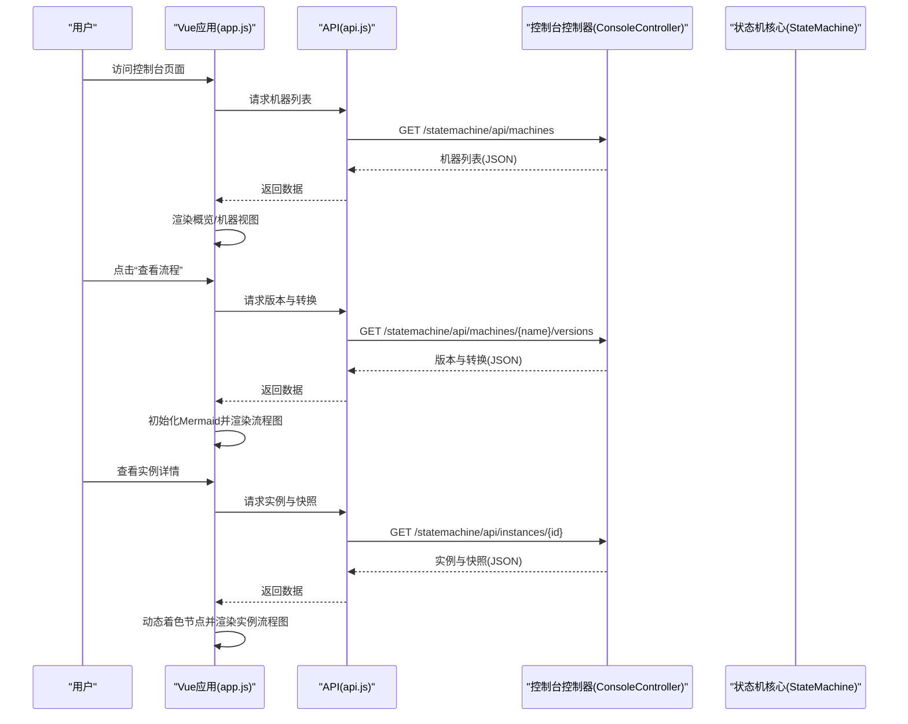
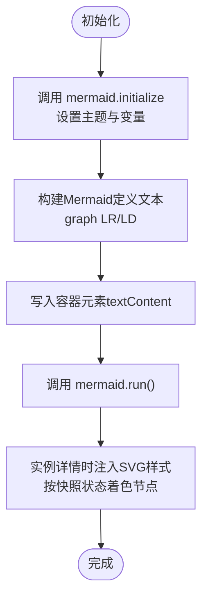
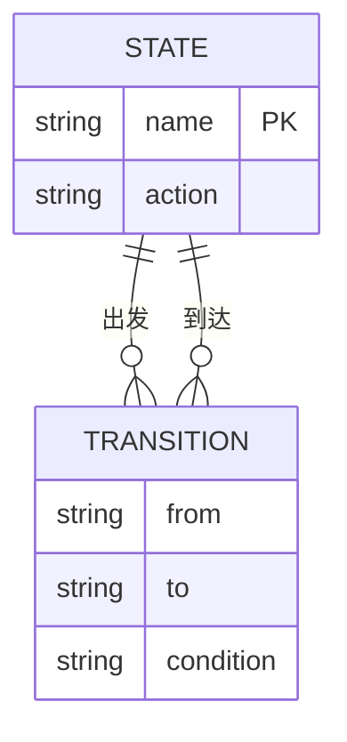
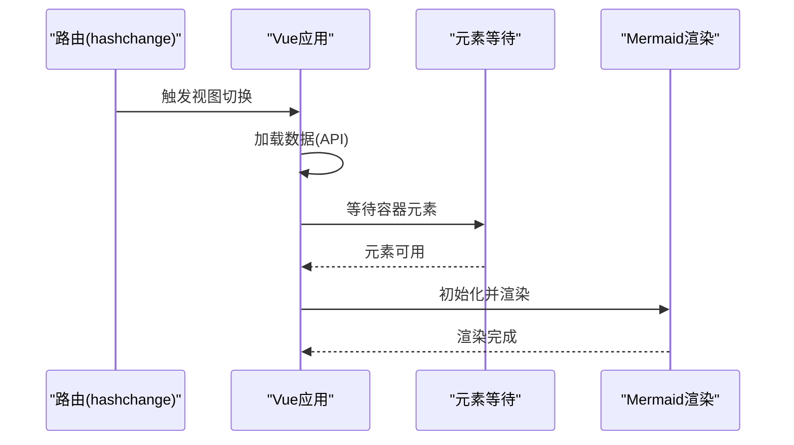
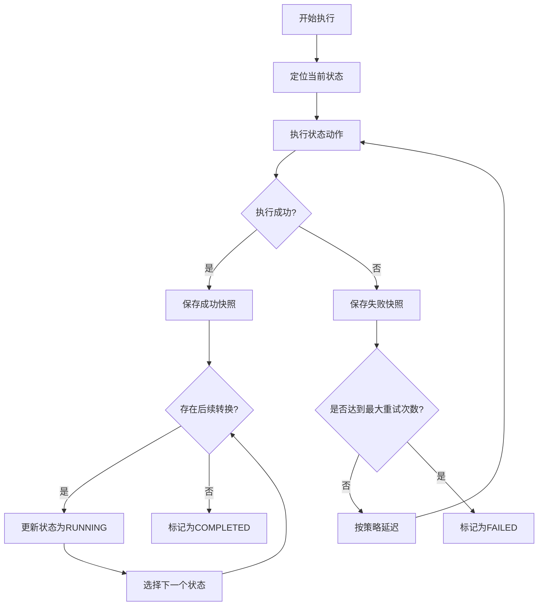
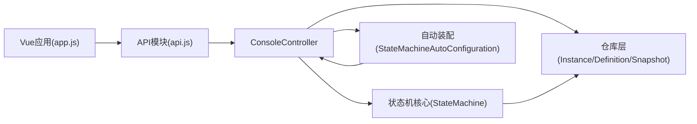

# 流程图可视化

<cite>
**本文引用的文件**
- [README.md](file://README.md)
- [index.html](file://src/main/resources/static/statemachine/index.html)
- [app.js](file://src/main/resources/static/statemachine/js/app.js)
- [api.js](file://src/main/resources/static/statemachine/js/api.js)
- [style.css](file://src/main/resources/static/statemachine/css/style.css)
- [StateMachine.java](file://src/main/java/cn/chedejun/statemachine/core/StateMachine.java)
- [State.java](file://src/main/java/cn/chedejun/statemachine/core/State.java)
- [Transition.java](file://src/main/java/cn/chedejun/statemachine/core/Transition.java)
- [ConsoleController.java](file://src/main/java/cn/chedejun/statemachine/management/ConsoleController.java)
- [StateMachineEndpoint.java](file://src/main/java/cn/chedejun/statemachine/management/StateMachineEndpoint.java)
- [StateMachineAutoConfiguration.java](file://src/main/java/cn/chedejun/statemachine/autoconfigure/StateMachineAutoConfiguration.java)
- [application.yml](file://demo/src/main/resources/application.yml)
- [OrderConfig.java](file://demo/src/main/java/cn/chedejun/demo/config/OrderConfig.java)
- [DemoController.java](file://demo/src/main/java/cn/chedejun/demo/controller/DemoController.java)
</cite>

## 目录
1. [简介](#简介)
2. [项目结构](#项目结构)
3. [核心组件](#核心组件)
4. [架构总览](#架构总览)
5. [详细组件分析](#详细组件分析)
6. [依赖关系分析](#依赖关系分析)
7. [性能考虑](#性能考虑)
8. [故障排查指南](#故障排查指南)
9. [结论](#结论)
10. [附录](#附录)

## 简介
本项目提供 Spring Boot 状态机工作流工具，支持条件分支、步骤快照、失败重试（指数退避）以及管理控制台。控制台内置基于 Mermaid 的流程图可视化功能，可图形化展示状态机定义（状态节点、转换箭头、标签），并支持动态图表更新与实时数据绑定。用户可通过控制台查看状态机定义、实例列表、执行快照，并对失败实例进行重试。

## 项目结构
前端静态资源位于类路径下的静态目录，包含 HTML 页面、Vue 应用脚本、Mermaid 图表渲染逻辑与样式表；后端提供状态机核心模型、自动装配、管理接口与 Actuator 端点。

**图表来源**
- [index.html:1-380](file://src/main/resources/static/statemachine/index.html#L1-L380)
- [app.js:1-250](file://src/main/resources/static/statemachine/js/app.js#L1-L250)
- [api.js:1-12](file://src/main/resources/static/statemachine/js/api.js#L1-L12)
- [style.css:1-708](file://src/main/resources/static/statemachine/css/style.css#L1-L708)
- [ConsoleController.java:1-106](file://src/main/java/cn/chedejun/statemachine/management/ConsoleController.java#L1-L106)
- [StateMachineEndpoint.java:1-73](file://src/main/java/cn/chedejun/statemachine/management/StateMachineEndpoint.java#L1-L73)
- [StateMachineAutoConfiguration.java:1-80](file://src/main/java/cn/chedejun/statemachine/autoconfigure/StateMachineAutoConfiguration.java#L1-L80)
- [StateMachine.java:1-196](file://src/main/java/cn/chedejun/statemachine/core/StateMachine.java#L1-L196)
- [State.java:1-16](file://src/main/java/cn/chedejun/statemachine/core/State.java#L1-L16)
- [Transition.java:1-20](file://src/main/java/cn/chedejun/statemachine/core/Transition.java#L1-L20)

**章节来源**
- [index.html:1-380](file://src/main/resources/static/statemachine/index.html#L1-L380)
- [app.js:1-250](file://src/main/resources/static/statemachine/js/app.js#L1-L250)
- [api.js:1-12](file://src/main/resources/static/statemachine/js/api.js#L1-L12)
- [style.css:1-708](file://src/main/resources/static/statemachine/css/style.css#L1-L708)
- [ConsoleController.java:1-106](file://src/main/java/cn/chedejun/statemachine/management/ConsoleController.java#L1-L106)
- [StateMachineEndpoint.java:1-73](file://src/main/java/cn/chedejun/statemachine/management/StateMachineEndpoint.java#L1-L73)
- [StateMachineAutoConfiguration.java:1-80](file://src/main/java/cn/chedejun/statemachine/autoconfigure/StateMachineAutoConfiguration.java#L1-L80)
- [StateMachine.java:1-196](file://src/main/java/cn/chedejun/statemachine/core/StateMachine.java#L1-L196)
- [State.java:1-16](file://src/main/java/cn/chedejun/statemachine/core/State.java#L1-L16)
- [Transition.java:1-20](file://src/main/java/cn/chedejun/statemachine/core/Transition.java#L1-L20)

## 核心组件
- 控制台页面：提供状态机概览、定义视图、实例列表与实例详情视图，其中定义视图包含 Mermaid 流程图容器与表格化的状态/转换信息。
- Vue 应用：负责路由切换、数据加载、Mermaid 初始化与渲染、实例详情中的动态着色。
- API 层：提供机器、版本、实例、快照与重试的 REST 接口，由后端控制器与 Actuator 端点实现。
- 状态机模型：定义状态、转换、重试策略与执行循环，支持失败重试与快照记录。
- 自动装配：根据配置启用控制台与管理端点，注册状态机并注入依赖。

**章节来源**
- [index.html:132-238](file://src/main/resources/static/statemachine/index.html#L132-L238)
- [app.js:134-222](file://src/main/resources/static/statemachine/js/app.js#L134-L222)
- [ConsoleController.java:34-104](file://src/main/java/cn/chedejun/statemachine/management/ConsoleController.java#L34-L104)
- [StateMachine.java:40-136](file://src/main/java/cn/chedejun/statemachine/core/StateMachine.java#L40-L136)
- [StateMachineAutoConfiguration.java:26-78](file://src/main/java/cn/chedejun/statemachine/autoconfigure/StateMachineAutoConfiguration.java#L26-L78)

## 架构总览
前端通过 Vue 路由驱动视图切换，使用 API 模块拉取后端数据；后端控制器将状态机定义与实例数据以 JSON 形式返回，前端解析并生成 Mermaid 图形。

**图表来源**
- [app.js:82-127](file://src/main/resources/static/statemachine/js/app.js#L82-L127)
- [api.js:1-12](file://src/main/resources/static/statemachine/js/api.js#L1-L12)
- [ConsoleController.java:34-89](file://src/main/java/cn/chedejun/statemachine/management/ConsoleController.java#L34-L89)
- [StateMachine.java:40-136](file://src/main/java/cn/chedejun/statemachine/core/StateMachine.java#L40-L136)

**章节来源**
- [app.js:82-127](file://src/main/resources/static/statemachine/js/app.js#L82-L127)
- [api.js:1-12](file://src/main/resources/static/statemachine/js/api.js#L1-L12)
- [ConsoleController.java:34-89](file://src/main/java/cn/chedejun/statemachine/management/ConsoleController.java#L34-L89)

## 详细组件分析

### Mermaid 集成与配置
- 引入方式：在页面头部引入 Vue 与 Mermaid CDN。
- 初始化参数：设置禁用自动加载、主题、主题变量（颜色、字体、字号）、流程图曲线与间距等。
- 渲染模式：分两处调用渲染：
  - 定义视图：遍历版本，拼接 Mermaid 定义文本，写入容器后统一运行渲染。
  - 实例详情：按最新版本生成定义文本，运行渲染后，通过注入 SVG 内联样式为每个状态节点着色（成功/失败）。

**图表来源**
- [app.js:134-160](file://src/main/resources/static/statemachine/js/app.js#L134-L160)
- [app.js:162-222](file://src/main/resources/static/statemachine/js/app.js#L162-L222)

**章节来源**
- [index.html:10-11](file://src/main/resources/static/statemachine/index.html#L10-L11)
- [app.js:134-222](file://src/main/resources/static/statemachine/js/app.js#L134-L222)

### 状态机定义的图形化展示
- 数据来源：后端控制器将状态机的 states 与 transitions 解析为 JSON 返回给前端。
- 图形语法：使用 Mermaid 的流程图语法，节点采用圆角矩形样式，边表示状态转换。
- 表格辅助：页面同时提供表格列出状态与转换，便于核对定义。

**图表来源**
- [State.java:3-15](file://src/main/java/cn/chedejun/statemachine/core/State.java#L3-L15)
- [Transition.java:3-19](file://src/main/java/cn/chedejun/statemachine/core/Transition.java#L3-L19)
- [ConsoleController.java:45-60](file://src/main/java/cn/chedejun/statemachine/management/ConsoleController.java#L45-L60)

**章节来源**
- [ConsoleController.java:45-60](file://src/main/java/cn/chedejun/statemachine/management/ConsoleController.java#L45-L60)
- [State.java:3-15](file://src/main/java/cn/chedejun/statemachine/core/State.java#L3-L15)
- [Transition.java:3-19](file://src/main/java/cn/chedejun/statemachine/core/Transition.java#L3-L19)

### 动态图表更新与实时数据绑定
- 路由驱动：通过 URL hash 切换视图，触发相应数据加载与渲染。
- 异步等待：在渲染前等待容器元素出现，避免 DOM 未就绪导致的渲染失败。
- 实例详情：加载实例与快照后，重新初始化 Mermaid 并注入样式，使节点颜色反映实际执行结果。

**图表来源**
- [app.js:84-127](file://src/main/resources/static/statemachine/js/app.js#L84-L127)
- [app.js:162-222](file://src/main/resources/static/statemachine/js/app.js#L162-L222)

**章节来源**
- [app.js:84-127](file://src/main/resources/static/statemachine/js/app.js#L84-L127)
- [app.js:162-222](file://src/main/resources/static/statemachine/js/app.js#L162-L222)

### 图表样式定制与主题配置
- 主题变量：通过主题变量统一设置主色、文本色、边框色、连线色、背景色、字号与字体族。
- 流程图参数：设置曲线类型、节点间距、层级间距等，提升可读性。
- 实例节点着色：根据快照状态为节点注入内联样式，成功绿色、失败红色，增强视觉反馈。

**章节来源**
- [app.js:134-160](file://src/main/resources/static/statemachine/js/app.js#L134-L160)
- [app.js:178-222](file://src/main/resources/static/statemachine/js/app.js#L178-L222)
- [style.css:1-708](file://src/main/resources/static/statemachine/css/style.css#L1-L708)

### 交互功能
- 点击状态查看详情：实例详情视图中，点击实例项进入详情页，页面加载后自动渲染流程图。
- 悬停提示信息：页面提供面包屑导航、状态徽章、时间相对化显示等，辅助用户理解上下文。
- 刷新与筛选：实例列表支持刷新按钮与按状态筛选，提升操作效率。

**章节来源**
- [index.html:240-281](file://src/main/resources/static/statemachine/index.html#L240-L281)
- [app.js:129-133](file://src/main/resources/static/statemachine/js/app.js#L129-L133)

### 图表导出与打印
- 导出：Mermaid 渲染后的 SVG 可直接保存为图片或 PDF（浏览器原生能力）。
- 打印：页面提供侧边栏卡片布局，实例流程图容器适配打印样式，建议在打印前先渲染图表以确保内容完整。

**章节来源**
- [style.css:515-523](file://src/main/resources/static/statemachine/css/style.css#L515-L523)

### 后端状态机执行与快照
- 执行循环：状态机按顺序执行状态动作，记录快照，遇到异常按重试策略延迟重试，超过最大次数则标记失败。
- 快照存储：每次执行成功或失败均持久化输入输出与状态，用于实例详情的时间线展示。
- 重试机制：支持按实例 ID 重试，自动恢复到失败状态并重新执行。

**图表来源**
- [StateMachine.java:83-136](file://src/main/java/cn/chedejun/statemachine/core/StateMachine.java#L83-L136)

**章节来源**
- [StateMachine.java:40-136](file://src/main/java/cn/chedejun/statemachine/core/StateMachine.java#L40-L136)

## 依赖关系分析
- 前端依赖：Vue 3 作为视图框架，Mermaid 作为图表渲染引擎，本地样式表提供主题与布局。
- 后端依赖：Spring JDBC Template、Jackson 对象映射、Actuator 端点、自动装配条件注解。
- 控制器与端点：ConsoleController 提供 Web 控制台接口；StateMachineEndpoint 提供 Actuator 端点以供监控与管理。

**图表来源**
- [app.js:1-250](file://src/main/resources/static/statemachine/js/app.js#L1-L250)
- [api.js:1-12](file://src/main/resources/static/statemachine/js/api.js#L1-L12)
- [ConsoleController.java:1-106](file://src/main/java/cn/chedejun/statemachine/management/ConsoleController.java#L1-L106)
- [StateMachineAutoConfiguration.java:1-80](file://src/main/java/cn/chedejun/statemachine/autoconfigure/StateMachineAutoConfiguration.java#L1-L80)
- [StateMachine.java:1-196](file://src/main/java/cn/chedejun/statemachine/core/StateMachine.java#L1-L196)

**章节来源**
- [ConsoleController.java:1-106](file://src/main/java/cn/chedejun/statemachine/management/ConsoleController.java#L1-L106)
- [StateMachineAutoConfiguration.java:1-80](file://src/main/java/cn/chedejun/statemachine/autoconfigure/StateMachineAutoConfiguration.java#L1-L80)
- [StateMachine.java:1-196](file://src/main/java/cn/chedejun/statemachine/core/StateMachine.java#L1-L196)

## 性能考虑
- 渲染时机：在 nextTick 之后等待容器元素出现再渲染，避免不必要的重排与重绘。
- 主题变量：集中配置主题变量减少重复计算，提升渲染一致性。
- 数据加载：实例列表分页查询，避免一次性加载大量数据导致页面卡顿。
- 图表复杂度：对于大规模状态机，建议限制同时渲染的节点数量或采用分页/折叠策略。

## 故障排查指南
- Mermaid 渲染失败：检查容器元素是否存在、定义文本是否正确、初始化参数是否合理；可在控制台查看错误日志。
- 图表不显示：确认页面已加载 Mermaid 脚本、容器元素可见且有足够高度。
- 数据为空：检查后端接口是否正常返回 JSON、URL 参数是否正确、状态过滤条件是否导致空集。
- 实例重试无效：确认实例状态为 FAILED，后端重试接口返回成功消息，前端需刷新实例详情以看到状态变化。

**章节来源**
- [app.js:219-221](file://src/main/resources/static/statemachine/js/app.js#L219-L221)
- [ConsoleController.java:91-104](file://src/main/java/cn/chedejun/statemachine/management/ConsoleController.java#L91-L104)

## 结论
本项目通过 Vue + Mermaid 的组合，在控制台中实现了状态机定义与实例执行的可视化展示。前端负责数据加载与图表渲染，后端提供状态机执行与持久化能力。通过主题变量与动态样式注入，图表具备良好的可读性与交互体验。结合实例详情与重试机制，用户可以直观地理解流程并进行运维操作。

## 附录
- 快速开始与配置参考：见项目自述文件与示例配置。
- 示例状态机定义：见演示配置类与控制器示例。

**章节来源**
- [README.md:1-65](file://README.md#L1-L65)
- [application.yml:1-23](file://demo/src/main/resources/application.yml#L1-L23)
- [OrderConfig.java:1-85](file://demo/src/main/java/cn/chedejun/demo/config/OrderConfig.java#L1-L85)
- [DemoController.java:38-118](file://demo/src/main/java/cn/chedejun/demo/controller/DemoController.java#L38-L118)