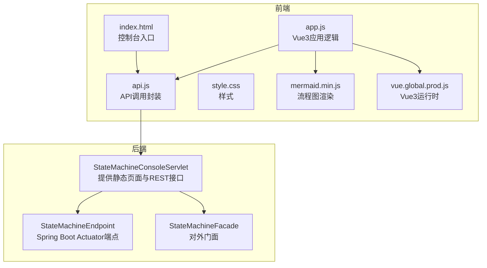
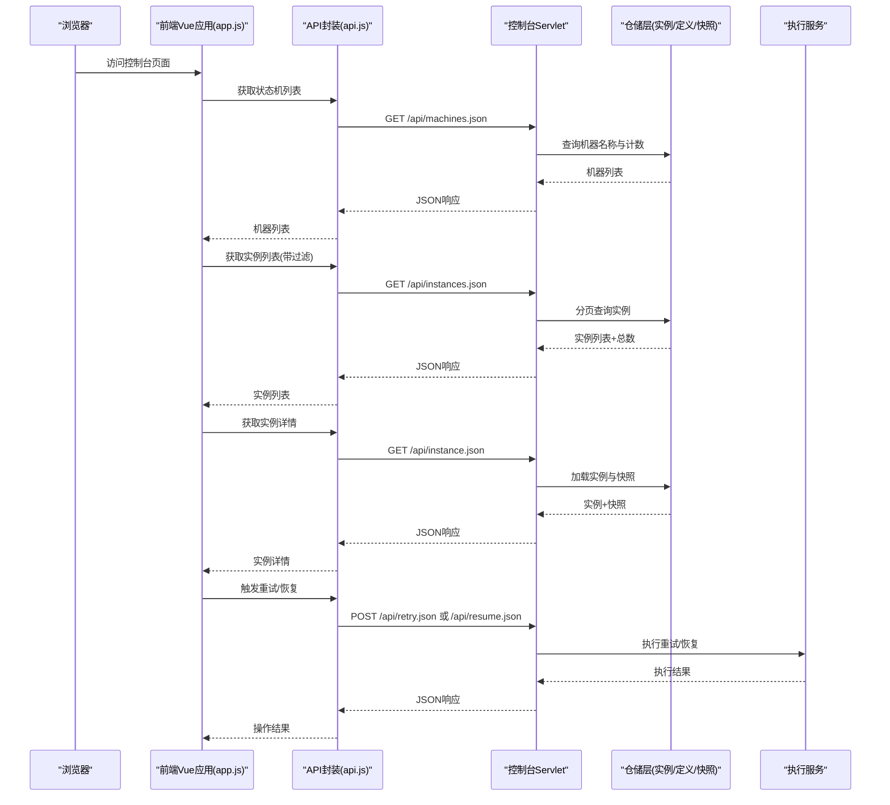
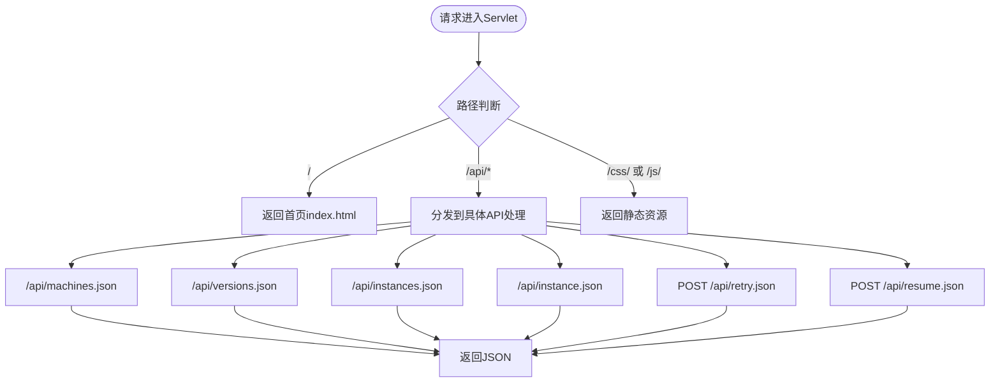
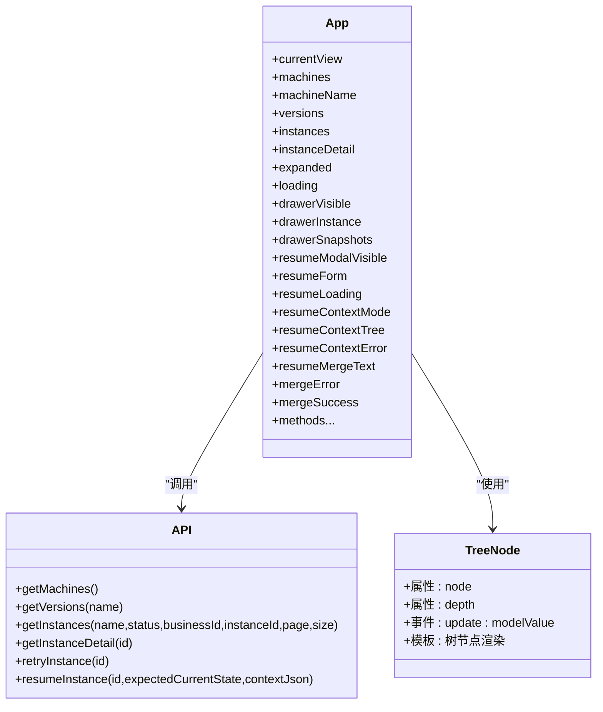
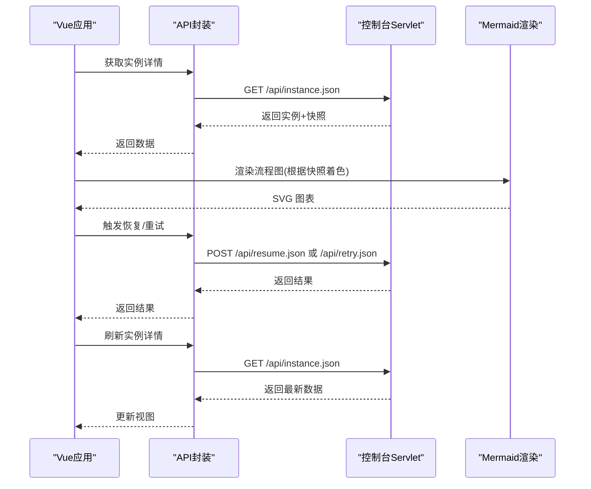
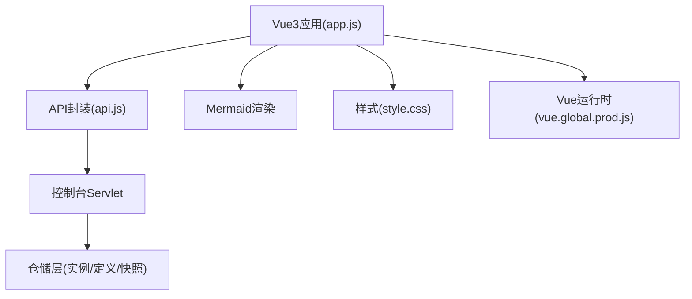

# 管理控制台

<cite>
**本文档引用的文件**
- [StateMachineConsoleServlet.java](file://state-machine-boot-starter/src/main/java/cn/chedejun/statemachine/management/StateMachineConsoleServlet.java)
- [StateMachineEndpoint.java](file://state-machine-boot-starter/src/main/java/cn/chedejun/statemachine/management/StateMachineEndpoint.java)
- [StateMachineFacade.java](file://state-machine-boot-starter/src/main/java/cn/chedejun/statemachine/interfaces/StateMachineFacade.java)
- [index.html](file://state-machine-boot-starter/src/main/resources/console/index.html)
- [api.js](file://state-machine-boot-starter/src/main/resources/console/js/api.js)
- [app.js](file://state-machine-boot-starter/src/main/resources/console/js/app.js)
- [style.css](file://state-machine-boot-starter/src/main/resources/console/css/style.css)
- [vue.global.prod.js](file://state-machine-boot-starter/src/main/resources/console/js/vue.global.prod.js)
- [mermaid.min.js](file://state-machine-boot-starter/src/main/resources/console/js/mermaid.min.js)
</cite>

## 目录
1. [简介](#简介)
2. [项目结构](#项目结构)
3. [核心组件](#核心组件)
4. [架构总览](#架构总览)
5. [详细组件分析](#详细组件分析)
6. [依赖关系分析](#依赖关系分析)
7. [性能考虑](#性能考虑)
8. [故障排除指南](#故障排除指南)
9. [结论](#结论)
10. [附录](#附录)

## 简介
本项目提供了一个基于状态机引擎的管理控制台，包含后端的 Servlet REST API 与前端的 Vue3 单页应用。控制台支持：
- 列出已注册的状态机及版本
- 查询实例列表与详情
- 查看状态机流程图（Mermaid 渲染）
- 执行重试与恢复操作
- 实时状态更新与可视化展示

该控制台采用前后端分离设计：后端通过 Servlet 提供静态页面与 REST 接口，前端使用 Vue3 + Mermaid.js 实现交互与流程图渲染。

## 项目结构
- 后端模块：state-machine-boot-starter
  - management 包：提供管理控制台的 Servlet 与 Actuator 端点
  - interfaces 包：对外门面类，封装执行与恢复能力
  - resources/console：内置静态资源（HTML/CSS/JS）
- 前端模块：console 目录下的 HTML/CSS/JS 文件

**图表来源**
- [StateMachineConsoleServlet.java:1-420](file://state-machine-boot-starter/src/main/java/cn/chedejun/statemachine/management/StateMachineConsoleServlet.java#L1-L420)
- [StateMachineEndpoint.java:1-80](file://state-machine-boot-starter/src/main/java/cn/chedejun/statemachine/management/StateMachineEndpoint.java#L1-L80)
- [StateMachineFacade.java:1-52](file://state-machine-boot-starter/src/main/java/cn/chedejun/statemachine/interfaces/StateMachineFacade.java#L1-L52)
- [index.html:1-665](file://state-machine-boot-starter/src/main/resources/console/index.html#L1-L665)
- [api.js:1-35](file://state-machine-boot-starter/src/main/resources/console/js/api.js#L1-L35)
- [app.js:1-848](file://state-machine-boot-starter/src/main/resources/console/js/app.js#L1-L848)
- [style.css:1-1235](file://state-machine-boot-starter/src/main/resources/console/css/style.css#L1-L1235)
- [vue.global.prod.js:1-12](file://state-machine-boot-starter/src/main/resources/console/js/vue.global.prod.js#L1-L12)
- [mermaid.min.js:1-2030](file://state-machine-boot-starter/src/main/resources/console/js/mermaid.min.js#L1-L2030)

**章节来源**
- [index.html:1-665](file://state-machine-boot-starter/src/main/resources/console/index.html#L1-L665)
- [api.js:1-35](file://state-machine-boot-starter/src/main/resources/console/js/api.js#L1-L35)
- [app.js:1-848](file://state-machine-boot-starter/src/main/resources/console/js/app.js#L1-L848)
- [style.css:1-1235](file://state-machine-boot-starter/src/main/resources/console/css/style.css#L1-L1235)
- [vue.global.prod.js:1-12](file://state-machine-boot-starter/src/main/resources/console/js/vue.global.prod.js#L1-L12)
- [mermaid.min.js:1-2030](file://state-machine-boot-starter/src/main/resources/console/js/mermaid.min.js#L1-L2030)

## 核心组件
- 后端 Servlet（状态机控制台）
  - 提供静态页面与 REST 接口，支持机器列表、版本查询、实例查询、实例详情、重试与恢复等
  - 支持分页与多条件过滤（状态、业务ID、实例ID）
  - 返回统一 JSON 结构，包含分页信息与错误处理
- Actuator 端点
  - 提供状态机列表与版本查询的只读接口
- Vue3 前端应用
  - 使用路由 hash 模式导航
  - 通过 API 封装进行数据请求
  - 使用 Mermaid.js 渲染状态机流程图
  - 支持实例详情、执行快照、IO 展示与复制

**章节来源**
- [StateMachineConsoleServlet.java:113-268](file://state-machine-boot-starter/src/main/java/cn/chedejun/statemachine/management/StateMachineConsoleServlet.java#L113-L268)
- [StateMachineEndpoint.java:22-79](file://state-machine-boot-starter/src/main/java/cn/chedejun/statemachine/management/StateMachineEndpoint.java#L22-L79)
- [api.js:1-35](file://state-machine-boot-starter/src/main/resources/console/js/api.js#L1-L35)
- [app.js:427-484](file://state-machine-boot-starter/src/main/resources/console/js/app.js#L427-L484)

## 架构总览
后端通过 Servlet 提供统一入口，前端通过 API 封装调用后端接口，Mermaid.js 负责流程图渲染，Vue3 负责视图与交互。

**图表来源**
- [app.js:427-484](file://state-machine-boot-starter/src/main/resources/console/js/app.js#L427-L484)
- [api.js:1-35](file://state-machine-boot-starter/src/main/resources/console/js/api.js#L1-L35)
- [StateMachineConsoleServlet.java:113-268](file://state-machine-boot-starter/src/main/java/cn/chedejun/statemachine/management/StateMachineConsoleServlet.java#L113-L268)

## 详细组件分析

### 后端 Servlet 组件分析
- 路由与资源分发
  - GET /：重定向至首页
  - GET /api/*.json：REST API 路由
  - GET /css/ 与 /js/：静态资源
- API 实现
  - /api/machines.json：列出机器基本信息（版本数、运行/失败/挂起实例数）
  - /api/versions.json：按机器名查询版本详情（含状态、转换、重试策略）
  - /api/instances.json：按机器名分页查询实例，支持状态/业务ID/实例ID过滤
  - /api/instance.json：加载实例详情与执行快照
  - POST /api/retry.json：对失败实例发起重试
  - POST /api/resume.json：对挂起实例恢复执行，支持传入上下文
- 错误处理
  - 统一返回 JSON 错误对象或错误结果对象
  - 参数校验与异常捕获

**图表来源**
- [StateMachineConsoleServlet.java:65-126](file://state-machine-boot-starter/src/main/java/cn/chedejun/statemachine/management/StateMachineConsoleServlet.java#L65-L126)

**章节来源**
- [StateMachineConsoleServlet.java:113-268](file://state-machine-boot-starter/src/main/java/cn/chedejun/statemachine/management/StateMachineConsoleServlet.java#L113-L268)

### 前端 Vue3 应用组件分析
- 路由与视图
  - 概览页：展示机器总数、运行/失败/挂起实例统计
  - 机器详情页：展示版本流程图（Mermaid）、步骤表、实例概览
  - 实例详情页：展示实例状态、流程图、执行快照（含输入输出 JSON）
- 组件与交互
  - 侧边栏导航与健康状态指示
  - 过滤器：按状态、业务ID、实例ID过滤
  - 分页：首页/上一页/下一页/末页
  - 恢复弹窗：支持树形/文本两种上下文编辑模式，支持合并 JSON
  - 快捷操作：重试、恢复
- Mermaid 渲染
  - 根据状态机定义生成流程图
  - 根据实例执行快照着色已执行/失败的节点与连线
  - 支持挂起点标注与最终状态连线

**图表来源**
- [app.js:3-28](file://state-machine-boot-starter/src/main/resources/console/js/app.js#L3-L28)
- [api.js:1-35](file://state-machine-boot-starter/src/main/resources/console/js/api.js#L1-L35)
- [index.html:1-665](file://state-machine-boot-starter/src/main/resources/console/index.html#L1-L665)

**章节来源**
- [app.js:30-848](file://state-machine-boot-starter/src/main/resources/console/js/app.js#L30-L848)
- [index.html:1-665](file://state-machine-boot-starter/src/main/resources/console/index.html#L1-L665)
- [style.css:1-1235](file://state-machine-boot-starter/src/main/resources/console/css/style.css#L1-L1235)

### REST API 接口规范
- 获取状态机列表
  - 方法：GET
  - 路径：/api/machines.json
  - 响应：机器数组，包含 name、versionCount、runningInstances、failedInstances、suspendedInstances
- 获取状态机版本
  - 方法：GET
  - 路径：/api/versions.json?name={机器名}
  - 响应：版本数组，包含 states、transitions、retryPolicy、registeredAt
- 查询实例列表
  - 方法：GET
  - 路径：/api/instances.json
  - 查询参数：name（必填）、status、businessId、instanceId、page、size（最大 200）
  - 响应：instances（数组）、total、page、size
- 获取实例详情
  - 方法：GET
  - 路径：/api/instance.json?id={实例ID}
  - 响应：instance（实例信息）、snapshots（执行快照）
- 重试实例
  - 方法：POST
  - 路径：/api/retry.json
  - 请求体：{ id }
  - 响应：消息字符串
- 恢复挂起实例
  - 方法：POST
  - 路径：/api/resume.json
  - 请求体：{ id, expectedCurrentState, contextJson? }
  - 响应：success、error、currentState（可选）

**章节来源**
- [StateMachineConsoleServlet.java:113-268](file://state-machine-boot-starter/src/main/java/cn/chedejun/statemachine/management/StateMachineConsoleServlet.java#L113-L268)
- [api.js:1-35](file://state-machine-boot-starter/src/main/resources/console/js/api.js#L1-L35)

### Mermaid 图表渲染与实时状态更新
- 流程图渲染
  - 从后端获取状态机定义（states/transitions），生成 Mermaid 定义
  - 根据实例执行快照，对已执行状态着色（绿色）与连线着色
  - 支持挂起点标注与最终状态连线
- 实时状态更新
  - 恢复/重试后刷新实例详情与抽屉中的图表
  - 刷新按钮支持手动刷新实例列表

**图表来源**
- [app.js:646-811](file://state-machine-boot-starter/src/main/resources/console/js/app.js#L646-L811)
- [api.js:1-35](file://state-machine-boot-starter/src/main/resources/console/js/api.js#L1-L35)
- [StateMachineConsoleServlet.java:270-348](file://state-machine-boot-starter/src/main/java/cn/chedejun/statemachine/management/StateMachineConsoleServlet.java#L270-L348)

**章节来源**
- [app.js:646-811](file://state-machine-boot-starter/src/main/resources/console/js/app.js#L646-L811)

### 控制台配置与自定义化
- 配置项
  - 最大分页大小：MAX_PAGE_SIZE=200
  - 缓存控制：静态资源设置 Cache-Control:max-age=3600
  - Mermaid 主题变量：颜色、字体、间距等
- 自定义化建议
  - 样式：通过 style.css 修改主题色、布局与组件样式
  - Mermaid：调整主题变量以适配企业风格
  - 路由：当前使用 hash 模式，如需 history 模式需后端配合
  - 国际化：当前文本为中文，如需国际化可在前端扩展

**章节来源**
- [StateMachineConsoleServlet.java:42-420](file://state-machine-boot-starter/src/main/java/cn/chedejun/statemachine/management/StateMachineConsoleServlet.java#L42-L420)
- [style.css:1-1235](file://state-machine-boot-starter/src/main/resources/console/css/style.css#L1-L1235)
- [app.js:563-577](file://state-machine-boot-starter/src/main/resources/console/js/app.js#L563-L577)

## 依赖关系分析
- 组件耦合
  - 前端通过 API 封装与后端解耦
  - 后端 Servlet 与仓储层解耦，便于替换实现
- 外部依赖
  - Vue3 运行时与 Mermaid.js
  - Jackson ObjectMapper（后端用于 JSON 序列化）
- 循环依赖
  - 未发现循环依赖

**图表来源**
- [app.js:1-848](file://state-machine-boot-starter/src/main/resources/console/js/app.js#L1-L848)
- [api.js:1-35](file://state-machine-boot-starter/src/main/resources/console/js/api.js#L1-L35)
- [StateMachineConsoleServlet.java:1-420](file://state-machine-boot-starter/src/main/java/cn/chedejun/statemachine/management/StateMachineConsoleServlet.java#L1-L420)
- [style.css:1-1235](file://state-machine-boot-starter/src/main/resources/console/css/style.css#L1-L1235)
- [vue.global.prod.js:1-12](file://state-machine-boot-starter/src/main/resources/console/js/vue.global.prod.js#L1-L12)
- [mermaid.min.js:1-2030](file://state-machine-boot-starter/src/main/resources/console/js/mermaid.min.js#L1-L2030)

**章节来源**
- [app.js:1-848](file://state-machine-boot-starter/src/main/resources/console/js/app.js#L1-L848)
- [api.js:1-35](file://state-machine-boot-starter/src/main/resources/console/js/api.js#L1-L35)
- [StateMachineConsoleServlet.java:1-420](file://state-machine-boot-starter/src/main/java/cn/chedejun/statemachine/management/StateMachineConsoleServlet.java#L1-L420)

## 性能考虑
- 分页与过滤
  - 后端限制最大分页大小，避免超大数据量传输
  - 前端提供多条件过滤，减少无效数据渲染
- 静态资源缓存
  - 设置 Cache-Control，降低带宽与服务器压力
- Mermaid 渲染
  - 仅在需要时渲染，避免重复渲染造成性能损耗
- 建议
  - 对于大量实例场景，建议增加后端分页与前端虚拟滚动
  - 对 Mermaid 图表进行懒加载与节流

[本节为通用指导，无需源码引用]

## 故障排除指南
- 常见问题
  - 404：检查路径是否以 / 结尾，或资源是否存在
  - 参数错误：确认必填参数（如 name/id）是否传递
  - 恢复失败：检查 expectedCurrentState 是否与实例当前状态一致
  - Mermaid 渲染异常：检查状态机定义 JSON 是否有效
- 日志与错误
  - 后端捕获异常并返回 JSON 错误对象
  - 前端显示 Toast 提示与错误信息
- 排查步骤
  - 检查后端日志与状态码
  - 使用浏览器开发者工具查看网络请求与响应
  - 在实例详情页查看快照与错误信息

**章节来源**
- [StateMachineConsoleServlet.java:94-98](file://state-machine-boot-starter/src/main/java/cn/chedejun/statemachine/management/StateMachineConsoleServlet.java#L94-L98)
- [app.js:94-101](file://state-machine-boot-starter/src/main/resources/console/js/app.js#L94-L101)

## 结论
本管理控制台通过 Servlet 提供统一入口，结合 Vue3 前端与 Mermaid 流程图渲染，实现了状态机的可视化管理与操作。其架构清晰、前后端解耦、具备良好的可扩展性与可维护性。运维人员可通过控制台快速定位问题、执行重试与恢复操作，并通过自定义样式与主题满足不同环境需求。

[本节为总结性内容，无需源码引用]

## 附录
- API 调用示例（参考路径）
  - 获取机器列表：[api.js:2-4](file://state-machine-boot-starter/src/main/resources/console/js/api.js#L2-L4)
  - 获取实例列表：[api.js:8-13](file://state-machine-boot-starter/src/main/resources/console/js/api.js#L8-L13)
  - 获取实例详情：[api.js:15-16](file://state-machine-boot-starter/src/main/resources/console/js/api.js#L15-L16)
  - 重试实例：[api.js:18-23](file://state-machine-boot-starter/src/main/resources/console/js/api.js#L18-L23)
  - 恢复实例：[api.js:25-32](file://state-machine-boot-starter/src/main/resources/console/js/api.js#L25-L32)
- 响应格式说明
  - 成功响应：JSON 对象，字段依据各接口定义
  - 错误响应：包含 error 字段的 JSON 对象
  - 恢复/重试结果：包含 success/error/currentState（可选）字段的对象

**章节来源**
- [api.js:1-35](file://state-machine-boot-starter/src/main/resources/console/js/api.js#L1-L35)
- [StateMachineConsoleServlet.java:396-418](file://state-machine-boot-starter/src/main/java/cn/chedejun/statemachine/management/StateMachineConsoleServlet.java#L396-L418)