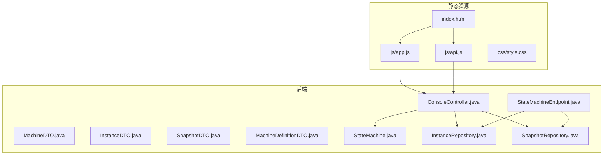
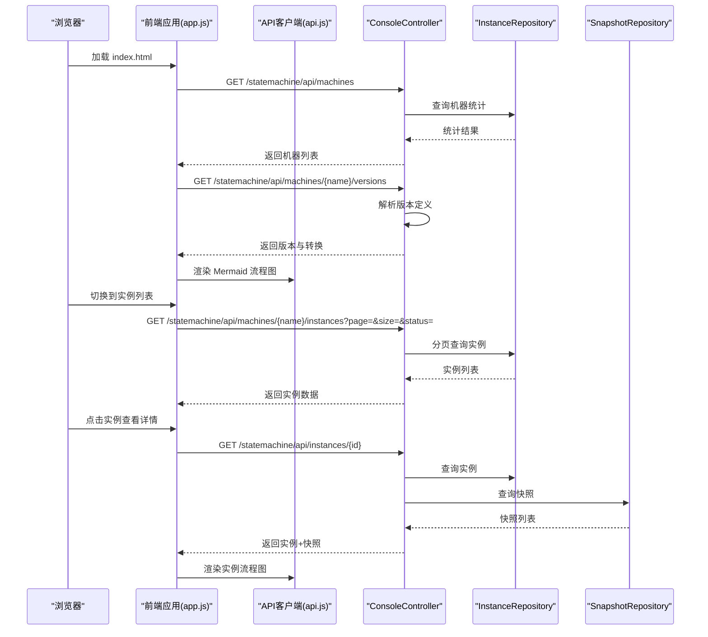
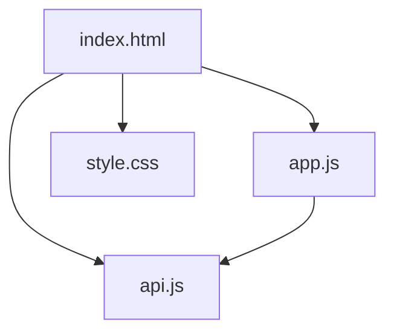
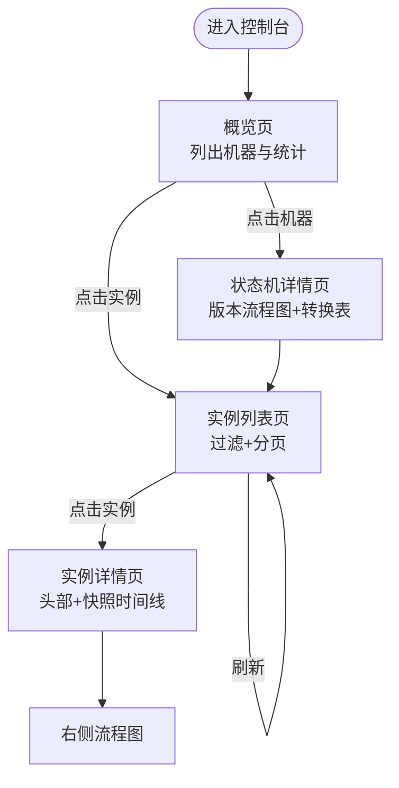
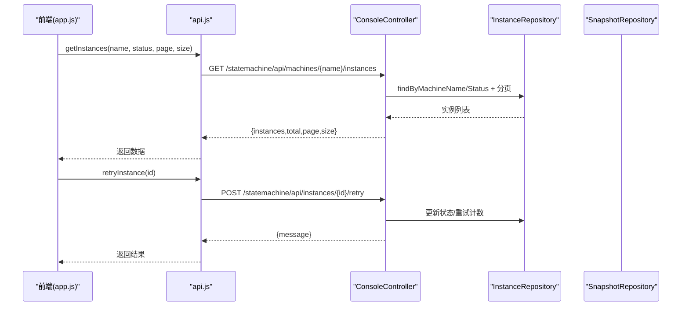
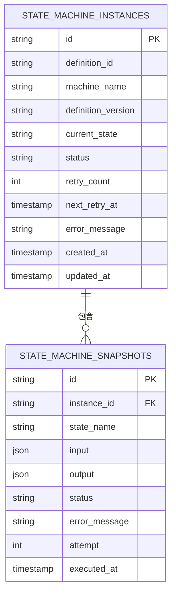
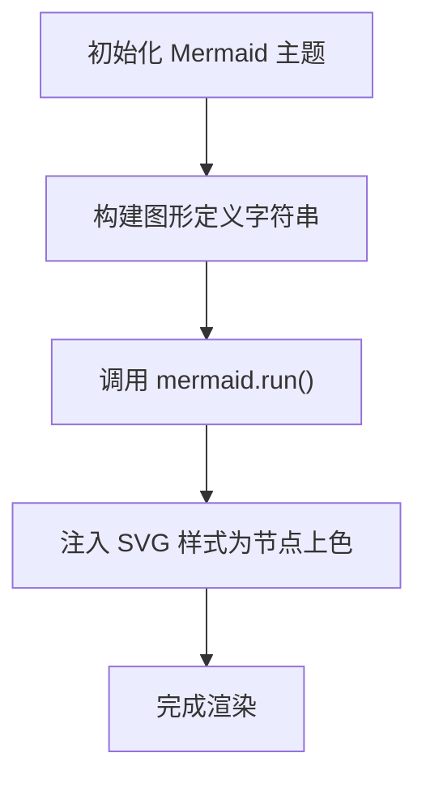
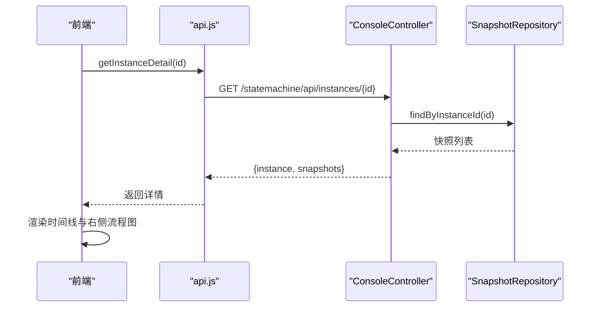
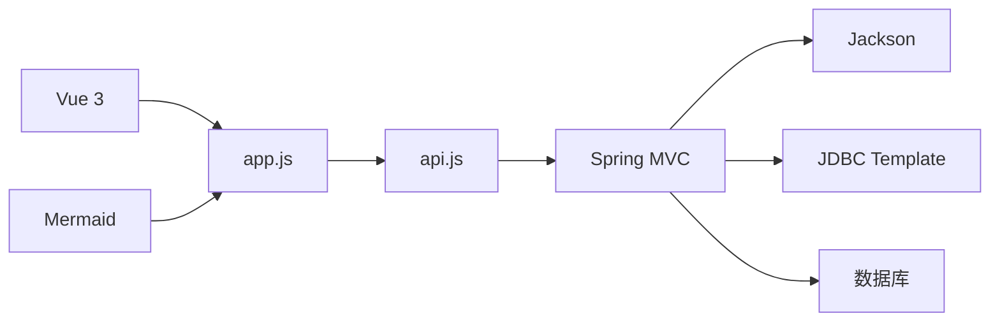

# 管理控制台

<cite>
**本文档引用的文件**
- [index.html](file://src/main/resources/static/statemachine/index.html)
- [app.js](file://src/main/resources/static/statemachine/js/app.js)
- [api.js](file://src/main/resources/static/statemachine/js/api.js)
- [style.css](file://src/main/resources/static/statemachine/css/style.css)
- [ConsoleController.java](file://src/main/java/cn/chedejun/statemachine/management/ConsoleController.java)
- [StateMachineEndpoint.java](file://src/main/java/cn/chedejun/statemachine/management/StateMachineEndpoint.java)
- [InstanceDTO.java](file://src/main/java/cn/chedejun/statemachine/management/dto/InstanceDTO.java)
- [MachineDTO.java](file://src/main/java/cn/chedejun/statemachine/management/dto/MachineDTO.java)
- [SnapshotDTO.java](file://src/main/java/cn/chedejun/statemachine/management/dto/SnapshotDTO.java)
- [MachineDefinitionDTO.java](file://src/main/java/cn/chedejun/statemachine/management/dto/MachineDefinitionDTO.java)
- [StateMachine.java](file://src/main/java/cn/chedejun/statemachine/core/StateMachine.java)
- [InstanceRepository.java](file://src/main/java/cn/chedejun/statemachine/persistence/InstanceRepository.java)
- [SnapshotRepository.java](file://src/main/java/cn/chedejun/statemachine/persistence/SnapshotRepository.java)
- [application.yml](file://demo/src/main/resources/application.yml)
- [README.md](file://README.md)
</cite>

## 目录
1. [简介](#简介)
2. [项目结构](#项目结构)
3. [核心组件](#核心组件)
4. [架构总览](#架构总览)
5. [详细组件分析](#详细组件分析)
6. [依赖关系分析](#依赖关系分析)
7. [性能考虑](#性能考虑)
8. [故障排查指南](#故障排查指南)
9. [结论](#结论)
10. [附录](#附录)

## 简介
本项目提供一个基于 Spring Boot 的状态机管理控制台，用于可视化状态机流程图、管理实例列表以及查看执行快照。前端采用 Vue.js 3 + Mermaid 技术栈，后端通过 Spring MVC 暴露 REST API，数据持久化使用 JDBC 与数据库表进行交互。控制台支持状态机概览、流程图查看、实例筛选与重试、执行快照时间线等能力。

## 项目结构
静态资源位于后端资源目录下，随应用打包发布；后端控制器负责路由转发到静态页面并提供 API 接口。

**图表来源**
- [index.html:1-320](file://src/main/resources/static/statemachine/index.html#L1-L320)
- [api.js:1-12](file://src/main/resources/static/statemachine/js/api.js#L1-L12)
- [app.js:1-240](file://src/main/resources/static/statemachine/js/app.js#L1-L240)
- [style.css:1-708](file://src/main/resources/static/statemachine/css/style.css#L1-L708)
- [ConsoleController.java:1-106](file://src/main/java/cn/chedejun/statemachine/management/ConsoleController.java#L1-L106)
- [StateMachineEndpoint.java:1-73](file://src/main/java/cn/chedejun/statemachine/management/StateMachineEndpoint.java#L1-L73)
- [InstanceDTO.java:1-6](file://src/main/java/cn/chedejun/statemachine/management/dto/InstanceDTO.java#L1-L6)
- [MachineDTO.java:1-3](file://src/main/java/cn/chedejun/statemachine/management/dto/MachineDTO.java#L1-L3)
- [SnapshotDTO.java:1-5](file://src/main/java/cn/chedejun/statemachine/management/dto/SnapshotDTO.java#L1-L5)
- [MachineDefinitionDTO.java:1-8](file://src/main/java/cn/chedejun/statemachine/management/dto/MachineDefinitionDTO.java#L1-L8)
- [StateMachine.java:1-196](file://src/main/java/cn/chedejun/statemachine/core/StateMachine.java#L1-L196)
- [InstanceRepository.java:1-66](file://src/main/java/cn/chedejun/statemachine/persistence/InstanceRepository.java#L1-L66)
- [SnapshotRepository.java:1-55](file://src/main/java/cn/chedejun/statemachine/persistence/SnapshotRepository.java#L1-L55)

**章节来源**
- [index.html:1-320](file://src/main/resources/static/statemachine/index.html#L1-L320)
- [ConsoleController.java:1-106](file://src/main/java/cn/chedejun/statemachine/management/ConsoleController.java#L1-L106)

## 核心组件
- 控制台入口与视图：index.html 提供侧边栏导航、概览页、状态机详情页、实例列表页与实例详情页。
- 前端逻辑与渲染：app.js 使用 Vue 3 组合式 API 管理状态、路由与数据加载；Mermaid 渲染流程图。
- API 客户端：api.js 封装 /statemachine/api/* 路由请求。
- 样式系统：style.css 定义主题变量、布局与组件样式。
- 后端控制器：ConsoleController 提供机器、版本、实例与快照的 REST 接口。
- 端点扩展：StateMachineEndpoint 暴露 Actuator 端点以供外部查询与重试。
- 数据模型：DTO 对象封装传输数据结构。
- 核心引擎：StateMachine 实现状态机执行、重试与快照记录。
- 持久层：InstanceRepository 与 SnapshotRepository 访问数据库。

**章节来源**
- [index.html:1-320](file://src/main/resources/static/statemachine/index.html#L1-L320)
- [app.js:1-240](file://src/main/resources/static/statemachine/js/app.js#L1-L240)
- [api.js:1-12](file://src/main/resources/static/statemachine/js/api.js#L1-L12)
- [style.css:1-708](file://src/main/resources/static/statemachine/css/style.css#L1-L708)
- [ConsoleController.java:1-106](file://src/main/java/cn/chedejun/statemachine/management/ConsoleController.java#L1-L106)
- [StateMachineEndpoint.java:1-73](file://src/main/java/cn/chedejun/statemachine/management/StateMachineEndpoint.java#L1-L73)
- [InstanceDTO.java:1-6](file://src/main/java/cn/chedejun/statemachine/management/dto/InstanceDTO.java#L1-L6)
- [MachineDTO.java:1-3](file://src/main/java/cn/chedejun/statemachine/management/dto/MachineDTO.java#L1-L3)
- [SnapshotDTO.java:1-5](file://src/main/java/cn/chedejun/statemachine/management/dto/SnapshotDTO.java#L1-L5)
- [MachineDefinitionDTO.java:1-8](file://src/main/java/cn/chedejun/statemachine/management/dto/MachineDefinitionDTO.java#L1-L8)
- [StateMachine.java:1-196](file://src/main/java/cn/chedejun/statemachine/core/StateMachine.java#L1-L196)
- [InstanceRepository.java:1-66](file://src/main/java/cn/chedejun/statemachine/persistence/InstanceRepository.java#L1-L66)
- [SnapshotRepository.java:1-55](file://src/main/java/cn/chedejun/statemachine/persistence/SnapshotRepository.java#L1-L55)

## 架构总览
控制台采用前后端分离的静态资源 + 后端 API 的模式。浏览器通过 hash 路由切换视图，前端通过 fetch 请求后端接口获取数据并驱动 Mermaid 渲染流程图。

**图表来源**
- [index.html:1-320](file://src/main/resources/static/statemachine/index.html#L1-L320)
- [app.js:1-240](file://src/main/resources/static/statemachine/js/app.js#L1-L240)
- [api.js:1-12](file://src/main/resources/static/statemachine/js/api.js#L1-L12)
- [ConsoleController.java:1-106](file://src/main/java/cn/chedejun/statemachine/management/ConsoleController.java#L1-L106)
- [InstanceRepository.java:1-66](file://src/main/java/cn/chedejun/statemachine/persistence/InstanceRepository.java#L1-L66)
- [SnapshotRepository.java:1-55](file://src/main/java/cn/chedejun/statemachine/persistence/SnapshotRepository.java#L1-L55)

## 详细组件分析

### 前端技术栈与静态资源组织
- 技术栈
  - Vue.js 3：组合式 API 管理响应式状态、计算属性与生命周期。
  - Mermaid：渲染状态机流程图，支持动态注入节点颜色。
- 静态资源
  - index.html：主页面，包含侧边栏、面包屑、视图容器与脚本引入。
  - js/api.js：封装所有 /statemachine/api/* 请求。
  - js/app.js：应用逻辑，处理路由、数据加载、Mermaid 渲染与 UI 动画。
  - css/style.css：主题变量、布局网格、卡片、按钮、时间线与滚动条样式。

**图表来源**
- [index.html:1-320](file://src/main/resources/static/statemachine/index.html#L1-L320)
- [api.js:1-12](file://src/main/resources/static/statemachine/js/api.js#L1-L12)
- [app.js:1-240](file://src/main/resources/static/statemachine/js/app.js#L1-L240)
- [style.css:1-708](file://src/main/resources/static/statemachine/css/style.css#L1-L708)

**章节来源**
- [index.html:1-320](file://src/main/resources/static/statemachine/index.html#L1-L320)
- [api.js:1-12](file://src/main/resources/static/statemachine/js/api.js#L1-L12)
- [app.js:1-240](file://src/main/resources/static/statemachine/js/app.js#L1-L240)
- [style.css:1-708](file://src/main/resources/static/statemachine/css/style.css#L1-L708)

### 视图与路由
- 概览页：展示所有已注册状态机的总数、运行中与失败数量，以及每个状态机的版本数、运行中与失败实例数。
- 状态机详情页：按版本展示流程图与状态转换表格。
- 实例列表页：按状态过滤（全部/运行中/已完成/失败），分页加载。
- 实例详情页：展示实例头部信息与执行快照时间线，右侧显示对应流程图。

**图表来源**
- [index.html:60-320](file://src/main/resources/static/statemachine/index.html#L60-L320)
- [app.js:219-227](file://src/main/resources/static/statemachine/js/app.js#L219-L227)

**章节来源**
- [index.html:60-320](file://src/main/resources/static/statemachine/index.html#L60-L320)
- [app.js:219-227](file://src/main/resources/static/statemachine/js/app.js#L219-L227)

### API 设计与数据交互
- 机器列表：GET /statemachine/api/machines
- 版本定义：GET /statemachine/api/machines/{name}/versions
- 实例列表：GET /statemachine/api/machines/{name}/instances?page=&size=&status=
- 实例详情：GET /statemachine/api/instances/{id}
- 实例重试：POST /statemachine/api/instances/{id}/retry

**图表来源**
- [api.js:1-12](file://src/main/resources/static/statemachine/js/api.js#L1-L12)
- [ConsoleController.java:62-104](file://src/main/java/cn/chedejun/statemachine/management/ConsoleController.java#L62-L104)
- [InstanceRepository.java:40-51](file://src/main/java/cn/chedejun/statemachine/persistence/InstanceRepository.java#L40-L51)

**章节来源**
- [api.js:1-12](file://src/main/resources/static/statemachine/js/api.js#L1-L12)
- [ConsoleController.java:34-104](file://src/main/java/cn/chedejun/statemachine/management/ConsoleController.java#L34-L104)

### 数据模型与持久化
- DTO
  - MachineDTO：名称、版本数、运行中实例数、失败实例数
  - InstanceDTO：实例标识、所属状态机、定义版本、当前状态、状态、重试次数、错误信息、创建/更新时间
  - SnapshotDTO：快照标识、状态名、输入/输出 JSON、状态、错误信息、尝试次数、执行时间
  - MachineDefinitionDTO：版本定义的 id/name/version/states/transitions/retryPolicy/注册时间
- 持久层
  - InstanceRepository：创建实例、查询、更新状态与重试信息、分页与计数
  - SnapshotRepository：保存快照、按实例查询快照、按 id 查询

**图表来源**
- [InstanceRepository.java:11-66](file://src/main/java/cn/chedejun/statemachine/persistence/InstanceRepository.java#L11-L66)
- [SnapshotRepository.java:11-55](file://src/main/java/cn/chedejun/statemachine/persistence/SnapshotRepository.java#L11-L55)
- [InstanceDTO.java:1-6](file://src/main/java/cn/chedejun/statemachine/management/dto/InstanceDTO.java#L1-L6)
- [SnapshotDTO.java:1-5](file://src/main/java/cn/chedejun/statemachine/management/dto/SnapshotDTO.java#L1-L5)

**章节来源**
- [MachineDTO.java:1-3](file://src/main/java/cn/chedejun/statemachine/management/dto/MachineDTO.java#L1-L3)
- [InstanceDTO.java:1-6](file://src/main/java/cn/chedejun/statemachine/management/dto/InstanceDTO.java#L1-L6)
- [SnapshotDTO.java:1-5](file://src/main/java/cn/chedejun/statemachine/management/dto/SnapshotDTO.java#L1-L5)
- [MachineDefinitionDTO.java:1-8](file://src/main/java/cn/chedejun/statemachine/management/dto/MachineDefinitionDTO.java#L1-L8)
- [InstanceRepository.java:1-66](file://src/main/java/cn/chedejun/statemachine/persistence/InstanceRepository.java#L1-L66)
- [SnapshotRepository.java:1-55](file://src/main/java/cn/chedejun/statemachine/persistence/SnapshotRepository.java#L1-L55)

### 流程图渲染与状态高亮
- 概览流程图：遍历版本转换，生成 Mermaid 图形定义，统一初始化主题与曲线。
- 实例流程图：根据实例快照聚合各状态的最终执行结果（成功/失败），在 SVG 中注入 CSS 为节点着色，突出当前状态执行情况。

**图表来源**
- [app.js:124-150](file://src/main/resources/static/statemachine/js/app.js#L124-L150)
- [app.js:152-212](file://src/main/resources/static/statemachine/js/app.js#L152-L212)

**章节来源**
- [app.js:124-212](file://src/main/resources/static/statemachine/js/app.js#L124-L212)

### 执行快照查看
- 时间线展示：按执行时间升序排列，每一步显示状态名、尝试次数、时间戳、输入/输出片段与错误信息。
- 展开查看：点击片段可展开完整 JSON；支持折叠。
- 右侧流程图：实时反映实例当前状态链路与各节点执行结果。

**图表来源**
- [api.js:9-11](file://src/main/resources/static/statemachine/js/api.js#L9-L11)
- [ConsoleController.java:78-89](file://src/main/java/cn/chedejun/statemachine/management/ConsoleController.java#L78-L89)
- [SnapshotRepository.java:37-39](file://src/main/java/cn/chedejun/statemachine/persistence/SnapshotRepository.java#L37-L39)

**章节来源**
- [api.js:9-11](file://src/main/resources/static/statemachine/js/api.js#L9-L11)
- [ConsoleController.java:78-89](file://src/main/java/cn/chedejun/statemachine/management/ConsoleController.java#L78-L89)
- [SnapshotRepository.java:37-39](file://src/main/java/cn/chedejun/statemachine/persistence/SnapshotRepository.java#L37-L39)

### 界面定制与扩展
- 主题定制：通过 CSS 变量调整主色、背景、阴影与字体；适合替换品牌色与深浅主题。
- 布局扩展：卡片、网格、时间线与侧边栏结构清晰，便于新增视图或列。
- 功能扩展：可在 app.js 中增加新路由与数据加载逻辑；在 api.js 中补充新接口；在 ConsoleController 中新增端点。

**章节来源**
- [style.css:1-708](file://src/main/resources/static/statemachine/css/style.css#L1-L708)
- [app.js:1-240](file://src/main/resources/static/statemachine/js/app.js#L1-L240)
- [api.js:1-12](file://src/main/resources/static/statemachine/js/api.js#L1-L12)
- [ConsoleController.java:1-106](file://src/main/java/cn/chedejun/statemachine/management/ConsoleController.java#L1-L106)

## 依赖关系分析
- 前端依赖
  - Vue 3：响应式状态与组件化开发
  - Mermaid：流程图渲染
  - Fetch：HTTP 请求
- 后端依赖
  - Spring MVC：控制器与路由
  - Jackson：JSON 序列化/反序列化
  - JDBC Template：数据库访问
  - Actuator Endpoint：额外的只读端点

**图表来源**
- [app.js:1-240](file://src/main/resources/static/statemachine/js/app.js#L1-L240)
- [api.js:1-12](file://src/main/resources/static/statemachine/js/api.js#L1-L12)
- [ConsoleController.java:1-106](file://src/main/java/cn/chedejun/statemachine/management/ConsoleController.java#L1-L106)

**章节来源**
- [ConsoleController.java:1-106](file://src/main/java/cn/chedejun/statemachine/management/ConsoleController.java#L1-L106)
- [StateMachineEndpoint.java:1-73](file://src/main/java/cn/chedejun/statemachine/management/StateMachineEndpoint.java#L1-L73)

## 性能考虑
- 前端
  - 分页与懒渲染：实例列表分页加载，避免一次性渲染大量数据。
  - Mermaid 异步渲染：等待元素就绪后再渲染，减少阻塞。
  - JSON 折叠：默认仅显示摘要，点击展开完整内容，降低 DOM 体积。
- 后端
  - 分页查询：实例列表使用 LIMIT/OFFSET，避免全表扫描。
  - 条件计数：按状态计数与查询分离，提高统计效率。
  - DTO 映射：仅传输必要字段，减少序列化开销。

**章节来源**
- [app.js:108-117](file://src/main/resources/static/statemachine/js/app.js#L108-L117)
- [ConsoleController.java:62-76](file://src/main/java/cn/chedejun/statemachine/management/ConsoleController.java#L62-L76)
- [InstanceRepository.java:40-51](file://src/main/java/cn/chedejun/statemachine/persistence/InstanceRepository.java#L40-L51)

## 故障排查指南
- 页面空白或路由不生效
  - 检查静态资源路径是否正确，确认 index.html 已被转发到。
  - 确认浏览器控制台无跨域与 404 错误。
- 流程图不显示
  - 检查版本转换数据是否存在；确认 Mermaid 初始化参数与元素存在。
- 实例列表为空
  - 检查状态参数与分页参数；确认数据库中存在对应实例。
- 实例重试失败
  - 检查实例状态是否为 FAILED；确认后端重试逻辑未抛出异常。

**章节来源**
- [ConsoleController.java:91-104](file://src/main/java/cn/chedejun/statemachine/management/ConsoleController.java#L91-L104)
- [app.js:119-122](file://src/main/resources/static/statemachine/js/app.js#L119-L122)

## 结论
该管理控制台以简洁的前后端分离架构实现了状态机的可视化与运维能力。前端通过 Vue 与 Mermaid 提供直观的交互体验，后端通过清晰的 API 与 DTO 支撑数据流转与持久化。整体设计具备良好的可扩展性，便于后续增加新视图、新功能与自定义主题。

## 附录

### 使用指南与操作流程
- 访问控制台
  - 在浏览器打开 http://localhost:8080/statemachine/
- 查看状态机概览
  - 查看机器总数、运行中与失败数量，点击“查看流程”进入版本详情。
- 查看流程图
  - 在状态机详情页查看版本流程图与状态转换表。
- 查看实例列表
  - 在“实例”页按状态过滤与分页查看；点击实例进入详情。
- 查看执行快照
  - 在实例详情页查看时间线与输入/输出片段；右侧流程图高亮当前状态执行结果。
- 重试失败实例
  - 在实例详情页点击“重试”，后端将实例状态重置并重新执行。

**章节来源**
- [README.md:51-53](file://README.md#L51-L53)
- [index.html:134-320](file://src/main/resources/static/statemachine/index.html#L134-L320)
- [app.js:119-122](file://src/main/resources/static/statemachine/js/app.js#L119-L122)

### 与后端服务的集成方式
- 路由转发：ConsoleController 将根路径转发至静态首页，确保 SPA 正常运行。
- API 暴露：ConsoleController 提供 REST 接口；StateMachineEndpoint 提供 Actuator 端点。
- 数据同步：前端通过 api.js 发起请求，后端通过 Repository 层访问数据库，返回 DTO 结构。

**章节来源**
- [ConsoleController.java:19-32](file://src/main/java/cn/chedejun/statemachine/management/ConsoleController.java#L19-L32)
- [StateMachineEndpoint.java:16-31](file://src/main/java/cn/chedejun/statemachine/management/StateMachineEndpoint.java#L16-L31)

### 配置参考
- 示例配置启用控制台与管理端点，暴露 state-machines 端点。

**章节来源**
- [application.yml:11-23](file://demo/src/main/resources/application.yml#L11-L23)