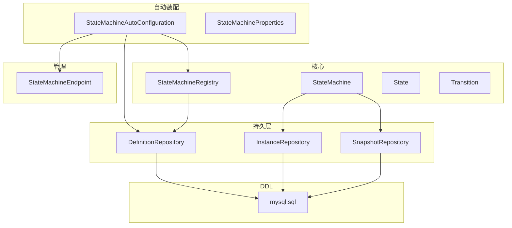
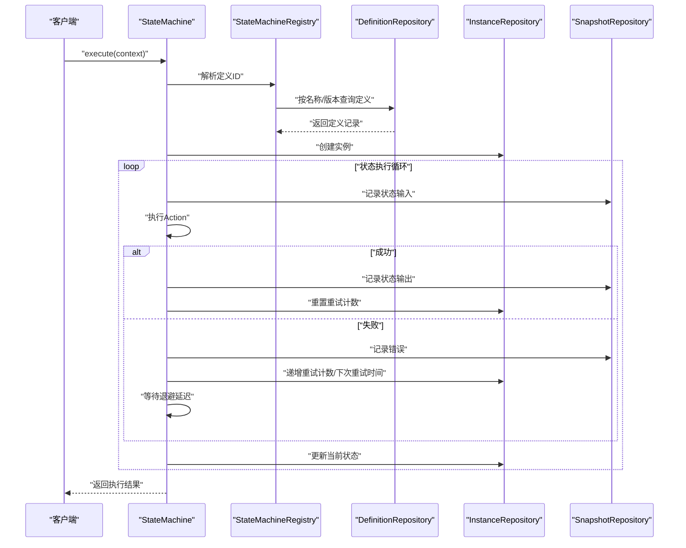
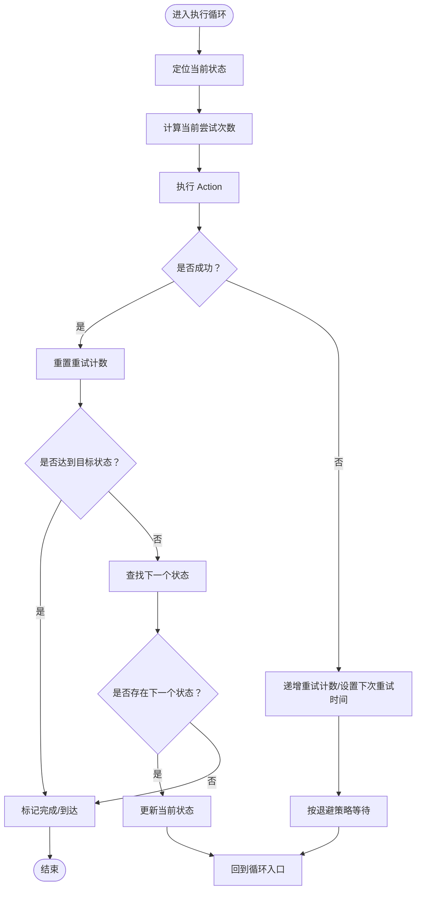
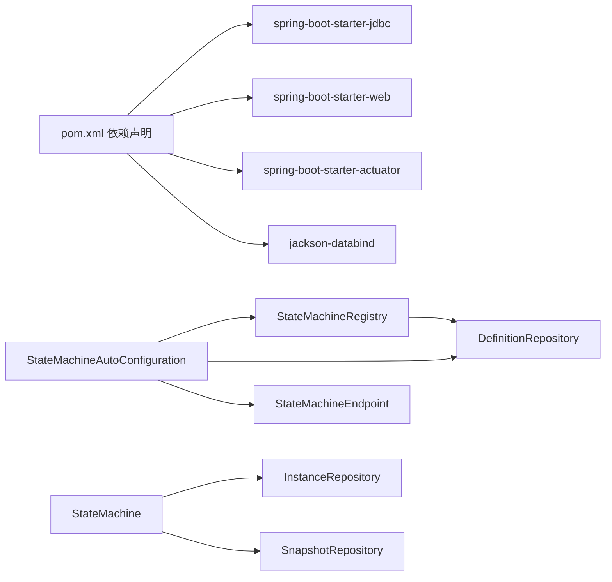

# 性能调优

<cite>
**本文引用的文件**
- [src/main/java/cn/chedejun/statemachine/autoconfigure/StateMachineAutoConfiguration.java](file://src/main/java/cn/chedejun/statemachine/autoconfigure/StateMachineAutoConfiguration.java)
- [src/main/java/cn/chedejun/statemachine/autoconfigure/StateMachineProperties.java](file://src/main/java/cn/chedejun/statemachine/autoconfigure/StateMachineProperties.java)
- [src/main/java/cn/chedejun/statemachine/core/StateMachine.java](file://src/main/java/cn/chedejun/statemachine/core/StateMachine.java)
- [src/main/java/cn/chedejun/statemachine/core/StateMachineRegistry.java](file://src/main/java/cn/chedejun/statemachine/core/StateMachineRegistry.java)
- [src/main/java/cn/chedejun/statemachine/core/State.java](file://src/main/java/cn/chedejun/statemachine/core/State.java)
- [src/main/java/cn/chedejun/statemachine/core/Transition.java](file://src/main/java/cn/chedejun/statemachine/core/Transition.java)
- [src/main/java/cn/chedejun/statemachine/persistence/DefinitionRepository.java](file://src/main/java/cn/chedejun/statemachine/persistence/DefinitionRepository.java)
- [src/main/java/cn/chedejun/statemachine/persistence/InstanceRepository.java](file://src/main/java/cn/chedejun/statemachine/persistence/InstanceRepository.java)
- [src/main/java/cn/chedejun/statemachine/persistence/SnapshotRepository.java](file://src/main/java/cn/chedejun/statemachine/persistence/SnapshotRepository.java)
- [src/main/java/cn/chedejun/statemachine/management/StateMachineEndpoint.java](file://src/main/java/cn/chedejun/statemachine/management/StateMachineEndpoint.java)
- [src/main/resources/ddl/mysql.sql](file://src/main/resources/ddl/mysql.sql)
- [demo/src/main/resources/application.yml](file://demo/src/main/resources/application.yml)
- [pom.xml](file://pom.xml)
- [README.md](file://README.md)
- [src/test/java/cn/chedejun/statemachine/integration/StateMachineIntegrationTest.java](file://src/test/java/cn/chedejun/statemachine/integration/StateMachineIntegrationTest.java)
</cite>

## 目录
1. [简介](#简介)
2. [项目结构](#项目结构)
3. [核心组件](#核心组件)
4. [架构总览](#架构总览)
5. [详细组件分析](#详细组件分析)
6. [依赖分析](#依赖分析)
7. [性能考虑](#性能考虑)
8. [故障排查指南](#故障排查指南)
9. [结论](#结论)
10. [附录](#附录)

## 简介
本指南面向状态机在生产环境中的性能调优，围绕数据库性能、状态机执行性能、缓存策略、并发处理与监控指标展开。结合代码库中实际的持久层实现、状态机执行循环与注册表机制，给出可落地的优化建议与容量规划思路。

## 项目结构
该项目采用 Spring Boot 自动装配 + JDBC 持久化的轻量级状态机实现，主要模块如下：
- 自动装配与属性：负责按需加载持久化组件、注册表与管理端点
- 核心状态机与注册表：负责状态机构建、执行、重试与版本化定义存储
- 持久层：定义、实例、快照三张表的 CRUD 封装
- 管理端点：提供 Actuator 端点与 Web 控制台接口
- DDL 脚本：定义三张核心表及字段类型
- 示例与测试：演示配置、执行与集成测试

图表来源
- [src/main/java/cn/chedejun/statemachine/autoconfigure/StateMachineAutoConfiguration.java:22-79](file://src/main/java/cn/chedejun/statemachine/autoconfigure/StateMachineAutoConfiguration.java#L22-L79)
- [src/main/java/cn/chedejun/statemachine/core/StateMachine.java:11-35](file://src/main/java/cn/chedejun/statemachine/core/StateMachine.java#L11-L35)
- [src/main/java/cn/chedejun/statemachine/core/StateMachineRegistry.java:9-18](file://src/main/java/cn/chedejun/statemachine/core/StateMachineRegistry.java#L9-L18)
- [src/main/java/cn/chedejun/statemachine/persistence/DefinitionRepository.java:15-22](file://src/main/java/cn/chedejun/statemachine/persistence/DefinitionRepository.java#L15-L22)
- [src/main/java/cn/chedejun/statemachine/persistence/InstanceRepository.java:11-13](file://src/main/java/cn/chedejun/statemachine/persistence/InstanceRepository.java#L11-L13)
- [src/main/java/cn/chedejun/statemachine/persistence/SnapshotRepository.java:11-13](file://src/main/java/cn/chedejun/statemachine/persistence/SnapshotRepository.java#L11-L13)
- [src/main/java/cn/chedejun/statemachine/management/StateMachineEndpoint.java:16-30](file://src/main/java/cn/chedejun/statemachine/management/StateMachineEndpoint.java#L16-L30)
- [src/main/resources/ddl/mysql.sql:1-18](file://src/main/resources/ddl/mysql.sql#L1-L18)

章节来源
- [src/main/java/cn/chedejun/statemachine/autoconfigure/StateMachineAutoConfiguration.java:22-79](file://src/main/java/cn/chedejun/statemachine/autoconfigure/StateMachineAutoConfiguration.java#L22-L79)
- [src/main/java/cn/chedejun/statemachine/autoconfigure/StateMachineProperties.java:5-34](file://src/main/java/cn/chedejun/statemachine/autoconfigure/StateMachineProperties.java#L5-L34)
- [src/main/resources/ddl/mysql.sql:1-18](file://src/main/resources/ddl/mysql.sql#L1-L18)

## 核心组件
- 自动装配与属性
  - 自动装配根据数据源存在性按需创建 DDL 初始化器、定义仓库、注册表以及管理端点
  - 属性类提供 DDL 行为、重试策略默认值、管理与控制台开关
- 状态机与注册表
  - 注册表负责将状态机定义持久化为 JSON 并缓存于内存映射，避免重复入库
  - 状态机执行时通过注册表解析定义 ID，并使用实例与快照仓库进行持久化
- 持久层
  - 定义仓库：保存/查询状态机定义（JSON 字段）
  - 实例仓库：创建实例、更新状态/重试计数、分页查询与统计
  - 快照仓库：记录每个状态的输入/输出/错误与尝试次数
- 管理端点
  - 提供机器清单、版本详情、实例重试等能力，便于运维与可观测性

章节来源
- [src/main/java/cn/chedejun/statemachine/autoconfigure/StateMachineAutoConfiguration.java:28-78](file://src/main/java/cn/chedejun/statemachine/autoconfigure/StateMachineAutoConfiguration.java#L28-L78)
- [src/main/java/cn/chedejun/statemachine/autoconfigure/StateMachineProperties.java:18-34](file://src/main/java/cn/chedejun/statemachine/autoconfigure/StateMachineProperties.java#L18-L34)
- [src/main/java/cn/chedejun/statemachine/core/StateMachineRegistry.java:20-49](file://src/main/java/cn/chedejun/statemachine/core/StateMachineRegistry.java#L20-L49)
- [src/main/java/cn/chedejun/statemachine/core/StateMachine.java:40-136](file://src/main/java/cn/chedejun/statemachine/core/StateMachine.java#L40-L136)
- [src/main/java/cn/chedejun/statemachine/persistence/DefinitionRepository.java:24-76](file://src/main/java/cn/chedejun/statemachine/persistence/DefinitionRepository.java#L24-L76)
- [src/main/java/cn/chedejun/statemachine/persistence/InstanceRepository.java:15-64](file://src/main/java/cn/chedejun/statemachine/persistence/InstanceRepository.java#L15-L64)
- [src/main/java/cn/chedejun/statemachine/persistence/SnapshotRepository.java:15-53](file://src/main/java/cn/chedejun/statemachine/persistence/SnapshotRepository.java#L15-L53)
- [src/main/java/cn/chedejun/statemachine/management/StateMachineEndpoint.java:32-71](file://src/main/java/cn/chedejun/statemachine/management/StateMachineEndpoint.java#L32-L71)

## 架构总览
下图展示状态机执行路径与持久化交互，以及注册表缓存与管理端点的关系。

图表来源
- [src/main/java/cn/chedejun/statemachine/core/StateMachine.java:40-136](file://src/main/java/cn/chedejun/statemachine/core/StateMachine.java#L40-L136)
- [src/main/java/cn/chedejun/statemachine/core/StateMachineRegistry.java:63-69](file://src/main/java/cn/chedejun/statemachine/core/StateMachineRegistry.java#L63-L69)
- [src/main/java/cn/chedejun/statemachine/persistence/DefinitionRepository.java:52-62](file://src/main/java/cn/chedejun/statemachine/persistence/DefinitionRepository.java#L52-L62)
- [src/main/java/cn/chedejun/statemachine/persistence/InstanceRepository.java:15-51](file://src/main/java/cn/chedejun/statemachine/persistence/InstanceRepository.java#L15-L51)
- [src/main/java/cn/chedejun/statemachine/persistence/SnapshotRepository.java:15-39](file://src/main/java/cn/chedejun/statemachine/persistence/SnapshotRepository.java#L15-L39)

## 详细组件分析

### 数据库层（持久化与索引设计）
- 表结构要点
  - 定义表：主键 + 唯一索引（name, version），JSON 字段存储状态与转换信息
  - 实例表：主键；按 machine_name 查询与排序；带 status 统计字段
  - 快照表：按 instance_id 排序，记录状态名、输入/输出、错误与尝试次数
- 建议索引
  - 实例表：machine_name + status 组合索引，用于分页与统计
  - 快照表：instance_id + state_name 组合索引，加速按实例检索与去重
  - 定义表：name + version 已有唯一索引，满足按名称/版本查找
- 查询优化
  - 分页查询使用 LIMIT/OFFSET，建议配合主键回表减少排序成本
  - 统计查询优先使用覆盖索引，避免全表扫描
- 连接池配置
  - 建议启用连接池（如 HikariCP）并设置合理的最小/最大连接数、空闲超时与连接生命周期
  - 对高频查询（按实例/机器名）增加只读连接池或连接池分组

章节来源
- [src/main/resources/ddl/mysql.sql:1-18](file://src/main/resources/ddl/mysql.sql#L1-L18)
- [src/main/java/cn/chedejun/statemachine/persistence/InstanceRepository.java:40-51](file://src/main/java/cn/chedejun/statemachine/persistence/InstanceRepository.java#L40-L51)
- [src/main/java/cn/chedejun/statemachine/persistence/SnapshotRepository.java:37-43](file://src/main/java/cn/chedejun/statemachine/persistence/SnapshotRepository.java#L37-L43)

### 状态机执行性能（状态数量、转换复杂度、Action 执行时间）
- 状态数量与转换复杂度
  - 状态机执行循环遍历状态与转换，复杂度与状态数与转换数线性相关
  - 转换条件判断在每次状态切换时执行，应保持条件逻辑简洁
- Action 执行时间
  - Action 是业务耗时热点，建议异步化或外部化 IO 密集型操作
  - 对慢 Action 增加超时与熔断，避免阻塞执行循环
- 最大迭代限制
  - 执行循环内置最大迭代上限，防止异常状态导致死循环

图表来源
- [src/main/java/cn/chedejun/statemachine/core/StateMachine.java:83-136](file://src/main/java/cn/chedejun/statemachine/core/StateMachine.java#L83-L136)

章节来源
- [src/main/java/cn/chedejun/statemachine/core/StateMachine.java:83-136](file://src/main/java/cn/chedejun/statemachine/core/StateMachine.java#L83-L136)

### 缓存策略（定义缓存与执行实例缓存）
- 定义缓存
  - 注册表以内存 Map 缓存已注册的状态机定义，避免重复入库与重复序列化
  - 建议在多实例部署时引入分布式缓存（如 Redis）以共享定义元数据
- 执行实例缓存
  - 可缓存最近活跃实例的上下文与快照摘要，降低频繁查询数据库的开销
  - 注意缓存失效策略与一致性，确保与数据库最终一致

章节来源
- [src/main/java/cn/chedejun/statemachine/core/StateMachineRegistry.java:12-26](file://src/main/java/cn/chedejun/statemachine/core/StateMachineRegistry.java#L12-L26)
- [src/main/java/cn/chedejun/statemachine/core/StateMachine.java:161-166](file://src/main/java/cn/chedejun/statemachine/core/StateMachine.java#L161-L166)

### 并发处理优化（线程池与锁竞争）
- 线程池配置
  - 执行循环内部使用阻塞式 sleep 实现退避等待，不建议在单个状态机内大量并发执行
  - 建议将状态机执行置于独立线程池，限制并发度并设置队列长度与拒绝策略
- 锁竞争优化
  - 注册表使用并发 Map，写入发生在状态机注册阶段，运行时读多写少
  - 实例更新采用乐观更新（状态、重试计数、错误信息），建议数据库层面使用合适的隔离级别与冲突处理

章节来源
- [src/main/java/cn/chedejun/statemachine/core/StateMachine.java:107-111](file://src/main/java/cn/chedejun/statemachine/core/StateMachine.java#L107-L111)
- [src/main/java/cn/chedejun/statemachine/core/StateMachineRegistry.java](file://src/main/java/cn/chedejun/statemachine/core/StateMachineRegistry.java#L12)

### 性能基准测试方法与监控指标
- 基准测试
  - 使用不同状态数量、转换复杂度与 Action 耗时组合构造压测场景
  - 记录吞吐量（TPS）、P99 延迟、重试率、数据库 QPS 与慢查询比例
- 监控指标
  - 应用层：状态机执行次数、平均/分位延迟、失败率、重试次数分布
  - 数据库层：连接池利用率、慢查询数、锁等待、缓冲池命中率
  - 运维层：实例总数、运行中/失败实例数、快照条目增长速率

章节来源
- [src/main/java/cn/chedejun/statemachine/management/StateMachineEndpoint.java:32-43](file://src/main/java/cn/chedejun/statemachine/management/StateMachineEndpoint.java#L32-L43)
- [src/test/java/cn/chedejun/statemachine/integration/StateMachineIntegrationTest.java:314-332](file://src/test/java/cn/chedejun/statemachine/integration/StateMachineIntegrationTest.java#L314-L332)

## 依赖分析
- 外部依赖
  - Spring Boot Starter JDBC/Web/Actuator 为可选依赖，按需启用
  - Jackson 用于定义与重试策略的 JSON 序列化
- 内部耦合
  - 自动装配与注册表、持久层之间为弱耦合，通过接口与 BeanPostProcessor 注入
  - 状态机与持久层通过模板方法与 JdbcTemplate 解耦

图表来源
- [pom.xml:33-67](file://pom.xml#L33-L67)
- [src/main/java/cn/chedejun/statemachine/autoconfigure/StateMachineAutoConfiguration.java:28-78](file://src/main/java/cn/chedejun/statemachine/autoconfigure/StateMachineAutoConfiguration.java#L28-L78)

章节来源
- [pom.xml:33-67](file://pom.xml#L33-L67)
- [src/main/java/cn/chedejun/statemachine/autoconfigure/StateMachineAutoConfiguration.java:28-78](file://src/main/java/cn/chedejun/statemachine/autoconfigure/StateMachineAutoConfiguration.java#L28-L78)

## 性能考虑
- 数据库性能
  - 为高频查询字段建立合适索引，避免全表扫描
  - 使用连接池参数调优与慢查询日志定位瓶颈
- 执行性能
  - 控制状态数量与转换复杂度，简化条件表达式
  - 将 IO 密集型 Action 异步化，缩短执行循环阻塞时间
- 缓存与并发
  - 利用注册表内存缓存与可选的分布式缓存
  - 通过线程池限制并发，避免过度争抢数据库连接
- 监控与容量
  - 建立完善的指标体系与告警阈值
  - 基于历史峰值与增长趋势进行容量规划与弹性伸缩

## 故障排查指南
- 常见问题
  - 执行超限：检查状态机设计是否合理，避免环状或长链式状态
  - 重试风暴：调整退避策略与最大重试次数，避免无限重试
  - 数据库慢查询：确认索引是否生效，必要时重建或添加复合索引
- 排查步骤
  - 通过管理端点查看实例状态与重试计数
  - 检查快照表中失败状态的错误信息与尝试次数
  - 对比数据库连接池使用情况与慢查询日志

章节来源
- [src/main/java/cn/chedejun/statemachine/management/StateMachineEndpoint.java:62-71](file://src/main/java/cn/chedejun/statemachine/management/StateMachineEndpoint.java#L62-L71)
- [src/main/java/cn/chedejun/statemachine/persistence/SnapshotRepository.java:37-43](file://src/main/java/cn/chedejun/statemachine/persistence/SnapshotRepository.java#L37-L43)
- [src/main/java/cn/chedejun/statemachine/core/StateMachine.java:104-116](file://src/main/java/cn/chedejun/statemachine/core/StateMachine.java#L104-L116)

## 结论
通过合理的数据库索引与查询优化、精简状态机设计与 Action 耗时控制、注册表与实例缓存、线程池并发限制以及完善的监控与容量规划，可在保证可靠性的同时显著提升状态机执行性能与系统整体吞吐。

## 附录
- 配置参考
  - 数据源与状态机属性示例见示例应用配置文件
  - 自动装配启用条件与端点暴露由属性与类路径决定

章节来源
- [demo/src/main/resources/application.yml:4-22](file://demo/src/main/resources/application.yml#L4-L22)
- [src/main/java/cn/chedejun/statemachine/autoconfigure/StateMachineAutoConfiguration.java:58-78](file://src/main/java/cn/chedejun/statemachine/autoconfigure/StateMachineAutoConfiguration.java#L58-L78)
- [README.md:55-64](file://README.md#L55-L64)