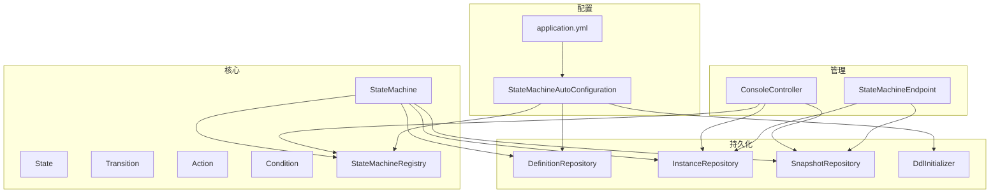
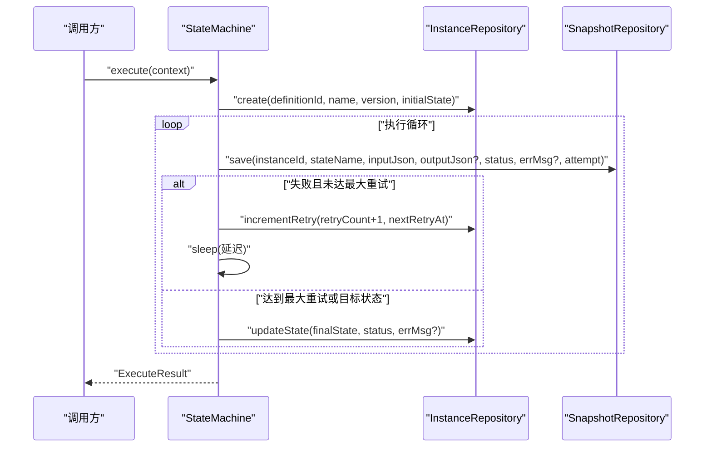
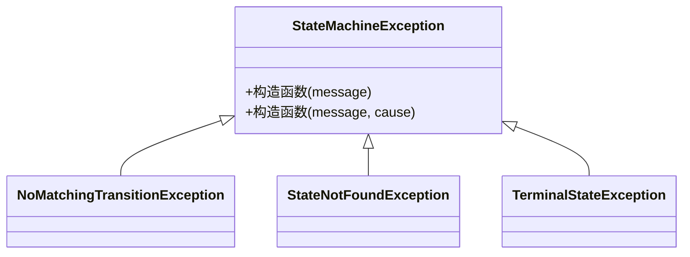
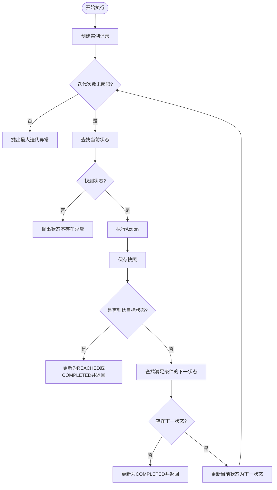
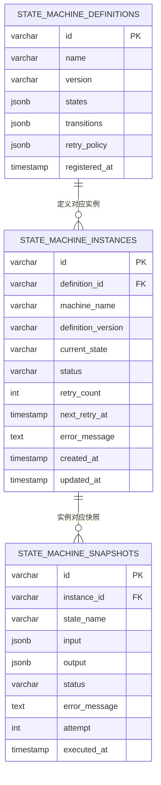
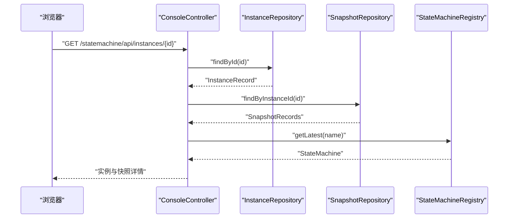
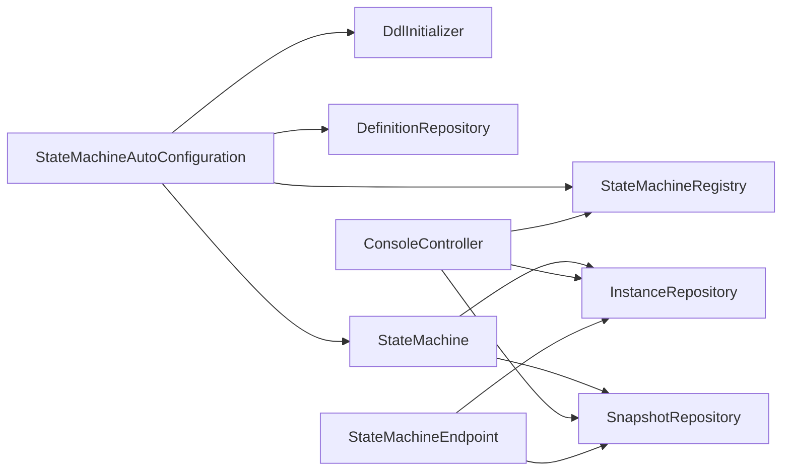

# 故障排查与诊断

<cite>
**本文引用的文件**
- [README.md](file://README.md)
- [StateMachineException.java](file://src/main/java/cn/chedejun/statemachine/core/StateMachineException.java)
- [StateMachine.java](file://src/main/java/cn/chedejun/statemachine/core/StateMachine.java)
- [StateMachineBuilder.java](file://src/main/java/cn/chedejun/statemachine/core/StateMachineBuilder.java)
- [State.java](file://src/main/java/cn/chedejun/statemachine/core/State.java)
- [Transition.java](file://src/main/java/cn/chedejun/statemachine/core/Transition.java)
- [Action.java](file://src/main/java/cn/chedejun/statemachine/core/Action.java)
- [Condition.java](file://src/main/java/cn/chedejun/statemachine/core/Condition.java)
- [DefinitionRepository.java](file://src/main/java/cn/chedejun/statemachine/persistence/DefinitionRepository.java)
- [InstanceRepository.java](file://src/main/java/cn/chedejun/statemachine/persistence/InstanceRepository.java)
- [SnapshotRepository.java](file://src/main/java/cn/chedejun/statemachine/persistence/SnapshotRepository.java)
- [DdlInitializer.java](file://src/main/java/cn/chedejun/statemachine/persistence/DdlInitializer.java)
- [postgresql.sql](file://src/main/resources/ddl/postgresql.sql)
- [StateMachineAutoConfiguration.java](file://src/main/java/cn/chedejun/statemachine/autoconfigure/StateMachineAutoConfiguration.java)
- [ConsoleController.java](file://src/main/java/cn/chedejun/statemachine/management/ConsoleController.java)
- [StateMachineEndpoint.java](file://src/main/java/cn/chedejun/statemachine/management/StateMachineEndpoint.java)
- [application.yml](file://demo/src/main/resources/application.yml)
- [StateMachineIntegrationTest.java](file://src/test/java/cn/chedejun/statemachine/integration/StateMachineIntegrationTest.java)
</cite>

## 目录
1. [简介](#简介)
2. [项目结构](#项目结构)
3. [核心组件](#核心组件)
4. [架构总览](#架构总览)
5. [详细组件分析](#详细组件分析)
6. [依赖分析](#依赖分析)
7. [性能考虑](#性能考虑)
8. [故障排查指南](#故障排查指南)
9. [结论](#结论)
10. [附录](#附录)

## 简介
本指南面向状态机运行时的故障排查与诊断，覆盖状态机定义错误、执行异常、数据库连接问题等常见场景；提供调试工具与诊断命令、日志分析技巧、性能诊断流程（慢查询与内存泄漏）、故障恢复与应急处理，以及预防性最佳实践。

## 项目结构
该项目采用分层与功能模块结合的组织方式：
- 核心层：状态机定义、执行引擎、重试策略与注册表
- 持久化层：定义、实例、快照三类数据的仓库与DDL初始化
- 管理与控制台：Actuator端点与Web控制台
- 自动装配：基于Spring Boot的条件化装配与属性绑定

图表来源
- [StateMachine.java:11-196](file://src/main/java/cn/chedejun/statemachine/core/StateMachine.java#L11-L196)
- [DefinitionRepository.java:15-78](file://src/main/java/cn/chedejun/statemachine/persistence/DefinitionRepository.java#L15-L78)
- [InstanceRepository.java:11-66](file://src/main/java/cn/chedejun/statemachine/persistence/InstanceRepository.java#L11-L66)
- [SnapshotRepository.java:11-55](file://src/main/java/cn/chedejun/statemachine/persistence/SnapshotRepository.java#L11-L55)
- [DdlInitializer.java:9-54](file://src/main/java/cn/chedejun/statemachine/persistence/DdlInitializer.java#L9-L54)
- [StateMachineEndpoint.java:16-73](file://src/main/java/cn/chedejun/statemachine/management/StateMachineEndpoint.java#L16-L73)
- [ConsoleController.java:15-106](file://src/main/java/cn/chedejun/statemachine/management/ConsoleController.java#L15-L106)
- [StateMachineAutoConfiguration.java:22-80](file://src/main/java/cn/chedejun/statemachine/autoconfigure/StateMachineAutoConfiguration.java#L22-L80)
- [application.yml:1-23](file://demo/src/main/resources/application.yml#L1-L23)

章节来源
- [README.md:1-65](file://README.md#L1-L65)
- [StateMachineAutoConfiguration.java:22-80](file://src/main/java/cn/chedejun/statemachine/autoconfigure/StateMachineAutoConfiguration.java#L22-L80)
- [application.yml:1-23](file://demo/src/main/resources/application.yml#L1-L23)

## 核心组件
- 状态机引擎：负责状态流转、执行循环、重试与快照记录
- 定义与版本：以JSON形式持久化状态机定义，支持多版本并行
- 实例与快照：记录实例状态、错误信息、重试次数与时序快照
- 管理与控制台：提供REST接口与Web界面，支持重试与实例详情查看
- 自动装配：按需启用DDL初始化、注册表、管理端点与控制台

章节来源
- [StateMachine.java:11-196](file://src/main/java/cn/chedejun/statemachine/core/StateMachine.java#L11-L196)
- [DefinitionRepository.java:15-78](file://src/main/java/cn/chedejun/statemachine/persistence/DefinitionRepository.java#L15-L78)
- [InstanceRepository.java:11-66](file://src/main/java/cn/chedejun/statemachine/persistence/InstanceRepository.java#L11-L66)
- [SnapshotRepository.java:11-55](file://src/main/java/cn/chedejun/statemachine/persistence/SnapshotRepository.java#L11-L55)
- [ConsoleController.java:15-106](file://src/main/java/cn/chedejun/statemachine/management/ConsoleController.java#L15-L106)
- [StateMachineEndpoint.java:16-73](file://src/main/java/cn/chedejun/statemachine/management/StateMachineEndpoint.java#L16-L73)

## 架构总览
状态机在执行过程中会：
- 创建实例记录并进入执行循环
- 在每个状态执行Action，记录成功或失败的快照
- 根据重试策略进行延迟重试，超过最大次数则标记为FAILED
- 支持从首次快照反序列化上下文进行重试

图表来源
- [StateMachine.java:40-136](file://src/main/java/cn/chedejun/statemachine/core/StateMachine.java#L40-L136)
- [InstanceRepository.java:15-38](file://src/main/java/cn/chedejun/statemachine/persistence/InstanceRepository.java#L15-L38)
- [SnapshotRepository.java:15-31](file://src/main/java/cn/chedejun/statemachine/persistence/SnapshotRepository.java#L15-L31)

## 详细组件分析

### 异常体系与常见错误类型
- 无匹配转换：当当前状态无法找到满足条件的下一个状态时抛出
- 状态不存在：引用了未定义的状态名
- 终止状态：对已处于终止状态的实例再次操作
- 初始化异常：未注入数据源导致状态机未初始化

图表来源
- [StateMachineException.java:3-18](file://src/main/java/cn/chedejun/statemachine/core/StateMachineException.java#L3-L18)

章节来源
- [StateMachineException.java:3-18](file://src/main/java/cn/chedejun/statemachine/core/StateMachineException.java#L3-L18)
- [StateMachine.java:91-92](file://src/main/java/cn/chedejun/statemachine/core/StateMachine.java#L91-L92)
- [StateMachine.java:113-115](file://src/main/java/cn/chedejun/statemachine/core/StateMachine.java#L113-L115)
- [StateMachine.java:178-180](file://src/main/java/cn/chedejun/statemachine/core/StateMachine.java#L178-L180)

### 执行流程与重试机制
- 执行入口：支持从任意起始状态、目标状态执行
- 状态查找：根据当前状态定位State
- 快照记录：成功写入输出，失败写入错误信息
- 重试策略：指数退避，睡眠后继续执行
- 终止条件：达到目标状态或无后续状态

图表来源
- [StateMachine.java:83-136](file://src/main/java/cn/chedejun/statemachine/core/StateMachine.java#L83-L136)

章节来源
- [StateMachine.java:40-136](file://src/main/java/cn/chedejun/statemachine/core/StateMachine.java#L40-L136)

### 数据模型与持久化
- 定义表：存储状态机名称、版本、状态集合、转换集合、重试策略
- 实例表：跟踪实例的当前状态、重试次数、下次重试时间、错误信息
- 快照表：记录每次状态执行的输入、输出、状态、错误与尝试次数

图表来源
- [postgresql.sql:1-18](file://src/main/resources/ddl/postgresql.sql#L1-L18)
- [DefinitionRepository.java:24-46](file://src/main/java/cn/chedejun/statemachine/persistence/DefinitionRepository.java#L24-L46)
- [InstanceRepository.java:15-38](file://src/main/java/cn/chedejun/statemachine/persistence/InstanceRepository.java#L15-L38)
- [SnapshotRepository.java:15-31](file://src/main/java/cn/chedejun/statemachine/persistence/SnapshotRepository.java#L15-L31)

章节来源
- [DefinitionRepository.java:15-78](file://src/main/java/cn/chedejun/statemachine/persistence/DefinitionRepository.java#L15-L78)
- [InstanceRepository.java:11-66](file://src/main/java/cn/chedejun/statemachine/persistence/InstanceRepository.java#L11-L66)
- [SnapshotRepository.java:11-55](file://src/main/java/cn/chedejun/statemachine/persistence/SnapshotRepository.java#L11-L55)
- [postgresql.sql:1-18](file://src/main/resources/ddl/postgresql.sql#L1-L18)

### 管理与控制台
- 控制台：列出机器与版本、实例列表、实例详情、触发重试
- Actuator端点：暴露状态机清单、版本、实例重试能力
- 自动装配：按配置开关启用管理端点与控制台

图表来源
- [ConsoleController.java:78-104](file://src/main/java/cn/chedejun/statemachine/management/ConsoleController.java#L78-L104)
- [InstanceRepository.java:23-26](file://src/main/java/cn/chedejun/statemachine/persistence/InstanceRepository.java#L23-L26)
- [SnapshotRepository.java:37-43](file://src/main/java/cn/chedejun/statemachine/persistence/SnapshotRepository.java#L37-L43)
- [StateMachineAutoConfiguration.java:70-78](file://src/main/java/cn/chedejun/statemachine/autoconfigure/StateMachineAutoConfiguration.java#L70-L78)

章节来源
- [ConsoleController.java:15-106](file://src/main/java/cn/chedejun/statemachine/management/ConsoleController.java#L15-L106)
- [StateMachineEndpoint.java:16-73](file://src/main/java/cn/chedejun/statemachine/management/StateMachineEndpoint.java#L16-L73)
- [StateMachineAutoConfiguration.java:58-78](file://src/main/java/cn/chedejun/statemachine/autoconfigure/StateMachineAutoConfiguration.java#L58-L78)

## 依赖分析
- 状态机依赖JDBC模板进行数据库操作，依赖注册表进行版本管理
- 自动装配在存在数据源时初始化DDL、定义仓库、注册表，并注入状态机
- 控制台与端点依赖JDBC模板与注册表进行数据查询与重试

图表来源
- [StateMachineAutoConfiguration.java:26-56](file://src/main/java/cn/chedejun/statemachine/autoconfigure/StateMachineAutoConfiguration.java#L26-L56)
- [StateMachine.java:19-35](file://src/main/java/cn/chedejun/statemachine/core/StateMachine.java#L19-L35)

章节来源
- [StateMachineAutoConfiguration.java:22-80](file://src/main/java/cn/chedejun/statemachine/autoconfigure/StateMachineAutoConfiguration.java#L22-L80)
- [StateMachine.java:19-35](file://src/main/java/cn/chedejun/statemachine/core/StateMachine.java#L19-L35)

## 性能考虑
- 慢查询分析
  - 关注实例与快照的查询路径：按机器名、状态、时间排序与分页
  - 建议在机器名与状态字段上建立索引，避免全表扫描
- 内存泄漏检测
  - 确保Action中不持有长生命周期对象引用
  - 上下文序列化/反序列化失败时应避免重复尝试造成堆积
- 并发与重试
  - 重试采用睡眠策略，注意线程中断处理
  - 控制最大重试次数与延迟上限，防止资源耗尽

章节来源
- [InstanceRepository.java:40-51](file://src/main/java/cn/chedejun/statemachine/persistence/InstanceRepository.java#L40-L51)
- [SnapshotRepository.java:37-43](file://src/main/java/cn/chedejun/statemachine/persistence/SnapshotRepository.java#L37-L43)
- [StateMachine.java:104-115](file://src/main/java/cn/chedejun/statemachine/core/StateMachine.java#L104-L115)

## 故障排查指南

### 一、常见错误类型与识别
- 状态机定义错误
  - 症状：执行时抛出“状态不存在”或“无匹配转换”
  - 排查要点：确认状态名拼写、转换条件与初始状态一致
- 执行异常
  - 症状：某状态Action抛出异常，实例最终标记为FAILED
  - 排查要点：查看快照中的错误消息与尝试次数
- 数据库连接问题
  - 症状：初始化DDL失败、状态机未初始化
  - 排查要点：检查数据源配置、驱动类名、网络连通性

章节来源
- [StateMachineException.java:7-17](file://src/main/java/cn/chedejun/statemachine/core/StateMachineException.java#L7-L17)
- [StateMachine.java:91-92](file://src/main/java/cn/chedejun/statemachine/core/StateMachine.java#L91-L92)
- [DdlInitializer.java:39-42](file://src/main/java/cn/chedejun/statemachine/persistence/DdlInitializer.java#L39-L42)
- [StateMachine.java:178-180](file://src/main/java/cn/chedejun/statemachine/core/StateMachine.java#L178-L180)

### 二、调试工具与诊断命令
- Web控制台
  - 访问地址：http://host:port/statemachine/
  - 功能：查看机器与版本、实例列表、实例详情、触发重试
- Actuator端点
  - 暴露ID：state-machines
  - 操作：读取机器清单与版本；写操作重置FAILED实例为RUNNING
- 配置示例
  - 管理端点与控制台开启、DDL自动创建、数据源配置

章节来源
- [README.md:51-53](file://README.md#L51-L53)
- [application.yml:11-22](file://demo/src/main/resources/application.yml#L11-L22)
- [ConsoleController.java:19-22](file://src/main/java/cn/chedejun/statemachine/management/ConsoleController.java#L19-L22)
- [StateMachineEndpoint.java:16-73](file://src/main/java/cn/chedejun/statemachine/management/StateMachineEndpoint.java#L16-L73)

### 三、日志分析技巧
- 关键日志字段
  - 实例ID、机器名、版本、当前状态、状态变更时间
  - 错误消息、重试次数、下次重试时间
  - 快照状态（SUCCESS/FAILED）、尝试次数、执行时间
- 错误追踪方法
  - 从实例详情定位失败快照，核对输入与错误消息
  - 使用控制台或端点重置FAILED实例，重新执行

章节来源
- [InstanceRepository.java:28-38](file://src/main/java/cn/chedejun/statemachine/persistence/InstanceRepository.java#L28-L38)
- [SnapshotRepository.java:15-31](file://src/main/java/cn/chedejun/statemachine/persistence/SnapshotRepository.java#L15-L31)
- [ConsoleController.java:78-89](file://src/main/java/cn/chedejun/statemachine/management/ConsoleController.java#L78-L89)

### 四、性能问题诊断流程
- 慢查询分析
  - 步骤：确认查询SQL、索引缺失、分页参数过大
  - 建议：为机器名与状态添加索引，限制单页大小
- 内存泄漏检测
  - 步骤：检查Action中对象引用、上下文序列化失败重试
  - 建议：避免持有外部资源引用，及时释放

章节来源
- [InstanceRepository.java:40-51](file://src/main/java/cn/chedejun/statemachine/persistence/InstanceRepository.java#L40-L51)
- [SnapshotRepository.java:37-43](file://src/main/java/cn/chedejun/statemachine/persistence/SnapshotRepository.java#L37-L43)
- [StateMachine.java:151-160](file://src/main/java/cn/chedejun/statemachine/core/StateMachine.java#L151-L160)

### 五、故障恢复与应急处理
- 重试策略
  - 对FAILED实例先重置为RUNNING，再调用重试接口
  - 若无新上下文，可从首次快照反序列化上下文
- 应急处理
  - 临时禁用自动重试，改为手动干预
  - 清理历史快照与实例，降低查询压力

章节来源
- [ConsoleController.java:91-104](file://src/main/java/cn/chedejun/statemachine/management/ConsoleController.java#L91-L104)
- [StateMachine.java:64-79](file://src/main/java/cn/chedejun/statemachine/core/StateMachine.java#L64-L79)
- [StateMachine.java:50-59](file://src/main/java/cn/chedejun/statemachine/core/StateMachine.java#L50-L59)

### 六、故障预防与最佳实践
- 定义阶段
  - 明确状态与转换条件，确保可达性与完备性
  - 为关键状态设置合理的重试策略
- 运行阶段
  - 监控FAILED实例数量与重试频率
  - 限制单次执行的上下文大小，避免序列化开销
- 数据库层面
  - 合理设计索引，定期清理过期数据
  - 使用分页查询，避免一次性拉取大量数据

章节来源
- [StateMachineBuilder.java:40-51](file://src/main/java/cn/chedejun/statemachine/core/StateMachineBuilder.java#L40-L51)
- [StateMachine.java:104-115](file://src/main/java/cn/chedejun/statemachine/core/StateMachine.java#L104-L115)
- [postgresql.sql:1-18](file://src/main/resources/ddl/postgresql.sql#L1-L18)

## 结论
通过完善的异常体系、详尽的快照记录、可控的重试策略与可视化的管理界面，本状态机具备良好的可观测性与可维护性。遵循本文的排查流程与最佳实践，可快速定位并解决常见问题，保障生产环境稳定运行。

## 附录

### A. 关键数据结构与复杂度
- 状态查找：线性遍历状态列表，O(n)
- 转换选择：线性遍历转换列表，O(m)
- 快照查询：按实例ID排序查询，O(k log k)排序成本
- 重试计数：基于快照统计，O(k)

章节来源
- [StateMachine.java:138-149](file://src/main/java/cn/chedejun/statemachine/core/StateMachine.java#L138-L149)
- [SnapshotRepository.java:37-43](file://src/main/java/cn/chedejun/statemachine/persistence/SnapshotRepository.java#L37-L43)

### B. 测试参考
- 集成测试覆盖自动装配、执行流程、重试机制与API行为
- 可作为本地复现与回归验证的依据

章节来源
- [StateMachineIntegrationTest.java:43-92](file://src/test/java/cn/chedejun/statemachine/integration/StateMachineIntegrationTest.java#L43-L92)
- [StateMachineIntegrationTest.java:150-182](file://src/test/java/cn/chedejun/statemachine/integration/StateMachineIntegrationTest.java#L150-L182)
- [StateMachineIntegrationTest.java:204-234](file://src/test/java/cn/chedejun/statemachine/integration/StateMachineIntegrationTest.java#L204-L234)
- [StateMachineIntegrationTest.java:238-310](file://src/test/java/cn/chedejun/statemachine/integration/StateMachineIntegrationTest.java#L238-L310)