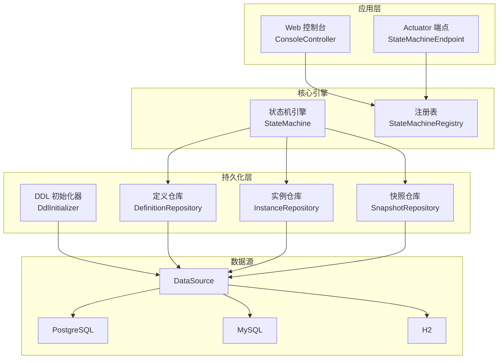
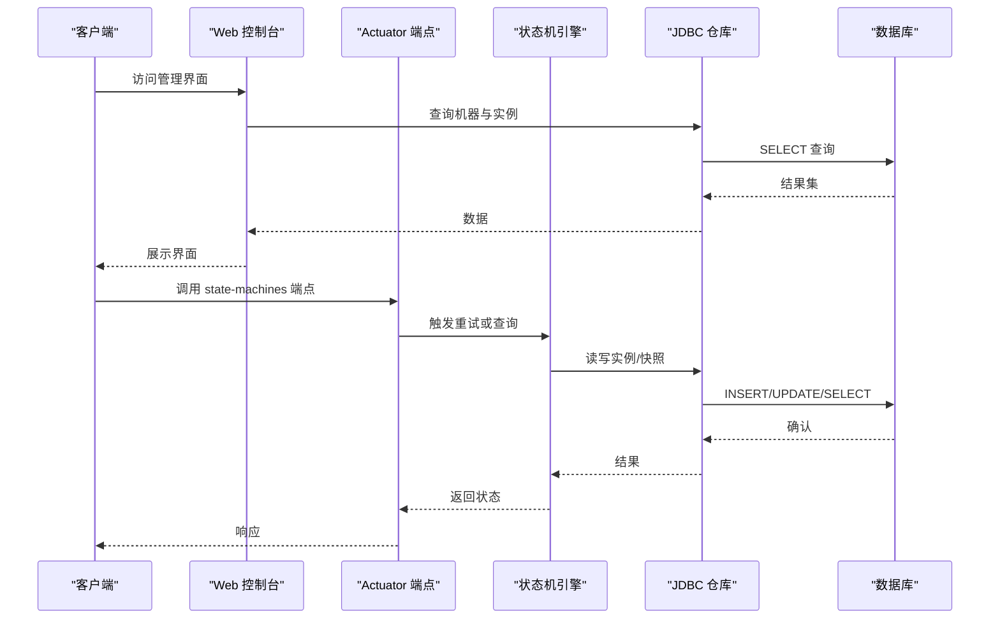
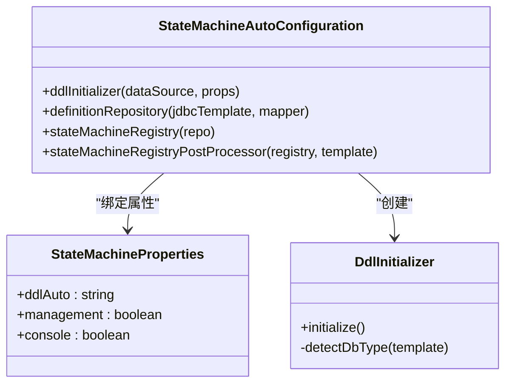
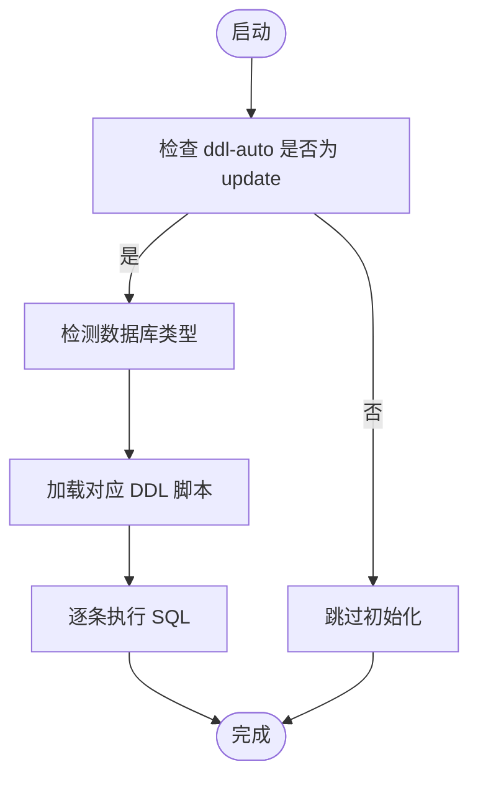
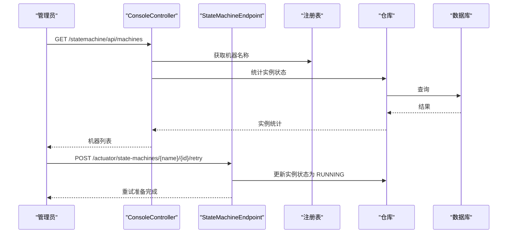
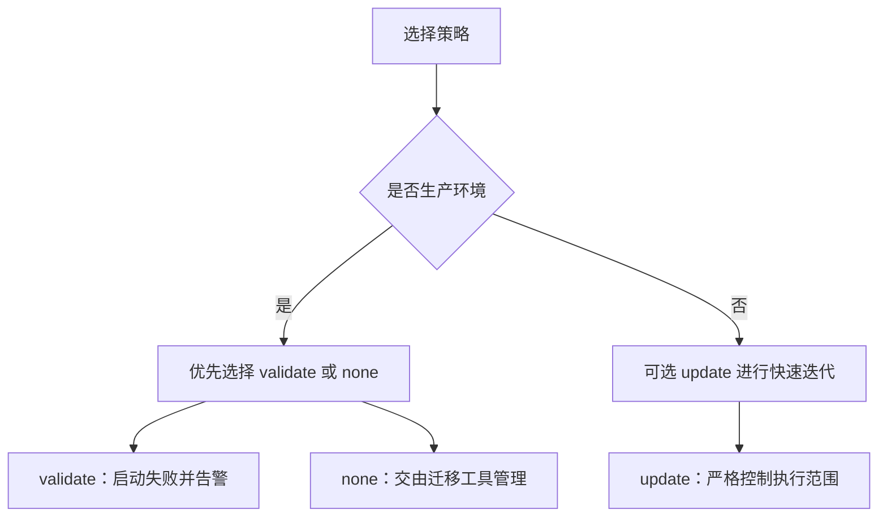

# 生产环境部署

<cite>
**本文档引用的文件**
- [README.md](file://README.md)
- [pom.xml](file://pom.xml)
- [StateMachineAutoConfiguration.java](file://src/main/java/cn/chedejun/statemachine/autoconfigure/StateMachineAutoConfiguration.java)
- [StateMachineProperties.java](file://src/main/java/cn/chedejun/statemachine/autoconfigure/StateMachineProperties.java)
- [DdlInitializer.java](file://src/main/java/cn/chedejun/statemachine/persistence/DdlInitializer.java)
- [postgresql.sql](file://src/main/resources/ddl/postgresql.sql)
- [mysql.sql](file://src/main/resources/ddl/mysql.sql)
- [h2.sql](file://src/main/resources/ddl/h2.sql)
- [application.yml](file://demo/src/main/resources/application.yml)
- [application.yml](file://src/test/resources/application.yml)
- [ConsoleController.java](file://src/main/java/cn/chedejun/statemachine/management/ConsoleController.java)
- [StateMachineEndpoint.java](file://src/main/java/cn/chedejun/statemachine/management/StateMachineEndpoint.java)
- [StateMachine.java](file://src/main/java/cn/chedejun/statemachine/core/StateMachine.java)
</cite>

## 目录
1. [简介](#简介)
2. [项目结构](#项目结构)
3. [核心组件](#核心组件)
4. [架构总览](#架构总览)
5. [详细组件分析](#详细组件分析)
6. [数据库配置最佳实践](#数据库配置最佳实践)
7. [DDL自动初始化策略](#ddl自动初始化策略)
8. [JVM参数调优](#jvm参数调优)
9. [容器化部署方案](#容器化部署方案)
10. [负载均衡与高可用架构](#负载均衡与高可用架构)
11. [安全配置指南](#安全配置指南)
12. [性能考虑](#性能考虑)
13. [故障排除指南](#故障排除指南)
14. [结论](#结论)

## 简介
本指南面向生产环境部署状态机服务，涵盖数据库配置（PostgreSQL、MySQL、H2）、DDL自动初始化策略选择原则、JVM参数调优、容器化与Kubernetes部署、负载均衡与高可用架构以及安全配置。文档基于仓库中的自动配置、属性定义、DDL脚本和管理端点等实现进行系统化整理，确保在不同数据库与运行环境中稳定可靠地部署。

## 项目结构
该项目采用Spring Boot Starter结构，核心模块包含自动配置、核心状态机引擎、持久化层、管理控制台与Actuator端点。关键特性：
- 自动配置：根据数据源自动注册DDL初始化器、仓库与状态机注册表
- 持久化：基于JDBC的定义、实例与快照存储，支持多数据库DDL脚本
- 管理：Web控制台与Actuator端点，提供机器与实例状态查询、重试操作

**图表来源**
- [StateMachineAutoConfiguration.java:28-56](file://src/main/java/cn/chedejun/statemachine/autoconfigure/StateMachineAutoConfiguration.java#L28-L56)
- [DdlInitializer.java:9-43](file://src/main/java/cn/chedejun/statemachine/persistence/DdlInitializer.java#L9-L43)
- [ConsoleController.java:15-32](file://src/main/java/cn/chedejun/statemachine/management/ConsoleController.java#L15-L32)
- [StateMachineEndpoint.java:16-30](file://src/main/java/cn/chedejun/statemachine/management/StateMachineEndpoint.java#L16-L30)

**章节来源**
- [pom.xml:33-67](file://pom.xml#L33-L67)
- [StateMachineAutoConfiguration.java:22-79](file://src/main/java/cn/chedejun/statemachine/autoconfigure/StateMachineAutoConfiguration.java#L22-L79)

## 核心组件
- 自动配置与属性绑定：通过@EnableConfigurationProperties绑定state-machine前缀属性，按需启用管理控制台与Actuator端点
- DDL初始化器：根据数据源URL自动识别数据库类型，加载对应DDL脚本并初始化表结构
- 管理端点：提供REST API与Web控制台，用于查看机器定义、实例状态与执行快照，并支持重试操作
- 状态机引擎：负责执行、重试、状态推进与快照记录，依赖JDBC仓库进行持久化

**章节来源**
- [StateMachineAutoConfiguration.java:22-79](file://src/main/java/cn/chedejun/statemachine/autoconfigure/StateMachineAutoConfiguration.java#L22-L79)
- [StateMachineProperties.java:5-34](file://src/main/java/cn/chedejun/statemachine/autoconfigure/StateMachineProperties.java#L5-L34)
- [DdlInitializer.java:9-53](file://src/main/java/cn/chedejun/statemachine/persistence/DdlInitializer.java#L9-L53)
- [ConsoleController.java:15-105](file://src/main/java/cn/chedejun/statemachine/management/ConsoleController.java#L15-L105)
- [StateMachineEndpoint.java:16-72](file://src/main/java/cn/chedejun/statemachine/management/StateMachineEndpoint.java#L16-L72)

## 架构总览
下图展示生产环境部署的关键交互：客户端通过Web控制台或Actuator端点与状态机服务通信；服务内部通过JDBC访问数据库，使用DDL初始化器确保表结构存在；状态机引擎执行业务逻辑并记录实例与快照。

**图表来源**
- [ConsoleController.java:34-104](file://src/main/java/cn/chedejun/statemachine/management/ConsoleController.java#L34-L104)
- [StateMachineEndpoint.java:32-71](file://src/main/java/cn/chedejun/statemachine/management/StateMachineEndpoint.java#L32-L71)
- [StateMachine.java:40-136](file://src/main/java/cn/chedejun/statemachine/core/StateMachine.java#L40-L136)

## 详细组件分析

### 自动配置与属性绑定
- 条件装配：当存在DataSource时自动注册DDL初始化器、仓库与注册表
- 管理端点：当启用Actuator且state-machine.management.enabled=true时暴露/state-machines端点
- 控制台：当存在Web Servlet且state-machine.console.enabled=true时注册控制台控制器

**图表来源**
- [StateMachineAutoConfiguration.java:22-79](file://src/main/java/cn/chedejun/statemachine/autoconfigure/StateMachineAutoConfiguration.java#L22-L79)
- [StateMachineProperties.java:5-34](file://src/main/java/cn/chedejun/statemachine/autoconfigure/StateMachineProperties.java#L5-L34)
- [DdlInitializer.java:9-53](file://src/main/java/cn/chedejun/statemachine/persistence/DdlInitializer.java#L9-L53)

**章节来源**
- [StateMachineAutoConfiguration.java:22-79](file://src/main/java/cn/chedejun/statemachine/autoconfigure/StateMachineAutoConfiguration.java#L22-L79)
- [StateMachineProperties.java:5-34](file://src/main/java/cn/chedejun/statemachine/autoconfigure/StateMachineProperties.java#L5-L34)

### DDL初始化器与多数据库支持
- 自动识别：通过JDBC URL判断数据库类型（mysql/postgresql），默认回退到H2
- 脚本加载：按数据库类型加载对应DDL脚本并逐条执行
- 初始化策略：仅在ddl-auto=update时执行，其他值跳过初始化

**图表来源**
- [DdlInitializer.java:20-43](file://src/main/java/cn/chedejun/statemachine/persistence/DdlInitializer.java#L20-L43)

**章节来源**
- [DdlInitializer.java:9-53](file://src/main/java/cn/chedejun/statemachine/persistence/DdlInitializer.java#L9-L53)
- [postgresql.sql:1-18](file://src/main/resources/ddl/postgresql.sql#L1-L18)
- [mysql.sql:1-18](file://src/main/resources/ddl/mysql.sql#L1-L18)
- [h2.sql:1-18](file://src/main/resources/ddl/h2.sql#L1-L18)

### 管理控制台与Actuator端点
- Web控制台：提供机器列表、版本详情、实例分页查询、实例详情与重试触发
- Actuator端点：/state-machines提供机器统计、版本查询与实例重置能力

**图表来源**
- [ConsoleController.java:34-104](file://src/main/java/cn/chedejun/statemachine/management/ConsoleController.java#L34-L104)
- [StateMachineEndpoint.java:32-71](file://src/main/java/cn/chedejun/statemachine/management/StateMachineEndpoint.java#L32-L71)

**章节来源**
- [ConsoleController.java:15-105](file://src/main/java/cn/chedejun/statemachine/management/ConsoleController.java#L15-L105)
- [StateMachineEndpoint.java:16-72](file://src/main/java/cn/chedejun/statemachine/management/StateMachineEndpoint.java#L16-L72)

## 数据库配置最佳实践

### PostgreSQL配置要点
- 连接参数：使用标准JDBC URL，确保网络连通与认证正确
- 字段类型：DDL脚本使用JSONB字段存储状态与转换定义，适合复杂结构
- 性能：合理设置连接池大小、超时时间与只读副本，满足高并发场景

**章节来源**
- [application.yml:4-9](file://demo/src/main/resources/application.yml#L4-L9)
- [postgresql.sql:1-18](file://src/main/resources/ddl/postgresql.sql#L1-L18)

### MySQL配置要点
- 连接参数：JDBC URL包含驱动类名，注意时区与字符集设置
- 字段类型：DDL脚本使用JSON字段，注意版本兼容性（8.0+对JSON支持更好）
- 性能：启用二进制日志、主从复制与连接池优化，避免长事务阻塞

**章节来源**
- [application.yml:4-9](file://demo/src/main/resources/application.yml#L4-L9)
- [mysql.sql:1-18](file://src/main/resources/ddl/mysql.sql#L1-L18)

### H2配置要点（开发/测试）
- 内嵌模式：适合本地开发与集成测试，无需独立数据库实例
- 文件模式：可持久化到磁盘，便于测试数据保留
- 注意：不建议用于生产环境

**章节来源**
- [h2.sql:1-18](file://src/main/resources/ddl/h2.sql#L1-L18)

## DDL自动初始化策略

### 策略选择原则
- update：生产环境谨慎使用，仅在受控环境下执行，确保DDL脚本与现有表结构兼容
- validate：生产环境推荐，启动时校验表结构一致性，发现不匹配立即失败
- none：生产环境首选，由DBA或迁移工具统一管理表结构，应用不自动变更

**图表来源**
- [StateMachineProperties.java](file://src/main/java/cn/chedejun/statemachine/autoconfigure/StateMachineProperties.java#L7)
- [DdlInitializer.java:20-24](file://src/main/java/cn/chedejun/statemachine/persistence/DdlInitializer.java#L20-L24)

**章节来源**
- [StateMachineProperties.java](file://src/main/java/cn/chedejun/statemachine/autoconfigure/StateMachineProperties.java#L7)
- [DdlInitializer.java:20-24](file://src/main/java/cn/chedejun/statemachine/persistence/DdlInitializer.java#L20-L24)

## JVM参数调优

### 堆大小与内存
- 初始堆与最大堆：根据实例数量与快照规模设定，避免频繁Full GC
- 新生代比例：增大Eden区以降低Minor GC频率
- 对象晋升：调整老年代阈值，平衡晋升与回收成本

### 垃圾收集器
- G1GC：适用于大堆场景，降低停顿时间，适合高并发状态机服务
- ZGC/Shenandoah：追求极低停顿的应用可考虑，但需验证与Spring Boot版本兼容性

### 线程池设置
- Web线程池：根据CPU核数与请求特征设置队列长度与拒绝策略
- 应用线程池：状态机执行涉及IO与计算，建议分离业务线程与IO线程
- 连接池：数据库连接池大小与应用线程池协调，避免饥饿与资源争用

[本节为通用调优建议，不直接分析具体文件]

## 容器化部署方案

### Docker镜像构建
- 基础镜像：使用官方OpenJDK 17或兼容版本的基础镜像
- 应用打包：使用Maven插件生成可执行JAR，避免重复打包
- 启动命令：设置JAVA_OPTS与spring.profiles.active，暴露管理端口
- 健康检查：利用Actuator健康端点进行容器健康探测

### Kubernetes部署配置
- Deployment：设置副本数、滚动更新策略与资源限制
- Service：ClusterIP或LoadBalancer暴露Web控制台与Actuator端点
- ConfigMap：存放数据库连接与state-machine属性
- Secret：存放数据库凭据与敏感配置
- HPA：根据CPU/自定义指标自动扩缩容

[本节为通用容器化实践，不直接分析具体文件]

## 负载均衡与高可用架构

### 部署拓扑
- 多副本：每个Pod运行单实例状态机服务，避免共享内存状态
- 数据库高可用：PostgreSQL/MySQL主从或集群，配合只读副本分流查询
- 缓存层：Redis作为会话或临时状态缓存（可选）

### 负载均衡策略
- 内部流量：Kubernetes Service使用轮询或会话亲和
- 外部流量：Ingress/NLB分发至多个Deployment副本
- 熔断与降级：结合限流与熔断策略，保障核心功能可用

[本节为架构设计建议，不直接分析具体文件]

## 安全配置指南

### 数据库连接加密
- SSL/TLS：PostgreSQL使用sslmode=require，MySQL启用SSL连接
- 密钥管理：使用Kubernetes Secret或密钥管理服务存储连接凭据
- 网络隔离：数据库置于私有VPC，仅允许应用网关访问

### 访问控制
- 最小权限：数据库用户仅授予必要权限，避免DROP/ALTER
- 端点保护：Actuator端点启用鉴权与白名单访问
- Web控制台：生产环境建议关闭或限制访问范围

**章节来源**
- [application.yml:4-9](file://demo/src/main/resources/application.yml#L4-L9)

## 性能考虑
- 数据库性能：为实例与快照表建立合适索引，定期统计信息更新
- 状态机执行：合理设置重试策略与最大尝试次数，避免无限循环
- 监控与告警：结合Actuator指标与APM工具监控延迟与错误率

[本节提供一般性指导，不直接分析具体文件]

## 故障排除指南
- DDL初始化失败：检查数据库类型识别与SQL语法，确认脚本路径与权限
- 管理端点不可用：确认Actuator启用与端点暴露配置
- 实例重试异常：检查实例状态必须为FAILED，确认上下文序列化/反序列化正确

**章节来源**
- [DdlInitializer.java:39-42](file://src/main/java/cn/chedejun/statemachine/persistence/DdlInitializer.java#L39-L42)
- [StateMachineEndpoint.java:62-71](file://src/main/java/cn/chedejun/statemachine/management/StateMachineEndpoint.java#L62-L71)
- [StateMachine.java:50-79](file://src/main/java/cn/chedejun/statemachine/core/StateMachine.java#L50-L79)

## 结论
生产环境部署应以稳定性与可运维性为核心，优先采用validate或none策略管理DDL，结合合适的JVM参数与容器编排实现高可用与弹性伸缩。通过严格的数据库加密与访问控制，配合完善的监控与告警体系，确保状态机服务在复杂业务场景中可靠运行。