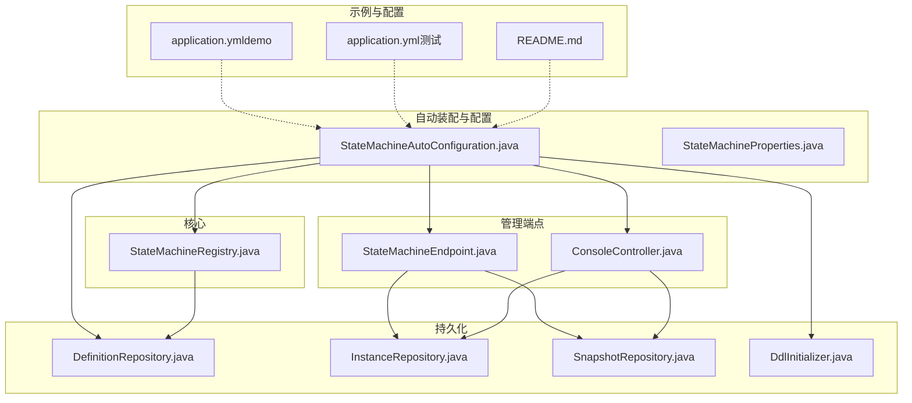
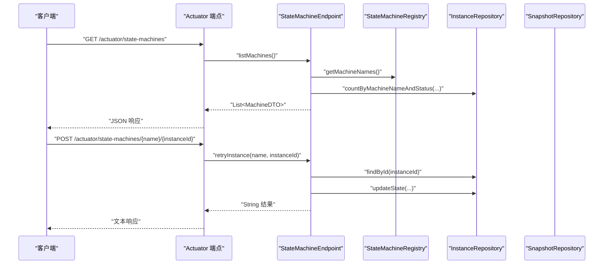
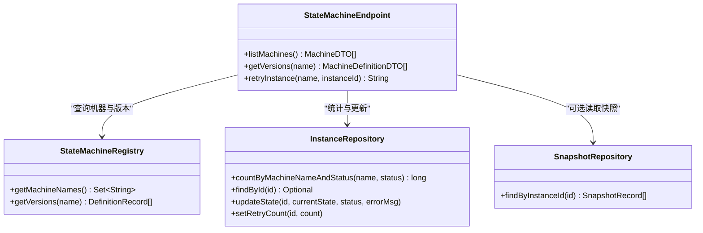
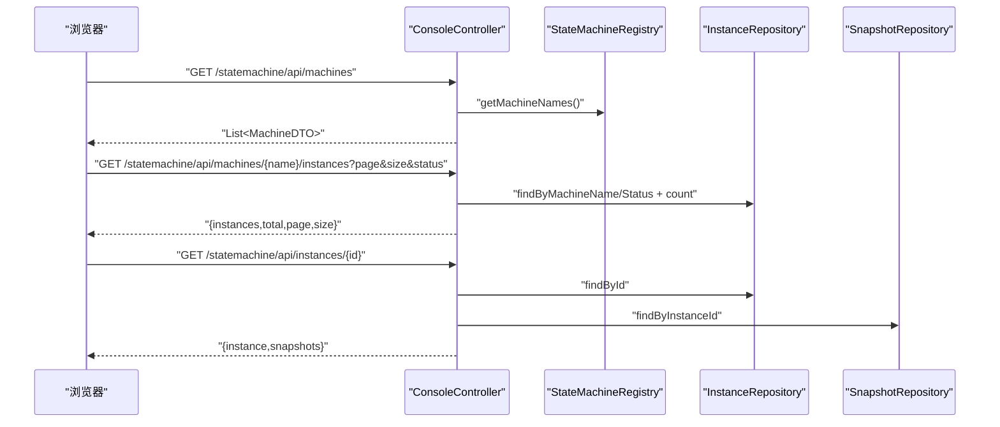
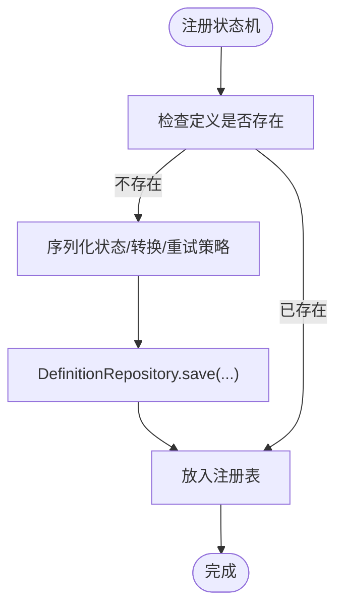
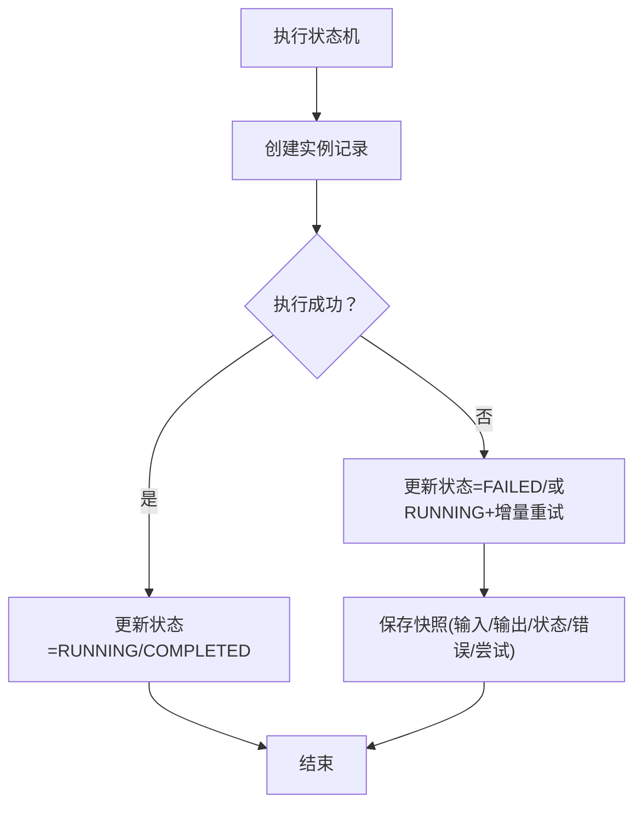
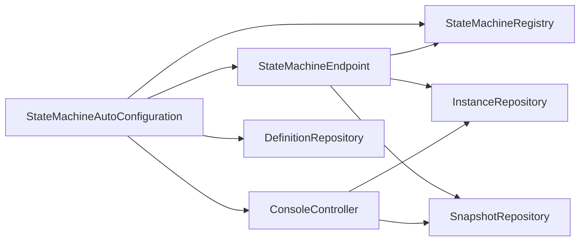

# 监控与告警

<cite>
**本文引用的文件**
- [StateMachineEndpoint.java](file://src/main/java/cn/chedejun/statemachine/management/StateMachineEndpoint.java)
- [ConsoleController.java](file://src/main/java/cn/chedejun/statemachine/management/ConsoleController.java)
- [StateMachineAutoConfiguration.java](file://src/main/java/cn/chedejun/statemachine/autoconfigure/StateMachineAutoConfiguration.java)
- [StateMachineProperties.java](file://src/main/java/cn/chedejun/statemachine/autoconfigure/StateMachineProperties.java)
- [StateMachineRegistry.java](file://src/main/java/cn/chedejun/statemachine/core/StateMachineRegistry.java)
- [DefinitionRepository.java](file://src/main/java/cn/chedejun/statemachine/persistence/DefinitionRepository.java)
- [InstanceRepository.java](file://src/main/java/cn/chedejun/statemachine/persistence/InstanceRepository.java)
- [SnapshotRepository.java](file://src/main/java/cn/chedejun/statemachine/persistence/SnapshotRepository.java)
- [DdlInitializer.java](file://src/main/java/cn/chedejun/statemachine/persistence/DdlInitializer.java)
- [application.yml（demo）](file://demo/src/main/resources/application.yml)
- [application.yml（测试）](file://src/test/resources/application.yml)
- [README.md](file://README.md)
</cite>

## 目录
1. [简介](#简介)
2. [项目结构](#项目结构)
3. [核心组件](#核心组件)
4. [架构总览](#架构总览)
5. [详细组件分析](#详细组件分析)
6. [依赖分析](#依赖分析)
7. [性能考虑](#性能考虑)
8. [故障排查指南](#故障排查指南)
9. [结论](#结论)
10. [附录](#附录)

## 简介
本指南面向状态机监控与告警场景，聚焦于 Spring Boot Actuator 的自定义端点 /actuator/state-machines 的配置与使用，解释状态机实例的实时监控指标（运行中/失败实例数、错误信息、重试次数等），并提供 Prometheus 集成思路、Grafana 仪表板建议、告警规则设计（失败阈值、延迟与资源使用）、日志与 ELK 集成方案，以及监控脚本与自动化工具的使用方法。本文所有技术细节均基于仓库中的实际实现进行阐述。

## 项目结构
该工程采用模块化组织：核心状态机逻辑位于 core 包；管理端点与控制台位于 management 包；持久化层位于 persistence 包；自动装配与属性配置位于 autoconfigure 包；示例应用在 demo 模块。

图表来源
- [StateMachineAutoConfiguration.java:1-80](file://src/main/java/cn/chedejun/statemachine/autoconfigure/StateMachineAutoConfiguration.java#L1-L80)
- [StateMachineEndpoint.java:1-73](file://src/main/java/cn/chedejun/statemachine/management/StateMachineEndpoint.java#L1-L73)
- [ConsoleController.java:1-106](file://src/main/java/cn/chedejun/statemachine/management/ConsoleController.java#L1-L106)
- [StateMachineRegistry.java:1-73](file://src/main/java/cn/chedejun/statemachine/core/StateMachineRegistry.java#L1-L73)
- [DefinitionRepository.java:1-78](file://src/main/java/cn/chedejun/statemachine/persistence/DefinitionRepository.java#L1-L78)
- [InstanceRepository.java:1-66](file://src/main/java/cn/chedejun/statemachine/persistence/InstanceRepository.java#L1-L66)
- [SnapshotRepository.java:1-55](file://src/main/java/cn/chedejun/statemachine/persistence/SnapshotRepository.java#L1-L55)
- [DdlInitializer.java:1-54](file://src/main/java/cn/chedejun/statemachine/persistence/DdlInitializer.java#L1-L54)
- [application.yml（demo）:1-23](file://demo/src/main/resources/application.yml#L1-L23)
- [application.yml（测试）:1-14](file://src/test/resources/application.yml#L1-L14)
- [README.md:1-65](file://README.md#L1-L65)

章节来源
- [StateMachineAutoConfiguration.java:1-80](file://src/main/java/cn/chedejun/statemachine/autoconfigure/StateMachineAutoConfiguration.java#L1-L80)
- [application.yml（demo）:1-23](file://demo/src/main/resources/application.yml#L1-L23)
- [application.yml（测试）:1-14](file://src/test/resources/application.yml#L1-L14)
- [README.md:1-65](file://README.md#L1-L65)

## 核心组件
- 自动装配与配置
  - StateMachineAutoConfiguration：负责在存在数据源时创建 DdlInitializer、DefinitionRepository、StateMachineRegistry，并按需启用管理端点与控制台。
  - StateMachineProperties：提供 state-machine.* 前缀的配置项，包括 ddl-auto、management.enabled、console.enabled 及默认重试策略参数。
- 管理端点
  - StateMachineEndpoint：暴露 /actuator/state-machines 端点，支持列出机器、查询版本定义、重试失败实例。
  - ConsoleController：提供 /statemachine/* 控制台接口，用于前端页面展示与交互。
- 注册表与持久化
  - StateMachineRegistry：注册状态机、保存定义、查询版本。
  - DefinitionRepository：定义记录的持久化与查询。
  - InstanceRepository：实例记录的创建、更新、统计与分页查询。
  - SnapshotRepository：步骤快照的持久化与查询。
- DDL 初始化
  - DdlInitializer：根据数据源类型选择对应 SQL 脚本并初始化表结构。

章节来源
- [StateMachineAutoConfiguration.java:1-80](file://src/main/java/cn/chedejun/statemachine/autoconfigure/StateMachineAutoConfiguration.java#L1-L80)
- [StateMachineProperties.java:1-35](file://src/main/java/cn/chedejun/statemachine/autoconfigure/StateMachineProperties.java#L1-L35)
- [StateMachineEndpoint.java:1-73](file://src/main/java/cn/chedejun/statemachine/management/StateMachineEndpoint.java#L1-L73)
- [ConsoleController.java:1-106](file://src/main/java/cn/chedejun/statemachine/management/ConsoleController.java#L1-L106)
- [StateMachineRegistry.java:1-73](file://src/main/java/cn/chedejun/statemachine/core/StateMachineRegistry.java#L1-L73)
- [DefinitionRepository.java:1-78](file://src/main/java/cn/chedejun/statemachine/persistence/DefinitionRepository.java#L1-L78)
- [InstanceRepository.java:1-66](file://src/main/java/cn/chedejun/statemachine/persistence/InstanceRepository.java#L1-L66)
- [SnapshotRepository.java:1-55](file://src/main/java/cn/chedejun/statemachine/persistence/SnapshotRepository.java#L1-L55)
- [DdlInitializer.java:1-54](file://src/main/java/cn/chedejun/statemachine/persistence/DdlInitializer.java#L1-L54)

## 架构总览
下图展示了从 Actuator 端点到持久化层的数据流与职责分工。

图表来源
- [StateMachineEndpoint.java:32-71](file://src/main/java/cn/chedejun/statemachine/management/StateMachineEndpoint.java#L32-L71)
- [StateMachineRegistry.java:57-65](file://src/main/java/cn/chedejun/statemachine/core/StateMachineRegistry.java#L57-L65)
- [InstanceRepository.java:23-47](file://src/main/java/cn/chedejun/statemachine/persistence/InstanceRepository.java#L23-L47)

## 详细组件分析

### Actuator 端点：/actuator/state-machines
- 功能概述
  - 列出所有已注册的状态机名称、版本数量，以及当前运行中与失败的实例计数。
  - 查询指定状态机的所有版本定义（包含状态、转换、重试策略等元信息）。
  - 对失败实例发起“重试”操作：将状态重置为 RUNNING 并清零重试计数，随后由业务调用状态机的 retry 方法重新执行。
- 响应格式
  - 列表机器：返回 MachineDTO，包含名称、版本数、运行中实例数、失败实例数。
  - 版本定义：返回 MachineDefinitionDTO，包含定义 ID、名称、版本、状态列表、转换列表、重试策略映射、注册时间。
  - 重试结果：返回字符串描述，指示是否成功或失败原因。
- 关键实现路径
  - 端点类与读写操作：[StateMachineEndpoint.java:16-71](file://src/main/java/cn/chedejun/statemachine/management/StateMachineEndpoint.java#L16-L71)
  - 实例统计与查询：[InstanceRepository.java:44-47](file://src/main/java/cn/chedejun/statemachine/persistence/InstanceRepository.java#L44-L47)
  - 版本定义解析与序列化：[DefinitionRepository.java:24-46](file://src/main/java/cn/chedejun/statemachine/persistence/DefinitionRepository.java#L24-L46)

图表来源
- [StateMachineEndpoint.java:18-30](file://src/main/java/cn/chedejun/statemachine/management/StateMachineEndpoint.java#L18-L30)
- [StateMachineRegistry.java:57-65](file://src/main/java/cn/chedejun/statemachine/core/StateMachineRegistry.java#L57-L65)
- [InstanceRepository.java:23-38](file://src/main/java/cn/chedejun/statemachine/persistence/InstanceRepository.java#L23-L38)
- [SnapshotRepository.java:37-39](file://src/main/java/cn/chedejun/statemachine/persistence/SnapshotRepository.java#L37-L39)

章节来源
- [StateMachineEndpoint.java:32-71](file://src/main/java/cn/chedejun/statemachine/management/StateMachineEndpoint.java#L32-L71)
- [InstanceRepository.java:44-47](file://src/main/java/cn/chedejun/statemachine/persistence/InstanceRepository.java#L44-L47)
- [DefinitionRepository.java:24-46](file://src/main/java/cn/chedejun/statemachine/persistence/DefinitionRepository.java#L24-L46)

### 控制台接口：/statemachine/*
- 功能概述
  - 列出机器、版本、实例列表与详情。
  - 支持按状态筛选实例、分页查询。
  - 提供实例重试入口，触发状态机的 retry 流程。
- 数据模型
  - MachineDTO：机器概览。
  - MachineDefinitionDTO：版本定义。
  - InstanceDTO：实例详情（含重试次数、错误信息、创建/更新时间）。
  - SnapshotDTO：步骤快照（输入/输出 JSON、状态、错误、尝试次数、执行时间）。
- 关键实现路径
  - 控制台控制器与接口：[ConsoleController.java:34-104](file://src/main/java/cn/chedejun/statemachine/management/ConsoleController.java#L34-L104)
  - 实例与快照查询：[InstanceRepository.java:40-51](file://src/main/java/cn/chedejun/statemachine/persistence/InstanceRepository.java#L40-L51)，[SnapshotRepository.java:37-43](file://src/main/java/cn/chedejun/statemachine/persistence/SnapshotRepository.java#L37-L43)

图表来源
- [ConsoleController.java:34-89](file://src/main/java/cn/chedejun/statemachine/management/ConsoleController.java#L34-L89)
- [InstanceRepository.java:40-51](file://src/main/java/cn/chedejun/statemachine/persistence/InstanceRepository.java#L40-L51)
- [SnapshotRepository.java:37-43](file://src/main/java/cn/chedejun/statemachine/persistence/SnapshotRepository.java#L37-L43)

章节来源
- [ConsoleController.java:34-104](file://src/main/java/cn/chedejun/statemachine/management/ConsoleController.java#L34-L104)
- [InstanceRepository.java:40-51](file://src/main/java/cn/chedejun/statemachine/persistence/InstanceRepository.java#L40-L51)
- [SnapshotRepository.java:37-43](file://src/main/java/cn/chedejun/statemachine/persistence/SnapshotRepository.java#L37-L43)

### 状态机注册与定义持久化
- 注册与保存
  - 注册表在首次发现状态机时，会序列化状态、转换与重试策略，并通过 DefinitionRepository 保存至数据库。
- 关键实现路径
  - 注册与保存逻辑：[StateMachineRegistry.java:21-49](file://src/main/java/cn/chedejun/statemachine/core/StateMachineRegistry.java#L21-L49)
  - 定义持久化与查询：[DefinitionRepository.java:24-66](file://src/main/java/cn/chedejun/statemachine/persistence/DefinitionRepository.java#L24-L66)

图表来源
- [StateMachineRegistry.java:21-49](file://src/main/java/cn/chedejun/statemachine/core/StateMachineRegistry.java#L21-L49)
- [DefinitionRepository.java:24-46](file://src/main/java/cn/chedejun/statemachine/persistence/DefinitionRepository.java#L24-L46)

章节来源
- [StateMachineRegistry.java:21-49](file://src/main/java/cn/chedejun/statemachine/core/StateMachineRegistry.java#L21-L49)
- [DefinitionRepository.java:24-66](file://src/main/java/cn/chedejun/statemachine/persistence/DefinitionRepository.java#L24-L66)

### 实例与快照持久化
- 实例生命周期
  - 创建：插入初始状态为 RUNNING。
  - 更新：根据执行结果更新当前状态、错误信息、重试次数与下次重试时间。
  - 统计：按机器名与状态统计总数，支持分页查询。
- 快照
  - 每个步骤执行后保存快照，包含输入/输出 JSON、状态、错误、尝试次数与执行时间。
- 关键实现路径
  - 实例 CRUD 与统计：[InstanceRepository.java:15-51](file://src/main/java/cn/chedejun/statemachine/persistence/InstanceRepository.java#L15-L51)
  - 快照 CRUD：[SnapshotRepository.java:15-43](file://src/main/java/cn/chedejun/statemachine/persistence/SnapshotRepository.java#L15-L43)

图表来源
- [InstanceRepository.java:15-38](file://src/main/java/cn/chedejun/statemachine/persistence/InstanceRepository.java#L15-L38)
- [SnapshotRepository.java:15-31](file://src/main/java/cn/chedejun/statemachine/persistence/SnapshotRepository.java#L15-L31)

章节来源
- [InstanceRepository.java:15-51](file://src/main/java/cn/chedejun/statemachine/persistence/InstanceRepository.java#L15-L51)
- [SnapshotRepository.java:15-43](file://src/main/java/cn/chedejun/statemachine/persistence/SnapshotRepository.java#L15-L43)

## 依赖分析
- 组件耦合
  - StateMachineEndpoint 依赖 StateMachineRegistry 与 InstanceRepository/SnapshotRepository（通过 JdbcTemplate 注入）。
  - ConsoleController 同样依赖上述仓库以提供 Web 接口。
  - StateMachineAutoConfiguration 将各组件装配在一起，并根据配置开关启用端点与控制台。
- 外部依赖
  - Spring Boot Actuator：提供 /actuator/* 端点能力。
  - Spring JDBC：JdbcTemplate 与 RowMapper 用于数据库访问。
  - Jackson：用于定义与重试策略的 JSON 序列化/反序列化。
- 条件装配
  - 当存在 DataSource 且 state-machine.management.enabled=true 时，才注册 StateMachineEndpoint。
  - 当存在 Servlet 容器且 state-machine.console.enabled=true 时，才注册 ConsoleController。

图表来源
- [StateMachineAutoConfiguration.java:58-78](file://src/main/java/cn/chedejun/statemachine/autoconfigure/StateMachineAutoConfiguration.java#L58-L78)
- [StateMachineEndpoint.java:18-30](file://src/main/java/cn/chedejun/statemachine/management/StateMachineEndpoint.java#L18-L30)
- [ConsoleController.java:28-32](file://src/main/java/cn/chedejun/statemachine/management/ConsoleController.java#L28-L32)

章节来源
- [StateMachineAutoConfiguration.java:58-78](file://src/main/java/cn/chedejun/statemachine/autoconfigure/StateMachineAutoConfiguration.java#L58-L78)
- [StateMachineEndpoint.java:18-30](file://src/main/java/cn/chedejun/statemachine/management/StateMachineEndpoint.java#L18-L30)
- [ConsoleController.java:28-32](file://src/main/java/cn/chedejun/statemachine/management/ConsoleController.java#L28-L32)

## 性能考虑
- 查询优化
  - 实例统计与分页查询依赖数据库索引与 LIMIT/OFFSET，建议在 machine_name、status、created_at 上建立合适索引。
- JSON 字段处理
  - states、transitions、retry_policy 以 JSON 文本存储，避免频繁大对象序列化；仅在版本查询时解析。
- 连接与事务
  - 使用 JdbcTemplate 批量更新与查询，减少 ORM 开销；注意在高并发场景下控制连接池大小与超时。
- 缓存策略
  - 对于不常变更的定义数据，可在注册表层引入轻量缓存以降低数据库压力。

## 故障排查指南
- 端点不可用
  - 确认 management.endpoints.web.exposure.include 是否包含 state-machines。
  - 确认 state-machine.management.enabled=true。
- 数据库未初始化
  - 检查 ddl-auto=update，确认 DdlInitializer 已执行并检测到正确数据库类型。
- 实例重试无效
  - 端点重试仅将状态重置为 RUNNING 并清零重试计数，需由业务调用状态机的 retry 方法继续执行。
- 控制台页面 404
  - 确认静态资源路径与 /statemachine/ 前缀配置一致，且 console.enabled=true。

章节来源
- [application.yml（demo）:18-23](file://demo/src/main/resources/application.yml#L18-L23)
- [application.yml（测试）:8-14](file://src/test/resources/application.yml#L8-L14)
- [DdlInitializer.java:20-43](file://src/main/java/cn/chedejun/statemachine/persistence/DdlInitializer.java#L20-L43)
- [StateMachineEndpoint.java:62-71](file://src/main/java/cn/chedejun/statemachine/management/StateMachineEndpoint.java#L62-L71)
- [README.md:51-54](file://README.md#L51-L54)

## 结论
本项目通过 Actuator 自定义端点与控制台接口，提供了状态机实例的全生命周期监控与运维能力。结合数据库持久化的实例与快照，能够满足运行中/失败实例统计、版本定义查看与失败实例重试等核心需求。后续可在此基础上扩展 Prometheus 指标导出、Grafana 仪表板与告警规则，以及日志与 ELK 集成方案，形成完整的可观测性体系。

## 附录

### Actuator 端点配置与使用
- 启用端点
  - 在配置中暴露 state-machines 端点，并确保 management.enabled=true。
- 访问方式
  - GET /actuator/state-machines：列出机器与实例统计。
  - GET /actuator/state-machines/{name}：列出版本定义。
  - POST /actuator/state-machines/{name}/{instanceId}：重试失败实例。
- 响应字段
  - MachineDTO：name、versionCount、runningInstances、failedInstances。
  - MachineDefinitionDTO：id、name、version、states、transitions、retryPolicy、registeredAt。
  - 重试响应：字符串描述结果。

章节来源
- [application.yml（demo）:18-23](file://demo/src/main/resources/application.yml#L18-L23)
- [StateMachineEndpoint.java:32-60](file://src/main/java/cn/chedejun/statemachine/management/StateMachineEndpoint.java#L32-L60)
- [MachineDTO.java:1-3](file://src/main/java/cn/chedejun/statemachine/management/dto/MachineDTO.java#L1-L3)
- [MachineDefinitionDTO.java:1-8](file://src/main/java/cn/chedejun/statemachine/management/dto/MachineDefinitionDTO.java#L1-L8)

### 实时监控指标
- 运行状态
  - runningInstances：按机器名统计 RUNNING 实例数。
  - failedInstances：按机器名统计 FAILED 实例数。
- 错误与重试
  - 实例记录包含 errorMessage、retryCount、nextRetryAt。
  - 快照记录包含每步执行的输入/输出、状态、错误与尝试次数。
- 性能指标
  - 可基于实例创建/更新时间计算执行耗时；结合快照执行时间评估步骤耗时。

章节来源
- [InstanceRepository.java:44-47](file://src/main/java/cn/chedejun/statemachine/persistence/InstanceRepository.java#L44-L47)
- [InstanceRepository.java:53-60](file://src/main/java/cn/chedejun/statemachine/persistence/InstanceRepository.java#L53-L60)
- [SnapshotRepository.java:45-50](file://src/main/java/cn/chedejun/statemachine/persistence/SnapshotRepository.java#L45-L50)

### Prometheus 集成与 Grafana 仪表板
- 指标导出建议
  - 使用 Spring Boot Actuator 的 micrometer 暴露 JVM、进程与自定义指标。
  - 基于 /actuator/state-machines 的统计数据，编写定时抓取任务生成以下指标：
    - state_machine_running_instances{name="..."}：运行中实例数。
    - state_machine_failed_instances{name="..."}：失败实例数。
    - state_machine_retry_count{id="..."}：实例重试次数。
    - state_machine_error_total{id="..."}：实例错误累计数。
- Grafana 仪表板
  - 图表：按机器维度展示 RUNNING/FAILED 实例趋势。
  - 图表：失败率 = FAILED/(RUNNING+FAILED) 的滚动窗口计算。
  - 图表：平均执行耗时（基于实例创建/更新时间差）。
  - 报警：失败率超过阈值、重试次数异常增长、慢查询占比过高。

### 告警规则配置
- 失败阈值
  - 告警条件：state_machine_failed_instances / (state_machine_running_instances + state_machine_failed_instances) > 阈值。
- 延迟告警
  - 告警条件：state_machine_execution_duration_p95 > 阈值毫秒。
- 资源使用告警
  - 告警条件：JVM Heap/线程/GC 时间等指标超过阈值。

### 日志与 ELK 集成
- 日志配置
  - 输出结构化日志（JSON），包含 traceId、spanId、machineName、instanceId、状态、错误码等。
- ELK 集成
  - 使用 Logstash/Fluentd 收集日志，Elasticsearch 存储，Kibana 可视化。
  - 关键字段：level、logger、message、exception、state_machine.*。

### 监控脚本与自动化工具
- 抓取脚本
  - 使用 curl 或 Python requests 定时调用 /actuator/state-machines，解析并入库。
- 自动化工具
  - Jenkins/Pipeline：定时执行抓取与告警校验。
  - Ansible：部署与配置管理，统一暴露 Actuator 端点。