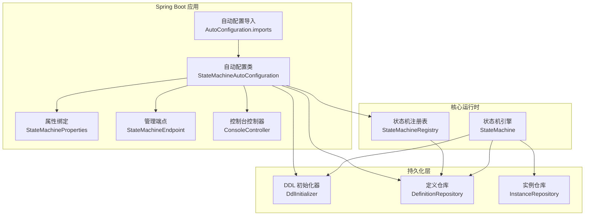
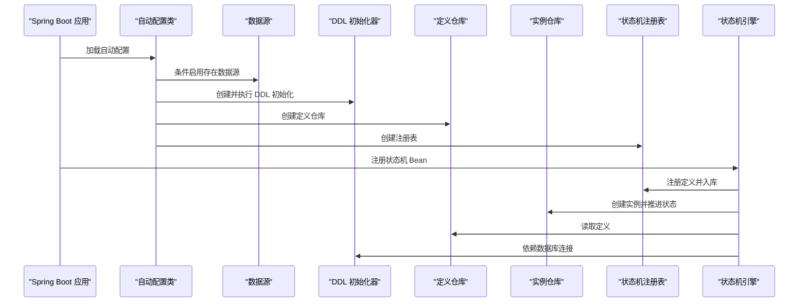
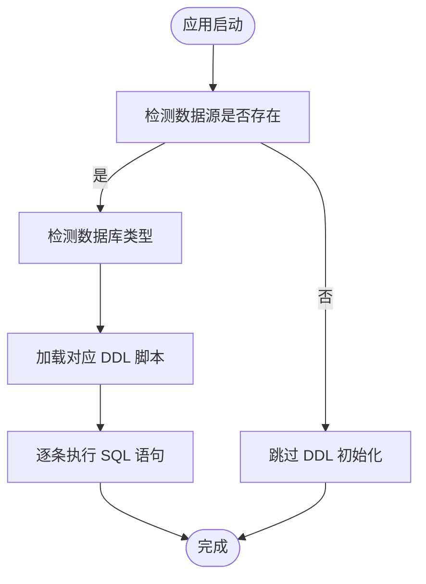
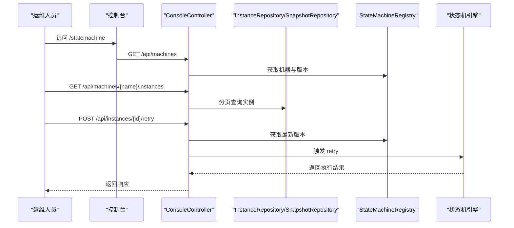
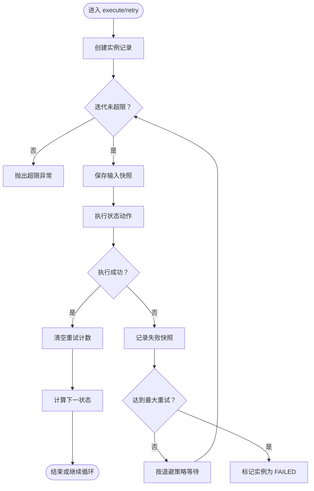
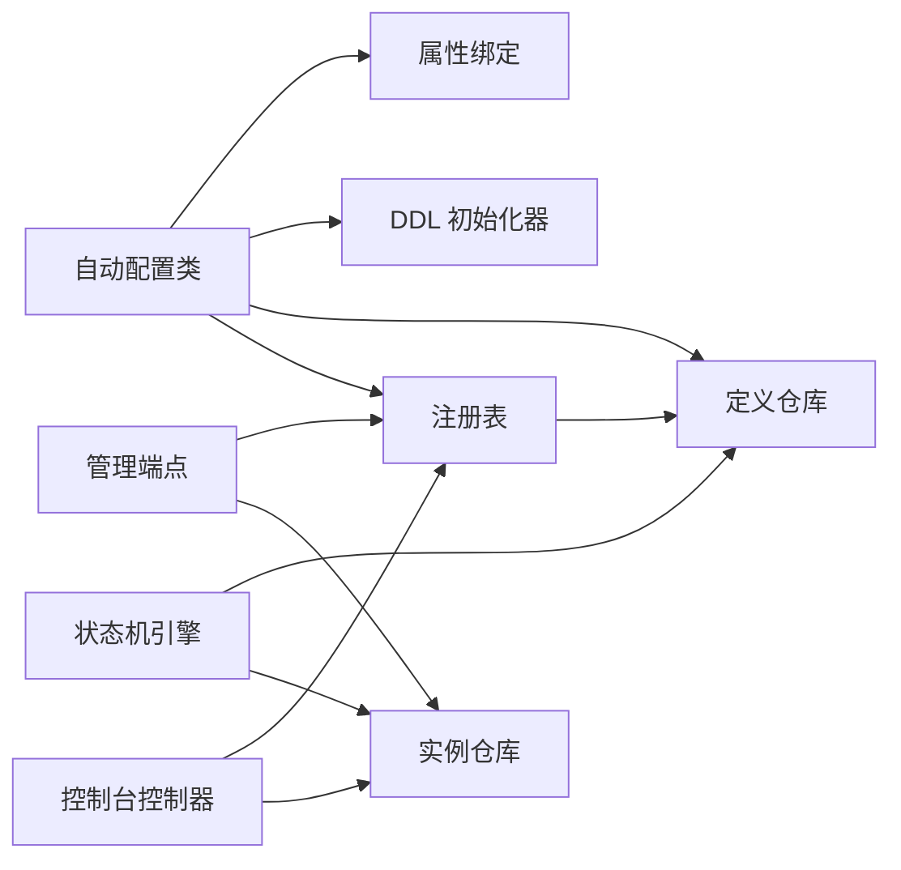

# 部署与运维

<cite>
**本文引用的文件**
- [README.md](file://README.md)
- [pom.xml](file://pom.xml)
- [StateMachineAutoConfiguration.java](file://src/main/java/cn/chedejun/statemachine/autoconfigure/StateMachineAutoConfiguration.java)
- [StateMachineProperties.java](file://src/main/java/cn/chedejun/statemachine/autoconfigure/StateMachineProperties.java)
- [DdlInitializer.java](file://src/main/java/cn/chedejun/statemachine/persistence/DdlInitializer.java)
- [DefinitionRepository.java](file://src/main/java/cn/chedejun/statemachine/persistence/DefinitionRepository.java)
- [InstanceRepository.java](file://src/main/java/cn/chedejun/statemachine/persistence/InstanceRepository.java)
- [StateMachine.java](file://src/main/java/cn/chedejun/statemachine/core/StateMachine.java)
- [StateMachineRegistry.java](file://src/main/java/cn/chedejun/statemachine/core/StateMachineRegistry.java)
- [StateMachineEndpoint.java](file://src/main/java/cn/chedejun/statemachine/management/StateMachineEndpoint.java)
- [ConsoleController.java](file://src/main/java/cn/chedejun/statemachine/management/ConsoleController.java)
- [mysql.sql](file://src/main/resources/ddl/mysql.sql)
- [postgresql.sql](file://src/main/resources/ddl/postgresql.sql)
- [h2.sql](file://src/main/resources/ddl/h2.sql)
- [application.yml（示例）](file://demo/src/main/resources/application.yml)
- [application.yml（测试）](file://src/test/resources/application.yml)
- [org.springframework.boot.autoconfigure.AutoConfiguration.imports](file://src/main/resources/META-INF/spring/org.springframework.boot.autoconfigure.AutoConfiguration.imports)
</cite>

## 目录
1. [简介](#简介)
2. [项目结构](#项目结构)
3. [核心组件](#核心组件)
4. [架构总览](#架构总览)
5. [详细组件分析](#详细组件分析)
6. [依赖关系分析](#依赖关系分析)
7. [性能考量](#性能考量)
8. [故障排查指南](#故障排查指南)
9. [结论](#结论)
10. [附录](#附录)

## 简介
本指南面向生产环境的部署与运维，围绕状态机启动器在 Spring Boot 中的自动装配、数据库初始化、持久化存储、管理控制台与 Actuator 指标暴露、以及运行期的监控与排障进行系统性说明。文档同时给出数据库 DDL 初始化与迁移策略、备份恢复与灾难恢复建议、性能调优与容量规划要点，以及运维脚本与自动化工具的使用方法。

## 项目结构
该项目采用 Spring Boot 自动装配机制，通过 AutoConfiguration 导入并启用状态机相关功能；核心逻辑位于 core、persistence、management 包中；DDL 脚本按数据库类型分发；示例应用与测试配置展示了典型生产配置项。

图表来源
- [org.springframework.boot.autoconfigure.AutoConfiguration.imports:1-2](file://src/main/resources/META-INF/spring/org.springframework.boot.autoconfigure.AutoConfiguration.imports#L1-L2)
- [StateMachineAutoConfiguration.java:22-78](file://src/main/java/cn/chedejun/statemachine/autoconfigure/StateMachineAutoConfiguration.java#L22-L78)
- [StateMachineProperties.java:5-34](file://src/main/java/cn/chedejun/statemachine/autoconfigure/StateMachineProperties.java#L5-L34)
- [DdlInitializer.java:9-53](file://src/main/java/cn/chedejun/statemachine/persistence/DdlInitializer.java#L9-L53)
- [DefinitionRepository.java:15-77](file://src/main/java/cn/chedejun/statemachine/persistence/DefinitionRepository.java#L15-L77)
- [InstanceRepository.java:11-65](file://src/main/java/cn/chedejun/statemachine/persistence/InstanceRepository.java#L11-L65)
- [StateMachineRegistry.java:9-72](file://src/main/java/cn/chedejun/statemachine/core/StateMachineRegistry.java#L9-L72)
- [StateMachine.java:11-195](file://src/main/java/cn/chedejun/statemachine/core/StateMachine.java#L11-L195)
- [StateMachineEndpoint.java:16-72](file://src/main/java/cn/chedejun/statemachine/management/StateMachineEndpoint.java#L16-L72)
- [ConsoleController.java:15-105](file://src/main/java/cn/chedejun/statemachine/management/ConsoleController.java#L15-L105)

章节来源
- [pom.xml:13-19](file://pom.xml#L13-L19)
- [org.springframework.boot.autoconfigure.AutoConfiguration.imports:1-2](file://src/main/resources/META-INF/spring/org.springframework.boot.autoconfigure.AutoConfiguration.imports#L1-L2)

## 核心组件
- 自动配置与属性绑定：通过自动配置类加载状态机能力，基于属性前缀 state-machine 进行配置；当存在数据源时自动初始化 DDL 并创建仓库与注册表。
- DDL 初始化器：根据数据源 URL 自动识别数据库类型，加载对应 DDL 脚本并执行；默认开启“update”模式。
- 持久化仓库：定义、实例、快照三类表的读写封装，负责状态机定义的序列化存储与实例状态的变更记录。
- 管理端点与控制台：提供 Actuator 端点与 Web 控制台，用于列出机器、版本、实例与快照，支持重试实例等运维操作。
- 运行时引擎：状态机执行循环、重试策略、状态推进与快照记录，确保失败可恢复与可观测。

章节来源
- [StateMachineAutoConfiguration.java:22-78](file://src/main/java/cn/chedejun/statemachine/autoconfigure/StateMachineAutoConfiguration.java#L22-L78)
- [StateMachineProperties.java:5-34](file://src/main/java/cn/chedejun/statemachine/autoconfigure/StateMachineProperties.java#L5-L34)
- [DdlInitializer.java:20-43](file://src/main/java/cn/chedejun/statemachine/persistence/DdlInitializer.java#L20-L43)
- [DefinitionRepository.java:24-46](file://src/main/java/cn/chedejun/statemachine/persistence/DefinitionRepository.java#L24-L46)
- [InstanceRepository.java:15-47](file://src/main/java/cn/chedejun/statemachine/persistence/InstanceRepository.java#L15-L47)
- [StateMachineEndpoint.java:32-71](file://src/main/java/cn/chedejun/statemachine/management/StateMachineEndpoint.java#L32-L71)
- [ConsoleController.java:34-89](file://src/main/java/cn/chedejun/statemachine/management/ConsoleController.java#L34-L89)
- [StateMachine.java:40-136](file://src/main/java/cn/chedejun/statemachine/core/StateMachine.java#L40-L136)

## 架构总览
下图展示从应用启动到运行期管理的关键交互路径，涵盖自动装配、DDL 初始化、持久化与管理接口。

图表来源
- [StateMachineAutoConfiguration.java:28-56](file://src/main/java/cn/chedejun/statemachine/autoconfigure/StateMachineAutoConfiguration.java#L28-L56)
- [DdlInitializer.java:20-43](file://src/main/java/cn/chedejun/statemachine/persistence/DdlInitializer.java#L20-L43)
- [DefinitionRepository.java:24-46](file://src/main/java/cn/chedejun/statemachine/persistence/DefinitionRepository.java#L24-L46)
- [InstanceRepository.java:15-21](file://src/main/java/cn/chedejun/statemachine/persistence/InstanceRepository.java#L15-L21)
- [StateMachineRegistry.java:21-49](file://src/main/java/cn/chedejun/statemachine/core/StateMachineRegistry.java#L21-L49)
- [StateMachine.java:178-194](file://src/main/java/cn/chedejun/statemachine/core/StateMachine.java#L178-L194)

## 详细组件分析

### 数据库配置与 DDL 初始化
- 数据源与驱动：示例配置展示了 PostgreSQL 的数据源连接信息；实际生产应替换为内网或托管数据库地址与凭据。
- DDL 自动化：当属性 state-machine.ddl-auto 设置为 update 时，启动阶段会根据数据源 URL 自动选择 mysql、postgresql 或回退 h2 对应脚本并执行。
- 表结构：定义表保存状态机定义与重试策略；实例表跟踪运行状态与重试计数；快照表记录每次状态执行的输入输出与结果。

图表来源
- [DdlInitializer.java:20-43](file://src/main/java/cn/chedejun/statemachine/persistence/DdlInitializer.java#L20-L43)
- [mysql.sql:1-18](file://src/main/resources/ddl/mysql.sql#L1-L18)
- [postgresql.sql:1-18](file://src/main/resources/ddl/postgresql.sql#L1-L18)
- [h2.sql:1-18](file://src/main/resources/ddl/h2.sql#L1-L18)

章节来源
- [application.yml（示例）:4-16](file://demo/src/main/resources/application.yml#L4-L16)
- [application.yml（测试）:8-13](file://src/test/resources/application.yml#L8-L13)
- [DdlInitializer.java:20-43](file://src/main/java/cn/chedejun/statemachine/persistence/DdlInitializer.java#L20-L43)
- [mysql.sql:1-18](file://src/main/resources/ddl/mysql.sql#L1-L18)
- [postgresql.sql:1-18](file://src/main/resources/ddl/postgresql.sql#L1-L18)
- [h2.sql:1-18](file://src/main/resources/ddl/h2.sql#L1-L18)

### 持久化与迁移策略
- 定义存储：状态机定义以 JSON/JSONB 形式存储，包含状态、转移与重试策略；版本唯一约束保证幂等注册。
- 实例追踪：实例表记录当前状态、重试次数、下次重试时间与错误信息；支持按名称与状态查询统计。
- 快照审计：快照表记录每次状态执行的输入输出、尝试次数与执行时间，便于回溯与重试。
- 迁移建议：
  - 生产环境建议将 ddl-auto 设为 none 或 validate，由运维在发布窗口统一执行 DDL。
  - 使用数据库迁移工具（如 Flyway/Liquibase）管理 DDL 变更，配合灰度发布与回滚策略。
  - 对 JSON/JSONB 字段建立合适索引（如按 machine_name、status、created_at），提升查询性能。

章节来源
- [DefinitionRepository.java:24-46](file://src/main/java/cn/chedejun/statemachine/persistence/DefinitionRepository.java#L24-L46)
- [InstanceRepository.java:15-47](file://src/main/java/cn/chedejun/statemachine/persistence/InstanceRepository.java#L15-L47)
- [StateMachineRegistry.java:29-47](file://src/main/java/cn/chedejun/statemachine/core/StateMachineRegistry.java#L29-L47)

### 管理控制台与监控告警
- 管理端点：Actuator 端点 state-machines 提供机器清单、版本详情与实例统计；支持将失败实例重置为 RUNNING 并触发业务侧重试。
- Web 控制台：/statemachine/ 提供前端页面与 /api 接口，支持分页查询实例、查看快照、触发重试。
- 监控指标：示例配置已暴露 health 与 state-machines 端点；建议结合 Spring Boot Actuator 默认指标与自定义 Micrometer 指标进行告警。

图表来源
- [ConsoleController.java:34-89](file://src/main/java/cn/chedejun/statemachine/management/ConsoleController.java#L34-L89)
- [StateMachineEndpoint.java:32-71](file://src/main/java/cn/chedejun/statemachine/management/StateMachineEndpoint.java#L32-L71)
- [InstanceRepository.java:40-47](file://src/main/java/cn/chedejun/statemachine/persistence/InstanceRepository.java#L40-L47)

章节来源
- [application.yml（示例）:18-23](file://demo/src/main/resources/application.yml#L18-L23)
- [ConsoleController.java:19-32](file://src/main/java/cn/chedejun/statemachine/management/ConsoleController.java#L19-L32)
- [StateMachineEndpoint.java:16-31](file://src/main/java/cn/chedejun/statemachine/management/StateMachineEndpoint.java#L16-L31)

### 运行期执行与重试策略
- 执行流程：创建实例、进入执行循环、状态推进、快照记录、失败重试（指数退避）、最终完成或失败。
- 重试策略：默认最大重试次数、初始延迟、最大延迟与退避因子可通过属性配置；失败后更新实例状态并等待下次重试。
- 上下文序列化：输入输出通过 Jackson 序列化为 JSON/JSONB 存储，便于审计与重试。

图表来源
- [StateMachine.java:40-136](file://src/main/java/cn/chedejun/statemachine/core/StateMachine.java#L40-L136)
- [StateMachineProperties.java:18-31](file://src/main/java/cn/chedejun/statemachine/autoconfigure/StateMachineProperties.java#L18-L31)

章节来源
- [StateMachine.java:40-136](file://src/main/java/cn/chedejun/statemachine/core/StateMachine.java#L40-L136)
- [StateMachineProperties.java:18-31](file://src/main/java/cn/chedejun/statemachine/autoconfigure/StateMachineProperties.java#L18-L31)

### 容器化与 JVM 参数
- 容器镜像：建议基于官方 OpenJDK 17 基础镜像构建，暴露应用端口与健康检查端点。
- JVM 参数：生产推荐设置合适的堆大小、GC 策略与线程栈大小；结合容器资源限制与 QoS 策略。
- 启动命令：通过环境变量覆盖数据库连接与状态机属性；确保容器内 DNS 解析与网络连通性。

章节来源
- [pom.xml:13-19](file://pom.xml#L13-L19)
- [application.yml（示例）:1-23](file://demo/src/main/resources/application.yml#L1-L23)

## 依赖关系分析
- 组件耦合：自动配置类聚合数据源、DDL、仓库与注册表；状态机引擎依赖注册表与仓库；管理端点与控制台依赖注册表与仓库。
- 外部依赖：Spring Boot JDBC/Web/Actuator、Jackson、数据库驱动；测试阶段包含 H2 与 PostgreSQL 驱动。

图表来源
- [StateMachineAutoConfiguration.java:22-78](file://src/main/java/cn/chedejun/statemachine/autoconfigure/StateMachineAutoConfiguration.java#L22-L78)
- [StateMachineRegistry.java:9-72](file://src/main/java/cn/chedejun/statemachine/core/StateMachineRegistry.java#L9-L72)
- [StateMachine.java:11-195](file://src/main/java/cn/chedejun/statemachine/core/StateMachine.java#L11-L195)
- [StateMachineEndpoint.java:16-72](file://src/main/java/cn/chedejun/statemachine/management/StateMachineEndpoint.java#L16-L72)
- [ConsoleController.java:15-105](file://src/main/java/cn/chedejun/statemachine/management/ConsoleController.java#L15-L105)

章节来源
- [pom.xml:33-67](file://pom.xml#L33-L67)

## 性能考量
- 数据库性能
  - 为实例表的 machine_name、status、created_at 建立复合索引，优化分页与统计查询。
  - 对 JSON/JSONB 字段避免全表扫描，必要时引入生成列并建立索引。
- 应用性能
  - 控制状态机并发度，避免大量实例同时重试导致数据库抖动。
  - 合理设置重试退避参数，降低瞬时峰值压力。
- 监控与告警
  - 关注实例 FAILED 数量、重试率、平均执行耗时与数据库慢查询。
  - 结合容器资源指标（CPU、内存、GC）与数据库连接池指标进行关联分析。

## 故障排查指南
- 启动阶段
  - 若未检测到数据源，DDL 初始化与仓库均不会创建；确认数据源配置与驱动可用。
  - DDL 初始化失败：检查数据库类型识别与脚本加载路径；查看日志中的错误堆栈。
- 运行阶段
  - 实例状态长期为 RUNNING 且无进展：检查状态动作是否阻塞或抛出未捕获异常。
  - 失败实例无法重试：确认实例状态确为 FAILED，或使用管理端点将其重置为 RUNNING 后由业务侧重新触发。
  - 快照缺失：确认快照仓库正常，检查序列化/反序列化过程与上下文类型匹配。
- 常见问题定位
  - 使用 /actuator/state-machines 查看机器与实例统计。
  - 通过控制台 /statemachine 页面查看实例详情与快照列表。

章节来源
- [DdlInitializer.java:39-42](file://src/main/java/cn/chedejun/statemachine/persistence/DdlInitializer.java#L39-L42)
- [StateMachineEndpoint.java:62-71](file://src/main/java/cn/chedejun/statemachine/management/StateMachineEndpoint.java#L62-L71)
- [ConsoleController.java:78-89](file://src/main/java/cn/chedejun/statemachine/management/ConsoleController.java#L78-L89)

## 结论
本指南提供了状态机在生产环境的部署与运维全景：从自动装配、DDL 初始化与持久化设计，到管理控制台与监控指标，再到性能调优与故障排查。建议在生产中关闭自动 DDL，采用受控迁移与备份恢复策略，并结合容器化与资源治理实现稳定可靠的运行。

## 附录

### 生产部署配置清单
- 数据库
  - 连接串、用户名、密码、驱动类名
  - DDL 策略：建议设为 none 或 validate
  - 索引与分区：按业务维度建立
- 应用
  - 端口、健康检查、Actuator 暴露端点
  - 状态机属性：管理端点与控制台开关、重试策略参数
- 容器与 JVM
  - 基础镜像、JVM 参数、资源限制与探针

章节来源
- [application.yml（示例）:4-23](file://demo/src/main/resources/application.yml#L4-L23)
- [application.yml（测试）:8-13](file://src/test/resources/application.yml#L8-L13)
- [StateMachineProperties.java:7,18-31](file://src/main/java/cn/chedejun/statemachine/autoconfigure/StateMachineProperties.java#L7,L18-L31)

### 备份恢复与灾难恢复
- 备份
  - 定期对定义、实例与快照表进行逻辑备份；对关键字段建立增量备份策略。
- 恢复
  - 使用备份在隔离环境验证恢复流程；优先恢复定义表，再恢复实例与快照。
- 灾难恢复
  - 建立跨可用区或多活架构；通过只读副本或物理复制保障高可用；演练切换与回切流程。

### 运维脚本与自动化工具
- 发布脚本
  - 执行数据库迁移、停止旧版本、启动新版本、健康检查与滚动回滚。
- 监控脚本
  - 抓取 /actuator/state-machines 与 /actuator/health，解析 FAILED 实例与慢查询。
- 自动化工具
  - 使用 CI/CD 在发布窗口执行受控 DDL；结合配置中心动态调整重试策略。