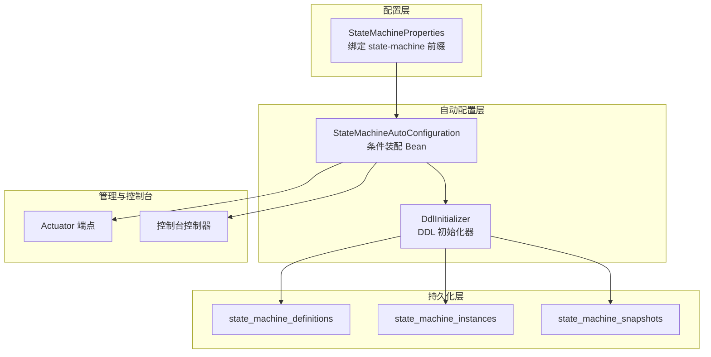
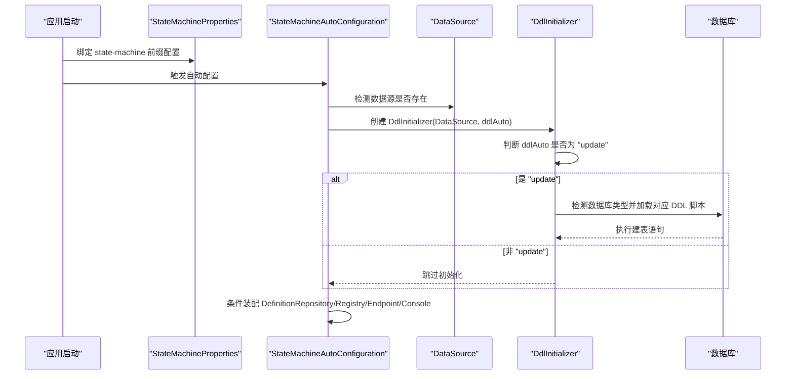
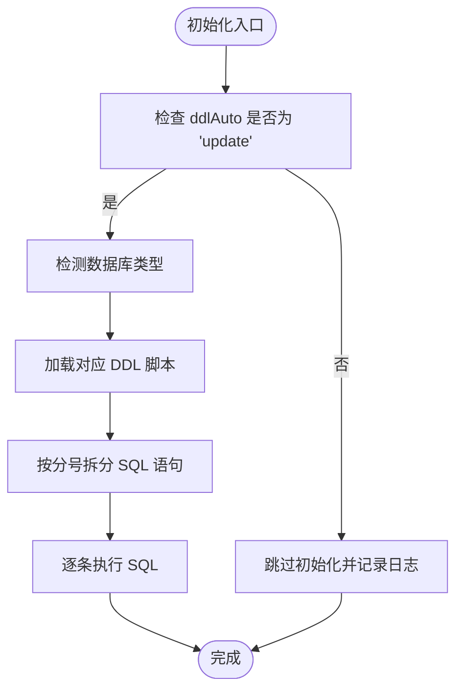
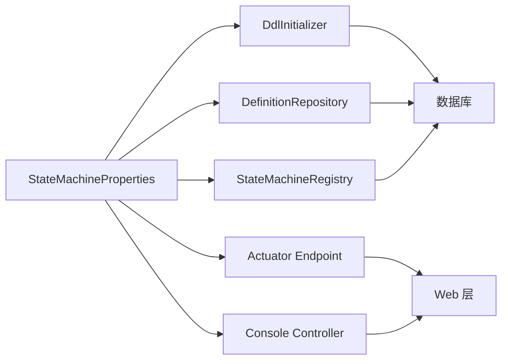

# 属性配置详解

<cite>
**本文档引用的文件**
- [StateMachineProperties.java](file://src/main/java/cn/chedejun/statemachine/autoconfigure/StateMachineProperties.java)
- [StateMachineAutoConfiguration.java](file://src/main/java/cn/chedejun/statemachine/autoconfigure/StateMachineAutoConfiguration.java)
- [DdlInitializer.java](file://src/main/java/cn/chedejun/statemachine/persistence/DdlInitializer.java)
- [mysql.sql](file://src/main/resources/ddl/mysql.sql)
- [postgresql.sql](file://src/main/resources/ddl/postgresql.sql)
- [h2.sql](file://src/main/resources/ddl/h2.sql)
- [application.yml（演示）](file://demo/src/main/resources/application.yml)
- [application.yml（测试）](file://src/test/resources/application.yml)
- [README.md](file://README.md)
- [StateMachineIntegrationTest.java](file://src/test/java/cn/chedejun/statemachine/integration/StateMachineIntegrationTest.java)
</cite>

## 目录
1. [简介](#简介)
2. [项目结构](#项目结构)
3. [核心组件](#核心组件)
4. [架构总览](#架构总览)
5. [详细组件分析](#详细组件分析)
6. [依赖关系分析](#依赖关系分析)
7. [性能考虑](#性能考虑)
8. [故障排查指南](#故障排查指南)
9. [结论](#结论)
10. [附录](#附录)

## 简介
本文件面向使用状态机 Starter 的开发者，系统性梳理 StateMachineProperties 类中的所有配置项，解释其作用、默认值与取值范围，并结合实际工程示例给出完整 application.yml 配置模板。同时，文档覆盖配置项之间的依赖关系与约束条件，提供多环境配置最佳实践与性能调优建议，并给出配置验证与错误处理指南，帮助读者在不同环境下稳定、高效地部署与运行状态机功能。

## 项目结构
该项目采用 Spring Boot 自动配置模式，核心配置类 StateMachineProperties 通过 @ConfigurationProperties 绑定前缀为 state-machine 的配置项；自动配置类 StateMachineAutoConfiguration 根据数据源存在与否以及开关配置动态装配 DDL 初始化器、仓库与注册表等组件；DDL 脚本按数据库类型自动选择并初始化三张核心表：定义表、实例表与快照表。

图表来源
- [StateMachineProperties.java:1-35](file://src/main/java/cn/chedejun/statemachine/autoconfigure/StateMachineProperties.java#L1-L35)
- [StateMachineAutoConfiguration.java:22-79](file://src/main/java/cn/chedejun/statemachine/autoconfigure/StateMachineAutoConfiguration.java#L22-L79)
- [DdlInitializer.java:9-54](file://src/main/java/cn/chedejun/statemachine/persistence/DdlInitializer.java#L9-L54)

章节来源
- [StateMachineProperties.java:1-35](file://src/main/java/cn/chedejun/statemachine/autoconfigure/StateMachineProperties.java#L1-L35)
- [StateMachineAutoConfiguration.java:22-79](file://src/main/java/cn/chedejun/statemachine/autoconfigure/StateMachineAutoConfiguration.java#L22-L79)
- [DdlInitializer.java:9-54](file://src/main/java/cn/chedejun/statemachine/persistence/DdlInitializer.java#L9-L54)

## 核心组件
本节聚焦 StateMachineProperties 类及其子配置对象，逐项说明作用、默认值与取值范围，并指出与其他组件的耦合关系。

- 配置前缀
  - 前缀：state-machine
  - 作用：将 application.yml 中以 state-machine 开头的键映射到该类及内部嵌套类的字段上

- 主要配置项
  - ddlAuto
    - 类型：字符串
    - 默认值："update"
    - 取值范围：任意字符串
    - 作用：控制是否自动初始化 DDL 表结构。当值不等于 "update" 时，跳过 DDL 初始化
    - 依赖关系：与 DdlInitializer 强关联，影响其是否执行初始化逻辑
    - 约束条件：若设置为非 "update"，则不会自动创建表，需确保表已存在或由其他方式初始化
  - retry（重试策略）
    - 子项：
      - defaultMaxAttempts：整数，默认 3
      - defaultInitialDelayMs：长整型（毫秒），默认 1000
      - defaultMaxDelayMs：长整型（毫秒），默认 30000
      - defaultBackoffFactor：双精度浮点，默认 2.0
    - 作用：为状态机执行失败时的重试提供全局默认策略
    - 依赖关系：与状态机执行流程强关联，用于指数退避重试
    - 约束条件：defaultMaxAttempts ≥ 0；defaultInitialDelayMs > 0；defaultMaxDelayMs ≥ defaultInitialDelayMs；defaultBackoffFactor ≥ 1.0
  - management（管理端点）
    - 子项：enabled（布尔，默认 true）
    - 作用：启用/禁用基于 Spring Boot Actuator 的状态机管理端点
    - 依赖关系：仅在 classpath 包含 Actuator Endpoint 类且 enabled=true 时生效
    - 约束条件：需配合 management.endpoints.web.exposure.include 暴露端点
  - console（控制台）
    - 子项：enabled（布尔，默认 true）
    - 作用：启用/禁用内置 Web 控制台（静态页面+REST 接口）
    - 依赖关系：仅在 classpath 包含 DispatcherServlet 且 enabled=true 时生效
    - 约束条件：需确保 Web MVC 或 WebFlux 已配置

章节来源
- [StateMachineProperties.java:5-34](file://src/main/java/cn/chedejun/statemachine/autoconfigure/StateMachineProperties.java#L5-L34)
- [StateMachineAutoConfiguration.java:58-78](file://src/main/java/cn/chedejun/statemachine/autoconfigure/StateMachineAutoConfiguration.java#L58-L78)

## 架构总览
下图展示配置如何驱动自动装配与 DDL 初始化的整体流程，以及与数据库表的关系。

图表来源
- [StateMachineAutoConfiguration.java:28-31](file://src/main/java/cn/chedejun/statemachine/autoconfigure/StateMachineAutoConfiguration.java#L28-L31)
- [DdlInitializer.java:20-43](file://src/main/java/cn/chedejun/statemachine/persistence/DdlInitializer.java#L20-L43)

## 详细组件分析

### DdlInitializer 初始化流程
- 功能：根据 ddlAuto 决定是否初始化表结构；检测数据库类型并加载对应 DDL 脚本；执行建表语句
- 关键行为：
  - 若 ddlAuto 不等于 "update"，记录日志并跳过初始化
  - 自动识别数据库类型（MySQL、PostgreSQL、默认 H2）
  - 加载对应 SQL 脚本并按分号拆分逐条执行
  - 异常时记录错误并抛出运行时异常
- 影响范围：state_machine_definitions、state_machine_instances、state_machine_snapshots 三张表

图表来源
- [DdlInitializer.java:20-43](file://src/main/java/cn/chedejun/statemachine/persistence/DdlInitializer.java#L20-L43)

章节来源
- [DdlInitializer.java:9-54](file://src/main/java/cn/chedejun/statemachine/persistence/DdlInitializer.java#L9-L54)

### 数据库脚本与表结构
- MySQL 脚本
  - 使用 JSON 字段存储状态与转换信息
  - 定义唯一索引保证名称与版本组合唯一
- PostgreSQL 脚本
  - 使用 JSONB 字段，具备更丰富的查询能力
  - 其他字段与 MySQL 版本一致
- H2 脚本
  - 使用 CLOB 字段存储 JSON 文本
  - 适用于开发与测试场景

章节来源
- [mysql.sql:1-18](file://src/main/resources/ddl/mysql.sql#L1-L18)
- [postgresql.sql:1-18](file://src/main/resources/ddl/postgresql.sql#L1-L18)
- [h2.sql:1-18](file://src/main/resources/ddl/h2.sql#L1-L18)

### 自动配置与条件装配
- 条件装配规则：
  - 当存在 DataSource 时，装配 DdlInitializer、DefinitionRepository、StateMachineRegistry
  - 当存在 Actuator Endpoint 类且 state-machine.management.enabled=true 时，装配管理端点
  - 当存在 DispatcherServlet 且 state-machine.console.enabled=true 时，装配控制台控制器
- Bean 注册后置处理器：扫描所有状态机 Bean，注入 JdbcTemplate 与 Registry 并进行注册

章节来源
- [StateMachineAutoConfiguration.java:28-56](file://src/main/java/cn/chedejun/statemachine/autoconfigure/StateMachineAutoConfiguration.java#L28-L56)
- [StateMachineAutoConfiguration.java:58-78](file://src/main/java/cn/chedejun/statemachine/autoconfigure/StateMachineAutoConfiguration.java#L58-L78)

## 依赖关系分析
- 配置到组件的依赖
  - ddlAuto → DdlInitializer.initialize
  - retry.* → 状态机执行重试策略
  - management.enabled → Actuator 端点装配
  - console.enabled → 控制台装配
- 组件到数据库的依赖
  - DdlInitializer → DataSource → 数据库
  - DefinitionRepository/InstanceRepository/SnapshotRepository → JdbcTemplate → 数据库
- 运行时依赖
  - Actuator 端点依赖 Spring Boot Actuator
  - 控制台依赖 Web MVC/WebFlux

图表来源
- [StateMachineAutoConfiguration.java:28-78](file://src/main/java/cn/chedejun/statemachine/autoconfigure/StateMachineAutoConfiguration.java#L28-L78)
- [StateMachineProperties.java:7-16](file://src/main/java/cn/chedejun/statemachine/autoconfigure/StateMachineProperties.java#L7-L16)

## 性能考虑
- DDL 初始化
  - 建议在生产环境将 ddlAuto 设置为非 "update"，通过 CI/CD 或迁移工具预先创建表，避免应用启动时执行 DDL 导致的阻塞
  - 如需自动初始化，请确保数据库连接池与网络延迟可控
- 重试策略
  - defaultBackoffFactor 建议保持 ≥ 1.0，避免退避无效
  - defaultMaxAttempts 过大可能延长失败恢复时间，应结合业务 SLA 设定
  - defaultInitialDelayMs 与 defaultMaxDelayMs 应与业务峰值负载匹配，避免雪崩效应
- 管理端点与控制台
  - 在高并发场景下，建议仅在开发/测试环境开启 console.enabled，生产环境关闭以减少资源占用
  - management.enabled 仅在确需监控时开启，避免暴露敏感接口

## 故障排查指南
- DDL 初始化失败
  - 现象：启动时报错提示无法初始化表
  - 排查要点：
    - 检查 ddlAuto 是否为 "update"，若为其他值将跳过初始化
    - 确认数据库类型识别是否正确（URL 中包含 mysql 或 postgres）
    - 确认对应 DDL 脚本资源是否存在
  - 参考实现位置：
    - [DdlInitializer.initialize:20-43](file://src/main/java/cn/chedejun/statemachine/persistence/DdlInitializer.java#L20-L43)
- 管理端点不可见
  - 现象：访问 /actuator/state-machines 返回 404
  - 排查要点：
    - 确认已引入 Spring Boot Actuator 依赖
    - 确认 state-machine.management.enabled=true
    - 确认 management.endpoints.web.exposure.include 包含 state-machines
  - 参考实现位置：
    - [StateMachineAutoConfiguration.ManagementConfiguration:58-68](file://src/main/java/cn/chedejun/statemachine/autoconfigure/StateMachineAutoConfiguration.java#L58-L68)
- 控制台页面空白或 404
  - 现象：访问 /statemachine/ 页面异常
  - 排查要点：
    - 确认 state-machine.console.enabled=true
    - 确认 Web MVC/WebFlux 已配置
  - 参考实现位置：
    - [StateMachineAutoConfiguration.ConsoleConfiguration:70-78](file://src/main/java/cn/chedejun/statemachine/autoconfigure/StateMachineAutoConfiguration.java#L70-L78)
- 配置验证
  - 单元测试验证了配置绑定与自动装配行为，可参考：
    - [StateMachineIntegrationTest.autoConfiguration_propertiesBound:142-148](file://src/test/java/cn/chedejun/statemachine/integration/StateMachineIntegrationTest.java#L142-L148)
    - [StateMachineIntegrationTest.autoConfiguration_beansLoaded:128-138](file://src/test/java/cn/chedejun/statemachine/integration/StateMachineIntegrationTest.java#L128-L138)

章节来源
- [DdlInitializer.java:39-42](file://src/main/java/cn/chedejun/statemachine/persistence/DdlInitializer.java#L39-L42)
- [StateMachineAutoConfiguration.java:58-78](file://src/main/java/cn/chedejun/statemachine/autoconfigure/StateMachineAutoConfiguration.java#L58-L78)
- [StateMachineIntegrationTest.java:128-148](file://src/test/java/cn/chedejun/statemachine/integration/StateMachineIntegrationTest.java#L128-L148)

## 结论
StateMachineProperties 提供了简洁而强大的配置能力：通过 ddlAuto 控制 DDL 初始化策略，通过 retry.* 配置全局重试策略，通过 management 与 console 开关控制管理与控制台功能。结合自动配置与条件装配机制，项目可在不同环境中灵活启用所需能力。建议在生产环境谨慎开启自动 DDL 与控制台，合理设置重试参数，并通过 Actuator 端点进行健康与状态监控。

## 附录

### 完整 application.yml 示例
以下示例展示了数据库连接、DDL 自动处理、管理控制台与 Actuator 端点的完整配置。请根据实际环境调整数据库连接信息与暴露端点。

- 演示环境配置
  - 参考路径：[application.yml（演示）:1-23](file://demo/src/main/resources/application.yml#L1-L23)
- 测试环境配置
  - 参考路径：[application.yml（测试）:1-14](file://src/test/resources/application.yml#L1-L14)
- README 中的最小配置片段
  - 参考路径：[README.md:55-64](file://README.md#L55-L64)

章节来源
- [application.yml（演示）:1-23](file://demo/src/main/resources/application.yml#L1-L23)
- [application.yml（测试）:1-14](file://src/test/resources/application.yml#L1-L14)
- [README.md:55-64](file://README.md#L55-L64)

### 配置项清单与约束
- state-machine.ddl-auto
  - 类型：字符串
  - 默认值："update"
  - 作用：控制是否自动初始化 DDL
  - 约束：非 "update" 时不执行初始化
- state-machine.retry.defaultMaxAttempts
  - 类型：整数
  - 默认值：3
  - 约束：≥ 0
- state-machine.retry.defaultInitialDelayMs
  - 类型：长整型（毫秒）
  - 默认值：1000
  - 约束：> 0
- state-machine.retry.defaultMaxDelayMs
  - 类型：长整型（毫秒）
  - 默认值：30000
  - 约束：≥ defaultInitialDelayMs
- state-machine.retry.defaultBackoffFactor
  - 类型：双精度浮点
  - 默认值：2.0
  - 约束：≥ 1.0
- state-machine.management.enabled
  - 类型：布尔
  - 默认值：true
  - 作用：启用/禁用管理端点
  - 约束：需配合 Actuator 与端点暴露配置
- state-machine.console.enabled
  - 类型：布尔
  - 默认值：true
  - 作用：启用/禁用控制台
  - 约束：需 Web MVC/WebFlux 支持

章节来源
- [StateMachineProperties.java:7-34](file://src/main/java/cn/chedejun/statemachine/autoconfigure/StateMachineProperties.java#L7-L34)
- [StateMachineAutoConfiguration.java:58-78](file://src/main/java/cn/chedejun/statemachine/autoconfigure/StateMachineAutoConfiguration.java#L58-L78)