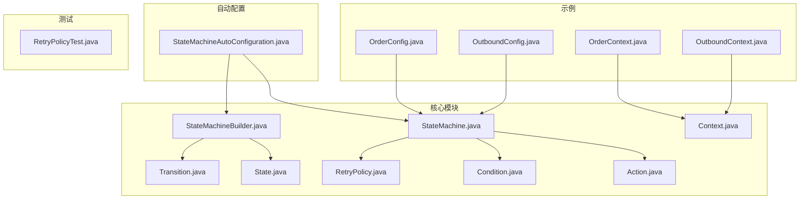
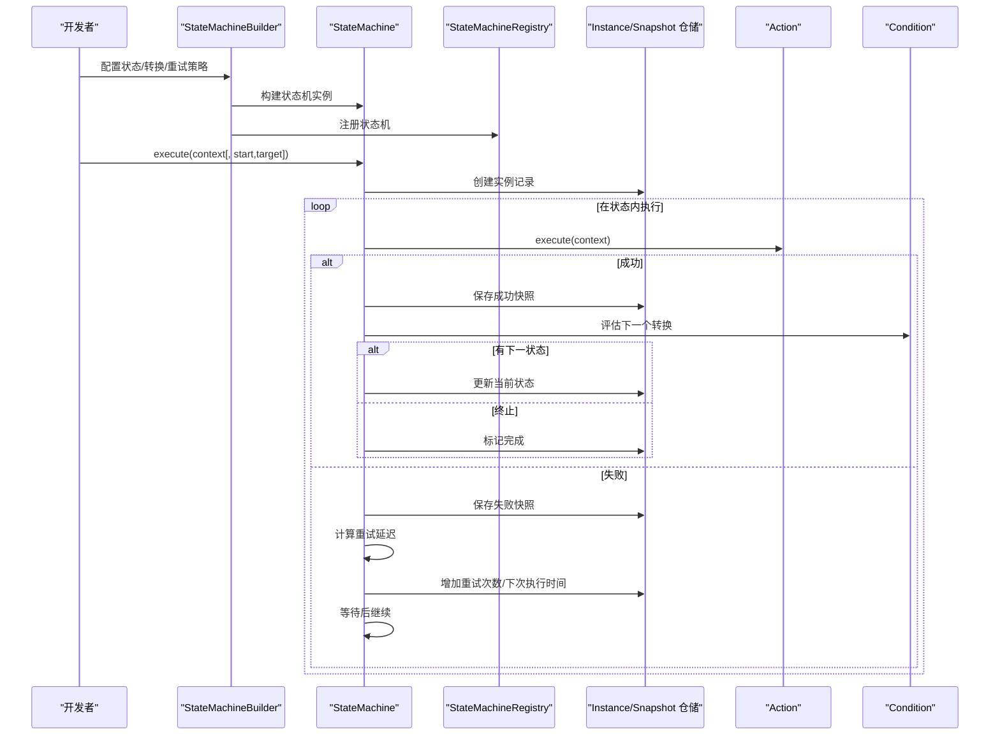
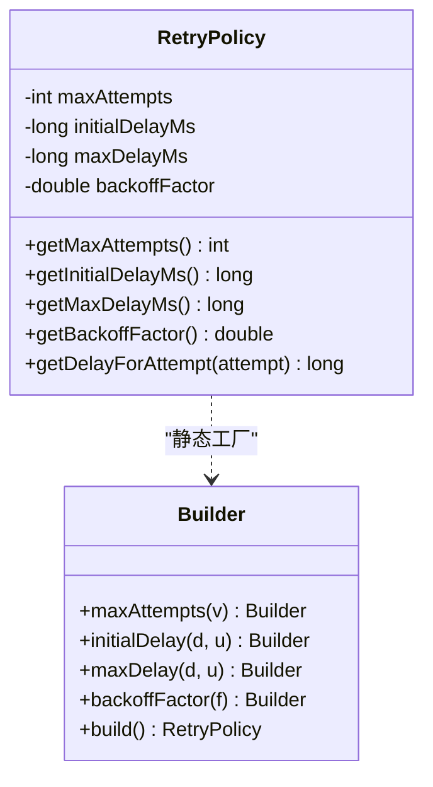
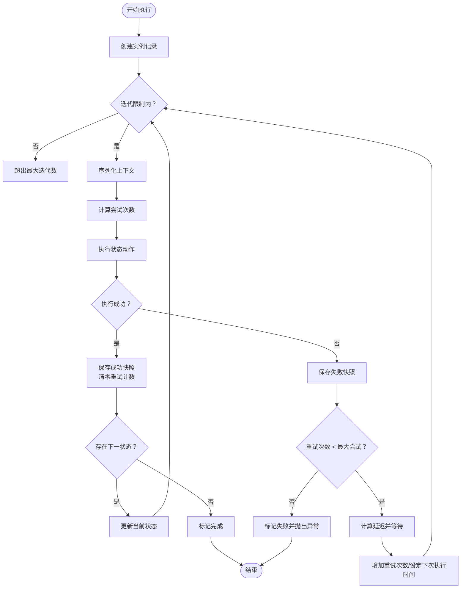
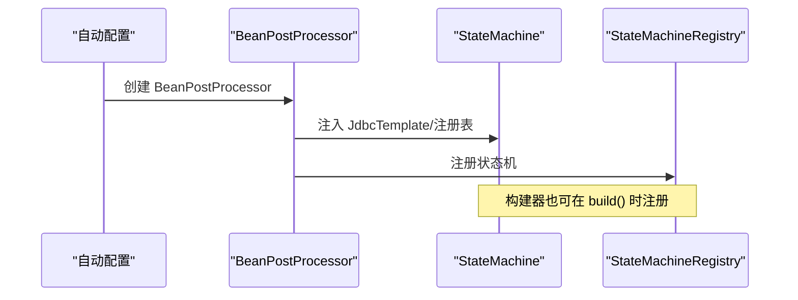
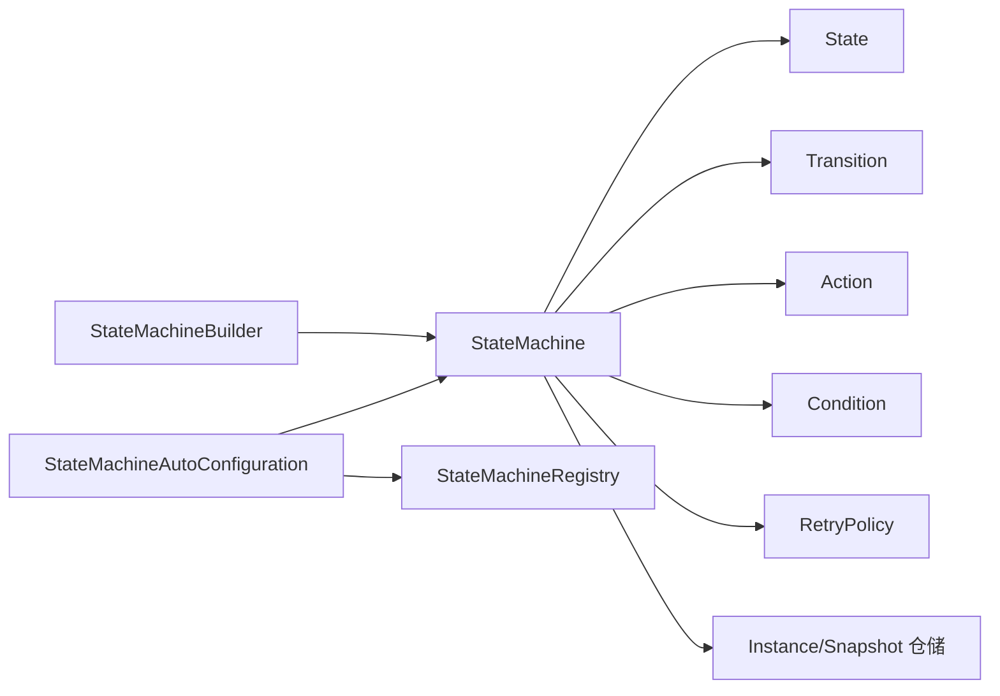

# 扩展点与定制

<cite>
**本文引用的文件**
- [Action.java](file://src/main/java/cn/chedejun/statemachine/core/Action.java)
- [Condition.java](file://src/main/java/cn/chedejun/statemachine/core/Condition.java)
- [RetryPolicy.java](file://src/main/java/cn/chedejun/statemachine/core/RetryPolicy.java)
- [StateMachine.java](file://src/main/java/cn/chedejun/statemachine/core/StateMachine.java)
- [StateMachineBuilder.java](file://src/main/java/cn/chedejun/statemachine/core/StateMachineBuilder.java)
- [State.java](file://src/main/java/cn/chedejun/statemachine/core/State.java)
- [Transition.java](file://src/main/java/cn/chedejun/statemachine/core/Transition.java)
- [Context.java](file://src/main/java/cn/chedejun/statemachine/core/Context.java)
- [OrderConfig.java](file://demo/src/main/java/cn/chedejun/demo/config/OrderConfig.java)
- [OutboundConfig.java](file://demo/src/main/java/cn/chedejun/demo/config/OutboundConfig.java)
- [OrderContext.java](file://demo/src/main/java/cn/chedejun/demo/statemachine/OrderContext.java)
- [OutboundContext.java](file://demo/src/main/java/cn/chedejun/demo/statemachine/OutboundContext.java)
- [StateMachineAutoConfiguration.java](file://src/main/java/cn/chedejun/statemachine/autoconfigure/StateMachineAutoConfiguration.java)
- [RetryPolicyTest.java](file://src/test/java/cn/chedejun/statemachine/core/RetryPolicyTest.java)
</cite>

## 目录
1. [简介](#简介)
2. [项目结构](#项目结构)
3. [核心组件](#核心组件)
4. [架构总览](#架构总览)
5. [详细组件分析](#详细组件分析)
6. [依赖分析](#依赖分析)
7. [性能考量](#性能考量)
8. [故障排查指南](#故障排查指南)
9. [结论](#结论)
10. [附录](#附录)

## 简介
本文件面向希望扩展状态机行为的开发者，系统性阐述以下扩展点与定制能力：
- 自定义 Action 接口以定义状态执行逻辑
- 自定义 Condition 接口以实现条件判断
- 扩展 RetryPolicy 以实现自定义重试策略
- 提供订单处理与出库流程的完整配置示例
- 说明扩展点的注册与使用方法
- 给出最佳实践、性能考虑与测试调试指南

## 项目结构
该仓库采用分层与按功能模块组织的结构：
- 核心模块：状态机核心接口与实现（Action、Condition、RetryPolicy、StateMachine、StateMachineBuilder、State、Transition、Context）
- 自动配置模块：Spring Boot 自动装配，负责数据库初始化、注册表、管理端点与控制台
- 示例模块：演示订单处理与出库流程的配置与上下文对象
- 测试模块：覆盖核心行为与集成场景

图表来源
- [StateMachineAutoConfiguration.java:1-80](file://src/main/java/cn/chedejun/statemachine/autoconfigure/StateMachineAutoConfiguration.java#L1-L80)
- [StateMachine.java:1-196](file://src/main/java/cn/chedejun/statemachine/core/StateMachine.java#L1-L196)
- [StateMachineBuilder.java:1-53](file://src/main/java/cn/chedejun/statemachine/core/StateMachineBuilder.java#L1-L53)
- [OrderConfig.java:1-85](file://demo/src/main/java/cn/chedejun/demo/config/OrderConfig.java#L1-L85)
- [OutboundConfig.java:1-121](file://demo/src/main/java/cn/chedejun/demo/config/OutboundConfig.java#L1-L121)
- [OrderContext.java:1-34](file://demo/src/main/java/cn/chedejun/demo/statemachine/OrderContext.java#L1-L34)
- [OutboundContext.java:1-43](file://demo/src/main/java/cn/chedejun/demo/statemachine/OutboundContext.java#L1-L43)
- [RetryPolicyTest.java:1-35](file://src/test/java/cn/chedejun/statemachine/core/RetryPolicyTest.java#L1-L35)

章节来源
- [StateMachineAutoConfiguration.java:1-80](file://src/main/java/cn/chedejun/statemachine/autoconfigure/StateMachineAutoConfiguration.java#L1-L80)
- [StateMachine.java:1-196](file://src/main/java/cn/chedejun/statemachine/core/StateMachine.java#L1-L196)
- [StateMachineBuilder.java:1-53](file://src/main/java/cn/chedejun/statemachine/core/StateMachineBuilder.java#L1-L53)

## 核心组件
本节聚焦于扩展点与定制相关的三个核心接口与两个关键类：
- Action：定义状态执行逻辑的函数式接口
- Condition：定义条件判断的函数式接口
- RetryPolicy：内置指数退避重试策略，支持自定义构建
- StateMachine：状态机执行引擎，负责状态流转、重试与持久化
- StateMachineBuilder：状态机构建器，用于声明式配置

章节来源
- [Action.java:1-12](file://src/main/java/cn/chedejun/statemachine/core/Action.java#L1-L12)
- [Condition.java:1-7](file://src/main/java/cn/chedejun/statemachine/core/Condition.java#L1-L7)
- [RetryPolicy.java:1-45](file://src/main/java/cn/chedejun/statemachine/core/RetryPolicy.java#L1-L45)
- [StateMachine.java:1-196](file://src/main/java/cn/chedejun/statemachine/core/StateMachine.java#L1-L196)
- [StateMachineBuilder.java:1-53](file://src/main/java/cn/chedejun/statemachine/core/StateMachineBuilder.java#L1-L53)

## 架构总览
下图展示了状态机在运行期的关键交互：构建器生成状态机，自动配置注入持久化与注册表，状态机在执行时调用 Action、依据 Condition 判断流转，并根据 RetryPolicy 控制重试。

图表来源
- [StateMachineBuilder.java:40-51](file://src/main/java/cn/chedejun/statemachine/core/StateMachineBuilder.java#L40-L51)
- [StateMachine.java:40-136](file://src/main/java/cn/chedejun/statemachine/core/StateMachine.java#L40-L136)
- [StateMachineAutoConfiguration.java:44-56](file://src/main/java/cn/chedejun/statemachine/autoconfigure/StateMachineAutoConfiguration.java#L44-L56)

## 详细组件分析

### Action 接口与自定义实现
- 角色：每个状态的执行单元，接收上下文并执行业务逻辑；通过上下文写入结果，自动记录到快照。
- 实现方式：以函数式接口形式传入状态机，或在配置类中定义私有方法作为动作实现。
- 最佳实践：
  - 动作应幂等或具备补偿能力，避免重复执行造成副作用
  - 使用上下文传递必要数据，减少外部依赖
  - 对外调用（如远程服务）需捕获异常并抛出，以便重试与失败记录
- 示例参考：
  - 订单流程中的“检查库存”“处理支付”“发货”等动作
  - 出库流程中的“拣货”“复核”“打包”“发货”等动作

章节来源
- [Action.java:1-12](file://src/main/java/cn/chedejun/statemachine/core/Action.java#L1-L12)
- [OrderConfig.java:48-79](file://demo/src/main/java/cn/chedejun/demo/config/OrderConfig.java#L48-L79)
- [OutboundConfig.java:60-115](file://demo/src/main/java/cn/chedejun/demo/config/OutboundConfig.java#L60-L115)

### Condition 接口与条件判断机制
- 角色：决定从某状态是否能转移到另一状态。
- 实现方式：以函数式接口形式传入转换，基于上下文进行布尔判断。
- 机制说明：状态机在每个状态结束后，遍历所有从该状态出发的转换，若未设置条件或条件为真，则进入目标状态。
- 最佳实践：
  - 条件应尽量简单明确，避免复杂分支导致状态机难以维护
  - 条件判断依赖的数据应在动作中尽早准备，保证一致性
  - 对于异常分支（如库存不足、拣货失败），建议显式定义条件与对应状态

章节来源
- [Condition.java:1-7](file://src/main/java/cn/chedejun/statemachine/core/Condition.java#L1-L7)
- [StateMachine.java:142-149](file://src/main/java/cn/chedejun/statemachine/core/StateMachine.java#L142-L149)
- [OrderConfig.java:30-38](file://demo/src/main/java/cn/chedejun/demo/config/OrderConfig.java#L30-L38)
- [OutboundConfig.java:36-50](file://demo/src/main/java/cn/chedejun/demo/config/OutboundConfig.java#L36-L50)

### RetryPolicy 扩展与自定义重试策略
- 内置策略：指数退避，支持最大尝试次数、初始延迟、最大延迟与退避因子配置。
- 计算公式：按指数增长计算每次重试延迟，不超过最大延迟上限。
- 自定义扩展：
  - 可通过 Builder 设置参数，或直接继承/组合实现更复杂的策略（如线性退避、抖动退避、基于错误类型的差异化策略）
  - 注意：重试次数与延迟由状态机在执行循环中统一管理，自定义策略需与状态机的重试计数与等待机制协同
- 示例参考：订单与出库流程均使用指数退避策略并设置最大尝试次数与延迟范围

图表来源
- [RetryPolicy.java:5-44](file://src/main/java/cn/chedejun/statemachine/core/RetryPolicy.java#L5-L44)

章节来源
- [RetryPolicy.java:1-45](file://src/main/java/cn/chedejun/statemachine/core/RetryPolicy.java#L1-L45)
- [StateMachine.java:83-136](file://src/main/java/cn/chedejun/statemachine/core/StateMachine.java#L83-L136)
- [OrderConfig.java:40-44](file://demo/src/main/java/cn/chedejun/demo/config/OrderConfig.java#L40-L44)
- [OutboundConfig.java:52-56](file://demo/src/main/java/cn/chedejun/demo/config/OutboundConfig.java#L52-L56)

### 状态机执行流程与重试机制
- 执行入口：支持从指定起始状态或目标状态执行，内部创建实例记录并进入执行循环。
- 执行循环：
  - 序列化上下文，计算当前尝试次数
  - 调用状态动作，成功则保存成功快照并清零重试计数
  - 失败则保存失败快照，根据重试策略计算延迟并等待，超过最大尝试次数则标记失败
  - 根据条件选择下一状态，更新实例状态，直至达到目标状态或无后续状态
- 重试恢复：支持从首次快照读取原始上下文并重试

图表来源
- [StateMachine.java:83-136](file://src/main/java/cn/chedejun/statemachine/core/StateMachine.java#L83-L136)

章节来源
- [StateMachine.java:40-136](file://src/main/java/cn/chedejun/statemachine/core/StateMachine.java#L40-L136)

### 扩展点注册与使用
- 自动注册：当存在数据源时，自动配置通过 BeanPostProcessor 将 JdbcTemplate 与注册表注入状态机，并将其注册到注册表。
- 手动注册：构建器在 build() 时可传入注册表，构建完成后自动注册。
- 使用方式：在 Spring 配置类中定义状态机 Bean，通过 Builder 声明状态、转换与重试策略，最终注入上下文类型。

图表来源
- [StateMachineAutoConfiguration.java:44-56](file://src/main/java/cn/chedejun/statemachine/autoconfigure/StateMachineAutoConfiguration.java#L44-L56)
- [StateMachineBuilder.java:40-51](file://src/main/java/cn/chedejun/statemachine/core/StateMachineBuilder.java#L40-L51)

章节来源
- [StateMachineAutoConfiguration.java:22-56](file://src/main/java/cn/chedejun/statemachine/autoconfigure/StateMachineAutoConfiguration.java#L22-L56)
- [StateMachineBuilder.java:18-51](file://src/main/java/cn/chedejun/statemachine/core/StateMachineBuilder.java#L18-L51)

### 订单处理与出库流程配置示例
- 订单处理流程要点：
  - 状态：检查库存、处理支付、发货、发送通知、缺货通知、订单失败
  - 条件：库存充足/不足、支付成功/失败、地址有效/无效
  - 重试：指数退避，最大尝试次数与延迟范围
- 出库流程要点：
  - 状态：创建出库单、拣货、复核、打包、发货、完成、异常处理、重新拣货、退货入库
  - 条件：拣货成功/失败、复核通过/不通过、发货成功/失败
  - 重试：同上策略

章节来源
- [OrderConfig.java:18-46](file://demo/src/main/java/cn/chedejun/demo/config/OrderConfig.java#L18-L46)
- [OutboundConfig.java:21-58](file://demo/src/main/java/cn/chedejun/demo/config/OutboundConfig.java#L21-L58)
- [OrderContext.java:1-34](file://demo/src/main/java/cn/chedejun/demo/statemachine/OrderContext.java#L1-L34)
- [OutboundContext.java:1-43](file://demo/src/main/java/cn/chedejun/demo/statemachine/OutboundContext.java#L1-L43)

## 依赖分析
- 组件耦合：
  - StateMachine 依赖 Action、Condition、RetryPolicy、上下文序列化与仓储
  - StateMachineBuilder 负责组装 State 与 Transition，并可注入注册表
  - 自动配置负责注入持久化与注册表，确保状态机可用
- 外部依赖：
  - Spring JDBC 与 Jackson 用于数据访问与序列化
  - Spring Boot Actuator 与 Web（可选）用于管理端点与控制台

图表来源
- [StateMachineBuilder.java:27-32](file://src/main/java/cn/chedejun/statemachine/core/StateMachineBuilder.java#L27-L32)
- [StateMachine.java:13-35](file://src/main/java/cn/chedejun/statemachine/core/StateMachine.java#L13-L35)
- [StateMachineAutoConfiguration.java:44-56](file://src/main/java/cn/chedejun/statemachine/autoconfigure/StateMachineAutoConfiguration.java#L44-L56)

章节来源
- [StateMachineBuilder.java:1-53](file://src/main/java/cn/chedejun/statemachine/core/StateMachineBuilder.java#L1-L53)
- [StateMachine.java:1-196](file://src/main/java/cn/chedejun/statemachine/core/StateMachine.java#L1-L196)
- [StateMachineAutoConfiguration.java:1-80](file://src/main/java/cn/chedejun/statemachine/autoconfigure/StateMachineAutoConfiguration.java#L1-L80)

## 性能考量
- 序列化成本：上下文的序列化/反序列化可能成为瓶颈，建议：
  - 控制上下文大小，仅保留必要字段
  - 使用稳定且高效的序列化方案
- 重试与等待：指数退避会放大等待时间，建议：
  - 合理设置最大尝试次数与最大延迟
  - 对长耗时动作采用异步或外部队列解耦
- 数据库压力：快照与实例记录频繁写入，建议：
  - 合理分区与索引设计
  - 批量写入与异步落盘（视仓储实现而定）

## 故障排查指南
- 常见问题与定位：
  - 状态机未初始化：检查数据源与自动配置是否生效
  - 状态未找到：确认状态名称拼写与构建顺序一致
  - 条件不生效：检查条件函数是否正确读取上下文字段
  - 重试无效：确认重试策略配置与状态机执行循环逻辑
- 调试建议：
  - 使用管理端点与控制台查看实例状态与快照
  - 在动作中打印关键日志，记录输入输出
  - 单元测试验证重试策略与边界条件
- 相关测试参考：
  - 重试策略测试：验证无重试、指数退避延迟与上限

章节来源
- [StateMachine.java:178-180](file://src/main/java/cn/chedejun/statemachine/core/StateMachine.java#L178-L180)
- [RetryPolicyTest.java:9-33](file://src/test/java/cn/chedejun/statemachine/core/RetryPolicyTest.java#L9-L33)

## 结论
通过 Action、Condition、RetryPolicy 三类扩展点，结合 StateMachineBuilder 的声明式配置与自动装配的注册机制，可以快速构建高可靠、可观测的状态机应用。在实际工程中，建议遵循幂等性、最小上下文与合理重试的原则，并配合完善的测试与监控体系保障稳定性。

## 附录
- 上下文基类：Context 提供键值存储与映射转换，便于扩展上下文对象
- 示例上下文：OrderContext 与 OutboundContext 展示了如何在业务域内封装状态机所需数据

章节来源
- [Context.java:1-24](file://src/main/java/cn/chedejun/statemachine/core/Context.java#L1-L24)
- [OrderContext.java:1-34](file://demo/src/main/java/cn/chedejun/demo/statemachine/OrderContext.java#L1-L34)
- [OutboundContext.java:1-43](file://demo/src/main/java/cn/chedejun/demo/statemachine/OutboundContext.java#L1-L43)