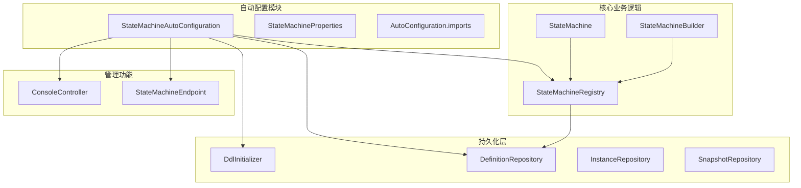
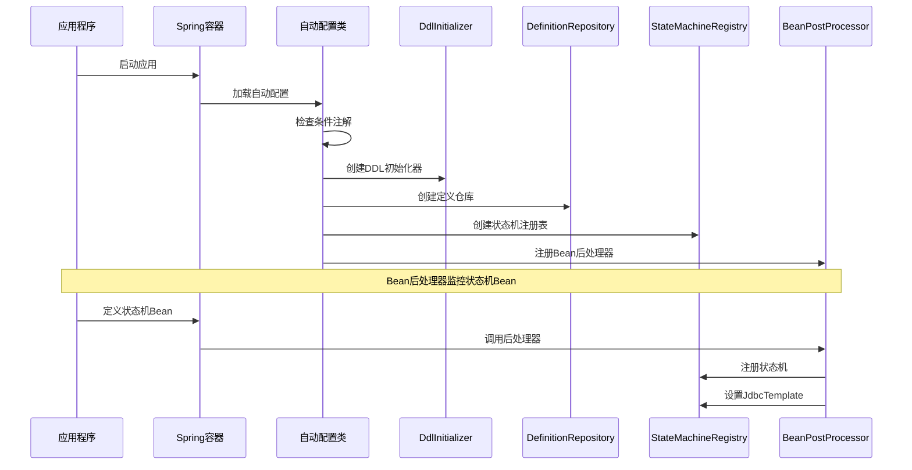
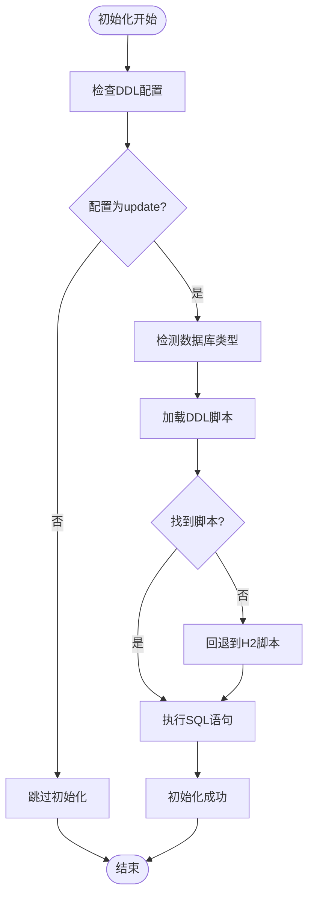
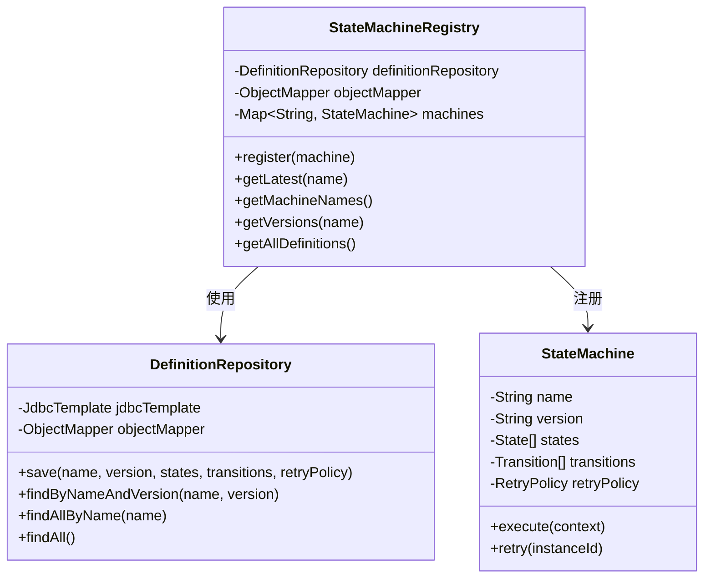
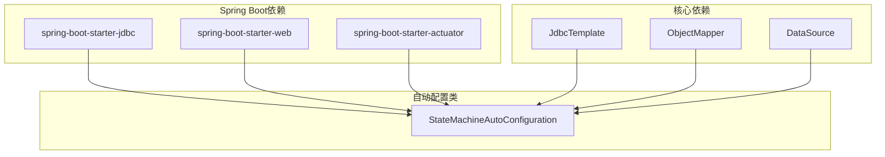
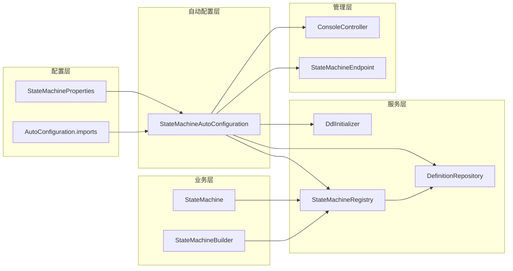

# 自动配置机制

<cite>
**本文档引用的文件**
- [StateMachineAutoConfiguration.java](file://src/main/java/cn/chedejun/statemachine/autoconfigure/StateMachineAutoConfiguration.java)
- [StateMachineProperties.java](file://src/main/java/cn/chedejun/statemachine/autoconfigure/StateMachineProperties.java)
- [org.springframework.boot.autoconfigure.AutoConfiguration.imports](file://src/main/resources/META-INF/spring/org.springframework.boot.autoconfigure.AutoConfiguration.imports)
- [DdlInitializer.java](file://src/main/java/cn/chedejun/statemachine/persistence/DdlInitializer.java)
- [DefinitionRepository.java](file://src/main/java/cn/chedejun/statemachine/persistence/DefinitionRepository.java)
- [StateMachineRegistry.java](file://src/main/java/cn/chedejun/statemachine/core/StateMachineRegistry.java)
- [StateMachine.java](file://src/main/java/cn/chedejun/statemachine/core/StateMachine.java)
- [ConsoleController.java](file://src/main/java/cn/chedejun/statemachine/management/ConsoleController.java)
- [StateMachineEndpoint.java](file://src/main/java/cn/chedejun/statemachine/management/StateMachineEndpoint.java)
- [application.yml](file://demo/src/main/resources/application.yml)
- [pom.xml](file://pom.xml)
- [StateMachineIntegrationTest.java](file://src/test/java/cn/chedejun/statemachine/integration/StateMachineIntegrationTest.java)
- [StateMachineBuilder.java](file://src/main/java/cn/chedejun/statemachine/core/StateMachineBuilder.java)
</cite>

## 目录
1. [简介](#简介)
2. [项目结构](#项目结构)
3. [核心组件](#核心组件)
4. [架构概览](#架构概览)
5. [详细组件分析](#详细组件分析)
6. [依赖分析](#依赖分析)
7. [性能考虑](#性能考虑)
8. [故障排除指南](#故障排除指南)
9. [结论](#结论)

## 简介

本文档深入解析了状态机自动配置机制的工作原理和实现细节。该系统基于Spring Boot自动配置机制，实现了状态机框架的无缝集成和配置管理。文档涵盖了StateMachineAutoConfiguration类的工作原理、自动配置触发条件、Bean创建逻辑、条件注解使用以及调试和故障排除方法。

## 项目结构

该项目采用模块化设计，主要包含以下核心模块：



**图表来源**
- [StateMachineAutoConfiguration.java:1-80](file://src/main/java/cn/chedejun/statemachine/autoconfigure/StateMachineAutoConfiguration.java#L1-L80)
- [DdlInitializer.java:1-54](file://src/main/java/cn/chedejun/statemachine/persistence/DdlInitializer.java#L1-L54)
- [DefinitionRepository.java:1-78](file://src/main/java/cn/chedejun/statemachine/persistence/DefinitionRepository.java#L1-L78)
- [StateMachineRegistry.java:1-73](file://src/main/java/cn/chedejun/statemachine/core/StateMachineRegistry.java#L1-L73)

**章节来源**
- [pom.xml:1-90](file://pom.xml#L1-L90)
- [org.springframework.boot.autoconfigure.AutoConfiguration.imports:1-2](file://src/main/resources/META-INF/spring/org.springframework.boot.autoconfigure.AutoConfiguration.imports#L1-L2)

## 核心组件

### StateMachineAutoConfiguration 类

StateMachineAutoConfiguration是整个自动配置的核心类，负责在Spring Boot应用启动时自动配置状态机相关的Bean。

#### 主要特性
- 基于条件注解的智能配置
- 与Spring Boot数据源自动配置的协调
- 支持管理控制台和Actuator端点的可选配置

#### 关键配置注解
- `@AutoConfiguration`: 标识这是一个自动配置类
- `@AutoConfigureAfter(DataSourceAutoConfiguration.class)`: 确保在数据源配置之后执行
- `@EnableConfigurationProperties(StateMachineProperties.class)`: 启用配置属性绑定
- `@ConditionalOnClass(JdbcTemplate.class)`: 仅当存在JdbcTemplate类时才启用

**章节来源**
- [StateMachineAutoConfiguration.java:22-26](file://src/main/java/cn/chedejun/statemachine/autoconfigure/StateMachineAutoConfiguration.java#L22-L26)

### StateMachineProperties 配置属性

配置属性类提供了完整的配置选项，支持DDL自动创建、重试策略、管理控制台和控制台界面的启用/禁用。

#### 配置选项
- `state-machine.ddl-auto`: 控制DDL自动创建行为，默认值为"update"
- `state-machine.management.enabled`: 启用/禁用管理端点，默认值为true
- `state-machine.console.enabled`: 启用/禁用控制台界面，默认值为true

**章节来源**
- [StateMachineProperties.java:5-35](file://src/main/java/cn/chedejun/statemachine/autoconfigure/StateMachineProperties.java#L5-L35)

## 架构概览

状态机自动配置机制遵循Spring Boot的约定优于配置原则，实现了高度的自动化和灵活性。



**图表来源**
- [StateMachineAutoConfiguration.java:28-56](file://src/main/java/cn/chedejun/statemachine/autoconfigure/StateMachineAutoConfiguration.java#L28-L56)

## 详细组件分析

### DdlInitializer 组件

DdlInitializer负责根据数据库类型自动创建必要的表结构。

#### 工作流程
1. 检查DDL自动创建配置
2. 检测数据库类型（MySQL、PostgreSQL、H2）
3. 加载对应的DDL脚本
4. 执行SQL语句创建表结构



**图表来源**
- [DdlInitializer.java:20-43](file://src/main/java/cn/chedejun/statemachine/persistence/DdlInitializer.java#L20-L43)

**章节来源**
- [DdlInitializer.java:1-54](file://src/main/java/cn/chedejun/statemachine/persistence/DdlInitializer.java#L1-L54)

### DefinitionRepository 组件

DefinitionRepository负责状态机定义的持久化存储，提供CRUD操作和查询功能。

#### 核心功能
- 将状态机定义序列化为JSON格式存储
- 提供按名称和版本查找定义的功能
- 支持分页查询所有定义

**章节来源**
- [DefinitionRepository.java:1-78](file://src/main/java/cn/chedejun/statemachine/persistence/DefinitionRepository.java#L1-L78)

### StateMachineRegistry 组件

StateMachineRegistry是状态机的核心注册中心，负责状态机的注册、管理和版本控制。

#### 注册机制
1. 检查定义是否已存在于数据库中
2. 如果不存在，序列化状态机定义并保存到数据库
3. 将状态机实例添加到内存映射表中
4. 提供版本管理和查询功能



**图表来源**
- [StateMachineRegistry.java:9-73](file://src/main/java/cn/chedejun/statemachine/core/StateMachineRegistry.java#L9-L73)
- [DefinitionRepository.java:15-78](file://src/main/java/cn/chedejun/statemachine/persistence/DefinitionRepository.java#L15-L78)
- [StateMachine.java:11-196](file://src/main/java/cn/chedejun/statemachine/core/StateMachine.java#L11-L196)

**章节来源**
- [StateMachineRegistry.java:1-73](file://src/main/java/cn/chedejun/statemachine/core/StateMachineRegistry.java#L1-L73)

### BeanPostProcessor 机制

BeanPostProcessor实现了状态机的自动注册机制，确保每个状态机Bean都能被正确注册到注册表中。

#### 工作流程
1. 监听所有Bean的初始化完成事件
2. 检查Bean是否为StateMachine实例
3. 为状态机设置JdbcTemplate和注册表引用
4. 将状态机注册到注册表中

**章节来源**
- [StateMachineAutoConfiguration.java:43-56](file://src/main/java/cn/chedejun/statemachine/autoconfigure/StateMachineAutoConfiguration.java#L43-L56)

### 管理功能组件

系统提供了两种管理方式：Spring Boot Actuator端点和Web控制台。

#### Actuator端点
- 端点ID: `state-machines`
- 功能：列出机器、获取版本信息、重试实例

#### Web控制台
- 路径: `/statemachine`
- 功能：图形化界面查看状态机运行状态

**章节来源**
- [ConsoleController.java:1-106](file://src/main/java/cn/chedejun/statemachine/management/ConsoleController.java#L1-L106)
- [StateMachineEndpoint.java:1-73](file://src/main/java/cn/chedejun/statemachine/management/StateMachineEndpoint.java#L1-L73)

## 依赖分析

### 外部依赖关系



**图表来源**
- [pom.xml:33-68](file://pom.xml#L33-L68)

### 内部组件依赖



**图表来源**
- [StateMachineAutoConfiguration.java:1-80](file://src/main/java/cn/chedejun/statemachine/autoconfigure/StateMachineAutoConfiguration.java#L1-L80)
- [StateMachineRegistry.java:1-73](file://src/main/java/cn/chedejun/statemachine/core/StateMachineRegistry.java#L1-L73)

**章节来源**
- [pom.xml:13-90](file://pom.xml#L13-L90)

## 性能考虑

### 初始化性能优化

1. **延迟初始化**: 状态机的JDBC模板和仓库对象采用延迟初始化，避免不必要的资源消耗
2. **并发安全**: 使用ConcurrentHashMap确保多线程环境下的注册安全性
3. **缓存策略**: 注册表中的状态机实例按名称和版本进行缓存

### 数据库性能优化

1. **批量操作**: DDL初始化时使用批量SQL执行减少网络往返
2. **连接池**: 依赖Spring Boot的数据源自动配置提供的连接池管理
3. **索引优化**: 定义仓库查询使用适当的WHERE子句和ORDER BY子句

## 故障排除指南

### 常见问题及解决方案

#### 1. 自动配置未生效

**症状**: 状态机相关Bean未创建
**原因**: 缺少JdbcTemplate类或数据源配置不正确
**解决方法**: 
- 确保引入了spring-boot-starter-jdbc依赖
- 检查application.yml中的数据源配置
- 验证条件注解是否满足

#### 2. DDL初始化失败

**症状**: 表结构未创建或创建失败
**原因**: 
- 数据库驱动未正确配置
- DDL脚本缺失或语法错误
- 权限不足

**解决方法**:
- 检查数据库连接URL和驱动类名
- 验证DDL脚本路径和内容
- 确认数据库用户权限

#### 3. 状态机注册失败

**症状**: 状态机无法执行或查询不到
**原因**:
- BeanPostProcessor未正确工作
- 注册表初始化失败
- JSON序列化异常

**解决方法**:
- 检查状态机定义的JSON序列化
- 验证注册表的依赖注入
- 查看Bean后处理器的日志输出

#### 4. 管理功能不可用

**症状**: 控制台或Actuator端点无法访问
**原因**:
- 对应的starter依赖未引入
- 配置属性设置为false
- 端点暴露配置不正确

**解决方法**:
- 引入spring-boot-starter-web或spring-boot-starter-actuator
- 检查state-machine.console.enabled和state-machine.management.enabled配置
- 验证端点暴露配置

### 调试技巧

#### 启用详细日志

在application.yml中添加：
```yaml
logging:
  level:
    cn.chedejun.statemachine: debug
```

#### 验证Bean创建

通过集成测试验证自动配置：
```java
@Test
void autoConfiguration_beansLoaded() {
    assertNotNull(jdbcTemplate);
    assertNotNull(registry);
    assertNotNull(definitionRepository);
    assertNotNull(properties);
}
```

**章节来源**
- [StateMachineIntegrationTest.java:128-138](file://src/test/java/cn/chedejun/statemachine/integration/StateMachineIntegrationTest.java#L128-L138)

## 结论

状态机自动配置机制通过精心设计的条件注解、Bean后处理器和配置属性绑定，实现了高度自动化和灵活的状态机集成。该机制具有以下优势：

1. **零配置体验**: 默认情况下即可正常工作，无需额外配置
2. **条件化配置**: 根据环境和依赖自动调整配置
3. **可扩展性**: 支持自定义配置和扩展功能
4. **可观测性**: 提供完整的管理控制台和Actuator端点

通过本文档的详细分析，开发者可以更好地理解和使用状态机自动配置机制，快速集成状态机功能到Spring Boot应用程序中。