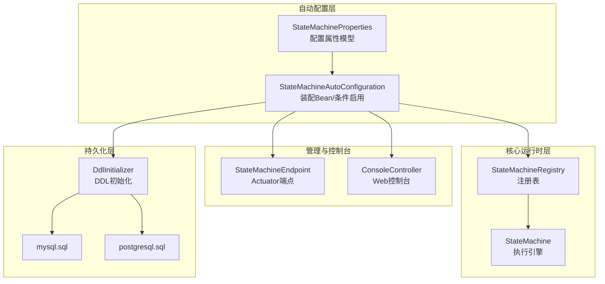
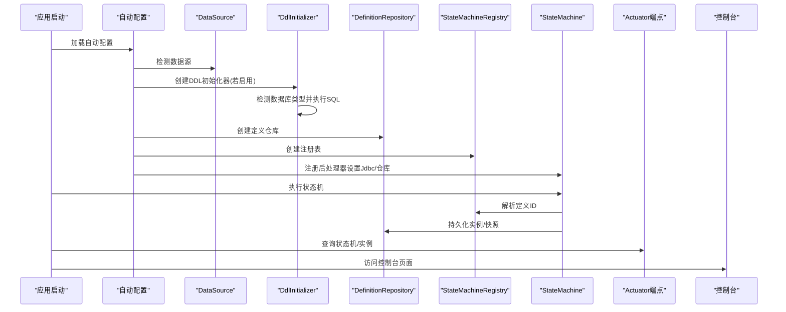
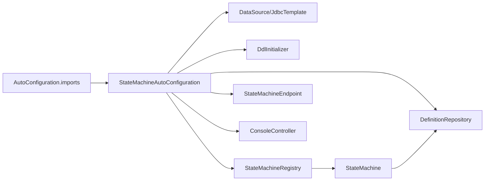

# 配置与定制

<cite>
**本文引用的文件**
- [StateMachineAutoConfiguration.java](file://src/main/java/cn/chedejun/statemachine/autoconfigure/StateMachineAutoConfiguration.java)
- [StateMachineProperties.java](file://src/main/java/cn/chedejun/statemachine/autoconfigure/StateMachineProperties.java)
- [DdlInitializer.java](file://src/main/java/cn/chedejun/statemachine/persistence/DdlInitializer.java)
- [StateMachineEndpoint.java](file://src/main/java/cn/chedejun/statemachine/management/StateMachineEndpoint.java)
- [ConsoleController.java](file://src/main/java/cn/chedejun/statemachine/management/ConsoleController.java)
- [StateMachine.java](file://src/main/java/cn/chedejun/statemachine/core/StateMachine.java)
- [StateMachineRegistry.java](file://src/main/java/cn/chedejun/statemachine/core/StateMachineRegistry.java)
- [application.yml（演示）](file://demo/src/main/resources/application.yml)
- [application.yml（测试）](file://src/test/resources/application.yml)
- [org.springframework.boot.autoconfigure.AutoConfiguration.imports](file://src/main/resources/META-INF/spring/org.springframework.boot.autoconfigure.AutoConfiguration.imports)
- [mysql.sql](file://src/main/resources/ddl/mysql.sql)
- [postgresql.sql](file://src/main/resources/ddl/postgresql.sql)
- [README.md](file://README.md)
</cite>

## 目录
1. [简介](#简介)
2. [项目结构](#项目结构)
3. [核心组件](#核心组件)
4. [架构总览](#架构总览)
5. [详细组件分析](#详细组件分析)
6. [依赖分析](#依赖分析)
7. [性能考虑](#性能考虑)
8. [故障排查指南](#故障排查指南)
9. [结论](#结论)
10. [附录](#附录)

## 简介
本章节面向需要在Spring Boot应用中使用状态机功能的开发者，系统性阐述状态机自动配置的工作原理、配置属性体系、数据库DDL初始化策略、管理控制台与Actuator端点的启用方式、以及如何进行自定义配置与扩展。文档同时提供完整配置示例、参数校验规则、以及不同环境下的最佳实践建议。

## 项目结构
该项目采用“自动配置 + 核心运行时 + 管理与持久化”的分层组织：
- 自动配置层：负责基于属性装配Bean、按需启用管理控制台与Actuator端点、初始化DDL表结构。
- 核心运行时层：状态机定义、注册表、执行引擎、重试策略、上下文序列化等。
- 管理与控制台：Actuator端点用于查询状态机与实例信息；Web控制台提供可视化界面。
- 持久化层：定义、实例、快照三张表的DDL脚本与JDBC仓库实现。

图表来源
- [StateMachineAutoConfiguration.java:22-79](file://src/main/java/cn/chedejun/statemachine/autoconfigure/StateMachineAutoConfiguration.java#L22-L79)
- [StateMachineProperties.java:5-34](file://src/main/java/cn/chedejun/statemachine/autoconfigure/StateMachineProperties.java#L5-L34)
- [DdlInitializer.java:9-53](file://src/main/java/cn/chedejun/statemachine/persistence/DdlInitializer.java#L9-L53)
- [StateMachineEndpoint.java:16-72](file://src/main/java/cn/chedejun/statemachine/management/StateMachineEndpoint.java#L16-L72)
- [ConsoleController.java:15-105](file://src/main/java/cn/chedejun/statemachine/management/ConsoleController.java#L15-L105)
- [mysql.sql:1-18](file://src/main/resources/ddl/mysql.sql#L1-L18)
- [postgresql.sql:1-18](file://src/main/resources/ddl/postgresql.sql#L1-L18)

章节来源
- [StateMachineAutoConfiguration.java:22-79](file://src/main/java/cn/chedejun/statemachine/autoconfigure/StateMachineAutoConfiguration.java#L22-L79)
- [org.springframework.boot.autoconfigure.AutoConfiguration.imports:1-2](file://src/main/resources/META-INF/spring/org.springframework.boot.autoconfigure.AutoConfiguration.imports#L1-L2)

## 核心组件
- 自动配置类：负责在存在数据源时自动装配DDL初始化器、定义仓库、注册表、以及按需启用管理端点与控制台控制器。
- 配置属性类：集中定义state-machine命名空间下的所有可配置项，包括DDL策略、重试策略默认值、管理与控制台开关。
- DDL初始化器：根据数据源类型选择对应SQL脚本，自动创建三张核心表。
- 管理端点与控制台：提供REST接口与Web页面，用于查看状态机定义、实例状态、执行快照与重试操作。

章节来源
- [StateMachineAutoConfiguration.java:28-78](file://src/main/java/cn/chedejun/statemachine/autoconfigure/StateMachineAutoConfiguration.java#L28-L78)
- [StateMachineProperties.java:5-34](file://src/main/java/cn/chedejun/statemachine/autoconfigure/StateMachineProperties.java#L5-L34)
- [DdlInitializer.java:20-43](file://src/main/java/cn/chedejun/statemachine/persistence/DdlInitializer.java#L20-L43)
- [StateMachineEndpoint.java:16-72](file://src/main/java/cn/chedejun/statemachine/management/StateMachineEndpoint.java#L16-L72)
- [ConsoleController.java:15-105](file://src/main/java/cn/chedejun/statemachine/management/ConsoleController.java#L15-L105)

## 架构总览
自动配置在DataSource可用时启动，依据配置属性决定是否初始化DDL、是否启用管理端点与控制台。状态机实例在执行时通过注册表解析定义、持久化实例与快照，并按重试策略进行失败重试。

图表来源
- [StateMachineAutoConfiguration.java:28-56](file://src/main/java/cn/chedejun/statemachine/autoconfigure/StateMachineAutoConfiguration.java#L28-L56)
- [DdlInitializer.java:20-43](file://src/main/java/cn/chedejun/statemachine/persistence/DdlInitializer.java#L20-L43)
- [StateMachineRegistry.java:20-49](file://src/main/java/cn/chedejun/statemachine/core/StateMachineRegistry.java#L20-L49)
- [StateMachine.java:40-79](file://src/main/java/cn/chedejun/statemachine/core/StateMachine.java#L40-L79)
- [StateMachineEndpoint.java:32-71](file://src/main/java/cn/chedejun/statemachine/management/StateMachineEndpoint.java#L32-L71)
- [ConsoleController.java:34-104](file://src/main/java/cn/chedejun/statemachine/management/ConsoleController.java#L34-L104)

## 详细组件分析

### 自动配置与条件启用
- 条件注解：
  - 依赖数据源：仅当存在DataSource或JdbcTemplate时才创建相关Bean。
  - 管理端点启用：通过state-machine.management.enabled控制，缺省启用。
  - 控制台启用：通过state-machine.console.enabled控制，缺省启用。
- 关键Bean：
  - DdlInitializer：按DDL策略初始化表结构。
  - DefinitionRepository：定义持久化。
  - StateMachineRegistry：状态机注册与定义保存。
  - BeanPostProcessor：在状态机实例创建后注入Jdbc与注册表。
  - Actuator端点：暴露/state-machines。
  - 控制台控制器：提供/statemachine路径下的Web页面与API。

章节来源
- [StateMachineAutoConfiguration.java:22-79](file://src/main/java/cn/chedejun/statemachine/autoconfigure/StateMachineAutoConfiguration.java#L22-L79)

### 配置属性模型（StateMachineProperties）
- 命名空间：state-machine
- 主要配置项：
  - ddl-auto：DDL初始化策略，默认“update”，当前实现仅在该值为“update”时执行初始化。
  - retry：重试策略默认值（全局未直接使用，可在业务中覆盖）。
  - management：管理端点开关，默认启用。
  - console：控制台开关，默认启用。
- 属性绑定：通过@EnableConfigurationProperties启用属性绑定。

章节来源
- [StateMachineProperties.java:5-34](file://src/main/java/cn/chedejun/statemachine/autoconfigure/StateMachineProperties.java#L5-L34)

### DDL初始化与数据库适配
- 初始化时机：在存在DataSource且DDL策略为“update”时自动执行。
- 数据库检测：根据JDBC URL关键字识别MySQL/PostgreSQL/H2。
- 资源脚本：优先加载对应数据库脚本，若不存在则回退到H2脚本。
- 表结构：
  - 定义表：存储状态机名称、版本、状态集合、转换集合、重试策略JSON与注册时间。
  - 实例表：存储实例ID、所属定义ID、机器名称、当前状态、状态、重试次数、下次重试时间、错误信息与时间戳。
  - 快照表：存储每次状态执行的输入输出JSON、状态、错误信息、尝试次数与执行时间。

章节来源
- [DdlInitializer.java:20-43](file://src/main/java/cn/chedejun/statemachine/persistence/DdlInitializer.java#L20-L43)
- [mysql.sql:1-18](file://src/main/resources/ddl/mysql.sql#L1-L18)
- [postgresql.sql:1-18](file://src/main/resources/ddl/postgresql.sql#L1-L18)

### 管理端点（Actuator）
- 端点ID：state-machines
- 功能：
  - 列出已注册的状态机名称、版本数量、运行与失败实例计数。
  - 获取指定状态机的所有版本定义（含状态、转换、重试策略）。
  - 对失败实例进行重置（将状态改为RUNNING并清零重试计数），随后可通过状态机API重新执行。

章节来源
- [StateMachineEndpoint.java:16-72](file://src/main/java/cn/chedejun/statemachine/management/StateMachineEndpoint.java#L16-L72)

### Web控制台
- 路径：/statemachine
- 功能：
  - 列出状态机与实例统计。
  - 查看状态机版本定义与实例列表（分页、按状态过滤）。
  - 查看实例详情与快照历史。
  - 对失败实例发起重试（调用状态机的retry方法）。

章节来源
- [ConsoleController.java:15-105](file://src/main/java/cn/chedejun/statemachine/management/ConsoleController.java#L15-L105)

### 状态机执行与重试策略
- 执行流程：
  - 创建实例记录，进入主执行循环。
  - 按状态执行动作，成功写入快照并更新实例状态；失败则记录快照并按重试策略延迟后重试。
  - 达到目标状态或无后续转换时结束，更新实例状态为COMPLETED或REACHED。
- 重试策略：
  - 最大尝试次数、初始延迟、最大延迟、退避因子。
  - 当达到最大尝试仍失败时，实例状态标记为FAILED并抛出异常。

章节来源
- [StateMachine.java:40-136](file://src/main/java/cn/chedejun/statemachine/core/StateMachine.java#L40-L136)

### 注册表与定义持久化
- 注册表：
  - 在首次注册时将状态机的定义（状态、转换、重试策略）序列化并保存至定义表。
  - 提供按名称获取最新版本、列出版本、查询全部定义的能力。
- 定义解析：
  - 执行时通过注册表解析当前名称+版本对应的定义ID，确保实例与定义关联。

章节来源
- [StateMachineRegistry.java:20-49](file://src/main/java/cn/chedejun/statemachine/core/StateMachineRegistry.java#L20-L49)

## 依赖分析
- 自动配置依赖：
  - Spring Boot自动配置导入文件声明了自动配置类。
  - 条件注解确保仅在满足前置条件时创建Bean。
- 运行时依赖：
  - 状态机执行依赖JdbcTemplate、ObjectMapper、注册表与仓库。
  - 管理端点与控制台依赖注册表与JdbcTemplate以查询实例与快照。

图表来源
- [org.springframework.boot.autoconfigure.AutoConfiguration.imports:1-2](file://src/main/resources/META-INF/spring/org.springframework.boot.autoconfigure.AutoConfiguration.imports#L1-L2)
- [StateMachineAutoConfiguration.java:22-79](file://src/main/java/cn/chedejun/statemachine/autoconfigure/StateMachineAutoConfiguration.java#L22-L79)

章节来源
- [org.springframework.boot.autoconfigure.AutoConfiguration.imports:1-2](file://src/main/resources/META-INF/spring/org.springframework.boot.autoconfigure.AutoConfiguration.imports#L1-L2)
- [StateMachineAutoConfiguration.java:22-79](file://src/main/java/cn/chedejun/statemachine/autoconfigure/StateMachineAutoConfiguration.java#L22-L79)

## 性能考虑
- DDL初始化仅在“update”策略下执行，避免在生产环境频繁DDL变更。
- 管理端点与控制台均为只读查询，建议在高并发场景下限制访问频率与分页大小。
- 重试策略的延迟与最大尝试次数直接影响失败恢复速度与资源占用，应结合业务场景合理配置。
- 序列化/反序列化开销：状态机的输入输出JSON序列化在每个状态执行时发生，建议保持上下文精简。

## 故障排查指南
- 无法初始化表：
  - 检查数据源配置与驱动类名。
  - 确认DDL策略为“update”，并确认数据库URL包含MySQL/PostgreSQL/H2关键字以便正确选择脚本。
- 管理端点不可用：
  - 确认state-machine.management.enabled为true，且Actuator端点已暴露。
- 控制台页面空白：
  - 确认state-machine.console.enabled为true，静态资源路径正确。
- 执行失败重试无效：
  - 确认实例状态为FAILED，且状态机已注入Jdbc与注册表。
  - 检查重试策略配置与最大尝试次数。

章节来源
- [DdlInitializer.java:20-43](file://src/main/java/cn/chedejun/statemachine/persistence/DdlInitializer.java#L20-L43)
- [StateMachineEndpoint.java:62-71](file://src/main/java/cn/chedejun/statemachine/management/StateMachineEndpoint.java#L62-L71)
- [ConsoleController.java:91-104](file://src/main/java/cn/chedejun/statemachine/management/ConsoleController.java#L91-L104)

## 结论
本项目通过自动配置与属性绑定实现了开箱即用的状态机能力，配合DDL初始化、管理端点与Web控制台，提供了从开发到运维的完整体验。通过合理配置DDL策略、管理与控制台开关，以及优化重试策略，可以在不同环境下获得稳定高效的运行表现。

## 附录

### 配置属性详解与示例
- 基本配置示例（演示与测试环境均使用相同结构）
  - 数据源：包含URL、用户名、密码、驱动类名。
  - 状态机：DDL策略、管理端点开关、控制台开关。
  - Actuator：暴露/state-machines端点。
- 配置要点：
  - DDL策略仅在“update”时生效。
  - 管理与控制台默认启用，可按需关闭。
  - Actuator端点需显式暴露。

章节来源
- [application.yml（演示）:4-23](file://demo/src/main/resources/application.yml#L4-L23)
- [application.yml（测试）:1-14](file://src/test/resources/application.yml#L1-L14)
- [README.md:55-64](file://README.md#L55-L64)

### 参数验证规则
- DDL策略：当前实现仅接受“update”，其他值将跳过初始化。
- 数据库类型：通过URL关键字识别，不匹配时回退到H2脚本。
- 管理与控制台：布尔开关控制启用与否，缺省均为true。

章节来源
- [StateMachineProperties.java:12-16](file://src/main/java/cn/chedejun/statemachine/autoconfigure/StateMachineProperties.java#L12-L16)
- [DdlInitializer.java:20-43](file://src/main/java/cn/chedejun/statemachine/persistence/DdlInitializer.java#L20-L43)
- [StateMachineAutoConfiguration.java:58-78](file://src/main/java/cn/chedejun/statemachine/autoconfigure/StateMachineAutoConfiguration.java#L58-L78)

### 不同环境下的最佳实践
- 开发环境：
  - 使用“update”DDL策略，便于快速迭代。
  - 启用管理端点与控制台，便于调试。
- 测试环境：
  - 使用“update”DDL策略，确保测试数据一致性。
  - 适度暴露管理端点，避免泄露敏感信息。
- 生产环境：
  - 将DDL策略设为非“update”，由运维统一管理数据库结构。
  - 严格控制管理端点与控制台访问权限，仅限内网或受控网络。
  - 合理设置重试策略，避免雪崩效应。

章节来源
- [StateMachineProperties.java:7-33](file://src/main/java/cn/chedejun/statemachine/autoconfigure/StateMachineProperties.java#L7-L33)
- [DdlInitializer.java:20-43](file://src/main/java/cn/chedejun/statemachine/persistence/DdlInitializer.java#L20-L43)
- [StateMachineEndpoint.java:62-71](file://src/main/java/cn/chedejun/statemachine/management/StateMachineEndpoint.java#L62-L71)
- [ConsoleController.java:91-104](file://src/main/java/cn/chedejun/statemachine/management/ConsoleController.java#L91-L104)