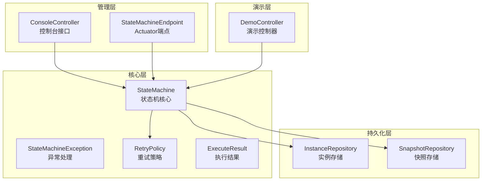
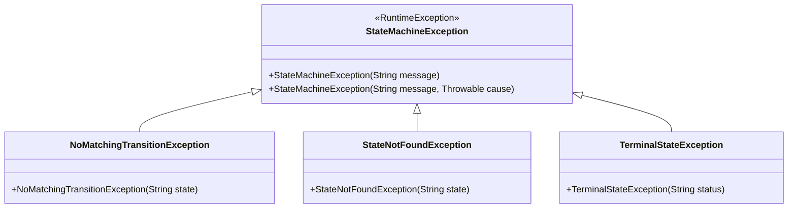
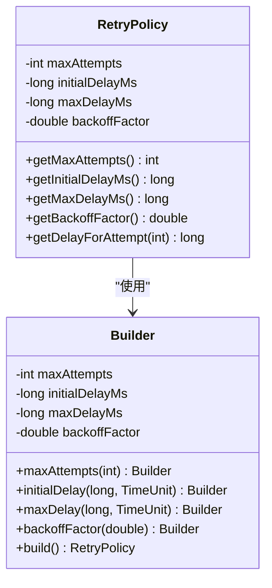
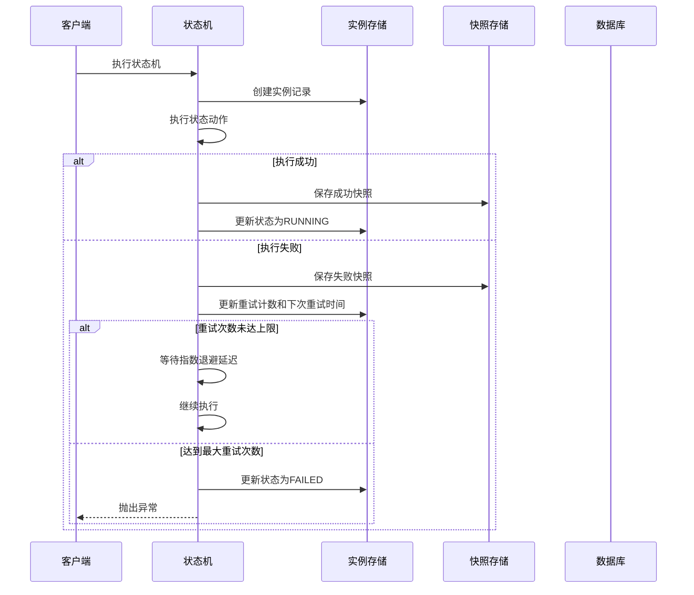
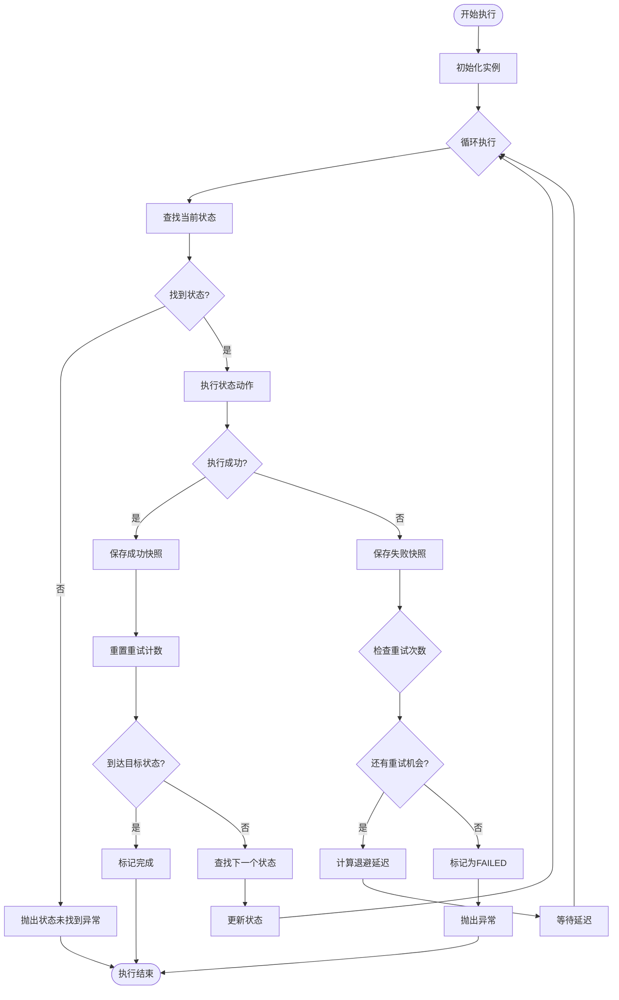
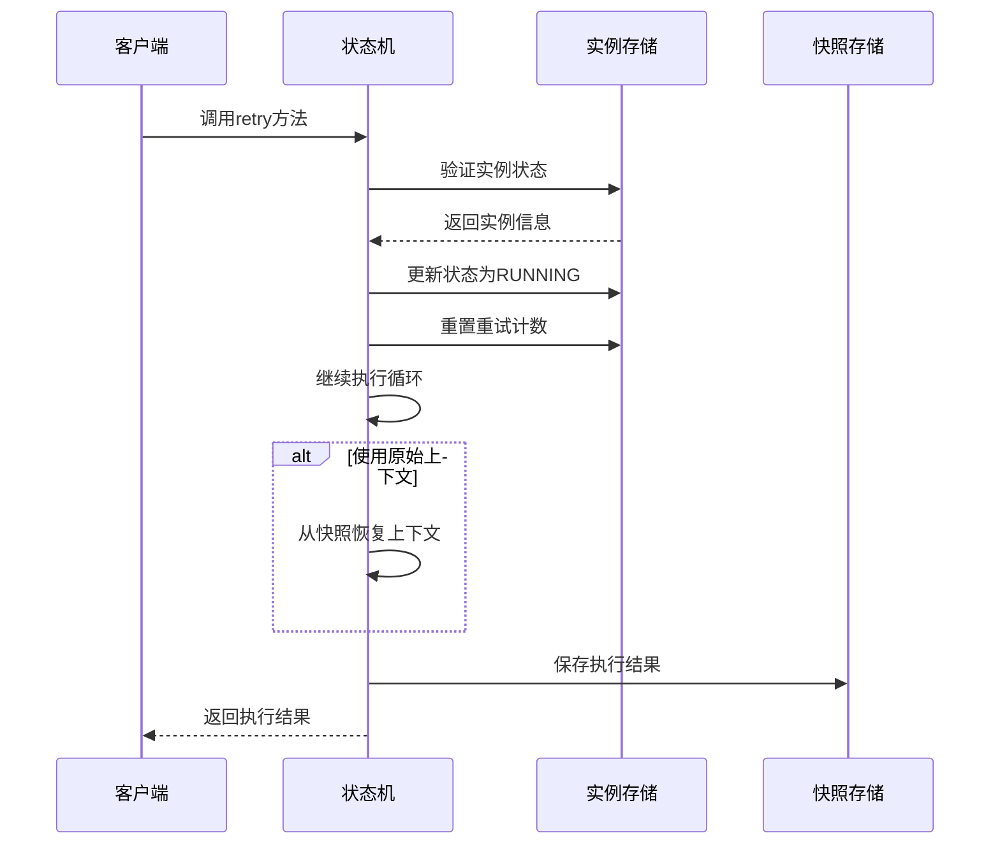
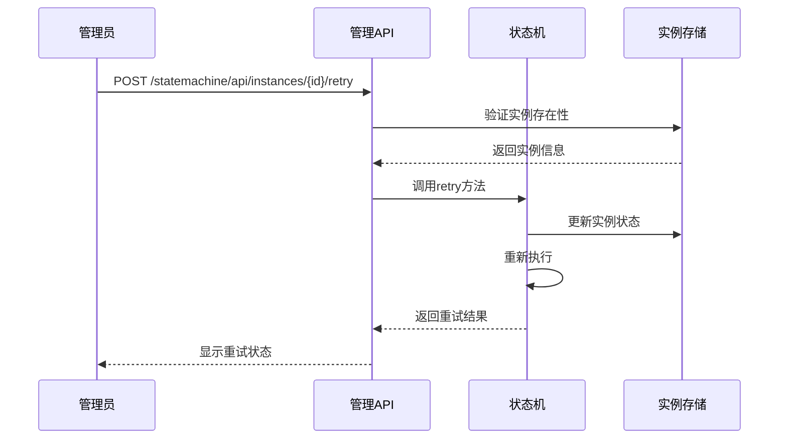
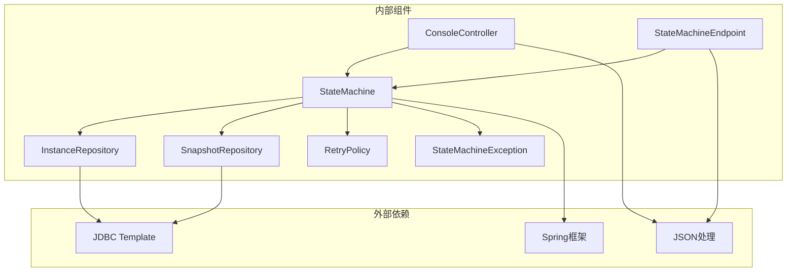
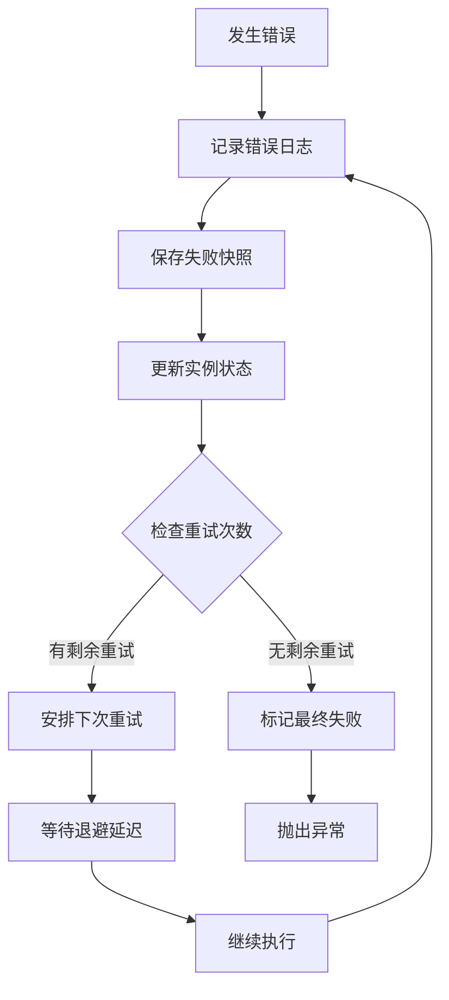

# 故障处理机制

<cite>
**本文档引用的文件**
- [StateMachineException.java](file://src/main/java/cn/chedejun/statemachine/core/StateMachineException.java)
- [RetryPolicy.java](file://src/main/java/cn/chedejun/statemachine/core/RetryPolicy.java)
- [ExecuteResult.java](file://src/main/java/cn/chedejun/statemachine/core/ExecuteResult.java)
- [StateMachine.java](file://src/main/java/cn/chedejun/statemachine/core/StateMachine.java)
- [StateMachineBuilder.java](file://src/main/java/cn/chedejun/statemachine/core/StateMachineBuilder.java)
- [InstanceRepository.java](file://src/main/java/cn/chedejun/statemachine/persistence/InstanceRepository.java)
- [SnapshotRepository.java](file://src/main/java/cn/chedejun/statemachine/persistence/SnapshotRepository.java)
- [ConsoleController.java](file://src/main/java/cn/chedejun/statemachine/management/ConsoleController.java)
- [StateMachineEndpoint.java](file://src/main/java/cn/chedejun/statemachine/management/StateMachineEndpoint.java)
- [DemoController.java](file://demo/src/main/java/cn/chedejun/demo/controller/DemoController.java)
- [RetryPolicyTest.java](file://src/test/java/cn/chedejun/statemachine/core/RetryPolicyTest.java)
- [StateMachineIntegrationTest.java](file://src/test/java/cn/chedejun/statemachine/integration/StateMachineIntegrationTest.java)
- [postgresql.sql](file://src/main/resources/ddl/postgresql.sql)
- [README.md](file://README.md)
</cite>

## 目录
1. [简介](#简介)
2. [项目结构](#项目结构)
3. [核心组件](#核心组件)
4. [架构概览](#架构概览)
5. [详细组件分析](#详细组件分析)
6. [依赖关系分析](#依赖关系分析)
7. [性能考虑](#性能考虑)
8. [故障诊断指南](#故障诊断指南)
9. [结论](#结论)

## 简介

本项目是一个基于Spring Boot的状态机工作流工具，提供了完整的故障处理机制。系统支持条件分支、步骤快照、失败重试（指数退避）和管理控制台等功能。本文档深入解释状态机执行过程中的异常处理流程，包括失败重试、手动重试和故障恢复策略。

## 项目结构

项目采用分层架构设计，主要包含以下模块：

**图表来源**
- [StateMachine.java:11-35](file://src/main/java/cn/chedejun/statemachine/core/StateMachine.java#L11-L35)
- [InstanceRepository.java:11-13](file://src/main/java/cn/chedejun/statemachine/persistence/InstanceRepository.java#L11-L13)
- [SnapshotRepository.java:11-13](file://src/main/java/cn/chedejun/statemachine/persistence/SnapshotRepository.java#L11-L13)

**章节来源**
- [StateMachine.java:1-196](file://src/main/java/cn/chedejun/statemachine/core/StateMachine.java#L1-L196)
- [ConsoleController.java:1-106](file://src/main/java/cn/chedejun/statemachine/management/ConsoleController.java#L1-L106)

## 核心组件

### 异常处理体系

系统定义了专门的状态机异常类，提供精确的错误分类和处理机制：

**图表来源**
- [StateMachineException.java:3-18](file://src/main/java/cn/chedejun/statemachine/core/StateMachineException.java#L3-L18)

### 重试策略系统

系统实现了灵活的指数退避重试机制，支持自定义重试参数：

**图表来源**
- [RetryPolicy.java:5-44](file://src/main/java/cn/chedejun/statemachine/core/RetryPolicy.java#L5-L44)

**章节来源**
- [StateMachineException.java:1-19](file://src/main/java/cn/chedejun/statemachine/core/StateMachineException.java#L1-L19)
- [RetryPolicy.java:1-45](file://src/main/java/cn/chedejun/statemachine/core/RetryPolicy.java#L1-L45)

## 架构概览

系统采用事件驱动的状态机架构，结合数据库持久化实现完整的故障处理机制：

**图表来源**
- [StateMachine.java:83-136](file://src/main/java/cn/chedejun/statemachine/core/StateMachine.java#L83-L136)
- [InstanceRepository.java:15-38](file://src/main/java/cn/chedejun/statemachine/persistence/InstanceRepository.java#L15-L38)
- [SnapshotRepository.java:15-31](file://src/main/java/cn/chedejun/statemachine/persistence/SnapshotRepository.java#L15-L31)

## 详细组件分析

### 状态机执行循环

状态机的核心执行逻辑实现了完整的故障处理流程：

**图表来源**
- [StateMachine.java:83-136](file://src/main/java/cn/chedejun/statemachine/core/StateMachine.java#L83-L136)

### 失败重试机制

系统提供了多种重试方式，支持自动和手动重试：

**图表来源**
- [StateMachine.java:50-79](file://src/main/java/cn/chedejun/statemachine/core/StateMachine.java#L50-L79)

### 手动重试流程

管理员可以通过管理接口进行手动重试操作：

**图表来源**
- [ConsoleController.java:91-104](file://src/main/java/cn/chedejun/statemachine/management/ConsoleController.java#L91-L104)
- [StateMachineEndpoint.java:62-71](file://src/main/java/cn/chedejun/statemachine/management/StateMachineEndpoint.java#L62-L71)

**章节来源**
- [StateMachine.java:40-136](file://src/main/java/cn/chedejun/statemachine/core/StateMachine.java#L40-L136)
- [ConsoleController.java:91-104](file://src/main/java/cn/chedejun/statemachine/management/ConsoleController.java#L91-L104)
- [StateMachineEndpoint.java:62-71](file://src/main/java/cn/chedejun/statemachine/management/StateMachineEndpoint.java#L62-L71)

## 依赖关系分析

系统各组件之间的依赖关系清晰明确：

**图表来源**
- [StateMachine.java:3-25](file://src/main/java/cn/chedejun/statemachine/core/StateMachine.java#L3-L25)
- [InstanceRepository.java:3-13](file://src/main/java/cn/chedejun/statemachine/persistence/InstanceRepository.java#L3-L13)
- [SnapshotRepository.java:3-13](file://src/main/java/cn/chedejun/statemachine/persistence/SnapshotRepository.java#L3-L13)

**章节来源**
- [StateMachine.java:1-196](file://src/main/java/cn/chedejun/statemachine/core/StateMachine.java#L1-L196)
- [postgresql.sql:1-18](file://src/main/resources/ddl/postgresql.sql#L1-L18)

## 性能考虑

系统在设计时充分考虑了性能优化：

### 指数退避算法
- 初始延迟可配置，默认1秒
- 退避因子为2.0，每次重试延迟翻倍
- 最大延迟限制，默认30秒
- 支持禁用重试策略

### 数据库优化
- 使用批量插入减少数据库往返
- 索引优化查询性能
- 连接池管理数据库连接
- 异步快照写入

### 内存管理
- 上下文序列化/反序列化优化
- 快照数据压缩存储
- 实例状态最小化存储

## 故障诊断指南

### 日志记录策略

系统通过多种方式提供详细的故障诊断信息：

**图表来源**
- [StateMachine.java:97-116](file://src/main/java/cn/chedejun/statemachine/core/StateMachine.java#L97-L116)

### 监控指标

系统提供丰富的监控指标供故障诊断：

| 指标类型 | 字段名称 | 描述 | 用途 |
|---------|----------|------|------|
| 实例状态 | status | RUNNING/FAILED/COMPLETED/REACHED | 流程状态监控 |
| 重试信息 | retry_count | 当前重试次数 | 重试策略监控 |
| 错误信息 | error_message | 错误描述 | 故障定位 |
| 时间戳 | created_at/updated_at | 创建和更新时间 | 性能分析 |
| 执行次数 | attempt | 快照执行次数 | 重试效果评估 |

### 常见故障场景及解决方案

#### 场景1：状态未找到异常
**症状**: 执行过程中抛出状态未找到异常
**原因**: 状态机定义中缺少对应状态
**解决方案**: 
1. 检查状态机定义是否完整
2. 验证状态名称拼写
3. 确认状态机版本正确

#### 场景2：无匹配转换异常
**症状**: 状态切换失败
**原因**: 条件表达式不满足或转换定义错误
**解决方案**:
1. 检查条件函数逻辑
2. 验证转换路径完整性
3. 确认上下文数据正确

#### 场景3：重试超限
**症状**: 流程最终标记为FAILED
**原因**: 达到最大重试次数但仍失败
**解决方案**:
1. 分析失败快照中的错误信息
2. 检查外部服务可用性
3. 调整重试策略参数
4. 手动干预修复问题后重试

#### 场景4：数据库连接异常
**症状**: 初始化失败或执行中断
**原因**: 数据库连接配置错误
**解决方案**:
1. 检查数据库连接字符串
2. 验证数据库服务状态
3. 确认权限配置正确

**章节来源**
- [DemoController.java:58-71](file://demo/src/main/java/cn/chedejun/demo/controller/DemoController.java#L58-L71)
- [StateMachineIntegrationTest.java:204-234](file://src/test/java/cn/chedejun/statemachine/integration/StateMachineIntegrationTest.java#L204-L234)

## 结论

本项目的状态机故障处理机制具有以下特点：

1. **完善的异常分类**: 通过专门的异常类提供精确的错误信息
2. **灵活的重试策略**: 支持指数退避、可配置的重试参数
3. **全面的持久化**: 通过数据库记录完整的执行历史
4. **友好的管理界面**: 提供REST API和Web控制台进行故障诊断
5. **强大的监控能力**: 丰富的指标和日志支持故障定位

系统的设计确保了在复杂业务场景下的高可靠性和可维护性，为生产环境的稳定运行提供了有力保障。