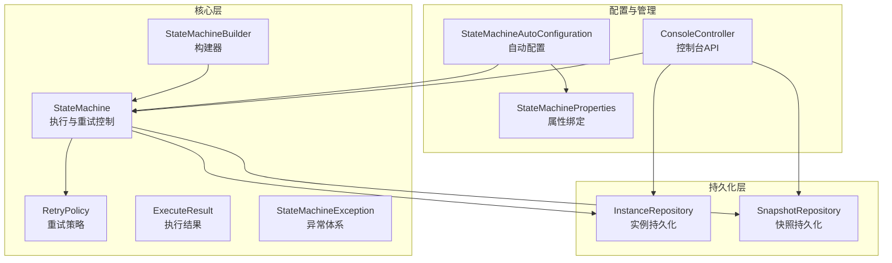
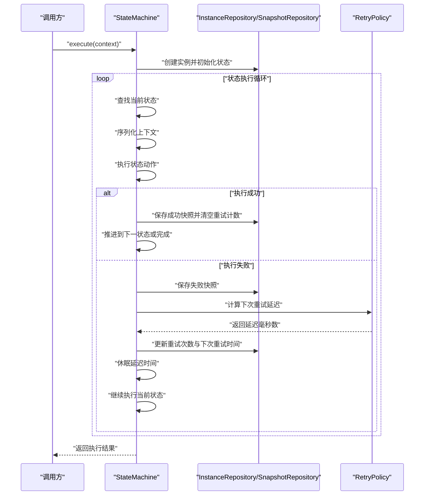
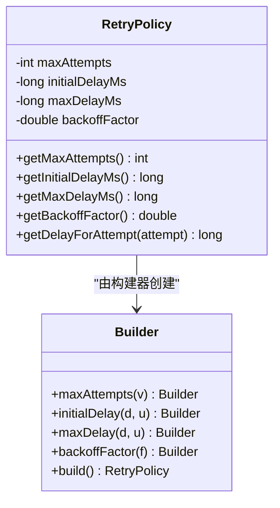
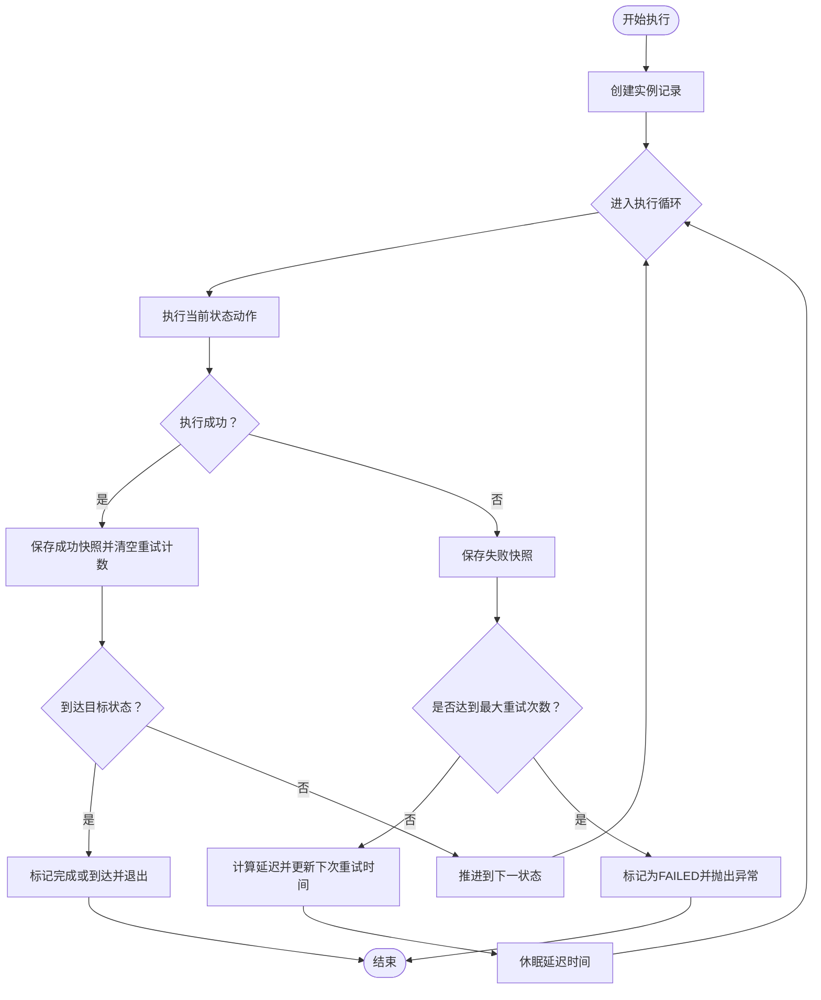
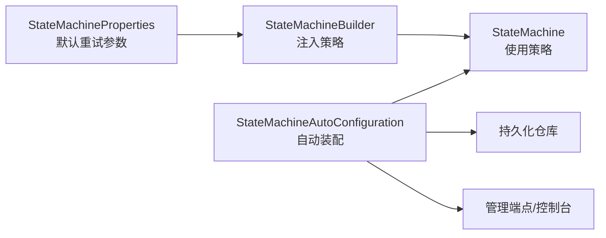
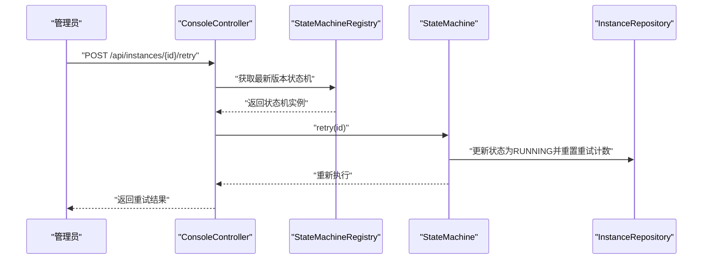
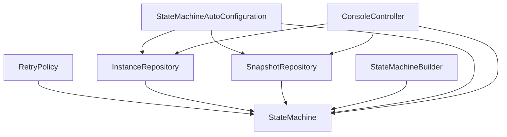

# 重试机制与故障处理

<cite>
**本文档引用的文件**
- [RetryPolicy.java](file://src/main/java/cn/chedejun/statemachine/core/RetryPolicy.java)
- [RetryPolicyTest.java](file://src/test/java/cn/chedejun/statemachine/core/RetryPolicyTest.java)
- [StateMachine.java](file://src/main/java/cn/chedejun/statemachine/core/StateMachine.java)
- [StateMachineBuilder.java](file://src/main/java/cn/chedejun/statemachine/core/StateMachineBuilder.java)
- [StateMachineException.java](file://src/main/java/cn/chedejun/statemachine/core/StateMachineException.java)
- [ExecuteResult.java](file://src/main/java/cn/chedejun/statemachine/core/ExecuteResult.java)
- [StateMachineProperties.java](file://src/main/java/cn/chedejun/statemachine/autoconfigure/StateMachineProperties.java)
- [StateMachineAutoConfiguration.java](file://src/main/java/cn/chedejun/statemachine/autoconfigure/StateMachineAutoConfiguration.java)
- [ConsoleController.java](file://src/main/java/cn/chedejun/statemachine/management/ConsoleController.java)
- [InstanceRepository.java](file://src/main/java/cn/chedejun/statemachine/persistence/InstanceRepository.java)
- [SnapshotRepository.java](file://src/main/java/cn/chedejun/statemachine/persistence/SnapshotRepository.java)
- [README.md](file://README.md)
- [StateMachineIntegrationTest.java](file://src/test/java/cn/chedejun/statemachine/integration/StateMachineIntegrationTest.java)
- [application.yml](file://demo/src/main/resources/application.yml)
</cite>

## 目录
1. [简介](#简介)
2. [项目结构](#项目结构)
3. [核心组件](#核心组件)
4. [架构总览](#架构总览)
5. [详细组件分析](#详细组件分析)
6. [依赖分析](#依赖分析)
7. [性能考虑](#性能考虑)
8. [故障处理最佳实践](#故障处理最佳实践)
9. [监控与日志记录](#监控与日志记录)
10. [结论](#结论)

## 简介
本文件聚焦于状态机的重试机制与故障处理，系统性阐述 RetryPolicy 的设计理念与实现原理，覆盖指数退避策略、固定延迟策略等重试算法，并给出重试配置参数的调优方法。同时提供故障处理的最佳实践，包括失败重试、手动重试与故障恢复策略，并配套监控与日志记录方案，帮助读者在生产环境中安全、可控地使用状态机的重试能力。

## 项目结构
本项目采用分层设计：核心状态机逻辑位于 core 包，自动配置与属性绑定位于 autoconfigure 包，管理端点与控制台位于 management 包，持久化层位于 persistence 包。重试机制贯穿执行流程与持久化层，确保失败可恢复、可追踪。

**图表来源**
- [StateMachine.java:11-196](file://src/main/java/cn/chedejun/statemachine/core/StateMachine.java#L11-L196)
- [RetryPolicy.java:5-45](file://src/main/java/cn/chedejun/statemachine/core/RetryPolicy.java#L5-L45)
- [StateMachineBuilder.java:8-53](file://src/main/java/cn/chedejun/statemachine/core/StateMachineBuilder.java#L8-L53)
- [ExecuteResult.java:14-23](file://src/main/java/cn/chedejun/statemachine/core/ExecuteResult.java#L14-L23)
- [StateMachineException.java:3-19](file://src/main/java/cn/chedejun/statemachine/core/StateMachineException.java#L3-L19)
- [InstanceRepository.java:11-66](file://src/main/java/cn/chedejun/statemachine/persistence/InstanceRepository.java#L11-L66)
- [SnapshotRepository.java:11-55](file://src/main/java/cn/chedejun/statemachine/persistence/SnapshotRepository.java#L11-L55)
- [StateMachineProperties.java:5-35](file://src/main/java/cn/chedejun/statemachine/autoconfigure/StateMachineProperties.java#L5-L35)
- [StateMachineAutoConfiguration.java:22-80](file://src/main/java/cn/chedejun/statemachine/autoconfigure/StateMachineAutoConfiguration.java#L22-L80)
- [ConsoleController.java:15-106](file://src/main/java/cn/chedejun/statemachine/management/ConsoleController.java#L15-L106)

**章节来源**
- [StateMachine.java:11-196](file://src/main/java/cn/chedejun/statemachine/core/StateMachine.java#L11-L196)
- [StateMachineBuilder.java:8-53](file://src/main/java/cn/chedejun/statemachine/core/StateMachineBuilder.java#L8-L53)
- [StateMachineProperties.java:5-35](file://src/main/java/cn/chedejun/statemachine/autoconfigure/StateMachineProperties.java#L5-L35)
- [StateMachineAutoConfiguration.java:22-80](file://src/main/java/cn/chedejun/statemachine/autoconfigure/StateMachineAutoConfiguration.java#L22-L80)
- [ConsoleController.java:15-106](file://src/main/java/cn/chedejun/statemachine/management/ConsoleController.java#L15-L106)
- [InstanceRepository.java:11-66](file://src/main/java/cn/chedejun/statemachine/persistence/InstanceRepository.java#L11-L66)
- [SnapshotRepository.java:11-55](file://src/main/java/cn/chedejun/statemachine/persistence/SnapshotRepository.java#L11-L55)

## 核心组件
- RetryPolicy：定义重试策略，支持指数退避与禁用重试；提供按尝试次数计算延迟的方法。
- StateMachine：状态机执行主体，负责执行状态动作、记录快照、处理异常与重试。
- StateMachineBuilder：状态机构建器，允许注入自定义 RetryPolicy。
- StateMachineProperties：重试默认参数的配置绑定，支持通过配置文件调整默认行为。
- ConsoleController：提供重试接口与实例详情查询，便于人工干预与排障。
- InstanceRepository/SnapshotRepository：持久化实例状态与快照，支撑重试与审计。

**章节来源**
- [RetryPolicy.java:5-45](file://src/main/java/cn/chedejun/statemachine/core/RetryPolicy.java#L5-L45)
- [StateMachine.java:11-196](file://src/main/java/cn/chedejun/statemachine/core/StateMachine.java#L11-L196)
- [StateMachineBuilder.java:8-53](file://src/main/java/cn/chedejun/statemachine/core/StateMachineBuilder.java#L8-L53)
- [StateMachineProperties.java:5-35](file://src/main/java/cn/chedejun/statemachine/autoconfigure/StateMachineProperties.java#L5-L35)
- [ConsoleController.java:15-106](file://src/main/java/cn/chedejun/statemachine/management/ConsoleController.java#L15-L106)
- [InstanceRepository.java:11-66](file://src/main/java/cn/chedejun/statemachine/persistence/InstanceRepository.java#L11-L66)
- [SnapshotRepository.java:11-55](file://src/main/java/cn/chedejun/statemachine/persistence/SnapshotRepository.java#L11-L55)

## 架构总览
下图展示状态机执行与重试的关键交互：状态机在执行过程中捕获异常，根据 RetryPolicy 计算下次重试时间，写入实例表并休眠相应时长后继续执行；成功则清空重试计数并推进状态；失败达到上限则标记为 FAILED 并抛出异常。

**图表来源**
- [StateMachine.java:83-136](file://src/main/java/cn/chedejun/statemachine/core/StateMachine.java#L83-L136)
- [RetryPolicy.java:26-30](file://src/main/java/cn/chedejun/statemachine/core/RetryPolicy.java#L26-L30)
- [InstanceRepository.java:32-38](file://src/main/java/cn/chedejun/statemachine/persistence/InstanceRepository.java#L32-L38)
- [SnapshotRepository.java:15-31](file://src/main/java/cn/chedejun/statemachine/persistence/SnapshotRepository.java#L15-L31)

## 详细组件分析

### RetryPolicy 设计与实现
- 指数退避策略：基于初始延迟与退避因子，按尝试次数计算延迟，上限不超过最大延迟。
- 固定延迟策略：可通过设置退避因子为 1 实现固定延迟。
- 禁用重试：通过 maxAttempts=0 实现无重试。
- 关键方法：
  - 构建器支持设置最大尝试次数、初始延迟、最大延迟与退避因子。
  - getDelayForAttempt(attempt) 返回第 attempt 次重试的延迟，当 attempt<=0 时返回 0。

**图表来源**
- [RetryPolicy.java:5-45](file://src/main/java/cn/chedejun/statemachine/core/RetryPolicy.java#L5-L45)

**章节来源**
- [RetryPolicy.java:5-45](file://src/main/java/cn/chedejun/statemachine/core/RetryPolicy.java#L5-L45)
- [RetryPolicyTest.java:7-35](file://src/test/java/cn/chedejun/statemachine/core/RetryPolicyTest.java#L7-L35)

### StateMachine 执行与重试流程
- 执行入口：execute(...) 创建实例并进入执行循环。
- 执行循环：
  - 序列化上下文，执行状态动作。
  - 成功：保存成功快照并清空重试计数，推进状态。
  - 失败：保存失败快照，检查重试次数；若未达上限，按 RetryPolicy 计算延迟并休眠，然后继续执行当前状态；否则标记为 FAILED 并抛出异常。
- 手动重试：
  - 支持两种方式：传入新上下文重试（retry(id, context)），或从首次快照读取原始上下文重试（retry(id)）。
  - 仅 FAILED 状态的实例允许重试，重试前会将状态重置为 RUNNING 并重置重试计数。

**图表来源**
- [StateMachine.java:83-136](file://src/main/java/cn/chedejun/statemachine/core/StateMachine.java#L83-L136)
- [SnapshotRepository.java:15-31](file://src/main/java/cn/chedejun/statemachine/persistence/SnapshotRepository.java#L15-L31)
- [InstanceRepository.java:28-38](file://src/main/java/cn/chedejun/statemachine/persistence/InstanceRepository.java#L28-L38)

**章节来源**
- [StateMachine.java:40-136](file://src/main/java/cn/chedejun/statemachine/core/StateMachine.java#L40-L136)
- [ExecuteResult.java:14-23](file://src/main/java/cn/chedejun/statemachine/core/ExecuteResult.java#L14-L23)
- [StateMachineException.java:3-19](file://src/main/java/cn/chedejun/statemachine/core/StateMachineException.java#L3-L19)

### 配置与构建
- 默认重试参数：通过 StateMachineProperties 绑定，可在配置文件中设置默认最大尝试次数、初始延迟、最大延迟与退避因子。
- 构建器注入：StateMachineBuilder 提供 retryPolicy(...) 方法注入自定义策略。
- 自动配置：StateMachineAutoConfiguration 在检测到数据源时自动注册状态机、持久化仓库与管理端点。

**图表来源**
- [StateMachineProperties.java:18-31](file://src/main/java/cn/chedejun/statemachine/autoconfigure/StateMachineProperties.java#L18-L31)
- [StateMachineBuilder.java:34-40](file://src/main/java/cn/chedejun/statemachine/core/StateMachineBuilder.java#L34-L40)
- [StateMachineAutoConfiguration.java:26-56](file://src/main/java/cn/chedejun/statemachine/autoconfigure/StateMachineAutoConfiguration.java#L26-L56)

**章节来源**
- [StateMachineProperties.java:5-35](file://src/main/java/cn/chedejun/statemachine/autoconfigure/StateMachineProperties.java#L5-L35)
- [StateMachineBuilder.java:8-53](file://src/main/java/cn/chedejun/statemachine/core/StateMachineBuilder.java#L8-L53)
- [StateMachineAutoConfiguration.java:22-80](file://src/main/java/cn/chedejun/statemachine/autoconfigure/StateMachineAutoConfiguration.java#L22-L80)

### 控制台与管理端点
- 控制台 API：ConsoleController 提供机器列表、版本信息、实例列表、实例详情与重试接口，便于运维人员查看与干预。
- Actuator 端点：在启用管理功能时暴露状态机指标，便于监控。

**图表来源**
- [ConsoleController.java:91-104](file://src/main/java/cn/chedejun/statemachine/management/ConsoleController.java#L91-L104)
- [StateMachine.java:50-79](file://src/main/java/cn/chedejun/statemachine/core/StateMachine.java#L50-L79)
- [InstanceRepository.java:28-38](file://src/main/java/cn/chedejun/statemachine/persistence/InstanceRepository.java#L28-L38)

**章节来源**
- [ConsoleController.java:15-106](file://src/main/java/cn/chedejun/statemachine/management/ConsoleController.java#L15-L106)
- [StateMachineAutoConfiguration.java:58-78](file://src/main/java/cn/chedejun/statemachine/autoconfigure/StateMachineAutoConfiguration.java#L58-L78)

## 依赖分析
- 组件耦合：
  - StateMachine 依赖 RetryPolicy、InstanceRepository、SnapshotRepository 进行执行与持久化。
  - StateMachineBuilder 负责装配 StateMachine 与 RetryPolicy。
  - AutoConfiguration 注入 JdbcTemplate、ObjectMapper、Registry，使状态机具备运行时能力。
  - ConsoleController 依赖 Registry、JdbcTemplate、Repository 提供管理能力。
- 外部依赖：
  - Spring JDBC 用于数据库操作。
  - Spring Boot 自动配置与 Actuator（可选）用于管理端点。

**图表来源**
- [StateMachine.java:11-196](file://src/main/java/cn/chedejun/statemachine/core/StateMachine.java#L11-L196)
- [StateMachineBuilder.java:8-53](file://src/main/java/cn/chedejun/statemachine/core/StateMachineBuilder.java#L8-L53)
- [StateMachineAutoConfiguration.java:22-80](file://src/main/java/cn/chedejun/statemachine/autoconfigure/StateMachineAutoConfiguration.java#L22-L80)
- [ConsoleController.java:15-106](file://src/main/java/cn/chedejun/statemachine/management/ConsoleController.java#L15-L106)

**章节来源**
- [StateMachine.java:11-196](file://src/main/java/cn/chedejun/statemachine/core/StateMachine.java#L11-L196)
- [StateMachineBuilder.java:8-53](file://src/main/java/cn/chedejun/statemachine/core/StateMachineBuilder.java#L8-L53)
- [StateMachineAutoConfiguration.java:22-80](file://src/main/java/cn/chedejun/statemachine/autoconfigure/StateMachineAutoConfiguration.java#L22-L80)
- [ConsoleController.java:15-106](file://src/main/java/cn/chedejun/statemachine/management/ConsoleController.java#L15-L106)

## 性能考虑
- 指数退避的延迟增长可能带来较长的恢复时间，应结合业务 SLA 选择合适的初始延迟与最大延迟。
- 重试次数过多可能导致数据库压力增大，建议配合限流与告警策略。
- 快照与实例表的写入频率较高，需关注数据库索引与批量写入策略。
- 对于高并发场景，建议将重试调度与外部依赖解耦，避免阻塞主线程。

## 故障处理最佳实践
- 失败重试
  - 使用 StateMachine.retry(id, context) 传入新上下文进行重试，适用于上下文已更新或修复了临时问题的情况。
  - 使用 StateMachine.retry(id) 从首次快照读取原始上下文重试，适用于希望完全重放历史流程的场景。
- 手动重试
  - 通过 ConsoleController 的 /api/instances/{id}/retry 接口触发重试，适合运维人员介入处理。
- 故障恢复策略
  - 将 FAILED 实例状态重置为 RUNNING 并重置重试计数后，状态机将继续执行当前状态，直至成功或再次达到最大重试次数。
  - 对于幂等性不足的动作，应在状态动作中实现补偿或去重逻辑，避免重复执行造成副作用。
- 配置调优
  - 初始延迟：根据外部服务响应时间与抖动设定，避免过小导致雪崩。
  - 最大延迟：限制最长等待时间，防止长时间占用资源。
  - 退避因子：指数退避适合突发故障，固定延迟适合稳定环境。
  - 最大尝试次数：结合 SLA 与成本评估，避免无限重试。

**章节来源**
- [StateMachine.java:50-79](file://src/main/java/cn/chedejun/statemachine/core/StateMachine.java#L50-L79)
- [ConsoleController.java:91-104](file://src/main/java/cn/chedejun/statemachine/management/ConsoleController.java#L91-L104)
- [StateMachineProperties.java:18-31](file://src/main/java/cn/chedejun/statemachine/autoconfigure/StateMachineProperties.java#L18-L31)

## 监控与日志记录
- 快照与实例追踪
  - 每次状态执行都会生成快照记录，包含输入、输出、状态、错误信息与尝试次数，便于回溯与审计。
  - 实例表记录当前状态、重试次数与下次重试时间，支持控制台与管理端点查询。
- 控制台与端点
  - 控制台页面展示实例列表、版本信息与执行详情，支持按状态筛选与分页。
  - Actuator 端点暴露状态机指标，便于集成监控系统。
- 日志建议
  - 在状态动作执行前后记录关键事件与耗时，便于定位瓶颈。
  - 对重试触发与延迟计算进行日志记录，便于事后分析。
  - 对 FAILED 状态与异常堆栈进行集中采集与告警。

**章节来源**
- [SnapshotRepository.java:15-55](file://src/main/java/cn/chedejun/statemachine/persistence/SnapshotRepository.java#L15-L55)
- [InstanceRepository.java:28-66](file://src/main/java/cn/chedejun/statemachine/persistence/InstanceRepository.java#L28-L66)
- [ConsoleController.java:34-104](file://src/main/java/cn/chedejun/statemachine/management/ConsoleController.java#L34-L104)
- [StateMachineAutoConfiguration.java:58-78](file://src/main/java/cn/chedejun/statemachine/autoconfigure/StateMachineAutoConfiguration.java#L58-L78)

## 结论
本项目以 RetryPolicy 为核心，结合状态机执行循环与持久化层，提供了可靠且可配置的重试机制。通过指数退避与固定延迟策略，配合完善的监控与管理端点，能够在复杂业务场景中实现高可用的状态流转。建议在生产环境中结合业务特性合理配置重试参数，并建立完善的日志与告警体系，确保系统的稳定性与可观测性。