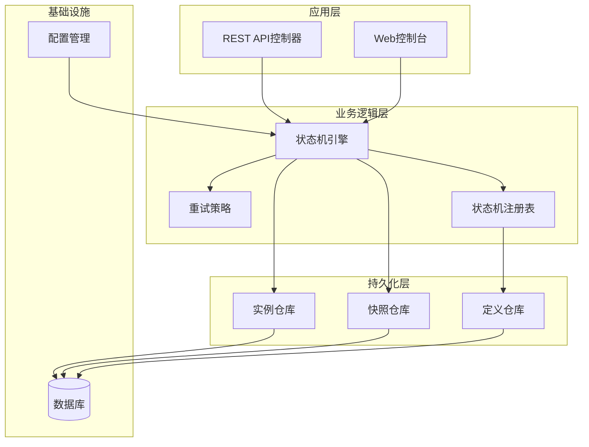
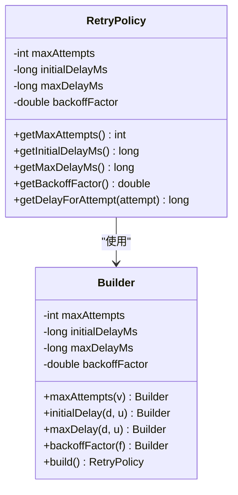
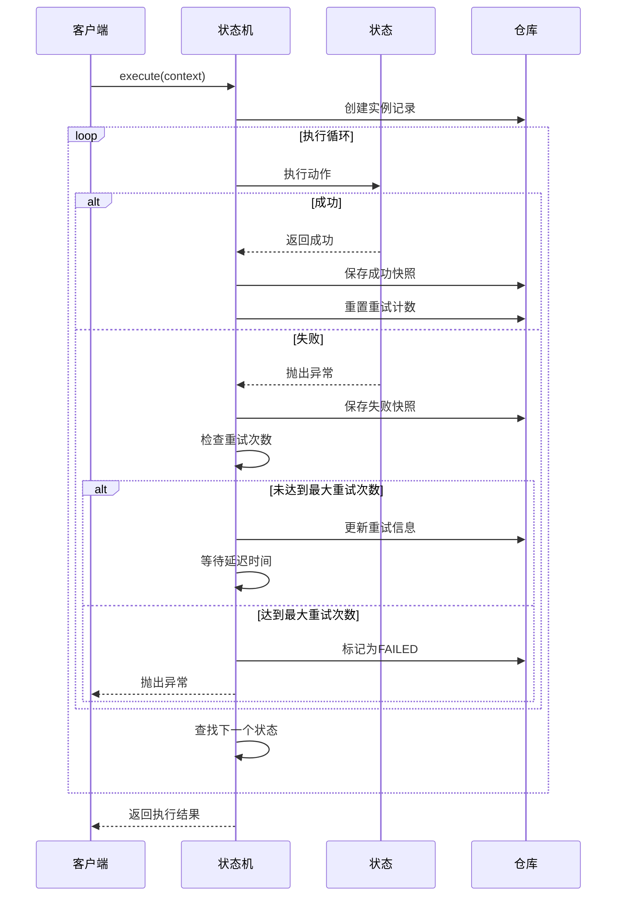
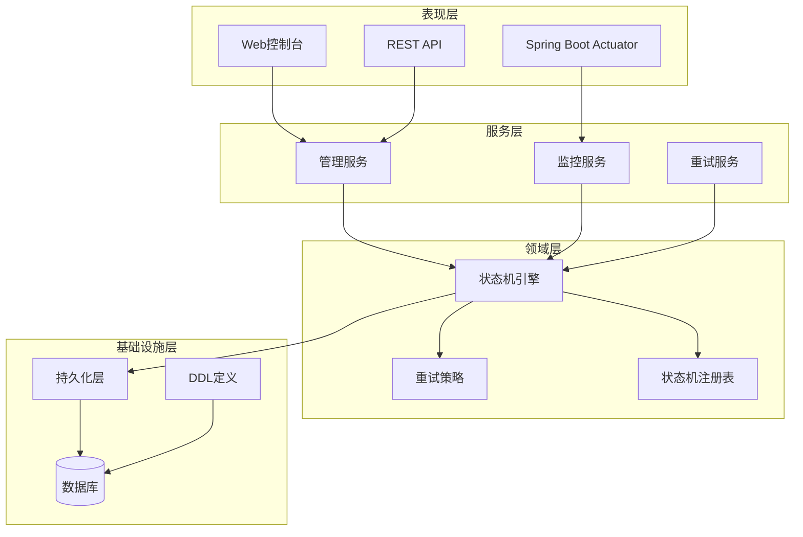
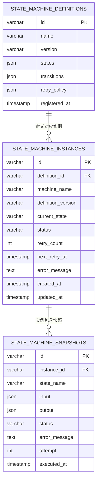
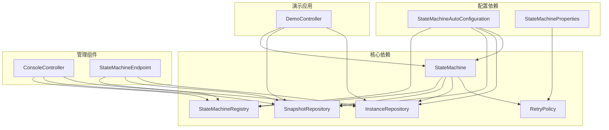
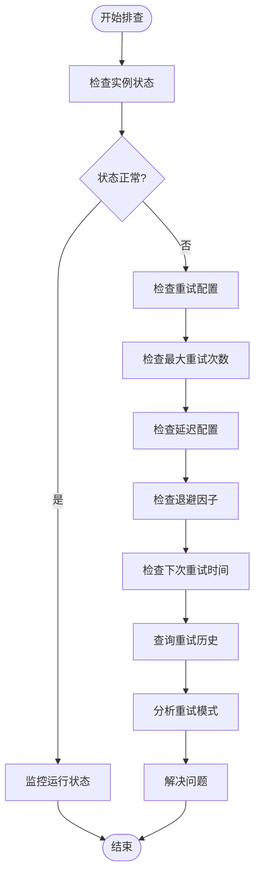

# 重试监控与日志

<cite>
**本文档引用的文件**
- [RetryPolicy.java](file://src/main/java/cn/chedejun/statemachine/core/RetryPolicy.java)
- [StateMachine.java](file://src/main/java/cn/chedejun/statemachine/core/StateMachine.java)
- [ExecuteResult.java](file://src/main/java/cn/chedejun/statemachine/core/ExecuteResult.java)
- [SnapshotRepository.java](file://src/main/java/cn/chedejun/statemachine/persistence/SnapshotRepository.java)
- [InstanceRepository.java](file://src/main/java/cn/chedejun/statemachine/persistence/InstanceRepository.java)
- [ConsoleController.java](file://src/main/java/cn/chedejun/statemachine/management/ConsoleController.java)
- [StateMachineEndpoint.java](file://src/main/java/cn/chedejun/statemachine/management/StateMachineEndpoint.java)
- [StateMachineRegistry.java](file://src/main/java/cn/chedejun/statemachine/core/StateMachineRegistry.java)
- [mysql.sql](file://src/main/resources/ddl/mysql.sql)
- [DemoController.java](file://demo/src/main/java/cn/chedejun/demo/controller/DemoController.java)
- [application.yml](file://demo/src/main/resources/application.yml)
- [StateMachineAutoConfiguration.java](file://src/main/java/cn/chedejun/statemachine/autoconfigure/StateMachineAutoConfiguration.java)
- [StateMachineProperties.java](file://src/main/java/cn/chedejun/statemachine/autoconfigure/StateMachineProperties.java)
- [RetryPolicyTest.java](file://src/test/java/cn/chedejun/statemachine/core/RetryPolicyTest.java)
</cite>

## 目录
1. [简介](#简介)
2. [项目结构](#项目结构)
3. [核心组件](#核心组件)
4. [架构概览](#架构概览)
5. [详细组件分析](#详细组件分析)
6. [依赖关系分析](#依赖关系分析)
7. [性能考虑](#性能考虑)
8. [故障排查指南](#故障排查指南)
9. [结论](#结论)

## 简介

本项目提供了一个完整的企业级状态机重试监控与日志解决方案。通过指数退避算法、详细的执行快照记录和丰富的管理接口，实现了对状态机执行过程的全面监控和故障诊断能力。

系统采用Spring Boot自动配置机制，支持多种数据库后端，提供了RESTful API和Web控制台两种管理界面，能够满足不同场景下的监控需求。

## 项目结构

项目采用分层架构设计，主要包含以下核心模块：

**图表来源**
- [StateMachineAutoConfiguration.java:22-80](file://src/main/java/cn/chedejun/statemachine/autoconfigure/StateMachineAutoConfiguration.java#L22-L80)
- [StateMachine.java:11-35](file://src/main/java/cn/chedejun/statemachine/core/StateMachine.java#L11-L35)

**章节来源**
- [StateMachineAutoConfiguration.java:22-80](file://src/main/java/cn/chedejun/statemachine/autoconfigure/StateMachineAutoConfiguration.java#L22-L80)
- [StateMachine.java:11-35](file://src/main/java/cn/chedejun/statemachine/core/StateMachine.java#L11-L35)

## 核心组件

### 重试策略引擎

重试策略采用指数退避算法，支持可配置的最大重试次数、初始延迟时间和最大延迟时间。

**图表来源**
- [RetryPolicy.java:5-44](file://src/main/java/cn/chedejun/statemachine/core/RetryPolicy.java#L5-L44)

### 状态机执行引擎

状态机执行引擎负责协调整个执行流程，包括状态转换、重试管理和错误处理。

**图表来源**
- [StateMachine.java:83-136](file://src/main/java/cn/chedejun/statemachine/core/StateMachine.java#L83-L136)

**章节来源**
- [RetryPolicy.java:5-44](file://src/main/java/cn/chedejun/statemachine/core/RetryPolicy.java#L5-L44)
- [StateMachine.java:83-136](file://src/main/java/cn/chedejun/statemachine/core/StateMachine.java#L83-L136)

## 架构概览

系统采用分层架构，各层职责清晰分离：

**图表来源**
- [StateMachineAutoConfiguration.java:22-80](file://src/main/java/cn/chedejun/statemachine/autoconfigure/StateMachineAutoConfiguration.java#L22-L80)
- [ConsoleController.java:15-32](file://src/main/java/cn/chedejun/statemachine/management/ConsoleController.java#L15-L32)

## 详细组件分析

### 数据模型与持久化

系统使用三张核心表来存储状态机的执行数据：

**图表来源**
- [mysql.sql:1-18](file://src/main/resources/ddl/mysql.sql#L1-L18)

### 重试监控指标体系

系统提供了多层次的监控指标：

#### 实例级指标
- **运行中实例数**: `countByMachineNameAndStatus(name, "RUNNING")`
- **失败实例数**: `countByMachineNameAndStatus(name, "FAILED")`
- **重试次数**: `instance.retryCount`
- **下次重试时间**: `instance.nextRetryAt`

#### 快照级指标
- **执行状态**: SUCCESS/FAILED
- **重试尝试次数**: `snapshot.attempt`
- **错误信息**: `snapshot.errorMessage`
- **执行时间**: `snapshot.executedAt`

#### 统计分析指标
- **成功率**: 成功快照数 / 总快照数
- **平均重试次数**: 总重试次数 / 失败实例数
- **重试延迟分布**: 不同尝试次数的平均延迟

**章节来源**
- [InstanceRepository.java:44-47](file://src/main/java/cn/chedejun/statemachine/persistence/InstanceRepository.java#L44-L47)
- [SnapshotRepository.java:52-53](file://src/main/java/cn/chedejun/statemachine/persistence/SnapshotRepository.java#L52-L53)

### 日志记录规范

系统采用结构化的日志记录格式，确保重试过程的完整可追溯性：

#### 快照记录字段
| 字段名 | 类型 | 描述 | 示例 |
|--------|------|------|------|
| id | String | 快照唯一标识 | "a1b2c3d4-e5f6-7890-abcd-ef1234567890" |
| instance_id | String | 关联实例ID | 同上 |
| state_name | String | 执行状态名称 | "check-inventory" |
| input | JSON | 输入上下文 | {"orderId":"123","amount":99.99} |
| output | JSON | 输出上下文 | 同上 |
| status | String | 执行状态 | "SUCCESS"或"FAILED" |
| error_message | String | 错误信息 | "数据库连接超时" |
| attempt | Integer | 第几次重试 | 1, 2, 3... |
| executed_at | Timestamp | 执行时间戳 | "2024-01-01T10:00:00Z" |

#### 重试日志格式
每次重试都会生成标准格式的快照记录，包含以下关键信息：
- **时间戳**: 精确到毫秒的执行时间
- **实例标识**: 唯一实例ID便于追踪
- **状态信息**: 当前执行状态和目标状态
- **重试信息**: 当前尝试次数和最大重试限制
- **错误信息**: 失败原因和堆栈跟踪
- **上下文数据**: 输入输出JSON序列化内容

**章节来源**
- [SnapshotRepository.java:15-31](file://src/main/java/cn/chedejun/statemachine/persistence/SnapshotRepository.java#L15-L31)
- [StateMachine.java:99-102](file://src/main/java/cn/chedejun/statemachine/core/StateMachine.java#L99-L102)

### 重试统计分析

系统提供了多种统计分析方法：

#### 实时监控
- **状态分布**: 按状态分类的实例数量统计
- **重试趋势**: 不同时段的重试次数变化
- **错误类型**: 不同错误类型的频率统计

#### 历史数据分析
- **重试成功率**: 历史重试的成功率趋势
- **平均恢复时间**: 从失败到成功的平均时间
- **重试模式识别**: 自动识别异常重试模式

#### 性能指标计算
- **吞吐量**: 单位时间内完成的执行数量
- **延迟分布**: 各阶段的执行时间分布
- **资源利用率**: 数据库连接和CPU使用情况

**章节来源**
- [ConsoleController.java:34-43](file://src/main/java/cn/chedejun/statemachine/management/ConsoleController.java#L34-L43)
- [StateMachineEndpoint.java:32-43](file://src/main/java/cn/chedejun/statemachine/management/StateMachineEndpoint.java#L32-L43)

## 依赖关系分析

系统各组件之间的依赖关系如下：

**图表来源**
- [StateMachine.java:11-35](file://src/main/java/cn/chedejun/statemachine/core/StateMachine.java#L11-L35)
- [ConsoleController.java:23-32](file://src/main/java/cn/chedejun/statemachine/management/ConsoleController.java#L23-L32)
- [StateMachineEndpoint.java:16-30](file://src/main/java/cn/chedejun/statemachine/management/StateMachineEndpoint.java#L16-L30)

**章节来源**
- [StateMachine.java:11-35](file://src/main/java/cn/chedejun/statemachine/core/StateMachine.java#L11-L35)
- [ConsoleController.java:23-32](file://src/main/java/cn/chedejun/statemachine/management/ConsoleController.java#L23-L32)
- [StateMachineEndpoint.java:16-30](file://src/main/java/cn/chedejun/statemachine/management/StateMachineEndpoint.java#L16-L30)

## 性能考虑

### 重试策略优化

系统提供了灵活的重试策略配置：

#### 指数退避参数
- **最大重试次数**: 防止无限重试导致资源耗尽
- **初始延迟**: 避免频繁重试造成雪崩效应
- **最大延迟**: 控制最长等待时间
- **退避因子**: 调节延迟增长速度

#### 内存管理
- **流式处理**: 对大量快照数据采用流式处理避免内存溢出
- **分页查询**: 支持大数据量的分页查询
- **缓存策略**: 对常用状态机定义进行缓存

### 数据库性能优化

#### 索引设计
- **实例表索引**: 按状态、创建时间建立复合索引
- **快照表索引**: 按实例ID、执行时间建立索引
- **定义表索引**: 按名称、版本建立唯一索引

#### 查询优化
- **批量操作**: 支持批量插入和更新操作
- **条件过滤**: 提供多维度的查询过滤条件
- **结果集限制**: 默认限制返回结果数量防止性能问题

## 故障排查指南

### 重试历史查询

#### 实时状态查询
通过管理API可以实时查看状态机实例的当前状态：

**图表来源**
- [ConsoleController.java:62-76](file://src/main/java/cn/chedejun/statemachine/management/ConsoleController.java#L62-L76)
- [StateMachineEndpoint.java:62-71](file://src/main/java/cn/chedejun/statemachine/management/StateMachineEndpoint.java#L62-L71)

#### 详细实例分析
通过实例详情接口可以获取更详细的执行信息：

**章节来源**
- [ConsoleController.java:78-89](file://src/main/java/cn/chedejun/statemachine/management/ConsoleController.java#L78-L89)

### 性能分析工具

#### 监控指标收集
系统提供了多种监控指标的收集方法：

| 指标类型 | 收集方法 | 分析用途 |
|----------|----------|----------|
| 实例状态 | `countByMachineNameAndStatus` | 监控系统健康状况 |
| 重试次数 | `instance.retryCount` | 分析重试行为模式 |
| 执行时间 | `snapshot.executedAt` | 评估性能瓶颈 |
| 错误类型 | `snapshot.errorMessage` | 识别常见问题 |

#### 可视化方案
建议使用以下可视化方式展示监控数据：

1. **实时仪表板**: 显示当前运行状态和关键指标
2. **趋势图表**: 展示重试次数和成功率的时间趋势
3. **热力图**: 显示不同时间段的重试密度
4. **告警面板**: 对异常情况进行实时告警

### 故障诊断步骤

#### 常见问题诊断
1. **重试次数过多**: 检查网络连接和外部服务可用性
2. **重试延迟过大**: 分析数据库性能和索引配置
3. **状态卡死**: 检查状态转换条件和业务逻辑
4. **内存泄漏**: 监控实例数量和快照增长趋势

#### 调试技巧
- **启用详细日志**: 在开发环境启用DEBUG级别日志
- **模拟重试场景**: 使用测试用例验证重试逻辑
- **压力测试**: 模拟高并发场景下的重试行为
- **性能剖析**: 分析慢查询和性能瓶颈

**章节来源**
- [DemoController.java:162-167](file://demo/src/main/java/cn/chedejun/demo/controller/DemoController.java#L162-L167)
- [application.yml:11-23](file://demo/src/main/resources/application.yml#L11-L23)

## 结论

本项目提供了一套完整的状态机重试监控与日志解决方案，具有以下特点：

### 技术优势
- **完整的重试机制**: 支持指数退避算法和灵活的配置选项
- **全面的监控覆盖**: 从实例级到快照级的多维度监控
- **友好的管理界面**: 提供REST API和Web控制台两种管理方式
- **可扩展的架构**: 支持多种数据库后端和自定义扩展

### 应用价值
- **提高系统可靠性**: 通过智能重试机制提升系统稳定性
- **增强可观测性**: 详细的日志记录和监控指标便于问题诊断
- **降低运维成本**: 自动化的重试管理和可视化监控减少人工干预
- **支持业务发展**: 灵活的配置和扩展能力适应业务变化

### 最佳实践建议
1. **合理配置重试策略**: 根据业务特点调整重试参数
2. **建立监控告警**: 设置关键指标的告警阈值
3. **定期分析日志**: 通过日志分析发现潜在问题
4. **持续优化性能**: 基于监控数据持续改进系统性能

通过这套完整的监控与日志体系，用户可以有效地管理和优化状态机的运行，确保系统的稳定性和可靠性。