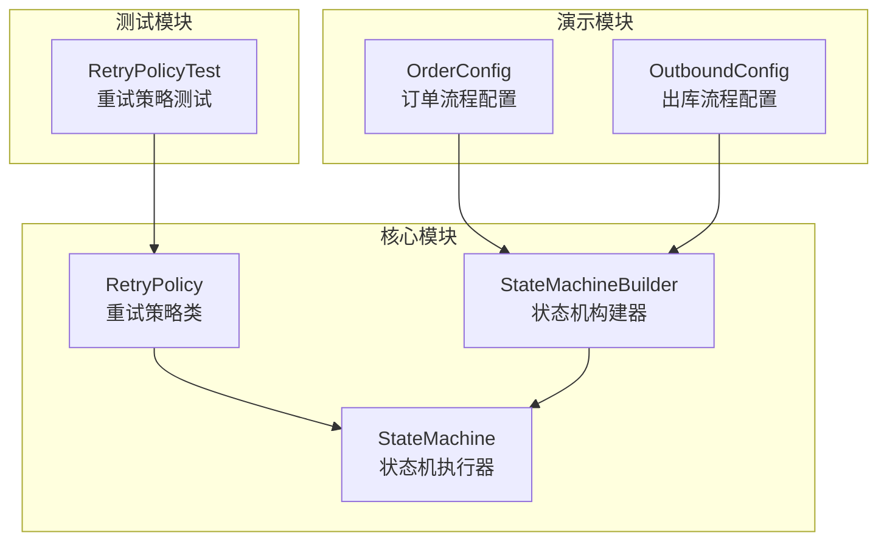
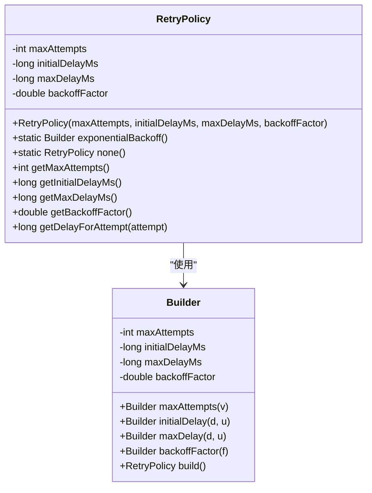
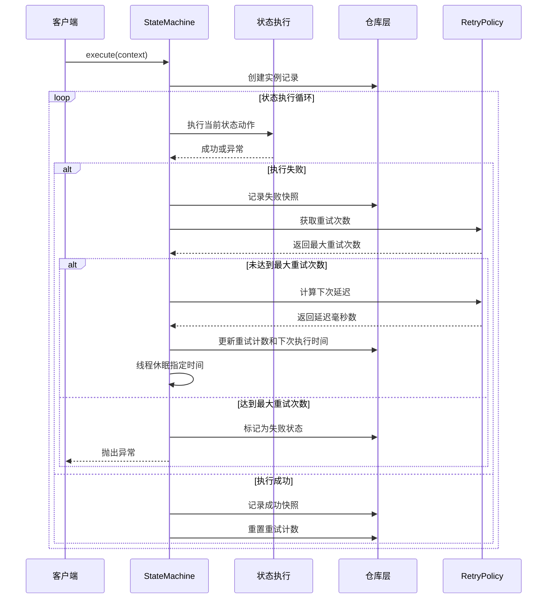
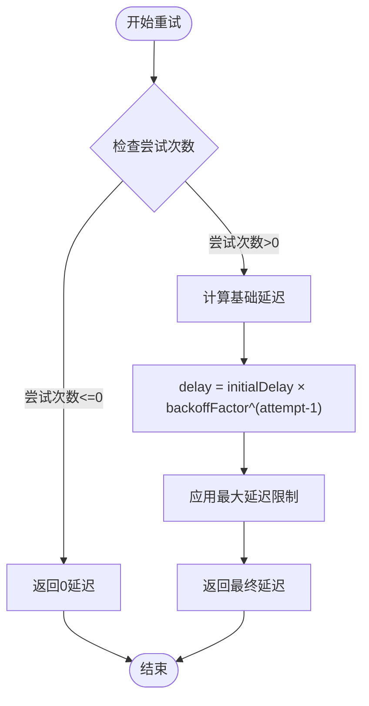
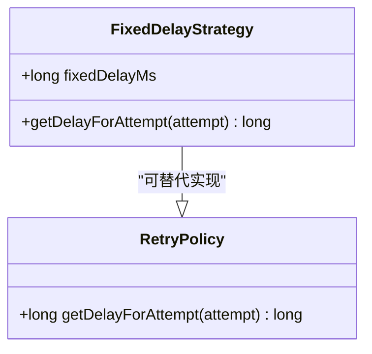
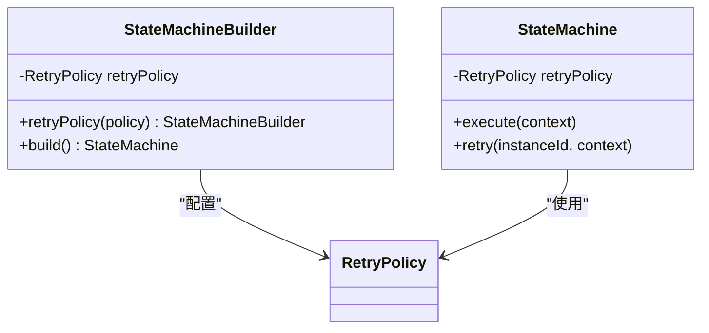
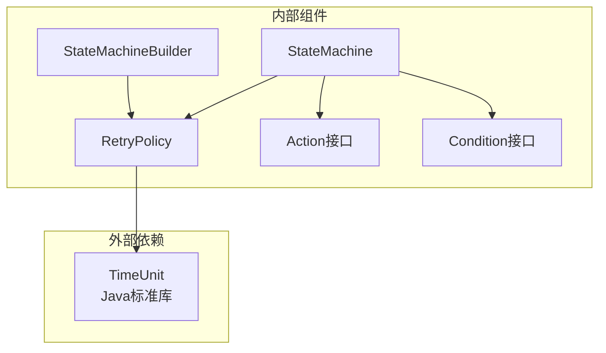

# 重试策略类型

<cite>
**本文档引用的文件**
- [RetryPolicy.java](file://src/main/java/cn/chedejun/statemachine/core/RetryPolicy.java)
- [StateMachine.java](file://src/main/java/cn/chedejun/statemachine/core/StateMachine.java)
- [StateMachineBuilder.java](file://src/main/java/cn/chedejun/statemachine/core/StateMachineBuilder.java)
- [RetryPolicyTest.java](file://src/test/java/cn/chedejun/statemachine/core/RetryPolicyTest.java)
- [OrderConfig.java](file://demo/src/main/java/cn/chedejun/demo/config/OrderConfig.java)
- [OutboundConfig.java](file://demo/src/main/java/cn/chedejun/demo/config/OutboundConfig.java)
- [README.md](file://README.md)
</cite>

## 目录
1. [简介](#简介)
2. [项目结构](#项目结构)
3. [核心组件](#核心组件)
4. [架构概览](#架构概览)
5. [详细组件分析](#详细组件分析)
6. [依赖关系分析](#依赖关系分析)
7. [性能考虑](#性能考虑)
8. [故障排除指南](#故障排除指南)
9. [结论](#结论)

## 简介

本文件详细阐述了状态机框架中的重试策略类型，重点分析指数退避策略(exponentialBackoff)的数学原理和实现细节，包括backoffFactor的作用机制。同时说明固定延迟策略(fixedDelay)的特性，并提供各种策略的适用场景和性能对比。文档还包含Builder模式的使用方法和配置参数的详细说明。

## 项目结构

状态机重试策略位于核心模块中，与状态机执行逻辑紧密集成：



**图表来源**
- [RetryPolicy.java:1-45](file://src/main/java/cn/chedejun/statemachine/core/RetryPolicy.java#L1-L45)
- [StateMachineBuilder.java:1-53](file://src/main/java/cn/chedejun/statemachine/core/StateMachineBuilder.java#L1-L53)
- [StateMachine.java:1-196](file://src/main/java/cn/chedejun/statemachine/core/StateMachine.java#L1-L196)

**章节来源**
- [RetryPolicy.java:1-45](file://src/main/java/cn/chedejun/statemachine/core/RetryPolicy.java#L1-L45)
- [StateMachineBuilder.java:1-53](file://src/main/java/cn/chedejun/statemachine/core/StateMachineBuilder.java#L1-L53)
- [StateMachine.java:1-196](file://src/main/java/cn/chedejun/statemachine/core/StateMachine.java#L1-L196)

## 核心组件

### RetryPolicy类结构

RetryPolicy是重试策略的核心实现，采用不可变设计模式，确保线程安全和配置一致性：



**图表来源**
- [RetryPolicy.java:5-44](file://src/main/java/cn/chedejun/statemachine/core/RetryPolicy.java#L5-L44)

### 关键属性说明

| 属性名 | 类型 | 默认值 | 描述 |
|--------|------|--------|------|
| maxAttempts | int | 3 | 最大重试次数 |
| initialDelayMs | long | 1000 | 初始延迟毫秒数 |
| maxDelayMs | long | 30000 | 最大延迟毫秒数 |
| backoffFactor | double | 2.0 | 指数退避因子 |

**章节来源**
- [RetryPolicy.java:6-24](file://src/main/java/cn/chedejun/statemachine/core/RetryPolicy.java#L6-L24)

## 架构概览

重试策略在状态机执行流程中的作用机制：



**图表来源**
- [StateMachine.java:83-136](file://src/main/java/cn/chedejun/statemachine/core/StateMachine.java#L83-L136)
- [RetryPolicy.java:26-30](file://src/main/java/cn/chedejun/statemachine/core/RetryPolicy.java#L26-L30)

## 详细组件分析

### 指数退避策略(mathematical原理)

指数退避策略基于数学公式：`delay = initialDelay × backoffFactor^(attempt-1)`

#### 数学模型详解



**图表来源**
- [RetryPolicy.java:26-30](file://src/main/java/cn/chedejun/statemachine/core/RetryPolicy.java#L26-L30)

#### backoffFactor作用机制

backoffFactor决定了重试间隔的增长速度：
- **backoffFactor = 2.0**：每次重试间隔翻倍
- **backoffFactor = 3.0**：每次重试间隔乘以3
- **backoffFactor = 1.5**：每次重试间隔增加50%

#### 实现细节分析

1. **零次重试处理**：当attempt ≤ 0时直接返回0延迟
2. **指数计算**：使用Math.pow进行指数运算
3. **上限控制**：通过Math.min确保不超过maxDelayMs
4. **精度处理**：结果转换为long类型，可能丢失小数部分

**章节来源**
- [RetryPolicy.java:26-30](file://src/main/java/cn/chedejun/statemachine/core/RetryPolicy.java#L26-L30)
- [RetryPolicyTest.java:13-21](file://src/test/java/cn/chedejun/statemachine/core/RetryPolicyTest.java#L13-L21)

### 固定延迟策略(Fixed Delay)

虽然代码中没有显式的fixedDelay方法，但可以通过以下方式实现固定延迟策略：



**实现要点**：
- 使用固定的backoffFactor = 1.0
- 或者直接设置maxDelay = initialDelay

### None策略

none()方法提供了禁用重试的功能：
- maxAttempts = 0
- 任何失败都立即停止重试

**章节来源**
- [RetryPolicy.java:19](file://src/main/java/cn/chedejun/statemachine/core/RetryPolicy.java#L19)
- [RetryPolicyTest.java:9-11](file://src/test/java/cn/chedejun/statemachine/core/RetryPolicyTest.java#L9-L11)

### Builder模式使用方法

Builder模式提供了流畅的配置接口：

#### 基本配置流程


**图表来源**
- [RetryPolicy.java:32-43](file://src/main/java/cn/chedejun/statemachine/core/RetryPolicy.java#L32-L43)

#### 配置参数详细说明

| 方法 | 参数类型 | 默认值 | 说明 |
|------|----------|--------|------|
| maxAttempts | int | 3 | 最大重试次数，0表示禁用重试 |
| initialDelay | long, TimeUnit | 1000ms | 初始延迟时间 |
| maxDelay | long, TimeUnit | 30000ms | 最大延迟时间 |
| backoffFactor | double | 2.0 | 指数退避因子 |

**章节来源**
- [RetryPolicy.java:38-42](file://src/main/java/cn/chedejun/statemachine/core/RetryPolicy.java#L38-L42)

### 在状态机中的集成

#### 状态机构建器集成



**图表来源**
- [StateMachineBuilder.java:13](file://src/main/java/cn/chedejun/statemachine/core/StateMachineBuilder.java#L13)
- [StateMachineBuilder.java:34](file://src/main/java/cn/chedejun/statemachine/core/StateMachineBuilder.java#L34)

#### 演示配置示例

在实际应用中，重试策略通常这样配置：

**章节来源**
- [OrderConfig.java:40-44](file://demo/src/main/java/cn/chedejun/demo/config/OrderConfig.java#L40-L44)
- [OutboundConfig.java:52-56](file://demo/src/main/java/cn/chedejun/demo/config/OutboundConfig.java#L52-L56)

## 依赖关系分析

### 组件耦合度分析



**图表来源**
- [RetryPolicy.java:3](file://src/main/java/cn/chedejun/statemachine/core/RetryPolicy.java#L3)
- [StateMachineBuilder.java:3](file://src/main/java/cn/chedejun/statemachine/core/StateMachineBuilder.java#L3)
- [StateMachine.java:3](file://src/main/java/cn/chedejun/statemachine/core/StateMachine.java#L3)

### 关键依赖关系

1. **RetryPolicy与TimeUnit**：用于时间单位转换
2. **StateMachineBuilder与RetryPolicy**：配置阶段依赖
3. **StateMachine与RetryPolicy**：运行时依赖
4. **StateMachine与Action/Condition**：状态执行依赖

**章节来源**
- [RetryPolicy.java:3](file://src/main/java/cn/chedejun/statemachine/core/RetryPolicy.java#L3)
- [StateMachineBuilder.java:3](file://src/main/java/cn/chedejun/statemachine/core/StateMachineBuilder.java#L3)
- [StateMachine.java:3](file://src/main/java/cn/chedejun/statemachine/core/StateMachine.java#L3)

## 性能考虑

### 时间复杂度分析

- **延迟计算**：O(1) - 单次指数运算
- **状态执行循环**：O(n×m) - n为状态数量，m为最大重试次数
- **内存使用**：O(1) - 不可变对象设计

### 性能优化建议

1. **合理设置backoffFactor**：
   - 对于网络请求：推荐2.0-3.0
   - 对于数据库操作：推荐1.5-2.0
   - 对于实时系统：推荐1.2-1.5

2. **控制maxAttempts**：
   - 一般不超过5-10次
   - 超过10次可能导致长时间阻塞

3. **初始延迟选择**：
   - 网络服务：1-5秒
   - 数据库：100-500毫秒
   - 文件系统：500-2000毫秒

### 场景适用性对比

| 策略类型 | 适用场景 | 优点 | 缺点 | 推荐backoffFactor |
|----------|----------|------|------|-------------------|
| 指数退避 | 网络服务调用 | 平衡等待时间和成功率 | 可能导致长时间等待 | 2.0-3.0 |
| 固定延迟 | 实时系统 | 响应时间可预测 | 可能频繁重试 | 1.0 |
| 线性退避 | 数据库锁竞争 | 中等等待时间 | 效率一般 | 1.5-2.0 |
| 指数退避+抖动 | 高并发场景 | 减少同步风暴 | 实现复杂 | 2.0±0.5 |

## 故障排除指南

### 常见问题及解决方案

#### 问题1：重试策略不生效

**症状**：状态失败后立即抛出异常，不进行重试

**排查步骤**：
1. 检查maxAttempts是否大于0
2. 确认状态机已正确配置重试策略
3. 验证状态执行过程中是否抛出异常

**解决方案**：
```java
// 确保maxAttempts > 0
retryPolicy(RetryPolicy.exponentialBackoff()
    .maxAttempts(3)
    .build())
```

#### 问题2：重试间隔过大

**症状**：系统响应缓慢，用户体验差

**排查步骤**：
1. 检查initialDelay设置是否过大
2. 确认backoffFactor是否过高
3. 验证maxDelay设置是否合理

**解决方案**：
```java
// 减少初始延迟和退避因子
retryPolicy(RetryPolicy.exponentialBackoff()
    .initialDelay(500, TimeUnit.MILLISECONDS)  // 从1秒降到500毫秒
    .backoffFactor(1.5)  // 从2.0降到1.5
    .maxDelay(10, TimeUnit.SECONDS)
    .build())
```

#### 问题3：重试次数过多导致性能问题

**症状**：系统负载过高，CPU使用率异常

**排查步骤**：
1. 检查maxAttempts设置
2. 确认状态执行时间是否过长
3. 分析是否有无限重试风险

**解决方案**：
```java
// 限制最大重试次数
retryPolicy(RetryPolicy.exponentialBackoff()
    .maxAttempts(3)  // 限制为3次
    .build())
```

**章节来源**
- [RetryPolicyTest.java:9-33](file://src/test/java/cn/chedejun/statemachine/core/RetryPolicyTest.java#L9-L33)

### 调试技巧

1. **启用详细日志**：观察重试间隔和次数
2. **监控资源使用**：注意CPU和内存占用
3. **测试边界条件**：验证极端配置下的行为

## 结论

状态机重试策略提供了灵活而强大的错误恢复机制。指数退避策略通过数学公式实现了智能的重试间隔控制，backoffFactor作为核心参数直接影响系统的响应特性和稳定性。

关键设计要点：
- **不可变设计**：确保线程安全和配置一致性
- **流畅API**：Builder模式提供直观的配置体验
- **数学精确**：基于严格的数学公式实现
- **性能优化**：合理的默认参数和边界控制

在实际应用中，应根据具体的业务场景和系统要求选择合适的重试策略参数，平衡系统性能和可靠性需求。