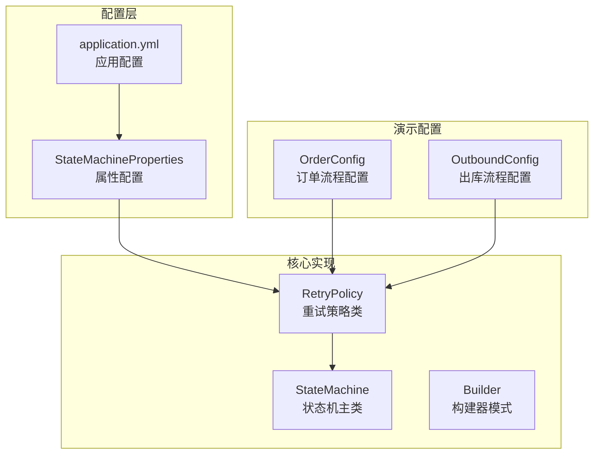
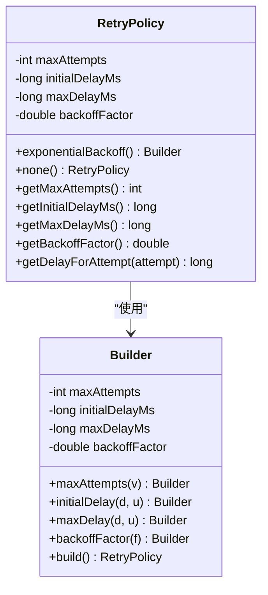
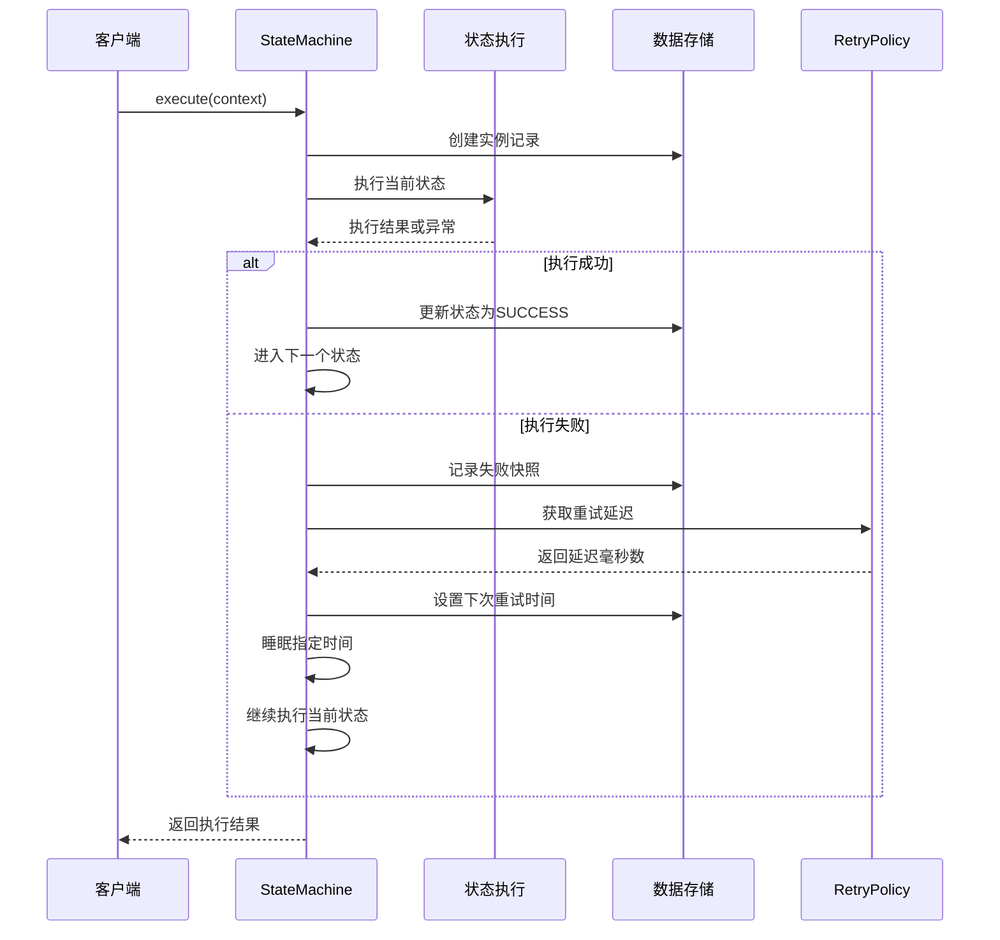
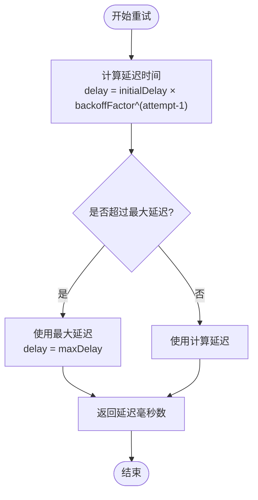

# 重试配置参数

<cite>
**本文档引用的文件**
- [RetryPolicy.java](file://src/main/java/cn/chedejun/statemachine/core/RetryPolicy.java)
- [StateMachine.java](file://src/main/java/cn/chedejun/statemachine/core/StateMachine.java)
- [StateMachineProperties.java](file://src/main/java/cn/chedejun/statemachine/autoconfigure/StateMachineProperties.java)
- [RetryPolicyTest.java](file://src/test/java/cn/chedejun/statemachine/core/RetryPolicyTest.java)
- [OrderConfig.java](file://demo/src/main/java/cn/chedejun/demo/config/OrderConfig.java)
- [OutboundConfig.java](file://demo/src/main/java/cn/chedejun/demo/config/OutboundConfig.java)
- [application.yml](file://demo/src/main/resources/application.yml)
- [README.md](file://README.md)
</cite>

## 目录
1. [简介](#简介)
2. [项目结构](#项目结构)
3. [核心组件](#核心组件)
4. [架构概览](#架构概览)
5. [详细组件分析](#详细组件分析)
6. [依赖关系分析](#依赖关系分析)
7. [性能考虑](#性能考虑)
8. [故障排除指南](#故障排除指南)
9. [结论](#结论)
10. [附录](#附录)

## 简介

本文档专注于状态机框架中的重试配置参数，详细说明 `maxAttempts`、`initialDelayMs`、`maxDelayMs`、`backoffFactor` 等关键参数的作用机制、调优方法和最佳实践。该框架提供了指数退避算法的重试策略，支持在状态机执行过程中对失败的状态进行自动重试，确保系统的稳定性和可靠性。

## 项目结构

状态机重试机制涉及以下核心文件：



**图表来源**
- [RetryPolicy.java:1-45](file://src/main/java/cn/chedejun/statemachine/core/RetryPolicy.java#L1-L45)
- [StateMachine.java:1-196](file://src/main/java/cn/chedejun/statemachine/core/StateMachine.java#L1-L196)
- [StateMachineProperties.java:1-35](file://src/main/java/cn/chedejun/statemachine/autoconfigure/StateMachineProperties.java#L1-L35)

**章节来源**
- [RetryPolicy.java:1-45](file://src/main/java/cn/chedejun/statemachine/core/RetryPolicy.java#L1-L45)
- [StateMachine.java:1-196](file://src/main/java/cn/chedejun/statemachine/core/StateMachine.java#L1-L196)
- [StateMachineProperties.java:1-35](file://src/main/java/cn/chedejun/statemachine/autoconfigure/StateMachineProperties.java#L1-L35)

## 核心组件

### RetryPolicy 类设计

重试策略类采用不可变对象设计，提供指数退避算法的核心实现：



**图表来源**
- [RetryPolicy.java:5-44](file://src/main/java/cn/chedejun/statemachine/core/RetryPolicy.java#L5-L44)

### StateMachine 中的重试集成

状态机在执行循环中集成了重试逻辑，通过 `getDelayForAttempt` 方法计算每次重试的延迟时间。

**章节来源**
- [RetryPolicy.java:18-30](file://src/main/java/cn/chedejun/statemachine/core/RetryPolicy.java#L18-L30)
- [StateMachine.java:83-136](file://src/main/java/cn/chedejun/statemachine/core/StateMachine.java#L83-L136)

## 架构概览

重试机制在整个状态机执行流程中的位置：



**图表来源**
- [StateMachine.java:83-136](file://src/main/java/cn/chedejun/statemachine/core/StateMachine.java#L83-L136)
- [RetryPolicy.java:26-30](file://src/main/java/cn/chedejun/statemachine/core/RetryPolicy.java#L26-L30)

## 详细组件分析

### 参数详解与作用机制

#### maxAttempts（最大重试次数）

**作用机制**：
- 控制状态执行失败后的最大重试次数
- 与状态机执行循环中的迭代限制配合使用
- 影响整个状态机的最大执行轮数

**默认值与范围**：
- 默认值：3次
- 取值范围：非负整数（0表示禁用重试）

**章节来源**
- [RetryPolicy.java:33](file://src/main/java/cn/chedejun/statemachine/core/RetryPolicy.java#L33)
- [StateMachine.java:85](file://src/main/java/cn/chedejun/statemachine/core/StateMachine.java#L85)

#### initialDelayMs（初始延迟毫秒数）

**作用机制**：
- 第一次重试前的等待时间
- 决定重试的起始节奏
- 影响用户体验和系统负载

**默认值与范围**：
- 默认值：1000毫秒（1秒）
- 取值范围：正整数

**章节来源**
- [RetryPolicy.java:34](file://src/main/java/cn/chedejun/statemachine/core/RetryPolicy.java#L34)
- [StateMachineProperties.java:20](file://src/main/java/cn/chedejun/statemachine/autoconfigure/StateMachineProperties.java#L20)

#### maxDelayMs（最大延迟毫秒数）

**作用机制**：
- 重试延迟的时间上限
- 防止无限延长的等待时间
- 保护系统资源不被过度占用

**默认值与范围**：
- 默认值：30000毫秒（30秒）
- 取值范围：正整数

**章节来源**
- [RetryPolicy.java:35](file://src/main/java/cn/chedejun/statemachine/core/RetryPolicy.java#L35)
- [StateMachineProperties.java:21](file://src/main/java/cn/chedejun/statemachine/autoconfigure/StateMachineProperties.java#L21)

#### backoffFactor（退避因子）

**作用机制**：
- 指数退避算法的底数
- 控制重试间隔的增长速度
- 影响系统的响应性和稳定性平衡

**默认值与范围**：
- 默认值：2.0（线性增长）
- 取值范围：大于1的实数

**章节来源**
- [RetryPolicy.java:36](file://src/main/java/cn/chedejun/statemachine/core/RetryPolicy.java#L36)
- [StateMachineProperties.java:22](file://src/main/java/cn/chedejun/statemachine/autoconfigure/StateMachineProperties.java#L22)

### 指数退避算法实现



**图表来源**
- [RetryPolicy.java:26-30](file://src/main/java/cn/chedejun/statemachine/core/RetryPolicy.java#L26-L30)

**章节来源**
- [RetryPolicy.java:26-30](file://src/main/java/cn/chedejun/statemachine/core/RetryPolicy.java#L26-L30)

### 参数相互关系和约束条件

#### 数学关系

重试延迟遵循以下数学关系：
- 第1次重试：`initialDelayMs × backoffFactor^0 = initialDelayMs`
- 第2次重试：`initialDelayMs × backoffFactor^1`
- 第n次重试：`initialDelayMs × backoffFactor^(n-1)`

#### 约束条件

1. **数值约束**：
   - `maxAttempts ≥ 0`
   - `initialDelayMs > 0`
   - `maxDelayMs > 0`
   - `backoffFactor > 1`

2. **逻辑约束**：
   - `maxDelayMs ≥ initialDelayMs`
   - 当 `backoffFactor = 1` 时退避算法退化为固定延迟

3. **性能约束**：
   - 超过 `maxAttempts` 的重试将直接导致状态机执行失败
   - 最大延迟限制防止系统资源耗尽

**章节来源**
- [RetryPolicy.java:26-30](file://src/main/java/cn/chedejun/statemachine/core/RetryPolicy.java#L26-L30)
- [StateMachine.java:85](file://src/main/java/cn/chedejun/statemachine/core/StateMachine.java#L85)

## 依赖关系分析

### 配置层次结构

```mermaid
graph TB
subgraph "配置层次"
Global[全局默认配置<br/>StateMachineProperties]
Local[局部重试配置<br/>StateMachineBuilder]
Runtime[运行时重试策略<br/>RetryPolicy]
end
subgraph "配置来源"
Spring[Sprint Boot配置<br/>application.yml]
Java[Java代码配置<br/>@Configuration]
end
Spring --> Global
Java --> Local
Global --> Runtime
Local --> Runtime
```

**图表来源**
- [StateMachineProperties.java:18-31](file://src/main/java/cn/chedejun/statemachine/autoconfigure/StateMachineProperties.java#L18-L31)
- [OrderConfig.java:40-44](file://demo/src/main/java/cn/chedejun/demo/config/OrderConfig.java#L40-L44)

### 配置优先级

1. **局部配置优先级最高**：通过 `StateMachineBuilder` 直接设置的重试策略
2. **全局配置次之**：Spring Boot 属性配置
3. **默认值最低**：代码中的硬编码默认值

**章节来源**
- [OrderConfig.java:40-44](file://demo/src/main/java/cn/chedejun/demo/config/OrderConfig.java#L40-L44)
- [OutboundConfig.java:52-56](file://demo/src/main/java/cn/chedejun/demo/config/OutboundConfig.java#L52-L56)
- [StateMachineProperties.java:18-31](file://src/main/java/cn/chedejun/statemachine/autoconfigure/StateMachineProperties.java#L18-L31)

## 性能考虑

### 内存和CPU开销

1. **内存使用**：
   - 每个状态机实例会维护重试计数和时间戳
   - 快照存储包含每次重试的详细信息
   - 最大迭代次数限制为 `states.size() × (maxAttempts + 1) + 1`

2. **CPU消耗**：
   - 指数退避计算复杂度为 O(1)
   - 线程睡眠操作影响并发性能
   - 建议合理设置 `maxDelayMs` 避免长时间阻塞

### 网络和I/O优化

1. **数据库压力**：
   - 频繁的重试会产生大量快照记录
   - 建议对快照表建立适当的索引
   - 考虑定期清理历史快照数据

2. **外部服务调用**：
   - 对于外部API调用，建议增加 `initialDelayMs` 缓冲时间
   - 结合 `maxDelayMs` 限制总等待时间

## 故障排除指南

### 常见问题诊断

#### 重试未生效

**可能原因**：
1. `maxAttempts` 设置为0
2. 状态机未正确初始化
3. 异常类型不匹配重试条件

**解决方案**：
- 检查重试策略配置
- 验证状态机初始化过程
- 确认异常捕获逻辑

#### 重试延迟异常

**可能原因**：
1. `backoffFactor` 设置过小或过大
2. `maxDelayMs` 设置不合理
3. 时间单位转换错误

**解决方案**：
- 使用测试用例验证延迟计算
- 检查时间单位转换（秒到毫秒）
- 调整退避因子以适应业务需求

**章节来源**
- [RetryPolicyTest.java:9-33](file://src/test/java/cn/chedejun/statemachine/core/RetryPolicyTest.java#L9-L33)

### 调试技巧

1. **启用详细日志**：观察重试间隔和失败原因
2. **监控快照数据**：分析重试模式和成功率
3. **性能基准测试**：评估不同配置对系统的影响

**章节来源**
- [StateMachine.java:97-116](file://src/main/java/cn/chedejun/statemachine/core/StateMachine.java#L97-L116)

## 结论

状态机重试配置参数提供了灵活而强大的错误恢复机制。通过合理配置 `maxAttempts`、`initialDelayMs`、`maxDelayMs` 和 `backoffFactor`，可以在系统稳定性、用户体验和资源消耗之间找到最佳平衡点。建议根据具体的业务场景和外部服务特性进行针对性调优，并建立完善的监控和告警机制。

## 附录

### 参数调优最佳实践

#### 一般业务场景

| 场景 | maxAttempts | initialDelayMs | maxDelayMs | backoffFactor | 说明 |
|------|-------------|----------------|------------|---------------|------|
| 低延迟API调用 | 2-3 | 500-1000 | 5000-10000 | 2.0 | 快速失败，避免长时间等待 |
| 中等延迟服务 | 3-5 | 1000-2000 | 10000-30000 | 2.0-3.0 | 平衡成功率和等待时间 |
| 高延迟外部服务 | 5-8 | 2000-5000 | 30000-60000 | 2.0-4.0 | 给外部服务充分的响应时间 |

#### 特殊场景配置

**高可用系统**：
- 增加 `maxAttempts` 到5-10次
- 提高 `maxDelayMs` 到60秒以上
- 使用较小的 `backoffFactor`（1.5-2.0）

**实时交易系统**：
- 限制 `maxAttempts` 在2-3次
- 减少 `initialDelayMs` 到100-500ms
- 使用较小的 `maxDelayMs`（5-10秒）

**批处理作业**：
- 增加 `maxAttempts` 到8-15次
- 设置较长的 `initialDelayMs`（5-30秒）
- 使用较大的 `maxDelayMs`（60-300秒）

### 配置示例

#### YAML配置示例

```yaml
state-machine:
  retry:
    default-max-attempts: 3
    default-initial-delay-ms: 1000
    default-max-delay-ms: 30000
    default-backoff-factor: 2.0
```

#### Java代码配置示例

```java
@Bean
public StateMachine<OrderContext> orderMachine() {
    return StateMachineBuilder.<OrderContext>builder("order-process")
        .retryPolicy(RetryPolicy.exponentialBackoff()
            .maxAttempts(3)
            .initialDelay(1, TimeUnit.SECONDS)
            .maxDelay(10, TimeUnit.SECONDS)
            .backoffFactor(2.0)
            .build())
        .build();
}
```

**章节来源**
- [application.yml:11-16](file://demo/src/main/resources/application.yml#L11-L16)
- [OrderConfig.java:40-44](file://demo/src/main/java/cn/chedejun/demo/config/OrderConfig.java#L40-L44)
- [OutboundConfig.java:52-56](file://demo/src/main/java/cn/chedejun/demo/config/OutboundConfig.java#L52-L56)

### 相关测试用例

框架提供了完整的测试覆盖，包括：
- 无重试策略验证（maxAttempts=0）
- 指数退避算法正确性验证
- 最大延迟上限验证
- 边界条件测试（attempt=0）

**章节来源**
- [RetryPolicyTest.java:9-33](file://src/test/java/cn/chedejun/statemachine/core/RetryPolicyTest.java#L9-L33)