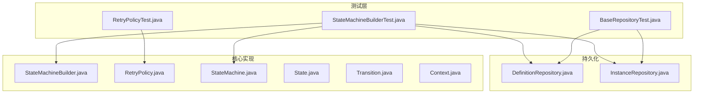
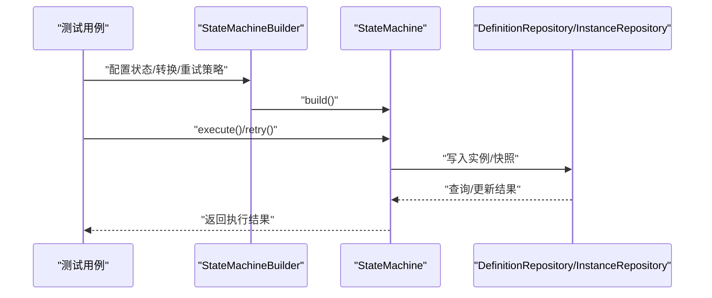
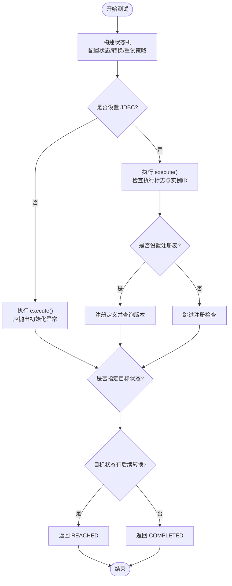
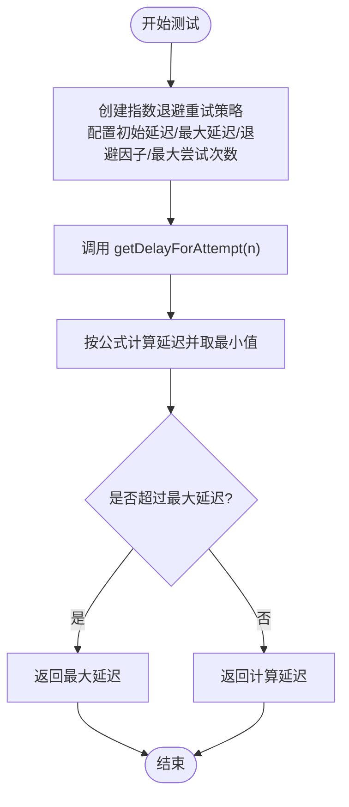
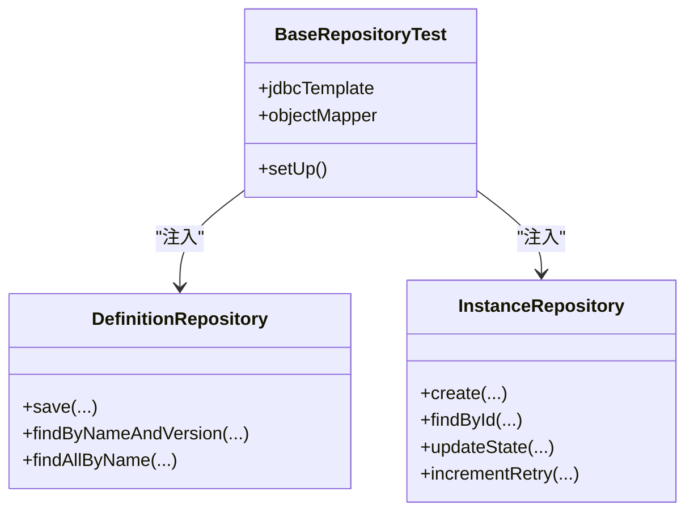
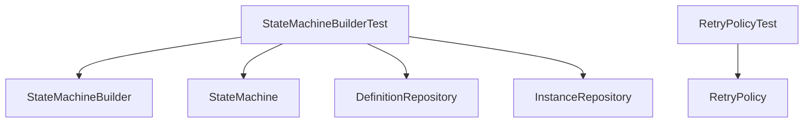

# 单元测试

<cite>
**本文引用的文件**
- [StateMachineBuilderTest.java](file://src/test/java/cn/chedejun/statemachine/core/StateMachineBuilderTest.java)
- [RetryPolicyTest.java](file://src/test/java/cn/chedejun/statemachine/core/RetryPolicyTest.java)
- [StateMachineBuilder.java](file://src/main/java/cn/chedejun/statemachine/core/StateMachineBuilder.java)
- [RetryPolicy.java](file://src/main/java/cn/chedejun/statemachine/core/RetryPolicy.java)
- [StateMachine.java](file://src/main/java/cn/chedejun/statemachine/core/StateMachine.java)
- [State.java](file://src/main/java/cn/chedejun/statemachine/core/State.java)
- [Transition.java](file://src/main/java/cn/chedejun/statemachine/core/Transition.java)
- [Context.java](file://src/main/java/cn/chedejun/statemachine/core/Context.java)
- [DefinitionRepository.java](file://src/main/java/cn/chedejun/statemachine/persistence/DefinitionRepository.java)
- [InstanceRepository.java](file://src/main/java/cn/chedejun/statemachine/persistence/InstanceRepository.java)
- [BaseRepositoryTest.java](file://src/test/java/cn/chedejun/statemachine/persistence/BaseRepositoryTest.java)
- [h2.sql](file://src/main/resources/ddl/h2.sql)
- [pom.xml](file://pom.xml)
</cite>

## 目录
1. [简介](#简介)
2. [项目结构](#项目结构)
3. [核心组件](#核心组件)
4. [架构总览](#架构总览)
5. [详细组件分析](#详细组件分析)
6. [依赖分析](#依赖分析)
7. [性能考虑](#性能考虑)
8. [故障排查指南](#故障排查指南)
9. [结论](#结论)
10. [附录](#附录)

## 简介
本文件聚焦于状态机单元测试的设计与实现，围绕以下目标展开：
- 解释如何编写和组织单元测试，重点覆盖 StateMachineBuilderTest 与 RetryPolicyTest 的具体实现
- 总结单元测试最佳实践：测试用例设计、断言方法、测试数据准备
- 提供状态机核心功能的单元测试示例：状态机构建、重试策略、异常处理
- 说明 Mockito 使用方法与测试替身创建（在当前仓库中未使用 Mockito，但提供替代方案）
- 明确测试覆盖率要求与测试命名规范建议

## 项目结构
本项目采用按模块分层的结构，测试位于独立的 test 目录下，核心业务逻辑集中在 main 目录。单元测试主要覆盖核心状态机构建器与重试策略两个模块。

**图表来源**
- [StateMachineBuilderTest.java:1-122](file://src/test/java/cn/chedejun/statemachine/core/StateMachineBuilderTest.java#L1-L122)
- [RetryPolicyTest.java:1-35](file://src/test/java/cn/chedejun/statemachine/core/RetryPolicyTest.java#L1-L35)
- [StateMachineBuilder.java:1-53](file://src/main/java/cn/chedejun/statemachine/core/StateMachineBuilder.java#L1-L53)
- [RetryPolicy.java:1-45](file://src/main/java/cn/chedejun/statemachine/core/RetryPolicy.java#L1-L45)
- [StateMachine.java:1-196](file://src/main/java/cn/chedejun/statemachine/core/StateMachine.java#L1-L196)
- [DefinitionRepository.java:1-78](file://src/main/java/cn/chedejun/statemachine/persistence/DefinitionRepository.java#L1-L78)
- [InstanceRepository.java:1-66](file://src/main/java/cn/chedejun/statemachine/persistence/InstanceRepository.java#L1-L66)

**章节来源**
- [pom.xml:1-90](file://pom.xml#L1-L90)

## 核心组件
本节概述与单元测试直接相关的核心类及其职责：
- StateMachineBuilder：用于构建状态机定义，支持状态、转换、重试策略、JDBC 初始化与注册表集成
- RetryPolicy：指数退避重试策略，支持最大尝试次数、初始延迟、最大延迟与退避因子
- StateMachine：状态机执行引擎，负责实例创建、状态流转、重试与快照记录
- State/Transition/Context：状态、转换条件与上下文容器
- DefinitionRepository/InstanceRepository：定义与实例的持久化访问层

**章节来源**
- [StateMachineBuilder.java:1-53](file://src/main/java/cn/chedejun/statemachine/core/StateMachineBuilder.java#L1-L53)
- [RetryPolicy.java:1-45](file://src/main/java/cn/chedejun/statemachine/core/RetryPolicy.java#L1-L45)
- [StateMachine.java:1-196](file://src/main/java/cn/chedejun/statemachine/core/StateMachine.java#L1-L196)
- [State.java:1-16](file://src/main/java/cn/chedejun/statemachine/core/State.java#L1-L16)
- [Transition.java:1-20](file://src/main/java/cn/chedejun/statemachine/core/Transition.java#L1-L20)
- [Context.java:1-24](file://src/main/java/cn/chedejun/statemachine/core/Context.java#L1-L24)
- [DefinitionRepository.java:1-78](file://src/main/java/cn/chedejun/statemachine/persistence/DefinitionRepository.java#L1-L78)
- [InstanceRepository.java:1-66](file://src/main/java/cn/chedejun/statemachine/persistence/InstanceRepository.java#L1-L66)

## 架构总览
单元测试围绕“构建器-执行器-持久化”的链路进行验证，确保状态机在不同配置下的行为符合预期。

**图表来源**
- [StateMachineBuilderTest.java:30-53](file://src/test/java/cn/chedejun/statemachine/core/StateMachineBuilderTest.java#L30-L53)
- [StateMachine.java:40-136](file://src/main/java/cn/chedejun/statemachine/core/StateMachine.java#L40-L136)
- [DefinitionRepository.java:24-46](file://src/main/java/cn/chedejun/statemachine/persistence/DefinitionRepository.java#L24-L46)
- [InstanceRepository.java:15-38](file://src/main/java/cn/chedejun/statemachine/persistence/InstanceRepository.java#L15-L38)

## 详细组件分析

### StateMachineBuilderTest 分析
该测试类验证状态机构建与执行的关键行为，涵盖以下要点：
- 无 JDBC 初始化时执行抛出异常
- 有 JDBC 初始化时成功执行并生成实例 ID
- 注册表集成：构建后注册定义并可查询版本
- 版本分配：同名机器多次构建得到不同版本
- 名称校验：空名称抛出非法参数异常
- 执行目标状态：到达中间状态返回 REACHED；最后状态返回 COMPLETED
- 无后续转换：自然结束返回 COMPLETED

**图表来源**
- [StateMachineBuilderTest.java:30-120](file://src/test/java/cn/chedejun/statemachine/core/StateMachineBuilderTest.java#L30-L120)
- [StateMachineBuilder.java:40-51](file://src/main/java/cn/chedejun/statemachine/core/StateMachineBuilder.java#L40-L51)
- [StateMachine.java:40-136](file://src/main/java/cn/chedejun/statemachine/core/StateMachine.java#L40-L136)

**章节来源**
- [StateMachineBuilderTest.java:1-122](file://src/test/java/cn/chedejun/statemachine/core/StateMachineBuilderTest.java#L1-L122)
- [StateMachineBuilder.java:1-53](file://src/main/java/cn/chedejun/statemachine/core/StateMachineBuilder.java#L1-L53)
- [StateMachine.java:1-196](file://src/main/java/cn/chedejun/statemachine/core/StateMachine.java#L1-L196)

### RetryPolicyTest 分析
该测试类验证重试策略的行为：
- 无重试策略：最大尝试次数为 0
- 指数退避：按公式计算每次延迟，考虑退避因子与最大延迟上限
- 零次尝试：返回零延迟
- 边界条件：超过最大延迟时保持上限

**图表来源**
- [RetryPolicyTest.java:9-33](file://src/test/java/cn/chedejun/statemachine/core/RetryPolicyTest.java#L9-L33)
- [RetryPolicy.java:26-30](file://src/main/java/cn/chedejun/statemachine/core/RetryPolicy.java#L26-L30)

**章节来源**
- [RetryPolicyTest.java:1-35](file://src/test/java/cn/chedejun/statemachine/core/RetryPolicyTest.java#L1-L35)
- [RetryPolicy.java:1-45](file://src/main/java/cn/chedejun/statemachine/core/RetryPolicy.java#L1-L45)

### 测试替身与 Mock 方案
当前仓库未使用 Mockito，推荐以下替代方案：
- 使用内存数据库（如 H2）模拟真实数据库行为，确保持久化逻辑可测
- 使用抽象基类（如 BaseRepositoryTest）统一数据库初始化与清理
- 对外部依赖（如 DefinitionRepository、InstanceRepository）采用真实对象注入，避免复杂 Mock

**图表来源**
- [BaseRepositoryTest.java:9-35](file://src/test/java/cn/chedejun/statemachine/persistence/BaseRepositoryTest.java#L9-L35)
- [DefinitionRepository.java:15-78](file://src/main/java/cn/chedejun/statemachine/persistence/DefinitionRepository.java#L15-L78)
- [InstanceRepository.java:11-66](file://src/main/java/cn/chedejun/statemachine/persistence/InstanceRepository.java#L11-L66)

**章节来源**
- [BaseRepositoryTest.java:1-35](file://src/test/java/cn/chedejun/statemachine/persistence/BaseRepositoryTest.java#L1-L35)
- [DefinitionRepository.java:1-78](file://src/main/java/cn/chedejun/statemachine/persistence/DefinitionRepository.java#L1-L78)
- [InstanceRepository.java:1-66](file://src/main/java/cn/chedejun/statemachine/persistence/InstanceRepository.java#L1-L66)

## 依赖分析
单元测试对核心类的依赖关系如下：

**图表来源**
- [StateMachineBuilderTest.java:1-122](file://src/test/java/cn/chedejun/statemachine/core/StateMachineBuilderTest.java#L1-L122)
- [RetryPolicyTest.java:1-35](file://src/test/java/cn/chedejun/statemachine/core/RetryPolicyTest.java#L1-L35)
- [StateMachineBuilder.java:1-53](file://src/main/java/cn/chedejun/statemachine/core/StateMachineBuilder.java#L1-L53)
- [StateMachine.java:1-196](file://src/main/java/cn/chedejun/statemachine/core/StateMachine.java#L1-L196)
- [RetryPolicy.java:1-45](file://src/main/java/cn/chedejun/statemachine/core/RetryPolicy.java#L1-L45)
- [DefinitionRepository.java:1-78](file://src/main/java/cn/chedejun/statemachine/persistence/DefinitionRepository.java#L1-L78)
- [InstanceRepository.java:1-66](file://src/main/java/cn/chedejun/statemachine/persistence/InstanceRepository.java#L1-L66)

**章节来源**
- [StateMachineBuilderTest.java:1-122](file://src/test/java/cn/chedejun/statemachine/core/StateMachineBuilderTest.java#L1-L122)
- [RetryPolicyTest.java:1-35](file://src/test/java/cn/chedejun/statemachine/core/RetryPolicyTest.java#L1-L35)

## 性能考虑
- 单元测试应避免真实网络与数据库 IO，优先使用内存数据库与轻量级断言
- 对重试策略测试，应控制最大尝试次数与延迟，避免测试执行时间过长
- 在状态机执行测试中，合理设置状态数量与转换条件，避免无限循环或超大迭代

## 故障排查指南
- 初始化异常：若未设置 JDBC，执行会抛出初始化异常。请在测试中正确注入 JdbcTemplate
- 注册表问题：若未设置注册表，定义不会被注册。请在测试中传入注册表实例
- 目标状态到达：当指定目标状态且其后仍有转换时，应返回 REACHED；若为目标状态且无后续转换，则返回 COMPLETED
- 重试上限：超过最大尝试次数后，实例状态应为 FAILED，并抛出异常

**章节来源**
- [StateMachine.java:178-180](file://src/main/java/cn/chedejun/statemachine/core/StateMachine.java#L178-L180)
- [StateMachineBuilderTest.java:67-120](file://src/test/java/cn/chedejun/statemachine/core/StateMachineBuilderTest.java#L67-L120)
- [RetryPolicyTest.java:9-33](file://src/test/java/cn/chedejun/statemachine/core/RetryPolicyTest.java#L9-L33)

## 结论
本文件系统性梳理了状态机单元测试的编写与组织方式，结合 StateMachineBuilderTest 与 RetryPolicyTest 的实现，总结了测试用例设计、断言方法与测试数据准备的最佳实践。通过内存数据库与抽象基类，可在不引入复杂 Mock 的前提下，有效验证状态机构建、执行与重试策略等核心功能。

## 附录

### 测试覆盖率要求建议
- 覆盖率目标：核心类（StateMachineBuilder、RetryPolicy、StateMachine）行覆盖率不低于 80%，分支覆盖率不低于 70%
- 关键路径：状态机执行循环、重试策略延迟计算、注册表与持久化交互
- 边界条件：空名称、无后续转换、目标状态边界、最大尝试次数

### 测试命名规范建议
- 测试类：以被测类名 + Test 结尾，例如 StateMachineBuilderTest、RetryPolicyTest
- 测试方法：采用“场景_期望结果”或“前置条件_操作_断言”的命名风格，例如 build_withJdbcTemplate_executesSuccessfully、exponentialBackoff_calculatesCorrectDelay

### 数据库结构参考
- 定义表：state_machine_definitions
- 实例表：state_machine_instances
- 快照表：state_machine_snapshots

**章节来源**
- [h2.sql:1-18](file://src/main/resources/ddl/h2.sql#L1-L18)