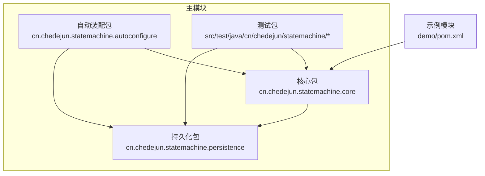
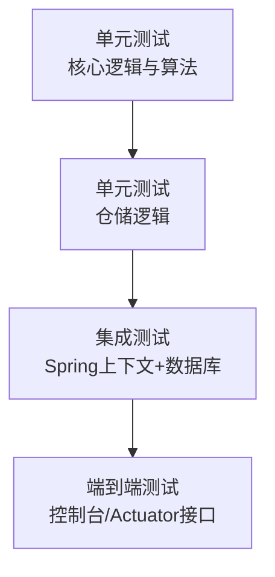
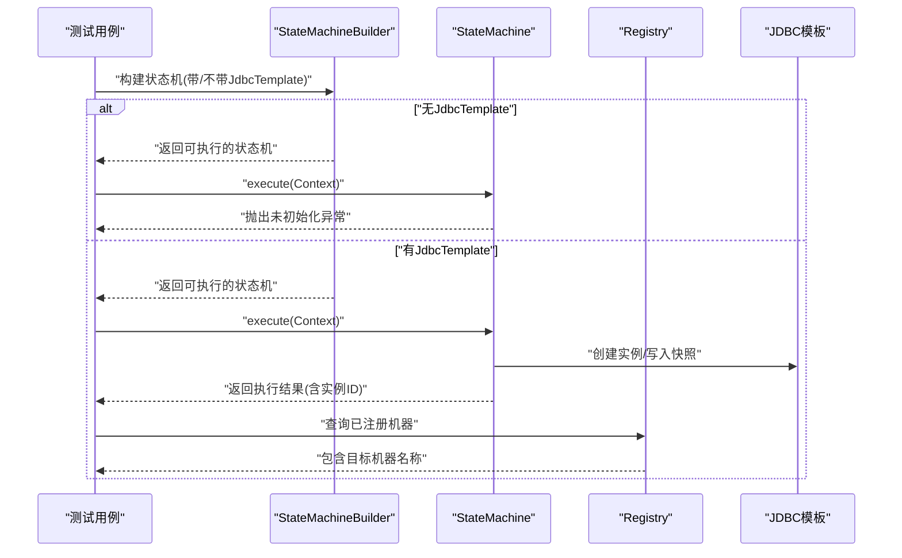
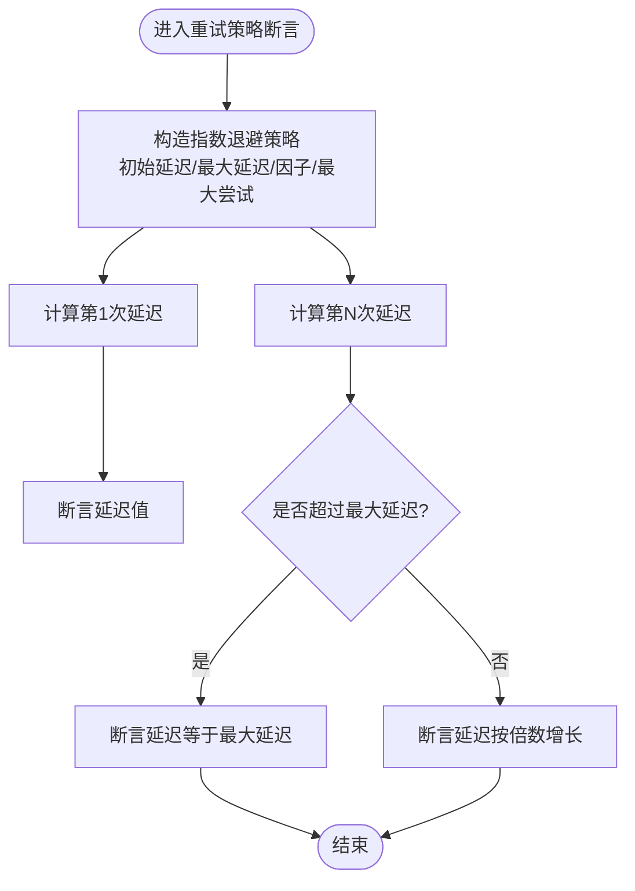
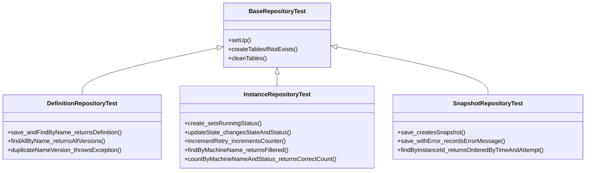
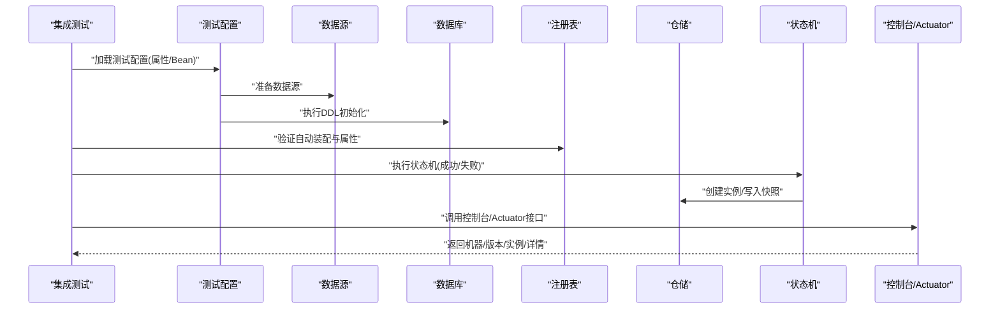
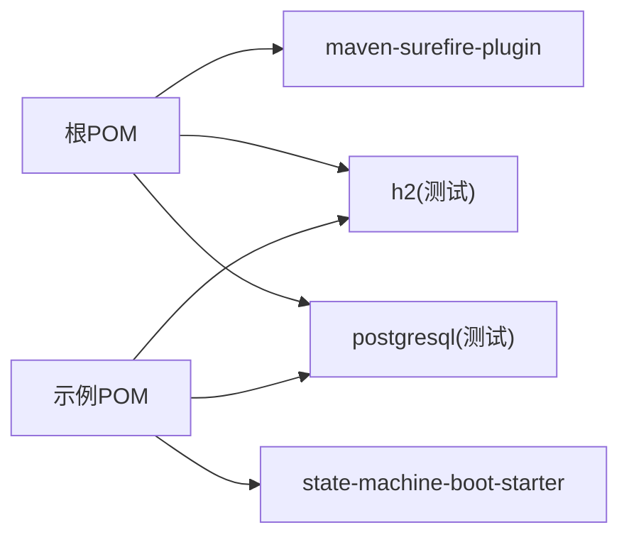

# 测试策略

<cite>
**本文引用的文件**
- [pom.xml](file://pom.xml)
- [demo/pom.xml](file://demo/pom.xml)
- [src/test/resources/application.yml](file://src/test/resources/application.yml)
- [src/test/java/cn/chedejun/statemachine/core/StateMachineBuilderTest.java](file://src/test/java/cn/chedejun/statemachine/core/StateMachineBuilderTest.java)
- [src/test/java/cn/chedejun/statemachine/core/RetryPolicyTest.java](file://src/test/java/cn/chedejun/statemachine/core/RetryPolicyTest.java)
- [src/test/java/cn/chedejun/statemachine/integration/StateMachineIntegrationTest.java](file://src/test/java/cn/chedejun/statemachine/integration/StateMachineIntegrationTest.java)
- [src/test/java/cn/chedejun/statemachine/persistence/BaseRepositoryTest.java](file://src/test/java/cn/chedejun/statemachine/persistence/BaseRepositoryTest.java)
- [src/test/java/cn/chedejun/statemachine/persistence/DefinitionRepositoryTest.java](file://src/test/java/cn/chedejun/statemachine/persistence/DefinitionRepositoryTest.java)
- [src/test/java/cn/chedejun/statemachine/persistence/InstanceRepositoryTest.java](file://src/test/java/cn/chedejun/statemachine/persistence/InstanceRepositoryTest.java)
- [src/test/java/cn/chedejun/statemachine/persistence/SnapshotRepositoryTest.java](file://src/test/java/cn/chedejun/statemachine/persistence/SnapshotRepositoryTest.java)
- [src/main/java/cn/chedejun/statemachine/core/StateMachine.java](file://src/main/java/cn/chedejun/statemachine/core/StateMachine.java)
- [src/main/java/cn/chedejun/statemachine/autoconfigure/StateMachineAutoConfiguration.java](file://src/main/java/cn/chedejun/statemachine/autoconfigure/StateMachineAutoConfiguration.java)
- [README.md](file://README.md)
</cite>

## 目录
1. [引言](#引言)
2. [项目结构](#项目结构)
3. [核心组件](#核心组件)
4. [架构总览](#架构总览)
5. [详细组件分析](#详细组件分析)
6. [依赖分析](#依赖分析)
7. [性能考虑](#性能考虑)
8. [故障排查指南](#故障排查指南)
9. [结论](#结论)
10. [附录](#附录)

## 引言
本文件面向状态机模块的测试策略与方法论，结合当前仓库的测试组织与实现，系统阐述单元测试、集成测试与端到端测试的组合应用，明确测试金字塔在本项目中的职责划分；同时给出测试数据管理、持续集成中的测试自动化配置思路、性能与压力测试建议、覆盖率分析与质量门禁设置、测试环境与数据库策略等实践方案。

## 项目结构
本项目采用分层与功能混合的组织方式：
- 核心逻辑位于主模块，包含状态机核心类、自动装配与持久化层；
- 测试覆盖三层：核心单元测试、持久化仓储单元测试、以及基于Spring Boot的集成/端到端测试；
- 示例演示模块独立打包，便于外部集成验证。

图表来源
- [pom.xml:1-90](file://pom.xml#L1-L90)
- [demo/pom.xml:1-93](file://demo/pom.xml#L1-L93)

章节来源
- [pom.xml:1-90](file://pom.xml#L1-L90)
- [demo/pom.xml:1-93](file://demo/pom.xml#L1-L93)

## 核心组件
- 状态机执行器：负责状态流转、重试策略、实例与快照持久化、结果返回；
- 自动装配：根据数据源与属性配置，注册定义、初始化DDL、装配管理端点与控制台；
- 持久化层：定义、实例、快照三类仓储，配合DDL脚本完成表结构初始化与迁移。

章节来源
- [src/main/java/cn/chedejun/statemachine/core/StateMachine.java:1-196](file://src/main/java/cn/chedejun/statemachine/core/StateMachine.java#L1-L196)
- [src/main/java/cn/chedejun/statemachine/autoconfigure/StateMachineAutoConfiguration.java:1-80](file://src/main/java/cn/chedejun/statemachine/autoconfigure/StateMachineAutoConfiguration.java#L1-L80)

## 架构总览
下图展示测试金字塔在本项目中的映射关系与职责边界：

说明
- 单元测试：覆盖状态机构建、重试策略计算、仓储CRUD等纯逻辑；
- 集成测试：加载Spring上下文，验证自动装配、DDL初始化、管理端点与控制台；
- 端到端测试：验证控制台页面与Actuator端点返回的数据一致性。

## 详细组件分析

### 单元测试：状态机构建与执行
- 覆盖要点：无JdbcTemplate时执行抛异常、有JdbcTemplate时成功执行、注册表登记、版本分配、目标态到达行为、无后续转换时完成态判断等；
- 数据隔离：使用内存数据库连接与SQL脚本初始化，确保每次用例独立；
- 断言策略：对执行结果状态、实例ID、注册表条目数量与版本进行断言。

图表来源
- [src/test/java/cn/chedejun/statemachine/core/StateMachineBuilderTest.java:1-122](file://src/test/java/cn/chedejun/statemachine/core/StateMachineBuilderTest.java#L1-L122)
- [src/main/java/cn/chedejun/statemachine/core/StateMachine.java:37-136](file://src/main/java/cn/chedejun/statemachine/core/StateMachine.java#L37-L136)

章节来源
- [src/test/java/cn/chedejun/statemachine/core/StateMachineBuilderTest.java:1-122](file://src/test/java/cn/chedejun/statemachine/core/StateMachineBuilderTest.java#L1-L122)

### 单元测试：重试策略
- 覆盖要点：无重试策略最大尝试次数为0、指数退避延迟计算、达到最大延迟后封顶、第0次尝试延迟为0；
- 算法复杂度：延迟计算为O(1)，适合在单元测试中直接断言。

图表来源
- [src/test/java/cn/chedejun/statemachine/core/RetryPolicyTest.java:1-35](file://src/test/java/cn/chedejun/statemachine/core/RetryPolicyTest.java#L1-L35)

章节来源
- [src/test/java/cn/chedejun/statemachine/core/RetryPolicyTest.java:1-35](file://src/test/java/cn/chedejun/statemachine/core/RetryPolicyTest.java#L1-L35)

### 单元测试：仓储层
- 基类隔离：统一使用内存数据库连接与DDL脚本初始化，BeforeEach清理三张表；
- 定义仓储：保存与查找定义、按名称查询所有版本、重复版本保存抛异常；
- 实例仓储：创建实例默认运行态、更新状态与最终态、递增重试计数、按机器名过滤与统计；
- 快照仓储：保存快照并记录状态与错误信息、按实例查询并按时间与尝试序号排序。

图表来源
- [src/test/java/cn/chedejun/statemachine/persistence/BaseRepositoryTest.java:1-35](file://src/test/java/cn/chedejun/statemachine/persistence/BaseRepositoryTest.java#L1-L35)
- [src/test/java/cn/chedejun/statemachine/persistence/DefinitionRepositoryTest.java:1-50](file://src/test/java/cn/chedejun/statemachine/persistence/DefinitionRepositoryTest.java#L1-L50)
- [src/test/java/cn/chedejun/statemachine/persistence/InstanceRepositoryTest.java:1-52](file://src/test/java/cn/chedejun/statemachine/persistence/InstanceRepositoryTest.java#L1-L52)
- [src/test/java/cn/chedejun/statemachine/persistence/SnapshotRepositoryTest.java:1-46](file://src/test/java/cn/chedejun/statemachine/persistence/SnapshotRepositoryTest.java#L1-L46)

章节来源
- [src/test/java/cn/chedejun/statemachine/persistence/BaseRepositoryTest.java:1-35](file://src/test/java/cn/chedejun/statemachine/persistence/BaseRepositoryTest.java#L1-L35)
- [src/test/java/cn/chedejun/statemachine/persistence/DefinitionRepositoryTest.java:1-50](file://src/test/java/cn/chedejun/statemachine/persistence/DefinitionRepositoryTest.java#L1-L50)
- [src/test/java/cn/chedejun/statemachine/persistence/InstanceRepositoryTest.java:1-52](file://src/test/java/cn/chedejun/statemachine/persistence/InstanceRepositoryTest.java#L1-L52)
- [src/test/java/cn/chedejun/statemachine/persistence/SnapshotRepositoryTest.java:1-46](file://src/test/java/cn/chedejun/statemachine/persistence/SnapshotRepositoryTest.java#L1-L46)

### 集成测试：自动装配与端到端执行
- 自动装配验证：加载Spring上下文，断言JdbcTemplate、注册表、定义仓储、属性绑定、可选管理端点与控制台存在；
- 端到端执行：成功流程持久化实例与快照、定义入库、多版本创建、失败流程记录失败快照、重试后状态重置；
- 控制台与Actuator：列出机器、获取版本、查询实例、实例详情、重试实例；Actuator端点同上；
- 数据验证：每个用例结束后打印三张表计数，辅助定位问题。

图表来源
- [src/test/java/cn/chedejun/statemachine/integration/StateMachineIntegrationTest.java:1-347](file://src/test/java/cn/chedejun/statemachine/integration/StateMachineIntegrationTest.java#L1-L347)
- [src/main/java/cn/chedejun/statemachine/autoconfigure/StateMachineAutoConfiguration.java:22-80](file://src/main/java/cn/chedejun/statemachine/autoconfigure/StateMachineAutoConfiguration.java#L22-L80)

章节来源
- [src/test/java/cn/chedejun/statemachine/integration/StateMachineIntegrationTest.java:1-347](file://src/test/java/cn/chedejun/statemachine/integration/StateMachineIntegrationTest.java#L1-L347)

### 端到端测试：控制台与Actuator
- 控制台接口：列出机器、获取版本、查询实例、实例详情、重试实例；
- Actuator端点：与控制台一致的功能集合；
- 断言策略：校验返回数据结构完整性与业务语义正确性。

章节来源
- [src/test/java/cn/chedejun/statemachine/integration/StateMachineIntegrationTest.java:238-333](file://src/test/java/cn/chedejun/statemachine/integration/StateMachineIntegrationTest.java#L238-L333)

## 依赖分析
- Maven插件：编译插件与测试插件（Surefire）；
- 测试依赖：Spring Boot Starter Test、H2内存数据库、PostgreSQL驱动；
- 示例模块：依赖主模块starter，复用测试依赖与数据库驱动。

图表来源
- [pom.xml:70-88](file://pom.xml#L70-L88)
- [demo/pom.xml:34-71](file://demo/pom.xml#L34-L71)

章节来源
- [pom.xml:1-90](file://pom.xml#L1-L90)
- [demo/pom.xml:1-93](file://demo/pom.xml#L1-L93)

## 性能考虑
- 单元测试：避免I/O，使用内存数据库与轻量断言；
- 集成测试：合理控制并发与重试次数，避免长时间阻塞；
- 端到端测试：减少对远程数据库的依赖，必要时使用容器化数据库；
- 压力测试建议：基于集成测试场景扩展，模拟高并发实例创建与执行，关注数据库连接池与快照写入瓶颈。

## 故障排查指南
- 未初始化异常：确认状态机构建时已注入JdbcTemplate或通过自动装配注册；
- 注册表为空：检查自动装配是否生效、属性配置是否正确；
- 控制台/Actuator不可用：确认管理与控制台开关已启用；
- 数据库连接：核对测试配置中的URL、用户名、密码与驱动；
- 快照与实例状态不符：检查重试策略与状态更新逻辑。

章节来源
- [src/test/java/cn/chedejun/statemachine/core/StateMachineBuilderTest.java:30-53](file://src/test/java/cn/chedejun/statemachine/core/StateMachineBuilderTest.java#L30-L53)
- [src/test/java/cn/chedejun/statemachine/integration/StateMachineIntegrationTest.java:128-148](file://src/test/java/cn/chedejun/statemachine/integration/StateMachineIntegrationTest.java#L128-L148)
- [src/test/resources/application.yml:1-14](file://src/test/resources/application.yml#L1-L14)

## 结论
本项目测试策略以“单元测试为基础、仓储测试为支撑、集成/端到端测试为验证”的金字塔模式组织，覆盖状态机执行、重试策略、持久化与管理接口。通过内存数据库与统一基类清理，保证测试隔离与稳定性；通过自动装配与属性绑定验证，确保生产可用性。建议在CI中引入覆盖率与质量门禁，并结合容器化数据库提升端到端测试可靠性。

## 附录

### 测试金字塔与职责划分
- 单元测试：算法与逻辑正确性（重试策略、状态机构建、仓储CRUD）；
- 集成测试：Spring上下文、自动装配、DDL初始化、管理端点与控制台；
- 端到端测试：控制台页面与Actuator接口的数据一致性与用户体验。

### 测试数据管理策略
- 生成：在BeforeEach中使用内存数据库脚本初始化；
- 清理：统一在BeforeEach清理三张表，避免跨用例污染；
- 隔离：每个测试类使用独立内存库实例，避免共享状态。

章节来源
- [src/test/java/cn/chedejun/statemachine/persistence/BaseRepositoryTest.java:13-33](file://src/test/java/cn/chedejun/statemachine/persistence/BaseRepositoryTest.java#L13-L33)

### 持续集成与测试自动化
- Maven插件：使用编译插件与Surefire测试插件；
- CI/CD流水线：建议在流水线中包含编译、单元测试、集成测试、端到端测试阶段；
- 数据库：优先使用内存数据库，必要时使用容器化PostgreSQL；
- 覆盖率与质量门禁：建议引入覆盖率插件与质量门禁规则。

章节来源
- [pom.xml:70-88](file://pom.xml#L70-L88)
- [demo/pom.xml:74-90](file://demo/pom.xml#L74-L90)

### 性能与压力测试方法
- 基于集成测试场景扩展，模拟高并发实例创建与执行；
- 关注点：数据库连接池、快照写入、重试延迟与状态更新；
- 工具建议：JMeter或Gatling，结合容器化数据库进行压测。

### 测试环境与数据库策略
- 内存数据库：H2用于单元与仓储测试，速度快、易隔离；
- 容器化数据库：PostgreSQL用于集成与端到端测试，贴近生产；
- 配置分离：测试配置与生产配置分离，避免误连生产库。

章节来源
- [src/test/resources/application.yml:1-14](file://src/test/resources/application.yml#L1-L14)
- [README.md:55-65](file://README.md#L55-L65)