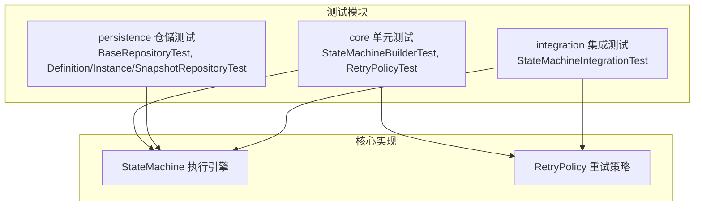
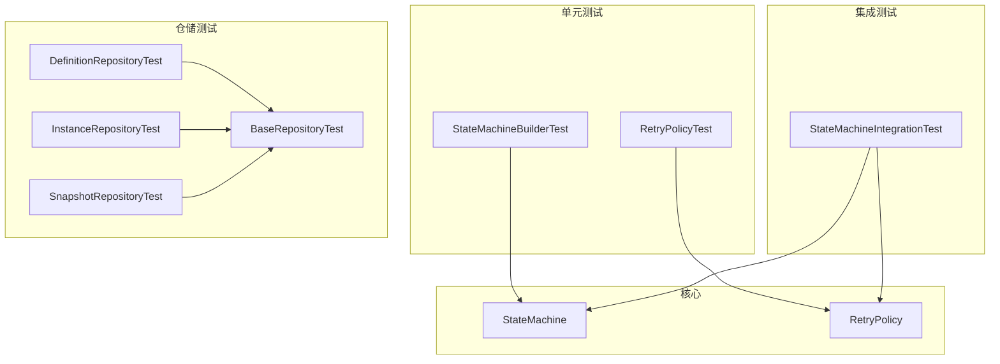
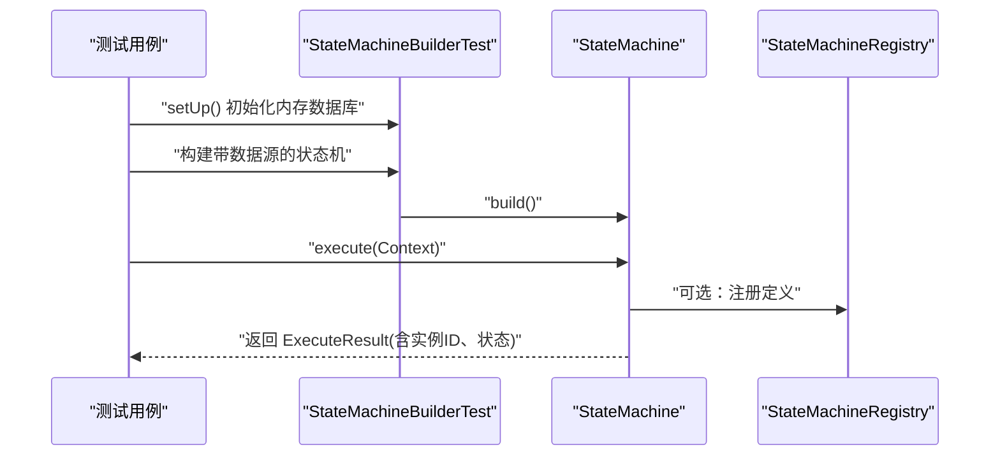
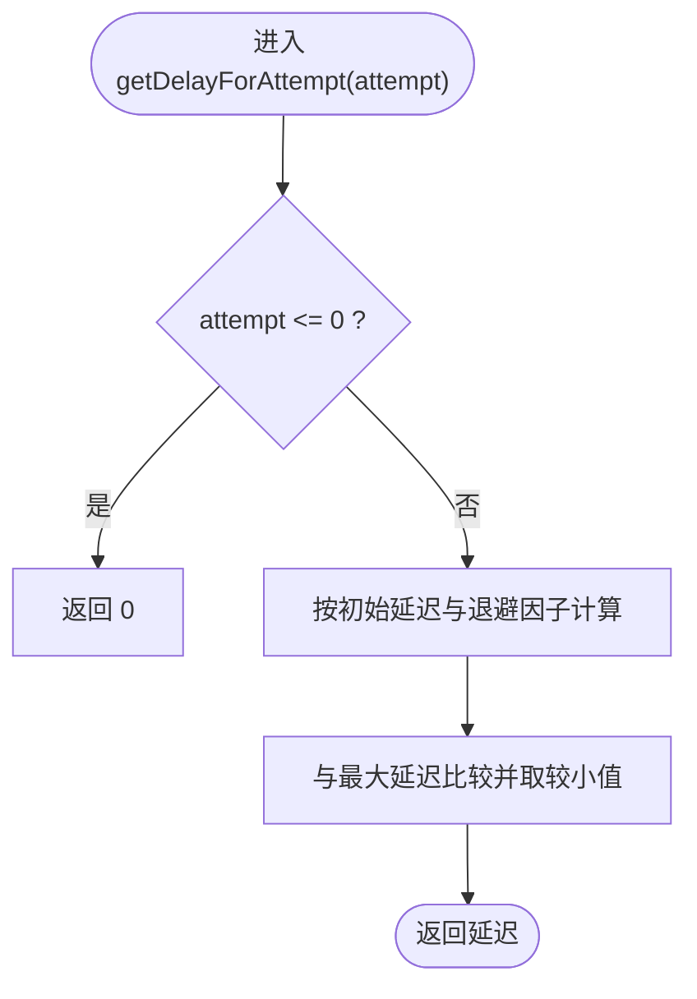
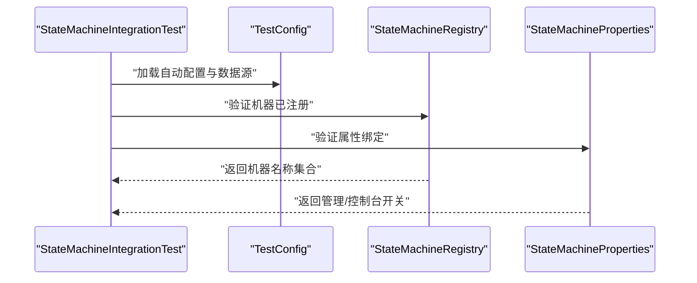
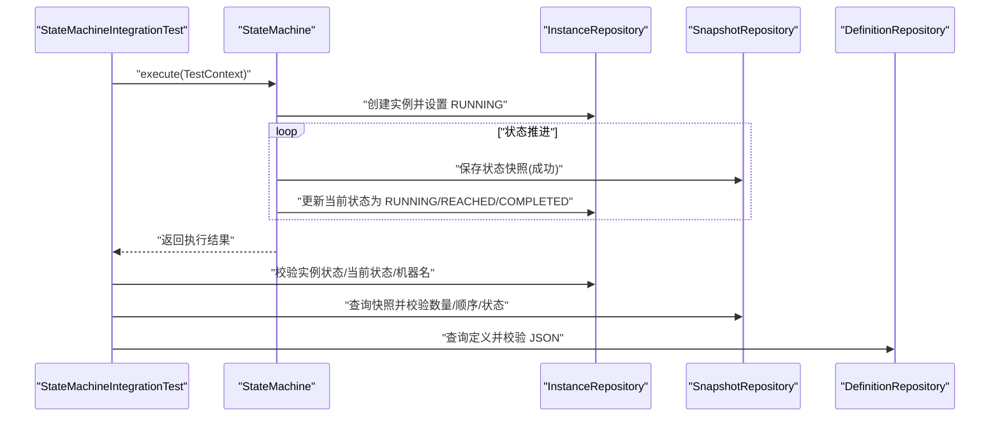
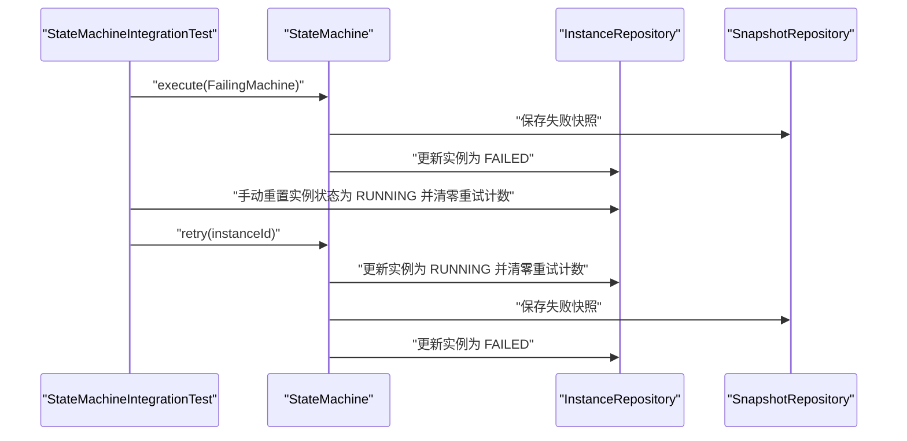
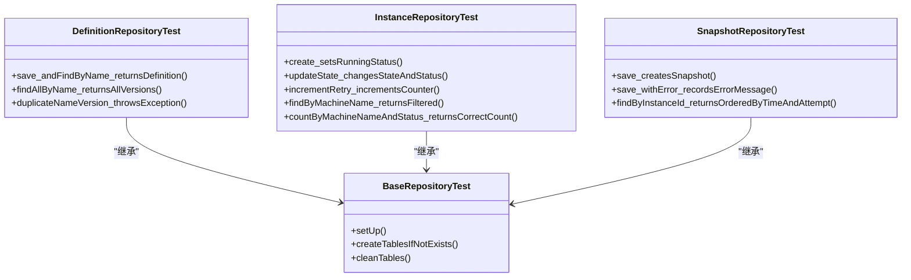
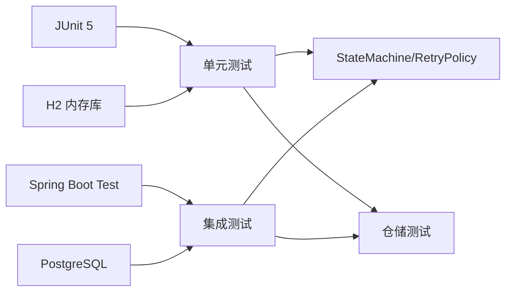

# 集成与测试

<cite>
**本文引用的文件**
- [pom.xml](file://pom.xml)
- [src/test/java/cn/chedejun/statemachine/core/StateMachineBuilderTest.java](file://src/test/java/cn/chedejun/statemachine/core/StateMachineBuilderTest.java)
- [src/test/java/cn/chedejun/statemachine/core/RetryPolicyTest.java](file://src/test/java/cn/chedejun/statemachine/core/RetryPolicyTest.java)
- [src/test/java/cn/chedejun/statemachine/integration/StateMachineIntegrationTest.java](file://src/test/java/cn/chedejun/statemachine/integration/StateMachineIntegrationTest.java)
- [src/test/java/cn/chedejun/statemachine/persistence/BaseRepositoryTest.java](file://src/test/java/cn/chedejun/statemachine/persistence/BaseRepositoryTest.java)
- [src/test/java/cn/chedejun/statemachine/persistence/DefinitionRepositoryTest.java](file://src/test/java/cn/chedejun/statemachine/persistence/DefinitionRepositoryTest.java)
- [src/test/java/cn/chedejun/statemachine/persistence/InstanceRepositoryTest.java](file://src/test/java/cn/chedejun/statemachine/persistence/InstanceRepositoryTest.java)
- [src/test/java/cn/chedejun/statemachine/persistence/SnapshotRepositoryTest.java](file://src/test/java/cn/chedejun/statemachine/persistence/SnapshotRepositoryTest.java)
- [src/test/resources/application.yml](file://src/test/resources/application.yml)
- [src/main/java/cn/chedejun/statemachine/core/StateMachine.java](file://src/main/java/cn/chedejun/statemachine/core/StateMachine.java)
- [src/main/java/cn/chedejun/statemachine/core/RetryPolicy.java](file://src/main/java/cn/chedejun/statemachine/core/RetryPolicy.java)
- [demo/src/main/resources/application.yml](file://demo/src/main/resources/application.yml)
- [demo/src/main/java/cn/chedejun/demo/config/OrderConfig.java](file://demo/src/main/java/cn/chedejun/demo/config/OrderConfig.java)
</cite>

## 目录
1. [简介](#简介)
2. [项目结构](#项目结构)
3. [核心组件](#核心组件)
4. [架构总览](#架构总览)
5. [详细组件分析](#详细组件分析)
6. [依赖分析](#依赖分析)
7. [性能考虑](#性能考虑)
8. [故障排查指南](#故障排查指南)
9. [结论](#结论)
10. [附录](#附录)

## 简介
本文件面向状态机模块的集成与测试，系统性阐述单元测试与集成测试的编写方法与最佳实践，覆盖测试框架选择与配置（JUnit、Spring Boot Test）、状态机测试示例（状态转换、重试机制、持久化）、测试数据准备与清理策略、测试覆盖率与性能测试方法，以及 CI/CD 中的测试自动化方案。文档以仓库中的现有测试用例为依据，结合核心实现，帮助读者快速上手并扩展测试体系。

## 项目结构
本项目采用分层与功能混合组织方式：核心逻辑位于主模块，测试位于 src/test 下；演示应用位于 demo 模块。测试子目录按关注点划分：
- core：核心状态机构建与重试策略的单元测试
- integration：基于 Spring Boot 的集成测试，覆盖自动装配、持久化、管理控制台与 Actuator 接口
- persistence：仓储层（定义、实例、快照）的单元测试，统一继承 BaseRepositoryTest 进行 H2 内存库初始化与表清理

图表来源
- [src/test/java/cn/chedejun/statemachine/core/StateMachineBuilderTest.java:14-121](file://src/test/java/cn/chedejun/statemachine/core/StateMachineBuilderTest.java#L14-L121)
- [src/test/java/cn/chedejun/statemachine/core/RetryPolicyTest.java:1-35](file://src/test/java/cn/chedejun/statemachine/core/RetryPolicyTest.java#L1-L35)
- [src/test/java/cn/chedejun/statemachine/integration/StateMachineIntegrationTest.java:1-347](file://src/test/java/cn/chedejun/statemachine/integration/StateMachineIntegrationTest.java#L1-L347)
- [src/test/java/cn/chedejun/statemachine/persistence/BaseRepositoryTest.java:1-35](file://src/test/java/cn/chedejun/statemachine/persistence/BaseRepositoryTest.java#L1-L35)
- [src/main/java/cn/chedejun/statemachine/core/StateMachine.java:1-196](file://src/main/java/cn/chedejun/statemachine/core/StateMachine.java#L1-L196)
- [src/main/java/cn/chedejun/statemachine/core/RetryPolicy.java:1-45](file://src/main/java/cn/chedejun/statemachine/core/RetryPolicy.java#L1-L45)

章节来源
- [pom.xml:1-90](file://pom.xml#L1-L90)
- [src/test/java/cn/chedejun/statemachine/core/StateMachineBuilderTest.java:14-121](file://src/test/java/cn/chedejun/statemachine/core/StateMachineBuilderTest.java#L14-L121)
- [src/test/java/cn/chedejun/statemachine/integration/StateMachineIntegrationTest.java:43-56](file://src/test/java/cn/chedejun/statemachine/integration/StateMachineIntegrationTest.java#L43-L56)

## 核心组件
- 状态机执行引擎：负责状态推进、条件判断、快照记录、重试与最终状态判定
- 重试策略：指数回退、最大尝试次数、最大延迟、退避因子
- 仓储层：定义、实例、快照三类仓储，负责持久化与查询
- 自动装配与属性绑定：Spring Boot Starter 自动配置加载与属性绑定
- 管理接口：控制台与 Actuator 端点，用于机器列表、版本、实例查询与重试

章节来源
- [src/main/java/cn/chedejun/statemachine/core/StateMachine.java:11-196](file://src/main/java/cn/chedejun/statemachine/core/StateMachine.java#L11-L196)
- [src/main/java/cn/chedejun/statemachine/core/RetryPolicy.java:5-45](file://src/main/java/cn/chedejun/statemachine/core/RetryPolicy.java#L5-L45)

## 架构总览
下图展示测试视角下的系统交互：单元测试直接驱动核心类；集成测试通过 Spring Boot 上下文加载自动配置、数据源与管理组件；仓储测试在内存数据库中进行 CRUD 验证。

图表来源
- [src/test/java/cn/chedejun/statemachine/core/StateMachineBuilderTest.java:14-121](file://src/test/java/cn/chedejun/statemachine/core/StateMachineBuilderTest.java#L14-L121)
- [src/test/java/cn/chedejun/statemachine/core/RetryPolicyTest.java:1-35](file://src/test/java/cn/chedejun/statemachine/core/RetryPolicyTest.java#L1-L35)
- [src/test/java/cn/chedejun/statemachine/integration/StateMachineIntegrationTest.java:58-92](file://src/test/java/cn/chedejun/statemachine/integration/StateMachineIntegrationTest.java#L58-L92)
- [src/test/java/cn/chedejun/statemachine/persistence/BaseRepositoryTest.java:9-35](file://src/test/java/cn/chedejun/statemachine/persistence/BaseRepositoryTest.java#L9-L35)

## 详细组件分析

### 单元测试：状态机构建与执行
- 目标：验证状态机构建器的行为、注册机制、版本分配、目标状态到达语义、无下一状态时完成语义
- 关键断言：
  - 未注入数据源时执行抛出异常
  - 注入数据源后可成功执行并生成实例 ID
  - 注册表正确登记机器名称与版本
  - 版本号随构建递增
  - 目标状态为中间状态返回“到达”，为目标末态返回“完成”
- 测试数据：内存 H2 数据源，DDL 由资源脚本初始化

图表来源
- [src/test/java/cn/chedejun/statemachine/core/StateMachineBuilderTest.java:18-53](file://src/test/java/cn/chedejun/statemachine/core/StateMachineBuilderTest.java#L18-L53)
- [src/test/java/cn/chedejun/statemachine/core/StateMachineBuilderTest.java:67-120](file://src/test/java/cn/chedejun/statemachine/core/StateMachineBuilderTest.java#L67-L120)

章节来源
- [src/test/java/cn/chedejun/statemachine/core/StateMachineBuilderTest.java:14-121](file://src/test/java/cn/chedejun/statemachine/core/StateMachineBuilderTest.java#L14-L121)

### 单元测试：重试策略
- 目标：验证重试策略的延迟计算、最大延迟上限、零次尝试返回零延迟
- 关键断言：
  - 无重试策略的最大尝试次数为 0
  - 指数回退按公式计算，超过最大延迟时被截断
  - 尝试序号为 0 返回 0 延迟

图表来源
- [src/main/java/cn/chedejun/statemachine/core/RetryPolicy.java:26-30](file://src/main/java/cn/chedejun/statemachine/core/RetryPolicy.java#L26-L30)

章节来源
- [src/test/java/cn/chedejun/statemachine/core/RetryPolicyTest.java:1-35](file://src/test/java/cn/chedejun/statemachine/core/RetryPolicyTest.java#L1-L35)
- [src/main/java/cn/chedejun/statemachine/core/RetryPolicy.java:5-45](file://src/main/java/cn/chedejun/statemachine/core/RetryPolicy.java#L5-L45)

### 集成测试：自动配置与属性绑定
- 目标：验证自动配置是否加载、属性是否正确绑定、机器是否自动注册
- 关键断言：
  - 数据源、模板、注册表、定义仓储、属性对象存在
  - 属性值符合配置（DDL 自动更新、管理与控制台启用）
  - 注册表包含测试机器名称

图表来源
- [src/test/java/cn/chedejun/statemachine/integration/StateMachineIntegrationTest.java:58-92](file://src/test/java/cn/chedejun/statemachine/integration/StateMachineIntegrationTest.java#L58-L92)
- [src/test/java/cn/chedejun/statemachine/integration/StateMachineIntegrationTest.java:128-148](file://src/test/java/cn/chedejun/statemachine/integration/StateMachineIntegrationTest.java#L128-L148)

章节来源
- [src/test/java/cn/chedejun/statemachine/integration/StateMachineIntegrationTest.java:43-56](file://src/test/java/cn/chedejun/statemachine/integration/StateMachineIntegrationTest.java#L43-L56)
- [src/test/java/cn/chedejun/statemachine/integration/StateMachineIntegrationTest.java:128-155](file://src/test/java/cn/chedejun/statemachine/integration/StateMachineIntegrationTest.java#L128-L155)

### 集成测试：端到端执行与持久化
- 目标：验证成功流程的实例与快照持久化、定义入库、多版本创建
- 关键断言：
  - 执行结果包含实例 ID，上下文状态按顺序推进
  - 实例记录状态为完成，当前状态为末态
  - 快照数量与顺序正确，状态均为成功
  - 定义记录存在且包含状态与转换 JSON

图表来源
- [src/test/java/cn/chedejun/statemachine/integration/StateMachineIntegrationTest.java:159-193](file://src/test/java/cn/chedejun/statemachine/integration/StateMachineIntegrationTest.java#L159-L193)
- [src/main/java/cn/chedejun/statemachine/core/StateMachine.java:40-48](file://src/main/java/cn/chedejun/statemachine/core/StateMachine.java#L40-L48)

章节来源
- [src/test/java/cn/chedejun/statemachine/integration/StateMachineIntegrationTest.java:159-193](file://src/test/java/cn/chedejun/statemachine/integration/StateMachineIntegrationTest.java#L159-L193)

### 集成测试：重试机制与实例恢复
- 目标：验证失败实例的快照记录、重试触发与状态重置
- 关键断言：
  - 失败状态记录快照为失败，实例状态为 FAILED
  - 重试前将实例状态重置为 RUNNING 并清零重试计数
  - 重试后再次失败（演示机器总是失败）

图表来源
- [src/test/java/cn/chedejun/statemachine/integration/StateMachineIntegrationTest.java:204-234](file://src/test/java/cn/chedejun/statemachine/integration/StateMachineIntegrationTest.java#L204-L234)
- [src/main/java/cn/chedejun/statemachine/core/StateMachine.java:50-79](file://src/main/java/cn/chedejun/statemachine/core/StateMachine.java#L50-L79)

章节来源
- [src/test/java/cn/chedejun/statemachine/integration/StateMachineIntegrationTest.java:204-234](file://src/test/java/cn/chedejun/statemachine/integration/StateMachineIntegrationTest.java#L204-L234)

### 集成测试：REST 控制台与 Actuator 接口
- 目标：验证控制台与 Actuator 端点可用性与返回数据正确性
- 关键断言：
  - 列表机器、版本查询、实例列表、详情查询、重试操作均能返回预期结构

章节来源
- [src/test/java/cn/chedejun/statemachine/integration/StateMachineIntegrationTest.java:238-332](file://src/test/java/cn/chedejun/statemachine/integration/StateMachineIntegrationTest.java#L238-L332)

### 仓储测试：定义、实例、快照
- 目标：验证定义、实例、快照的 CRUD 行为与约束
- 关键断言：
  - 定义：按名称与版本查找、列出全部版本、重复版本入库抛异常
  - 实例：创建默认 RUNNING 状态、更新状态与当前状态、增量重试计数、按机器名过滤与统计
  - 快照：保存快照与错误信息、按实例查询并按时间与尝试序号排序

图表来源
- [src/test/java/cn/chedejun/statemachine/persistence/BaseRepositoryTest.java:9-35](file://src/test/java/cn/chedejun/statemachine/persistence/BaseRepositoryTest.java#L9-L35)
- [src/test/java/cn/chedejun/statemachine/persistence/DefinitionRepositoryTest.java:10-49](file://src/test/java/cn/chedejun/statemachine/persistence/DefinitionRepositoryTest.java#L10-L49)
- [src/test/java/cn/chedejun/statemachine/persistence/InstanceRepositoryTest.java:7-51](file://src/test/java/cn/chedejun/statemachine/persistence/InstanceRepositoryTest.java#L7-L51)
- [src/test/java/cn/chedejun/statemachine/persistence/SnapshotRepositoryTest.java:7-45](file://src/test/java/cn/chedejun/statemachine/persistence/SnapshotRepositoryTest.java#L7-L45)

章节来源
- [src/test/java/cn/chedejun/statemachine/persistence/BaseRepositoryTest.java:1-35](file://src/test/java/cn/chedejun/statemachine/persistence/BaseRepositoryTest.java#L1-L35)
- [src/test/java/cn/chedejun/statemachine/persistence/DefinitionRepositoryTest.java:1-50](file://src/test/java/cn/chedejun/statemachine/persistence/DefinitionRepositoryTest.java#L1-L50)
- [src/test/java/cn/chedejun/statemachine/persistence/InstanceRepositoryTest.java:1-52](file://src/test/java/cn/chedejun/statemachine/persistence/InstanceRepositoryTest.java#L1-L52)
- [src/test/java/cn/chedejun/statemachine/persistence/SnapshotRepositoryTest.java:1-46](file://src/test/java/cn/chedejun/statemachine/persistence/SnapshotRepositoryTest.java#L1-L46)

### 测试数据准备与清理策略
- 内存数据库：使用 H2 内存数据库，启动即初始化 DDL 脚本
- 清理策略：
  - 单元测试：每个测试类在 setUp 中初始化并清理三张表
  - 集成测试：每次执行前清理实例与快照表，保留定义表（避免重复注册）
- 配置来源：
  - 单元测试：BaseRepositoryTest 通过资源脚本初始化
  - 集成测试：通过测试资源 application.yml 指定外部 PostgreSQL 数据源（用于集成场景）

章节来源
- [src/test/java/cn/chedejun/statemachine/persistence/BaseRepositoryTest.java:13-33](file://src/test/java/cn/chedejun/statemachine/persistence/BaseRepositoryTest.java#L13-L33)
- [src/test/java/cn/chedejun/statemachine/integration/StateMachineIntegrationTest.java:119-124](file://src/test/java/cn/chedejun/statemachine/integration/StateMachineIntegrationTest.java#L119-L124)
- [src/test/resources/application.yml:1-14](file://src/test/resources/application.yml#L1-L14)

### 测试覆盖与性能测试建议
- 覆盖范围建议：
  - 单元测试：核心类（StateMachine、RetryPolicy）100% 行覆盖
  - 集成测试：自动配置、持久化、管理接口、重试流程全链路覆盖
  - 仓储测试：定义、实例、快照 CRUD 与边界条件全覆盖
- 性能测试建议：
  - 使用并发线程模拟高并发状态机执行，观察实例与快照写入吞吐
  - 对重试策略进行延迟与最大尝试次数的敏感性测试
  - 针对长流程状态机，评估最大迭代限制与超限保护

[本节为通用指导，不直接分析具体文件]

### CI/CD 集成的测试自动化方案
- Maven 插件：Surefire 插件用于执行测试套件
- 数据库：集成测试使用外部 PostgreSQL（测试资源配置），确保 CI 环境具备可用数据库
- 自动化步骤建议：
  - 构建阶段：编译与打包
  - 测试阶段：执行单元测试与集成测试
  - 结果报告：生成测试报告并上传至 CI 平台
  - 可选：覆盖率收集（JaCoCo）与质量门禁

章节来源
- [pom.xml:70-89](file://pom.xml#L70-L89)
- [src/test/resources/application.yml:1-14](file://src/test/resources/application.yml#L1-L14)

## 依赖分析
- 测试框架：JUnit 5（spring-boot-starter-test 提供）
- Spring 集成：Spring Boot Test、自动配置导入、JDBC 模板
- 数据库：H2（内存）用于单元测试；PostgreSQL 用于集成测试
- 依赖耦合：
  - 单元测试与集成测试均依赖核心实现类
  - 仓储测试依赖统一基类进行数据库初始化
  - 集成测试依赖自动配置与管理端点

图表来源
- [pom.xml:33-67](file://pom.xml#L33-L67)
- [src/test/java/cn/chedejun/statemachine/integration/StateMachineIntegrationTest.java:58-92](file://src/test/java/cn/chedejun/statemachine/integration/StateMachineIntegrationTest.java#L58-L92)

章节来源
- [pom.xml:13-67](file://pom.xml#L13-L67)

## 性能考虑
- 执行循环上限：防止无限循环，迭代次数与最大尝试次数相关
- 快照与实例写入：批量写入与索引优化可提升吞吐
- 重试延迟：指数回退需平衡失败恢复与资源占用
- 并发安全：实例状态更新与快照写入需保证一致性

章节来源
- [src/main/java/cn/chedejun/statemachine/core/StateMachine.java:83-136](file://src/main/java/cn/chedejun/statemachine/core/StateMachine.java#L83-L136)

## 故障排查指南
- 未初始化异常：未注入数据源导致执行抛错
  - 排查：确认构建器传入 JdbcTemplate 或通过自动配置注入
- 状态未推进：目标状态未到达或无下一状态
  - 排查：核对状态与转换条件，确认目标状态语义（到达/完成）
- 快照缺失：重试或失败状态未记录
  - 排查：确认快照仓储初始化与异常捕获逻辑
- 管理端点不可用：缺少 Web 或 Actuator 依赖
  - 排查：检查自动配置导入与依赖声明

章节来源
- [src/test/java/cn/chedejun/statemachine/core/StateMachineBuilderTest.java:30-34](file://src/test/java/cn/chedejun/statemachine/core/StateMachineBuilderTest.java#L30-L34)
- [src/test/java/cn/chedejun/statemachine/integration/StateMachineIntegrationTest.java:204-234](file://src/test/java/cn/chedejun/statemachine/integration/StateMachineIntegrationTest.java#L204-L234)

## 结论
本项目测试体系覆盖了状态机的核心行为、重试策略、持久化与管理接口，形成从单元到集成的完整闭环。建议在现有基础上进一步完善覆盖率与性能测试，并在 CI/CD 中引入覆盖率统计与质量门禁，以持续保障状态机的稳定性与可靠性。

## 附录
- 示例：演示应用中的状态机配置与重试策略
  - 参考路径：[demo/src/main/java/cn/chedejun/demo/config/OrderConfig.java:29-60](file://demo/src/main/java/cn/chedejun/demo/config/OrderConfig.java#L29-L60)

章节来源
- [demo/src/main/java/cn/chedejun/demo/config/OrderConfig.java:29-60](file://demo/src/main/java/cn/chedejun/demo/config/OrderConfig.java#L29-L60)