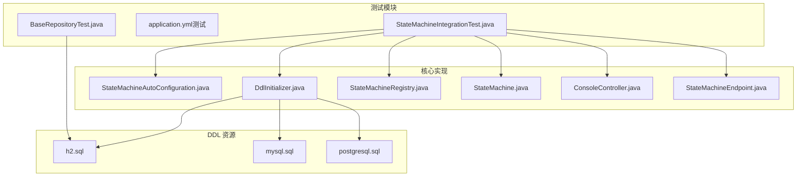
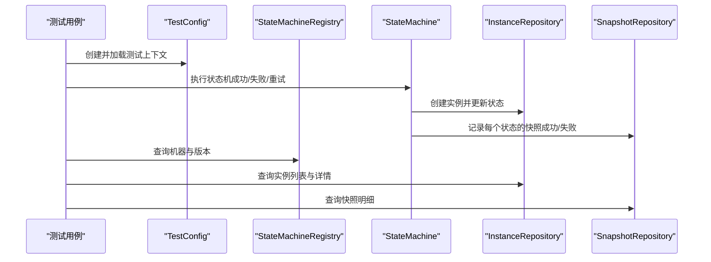
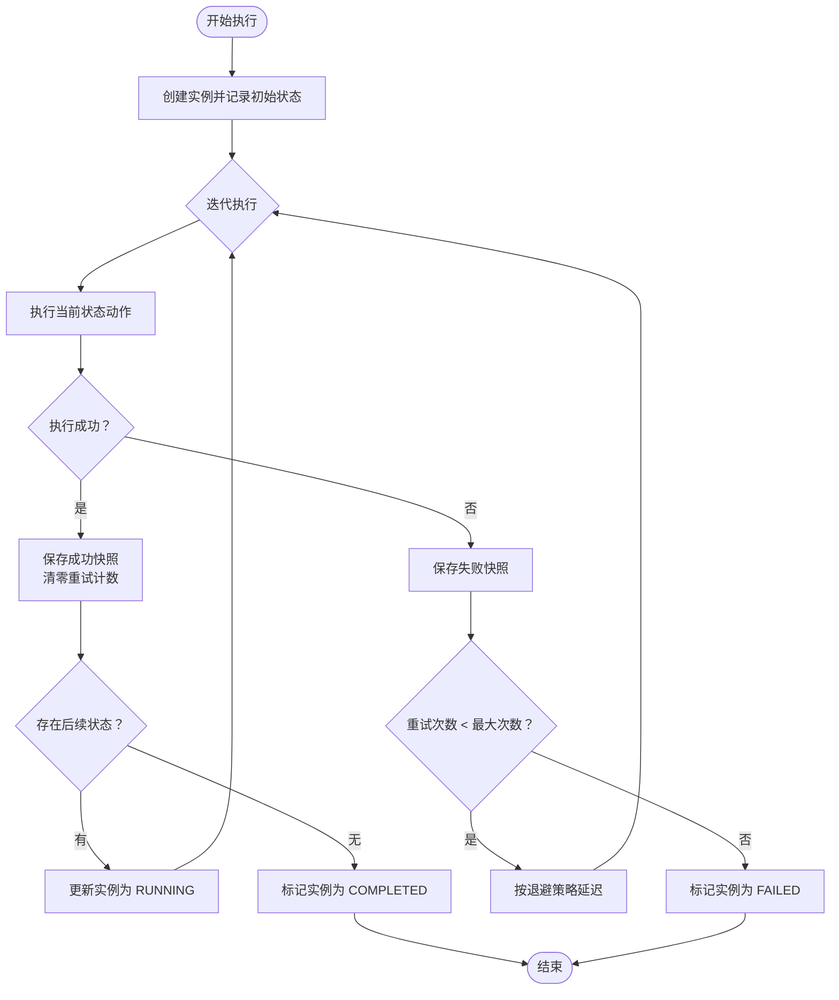
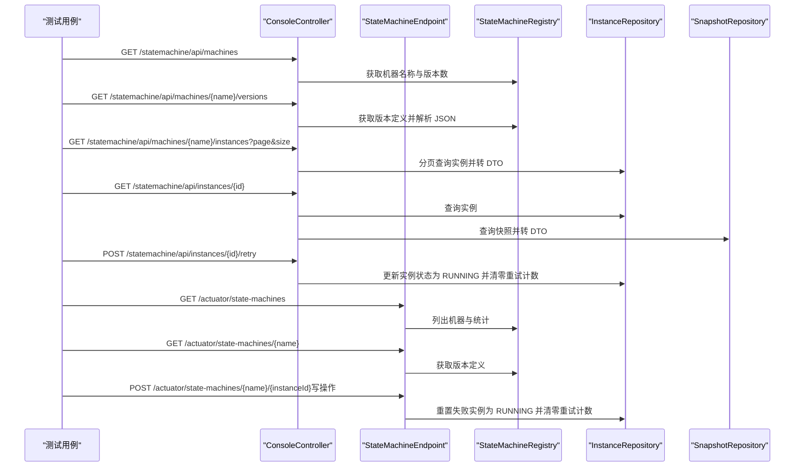
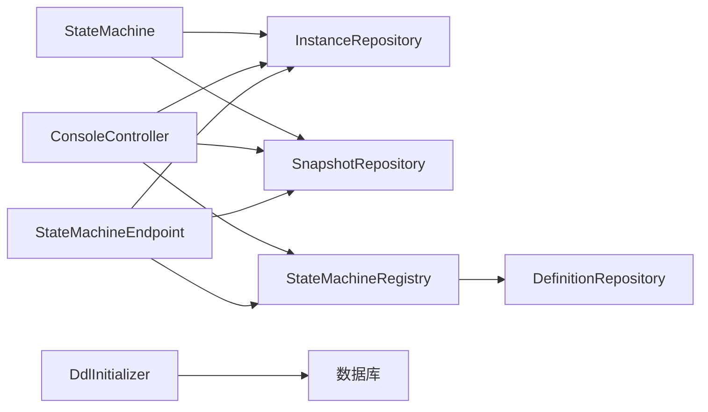

# 集成测试

<cite>
**本文引用的文件**
- [StateMachineIntegrationTest.java](file://src/test/java/cn/chedejun/statemachine/integration/StateMachineIntegrationTest.java)
- [application.yml（测试）](file://src/test/resources/application.yml)
- [application.yml（演示应用）](file://demo/src/main/resources/application.yml)
- [StateMachineAutoConfiguration.java](file://src/main/java/cn/chedejun/statemachine/autoconfigure/StateMachineAutoConfiguration.java)
- [DdlInitializer.java](file://src/main/java/cn/chedejun/statemachine/persistence/DdlInitializer.java)
- [ConsoleController.java](file://src/main/java/cn/chedejun/statemachine/management/ConsoleController.java)
- [StateMachineEndpoint.java](file://src/main/java/cn/chedejun/statemachine/management/StateMachineEndpoint.java)
- [StateMachine.java](file://src/main/java/cn/chedejun/statemachine/core/StateMachine.java)
- [StateMachineRegistry.java](file://src/main/java/cn/chedejun/statemachine/core/StateMachineRegistry.java)
- [h2.sql](file://src/main/resources/ddl/h2.sql)
- [mysql.sql](file://src/main/resources/ddl/mysql.sql)
- [postgresql.sql](file://src/main/resources/ddl/postgresql.sql)
- [BaseRepositoryTest.java](file://src/test/java/cn/chedejun/statemachine/persistence/BaseRepositoryTest.java)
- [pom.xml](file://pom.xml)
</cite>

## 目录
1. [简介](#简介)
2. [项目结构](#项目结构)
3. [核心组件](#核心组件)
4. [架构总览](#架构总览)
5. [详细组件分析](#详细组件分析)
6. [依赖分析](#依赖分析)
7. [性能考虑](#性能考虑)
8. [故障排查指南](#故障排查指南)
9. [结论](#结论)
10. [附录](#附录)

## 简介
本文件系统性阐述状态机集成测试的设计与实现，重点围绕 StateMachineIntegrationTest 的完整测试流程展开，覆盖 Spring Boot 测试配置、数据库 DDL 初始化与清理、状态机执行流程（成功/失败/重试）、REST API 与 Actuator 端点测试，以及测试环境配置与外部依赖处理方法。文档旨在帮助读者快速理解并复用该集成测试方案。

## 项目结构
本仓库采用模块化组织：核心状态机实现位于主模块，演示应用位于 demo 模块，测试位于 src/test 下。集成测试集中于 integration 包，配合测试专用的 application.yml 与自定义 DDL 脚本资源。

图表来源
- [StateMachineIntegrationTest.java:43-54](file://src/test/java/cn/chedejun/statemachine/integration/StateMachineIntegrationTest.java#L43-L54)
- [StateMachineAutoConfiguration.java:22-80](file://src/main/java/cn/chedejun/statemachine/autoconfigure/StateMachineAutoConfiguration.java#L22-L80)
- [DdlInitializer.java:9-54](file://src/main/java/cn/chedejun/statemachine/persistence/DdlInitializer.java#L9-L54)
- [h2.sql:1-18](file://src/main/resources/ddl/h2.sql#L1-L18)
- [mysql.sql:1-18](file://src/main/resources/ddl/mysql.sql#L1-L18)
- [postgresql.sql:1-18](file://src/main/resources/ddl/postgresql.sql#L1-L18)

章节来源
- [StateMachineIntegrationTest.java:43-54](file://src/test/java/cn/chedejun/statemachine/integration/StateMachineIntegrationTest.java#L43-L54)
- [pom.xml:33-67](file://pom.xml#L33-L67)

## 核心组件
- 测试配置与上下文
  - 使用 @SpringBootTest 指定测试配置类 TestConfig，导入数据源、JdbcTemplate、Jackson 与状态机自动配置，确保在真实 Spring 上下文中运行。
  - 通过 properties 属性设置数据源连接信息、DDL 行为及管理功能开关，保证与演示应用一致的配置体验。
- DDL 初始化与清理
  - DdlExecutor 在测试启动时清理历史定义与实例表，再按数据库类型加载对应 DDL 脚本，确保测试环境干净且具备一致的表结构。
  - 测试前/后分别清理实例与快照表，避免跨用例污染；定义表仅在上下文启动时注册一次。
- 状态机与执行
  - 定义两条状态机：一条成功流程（validate → process → complete），一条失败流程（will-fail 抛异常），并配置指数退避重试策略。
  - 执行流程中持久化实例与快照，记录状态、尝试次数与错误信息；失败时根据重试策略进行延迟重试。
- 管理与监控
  - ConsoleController 提供 Web 控制台接口，支持列出机器、版本、实例与详情，以及触发重试。
  - StateMachineEndpoint 作为 Actuator 端点，提供只读查询与写操作（重置失败实例为可重试状态）。

章节来源
- [StateMachineIntegrationTest.java:58-92](file://src/test/java/cn/chedejun/statemachine/integration/StateMachineIntegrationTest.java#L58-L92)
- [DdlInitializer.java:20-43](file://src/main/java/cn/chedejun/statemachine/persistence/DdlInitializer.java#L20-L43)
- [StateMachine.java:40-136](file://src/main/java/cn/chedejun/statemachine/core/StateMachine.java#L40-L136)
- [ConsoleController.java:15-106](file://src/main/java/cn/chedejun/statemachine/management/ConsoleController.java#L15-L106)
- [StateMachineEndpoint.java:16-73](file://src/main/java/cn/chedejun/statemachine/management/StateMachineEndpoint.java#L16-L73)

## 架构总览
下图展示集成测试的端到端调用链：测试驱动状态机执行，状态机持久化实例与快照，控制台与 Actuator 读取并呈现结果。

图表来源
- [StateMachineIntegrationTest.java:107-117](file://src/test/java/cn/chedejun/statemachine/integration/StateMachineIntegrationTest.java#L107-L117)
- [StateMachine.java:40-136](file://src/main/java/cn/chedejun/statemachine/core/StateMachine.java#L40-L136)
- [ConsoleController.java:62-89](file://src/main/java/cn/chedejun/statemachine/management/ConsoleController.java#L62-L89)
- [StateMachineEndpoint.java:32-71](file://src/main/java/cn/chedejun/statemachine/management/StateMachineEndpoint.java#L32-L71)

## 详细组件分析

### Spring Boot 测试配置与自动装配
- @SpringBootTest(classes = TestConfig.class, properties = {...}) 指定测试配置类与属性，确保加载数据源、JDBC、Jackson 与状态机自动配置。
- TestConfig 中：
  - DdlExecutor 清理旧数据并执行 DDL，适配 PostgreSQL 脚本。
  - 注册两条状态机：成功流程与失败流程（带重试策略）。
  - 可选加载管理端点与控制台控制器（取决于类路径是否包含 Actuator/Web）。
- 自动配置 StateMachineAutoConfiguration：
  - 条件装配：当存在 DataSource 与 JdbcTemplate 时初始化 DdlInitializer、DefinitionRepository、StateMachineRegistry。
  - BeanPostProcessor 将每个 StateMachine 实例注入 JdbcTemplate、Registry 并注册到 Registry。
  - 条件启用管理端点与控制台控制器，受 state-machine.management.console 开关控制。

章节来源
- [StateMachineIntegrationTest.java:43-54](file://src/test/java/cn/chedejun/statemachine/integration/StateMachineIntegrationTest.java#L43-L54)
- [StateMachineIntegrationTest.java:58-92](file://src/test/java/cn/chedejun/statemachine/integration/StateMachineIntegrationTest.java#L58-L92)
- [StateMachineAutoConfiguration.java:22-80](file://src/main/java/cn/chedejun/statemachine/autoconfigure/StateMachineAutoConfiguration.java#L22-L80)

### 数据库集成测试：DDL 执行、数据清理与测试数据准备
- DDL 执行
  - DdlInitializer 根据数据源 URL 探测数据库类型，加载对应脚本（优先 PostgreSQL，其次 MySQL，最后回退 H2），分条执行 SQL。
  - 测试中的 DdlExecutor 在每次启动时先清理三张表，再执行 DDL，确保测试隔离。
- 数据清理
  - @BeforeEach 清理实例与快照表；定义表不清理，避免重复注册。
  - @AfterEach 输出当前三类表的计数，便于调试。
- 测试数据准备
  - 通过状态机执行生成实例与快照；控制台与 Actuator 读取这些数据进行断言。

章节来源
- [DdlInitializer.java:20-43](file://src/main/java/cn/chedejun/statemachine/persistence/DdlInitializer.java#L20-L43)
- [StateMachineIntegrationTest.java:33-41](file://src/test/java/cn/chedejun/statemachine/integration/StateMachineIntegrationTest.java#L33-L41)
- [StateMachineIntegrationTest.java:119-124](file://src/test/java/cn/chedejun/statemachine/integration/StateMachineIntegrationTest.java#L119-L124)
- [StateMachineIntegrationTest.java:336-345](file://src/test/java/cn/chedejun/statemachine/integration/StateMachineIntegrationTest.java#L336-L345)

### 状态机执行流程测试：成功、失败与重试
- 成功流程
  - 验证上下文状态逐级推进（validate → process → complete），实例最终状态为 COMPLETED，快照数量与顺序正确，所有快照状态为 SUCCESS。
- 失败流程
  - 验证抛出状态机异常，实例状态为 FAILED，快照状态均为 FAILED。
- 重试机制
  - 将失败实例重置为 RUNNING 并清零重试计数，再次执行后仍失败，验证重试策略生效与实例状态更新。
- 目标状态与提前终止
  - 当指定目标状态并在条件满足时，实例状态为 REACHED；否则到达终结状态为 COMPLETED。

图表来源
- [StateMachine.java:83-136](file://src/main/java/cn/chedejun/statemachine/core/StateMachine.java#L83-L136)

章节来源
- [StateMachineIntegrationTest.java:159-182](file://src/test/java/cn/chedejun/statemachine/integration/StateMachineIntegrationTest.java#L159-L182)
- [StateMachineIntegrationTest.java:204-234](file://src/test/java/cn/chedejun/statemachine/integration/StateMachineIntegrationTest.java#L204-L234)
- [StateMachine.java:40-136](file://src/main/java/cn/chedejun/statemachine/core/StateMachine.java#L40-L136)

### REST API 与 Actuator 端点测试
- 控制台接口（ConsoleController）
  - 列出机器与版本数量、实例总数与状态分布。
  - 获取指定机器的版本定义（解析 states/transitions/retryPolicy）。
  - 分页查询实例列表与详情，返回 DTO 结构。
  - 触发重试：将实例重置为 RUNNING 并清零重试计数，提示重新执行。
- Actuator 端点（StateMachineEndpoint）
  - 读操作：列出机器、获取版本定义。
  - 写操作：将失败实例重置为 RUNNING 并清零重试计数，返回提示信息。

图表来源
- [ConsoleController.java:34-104](file://src/main/java/cn/chedejun/statemachine/management/ConsoleController.java#L34-L104)
- [StateMachineEndpoint.java:32-71](file://src/main/java/cn/chedejun/statemachine/management/StateMachineEndpoint.java#L32-L71)
- [StateMachineIntegrationTest.java:238-332](file://src/test/java/cn/chedejun/statemachine/integration/StateMachineIntegrationTest.java#L238-L332)

章节来源
- [ConsoleController.java:15-106](file://src/main/java/cn/chedejun/statemachine/management/ConsoleController.java#L15-L106)
- [StateMachineEndpoint.java:16-73](file://src/main/java/cn/chedejun/statemachine/management/StateMachineEndpoint.java#L16-L73)
- [StateMachineIntegrationTest.java:238-332](file://src/test/java/cn/chedejun/statemachine/integration/StateMachineIntegrationTest.java#L238-L332)

### 测试环境配置与外部依赖处理
- 测试配置
  - application.yml（测试）与演示应用一致，均启用管理与控制台，并暴露 Actuator 端点。
  - 测试类通过 @SpringBootTest 的 properties 设置数据源连接参数，确保与演示应用一致。
- 外部依赖
  - pom.xml 引入 Spring Boot Starter JDBC/Web/Actuator，测试依赖 H2 与 PostgreSQL 驱动，以支持内存与外部数据库测试。
  - DdlInitializer 支持多数据库类型脚本，优先 PostgreSQL，其次 MySQL，最后回退 H2，保证不同环境一致性。

章节来源
- [application.yml（测试）:1-14](file://src/test/resources/application.yml#L1-L14)
- [application.yml（演示应用）:18-23](file://demo/src/main/resources/application.yml#L18-L23)
- [pom.xml:33-67](file://pom.xml#L33-L67)
- [DdlInitializer.java:45-52](file://src/main/java/cn/chedejun/statemachine/persistence/DdlInitializer.java#L45-L52)

## 依赖分析
- 组件耦合
  - StateMachine 依赖 JdbcTemplate、InstanceRepository、SnapshotRepository 进行持久化；通过 BeanPostProcessor 注入。
  - StateMachineRegistry 负责状态机注册与定义持久化，同时维护内存映射。
  - ConsoleController 与 StateMachineEndpoint 均依赖 Registry 与 Repository 进行数据读取与写入。
- 外部依赖
  - 数据库驱动：PostgreSQL（测试）、H2（本地测试基类）。
  - Spring 生态：JDBC、Web、Actuator、Jackson。
- 循环依赖风险
  - 通过延迟注入与 BeanPostProcessor 解决初始化顺序问题，避免直接循环依赖。

图表来源
- [StateMachine.java:188-195](file://src/main/java/cn/chedejun/statemachine/core/StateMachine.java#L188-L195)
- [StateMachineRegistry.java:21-49](file://src/main/java/cn/chedejun/statemachine/core/StateMachineRegistry.java#L21-L49)
- [ConsoleController.java:28-32](file://src/main/java/cn/chedejun/statemachine/management/ConsoleController.java#L28-L32)
- [StateMachineEndpoint.java:24-30](file://src/main/java/cn/chedejun/statemachine/management/StateMachineEndpoint.java#L24-L30)
- [DdlInitializer.java:25-42](file://src/main/java/cn/chedejun/statemachine/persistence/DdlInitializer.java#L25-L42)

章节来源
- [StateMachine.java:188-195](file://src/main/java/cn/chedejun/statemachine/core/StateMachine.java#L188-L195)
- [StateMachineRegistry.java:21-49](file://src/main/java/cn/chedejun/statemachine/core/StateMachineRegistry.java#L21-L49)
- [ConsoleController.java:28-32](file://src/main/java/cn/chedejun/statemachine/management/ConsoleController.java#L28-L32)
- [StateMachineEndpoint.java:24-30](file://src/main/java/cn/chedejun/statemachine/management/StateMachineEndpoint.java#L24-L30)
- [DdlInitializer.java:25-42](file://src/main/java/cn/chedejun/statemachine/persistence/DdlInitializer.java#L25-L42)

## 性能考虑
- 数据库访问
  - 批量 SQL（按分号拆分）与最小化 JDBC 调用，避免 N+1 查询。
  - 使用 JdbcTemplate 执行 DDL 与清理，减少 ORM 开销。
- 重试策略
  - 指数退避降低数据库压力峰值，避免“惊群”效应。
- 序列化成本
  - Jackson 序列化/反序列化 Context 与 JSON 字段，建议在高并发场景下评估序列化开销。

## 故障排查指南
- DDL 初始化失败
  - 检查数据库类型识别逻辑与资源路径；确认对应 DDL 脚本存在。
- 状态机未注册或未初始化
  - 确认 DataSource 存在且 JdbcTemplate 可用；检查 BeanPostProcessor 是否生效。
- 控制台/Actuator 不可用
  - 确认类路径包含 Web 与 Actuator；检查 state-machine.management/console 开关。
- 快照/实例数据异常
  - 查看 @AfterEach 输出的三类表计数；核对执行流程与重试逻辑。

章节来源
- [DdlInitializer.java:20-43](file://src/main/java/cn/chedejun/statemachine/persistence/DdlInitializer.java#L20-L43)
- [StateMachineAutoConfiguration.java:44-56](file://src/main/java/cn/chedejun/statemachine/autoconfigure/StateMachineAutoConfiguration.java#L44-L56)
- [StateMachineIntegrationTest.java:336-345](file://src/test/java/cn/chedejun/statemachine/integration/StateMachineIntegrationTest.java#L336-L345)

## 结论
该集成测试通过真实的 Spring Boot 上下文、完整的 DDL 初始化与清理、端到端的状态机执行与重试验证，以及控制台与 Actuator 的 API 覆盖，构建了稳定可靠的状态机测试体系。测试配置与演示应用保持一致，便于在开发与生产环境中复用。

## 附录
- DDL 脚本差异
  - H2：使用 CLOB/TEXT 字段，兼容内存数据库。
  - MySQL：使用 JSON 字段，支持索引与查询优化。
  - PostgreSQL：使用 JSONB 字段，支持高效存储与检索。
- 测试数据准备最佳实践
  - 在 @BeforeEach 清理实例与快照；定义表仅在上下文启动时注册一次。
  - 使用断言验证实例状态、快照数量与内容，确保执行流程正确。

章节来源
- [h2.sql:1-18](file://src/main/resources/ddl/h2.sql#L1-L18)
- [mysql.sql:1-18](file://src/main/resources/ddl/mysql.sql#L1-L18)
- [postgresql.sql:1-18](file://src/main/resources/ddl/postgresql.sql#L1-L18)
- [BaseRepositoryTest.java:22-33](file://src/test/java/cn/chedejun/statemachine/persistence/BaseRepositoryTest.java#L22-L33)