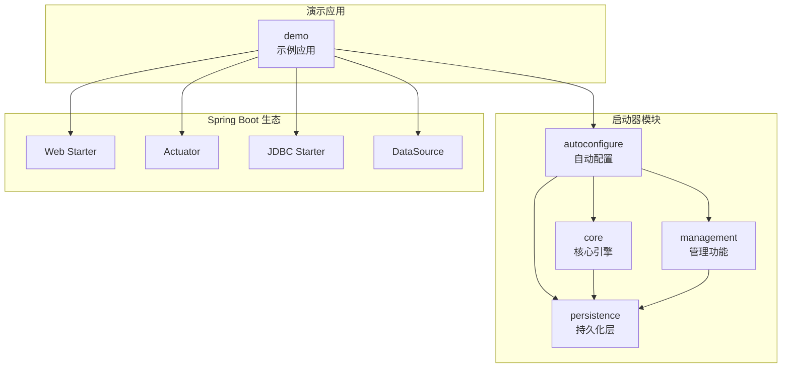
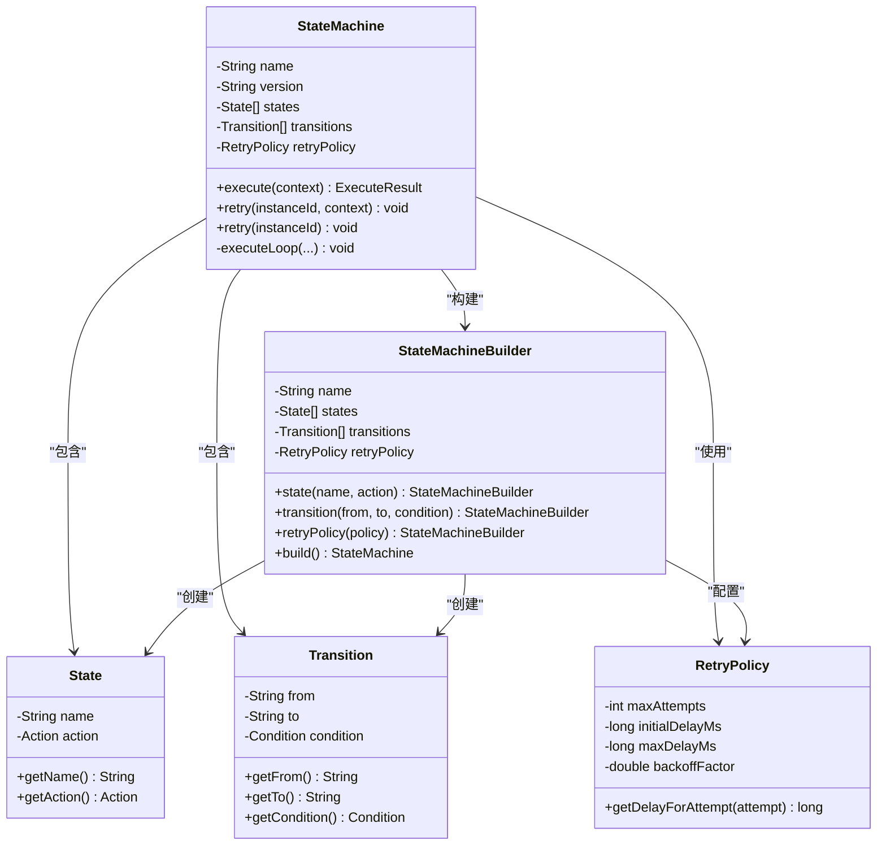
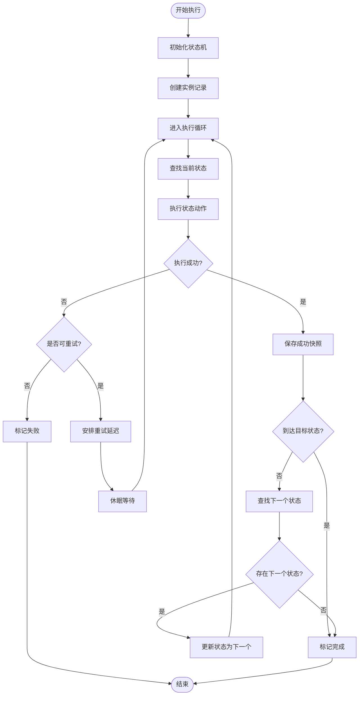
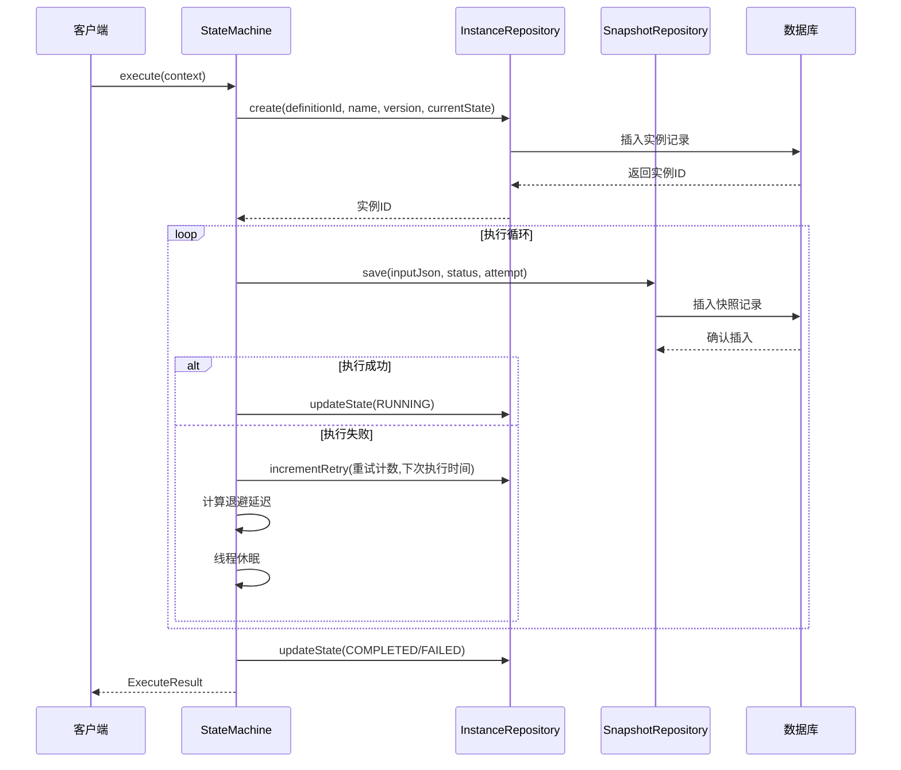
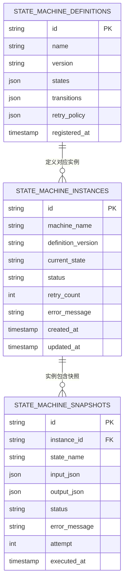
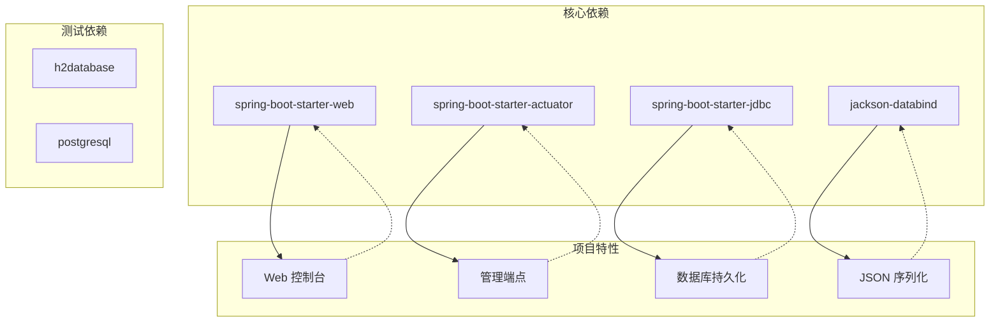
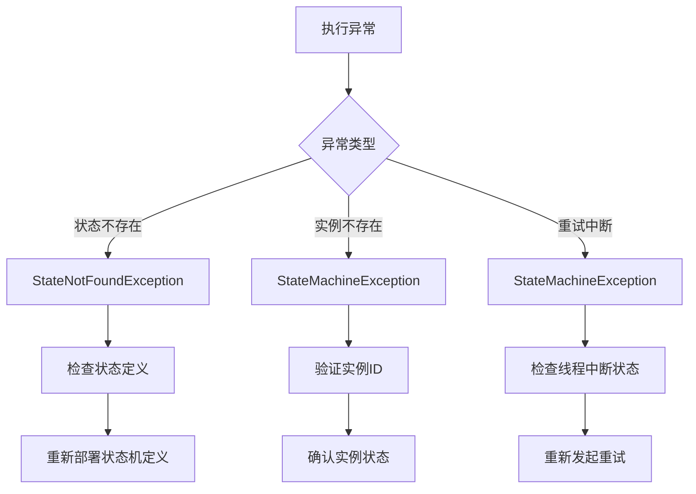

# 项目概述

<cite>
**本文档引用的文件**
- [README.md](file://README.md)
- [pom.xml](file://pom.xml)
- [StateMachineAutoConfiguration.java](file://src/main/java/cn/chedejun/statemachine/autoconfigure/StateMachineAutoConfiguration.java)
- [StateMachineProperties.java](file://src/main/java/cn/chedejun/statemachine/autoconfigure/StateMachineProperties.java)
- [StateMachine.java](file://src/main/java/cn/chedejun/statemachine/core/StateMachine.java)
- [StateMachineBuilder.java](file://src/main/java/cn/chedejun/statemachine/core/StateMachineBuilder.java)
- [RetryPolicy.java](file://src/main/java/cn/chedejun/statemachine/core/RetryPolicy.java)
- [State.java](file://src/main/java/cn/chedejun/statemachine/core/State.java)
- [Transition.java](file://src/main/java/cn/chedejun/statemachine/core/Transition.java)
- [Context.java](file://src/main/java/cn/chedejun/statemachine/core/Context.java)
- [ConsoleController.java](file://src/main/java/cn/chedejun/statemachine/management/ConsoleController.java)
- [DefinitionRepository.java](file://src/main/java/cn/chedejun/statemachine/persistence/DefinitionRepository.java)
- [application.yml](file://demo/src/main/resources/application.yml)
- [DemoApplication.java](file://demo/src/main/java/cn/chedejun/demo/DemoApplication.java)
- [CLAUDE.md](file://CLAUDE.md)
- [org.springframework.boot.autoconfigure.AutoConfiguration.imports](file://src/main/resources/META-INF/spring/org.springframework.boot.autoconfigure.AutoConfiguration.imports)
</cite>

## 目录
1. [引言](#引言)
2. [项目结构](#项目结构)
3. [核心组件](#核心组件)
4. [架构总览](#架构总览)
5. [详细组件分析](#详细组件分析)
6. [依赖分析](#依赖分析)
7. [性能考虑](#性能考虑)
8. [故障排除指南](#故障排除指南)
9. [结论](#结论)
10. [附录](#附录)

## 引言
本项目是一个基于 Spring Boot 的状态机工作流工具，旨在为业务流程提供可嵌入、可观察、可重试的状态机引擎。其核心价值在于：

- **条件分支**：通过条件表达式驱动状态流转，实现灵活的业务逻辑控制
- **步骤快照**：自动记录每个状态的输入输出上下文，支持失败后的精确恢复
- **失败重试（指数退避）**：内置智能重试机制，避免雪崩效应并提升系统韧性
- **管理控制台**：提供 Web 界面可视化查看流程图、实例列表和执行快照

该工具适用于需要复杂业务流程编排的场景，如订单处理、审批流程、数据处理管道等。

## 项目结构
项目采用模块化设计，主要分为以下层次：



**图表来源**
- [StateMachineAutoConfiguration.java:22-79](file://src/main/java/cn/chedejun/statemachine/autoconfigure/StateMachineAutoConfiguration.java#L22-L79)
- [pom.xml:33-67](file://pom.xml#L33-L67)

**章节来源**
- [pom.xml:13-19](file://pom.xml#L13-L19)
- [CLAUDE.md:29-56](file://CLAUDE.md#L29-L56)

## 核心组件
本项目的核心组件围绕状态机引擎展开，包含状态定义、转换规则、执行策略和持久化机制：

### 状态机核心架构


**图表来源**
- [StateMachine.java:11-35](file://src/main/java/cn/chedejun/statemachine/core/StateMachine.java#L11-L35)
- [StateMachineBuilder.java:8-52](file://src/main/java/cn/chedejun/statemachine/core/StateMachineBuilder.java#L8-L52)
- [State.java:3-15](file://src/main/java/cn/chedejun/statemachine/core/State.java#L3-L15)
- [Transition.java:3-19](file://src/main/java/cn/chedejun/statemachine/core/Transition.java#L3-L19)
- [RetryPolicy.java:5-44](file://src/main/java/cn/chedejun/statemachine/core/RetryPolicy.java#L5-L44)

### 执行流程控制


**图表来源**
- [StateMachine.java:83-136](file://src/main/java/cn/chedejun/statemachine/core/StateMachine.java#L83-L136)

**章节来源**
- [StateMachine.java:37-136](file://src/main/java/cn/chedejun/statemachine/core/StateMachine.java#L37-L136)
- [StateMachineBuilder.java:27-51](file://src/main/java/cn/chedejun/statemachine/core/StateMachineBuilder.java#L27-L51)

## 架构总览
项目采用 Spring Boot 自动配置机制，通过条件注解实现按需装配：

```mermaid
graph LR
subgraph "Spring Boot 启动"
A[DemoApplication] --> B[自动配置导入]
B --> C[StateMachineAutoConfiguration]
end
subgraph "自动配置条件"
D[@ConditionalOnClass JdbcTemplate]
E[@ConditionalOnBean DataSource]
F[@ConditionalOnProperty state-machine.management.enabled]
G[@ConditionalOnProperty state-machine.console.enabled]
end
subgraph "核心 Bean"
H[DdlInitializer]
I[DefinitionRepository]
J[StateMachineRegistry]
K[StateMachineEndpoint]
L[ConsoleController]
end
C --> D
C --> E
C --> F
C --> G
D --> H
E --> I
E --> J
E --> K
E --> L
```

**图表来源**
- [StateMachineAutoConfiguration.java:22-79](file://src/main/java/cn/chedejun/statemachine/autoconfigure/StateMachineAutoConfiguration.java#L22-L79)
- [org.springframework.boot.autoconfigure.AutoConfiguration.imports:1-2](file://src/main/resources/META-INF/spring/org.springframework.boot.autoconfigure.AutoConfiguration.imports#L1-L2)

### 配置体系
项目提供多层次配置支持：

| 配置项 | 默认值 | 作用域 | 描述 |
|--------|--------|--------|------|
| state-machine.ddl-auto | update | 全局 | DDL 自动更新策略 |
| state-machine.management.enabled | true | 管理端点 | Actuator 端点开关 |
| state-machine.console.enabled | true | Web 控制台 | 管理界面开关 |
| state-machine.retry.defaultMaxAttempts | 3 | 重试策略 | 最大重试次数 |
| state-machine.retry.defaultInitialDelayMs | 1000 | 重试策略 | 初始延迟毫秒 |
| state-machine.retry.defaultMaxDelayMs | 30000 | 重试策略 | 最大延迟毫秒 |
| state-machine.retry.defaultBackoffFactor | 2.0 | 重试策略 | 指数退避因子 |

**章节来源**
- [StateMachineAutoConfiguration.java:28-78](file://src/main/java/cn/chedejun/statemachine/autoconfigure/StateMachineAutoConfiguration.java#L28-L78)
- [StateMachineProperties.java:7-34](file://src/main/java/cn/chedejun/statemachine/autoconfigure/StateMachineProperties.java#L7-L34)

## 详细组件分析

### 状态机执行引擎
状态机执行引擎是整个系统的核心，负责状态流转、错误处理和重试机制：

#### 执行序列流程


**图表来源**
- [StateMachine.java:40-136](file://src/main/java/cn/chedejun/statemachine/core/StateMachine.java#L40-L136)

#### 重试策略实现
指数退避算法确保系统在故障时不会产生级联失败：

| 尝试次数 | 计算公式 | 延迟时间 | 说明 |
|----------|----------|----------|------|
| 1 | 1000 × 2.0^(1-1) | 1000ms | 初始延迟 |
| 2 | 1000 × 2.0^(2-1) | 2000ms | 第一次退避 |
| 3 | 1000 × 2.0^(3-1) | 4000ms | 第二次退避 |
| 4 | 1000 × 2.0^(4-1) | 8000ms | 第三次退避 |
| ≥5 | min(8000, 30000) | 30000ms | 达到最大延迟 |

**章节来源**
- [StateMachine.java:104-116](file://src/main/java/cn/chedejun/statemachine/core/StateMachine.java#L104-L116)
- [RetryPolicy.java:26-30](file://src/main/java/cn/chedejun/statemachine/core/RetryPolicy.java#L26-L30)

### 管理控制台功能
管理控制台提供完整的 Web 界面用于监控和调试状态机实例：

#### 控制台 API 设计
```mermaid
graph TB
subgraph "控制台界面"
A[首页 - 流程列表]
B[详情页 - 实例详情]
C[图表 - 流程图可视化]
end
subgraph "REST API"
D[/statemachine/api/machines - 获取机器列表]
E[/statemachine/api/machines/{name}/versions - 获取版本信息]
F[/statemachine/api/machines/{name}/instances - 获取实例分页]
G[/statemachine/api/instances/{id} - 获取实例详情]
H[/statemachine/api/instances/{id}/retry - 重新执行]
end
subgraph "数据交互"
I[StateMachineRegistry]
J[InstanceRepository]
K[SnapshotRepository]
end
A --> D
B --> F
B --> G
A --> E
B --> H
D --> I
E --> I
F --> J
G --> J
G --> K
H --> I
```

**图表来源**
- [ConsoleController.java:34-104](file://src/main/java/cn/chedejun/statemachine/management/ConsoleController.java#L34-L104)

**章节来源**
- [ConsoleController.java:19-104](file://src/main/java/cn/chedejun/statemachine/management/ConsoleController.java#L19-L104)

### 持久化层设计
系统采用三层持久化结构，分别存储状态机定义、实例状态和执行快照：

#### 数据模型关系


**图表来源**
- [DefinitionRepository.java:15-77](file://src/main/java/cn/chedejun/statemachine/persistence/DefinitionRepository.java#L15-L77)

**章节来源**
- [DefinitionRepository.java:24-46](file://src/main/java/cn/chedejun/statemachine/persistence/DefinitionRepository.java#L24-L46)

## 依赖分析
项目采用可选依赖设计，允许宿主应用按需引入所需功能：



**图表来源**
- [pom.xml:33-67](file://pom.xml#L33-L67)

### Spring Boot 集成要点
- **自动配置**：通过 `META-INF/spring/org.springframework.boot.autoconfigure.AutoConfiguration.imports` 实现
- **条件装配**：使用 `@ConditionalOnClass`、`@ConditionalOnBean`、`@ConditionalOnProperty` 实现智能装配
- **Bean 后处理器**：`BeanPostProcessor` 自动注入 JDBC 模板和注册表

**章节来源**
- [pom.xml:33-67](file://pom.xml#L33-L67)
- [StateMachineAutoConfiguration.java:22-56](file://src/main/java/cn/chedejun/statemachine/autoconfigure/StateMachineAutoConfiguration.java#L22-L56)

## 性能考虑
基于状态机的工作特点，项目在性能方面采取了以下优化措施：

### 内存管理
- **延迟初始化**：JDBC 模板和相关仓库在 BeanPostProcessor 中延迟注入，避免不必要的初始化开销
- **不可变集合**：状态和转换列表在构建完成后转为不可变，减少并发修改成本
- **对象池化**：Jackson ObjectMapper 在初始化时创建，避免重复创建开销

### 数据库优化
- **批量操作**：定义信息以 JSON 形式存储，减少表关联查询
- **索引策略**：按机器名称、状态、时间戳建立复合索引
- **连接池**：依赖 Spring Boot 自动配置的 HikariCP 连接池

### 并发控制
- **状态隔离**：每个实例独立的状态机实例，避免全局锁竞争
- **原子操作**：重试计数和状态更新使用数据库事务保证一致性
- **超时保护**：执行循环设置最大迭代次数，防止无限循环

## 故障排除指南
针对常见问题提供诊断和解决方案：

### 启动阶段问题
| 问题症状 | 可能原因 | 解决方案 |
|----------|----------|----------|
| 状态机未初始化 | 缺少 DataSource | 添加数据库连接配置 |
| 控制台不可用 | web starter 未引入 | 添加 spring-boot-starter-web |
| 管理端点失效 | actuator 未启用 | 添加 spring-boot-starter-actuator |
| DDL 不生效 | ddl-auto 配置错误 | 检查 state-machine.ddl-auto 设置 |

### 运行时异常


**图表来源**
- [StateMachine.java:91-116](file://src/main/java/cn/chedejun/statemachine/core/StateMachine.java#L91-L116)

### 调试建议
1. **启用详细日志**：配置 `logging.level.cn.chedejun.statemachine=DEBUG`
2. **检查数据库连接**：确认 DataSource 配置正确
3. **验证状态机定义**：确保状态和转换条件完整
4. **监控重试行为**：观察重试计数和延迟时间

**章节来源**
- [StateMachine.java:178-180](file://src/main/java/cn/chedejun/statemachine/core/StateMachine.java#L178-L180)

## 结论
状态机启动器项目通过简洁而强大的 API 设计，为 Spring Boot 应用提供了企业级的状态机工作流解决方案。其核心优势体现在：

- **易用性**：通过 Builder 模式提供流畅的 DSL 接口
- **可靠性**：完善的错误处理和重试机制
- **可观测性**：完整的管理控制台和监控能力
- **可扩展性**：模块化设计支持定制化需求

该项目特别适合需要复杂业务流程编排的应用场景，能够显著提升系统的可维护性和可扩展性。

## 附录

### 快速开始示例
```java
@Bean
public StateMachine<OrderContext> orderMachine() {
    return StateMachineBuilder.<OrderContext>builder("order-process")
        .state("check-inventory", this::checkInventory)
        .state("pay", this::processPayment)
        .state("ship", this::processShipping)
        .transition("check-inventory", "pay", ctx -> ctx.getStock() > 0)
        .transition("check-inventory", "notify-shortage", ctx -> ctx.getStock() <= 0)
        .transition("pay", "ship", ctx -> true)
        .retryPolicy(RetryPolicy.exponentialBackoff()
            .maxAttempts(3)
            .initialDelay(1, TimeUnit.SECONDS)
            .maxDelay(30, TimeUnit.SECONDS))
        .build();
}
```

### 支持的数据库
- **H2**：开发和测试环境
- **MySQL**：生产环境首选
- **PostgreSQL**：高可用生产环境

### 版本兼容性
- **Java**：17+
- **Spring Boot**：3.2.5+
- **数据库**：MySQL 5.7+, PostgreSQL 10+, H2 2.0+