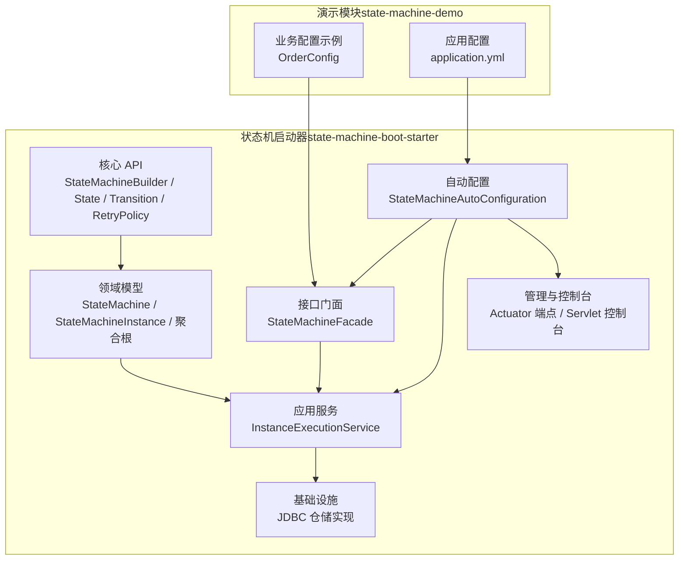
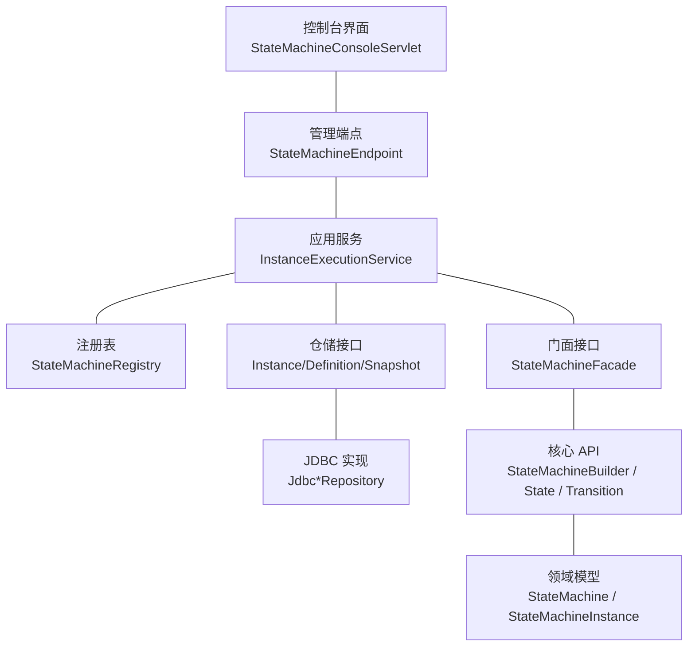
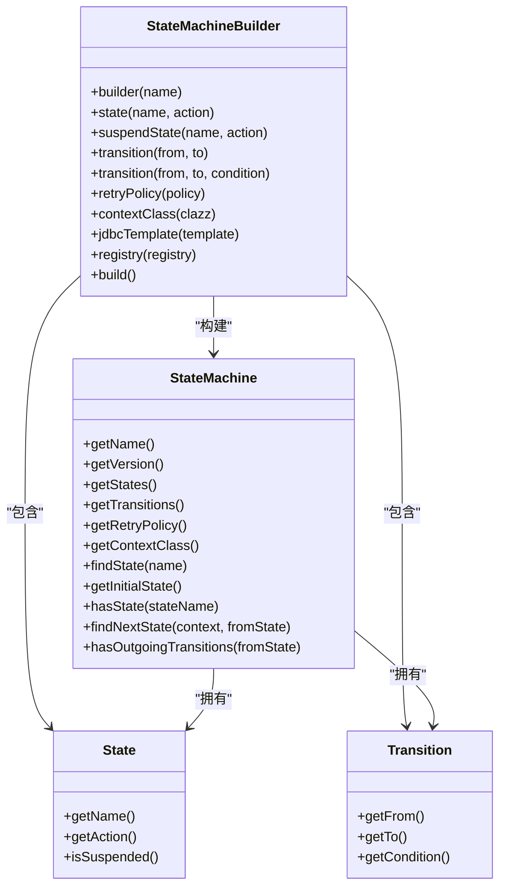
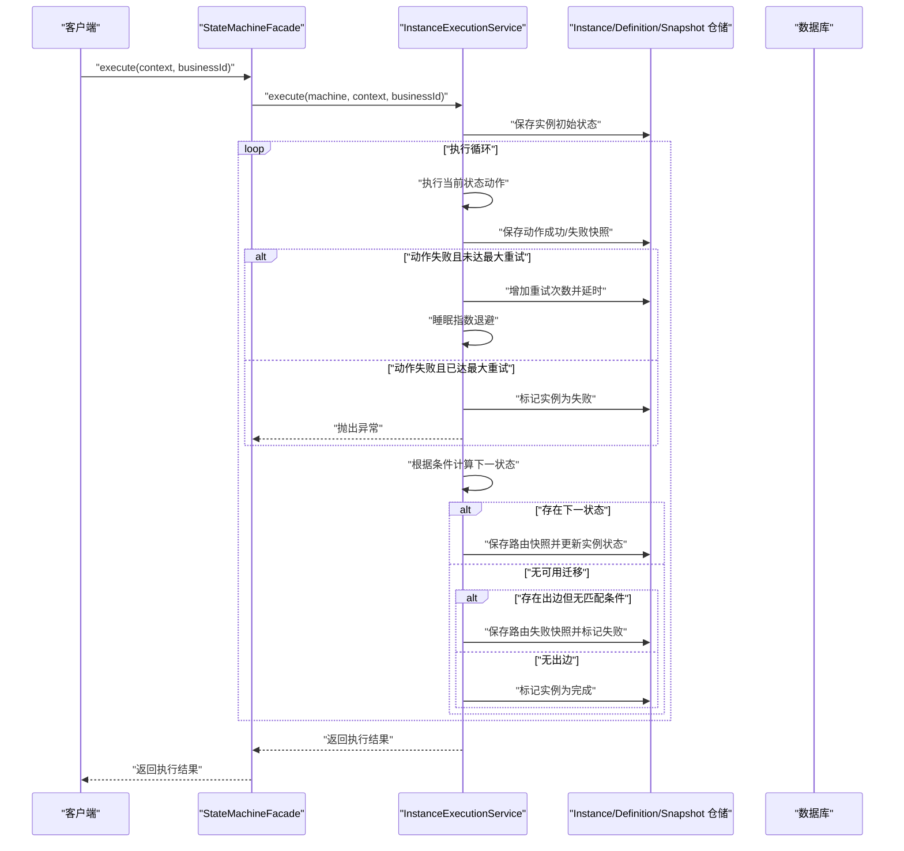
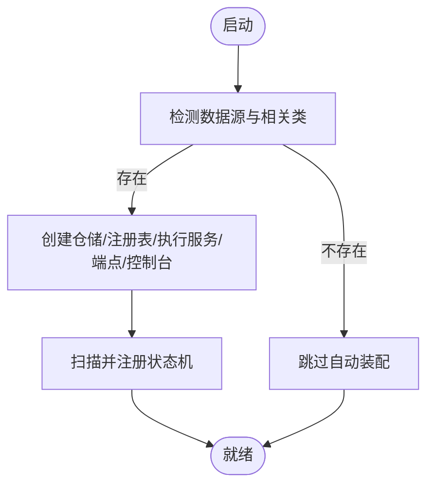
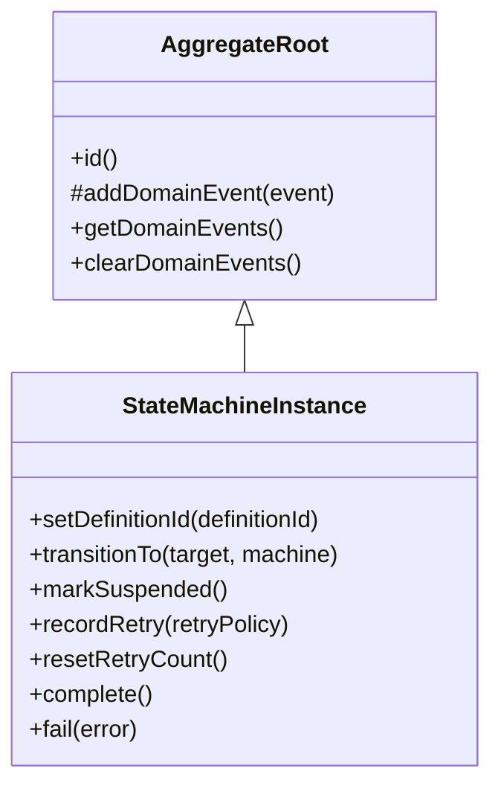
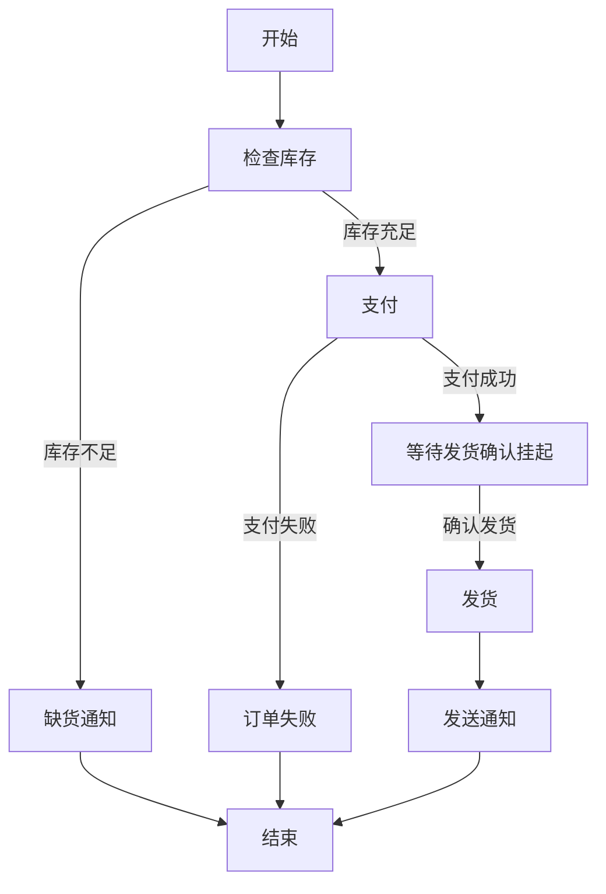
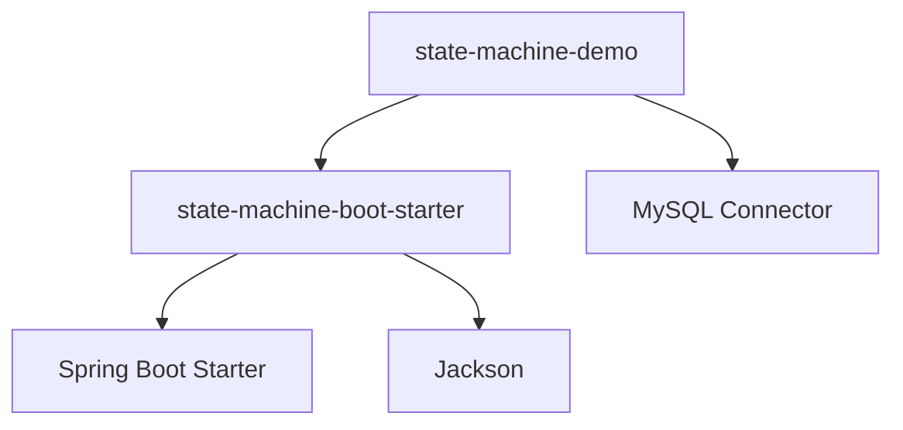

# 项目概述

<cite>
**本文引用的文件**
- [README.md](file://README.md)
- [state-machine-boot-starter/README.md](file://state-machine-boot-starter/README.md)
- [state-machine-boot-starter/pom.xml](file://state-machine-boot-starter/pom.xml)
- [state-machine-boot-starter/src/main/java/cn/chedejun/statemachine/core/StateMachineBuilder.java](file://state-machine-boot-starter/src/main/java/cn/chedejun/statemachine/core/StateMachineBuilder.java)
- [state-machine-boot-starter/src/main/java/cn/chedejun/statemachine/domain/engine/StateMachine.java](file://state-machine-boot-starter/src/main/java/cn/chedejun/statemachine/domain/engine/StateMachine.java)
- [state-machine-boot-starter/src/main/java/cn/chedejun/statemachine/autoconfigure/StateMachineAutoConfiguration.java](file://state-machine-boot-starter/src/main/java/cn/chedejun/statemachine/autoconfigure/StateMachineAutoConfiguration.java)
- [state-machine-boot-starter/src/main/java/cn/chedejun/statemachine/domain/shared/AggregateRoot.java](file://state-machine-boot-starter/src/main/java/cn/chedejun/statemachine/domain/shared/AggregateRoot.java)
- [state-machine-boot-starter/src/main/java/cn/chedejun/statemachine/domain/instance/StateMachineInstance.java](file://state-machine-boot-starter/src/main/java/cn/chedejun/statemachine/domain/instance/StateMachineInstance.java)
- [state-machine-boot-starter/src/main/java/cn/chedejun/statemachine/application/InstanceExecutionService.java](file://state-machine-boot-starter/src/main/java/cn/chedejun/statemachine/application/InstanceExecutionService.java)
- [state-machine-boot-starter/src/main/java/cn/chedejun/statemachine/interfaces/StateMachineFacade.java](file://state-machine-boot-starter/src/main/java/cn/chedejun/statemachine/interfaces/StateMachineFacade.java)
- [state-machine-boot-starter/src/main/java/cn/chedejun/statemachine/core/State.java](file://state-machine-boot-starter/src/main/java/cn/chedejun/statemachine/core/State.java)
- [state-machine-boot-starter/src/main/java/cn/chedejun/statemachine/core/Transition.java](file://state-machine-boot-starter/src/main/java/cn/chedejun/statemachine/core/Transition.java)
- [state-machine-demo/src/main/java/cn/chedejun/demo/config/OrderConfig.java](file://state-machine-demo/src/main/java/cn/chedejun/demo/config/OrderConfig.java)
- [state-machine-demo/src/main/resources/application.yml](file://state-machine-demo/src/main/resources/application.yml)
</cite>

## 目录
1. [引言](#引言)
2. [项目结构](#项目结构)
3. [核心组件](#核心组件)
4. [架构总览](#架构总览)
5. [详细组件分析](#详细组件分析)
6. [依赖关系分析](#依赖关系分析)
7. [性能考量](#性能考量)
8. [故障排查指南](#故障排查指南)
9. [结论](#结论)
10. [附录](#附录)

## 引言
本项目是一个基于 Spring Boot 的状态机工作流引擎，旨在通过领域驱动设计（DDD）与清晰的分层架构，提供可组合、可观测、可恢复的状态机执行能力。其核心价值在于：
- 将业务流程抽象为“状态-迁移-条件”的可演进模型，降低复杂流程的实现与维护成本
- 提供失败重试（指数退避）、执行快照、挂起/恢复、管理控制台等工程化能力
- 在 Spring 生态中以自动装配的方式快速集成，开箱即用

该引擎在 Spring Boot 生态中的定位是“启动器（starter）”，通过自动配置与门面接口，向业务应用暴露简洁易用的 API，同时隐藏持久化、快照、重试与管理端点等实现细节。

## 项目结构
项目采用多模块布局，核心模块为状态机启动器，演示模块用于展示典型业务场景的使用方式。

图表来源
- [state-machine-boot-starter/src/main/java/cn/chedejun/statemachine/core/StateMachineBuilder.java:1-52](file://state-machine-boot-starter/src/main/java/cn/chedejun/statemachine/core/StateMachineBuilder.java#L1-L52)
- [state-machine-boot-starter/src/main/java/cn/chedejun/statemachine/domain/engine/StateMachine.java:1-77](file://state-machine-boot-starter/src/main/java/cn/chedejun/statemachine/domain/engine/StateMachine.java#L1-L77)
- [state-machine-boot-starter/src/main/java/cn/chedejun/statemachine/application/InstanceExecutionService.java:1-296](file://state-machine-boot-starter/src/main/java/cn/chedejun/statemachine/application/InstanceExecutionService.java#L1-L296)
- [state-machine-boot-starter/src/main/java/cn/chedejun/statemachine/autoconfigure/StateMachineAutoConfiguration.java:1-149](file://state-machine-boot-starter/src/main/java/cn/chedejun/statemachine/autoconfigure/StateMachineAutoConfiguration.java#L1-L149)
- [state-machine-demo/src/main/java/cn/chedejun/demo/config/OrderConfig.java:1-95](file://state-machine-demo/src/main/java/cn/chedejun/demo/config/OrderConfig.java#L1-L95)

章节来源
- [state-machine-boot-starter/pom.xml:1-182](file://state-machine-boot-starter/pom.xml#L1-L182)
- [state-machine-boot-starter/README.md:1-65](file://state-machine-boot-starter/README.md#L1-L65)

## 核心组件
- 状态机构建器与核心类型
  - 构建器负责声明状态、迁移与重试策略，并生成不可变的领域对象
  - 核心类型包括状态、迁移、上下文、重试策略等
- 领域模型
  - 状态机定义：承载状态集合、迁移规则与重试策略
  - 实例聚合：封装一次执行的生命周期、状态、重试次数与错误信息
  - 聚合根基类：统一事件收集与清空机制
- 应用服务
  - 执行循环：从当前状态执行动作、记录快照、路由到下一状态、处理挂起与重试
  - 恢复与重试：基于快照与上下文进行恢复与重试
- 自动配置与门面
  - 自动装配 JDBC 仓储、注册表、管理端点与控制台
  - 门面接口对外暴露简洁 API，内部委托应用服务执行
- 演示与配置
  - 示例配置展示如何定义业务流程、挂起点与重试策略
  - 应用配置展示如何启用管理端点与控制台

章节来源
- [state-machine-boot-starter/src/main/java/cn/chedejun/statemachine/core/StateMachineBuilder.java:1-52](file://state-machine-boot-starter/src/main/java/cn/chedejun/statemachine/core/StateMachineBuilder.java#L1-L52)
- [state-machine-boot-starter/src/main/java/cn/chedejun/statemachine/domain/engine/StateMachine.java:1-77](file://state-machine-boot-starter/src/main/java/cn/chedejun/statemachine/domain/engine/StateMachine.java#L1-L77)
- [state-machine-boot-starter/src/main/java/cn/chedejun/statemachine/domain/instance/StateMachineInstance.java:1-81](file://state-machine-boot-starter/src/main/java/cn/chedejun/statemachine/domain/instance/StateMachineInstance.java#L1-L81)
- [state-machine-boot-starter/src/main/java/cn/chedejun/statemachine/domain/shared/AggregateRoot.java:1-29](file://state-machine-boot-starter/src/main/java/cn/chedejun/statemachine/domain/shared/AggregateRoot.java#L1-L29)
- [state-machine-boot-starter/src/main/java/cn/chedejun/statemachine/application/InstanceExecutionService.java:1-296](file://state-machine-boot-starter/src/main/java/cn/chedejun/statemachine/application/InstanceExecutionService.java#L1-L296)
- [state-machine-boot-starter/src/main/java/cn/chedejun/statemachine/interfaces/StateMachineFacade.java:1-52](file://state-machine-boot-starter/src/main/java/cn/chedejun/statemachine/interfaces/StateMachineFacade.java#L1-L52)
- [state-machine-boot-starter/src/main/java/cn/chedejun/statemachine/core/State.java:1-23](file://state-machine-boot-starter/src/main/java/cn/chedejun/statemachine/core/State.java#L1-L23)
- [state-machine-boot-starter/src/main/java/cn/chedejun/statemachine/core/Transition.java:1-20](file://state-machine-boot-starter/src/main/java/cn/chedejun/statemachine/core/Transition.java#L1-L20)

## 架构总览
本项目遵循 DDD 分层与关注点分离原则：
- 表现层：控制台 Servlet 与 Actuator 管理端点
- 应用层：应用服务编排执行、恢复与重试
- 领域层：状态机定义与实例聚合，表达业务规则
- 基础设施层：JDBC 仓储实现数据持久化

图表来源
- [state-machine-boot-starter/src/main/java/cn/chedejun/statemachine/autoconfigure/StateMachineAutoConfiguration.java:1-149](file://state-machine-boot-starter/src/main/java/cn/chedejun/statemachine/autoconfigure/StateMachineAutoConfiguration.java#L1-L149)
- [state-machine-boot-starter/src/main/java/cn/chedejun/statemachine/application/InstanceExecutionService.java:1-296](file://state-machine-boot-starter/src/main/java/cn/chedejun/statemachine/application/InstanceExecutionService.java#L1-L296)
- [state-machine-boot-starter/src/main/java/cn/chedejun/statemachine/interfaces/StateMachineFacade.java:1-52](file://state-machine-boot-starter/src/main/java/cn/chedejun/statemachine/interfaces/StateMachineFacade.java#L1-L52)
- [state-machine-boot-starter/src/main/java/cn/chedejun/statemachine/domain/engine/StateMachine.java:1-77](file://state-machine-boot-starter/src/main/java/cn/chedejun/statemachine/domain/engine/StateMachine.java#L1-L77)
- [state-machine-boot-starter/src/main/java/cn/chedejun/statemachine/domain/instance/StateMachineInstance.java:1-81](file://state-machine-boot-starter/src/main/java/cn/chedejun/statemachine/domain/instance/StateMachineInstance.java#L1-L81)

## 详细组件分析

### 状态机构建器与核心类型
- 设计理念
  - 通过链式 API 描述状态、迁移与重试策略，最终生成不可变的领域对象
  - 支持挂起状态，便于业务暂停与外部恢复
- 关键点
  - 状态名称与迁移方向必须非空校验
  - 默认重试策略为指数退避，可配置最大尝试次数与延迟上限
  - 上下文类型可自定义，确保序列化/反序列化一致性

图表来源
- [state-machine-boot-starter/src/main/java/cn/chedejun/statemachine/core/StateMachineBuilder.java:1-52](file://state-machine-boot-starter/src/main/java/cn/chedejun/statemachine/core/StateMachineBuilder.java#L1-L52)
- [state-machine-boot-starter/src/main/java/cn/chedejun/statemachine/core/State.java:1-23](file://state-machine-boot-starter/src/main/java/cn/chedejun/statemachine/core/State.java#L1-L23)
- [state-machine-boot-starter/src/main/java/cn/chedejun/statemachine/core/Transition.java:1-20](file://state-machine-boot-starter/src/main/java/cn/chedejun/statemachine/core/Transition.java#L1-L20)
- [state-machine-boot-starter/src/main/java/cn/chedejun/statemachine/domain/engine/StateMachine.java:1-77](file://state-machine-boot-starter/src/main/java/cn/chedejun/statemachine/domain/engine/StateMachine.java#L1-L77)

章节来源
- [state-machine-boot-starter/src/main/java/cn/chedejun/statemachine/core/StateMachineBuilder.java:1-52](file://state-machine-boot-starter/src/main/java/cn/chedejun/statemachine/core/StateMachineBuilder.java#L1-L52)
- [state-machine-boot-starter/src/main/java/cn/chedejun/statemachine/core/State.java:1-23](file://state-machine-boot-starter/src/main/java/cn/chedejun/statemachine/core/State.java#L1-L23)
- [state-machine-boot-starter/src/main/java/cn/chedejun/statemachine/core/Transition.java:1-20](file://state-machine-boot-starter/src/main/java/cn/chedejun/statemachine/core/Transition.java#L1-L20)

### 应用服务与执行流程
- 执行循环
  - 从初始状态开始，执行动作、记录成功/失败快照、根据条件路由到下一状态
  - 支持挂起点：若状态标记为挂起，则实例进入挂起状态并等待恢复
  - 重试策略：在达到最大尝试次数前，按指数退避延迟后继续执行
- 恢复与重试
  - 基于最后失败快照重建上下文，或允许传入新上下文进行重试
  - 恢复时校验期望状态与上下文合并，确保一致性
- 错误处理
  - 状态不存在、迁移不匹配、重试次数耗尽等均抛出明确异常
  - 记录失败原因与最终状态，便于诊断

图表来源
- [state-machine-boot-starter/src/main/java/cn/chedejun/statemachine/interfaces/StateMachineFacade.java:1-52](file://state-machine-boot-starter/src/main/java/cn/chedejun/statemachine/interfaces/StateMachineFacade.java#L1-L52)
- [state-machine-boot-starter/src/main/java/cn/chedejun/statemachine/application/InstanceExecutionService.java:1-296](file://state-machine-boot-starter/src/main/java/cn/chedejun/statemachine/application/InstanceExecutionService.java#L1-L296)
- [state-machine-boot-starter/src/main/java/cn/chedejun/statemachine/domain/instance/StateMachineInstance.java:1-81](file://state-machine-boot-starter/src/main/java/cn/chedejun/statemachine/domain/instance/StateMachineInstance.java#L1-L81)

章节来源
- [state-machine-boot-starter/src/main/java/cn/chedejun/statemachine/application/InstanceExecutionService.java:1-296](file://state-machine-boot-starter/src/main/java/cn/chedejun/statemachine/application/InstanceExecutionService.java#L1-L296)

### 自动配置与门面
- 自动配置
  - 条件装配：仅当存在数据源与相关类时才创建仓储、注册表、执行服务与管理端点
  - 注册表：扫描并注册所有状态机定义，支持版本化与回放
  - 控制台与管理端点：按属性开关启用，提供可视化与运维能力
- 门面接口
  - 对外保持稳定的 API 签名，内部委托应用服务执行，隔离领域对象与应用层

图表来源
- [state-machine-boot-starter/src/main/java/cn/chedejun/statemachine/autoconfigure/StateMachineAutoConfiguration.java:1-149](file://state-machine-boot-starter/src/main/java/cn/chedejun/statemachine/autoconfigure/StateMachineAutoConfiguration.java#L1-L149)

章节来源
- [state-machine-boot-starter/src/main/java/cn/chedejun/statemachine/autoconfigure/StateMachineAutoConfiguration.java:1-149](file://state-machine-boot-starter/src/main/java/cn/chedejun/statemachine/autoconfigure/StateMachineAutoConfiguration.java#L1-L149)
- [state-machine-boot-starter/src/main/java/cn/chedejun/statemachine/interfaces/StateMachineFacade.java:1-52](file://state-machine-boot-starter/src/main/java/cn/chedejun/statemachine/interfaces/StateMachineFacade.java#L1-L52)

### 领域模型与值对象
- 聚合根基类
  - 统一事件收集与清空，便于领域事件的发布与测试
- 实例聚合
  - 管理实例的生命周期：运行、挂起、完成、失败
  - 记录重试次数与错误信息，支持恢复与重试
- 状态机定义
  - 不可变领域对象，承载状态、迁移与重试策略
  - 提供状态查询与下一状态推断能力

图表来源
- [state-machine-boot-starter/src/main/java/cn/chedejun/statemachine/domain/shared/AggregateRoot.java:1-29](file://state-machine-boot-starter/src/main/java/cn/chedejun/statemachine/domain/shared/AggregateRoot.java#L1-L29)
- [state-machine-boot-starter/src/main/java/cn/chedejun/statemachine/domain/instance/StateMachineInstance.java:1-81](file://state-machine-boot-starter/src/main/java/cn/chedejun/statemachine/domain/instance/StateMachineInstance.java#L1-L81)

章节来源
- [state-machine-boot-starter/src/main/java/cn/chedejun/statemachine/domain/shared/AggregateRoot.java:1-29](file://state-machine-boot-starter/src/main/java/cn/chedejun/statemachine/domain/shared/AggregateRoot.java#L1-L29)
- [state-machine-boot-starter/src/main/java/cn/chedejun/statemachine/domain/instance/StateMachineInstance.java:1-81](file://state-machine-boot-starter/src/main/java/cn/chedejun/statemachine/domain/instance/StateMachineInstance.java#L1-L81)

### 概念性概览
对于初学者，可以将状态机引擎理解为“把业务流程写成一张图”：
- 状态：流程中的节点（如“检查库存”、“支付”、“发货”）
- 迁移：状态之间的连线，带条件判断（如库存充足则进入支付）
- 动作：执行某个业务操作（如调用支付网关）
- 快照：记录每次执行的输入与输出，便于审计与恢复
- 挂起：在关键节点暂停，等待人工或外部系统确认后再继续
- 重试：失败时按策略自动重试，避免一次性失败导致流程中断

## 依赖关系分析
- 技术栈
  - Spring Boot 2.7.x（JDBC、Web、Actuator）
  - Jackson 用于上下文序列化
  - H2/MySQL/PostgreSQL 用于测试与演示
- 模块依赖
  - 启动器模块提供核心 API、自动配置与演示模块
  - 演示模块展示如何在真实业务中使用状态机

图表来源
- [state-machine-boot-starter/pom.xml:57-98](file://state-machine-boot-starter/pom.xml#L57-L98)

章节来源
- [state-machine-boot-starter/pom.xml:1-182](file://state-machine-boot-starter/pom.xml#L1-L182)

## 性能考量
- 执行循环上限
  - 通过状态数与最大重试次数估算最大迭代次数，防止无限循环
- 快照与重试
  - 成功/失败快照减少重复执行成本；指数退避避免对下游系统造成冲击
- 数据持久化
  - 使用 JdbcTemplate 与单条更新语句，尽量减少往返与锁竞争
- 序列化
  - 上下文序列化失败时降级为空对象，保证流程继续执行

## 故障排查指南
- 常见错误与定位
  - 状态不存在：检查状态机定义与迁移是否正确
  - 迁移不匹配：核对条件函数与上下文字段
  - 重试次数耗尽：查看失败快照与日志，确认是否可恢复
  - 恢复失败：确认期望状态与实例当前状态一致，且上下文合并逻辑正确
- 日志与监控
  - 开启 JDBC 调试日志，观察 SQL 执行情况
  - 使用管理端点与控制台查看实例列表、执行快照与流程图

章节来源
- [state-machine-boot-starter/src/main/java/cn/chedejun/statemachine/application/InstanceExecutionService.java:1-296](file://state-machine-boot-starter/src/main/java/cn/chedejun/statemachine/application/InstanceExecutionService.java#L1-L296)
- [state-machine-demo/src/main/resources/application.yml:1-27](file://state-machine-demo/src/main/resources/application.yml#L1-L27)

## 结论
本项目以 DDD 为核心思想，结合 Spring Boot 的自动装配能力，提供了高内聚、低耦合、可扩展的状态机工作流引擎。它既适合初学者快速上手，也能满足生产环境对可靠性、可观测性与可运维性的要求。通过状态机定义、执行快照、挂起/恢复与重试策略，能够有效应对复杂业务流程中的不确定性与外部依赖风险。

## 附录
- 使用场景建议
  - 订单处理：库存检查、支付、发货、通知与异常处理
  - 审批流程：多级审批、挂起等待、条件路由
  - 数据处理：ETL 步骤编排、失败重试与断点续跑
- 配置要点
  - 启用管理端点与控制台，便于运维与调试
  - 合理设置重试策略与挂起点，平衡可靠性与吞吐量
  - 使用业务 ID 关联实例，便于跨系统追踪