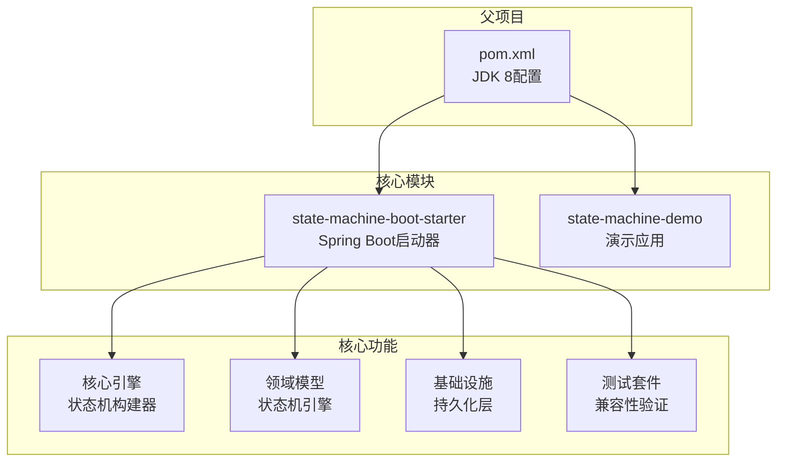
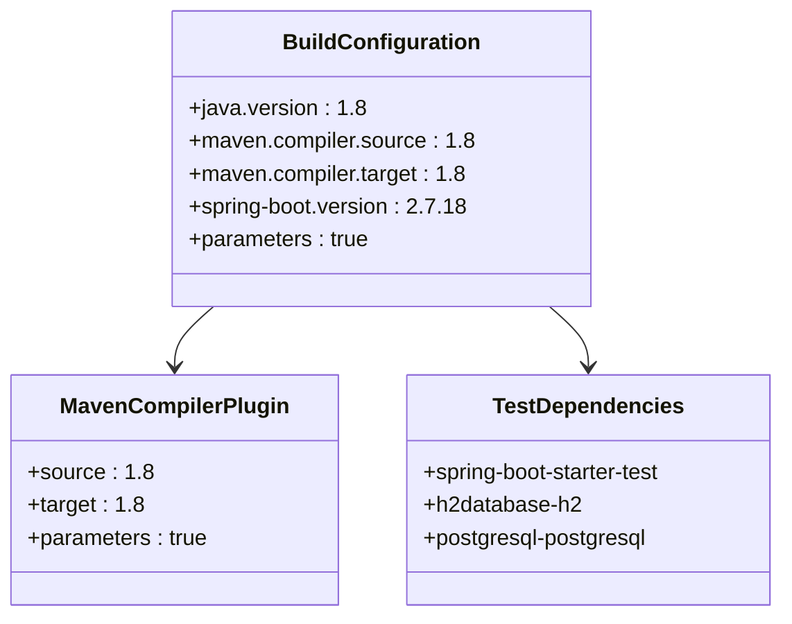
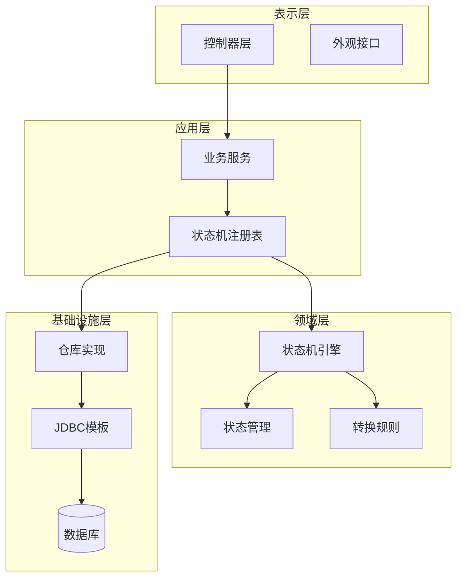
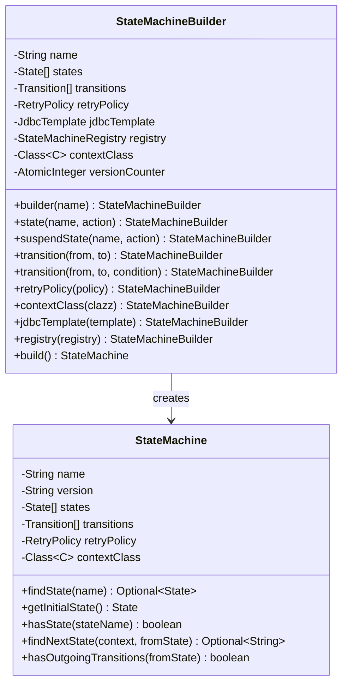
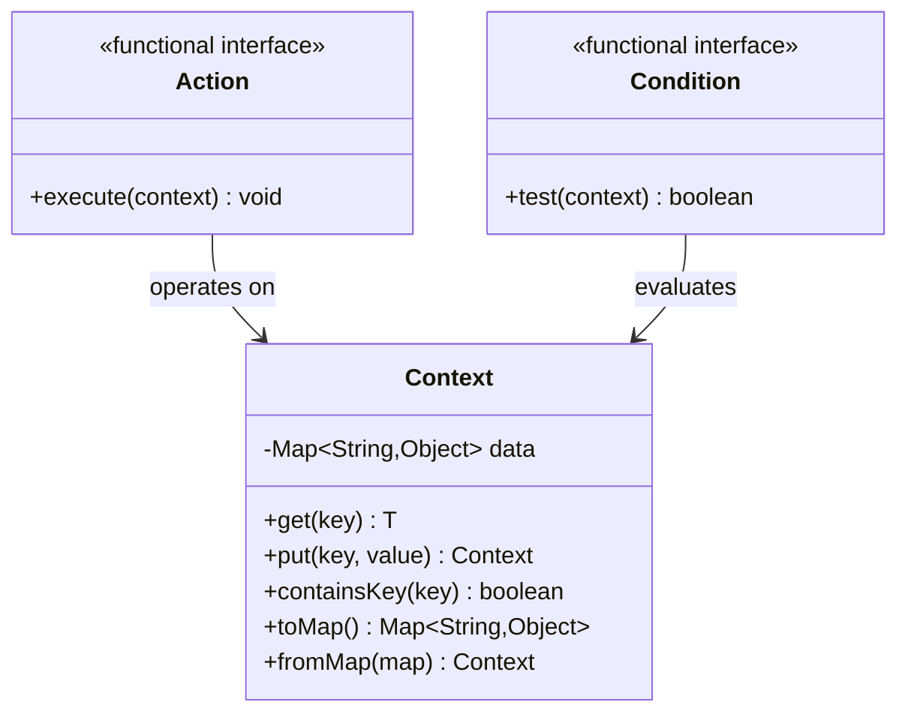
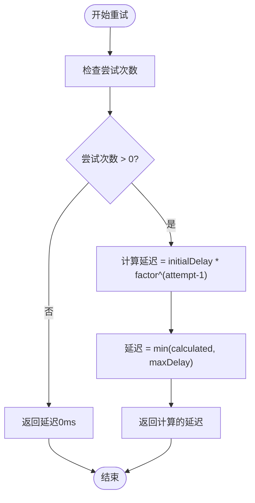
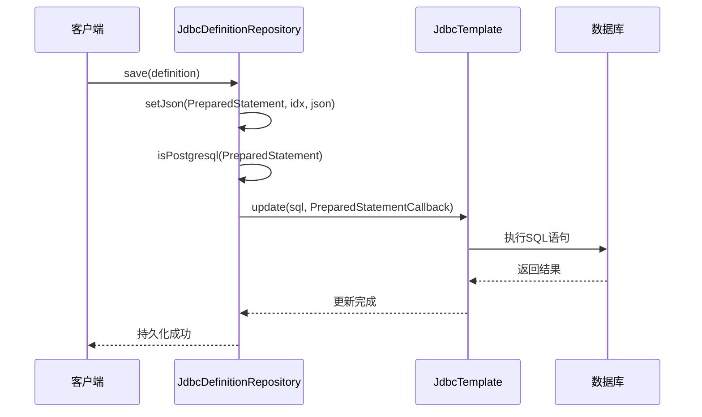
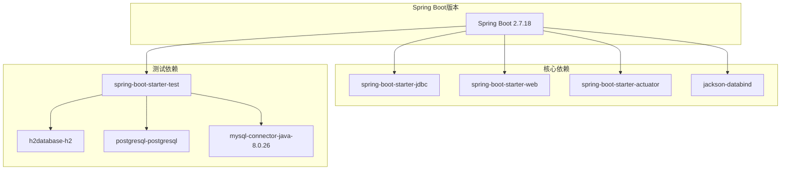
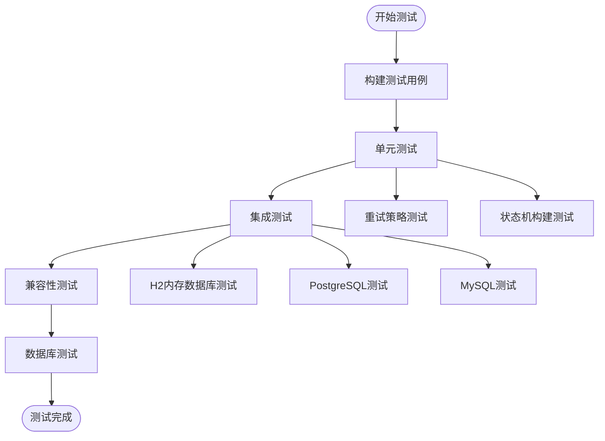

# JDK 8兼容性处理

<cite>
**本文档引用的文件**
- [pom.xml](file://pom.xml)
- [state-machine-boot-starter/pom.xml](file://state-machine-boot-starter/pom.xml)
- [StateMachineBuilder.java](file://state-machine-boot-starter/src/main/java/cn/chedejun/statemachine/core/StateMachineBuilder.java)
- [Action.java](file://state-machine-boot-starter/src/main/java/cn/chedejun/statemachine/core/Action.java)
- [Condition.java](file://state-machine-boot-starter/src/main/java/cn/chedejun/statemachine/core/Condition.java)
- [Context.java](file://state-machine-boot-starter/src/main/java/cn/chedejun/statemachine/core/Context.java)
- [RetryPolicy.java](file://state-machine-boot-starter/src/main/java/cn/chedejun/statemachine/core/RetryPolicy.java)
- [StateMachine.java](file://state-machine-boot-starter/src/main/java/cn/chedejun/statemachine/domain/engine/StateMachine.java)
- [AggregateRoot.java](file://state-machine-boot-starter/src/main/java/cn/chedejun/statemachine/domain/shared/AggregateRoot.java)
- [JdbcDefinitionRepository.java](file://state-machine-boot-starter/src/main/java/cn/chedejun/statemachine/infrastructure/persistence/JdbcDefinitionRepository.java)
- [StateMachineBuilderTest.java](file://state-machine-boot-starter/src/test/java/cn/chedejun/statemachine/core/StateMachineBuilderTest.java)
- [RetryPolicyTest.java](file://state-machine-boot-starter/src/test/java/cn/chedejun/statemachine/core/RetryPolicyTest.java)
</cite>

## 目录
1. [引言](#引言)
2. [项目结构](#项目结构)
3. [核心组件](#核心组件)
4. [架构概览](#架构概览)
5. [详细组件分析](#详细组件分析)
6. [依赖分析](#依赖分析)
7. [性能考虑](#性能考虑)
8. [故障排除指南](#故障排除指南)
9. [结论](#结论)
10. [附录](#附录)

## 引言

本文件专注于JDK 8兼容性处理的专门文档，详细解释从更高版本Java迁移到JDK 8的技术挑战和解决方案。该项目通过明确的构建配置和代码设计确保与JDK 8的完全兼容性，为需要在JDK 8环境中部署的企业级应用提供了可靠的解决方案。

## 项目结构

项目采用多模块Maven架构，主要包含以下核心模块：

**图表来源**
- [pom.xml:1-101](file://pom.xml#L1-L101)
- [state-machine-boot-starter/pom.xml:1-182](file://state-machine-boot-starter/pom.xml#L1-L182)

**章节来源**
- [pom.xml:1-101](file://pom.xml#L1-L101)
- [state-machine-boot-starter/pom.xml:1-182](file://state-machine-boot-starter/pom.xml#L1-L182)

## 核心组件

### 构建配置兼容性

项目通过明确的构建配置确保JDK 8兼容性：

**图表来源**
- [pom.xml:13-20](file://pom.xml#L13-L20)
- [pom.xml:76-99](file://pom.xml#L76-L99)
- [state-machine-boot-starter/pom.xml:36-43](file://state-machine-boot-starter/pom.xml#L36-L43)
- [state-machine-boot-starter/pom.xml:100-130](file://state-machine-boot-starter/pom.xml#L100-L130)

### 函数式接口兼容性

项目实现了完整的函数式接口体系，确保JDK 8环境下的Lambda表达式支持：

**章节来源**
- [Action.java:8-12](file://state-machine-boot-starter/src/main/java/cn/chedejun/statemachine/core/Action.java#L8-L12)
- [Condition.java:3-7](file://state-machine-boot-starter/src/main/java/cn/chedejun/statemachine/core/Condition.java#L3-L7)

## 架构概览

系统采用分层架构设计，确保各层之间的清晰职责分离：

**图表来源**
- [StateMachineBuilder.java:9-52](file://state-machine-boot-starter/src/main/java/cn/chedejun/statemachine/core/StateMachineBuilder.java#L9-L52)
- [StateMachine.java:19-77](file://state-machine-boot-starter/src/main/java/cn/chedejun/statemachine/domain/engine/StateMachine.java#L19-L77)
- [JdbcDefinitionRepository.java:18-119](file://state-machine-boot-starter/src/main/java/cn/chedejun/statemachine/infrastructure/persistence/JdbcDefinitionRepository.java#L18-L119)

## 详细组件分析

### 状态机构建器分析

状态机构建器是整个系统的核心组件，实现了流畅的API设计模式：

**图表来源**
- [StateMachineBuilder.java:9-52](file://state-machine-boot-starter/src/main/java/cn/chedejun/statemachine/core/StateMachineBuilder.java#L9-L52)
- [StateMachine.java:19-77](file://state-machine-boot-starter/src/main/java/cn/chedejun/statemachine/domain/engine/StateMachine.java#L19-L77)

### 函数式接口实现

项目实现了两个核心函数式接口，确保Lambda表达式的兼容性：

**图表来源**
- [Action.java:8-12](file://state-machine-boot-starter/src/main/java/cn/chedejun/statemachine/core/Action.java#L8-L12)
- [Condition.java:3-7](file://state-machine-boot-starter/src/main/java/cn/chedejun/statemachine/core/Condition.java#L3-L7)
- [Context.java:6-24](file://state-machine-boot-starter/src/main/java/cn/chedejun/statemachine/core/Context.java#L6-L24)

**章节来源**
- [Action.java:1-12](file://state-machine-boot-starter/src/main/java/cn/chedejun/statemachine/core/Action.java#L1-L12)
- [Condition.java:1-7](file://state-machine-boot-starter/src/main/java/cn/chedejun/statemachine/core/Condition.java#L1-L7)
- [Context.java:1-24](file://state-machine-boot-starter/src/main/java/cn/chedejun/statemachine/core/Context.java#L1-L24)

### 重试策略分析

重试策略实现了指数退避算法，提供灵活的错误恢复机制：

**图表来源**
- [RetryPolicy.java:26-30](file://state-machine-boot-starter/src/main/java/cn/chedejun/statemachine/core/RetryPolicy.java#L26-L30)

**章节来源**
- [RetryPolicy.java:1-45](file://state-machine-boot-starter/src/main/java/cn/chedejun/statemachine/core/RetryPolicy.java#L1-L45)

### 数据持久化兼容性

JDBC仓库实现了数据库无关的JSON存储机制：

**图表来源**
- [JdbcDefinitionRepository.java:29-56](file://state-machine-boot-starter/src/main/java/cn/chedejun/statemachine/infrastructure/persistence/JdbcDefinitionRepository.java#L29-L56)
- [JdbcDefinitionRepository.java:83-106](file://state-machine-boot-starter/src/main/java/cn/chedejun/statemachine/infrastructure/persistence/JdbcDefinitionRepository.java#L83-L106)

**章节来源**
- [JdbcDefinitionRepository.java:1-119](file://state-machine-boot-starter/src/main/java/cn/chedejun/statemachine/infrastructure/persistence/JdbcDefinitionRepository.java#L1-L119)

## 依赖分析

项目依赖管理确保了与JDK 8的兼容性：

**图表来源**
- [pom.xml:39-74](file://pom.xml#L39-L74)
- [state-machine-boot-starter/pom.xml:57-98](file://state-machine-boot-starter/pom.xml#L57-L98)

**章节来源**
- [pom.xml:27-37](file://pom.xml#L27-L37)
- [state-machine-boot-starter/pom.xml:45-55](file://state-machine-boot-starter/pom.xml#L45-L55)

## 性能考虑

### Lambda表达式优化

项目通过函数式接口实现了高效的Lambda表达式支持：

- **Action接口**：简化了状态执行逻辑
- **Condition接口**：提供了条件判断的简洁语法
- **Stream API使用**：在状态查找和验证中使用了Stream API

### 内存管理

- **原子计数器**：使用AtomicInteger确保版本号生成的线程安全
- **不可变集合**：状态机对象使用Collections.unmodifiableList确保数据完整性
- **对象池化**：Context对象实现了轻量级的数据容器

## 故障排除指南

### 常见兼容性问题

1. **编译错误**：确保所有源码都使用JDK 8语法
2. **运行时异常**：检查Spring Boot版本兼容性
3. **Lambda表达式问题**：确认函数式接口的正确实现

### 测试策略

**图表来源**
- [StateMachineBuilderTest.java:18-163](file://state-machine-boot-starter/src/test/java/cn/chedejun/statemachine/core/StateMachineBuilderTest.java#L18-L163)
- [RetryPolicyTest.java:7-35](file://state-machine-boot-starter/src/test/java/cn/chedejun/statemachine/core/RetryPolicyTest.java#L7-L35)

**章节来源**
- [StateMachineBuilderTest.java:1-163](file://state-machine-boot-starter/src/test/java/cn/chedejun/statemachine/core/StateMachineBuilderTest.java#L1-L163)
- [RetryPolicyTest.java:1-35](file://state-machine-boot-starter/src/test/java/cn/chedejun/statemachine/core/RetryPolicyTest.java#L1-L35)

## 结论

本项目通过精心设计的架构和严格的构建配置，成功实现了对JDK 8的完全兼容性。关键特性包括：

1. **明确的构建配置**：所有模块都明确指定JDK 8作为目标平台
2. **函数式编程支持**：完整的Lambda表达式和Stream API支持
3. **数据库兼容性**：实现了跨数据库的JSON存储解决方案
4. **全面的测试覆盖**：包含了兼容性测试和集成测试
5. **向后兼容性**：确保现有JDK 8环境的无缝迁移

这些特性使得该状态机框架能够在各种JDK 8环境中稳定运行，为企业级应用提供了可靠的状态管理解决方案。

## 附录

### 迁移检查清单

- [ ] 验证所有源码符合JDK 8语法要求
- [ ] 确认Spring Boot版本与JDK 8兼容
- [ ] 测试Lambda表达式和Stream API的功能
- [ ] 验证数据库连接和JSON存储功能
- [ ] 运行完整的测试套件
- [ ] 检查第三方依赖的兼容性

### 兼容性保证措施

- **构建时验证**：通过Maven编译器插件强制JDK 8兼容性
- **运行时测试**：使用多种数据库进行兼容性验证
- **持续集成**：自动化测试确保向后兼容性
- **文档支持**：详细的API文档和使用指南