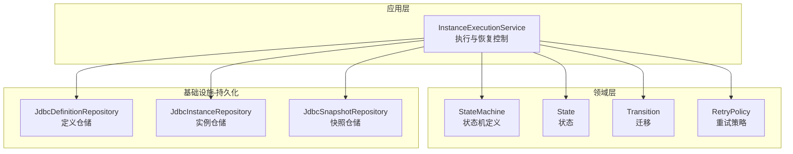
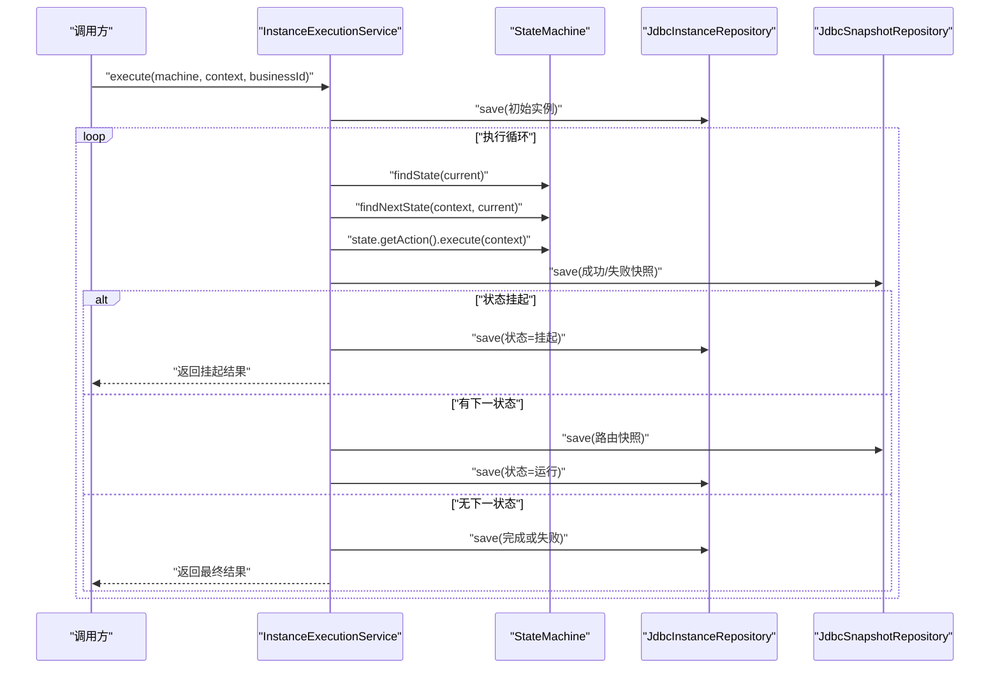
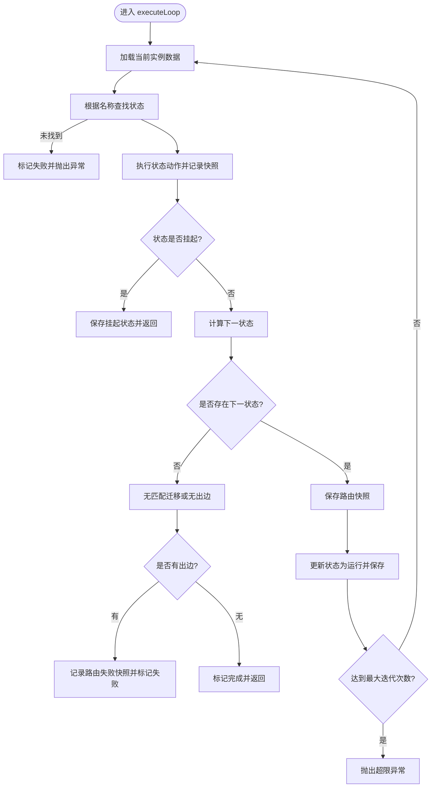
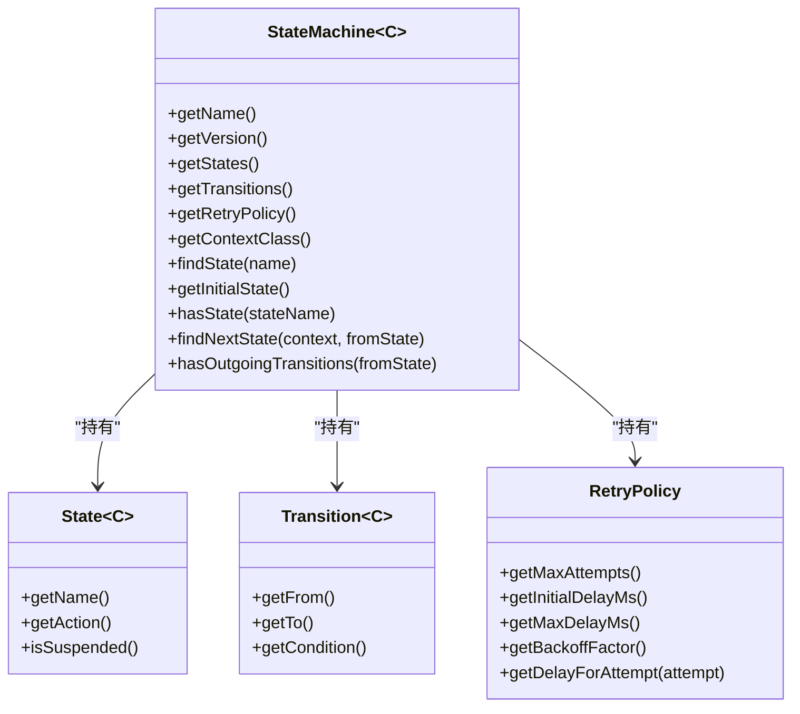
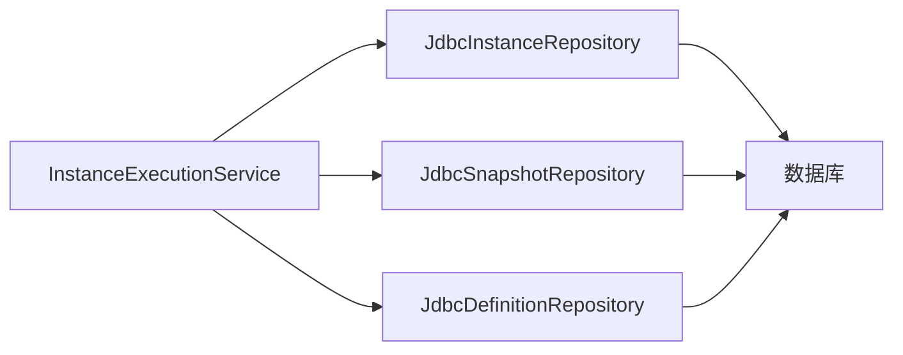
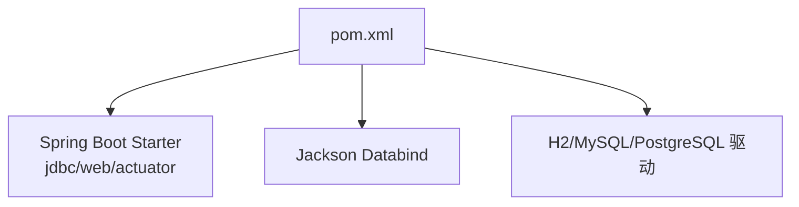

# 性能优化与调优

<cite>
**本文引用的文件**
- [InstanceExecutionService.java](file://state-machine-boot-starter/src/main/java/cn/chedejun/statemachine/application/InstanceExecutionService.java)
- [StateMachine.java](file://state-machine-boot-starter/src/main/java/cn/chedejun/statemachine/domain/engine/StateMachine.java)
- [State.java](file://state-machine-boot-starter/src/main/java/cn/chedejun/statemachine/core/State.java)
- [Transition.java](file://state-machine-boot-starter/src/main/java/cn/chedejun/statemachine/core/Transition.java)
- [RetryPolicy.java](file://state-machine-boot-starter/src/main/java/cn/chedejun/statemachine/core/RetryPolicy.java)
- [JdbcDefinitionRepository.java](file://state-machine-boot-starter/src/main/java/cn/chedejun/statemachine/infrastructure/persistence/JdbcDefinitionRepository.java)
- [JdbcInstanceRepository.java](file://state-machine-boot-starter/src/main/java/cn/chedejun/statemachine/infrastructure/persistence/JdbcInstanceRepository.java)
- [JdbcSnapshotRepository.java](file://state-machine-boot-starter/src/main/java/cn/chedejun/statemachine/infrastructure/persistence/JdbcSnapshotRepository.java)
- [pom.xml](file://state-machine-boot-starter/pom.xml)
</cite>

## 目录
1. [引言](#引言)
2. [项目结构](#项目结构)
3. [核心组件](#核心组件)
4. [架构总览](#架构总览)
5. [详细组件分析](#详细组件分析)
6. [依赖分析](#依赖分析)
7. [性能考虑](#性能考虑)
8. [故障排查指南](#故障排查指南)
9. [结论](#结论)
10. [附录](#附录)

## 引言
本指南聚焦于状态机执行引擎的性能优化与调优，围绕以下主题展开：状态机执行循环的优化、内存与CPU利用效率、JDBC 数据访问优化（连接池、SQL 与批量）、缓存策略设计（状态机定义、实例状态、快照数据）、并发执行的线程安全与资源分配、性能监控指标与基准测试方法，以及生产环境调优建议。文档基于仓库中的实际实现进行分析，确保建议可落地。

## 项目结构
该工程采用分层与按职责划分的组织方式：
- application 层：应用服务封装执行流程与重试、恢复、路由等控制逻辑
- domain 层：领域模型与引擎（状态、迁移、重试策略、状态机）
- infrastructure persistence 层：基于 JDBC 的仓储实现（定义、实例、快照）
- management 层：控制台与端点（未在本指南中深入分析）
- persistence 层：DDL 初始化（未在本指南中深入分析）

图表来源
- [InstanceExecutionService.java:1-296](file://state-machine-boot-starter/src/main/java/cn/chedejun/statemachine/application/InstanceExecutionService.java#L1-L296)
- [StateMachine.java:1-77](file://state-machine-boot-starter/src/main/java/cn/chedejun/statemachine/domain/engine/StateMachine.java#L1-L77)
- [State.java:1-23](file://state-machine-boot-starter/src/main/java/cn/chedejun/statemachine/core/State.java#L1-L23)
- [Transition.java:1-20](file://state-machine-boot-starter/src/main/java/cn/chedejun/statemachine/core/Transition.java#L1-L20)
- [RetryPolicy.java:1-45](file://state-machine-boot-starter/src/main/java/cn/chedejun/statemachine/core/RetryPolicy.java#L1-L45)
- [JdbcDefinitionRepository.java:1-119](file://state-machine-boot-starter/src/main/java/cn/chedejun/statemachine/infrastructure/persistence/JdbcDefinitionRepository.java#L1-L119)
- [JdbcInstanceRepository.java:1-164](file://state-machine-boot-starter/src/main/java/cn/chedejun/statemachine/infrastructure/persistence/JdbcInstanceRepository.java#L1-L164)
- [JdbcSnapshotRepository.java:1-107](file://state-machine-boot-starter/src/main/java/cn/chedejun/statemachine/infrastructure/persistence/JdbcSnapshotRepository.java#L1-L107)

章节来源
- [InstanceExecutionService.java:1-296](file://state-machine-boot-starter/src/main/java/cn/chedejun/statemachine/application/InstanceExecutionService.java#L1-L296)
- [StateMachine.java:1-77](file://state-machine-boot-starter/src/main/java/cn/chedejun/statemachine/domain/engine/StateMachine.java#L1-L77)
- [JdbcDefinitionRepository.java:1-119](file://state-machine-boot-starter/src/main/java/cn/chedejun/statemachine/infrastructure/persistence/JdbcDefinitionRepository.java#L1-L119)
- [JdbcInstanceRepository.java:1-164](file://state-machine-boot-starter/src/main/java/cn/chedejun/statemachine/infrastructure/persistence/JdbcInstanceRepository.java#L1-L164)
- [JdbcSnapshotRepository.java:1-107](file://state-machine-boot-starter/src/main/java/cn/chedejun/statemachine/infrastructure/persistence/JdbcSnapshotRepository.java#L1-L107)

## 核心组件
- 执行服务：封装状态机实例的启动、执行循环、重试、恢复、路由与结果汇总
- 领域引擎：不可变的状态机定义、状态、迁移与重试策略
- JDBC 仓储：分别负责定义、实例与快照的持久化与查询
- Spring Boot Starter：提供 JDBC、Web、Actuator 等可选依赖

章节来源
- [InstanceExecutionService.java:43-193](file://state-machine-boot-starter/src/main/java/cn/chedejun/statemachine/application/InstanceExecutionService.java#L43-L193)
- [StateMachine.java:19-77](file://state-machine-boot-starter/src/main/java/cn/chedejun/statemachine/domain/engine/StateMachine.java#L19-L77)
- [RetryPolicy.java:5-45](file://state-machine-boot-starter/src/main/java/cn/chedejun/statemachine/core/RetryPolicy.java#L5-L45)
- [JdbcDefinitionRepository.java:18-119](file://state-machine-boot-starter/src/main/java/cn/chedejun/statemachine/infrastructure/persistence/JdbcDefinitionRepository.java#L18-L119)
- [JdbcInstanceRepository.java:16-164](file://state-machine-boot-starter/src/main/java/cn/chedejun/statemachine/infrastructure/persistence/JdbcInstanceRepository.java#L16-L164)
- [JdbcSnapshotRepository.java:18-107](file://state-machine-boot-starter/src/main/java/cn/chedejun/statemachine/infrastructure/persistence/JdbcSnapshotRepository.java#L18-L107)

## 架构总览
下图展示从应用服务到领域引擎与 JDBC 仓储的整体交互路径，突出执行循环、重试与快照写入的关键节点。

图表来源
- [InstanceExecutionService.java:43-193](file://state-machine-boot-starter/src/main/java/cn/chedejun/statemachine/application/InstanceExecutionService.java#L43-L193)
- [StateMachine.java:50-71](file://state-machine-boot-starter/src/main/java/cn/chedejun/statemachine/domain/engine/StateMachine.java#L50-L71)
- [JdbcInstanceRepository.java:47-87](file://state-machine-boot-starter/src/main/java/cn/chedejun/statemachine/infrastructure/persistence/JdbcInstanceRepository.java#L47-L87)
- [JdbcSnapshotRepository.java:33-51](file://state-machine-boot-starter/src/main/java/cn/chedejun/statemachine/infrastructure/persistence/JdbcSnapshotRepository.java#L33-L51)

## 详细组件分析

### 执行服务与执行循环
- 启动阶段：生成实例 ID、解析定义版本、保存初始实例
- 执行循环：根据状态机查找当前状态、执行动作、记录快照、决定下一状态或结束
- 重试机制：基于重试策略指数退避，记录每次尝试的快照；达到上限后标记失败
- 恢复与路由：支持按业务 ID 或实例 ID 恢复；恢复时仅对成功且非路由类型的快照回放上下文
- 并发保护：恢复时使用“状态=挂起”条件更新，避免并发冲突

图表来源
- [InstanceExecutionService.java:158-193](file://state-machine-boot-starter/src/main/java/cn/chedejun/statemachine/application/InstanceExecutionService.java#L158-L193)
- [InstanceExecutionService.java:200-237](file://state-machine-boot-starter/src/main/java/cn/chedejun/statemachine/application/InstanceExecutionService.java#L200-L237)

章节来源
- [InstanceExecutionService.java:43-193](file://state-machine-boot-starter/src/main/java/cn/chedejun/statemachine/application/InstanceExecutionService.java#L43-L193)

### 领域引擎与重试策略
- 状态机：不可变定义，包含状态列表、迁移列表、重试策略与上下文类型
- 状态：包含名称、动作与挂起标志
- 迁移：从源状态到目标状态的条件判断
- 重试策略：指数退避，支持最大尝试次数、初始延迟、最大延迟与退避因子

图表来源
- [StateMachine.java:19-77](file://state-machine-boot-starter/src/main/java/cn/chedejun/statemachine/domain/engine/StateMachine.java#L19-L77)
- [State.java:3-23](file://state-machine-boot-starter/src/main/java/cn/chedejun/statemachine/core/State.java#L3-L23)
- [Transition.java:3-20](file://state-machine-boot-starter/src/main/java/cn/chedejun/statemachine/core/Transition.java#L3-L20)
- [RetryPolicy.java:5-45](file://state-machine-boot-starter/src/main/java/cn/chedejun/statemachine/core/RetryPolicy.java#L5-L45)

章节来源
- [StateMachine.java:19-77](file://state-machine-boot-starter/src/main/java/cn/chedejun/statemachine/domain/engine/StateMachine.java#L19-L77)
- [State.java:3-23](file://state-machine-boot-starter/src/main/java/cn/chedejun/statemachine/core/State.java#L3-L23)
- [Transition.java:3-20](file://state-machine-boot-starter/src/main/java/cn/chedejun/statemachine/core/Transition.java#L3-L20)
- [RetryPolicy.java:5-45](file://state-machine-boot-starter/src/main/java/cn/chedejun/statemachine/core/RetryPolicy.java#L5-L45)

### JDBC 数据访问与优化要点
- 定义仓储：支持插入与更新，自动区分数据库类型以正确设置 JSON 字段
- 实例仓储：提供 upsert（插入或更新）原子化写入，减少并发竞态；支持按业务 ID 查询最新实例；提供“挂起→运行”的 CAS 更新
- 快照仓储：保存节点成功/失败/路由快照，按执行时间与尝试序号排序

图表来源
- [InstanceExecutionService.java:30-41](file://state-machine-boot-starter/src/main/java/cn/chedejun/statemachine/application/InstanceExecutionService.java#L30-L41)
- [JdbcDefinitionRepository.java:18-119](file://state-machine-boot-starter/src/main/java/cn/chedejun/statemachine/infrastructure/persistence/JdbcDefinitionRepository.java#L18-L119)
- [JdbcInstanceRepository.java:16-164](file://state-machine-boot-starter/src/main/java/cn/chedejun/statemachine/infrastructure/persistence/JdbcInstanceRepository.java#L16-L164)
- [JdbcSnapshotRepository.java:18-107](file://state-machine-boot-starter/src/main/java/cn/chedejun/statemachine/infrastructure/persistence/JdbcSnapshotRepository.java#L18-L107)

章节来源
- [JdbcDefinitionRepository.java:29-81](file://state-machine-boot-starter/src/main/java/cn/chedejun/statemachine/infrastructure/persistence/JdbcDefinitionRepository.java#L29-L81)
- [JdbcInstanceRepository.java:47-87](file://state-machine-boot-starter/src/main/java/cn/chedejun/statemachine/infrastructure/persistence/JdbcInstanceRepository.java#L47-L87)
- [JdbcSnapshotRepository.java:25-51](file://state-machine-boot-starter/src/main/java/cn/chedejun/statemachine/infrastructure/persistence/JdbcSnapshotRepository.java#L25-L51)

## 依赖分析
- Spring Boot Starter 提供 JDBC、Web、Actuator 可选依赖，便于集成与监控
- Jackson 用于上下文序列化/反序列化
- 测试依赖包含 H2、MySQL 与 PostgreSQL 驱动，覆盖多数据库场景

图表来源
- [pom.xml:57-98](file://state-machine-boot-starter/pom.xml#L57-L98)

章节来源
- [pom.xml:36-98](file://state-machine-boot-starter/pom.xml#L36-L98)

## 性能考虑

### 状态机执行循环优化
- 循环边界与最大迭代：循环上限基于状态数与重试策略推导，防止无限循环
- 快照粒度：每个状态动作与路由均落盘，便于恢复但带来 IO 压力；可结合业务评估是否降低快照频率或合并写入
- 上下文序列化：每次动作前后序列化上下文，序列化成本与上下文大小成正比；建议控制上下文体量或采用更紧凑的序列化方案
- 挂起与恢复：挂起时立即落库并返回，避免长时间占用线程；恢复时仅对成功且非路由快照回放上下文，减少无效反序列化

章节来源
- [InstanceExecutionService.java:158-193](file://state-machine-boot-starter/src/main/java/cn/chedejun/statemachine/application/InstanceExecutionService.java#L158-L193)
- [InstanceExecutionService.java:119-152](file://state-machine-boot-starter/src/main/java/cn/chedejun/statemachine/application/InstanceExecutionService.java#L119-L152)
- [InstanceExecutionService.java:247-260](file://state-machine-boot-starter/src/main/java/cn/chedejun/statemachine/application/InstanceExecutionService.java#L247-L260)

### 内存与 CPU 利用效率
- 对象生命周期：状态机定义为不可变对象，减少 GC 压力；实例与快照对象在循环中频繁创建与销毁，注意避免大对象常驻
- 字符串与集合：状态机与迁移列表为不可变集合，查找为线性扫描；当状态/迁移数量较大时，可考虑索引化查找（如按名称映射）
- 序列化成本：上下文序列化/反序列化为 CPU 密集操作；建议：
  - 控制上下文字段数量与层级
  - 使用二进制序列化（如 Kryo）替代 JSON（需评估兼容性与部署复杂度）
  - 对热点上下文进行缓存（见“缓存策略设计”）

章节来源
- [StateMachine.java:37-41](file://state-machine-boot-starter/src/main/java/cn/chedejun/statemachine/domain/engine/StateMachine.java#L37-L41)
- [InstanceExecutionService.java:247-260](file://state-machine-boot-starter/src/main/java/cn/chedejun/statemachine/application/InstanceExecutionService.java#L247-L260)

### JDBC 数据访问优化
- 连接池配置（建议）
  - HikariCP：启用最小空闲连接、连接超时、最大生命周期、回收超时等参数，避免连接抖动
  - 连接数：根据并发实例数与数据库吞吐能力设定，避免过度连接导致上下文切换开销
- SQL 优化
  - upsert 原子化：实例仓储已使用 upsert 减少竞态；保持该策略
  - 查询索引：按 machine_name、status、business_id、created_at 建立复合索引，加速分页与筛选
  - JSON 字段：PostgreSQL 使用 OTHER，MySQL 使用 VARCHAR，避免字符集与编码问题
- 批量操作策略
  - 快照写入：当前逐条写入；若吞吐要求高，可在应用侧聚合后批量提交（需评估一致性）
  - 实例批量更新：可扩展批量更新接口，减少网络往返

章节来源
- [JdbcInstanceRepository.java:47-87](file://state-machine-boot-starter/src/main/java/cn/chedejun/statemachine/infrastructure/persistence/JdbcInstanceRepository.java#L47-L87)
- [JdbcDefinitionRepository.java:83-93](file://state-machine-boot-starter/src/main/java/cn/chedejun/statemachine/infrastructure/persistence/JdbcDefinitionRepository.java#L83-L93)
- [JdbcSnapshotRepository.java:63-71](file://state-machine-boot-starter/src/main/java/cn/chedejun/statemachine/infrastructure/persistence/JdbcSnapshotRepository.java#L63-L71)

### 缓存策略设计
- 状态机定义缓存：按 name+version 缓存 DefinitionData，避免重复查询；版本变更时失效
- 实例状态缓存：缓存最近活跃实例的当前状态与重试信息，降低高频查询压力
- 快照数据缓存：缓存最近一次成功快照的输出 JSON，用于恢复时快速反序列化上下文
- 缓存一致性：与数据库采用最终一致策略；写入后异步失效或主动更新缓存

章节来源
- [JdbcDefinitionRepository.java:69-74](file://state-machine-boot-starter/src/main/java/cn/chedejun/statemachine/infrastructure/persistence/JdbcDefinitionRepository.java#L69-L74)
- [JdbcInstanceRepository.java:22-44](file://state-machine-boot-starter/src/main/java/cn/chedejun/statemachine/infrastructure/persistence/JdbcInstanceRepository.java#L22-L44)
- [JdbcSnapshotRepository.java:25-30](file://state-machine-boot-starter/src/main/java/cn/chedejun/statemachine/infrastructure/persistence/JdbcSnapshotRepository.java#L25-L30)

### 并发执行的性能考量
- 线程安全：状态机定义与状态对象为不可变，天然线程安全；执行服务与仓储为无状态组件，可多线程复用
- 锁竞争：实例仓储的 CAS 更新（挂起→运行）避免了全局锁；但高并发下仍可能产生热点竞争
- 资源分配：合理设置线程池大小与队列长度；IO 密集场景可适当增大线程数；CPU 密集场景需平衡线程数与上下文序列化成本

章节来源
- [JdbcInstanceRepository.java:89-94](file://state-machine-boot-starter/src/main/java/cn/chedejun/statemachine/infrastructure/persistence/JdbcInstanceRepository.java#L89-L94)
- [InstanceExecutionService.java:139-142](file://state-machine-boot-starter/src/main/java/cn/chedejun/statemachine/application/InstanceExecutionService.java#L139-L142)

### 性能监控指标与基准测试
- 指标建议
  - 执行吞吐：每秒实例数、每秒状态数
  - 延迟分布：P50/P95/P99 状态执行时延、路由决策时延
  - 失败率与重试次数：失败率、平均重试次数、重试耗时
  - 数据库指标：连接池使用率、慢查询、QPS、行扫描
  - JVM 指标：GC 次数与时长、堆使用、线程数
- 基准测试方法
  - 单机压测：固定并发度逐步加压，观察吞吐与延迟拐点
  - 场景模拟：构造不同状态数、迁移复杂度、上下文大小的组合
  - 数据库压测：独立数据库压测，验证 upsert 与查询瓶颈
- 生产环境调优建议
  - 优先优化热点 SQL 与索引；其次调整连接池与线程池
  - 采用异步批处理与背压策略，避免瞬时洪峰
  - 分片与分区：按 machine_name 或业务维度拆分，降低单表热点

[本节为通用指导，无需特定文件引用]

## 故障排查指南
- 状态未找到：执行循环在找不到状态时会标记失败并抛出异常，检查状态机定义与状态名称
- 迁移不匹配：无匹配迁移时记录路由失败快照并标记失败，核对迁移条件与上下文
- 恢复失败：按业务 ID 或实例 ID 恢复前需校验期望状态；恢复时仅对成功且非路由快照回放上下文
- 重试中断：重试期间线程被中断会抛出异常；检查外部中断信号与线程池配置
- 序列化异常：上下文序列化失败会记录告警并返回空上下文；检查上下文类型与字段

章节来源
- [InstanceExecutionService.java:166-170](file://state-machine-boot-starter/src/main/java/cn/chedejun/statemachine/application/InstanceExecutionService.java#L166-L170)
- [InstanceExecutionService.java:178-184](file://state-machine-boot-starter/src/main/java/cn/chedejun/statemachine/application/InstanceExecutionService.java#L178-L184)
- [InstanceExecutionService.java:121-133](file://state-machine-boot-starter/src/main/java/cn/chedejun/statemachine/application/InstanceExecutionService.java#L121-L133)
- [InstanceExecutionService.java:224-227](file://state-machine-boot-starter/src/main/java/cn/chedejun/statemachine/application/InstanceExecutionService.java#L224-L227)
- [InstanceExecutionService.java:247-260](file://state-machine-boot-starter/src/main/java/cn/chedejun/statemachine/application/InstanceExecutionService.java#L247-L260)

## 结论
本指南基于仓库实现总结了状态机执行引擎的性能优化路径：通过优化执行循环与快照策略、合理配置 JDBC 与连接池、设计多级缓存、关注并发与资源分配，并建立完善的监控与基准测试体系，可在保证正确性的前提下显著提升吞吐与稳定性。生产落地时应结合具体业务规模与数据库能力，循序渐进地实施各项优化措施。

## 附录
- 术语说明
  - 快照：记录状态执行输入/输出、尝试次数、状态与错误信息
  - 路由：记录从源状态到目标状态的决策
  - CAS：Compare-And-Set，用于并发安全的状态更新
- 参考实现位置
  - 执行循环与重试：[InstanceExecutionService.java:158-237](file://state-machine-boot-starter/src/main/java/cn/chedejun/statemachine/application/InstanceExecutionService.java#L158-L237)
  - 领域引擎与重试策略：[StateMachine.java:19-77](file://state-machine-boot-starter/src/main/java/cn/chedejun/statemachine/domain/engine/StateMachine.java#L19-L77)、[RetryPolicy.java:5-45](file://state-machine-boot-starter/src/main/java/cn/chedejun/statemachine/core/RetryPolicy.java#L5-L45)
  - JDBC 仓储：[JdbcDefinitionRepository.java:18-119](file://state-machine-boot-starter/src/main/java/cn/chedejun/statemachine/infrastructure/persistence/JdbcDefinitionRepository.java#L18-L119)、[JdbcInstanceRepository.java:16-164](file://state-machine-boot-starter/src/main/java/cn/chedejun/statemachine/infrastructure/persistence/JdbcInstanceRepository.java#L16-L164)、[JdbcSnapshotRepository.java:18-107](file://state-machine-boot-starter/src/main/java/cn/chedejun/statemachine/infrastructure/persistence/JdbcSnapshotRepository.java#L18-L107)