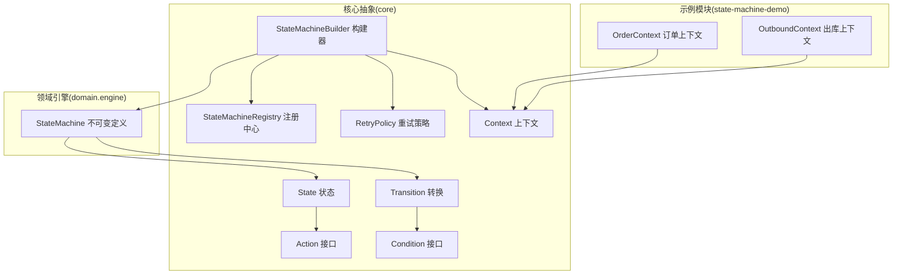
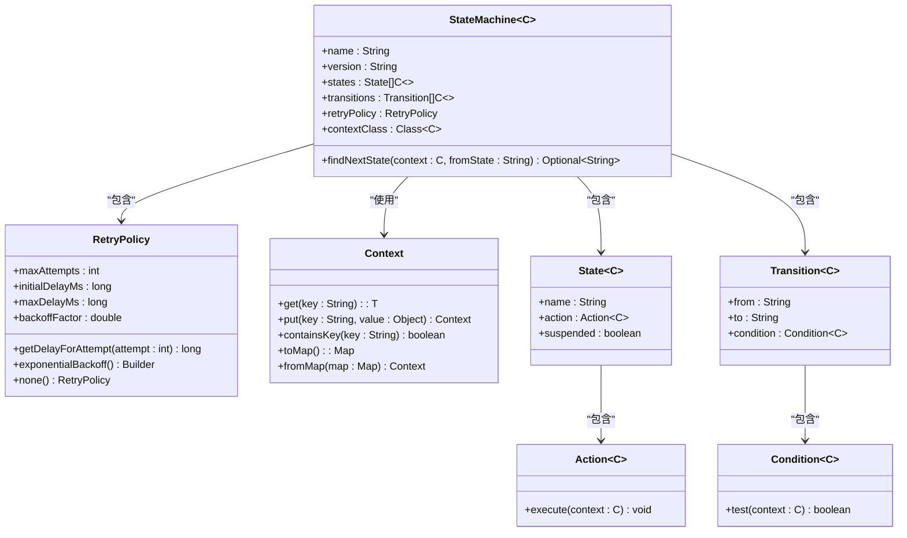
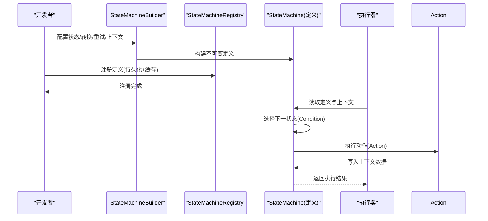
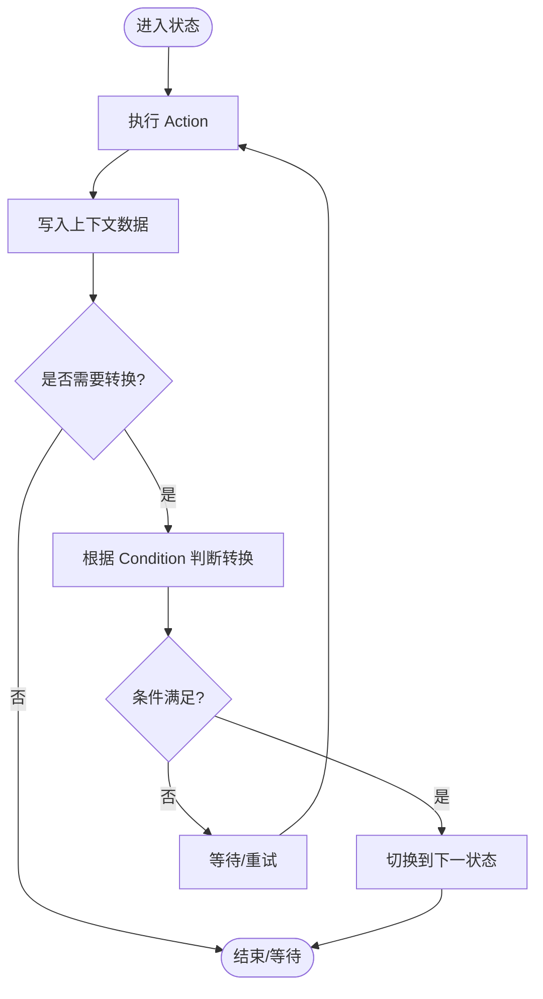
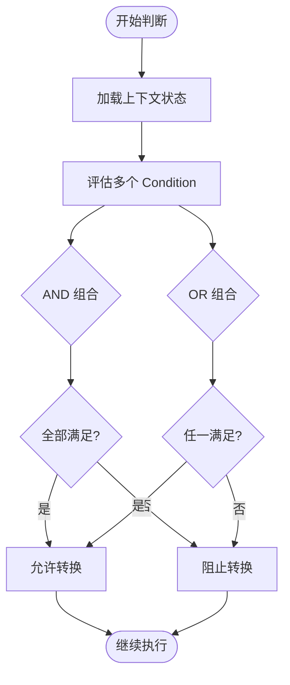
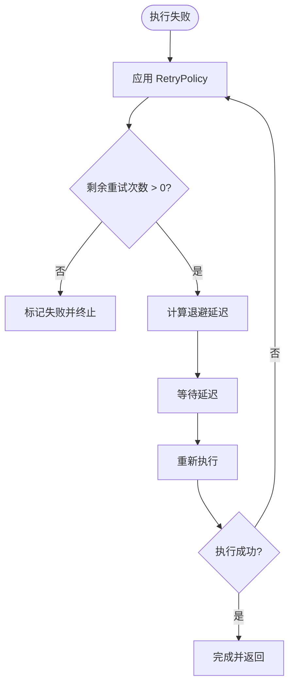
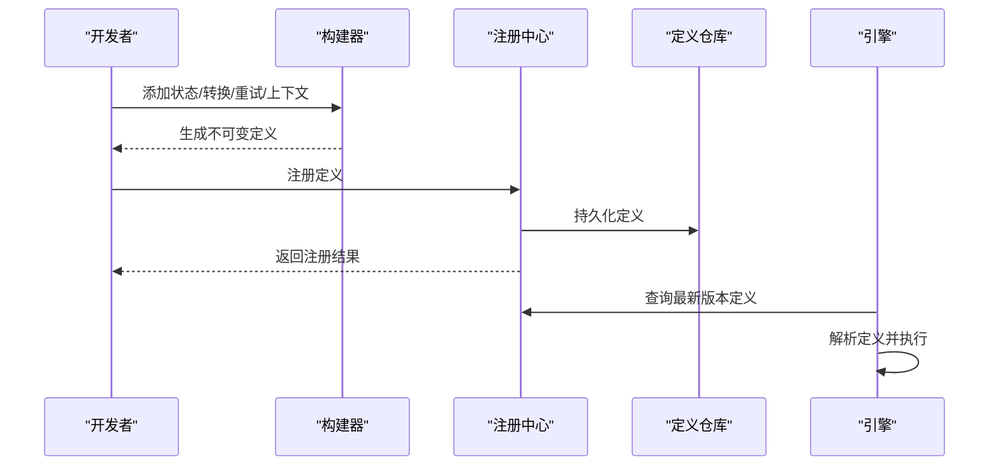
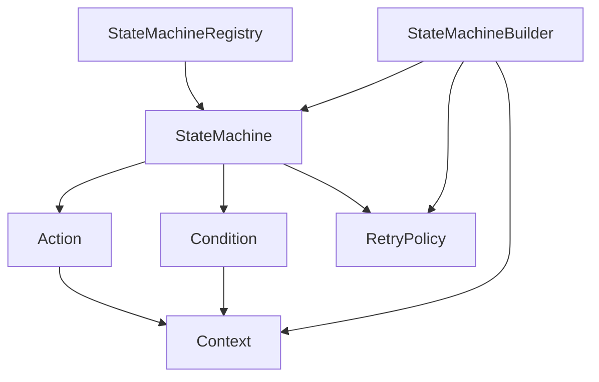

# 扩展点与插件机制

<cite>
**本文档引用的文件**
- [Action.java](file://state-machine-boot-starter/src/main/java/cn/chedejun/statemachine/core/Action.java)
- [Condition.java](file://state-machine-boot-starter/src/main/java/cn/chedejun/statemachine/core/Condition.java)
- [RetryPolicy.java](file://state-machine-boot-starter/src/main/java/cn/chedejun/statemachine/core/RetryPolicy.java)
- [Context.java](file://state-machine-boot-starter/src/main/java/cn/chedejun/statemachine/core/Context.java)
- [StateMachineBuilder.java](file://state-machine-boot-starter/src/main/java/cn/chedejun/statemachine/core/StateMachineBuilder.java)
- [State.java](file://state-machine-boot-starter/src/main/java/cn/chedejun/statemachine/core/State.java)
- [Transition.java](file://state-machine-boot-starter/src/main/java/cn/chedejun/statemachine/core/Transition.java)
- [ExecuteResult.java](file://state-machine-boot-starter/src/main/java/cn/chedejun/statemachine/core/ExecuteResult.java)
- [StateMachine.java](file://state-machine-boot-starter/src/main/java/cn/chedejun/statemachine/domain/engine/StateMachine.java)
- [StateMachineRegistry.java](file://state-machine-boot-starter/src/main/java/cn/chedejun/statemachine/core/StateMachineRegistry.java)
- [OrderContext.java](file://state-machine-demo/src/main/java/cn/chedejun/demo/statemachine/OrderContext.java)
- [OutboundContext.java](file://state-machine-demo/src/main/java/cn/chedejun/demo/statemachine/OutboundContext.java)
- [RetryPolicyTest.java](file://state-machine-boot-starter/src/test/java/cn/chedejun/statemachine/core/RetryPolicyTest.java)
- [StateMachineBuilderTest.java](file://state-machine-boot-starter/src/test/java/cn/chedejun/statemachine/core/StateMachineBuilderTest.java)
</cite>

## 目录
1. [简介](#简介)
2. [项目结构](#项目结构)
3. [核心组件](#核心组件)
4. [架构总览](#架构总览)
5. [详细组件分析](#详细组件分析)
6. [依赖分析](#依赖分析)
7. [性能考虑](#性能考虑)
8. [故障排查指南](#故障排查指南)
9. [结论](#结论)
10. [附录](#附录)

## 简介
本文件系统性阐述状态机扩展点与插件机制，围绕以下关键扩展点展开：
- Action 接口：状态步骤的业务执行扩展点，支持泛型上下文、异常传播与状态数据写入。
- Condition 接口：转换条件判断扩展点，支持复杂业务逻辑封装与组合策略。
- RetryPolicy 重试策略扩展点：内置指数退避策略，支持自定义重试算法与退避参数。

文档同时解释扩展点与核心引擎的集成方式、生命周期管理以及最佳实践与常见陷阱，帮助读者在不侵入核心的前提下实现灵活的业务扩展。

## 项目结构
该项目采用分层与功能域结合的组织方式：
- 核心抽象与构建器位于 core 包，定义扩展点与装配入口。
- 领域引擎位于 domain.engine，承载不可变的状态机定义与路由决策。
- 注册中心负责持久化与版本管理，支撑插件式定义发布与发现。
- 示例模块演示了如何基于泛型上下文扩展业务数据。

图表来源
- [StateMachineBuilder.java:1-52](file://state-machine-boot-starter/src/main/java/cn/chedejun/statemachine/core/StateMachineBuilder.java#L1-L52)
- [StateMachine.java:19-77](file://state-machine-boot-starter/src/main/java/cn/chedejun/statemachine/domain/engine/StateMachine.java#L19-L77)
- [State.java:1-23](file://state-machine-boot-starter/src/main/java/cn/chedejun/statemachine/core/State.java#L1-L23)
- [Transition.java:1-20](file://state-machine-boot-starter/src/main/java/cn/chedejun/statemachine/core/Transition.java#L1-L20)
- [Action.java:1-12](file://state-machine-boot-starter/src/main/java/cn/chedejun/statemachine/core/Action.java#L1-L12)
- [Condition.java:1-7](file://state-machine-boot-starter/src/main/java/cn/chedejun/statemachine/core/Condition.java#L1-L7)
- [RetryPolicy.java:1-45](file://state-machine-boot-starter/src/main/java/cn/chedejun/statemachine/core/RetryPolicy.java#L1-L45)
- [Context.java:1-24](file://state-machine-boot-starter/src/main/java/cn/chedejun/statemachine/core/Context.java#L1-L24)
- [StateMachineRegistry.java:17-114](file://state-machine-boot-starter/src/main/java/cn/chedejun/statemachine/core/StateMachineRegistry.java#L17-L114)
- [OrderContext.java:1-99](file://state-machine-demo/src/main/java/cn/chedejun/demo/statemachine/OrderContext.java#L1-L99)
- [OutboundContext.java:1-43](file://state-machine-demo/src/main/java/cn/chedejun/demo/statemachine/OutboundContext.java#L1-L43)

章节来源
- [StateMachineBuilder.java:1-52](file://state-machine-boot-starter/src/main/java/cn/chedejun/statemachine/core/StateMachineBuilder.java#L1-L52)
- [StateMachine.java:19-77](file://state-machine-boot-starter/src/main/java/cn/chedejun/statemachine/domain/engine/StateMachine.java#L19-L77)

## 核心组件
本节聚焦三个关键扩展点及其协作关系：
- Action：状态步骤的业务执行扩展点，接收泛型上下文并在执行过程中通过上下文写入状态数据。
- Condition：转换条件判断扩展点，接收泛型上下文并返回布尔值决定是否允许转换。
- RetryPolicy：重试策略扩展点，提供指数退避等内置策略及自定义能力。

图表来源
- [Action.java:1-12](file://state-machine-boot-starter/src/main/java/cn/chedejun/statemachine/core/Action.java#L1-L12)
- [Condition.java:1-7](file://state-machine-boot-starter/src/main/java/cn/chedejun/statemachine/core/Condition.java#L1-L7)
- [RetryPolicy.java:1-45](file://state-machine-boot-starter/src/main/java/cn/chedejun/statemachine/core/RetryPolicy.java#L1-L45)
- [Context.java:1-24](file://state-machine-boot-starter/src/main/java/cn/chedejun/statemachine/core/Context.java#L1-L24)
- [State.java:1-23](file://state-machine-boot-starter/src/main/java/cn/chedejun/statemachine/core/State.java#L1-L23)
- [Transition.java:1-20](file://state-machine-boot-starter/src/main/java/cn/chedejun/statemachine/core/Transition.java#L1-L20)
- [StateMachine.java:19-77](file://state-machine-boot-starter/src/main/java/cn/chedejun/statemachine/domain/engine/StateMachine.java#L19-L77)

章节来源
- [Action.java:1-12](file://state-machine-boot-starter/src/main/java/cn/chedejun/statemachine/core/Action.java#L1-L12)
- [Condition.java:1-7](file://state-machine-boot-starter/src/main/java/cn/chedejun/statemachine/core/Condition.java#L1-L7)
- [RetryPolicy.java:1-45](file://state-machine-boot-starter/src/main/java/cn/chedejun/statemachine/core/RetryPolicy.java#L1-L45)
- [Context.java:1-24](file://state-machine-boot-starter/src/main/java/cn/chedejun/statemachine/core/Context.java#L1-L24)
- [State.java:1-23](file://state-machine-boot-starter/src/main/java/cn/chedejun/statemachine/core/State.java#L1-L23)
- [Transition.java:1-20](file://state-machine-boot-starter/src/main/java/cn/chedejun/statemachine/core/Transition.java#L1-L20)
- [StateMachine.java:19-77](file://state-machine-boot-starter/src/main/java/cn/chedejun/statemachine/domain/engine/StateMachine.java#L19-L77)

## 架构总览
扩展点与核心引擎的集成遵循“定义不可变、执行可插拔”的设计原则：
- 定义阶段：通过 StateMachineBuilder 组合 Action、Condition、RetryPolicy、Context 等扩展点，生成不可变的 StateMachine 定义。
- 注册阶段：StateMachineRegistry 将定义序列化并持久化，支持版本管理与查询。
- 运行阶段：核心引擎根据当前状态与上下文调用 Action 执行业务；根据 Condition 判断转换；依据 RetryPolicy 控制重试行为。

图表来源
- [StateMachineBuilder.java:42-47](file://state-machine-boot-starter/src/main/java/cn/chedejun/statemachine/core/StateMachineBuilder.java#L42-L47)
- [StateMachineRegistry.java:29-73](file://state-machine-boot-starter/src/main/java/cn/chedejun/statemachine/core/StateMachineRegistry.java#L29-L73)
- [StateMachine.java:63-71](file://state-machine-boot-starter/src/main/java/cn/chedejun/statemachine/domain/engine/StateMachine.java#L63-L71)
- [Action.java:9-11](file://state-machine-boot-starter/src/main/java/cn/chedejun/statemachine/core/Action.java#L9-L11)
- [Condition.java:4-6](file://state-machine-boot-starter/src/main/java/cn/chedejun/statemachine/core/Condition.java#L4-L6)

## 详细组件分析

### Action 接口：泛型上下文处理、异常传播与状态数据传递
- 设计要点
  - 泛型上下文：通过类型参数 C 实现强类型上下文传递，便于编译期约束与 IDE 支持。
  - 异常传播：Action 显式声明抛出异常，由上层统一处理或触发重试策略。
  - 数据写入：通过 Context.put(key, value) 写入状态数据，自动纳入快照与注册流程。
- 实践建议
  - 在 Action 中避免副作用，尽量只做幂等的业务计算与状态写入。
  - 对外调用应捕获并包装为业务异常，保留原始异常以便追踪。
  - 使用具体上下文类（如 OrderContext、OutboundContext）承载业务字段，提升可读性与可维护性。
- 常见陷阱
  - 忘记写入上下文导致状态丢失，或写入非预期键名。
  - 在 Action 中直接进行阻塞操作，影响执行器吞吐。
  - 抛出受检异常但未被上层处理，导致流程中断且无重试机会。

图表来源
- [Action.java:9-11](file://state-machine-boot-starter/src/main/java/cn/chedejun/statemachine/core/Action.java#L9-L11)
- [Context.java:10-12](file://state-machine-boot-starter/src/main/java/cn/chedejun/statemachine/core/Context.java#L10-L12)
- [StateMachine.java:63-71](file://state-machine-boot-starter/src/main/java/cn/chedejun/statemachine/domain/engine/StateMachine.java#L63-L71)

章节来源
- [Action.java:1-12](file://state-machine-boot-starter/src/main/java/cn/chedejun/statemachine/core/Action.java#L1-L12)
- [Context.java:1-24](file://state-machine-boot-starter/src/main/java/cn/chedejun/statemachine/core/Context.java#L1-L24)
- [OrderContext.java:1-99](file://state-machine-demo/src/main/java/cn/chedejun/demo/statemachine/OrderContext.java#L1-L99)
- [OutboundContext.java:1-43](file://state-machine-demo/src/main/java/cn/chedejun/demo/statemachine/OutboundContext.java#L1-L43)

### Condition 接口：条件判断与复杂业务封装
- 设计要点
  - 简洁表达：Condition 以函数式接口形式提供布尔判断，便于组合与复用。
  - 复杂逻辑封装：可在上下文中携带复杂状态，Condition 仅负责判断。
  - 组合策略：通过与/或逻辑组合多个 Condition，形成更复杂的路由规则。
- 实践建议
  - 将业务规则抽取为独立的 Condition 实现，提升可测试性与可维护性。
  - 在测试中验证边界条件与组合逻辑，确保路由正确性。
  - 避免在 Condition 中进行耗时操作，保持判断快速稳定。
- 常见陷阱
  - 条件过于复杂导致难以维护，应拆分为多个简单 Condition 并组合。
  - 忽略上下文一致性，导致不同状态下的判断结果不一致。
  - 未覆盖所有分支，导致路由失败时无法给出明确提示。

图表来源
- [Condition.java:4-6](file://state-machine-boot-starter/src/main/java/cn/chedejun/statemachine/core/Condition.java#L4-L6)
- [Transition.java:8-14](file://state-machine-boot-starter/src/main/java/cn/chedejun/statemachine/core/Transition.java#L8-L14)
- [StateMachineBuilderTest.java:127-143](file://state-machine-boot-starter/src/test/java/cn/chedejun/statemachine/core/StateMachineBuilderTest.java#L127-L143)

章节来源
- [Condition.java:1-7](file://state-machine-boot-starter/src/main/java/cn/chedejun/statemachine/core/Condition.java#L1-L7)
- [Transition.java:1-20](file://state-machine-boot-starter/src/main/java/cn/chedejun/statemachine/core/Transition.java#L1-L20)
- [StateMachineBuilderTest.java:127-143](file://state-machine-boot-starter/src/test/java/cn/chedejun/statemachine/core/StateMachineBuilderTest.java#L127-L143)

### RetryPolicy 重试策略：扩展点与自定义退避
- 设计要点
  - 指数退避：默认指数增长延迟，上限控制防止无限延长。
  - 可配置参数：最大尝试次数、初始延迟、最大延迟、退避因子。
  - 禁用策略：提供 none() 策略，适用于无需重试的场景。
- 自定义扩展
  - 可通过 Builder 设置参数，或实现自定义策略类替换默认实现。
  - 建议结合业务特性（如幂等性、资源竞争）选择合适的退避算法。
- 常见陷阱
  - 忽略最大延迟导致重试时间过长，影响用户体验。
  - 未区分瞬时错误与永久错误，盲目重试浪费资源。
  - 重试间隔过短造成级联失败，应配合退避策略使用。

图表来源
- [RetryPolicy.java:26-30](file://state-machine-boot-starter/src/main/java/cn/chedejun/statemachine/core/RetryPolicy.java#L26-L30)
- [RetryPolicy.java:32-43](file://state-machine-boot-starter/src/main/java/cn/chedejun/statemachine/core/RetryPolicy.java#L32-L43)
- [RetryPolicyTest.java:13-29](file://state-machine-boot-starter/src/test/java/cn/chedejun/statemachine/core/RetryPolicyTest.java#L13-L29)

章节来源
- [RetryPolicy.java:1-45](file://state-machine-boot-starter/src/main/java/cn/chedejun/statemachine/core/RetryPolicy.java#L1-L45)
- [RetryPolicyTest.java:1-35](file://state-machine-boot-starter/src/test/java/cn/chedejun/statemachine/core/RetryPolicyTest.java#L1-L35)

### 扩展点与核心引擎的集成与生命周期
- 集成方式
  - 构建阶段：通过 StateMachineBuilder 将 Action、Condition、RetryPolicy、Context 注入 StateMachine 定义。
  - 注册阶段：StateMachineRegistry 将定义序列化并持久化，支持版本管理与查询。
  - 运行阶段：核心引擎从定义中读取状态与转换规则，结合上下文执行 Action 与判断 Condition。
- 生命周期管理
  - 定义不可变：StateMachine 为不可变对象，保证并发安全与一致性。
  - 版本演进：通过版本号区分定义变更，注册中心负责版本存储与检索。
  - 缓存与持久化：注册中心同时维护内存缓存与持久化存储，提升查询效率与重启恢复能力。

图表来源
- [StateMachineBuilder.java:42-47](file://state-machine-boot-starter/src/main/java/cn/chedejun/statemachine/core/StateMachineBuilder.java#L42-L47)
- [StateMachineRegistry.java:29-73](file://state-machine-boot-starter/src/main/java/cn/chedejun/statemachine/core/StateMachineRegistry.java#L29-L73)
- [StateMachineRegistry.java:80-84](file://state-machine-boot-starter/src/main/java/cn/chedejun/statemachine/core/StateMachineRegistry.java#L80-L84)

章节来源
- [StateMachineBuilder.java:1-52](file://state-machine-boot-starter/src/main/java/cn/chedejun/statemachine/core/StateMachineBuilder.java#L1-L52)
- [StateMachineRegistry.java:17-114](file://state-machine-boot-starter/src/main/java/cn/chedejun/statemachine/core/StateMachineRegistry.java#L17-L114)
- [StateMachine.java:19-77](file://state-machine-boot-starter/src/main/java/cn/chedejun/statemachine/domain/engine/StateMachine.java#L19-L77)

## 依赖分析
扩展点之间的耦合度低，职责清晰，便于独立演进与替换：
- Action 与 Context：强关联（写入/读取），弱耦合（不依赖具体实现细节）。
- Condition 与 Context：强关联（读取状态），弱耦合（不依赖具体实现细节）。
- StateMachine 与扩展点：聚合关系，不直接实现，便于替换与扩展。
- RetryPolicy 与执行器：策略依赖，可通过 Builder 灵活配置。

图表来源
- [StateMachine.java:19-48](file://state-machine-boot-starter/src/main/java/cn/chedejun/statemachine/domain/engine/StateMachine.java#L19-L48)
- [StateMachineBuilder.java:28-40](file://state-machine-boot-starter/src/main/java/cn/chedejun/statemachine/core/StateMachineBuilder.java#L28-L40)
- [StateMachineRegistry.java:29-73](file://state-machine-boot-starter/src/main/java/cn/chedejun/statemachine/core/StateMachineRegistry.java#L29-L73)

章节来源
- [StateMachine.java:19-77](file://state-machine-boot-starter/src/main/java/cn/chedejun/statemachine/domain/engine/StateMachine.java#L19-L77)
- [StateMachineBuilder.java:1-52](file://state-machine-boot-starter/src/main/java/cn/chedejun/statemachine/core/StateMachineBuilder.java#L1-L52)
- [StateMachineRegistry.java:17-114](file://state-machine-boot-starter/src/main/java/cn/chedejun/statemachine/core/StateMachineRegistry.java#L17-L114)

## 性能考虑
- 上下文访问：Context 为轻量 Map 包装，频繁读写需注意键命名规范与数据大小。
- 条件判断：避免在 Condition 中执行 IO 或复杂计算，必要时预计算并写入上下文。
- 重试策略：合理设置最大尝试次数与退避上限，防止雪崩效应。
- 并发安全：StateMachine 为不可变对象，适合多线程共享；Action/Condition 应保持无状态或线程安全。
- 序列化成本：注册中心对定义进行 JSON 序列化，建议减少不必要的元数据字段。

## 故障排查指南
- 路由失败
  - 现象：无可用转换路径，流程停滞。
  - 排查：检查所有从当前状态出发的转换条件，确认上下文状态是否满足。
  - 参考测试：[StateMachineBuilderTest.java:145-161](file://state-machine-boot-starter/src/test/java/cn/chedejun/statemachine/core/StateMachineBuilderTest.java#L145-L161)
- 重试无效
  - 现象：异常后未按预期重试。
  - 排查：确认 RetryPolicy 的最大尝试次数与退避参数，检查 Action 是否抛出可重试异常。
  - 参考测试：[RetryPolicyTest.java:9-33](file://state-machine-boot-starter/src/test/java/cn/chedejun/statemachine/core/RetryPolicyTest.java#L9-L33)
- 上下文数据缺失
  - 现象：Action 无法读取所需状态。
  - 排查：确认 Action 是否正确写入上下文，键名是否一致，上下文类型是否匹配。
  - 参考实现：[Context.java:10-12](file://state-machine-boot-starter/src/main/java/cn/chedejun/statemachine/core/Context.java#L10-L12)
- 注册失败
  - 现象：定义未入库或版本冲突。
  - 排查：检查注册中心日志与序列化异常，确认版本号与名称唯一性。
  - 参考实现：[StateMachineRegistry.java:29-73](file://state-machine-boot-starter/src/main/java/cn/chedejun/statemachine/core/StateMachineRegistry.java#L29-L73)

章节来源
- [StateMachineBuilderTest.java:145-161](file://state-machine-boot-starter/src/test/java/cn/chedejun/statemachine/core/StateMachineBuilderTest.java#L145-L161)
- [RetryPolicyTest.java:9-33](file://state-machine-boot-starter/src/test/java/cn/chedejun/statemachine/core/RetryPolicyTest.java#L9-L33)
- [Context.java:10-12](file://state-machine-boot-starter/src/main/java/cn/chedejun/statemachine/core/Context.java#L10-L12)
- [StateMachineRegistry.java:29-73](file://state-machine-boot-starter/src/main/java/cn/chedejun/statemachine/core/StateMachineRegistry.java#L29-L73)

## 结论
该扩展点体系以不可变定义为核心，通过 Action、Condition、RetryPolicy 三大扩展点实现高内聚、低耦合的插件化架构。结合 StateMachineRegistry 的版本化管理与持久化能力，开发者可以在不修改核心代码的前提下灵活扩展业务逻辑，实现复杂流程的可配置化与可演进化。

## 附录
- 最佳实践清单
  - 使用具体上下文类承载业务字段，提升类型安全与可读性。
  - 将复杂业务规则封装为独立的 Condition 实现，便于测试与复用。
  - 合理配置 RetryPolicy 参数，结合业务特性选择合适的退避策略。
  - 在 Action 中避免副作用与阻塞操作，确保幂等性与可重入性。
  - 通过单元测试验证扩展点的行为与边界条件。
- 常见陷阱规避
  - 避免在扩展点中进行昂贵的 IO 操作，必要时异步化或预计算。
  - 不要忽略异常处理，确保错误信息可追踪且不影响整体稳定性。
  - 注意上下文键名一致性，避免因拼写错误导致的数据丢失。
  - 控制重试次数与退避上限，防止级联失败与资源耗尽。