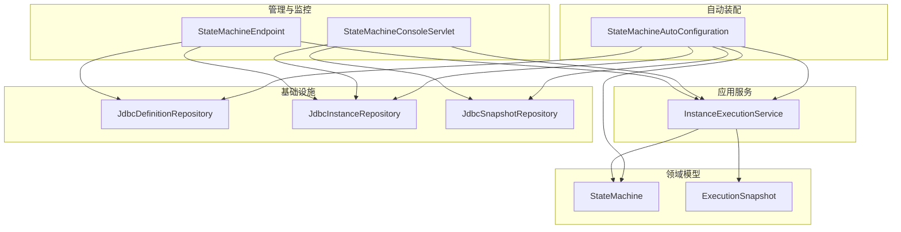
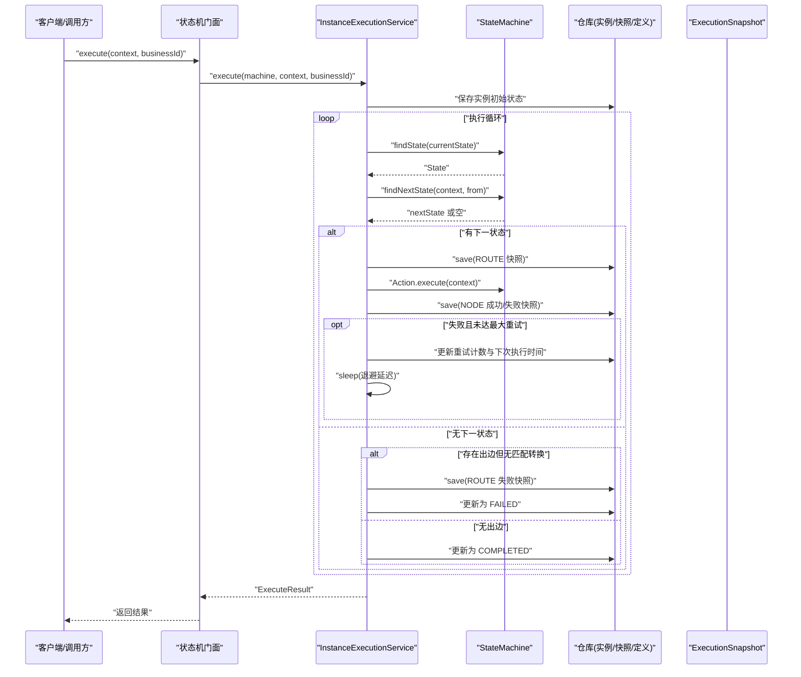
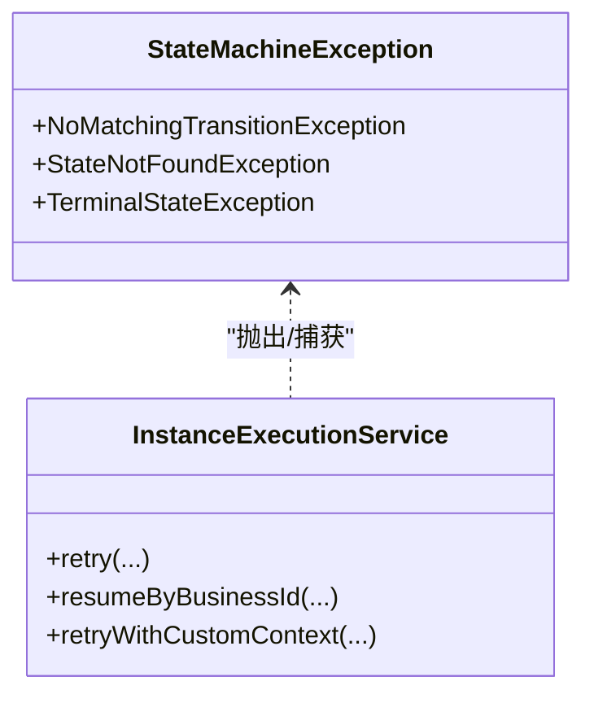
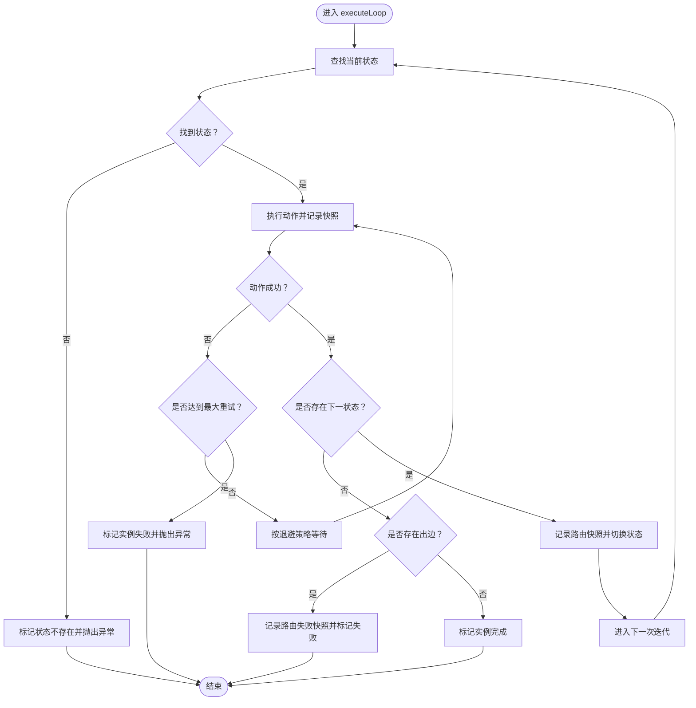
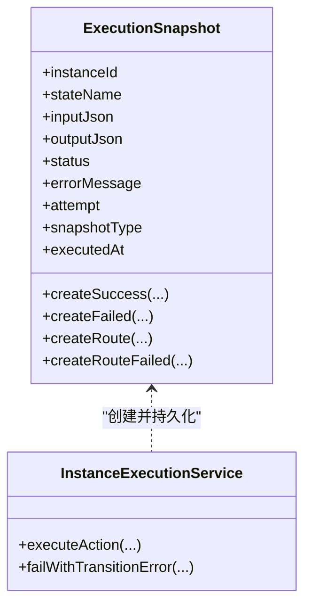
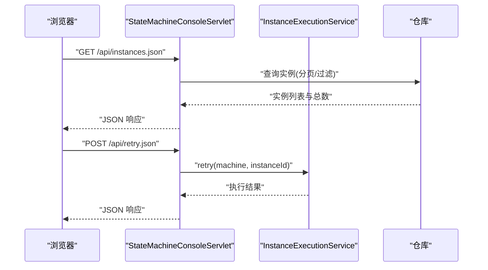
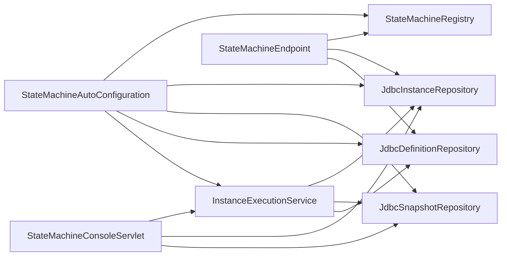

# 故障排除与诊断

<cite>
**本文引用的文件**
- [StateMachineException.java](file://state-machine-boot-starter/src/main/java/cn/chedejun/statemachine/core/StateMachineException.java)
- [StateMachine.java](file://state-machine-boot-starter/src/main/java/cn/chedejun/statemachine/domain/engine/StateMachine.java)
- [InstanceExecutionService.java](file://state-machine-boot-starter/src/main/java/cn/chedejun/statemachine/application/InstanceExecutionService.java)
- [ExecutionSnapshot.java](file://state-machine-boot-starter/src/main/java/cn/chedejun/statemachine/domain/snapshot/ExecutionSnapshot.java)
- [RetryPolicy.java](file://state-machine-boot-starter/src/main/java/cn/chedejun/statemachine/core/RetryPolicy.java)
- [StateMachineConsoleServlet.java](file://state-machine-boot-starter/src/main/java/cn/chedejun/statemachine/management/StateMachineConsoleServlet.java)
- [StateMachineEndpoint.java](file://state-machine-boot-starter/src/main/java/cn/chedejun/statemachine/management/StateMachineEndpoint.java)
- [StateMachineAutoConfiguration.java](file://state-machine-boot-starter/src/main/java/cn/chedejun/statemachine/autoconfigure/StateMachineAutoConfiguration.java)
- [index.html](file://state-machine-boot-starter/src/main/resources/console/index.html)
- [StateMachineIntegrationTest.java](file://state-machine-boot-starter/src/test/java/cn/chedejun/statemachine/integration/StateMachineIntegrationTest.java)
- [application.yml（测试）](file://state-machine-boot-starter/src/test/resources/application.yml)
- [application.yml（演示）](file://state-machine-boot-starter/src/main/resources/application.yml)
</cite>

## 目录
1. [简介](#简介)
2. [项目结构](#项目结构)
3. [核心组件](#核心组件)
4. [架构总览](#架构总览)
5. [详细组件分析](#详细组件分析)
6. [依赖分析](#依赖分析)
7. [性能考虑](#性能考虑)
8. [故障排除指南](#故障排除指南)
9. [结论](#结论)
10. [附录](#附录)

## 简介
本指南面向运维与开发人员，聚焦于状态机执行过程中的常见问题与系统化诊断方法。内容覆盖状态转换失败、条件判断异常、上下文数据丢失等典型错误的定位与修复；提供日志分析、快照检查、执行追踪等调试策略；解释异常处理与重试恢复机制；详解控制台与监控端点的使用；给出性能诊断工具与优化建议，并提供常见问题的快速解决方案与预防措施。

## 项目结构
该状态机框架采用分层与职责分离设计：
- 核心领域模型与执行引擎位于 domain/engine 与 application 层
- 管理与监控通过 Servlet 与 Actuator 端点暴露
- 自动装配负责 Bean 注册与开关控制
- 控制台前端提供可视化界面与交互操作

**图表来源**
- [StateMachineAutoConfiguration.java:32-149](file://state-machine-boot-starter/src/main/java/cn/chedejun/statemachine/autoconfigure/StateMachineAutoConfiguration.java#L32-L149)
- [InstanceExecutionService.java:24-296](file://state-machine-boot-starter/src/main/java/cn/chedejun/statemachine/application/InstanceExecutionService.java#L24-L296)
- [StateMachine.java:19-77](file://state-machine-boot-starter/src/main/java/cn/chedejun/statemachine/domain/engine/StateMachine.java#L19-L77)
- [ExecutionSnapshot.java:11-73](file://state-machine-boot-starter/src/main/java/cn/chedejun/statemachine/domain/snapshot/ExecutionSnapshot.java#L11-L73)
- [StateMachineConsoleServlet.java:39-420](file://state-machine-boot-starter/src/main/java/cn/chedejun/statemachine/management/StateMachineConsoleServlet.java#L39-L420)
- [StateMachineEndpoint.java:22-80](file://state-machine-boot-starter/src/main/java/cn/chedejun/statemachine/management/StateMachineEndpoint.java#L22-L80)

**章节来源**
- [StateMachineAutoConfiguration.java:32-149](file://state-machine-boot-starter/src/main/java/cn/chedejun/statemachine/autoconfigure/StateMachineAutoConfiguration.java#L32-L149)
- [StateMachineConsoleServlet.java:39-420](file://state-machine-boot-starter/src/main/java/cn/chedejun/statemachine/management/StateMachineConsoleServlet.java#L39-L420)
- [StateMachineEndpoint.java:22-80](file://state-machine-boot-starter/src/main/java/cn/chedejun/statemachine/management/StateMachineEndpoint.java#L22-L80)

## 核心组件
- 异常体系：提供状态机执行期的专用异常类型，便于区分“无匹配转换”、“状态不存在”、“实例处于终止状态”等场景。
- 执行引擎：封装状态执行循环、动作执行、路由决策、重试与快照记录。
- 快照模型：区分节点执行快照与路由决策快照，支持失败与成功的完整轨迹记录。
- 重试策略：指数退避策略，支持最大尝试次数、初始延迟、最大延迟与退避因子。
- 管理端点：控制台 Servlet 提供 Web UI 与 REST API；Actuator 端点提供只读查询。
- 自动装配：根据属性开关启用控制台与管理端点，注册仓库与执行服务。

**章节来源**
- [StateMachineException.java:3-18](file://state-machine-boot-starter/src/main/java/cn/chedejun/statemachine/core/StateMachineException.java#L3-L18)
- [InstanceExecutionService.java:24-296](file://state-machine-boot-starter/src/main/java/cn/chedejun/statemachine/application/InstanceExecutionService.java#L24-L296)
- [ExecutionSnapshot.java:11-73](file://state-machine-boot-starter/src/main/java/cn/chedejun/statemachine/domain/snapshot/ExecutionSnapshot.java#L11-L73)
- [RetryPolicy.java:5-45](file://state-machine-boot-starter/src/main/java/cn/chedejun/statemachine/core/RetryPolicy.java#L5-L45)
- [StateMachineConsoleServlet.java:39-420](file://state-machine-boot-starter/src/main/java/cn/chedejun/statemachine/management/StateMachineConsoleServlet.java#L39-L420)
- [StateMachineEndpoint.java:22-80](file://state-machine-boot-starter/src/main/java/cn/chedejun/statemachine/management/StateMachineEndpoint.java#L22-L80)

## 架构总览
状态机执行从应用服务开始，经过状态查找、动作执行、条件判断与路由，最终写入快照并更新实例状态。失败时记录失败快照并触发重试或终止。管理端点与控制台提供实例与定义的查询、重试与恢复操作。

**图表来源**
- [InstanceExecutionService.java:43-296](file://state-machine-boot-starter/src/main/java/cn/chedejun/statemachine/application/InstanceExecutionService.java#L43-L296)
- [StateMachine.java:50-76](file://state-machine-boot-starter/src/main/java/cn/chedejun/statemachine/domain/engine/StateMachine.java#L50-L76)
- [ExecutionSnapshot.java:38-61](file://state-machine-boot-starter/src/main/java/cn/chedejun/statemachine/domain/snapshot/ExecutionSnapshot.java#L38-L61)

**章节来源**
- [InstanceExecutionService.java:43-296](file://state-machine-boot-starter/src/main/java/cn/chedejun/statemachine/application/InstanceExecutionService.java#L43-L296)
- [StateMachine.java:19-77](file://state-machine-boot-starter/src/main/java/cn/chedejun/statemachine/domain/engine/StateMachine.java#L19-L77)

## 详细组件分析

### 异常与错误分类
- 无匹配转换：当某状态下存在出边但无满足条件的转换时抛出，用于提示转换规则或上下文问题。
- 状态不存在：状态机定义缺失或实例状态异常导致无法定位状态。
- 终止状态：对已完成或失败的实例进行非法操作时抛出。
- 上下文反序列化失败：JSON 结构与上下文类不匹配导致反序列化异常。

**图表来源**
- [StateMachineException.java:3-18](file://state-machine-boot-starter/src/main/java/cn/chedejun/statemachine/core/StateMachineException.java#L3-L18)
- [InstanceExecutionService.java:79-152](file://state-machine-boot-starter/src/main/java/cn/chedejun/statemachine/application/InstanceExecutionService.java#L79-L152)

**章节来源**
- [StateMachineException.java:3-18](file://state-machine-boot-starter/src/main/java/cn/chedejun/statemachine/core/StateMachineException.java#L3-L18)
- [InstanceExecutionService.java:79-152](file://state-machine-boot-starter/src/main/java/cn/chedejun/statemachine/application/InstanceExecutionService.java#L79-L152)

### 执行循环与重试机制
- 执行循环上限：基于状态数与最大重试次数估算迭代上限，防止无限循环。
- 动作执行：捕获异常并记录失败快照，按策略推进重试计数与延迟。
- 路由决策：若无匹配转换且存在出边，则记录路由失败并标记实例失败；否则标记完成。
- 恢复与重试：仅允许对失败实例进行重试；恢复需校验预期状态与上下文一致性。

**图表来源**
- [InstanceExecutionService.java:158-193](file://state-machine-boot-starter/src/main/java/cn/chedejun/statemachine/application/InstanceExecutionService.java#L158-L193)
- [InstanceExecutionService.java:200-237](file://state-machine-boot-starter/src/main/java/cn/chedejun/statemachine/application/InstanceExecutionService.java#L200-L237)
- [RetryPolicy.java:26-30](file://state-machine-boot-starter/src/main/java/cn/chedejun/statemachine/core/RetryPolicy.java#L26-L30)

**章节来源**
- [InstanceExecutionService.java:158-237](file://state-machine-boot-starter/src/main/java/cn/chedejun/statemachine/application/InstanceExecutionService.java#L158-L237)
- [RetryPolicy.java:5-45](file://state-machine-boot-starter/src/main/java/cn/chedejun/statemachine/core/RetryPolicy.java#L5-L45)

### 快照与数据一致性
- 快照类型：NODE（节点执行）与 ROUTE（路由决策），分别记录输入/输出与目标状态。
- 失败与成功：动作失败记录失败快照并推进重试；路由失败记录路由失败快照并终止。
- 上下文一致性：恢复时从最近的成功 NODE 快照中提取上下文，再应用合并器，确保与预期状态一致。

**图表来源**
- [ExecutionSnapshot.java:11-73](file://state-machine-boot-starter/src/main/java/cn/chedejun/statemachine/domain/snapshot/ExecutionSnapshot.java#L11-L73)
- [InstanceExecutionService.java:200-275](file://state-machine-boot-starter/src/main/java/cn/chedejun/statemachine/application/InstanceExecutionService.java#L200-L275)

**章节来源**
- [ExecutionSnapshot.java:11-73](file://state-machine-boot-starter/src/main/java/cn/chedejun/statemachine/domain/snapshot/ExecutionSnapshot.java#L11-L73)
- [InstanceExecutionService.java:200-275](file://state-machine-boot-starter/src/main/java/cn/chedejun/statemachine/application/InstanceExecutionService.java#L200-L275)

### 控制台与监控端点
- 控制台 Servlet：提供概览、状态机定义、实例列表与详情、恢复/重试等操作的 REST API 与 Web UI。
- Actuator 端点：提供只读查询，如列出状态机、获取版本定义、重试失败实例（写操作说明）。
- 前端页面：提供流程图展示、实例筛选、时间线快照查看、恢复对话框等。

**图表来源**
- [StateMachineConsoleServlet.java:113-158](file://state-machine-boot-starter/src/main/java/cn/chedejun/statemachine/management/StateMachineConsoleServlet.java#L113-L158)
- [StateMachineConsoleServlet.java:321-348](file://state-machine-boot-starter/src/main/java/cn/chedejun/statemachine/management/StateMachineConsoleServlet.java#L321-L348)
- [StateMachineEndpoint.java:71-78](file://state-machine-boot-starter/src/main/java/cn/chedejun/statemachine/management/StateMachineEndpoint.java#L71-L78)

**章节来源**
- [StateMachineConsoleServlet.java:65-158](file://state-machine-boot-starter/src/main/java/cn/chedejun/statemachine/management/StateMachineConsoleServlet.java#L65-L158)
- [StateMachineEndpoint.java:40-78](file://state-machine-boot-starter/src/main/java/cn/chedejun/statemachine/management/StateMachineEndpoint.java#L40-L78)
- [index.html:288-461](file://state-machine-boot-starter/src/main/resources/console/index.html#L288-L461)

## 依赖分析
- 组件耦合：执行服务依赖仓库与定义解析；控制台与端点依赖执行服务与仓库；自动装配负责注册与开关控制。
- 外部依赖：JDBC、Spring Boot 自动装配、Actuator、Servlet 容器。
- 循环依赖：未见直接循环依赖，各层职责清晰。

**图表来源**
- [StateMachineAutoConfiguration.java:39-70](file://state-machine-boot-starter/src/main/java/cn/chedejun/statemachine/autoconfigure/StateMachineAutoConfiguration.java#L39-L70)
- [StateMachineConsoleServlet.java:44-61](file://state-machine-boot-starter/src/main/java/cn/chedejun/statemachine/management/StateMachineConsoleServlet.java#L44-L61)
- [StateMachineEndpoint.java:30-38](file://state-machine-boot-starter/src/main/java/cn/chedejun/statemachine/management/StateMachineEndpoint.java#L30-L38)

**章节来源**
- [StateMachineAutoConfiguration.java:39-70](file://state-machine-boot-starter/src/main/java/cn/chedejun/statemachine/autoconfigure/StateMachineAutoConfiguration.java#L39-L70)

## 性能考虑
- 日志级别：在演示配置中开启 JDBC 模板与语句参数的调试级别，有助于定位慢查询与异常 SQL。
- 查询优化：控制台与端点支持分页与过滤，避免一次性加载大量实例；建议结合数据库索引与分页参数合理设置。
- 重试退避：指数退避减少抖动，但过多重试会放大延迟；建议根据业务 SLA 调整最大尝试次数与延迟参数。
- 快照规模：NODE 与 ROUTE 快照均持久化，建议定期归档或清理历史数据，避免表膨胀。

**章节来源**
- [application.yml（演示）:18-27](file://state-machine-boot-starter/src/main/resources/application.yml#L18-L27)
- [RetryPolicy.java:26-30](file://state-machine-boot-starter/src/main/java/cn/chedejun/statemachine/core/RetryPolicy.java#L26-L30)
- [StateMachineConsoleServlet.java:197-244](file://state-machine-boot-starter/src/main/java/cn/chedejun/statemachine/management/StateMachineConsoleServlet.java#L197-L244)

## 故障排除指南

### 常见错误与诊断方法
- 状态转换失败
  - 现象：实例卡在某状态或被标记为失败，路由失败快照存在。
  - 诊断：检查状态机定义的转换条件与上下文字段；确认当前上下文是否满足条件。
  - 处理：修正条件表达式或补充上下文数据；必要时重试失败实例。
  - 参考
    - [StateMachine.java:63-71](file://state-machine-boot-starter/src/main/java/cn/chedejun/statemachine/domain/engine/StateMachine.java#L63-L71)
    - [InstanceExecutionService.java:268-275](file://state-machine-boot-starter/src/main/java/cn/chedejun/statemachine/application/InstanceExecutionService.java#L268-L275)

- 条件判断异常
  - 现象：动作执行前的条件判断导致无匹配转换。
  - 诊断：核对条件函数逻辑与上下文字段；查看路由失败快照的错误信息。
  - 处理：修复条件函数或调整上下文；重试失败实例。
  - 参考
    - [InstanceExecutionService.java:178-184](file://state-machine-boot-starter/src/main/java/cn/chedejun/statemachine/application/InstanceExecutionService.java#L178-L184)

- 上下文数据丢失
  - 现象：恢复时上下文为空或反序列化失败。
  - 诊断：检查恢复请求中的 JSON 是否有效；查看最近成功 NODE 快照的 output 字段。
  - 处理：补全 JSON 并合并到上下文；确保上下文类与 JSON 结构一致。
  - 参考
    - [InstanceExecutionService.java:125-134](file://state-machine-boot-starter/src/main/java/cn/chedejun/statemachine/application/InstanceExecutionService.java#L125-L134)
    - [InstanceExecutionService.java:255-260](file://state-machine-boot-starter/src/main/java/cn/chedejun/statemachine/application/InstanceExecutionService.java#L255-L260)

- 实例处于终止状态
  - 现象：对已完成或失败实例进行恢复/重试时报错。
  - 诊断：确认实例当前状态；仅对 FAILED 实例进行重试。
  - 处理：先重置为 RUNNING 再执行重试；或在控制台选择合适的操作。
  - 参考
    - [StateMachineException.java:15-17](file://state-machine-boot-starter/src/main/java/cn/chedejun/statemachine/core/StateMachineException.java#L15-L17)
    - [StateMachineEndpoint.java:71-78](file://state-machine-boot-starter/src/main/java/cn/chedejun/statemachine/management/StateMachineEndpoint.java#L71-L78)

### 系统化调试策略
- 日志分析
  - 开启 JDBC 调试日志，观察 SQL 执行情况与参数绑定。
  - 关注动作执行失败的日志条目，定位异常堆栈与重试次数。
  - 参考
    - [application.yml（演示）:23-27](file://state-machine-boot-starter/src/main/resources/application.yml#L23-L27)
    - [InstanceExecutionService.java:214-236](file://state-machine-boot-starter/src/main/java/cn/chedejun/statemachine/application/InstanceExecutionService.java#L214-L236)

- 快照检查
  - 查看 NODE 成功/失败快照的输入/输出 JSON，确认上下文与结果。
  - 查看 ROUTE 快照的目标状态与错误信息，定位转换失败原因。
  - 参考
    - [ExecutionSnapshot.java:38-61](file://state-machine-boot-starter/src/main/java/cn/chedejun/statemachine/domain/snapshot/ExecutionSnapshot.java#L38-L61)
    - [StateMachineConsoleServlet.java:255-268](file://state-machine-boot-starter/src/main/java/cn/chedejun/statemachine/management/StateMachineConsoleServlet.java#L255-L268)

- 执行追踪
  - 使用控制台实例详情页查看时间线，逐步回溯执行路径。
  - 对挂起实例使用恢复功能，指定预期状态与上下文合并器。
  - 参考
    - [index.html:331-461](file://state-machine-boot-starter/src/main/resources/console/index.html#L331-L461)
    - [StateMachineConsoleServlet.java:270-319](file://state-machine-boot-starter/src/main/java/cn/chedejun/statemachine/management/StateMachineConsoleServlet.java#L270-L319)

### 异常处理与恢复策略
- 重试失败后的处理
  - 仅对 FAILED 实例进行重试；从最后一次失败快照中提取上下文。
  - 若为 ROUTE 类型，需重新计算下一状态并校验目标状态存在性。
  - 参考
    - [InstanceExecutionService.java:79-114](file://state-machine-boot-starter/src/main/java/cn/chedejun/statemachine/application/InstanceExecutionService.java#L79-L114)

- 数据一致性保证
  - 恢复时仅取 SUCCESS 类型且非 ROUTE 的 NODE 快照作为上下文来源。
  - 恢复与状态更新合并为原子操作，避免并发冲突。
  - 参考
    - [InstanceExecutionService.java:125-142](file://state-machine-boot-starter/src/main/java/cn/chedejun/statemachine/application/InstanceExecutionService.java#L125-L142)

### 控制台与监控端点使用
- 实时状态监控
  - 控制台概览页统计运行中/失败/挂起实例数量，支持按状态过滤。
  - 实例详情页展示流程图与时间线，支持重试与恢复。
  - 参考
    - [index.html:60-143](file://state-machine-boot-starter/src/main/resources/console/index.html#L60-L143)
    - [index.html:145-287](file://state-machine-boot-starter/src/main/resources/console/index.html#L145-L287)

- 历史数据分析
  - 使用控制台的分页与过滤参数查询历史实例，结合快照 JSON 分析问题根因。
  - 参考
    - [StateMachineConsoleServlet.java:197-244](file://state-machine-boot-starter/src/main/java/cn/chedejun/statemachine/management/StateMachineConsoleServlet.java#L197-L244)

- 端点操作
  - Actuator 端点提供只读查询；控制台提供写操作（重试、恢复）。
  - 参考
    - [StateMachineEndpoint.java:40-78](file://state-machine-boot-starter/src/main/java/cn/chedejun/statemachine/management/StateMachineEndpoint.java#L40-L78)
    - [StateMachineConsoleServlet.java:142-158](file://state-machine-boot-starter/src/main/java/cn/chedejun/statemachine/management/StateMachineConsoleServlet.java#L142-L158)

### 性能问题诊断
- 慢查询分析
  - 开启 JDBC 调试日志，定位耗时 SQL；结合数据库 EXPLAIN 分析索引与执行计划。
  - 参考
    - [application.yml（演示）:23-27](file://state-machine-boot-starter/src/main/resources/application.yml#L23-L27)

- 资源瓶颈识别
  - 观察重试延迟与 CPU/IO 使用率，评估退避策略是否过长。
  - 控制台分页参数限制单次查询规模，避免内存压力。
  - 参考
    - [RetryPolicy.java:26-30](file://state-machine-boot-starter/src/main/java/cn/chedejun/statemachine/core/RetryPolicy.java#L26-L30)
    - [StateMachineConsoleServlet.java:205-207](file://state-machine-boot-starter/src/main/java/cn/chedejun/statemachine/management/StateMachineConsoleServlet.java#L205-L207)

### 常见问题快速解决
- 重试失败实例
  - 在控制台选择 FAILED 实例并执行重试，系统将从最后失败快照恢复上下文并重新执行。
  - 参考
    - [StateMachineConsoleServlet.java:321-348](file://state-machine-boot-starter/src/main/java/cn/chedejun/statemachine/management/StateMachineConsoleServlet.java#L321-L348)

- 恢复挂起实例
  - 确认预期状态与上下文合并器，避免状态不一致导致恢复失败。
  - 参考
    - [InstanceExecutionService.java:119-152](file://state-machine-boot-starter/src/main/java/cn/chedejun/statemachine/application/InstanceExecutionService.java#L119-L152)
    - [StateMachineConsoleServlet.java:270-319](file://state-machine-boot-starter/src/main/java/cn/chedejun/statemachine/management/StateMachineConsoleServlet.java#L270-L319)

- 预防措施
  - 明确状态机定义与条件逻辑，确保上下文完整性；
  - 合理设置重试策略，避免过度重试；
  - 定期清理历史快照，保持数据库健康；
  - 使用控制台与端点进行日常巡检与问题定位。

**章节来源**
- [StateMachineConsoleServlet.java:197-348](file://state-machine-boot-starter/src/main/java/cn/chedejun/statemachine/management/StateMachineConsoleServlet.java#L197-L348)
- [InstanceExecutionService.java:79-152](file://state-machine-boot-starter/src/main/java/cn/chedejun/statemachine/application/InstanceExecutionService.java#L79-L152)
- [application.yml（演示）:18-27](file://state-machine-boot-starter/src/main/resources/application.yml#L18-L27)

## 结论
本指南提供了从异常分类、执行链路、快照模型到控制台与端点使用的系统化故障排除方法。通过日志、快照与执行追踪三结合，可高效定位状态转换失败、条件判断异常与上下文丢失等问题；配合合理的重试策略与数据一致性保障，能够稳定恢复与持续演进状态机系统。

## 附录
- 自动装配与开关
  - 通过属性启用控制台与管理端点，注册仓库与执行服务。
  - 参考
    - [StateMachineAutoConfiguration.java:111-147](file://state-machine-boot-starter/src/main/java/cn/chedejun/statemachine/autoconfigure/StateMachineAutoConfiguration.java#L111-L147)
    - [application.yml（测试）:8-14](file://state-machine-boot-starter/src/test/resources/application.yml#L8-L14)
    - [application.yml（演示）:11-16](file://state-machine-boot-starter/src/main/resources/application.yml#L11-L16)

- 端到端验证
  - 集成测试覆盖成功流、失败流、重试、挂起/恢复与控制台 API。
  - 参考
    - [StateMachineIntegrationTest.java:58-483](file://state-machine-boot-starter/src/test/java/cn/chedejun/statemachine/integration/StateMachineIntegrationTest.java#L58-L483)